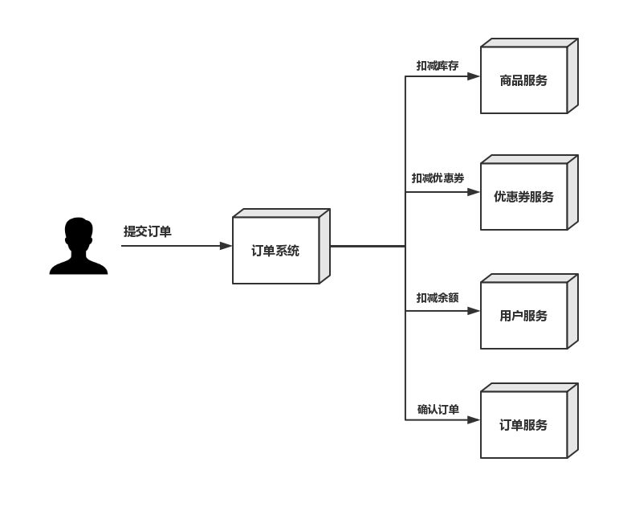

# 1. 案例介绍

## 1.1 业务分析

模拟电商网站购物场景中的【下单】和【支付】业务

###1）下单



1. 用户请求订单系统下单
2. 订单系统调用优惠券服务，扣减优惠券
3. 订单系统调用调用库存服务，校验并扣减库存
4. 订单系统调用订单服务生成订单

------

###2）支付


1. 用户请求支付系统
2. 支付系统调用第三方支付平台API进行发起支付流程
3. 用户通过第三方支付平台支付成功后，第三方支付平台回调通知支付系统
4. 支付系统调用订单服务修改订单状态
5. 支付系统调用积分服务添加积分
6. 支付系统调用日志服务记录日志

## 1.2 问题分析

### 问题1

用户提交订单后，扣减库存成功、扣减优惠券成功、使用余额成功，但是在确认订单操作失败，需要对库存、库存、余额进行回退。

如何保证数据的完整性？


<u>使用MQ保证在下单失败后系统数据的完整性</u>


###问题2

用户通过第三方支付平台（支付宝、微信）支付成功后，第三方支付平台要通过回调API异步通知商家支付系统用户支付结果，支付系统根据支付结果修改订单状态、记录支付日志和给用户增加积分。

商家支付系统如何保证在收到第三方支付平台的异步通知时，如何快速给第三方支付凭条做出回应？


<u>通过MQ进行数据分发，提高系统处理性能</u>


# 2. 技术分析

## 2.1 技术选型

- SpringBoot
- Dubbo
- Zookeeper
- RocketMQ
- Mysql

## 2.2 SpringBoot整合RocketMQ

下载[rocketmq-spring](https://github.com/apache/rocketmq-spring.git)项目

将rocketmq-spring安装到本地仓库

```shell
mvn install -Dmaven.skip.test=true
```

### 2.2.1 消息生产者

#### 1）添加依赖

```xml
<parent>
    <groupId>org.springframework.boot</groupId>
    <artifactId>spring-boot-starter-parent</artifactId>
    <version>2.0.1.RELEASE</version>
</parent>

<properties>
    <rocketmq-spring-boot-starter-version>2.0.3</rocketmq-spring-boot-starter-version>
</properties>

<dependencies>
    <dependency>
        <groupId>org.apache.rocketmq</groupId>
        <artifactId>rocketmq-spring-boot-starter</artifactId>
        <version>${rocketmq-spring-boot-starter-version}</version>
    </dependency>
    <dependency>
        <groupId>org.projectlombok</groupId>
        <artifactId>lombok</artifactId>
        <version>1.18.6</version>
    </dependency>
    <dependency>
        <groupId>org.springframework.boot</groupId>
        <artifactId>spring-boot-starter-test</artifactId>
        <scope>test</scope>
    </dependency>

</dependencies>
```

#### 2）配置文件

```properties
# application.properties
rocketmq.name-server=192.168.25.135:9876;192.168.25.138:9876
rocketmq.producer.group=my-group
```

#### 3）启动类

```java
@SpringBootApplication
public class MQProducerApplication {
    public static void main(String[] args) {
        SpringApplication.run(MQSpringBootApplication.class);
    }
}
```

#### 4）测试类

```java
@RunWith(SpringRunner.class)
@SpringBootTest(classes = {MQSpringBootApplication.class})
public class ProducerTest {

    @Autowired
    private RocketMQTemplate rocketMQTemplate;

    @Test
    public void test1(){
        rocketMQTemplate.convertAndSend("springboot-mq","hello springboot rocketmq");
    }
}
```

### 2.2.2 消息消费者

#### 1）添加依赖

同消息生产者

#### 2）配置文件

同消息生产者

#### 3）启动类

```java
@SpringBootApplication
public class MQConsumerApplication {
    public static void main(String[] args) {
        SpringApplication.run(MQSpringBootApplication.class);
    }
}
```

#### 4）消息监听器

```java
@Slf4j
@Component
@RocketMQMessageListener(topic = "springboot-mq",consumerGroup = "springboot-mq-consumer-1")
public class Consumer implements RocketMQListener<String> {

    @Override
    public void onMessage(String message) {
        log.info("Receive message："+message);
    }
}
```

## 2.3 SpringBoot整合Dubbo

下载[dubbo-spring-boot-starter](https://github.com/alibaba/dubbo-spring-boot-starter.git)依赖包

将```dubbo-spring-boot-starter```安装到本地仓库

```shell
mvn install -Dmaven.skip.test=true
```


### 2.3.1 搭建Zookeeper集群

#### 1）准备工作

1. 安装JDK
2. 将Zookeeper上传到服务器
3. 解压Zookeeper，并创建data目录，将conf下的zoo_sample.cfg文件改名为zoo.cfg
4. 建立```/user/local/zookeeper-cluster```,将解压后的Zookeeper复制到以下三个目录

```sh
/usr/local/zookeeper-cluster/zookeeper-1
/usr/local/zookeeper-cluster/zookeeper-2
/usr/local/zookeeper-cluster/zookeeper-3
```

5. 配置每一个 Zookeeper 的 dataDir（zoo.cfg） clientPort 分别为 2181 2182 2183

   修改```/usr/local/zookeeper-cluster/zookeeper-1/conf/zoo.cfg```

```shell
clientPort=2181
dataDir=/usr/local/zookeeper-cluster/zookeeper-1/data
```

​	修改/usr/local/zookeeper-cluster/zookeeper-2/conf/zoo.cfg

```shell
clientPort=2182
dataDir=/usr/local/zookeeper-cluster/zookeeper-2/data
```

​	修改/usr/local/zookeeper-cluster/zookeeper-3/conf/zoo.cfg

```shell
clientPort=2183
dataDir=/usr/local/zookeeper-cluster/zookeeper-3/data
```

#### 2）配置集群

1. 在每个 zookeeper 的 data 目录下创建一个 myid 文件，内容分别是 1、2、3 。这个文件就是记录每个服务器的 ID

2. 在每一个 zookeeper 的 zoo.cfg 配置客户端访问端口（clientPort）和集群服务器 IP 列表。

   集群服务器 IP 列表如下

```shell
server.1=192.168.25.140:2881:3881
server.2=192.168.25.140:2882:3882
server.3=192.168.25.140:2883:3883
```

解释：server.服务器 ID=服务器 IP 地址：服务器之间通信端口：服务器之间投票选举端口

#### 3）启动集群

启动集群就是分别启动每个实例。


### 2.3.2 RPC服务接口

```java
public interface IUserService {
    public String sayHello(String name);
}
```

### 2.3.3 服务提供者

#### 1）添加依赖

```xml
<parent>
    <groupId>org.springframework.boot</groupId>
    <artifactId>spring-boot-starter-parent</artifactId>
    <version>2.0.1.RELEASE</version>
</parent>

<dependencies>
    <!--dubbo-->
    <dependency>
        <groupId>com.alibaba.spring.boot</groupId>
        <artifactId>dubbo-spring-boot-starter</artifactId>
        <version>2.0.0</version>
    </dependency>
	<!--spring-boot-stater-->
    <dependency>
        <groupId>org.springframework.boot</groupId>
        <artifactId>spring-boot-starter</artifactId>
        <exclusions>
            <exclusion>
                <artifactId>log4j-to-slf4j</artifactId>
                <groupId>org.apache.logging.log4j</groupId>
            </exclusion>
        </exclusions>
    </dependency>
	<!--zookeeper-->
    <dependency>
        <groupId>org.apache.zookeeper</groupId>
        <artifactId>zookeeper</artifactId>
        <version>3.4.10</version>
        <exclusions>
            <exclusion>
                <groupId>org.slf4j</groupId>
                <artifactId>slf4j-log4j12</artifactId>
            </exclusion>
            <exclusion>
                <groupId>log4j</groupId>
                <artifactId>log4j</artifactId>
            </exclusion>
        </exclusions>
    </dependency>

    <dependency>
        <groupId>com.101tec</groupId>
        <artifactId>zkclient</artifactId>
        <version>0.9</version>
        <exclusions>
            <exclusion>
                <artifactId>slf4j-log4j12</artifactId>
                <groupId>org.slf4j</groupId>
            </exclusion>
        </exclusions>
    </dependency>
	<!--API-->
    <dependency>
        <groupId>com.itheima.demo</groupId>
        <artifactId>dubbo-api</artifactId>
        <version>1.0-SNAPSHOT</version>
    </dependency>

</dependencies>
```

#### 2）配置文件

```properties
# application.properties
spring.application.name=dubbo-demo-provider
spring.dubbo.application.id=dubbo-demo-provider
spring.dubbo.application.name=dubbo-demo-provider
spring.dubbo.registry.address=zookeeper://192.168.25.140:2181;zookeeper://192.168.25.140:2182;zookeeper://192.168.25.140:2183
spring.dubbo.server=true
spring.dubbo.protocol.name=dubbo
spring.dubbo.protocol.port=20880
```

#### 3）启动类

```java
@EnableDubboConfiguration
@SpringBootApplication
public class ProviderBootstrap {

    public static void main(String[] args) throws IOException {
        SpringApplication.run(ProviderBootstrap.class,args);
    }

}
```

#### 4）服务实现

```java
@Component
@Service(interfaceClass = IUserService.class)
public class UserServiceImpl implements IUserService{
    @Override
    public String sayHello(String name) {
        return "hello:"+name;
    }
}
```

### 2.3.4 服务消费者

#### 1）添加依赖

```xml
<parent>
        <groupId>org.springframework.boot</groupId>
        <artifactId>spring-boot-starter-parent</artifactId>
        <version>2.0.1.RELEASE</version>
    </parent>

<dependencies>

    <dependency>
        <groupId>org.springframework.boot</groupId>
        <artifactId>spring-boot-starter-web</artifactId>
    </dependency>

    <!--dubbo-->
    <dependency>
        <groupId>com.alibaba.spring.boot</groupId>
        <artifactId>dubbo-spring-boot-starter</artifactId>
        <version>2.0.0</version>
    </dependency>

    <dependency>
        <groupId>org.springframework.boot</groupId>
        <artifactId>spring-boot-starter</artifactId>
        <exclusions>
            <exclusion>
                <artifactId>log4j-to-slf4j</artifactId>
                <groupId>org.apache.logging.log4j</groupId>
            </exclusion>
        </exclusions>
    </dependency>

    <!--zookeeper-->
    <dependency>
        <groupId>org.apache.zookeeper</groupId>
        <artifactId>zookeeper</artifactId>
        <version>3.4.10</version>
        <exclusions>
            <exclusion>
                <groupId>org.slf4j</groupId>
                <artifactId>slf4j-log4j12</artifactId>
            </exclusion>
            <exclusion>
                <groupId>log4j</groupId>
                <artifactId>log4j</artifactId>
            </exclusion>
        </exclusions>
    </dependency>

    <dependency>
        <groupId>com.101tec</groupId>
        <artifactId>zkclient</artifactId>
        <version>0.9</version>
        <exclusions>
            <exclusion>
                <artifactId>slf4j-log4j12</artifactId>
                <groupId>org.slf4j</groupId>
            </exclusion>
        </exclusions>
    </dependency>

    <!--API-->
    <dependency>
        <groupId>com.itheima.demo</groupId>
        <artifactId>dubbo-api</artifactId>
        <version>1.0-SNAPSHOT</version>
    </dependency>

</dependencies>
```

#### 2）配置文件

```properties
# application.properties
spring.application.name=dubbo-demo-consumer
spring.dubbo.application.name=dubbo-demo-consumer
spring.dubbo.application.id=dubbo-demo-consumer
spring.dubbo.registry.address=zookeeper://192.168.25.140:2181;zookeeper://192.168.25.140:2182;zookeeper://192.168.25.140:2183
```

#### 3）启动类

```java
@EnableDubboConfiguration
@SpringBootApplication
public class ConsumerBootstrap {
    public static void main(String[] args) {
        SpringApplication.run(ConsumerBootstrap.class);
    }
}
```

#### 4）Controller

```java
@RestController
@RequestMapping("/user")
public class UserController {

    @Reference
    private IUserService userService;

    @RequestMapping("/sayHello")
    public String sayHello(String name){
        return userService.sayHello(name);
    }

}
```

# 3. 环境搭建

## 3.1 数据库

### 1）优惠券表

| Field        | Type                | Comment                  |
| ------------ | ------------------- | ------------------------ |
| coupon_id    | bigint(50) NOT NULL | 优惠券ID                 |
| coupon_price | decimal(10,2) NULL  | 优惠券金额               |
| user_id      | bigint(50) NULL     | 用户ID                   |
| order_id     | bigint(32) NULL     | 订单ID                   |
| is_used      | int(1) NULL         | 是否使用 0未使用 1已使用 |
| used_time    | timestamp NULL      | 使用时间                 |

### 2）商品表

| Field        | Type                | Comment  |
| ------------ | ------------------- | -------- |
| goods_id     | bigint(50) NOT NULL | 主键     |
| goods_name   | varchar(255) NULL   | 商品名称 |
| goods_number | int(11) NULL        | 商品库存 |
| goods_price  | decimal(10,2) NULL  | 商品价格 |
| goods_desc   | varchar(255) NULL   | 商品描述 |
| add_time     | timestamp NULL      | 添加时间 |

### 3）订单表

| Field           | Type                | Comment                                      |
| --------------- | ------------------- | -------------------------------------------- |
| order_id        | bigint(50) NOT NULL | 订单ID                                       |
| user_id         | bigint(50) NULL     | 用户ID                                       |
| order_status    | int(1) NULL         | 订单状态 0未确认 1已确认 2已取消 3无效 4退款 |
| pay_status      | int(1) NULL         | 支付状态 0未支付 1支付中 2已支付             |
| shipping_status | int(1) NULL         | 发货状态 0未发货 1已发货 2已收货             |
| address         | varchar(255) NULL   | 收货地址                                     |
| consignee       | varchar(255) NULL   | 收货人                                       |
| goods_id        | bigint(50) NULL     | 商品ID                                       |
| goods_number    | int(11) NULL        | 商品数量                                     |
| goods_price     | decimal(10,2) NULL  | 商品价格                                     |
| goods_amount    | decimal(10,0) NULL  | 商品总价                                     |
| shipping_fee    | decimal(10,2) NULL  | 运费                                         |
| order_amount    | decimal(10,2) NULL  | 订单价格                                     |
| coupon_id       | bigint(50) NULL     | 优惠券ID                                     |
| coupon_paid     | decimal(10,2) NULL  | 优惠券                                       |
| money_paid      | decimal(10,2) NULL  | 已付金额                                     |
| pay_amount      | decimal(10,2) NULL  | 支付金额                                     |
| add_time        | timestamp NULL      | 创建时间                                     |
| confirm_time    | timestamp NULL      | 订单确认时间                                 |
| pay_time        | timestamp NULL      | 支付时间                                     |

### 4）订单商品日志表

| Field        | Type                 | Comment  |
| ------------ | -------------------- | -------- |
| goods_id     | int(11) NOT NULL     | 商品ID   |
| order_id     | varchar(32) NOT NULL | 订单ID   |
| goods_number | int(11) NULL         | 库存数量 |
| log_time     | datetime NULL        |          |

### 5）用户表

| Field         | Type                | Comment  |
| ------------- | ------------------- | -------- |
| user_id       | bigint(50) NOT NULL | 用户ID   |
| user_name     | varchar(255) NULL   | 用户姓名 |
| user_password | varchar(255) NULL   | 用户密码 |
| user_mobile   | varchar(255) NULL   | 手机号   |
| user_score    | int(11) NULL        | 积分     |
| user_reg_time | timestamp NULL      | 注册时间 |
| user_money    | decimal(10,0) NULL  | 用户余额 |

### 6）用户余额日志表

| Field          | Type                | Comment                       |
| -------------- | ------------------- | ----------------------------- |
| user_id        | bigint(50) NOT NULL | 用户ID                        |
| order_id       | bigint(50) NOT NULL | 订单ID                        |
| money_log_type | int(1) NOT NULL     | 日志类型 1订单付款 2 订单退款 |
| use_money      | decimal(10,2) NULL  |                               |
| create_time    | timestamp NULL      | 日志时间                      |

### 7）订单支付表

| Field      | Type                | Comment            |
| ---------- | ------------------- | ------------------ |
| pay_id     | bigint(50) NOT NULL | 支付编号           |
| order_id   | bigint(50) NULL     | 订单编号           |
| pay_amount | decimal(10,2) NULL  | 支付金额           |
| is_paid    | int(1) NULL         | 是否已支付 1否 2是 |

### 8）MQ消息生产表

| Field       | Type                  | Comment             |
| ----------- | --------------------- | ------------------- |
| id          | varchar(100) NOT NULL |                     |
| group_name  | varchar(100) NULL     |                     |
| msg_topic   | varchar(100) NULL     |                     |
| msg_tag     | varchar(100) NULL     |                     |
| msg_key     | varchar(100) NULL     |                     |
| msg_body    | varchar(500) NULL     |                     |
| msg_status  | int(1) NULL           | 0:未处理;1:已经处理 |
| create_time | timestamp NOT NULL    |                     |

###9）MQ消息消费表

| Field              | Type                  | Comment                          |
| ------------------ | --------------------- | -------------------------------- |
| msg_id             | varchar(50) NULL      |                                  |
| group_name         | varchar(100) NOT NULL |                                  |
| msg_tag            | varchar(100) NOT NULL |                                  |
| msg_key            | varchar(100) NOT NULL |                                  |
| msg_body           | varchar(500) NULL     |                                  |
| consumer_status    | int(1) NULL           | 0:正在处理;1:处理成功;2:处理失败 |
| consumer_times     | int(1) NULL           |                                  |
| consumer_timestamp | timestamp NULL        |                                  |
| remark             | varchar(500) NULL     |                                  |

## 3.2 项目初始化

shop系统基于Maven进行项目管理

### 3.1.1 工程浏览


- 父工程：shop-parent
- 订单系统：shop-order-web
- 支付系统：shop-pay-web
- 优惠券服务：shop-coupon-service
- 订单服务：shop-order-service
- 支付服务：shop-pay-service
- 商品服务：shop-goods-service
- 用户服务：shop-user-service
- 实体类：shop-pojo
- 持久层：shop-dao
- 接口层：shop-api
- 工具工程：shop-common

共12个系统

### 3.1.2 工程关系


## 3.3 Mybatis逆向工程使用

### 1）代码生成

使用Mybatis逆向工程针对数据表生成CURD持久层代码

###2）代码导入

* 将实体类导入到shop-pojo工程
* 在服务层工程中导入对应的Mapper类和对应配置文件

# 4. 下单业务


## 4.1 下单基本流程

###1）校验订单

###2）生成预订单

###3）扣减库存

###4）扣减优惠券

###5）扣减用户余额

###6）确认订单 

## 4.2 失败补偿机制

### 1）发送下单失败消息

### 2）回退库存

### 3）回退优惠券

### 4）回退余额

### 5）取消订单

## 4.3 测试

* 测试下单成功流程
* 测试下单失败流程

# 5. 支付业务

# 6. 整体联调