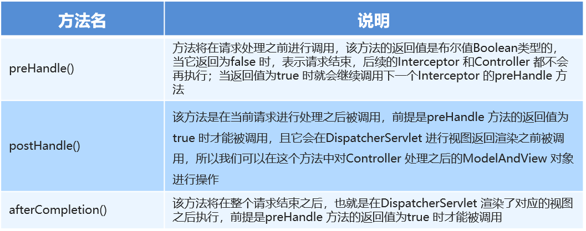
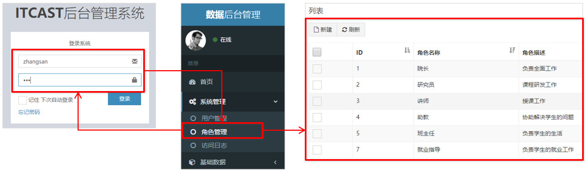

# SpringMVC的文件上传

### 1-SpringMVC的请求-文件上传-客户端表单实现(应用)

文件上传客户端表单需要满足：

表单项type=“file” name="XXX"

表单的提交方式是post

表单的enctype属性是多部分表单形式，及enctype=“multipart/form-data”

```jsp
<form action="${pageContext.request.contextPath}/user/quick22" method="post" enctype="multipart/form-data">
        名称<input type="text" name="username"><br/>
        文件1<input type="file" name="uploadFile"><br/>
        <input type="submit" value="提交">
    </form>
```

### 2-SpringMVC的请求-文件上传-文件上传的原理(理解)


### 3-SpringMVC的请求-文件上传-单文件上传的代码实现1(应用)

添加依赖

```xml
<dependency>
      <groupId>commons-fileupload</groupId>
      <artifactId>commons-fileupload</artifactId>
      <version>1.3.1</version>
    </dependency>
    <dependency>
      <groupId>commons-io</groupId>
      <artifactId>commons-io</artifactId>
      <version>2.3</version>
    </dependency>
```

配置多媒体解析器

```xml
<!--配置文件上传解析器-->
    <bean id="multipartResolver" class="org.springframework.web.multipart.commons.CommonsMultipartResolver">
        <property name="defaultEncoding" value="UTF-8"/>
        <property name="maxUploadSize" value="500000"/>
    </bean>
```

后台程序

```java
@RequestMapping(value="/quick22")
    @ResponseBody
    public void save22(String username, MultipartFile uploadFile) throws IOException {
        System.out.println(username);
       	System.out.println(uploadFile);
    }
```

### 4-SpringMVC的请求-文件上传-单文件上传的代码实现2(应用)

完成文件上传

```java
@RequestMapping(value="/quick22")
    @ResponseBody
    public void save22(String username, MultipartFile uploadFile) throws IOException {
        System.out.println(username);
        //获得上传文件的名称
        String originalFilename = uploadFile.getOriginalFilename();
        uploadFile.transferTo(new File("C:\\upload\\"+originalFilename));
    }
```


### 5-SpringMVC的请求-文件上传-多文件上传的代码实现(应用)

多文件上传，只需要将页面修改为多个文件上传项，将方法参数MultipartFile类型修改为MultipartFile[]即可

```jsp
<form action="${pageContext.request.contextPath}/user/quick23" method="post" enctype="multipart/form-data">
        名称<input type="text" name="username"><br/>
        文件1<input type="file" name="uploadFile"><br/>
        文件2<input type="file" name="uploadFile"><br/>
        <input type="submit" value="提交">
    </form>
```

```java
@RequestMapping(value="/quick23")
    @ResponseBody
    public void save23(String username, MultipartFile[] uploadFile) throws IOException {
        System.out.println(username);
        for (MultipartFile multipartFile : uploadFile) {
            String originalFilename = multipartFile.getOriginalFilename();
            multipartFile.transferTo(new File("C:\\upload\\"+originalFilename));
        }
    }
```

### 6-SpringMVC的请求-知识要点(理解，记忆)


# SpringMVC的拦截器

## 01-SpringMVC拦截器-拦截器的作用(理解)

Spring MVC 的拦截器类似于 Servlet  开发中的过滤器 Filter，用于对处理器进行预处理和后处理。

将拦截器按一定的顺序联结成一条链，这条链称为拦截器链（InterceptorChain）。在访问被拦截的方法或字段时，拦截器链中的拦截器就会按其之前定义的顺序被调用。拦截器也是AOP思想的具体实现。

## 02-SpringMVC拦截器-interceptor和filter区别(理解，记忆)

关于interceptor和filter的区别，如图所示：


## 03-SpringMVC拦截器-快速入门(应用)

自定义拦截器很简单，只有如下三步：

①创建拦截器类实现HandlerInterceptor接口

②配置拦截器

③测试拦截器的拦截效果


编写拦截器：

```java
public class MyInterceptor1 implements HandlerInterceptor {
    //在目标方法执行之前 执行
    public boolean preHandle(HttpServletRequest request, HttpServletResponse response, Object handler) throws ServletException, IOException {
        System.out.println("preHandle.....");
}
    //在目标方法执行之后 视图对象返回之前执行
    public void postHandle(HttpServletRequest request, HttpServletResponse response, Object handler, ModelAndView modelAndView) {
System.out.println("postHandle...");
    }
    //在流程都执行完毕后 执行
    public void afterCompletion(HttpServletRequest request, HttpServletResponse response, Object handler, Exception ex) {
        System.out.println("afterCompletion....");
    }
}

```

配置：在SpringMVC的配置文件中配置

```xml
<!--配置拦截器-->
    <mvc:interceptors>
        <mvc:interceptor>
            <!--对哪些资源执行拦截操作-->
            <mvc:mapping path="/**"/>
            <bean class="com.itheima.interceptor.MyInterceptor1"/>
        </mvc:interceptor>
    </mvc:interceptors>

```

编写测试程序测试：

编写Controller,发请求到controller,跳转页面

```java
@Controller
public class TargetController {

    @RequestMapping("/target")
    public ModelAndView show(){
        System.out.println("目标资源执行......");
        ModelAndView modelAndView = new ModelAndView();
        modelAndView.addObject("name","itcast");
        modelAndView.setViewName("index");
        return modelAndView;
    }

}
```

页面

```jsp
<html>
<body>
<h2>Hello World! ${name}</h2>
</body>
</html>
```


## 04-SpringMVC拦截器-快速入门详解(应用)

拦截器在预处理后什么情况下会执行目标资源，什么情况下不执行目标资源，以及在有多个拦截器的情况下拦截器的执行顺序是什么?

再编写一个拦截器2，

```java
public class MyInterceptor2 implements HandlerInterceptor {
    //在目标方法执行之前 执行
    public boolean preHandle(HttpServletRequest request, HttpServletResponse response, Object handler) throws ServletException, IOException {
        System.out.println("preHandle22222.....");
        return true;
    }

    //在目标方法执行之后 视图对象返回之前执行
    public void postHandle(HttpServletRequest request, HttpServletResponse response, Object handler, ModelAndView modelAndView) {
        System.out.println("postHandle2222...");
    }

    //在流程都执行完毕后 执行
    public void afterCompletion(HttpServletRequest request, HttpServletResponse response, Object handler, Exception ex) {
        System.out.println("afterCompletion2222....");
    }
}
```

配置拦截器2

```xml
<!--配置拦截器-->
    <mvc:interceptors>
        <mvc:interceptor>
            <!--对哪些资源执行拦截操作-->
            <mvc:mapping path="/**"/>
            <bean class="com.itheima.interceptor.MyInterceptor2"/>
        </mvc:interceptor>
        <mvc:interceptor>
            <!--对哪些资源执行拦截操作-->
            <mvc:mapping path="/**"/>
            <bean class="com.itheima.interceptor.MyInterceptor1"/>
        </mvc:interceptor>
    </mvc:interceptors>

```

结论：

当拦截器的preHandle方法返回true则会执行目标资源，如果返回false则不执行目标资源

多个拦截器情况下，配置在前的先执行，配置在后的后执行

拦截器中的方法执行顺序是：preHandler-------目标资源----postHandle---- afterCompletion

## 05-SpringMVC拦截器-知识小结(记忆)

拦截器中的方法说明如下




## 06-SpringMVC拦截器-用户登录权限控制分析(理解)

在day06-Spring练习案例的基础之上：用户没有登录的情况下，不能对后台菜单进行访问操作，点击菜单跳转到登录页面，只有用户登录成功后才能进行后台功能的操作

需求图：



## 07-SpringMVC拦截器-用户登录权限控制代码实现1(应用)

判断用户是否登录  本质：判断session中有没有user，如果没有登陆则先去登陆，如果已经登陆则直接放行访问目标资源

先编写拦截器如下：

```java
public class PrivilegeInterceptor implements HandlerInterceptor {
    public boolean preHandle(HttpServletRequest request, HttpServletResponse response, Object handler) throws IOException {
        //逻辑：判断用户是否登录  本质：判断session中有没有user
        HttpSession session = request.getSession();
        User user = (User) session.getAttribute("user");
        if(user==null){
            //没有登录
            response.sendRedirect(request.getContextPath()+"/login.jsp");
            return false;
        }
        //放行  访问目标资源
        return true;
    }
}

```

然后配置该拦截器：找到项目案例的spring-mvc.xml，添加如下配置：

```xml
<!--配置权限拦截器-->
    <mvc:interceptors>
        <mvc:interceptor>
            <!--配置对哪些资源执行拦截操作-->
            <mvc:mapping path="/**"/>
            <bean class="com.itheima.interceptor.PrivilegeInterceptor"/>
        </mvc:interceptor>
    </mvc:interceptors>

```


## 08-SpringMVC拦截器-用户登录权限控制代码实现2(应用)

在登陆页面输入用户名密码，点击登陆，通过用户名密码进行查询，如果登陆成功，则将用户信息实体存入session，然后跳转到首页，如果登陆失败则继续回到登陆页面

在UserController中编写登陆逻辑

```java
@RequestMapping("/login")
    public String login(String username,String password,HttpSession session){
        User user = userService.login(username,password);
        if(user!=null){
            //登录成功  将user存储到session
            session.setAttribute("user",user);
            return "redirect:/index.jsp";
        }
        return "redirect:/login.jsp";
    }

```

service层代码如下：

```java
//service层
public User login(String username, String password) {
            User user = userDao.findByUsernameAndPassword(username,password);
            return user;
}

```

dao层代码如下：

```java
//dao层
 public User findByUsernameAndPassword(String username, String password) throws EmptyResultDataAccessException{
        User user = jdbcTemplate.queryForObject("select * from sys_user where username=? and password=?", new BeanPropertyRowMapper<User>(User.class), username, password);
        return user;
    }

```

此时仍然登陆不上，因为我们需要将登陆请求url让拦截器放行,添加资源排除的配置

```xml
<!--配置权限拦截器-->
    <mvc:interceptors>
        <mvc:interceptor>
            <!--配置对哪些资源执行拦截操作-->
            <mvc:mapping path="/**"/>
            <!--配置哪些资源排除拦截操作-->
            <mvc:exclude-mapping path="/user/login"/>
            <bean class="com.itheima.interceptor.PrivilegeInterceptor"/>
        </mvc:interceptor>
    </mvc:interceptors>
```


## 09-SpringMVC拦截器-用户登录权限控制代码实现3(应用)

JdbcTemplate.queryForObject对象如果查询不到数据会抛异常，导致程序无法达到预期效果，如何来解决该问题？

在业务层处理来自dao层的异常，如果出现异常service层返回null,而不是将异常抛给controller

因此改造登陆的业务层代码,添加异常的控制

```java
public User login(String username, String password) {
        try {
            User user = userDao.findByUsernameAndPassword(username,password);
            return user;
        }catch (EmptyResultDataAccessException e){
            return null;
        }
    }

```

# SpringMVC异常处理机制

### 1.1 异常处理的思路

系统中异常包括两类：预期异常和运行时异常RuntimeException，前者通过捕获异常从而获取异常信息，后者主要通过规范代码开发、测试等手段减少运行时异常的发生。

系统的Dao、Service、Controller出现都通过throws Exception向上抛出，最后由SpringMVC前端控制器交由异常处理器进行异常处理，如下图：


### 1.2 异常处理两种方式

① 使用Spring MVC提供的简单异常处理器SimpleMappingExceptionResolver

② 实现Spring的异常处理接口HandlerExceptionResolver 自定义自己的异常处理器

### 1.3 简单异常处理器SimpleMappingExceptionResolver

SpringMVC已经定义好了该类型转换器，在使用时可以根据项目情况进行相应异常与视图的映射配置

```xml
<!--配置简单映射异常处理器-->
    <bean class=“org.springframework.web.servlet.handler.SimpleMappingExceptionResolver”>    <property name=“defaultErrorView” value=“error”/>   默认错误视图
    <property name=“exceptionMappings”>
        <map>		异常类型		                             错误视图
            <entry key="com.itheima.exception.MyException" value="error"/>
            <entry key="java.lang.ClassCastException" value="error"/>
        </map>
    </property>
</bean>
```

### 1.4 自定义异常处理步骤

①创建异常处理器类实现HandlerExceptionResolver

```java
public class MyExceptionResolver implements HandlerExceptionResolver {
@Override
public ModelAndView resolveException(HttpServletRequest request, 
    HttpServletResponse response, Object handler, Exception ex) {
    //处理异常的代码实现
    //创建ModelAndView对象
    ModelAndView modelAndView = new ModelAndView(); 
    modelAndView.setViewName("exceptionPage");
    return modelAndView;
    }
}
```

②配置异常处理器

```xml
<bean id="exceptionResolver"        
      class="com.itheima.exception.MyExceptionResolver"/>
```

③编写异常页面

```html
<%@ page contentType="text/html;charset=UTF-8" language="java" %>
<html>
<head>
	<title>Title</title>
</head>
<body>
	这是一个最终异常的显示页面
</body>
</html>
```

④测试异常跳转

```java
@RequestMapping("/quick22")
@ResponseBody
public void quickMethod22() throws IOException, ParseException {
    SimpleDateFormat simpleDateFormat = new SimpleDateFormat("yyyy-MM-dd"); 
    simpleDateFormat.parse("abcde");
}
```

### 1.5 知识要点 

异常处理方式

1. SimpleMappingExceptionResolver

    配置简单异常处理器SimpleMappingExceptionResolver

2. 自定义异常处理器

    ①创建异常处理器类实现HandlerExceptionResolver
    
    ②配置异常处理器
    
    ③编写异常页面
    
    ④测试异常跳转

# SSM框架整合 

## 1.1 原始方式整合

### 1.准备工作


### 2.创建Maven工程


### 3.导入Maven坐标

参考：**素材/配置文件/pom.xml文件**

### 4.编写实体类

```java
public class Account {
    private int id;
    private String name;
    private double money;
    //省略getter和setter方法
}
```

### 5.编写Mapper接口

```java
public interface AccountMapper {
    //保存账户数据
    void save(Account account);
    //查询账户数据
    List<Account> findAll();
}
```

### 6.编写Service接口

```java
public interface AccountService {
    void save(Account account); //保存账户数据
    List<Account> findAll(); //查询账户数据
}
```

### 7.编写Service接口实现

```java
@Service("accountService")
public class AccountServiceImpl implements AccountService {
    public void save(Account account) {
        SqlSession sqlSession = MyBatisUtils.openSession();
        AccountMapper accountMapper = sqlSession.getMapper(AccountMapper.class);
        accountMapper.save(account);
        sqlSession.commit();
        sqlSession.close();
    }
    public List<Account> findAll() {
        SqlSession sqlSession = MyBatisUtils.openSession();
        AccountMapper accountMapper = sqlSession.getMapper(AccountMapper.class);
        return accountMapper.findAll();
    }
}
```

### 8.编写Controller

```java
@Controller
public class AccountController {
    @Autowired
    private AccountService accountService;
    @RequestMapping("/save")
    @ResponseBody
    public String save(Account account){
        accountService.save(account);
        return "save success";
    }
    @RequestMapping("/findAll")
    public ModelAndView findAll(){
        ModelAndView modelAndView = new ModelAndView();
        modelAndView.setViewName("accountList");
        modelAndView.addObject("accountList",accountService.findAll());
        return modelAndView;
    }
}
```

### 9.编写添加页面

```html
<%@ page contentType="text/html;charset=UTF-8" language="java" %>
<html>
<head>
    <title>Title</title>
</head>
<body>
    <h1>保存账户信息表单</h1>
    <form action="${pageContext.request.contextPath}/save.action" method="post">
        用户名称<input type="text" name="name"><br/>
        账户金额<input type="text" name="money"><br/>
        <input type="submit" value="保存"><br/>
    </form>
</body>
</html>
```

### 10.编写列表页面

```html
<table border="1">
    <tr>
        <th>账户id</th>
        <th>账户名称</th>
        <th>账户金额</th>
    </tr>
    <c:forEach items="${accountList}" var="account">
        <tr>
            <td>${account.id}</td>
            <td>${account.name}</td>
            <td>${account.money}</td>
        </tr>
    </c:forEach>
</table>
```

### 11.编写相应配置文件(文件参考目录：素材/配置文件)

•Spring配置文件：[applicationContext.xml](配置文件/applicationContext.xml)

•SprngMVC配置文件：[spring-mvc.xml](配置文件/spring-mvc.xml)

•MyBatis映射文件：[AccountMapper.xml](配置文件/AccountMapper.xml)

•MyBatis核心文件：[sqlMapConfig.xml](配置文件/sqlMapConfig.xml)

•数据库连接信息文件：[jdbc.properties](配置文件/jdbc.properties)

•Web.xml文件：[web.xml](配置文件/web.xml)

•日志文件：[log4j.xml](配置文件/log4j.properties)

### 12.测试添加账户


### 13.测试账户列表


## 1.2 Spring整合MyBatis

### 1.整合思路


### 2.将SqlSessionFactory配置到Spring容器中

```xml
<!--加载jdbc.properties-->
<context:property-placeholder location="classpath:jdbc.properties"/>
<!--配置数据源-->
<bean id="dataSource" class="com.mchange.v2.c3p0.ComboPooledDataSource">
    <property name="driverClass" value="${jdbc.driver}"/>
    <property name="jdbcUrl" value="${jdbc.url}"/>
    <property name="user" value="${jdbc.username}"/>
    <property name="password" value="${jdbc.password}"/>
</bean>
<!--配置MyBatis的SqlSessionFactory-->
<bean id="sqlSessionFactory" class="org.mybatis.spring.SqlSessionFactoryBean">
    <property name="dataSource" ref="dataSource"/>
    <property name="configLocation" value="classpath:sqlMapConfig.xml"/>
</bean>
```

### 3.扫描Mapper，让Spring容器产生Mapper实现类

```xml
<!--配置Mapper扫描-->
<bean class="org.mybatis.spring.mapper.MapperScannerConfigurer">
    <property name="basePackage" value="com.itheima.mapper"/>
</bean>
```

### 4.配置声明式事务控制

```xml
<!--配置声明式事务控制-->
<bean id="transacionManager" class="org.springframework.jdbc.datasource.DataSourceTransactionManager">
    <property name="dataSource" ref="dataSource"/>
</bean>
<tx:advice id="txAdvice" transaction-manager="transacionManager">
    <tx:attributes>
        <tx:method name="*"/>
    </tx:attributes>
</tx:advice>
<aop:config>
    <aop:pointcut id="txPointcut" expression="execution(* com.itheima.service.impl.*.*(..))"/>
    <aop:advisor advice-ref="txAdvice" pointcut-ref="txPointcut"/>
</aop:config>
```

### 5.修改Service实现类代码

```java
@Service("accountService")
public class AccountServiceImpl implements AccountService {

    @Autowired
    private AccountMapper accountMapper;

    public void save(Account account) {
        accountMapper.save(account);
    }
    public List<Account> findAll() {
        return accountMapper.findAll();
    }
}
```


