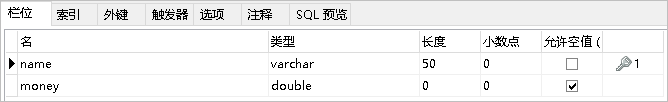
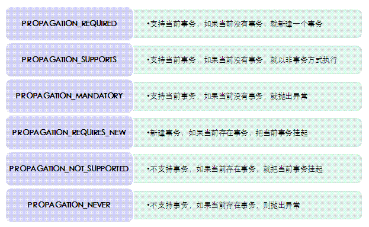

# JdbcTemplate基本使用

## 01-JdbcTemplate基本使用-概述(了解)

JdbcTemplate是spring框架中提供的一个对象，是对原始繁琐的Jdbc API对象的简单封装。spring框架为我们提供了很多的操作模板类。例如：操作关系型数据的JdbcTemplate和HibernateTemplate，操作nosql数据库的RedisTemplate，操作消息队列的JmsTemplate等等。

## 02-JdbcTemplate基本使用-开发步骤(理解)

①导入spring-jdbc和spring-tx坐标

②创建数据库表和实体

③创建JdbcTemplate对象

④执行数据库操作

## 03-JdbcTemplate基本使用-快速入门代码实现(应用)

导入spring-jdbc和spring-tx坐标

```xml
<?xml version="1.0" encoding="UTF-8"?>

<project xmlns="http://maven.apache.org/POM/4.0.0" xmlns:xsi="http://www.w3.org/2001/XMLSchema-instance"
  xsi:schemaLocation="http://maven.apache.org/POM/4.0.0 http://maven.apache.org/xsd/maven-4.0.0.xsd">
  <modelVersion>4.0.0</modelVersion>
  <groupId>com.itheima</groupId>
  <artifactId>itheima_spring_jdbc</artifactId>
  <version>1.0-SNAPSHOT</version>
  <packaging>war</packaging>

  <name>itheima_spring_jdbc Maven Webapp</name>
  <!-- FIXME change it to the project's website -->
  <url>http://www.example.com</url>
  <dependencies>
    <dependency>
      <groupId>mysql</groupId>
      <artifactId>mysql-connector-java</artifactId>
      <version>5.1.32</version>
    </dependency>
    <dependency>
      <groupId>c3p0</groupId>
      <artifactId>c3p0</artifactId>
      <version>0.9.1.2</version>
    </dependency>
    <dependency>
      <groupId>com.alibaba</groupId>
      <artifactId>druid</artifactId>
      <version>1.1.10</version>
    </dependency>
    <dependency>
      <groupId>junit</groupId>
      <artifactId>junit</artifactId>
      <version>4.12</version>
      <scope>test</scope>
    </dependency>
    <dependency>
      <groupId>org.springframework</groupId>
      <artifactId>spring-context</artifactId>
      <version>5.0.5.RELEASE</version>
    </dependency>
    <dependency>
      <groupId>org.springframework</groupId>
      <artifactId>spring-test</artifactId>
      <version>5.0.5.RELEASE</version>
    </dependency>
    <dependency>
      <groupId>org.springframework</groupId>
      <artifactId>spring-web</artifactId>
      <version>5.0.5.RELEASE</version>
    </dependency>
    <dependency>
      <groupId>org.springframework</groupId>
      <artifactId>spring-webmvc</artifactId>
      <version>5.0.5.RELEASE</version>
    </dependency>
    <dependency>
      <groupId>javax.servlet</groupId>
      <artifactId>javax.servlet-api</artifactId>
      <version>3.0.1</version>
      <scope>provided</scope>
    </dependency>
    <dependency>
      <groupId>javax.servlet.jsp</groupId>
      <artifactId>javax.servlet.jsp-api</artifactId>
      <version>2.2.1</version>
      <scope>provided</scope>
    </dependency>
    <dependency>
      <groupId>com.fasterxml.jackson.core</groupId>
      <artifactId>jackson-core</artifactId>
      <version>2.9.0</version>
    </dependency>
    <dependency>
      <groupId>com.fasterxml.jackson.core</groupId>
      <artifactId>jackson-databind</artifactId>
      <version>2.9.0</version>
    </dependency>
    <dependency>
      <groupId>com.fasterxml.jackson.core</groupId>
      <artifactId>jackson-annotations</artifactId>
      <version>2.9.0</version>
    </dependency>
    <dependency>
      <groupId>commons-fileupload</groupId>
      <artifactId>commons-fileupload</artifactId>
      <version>1.3.1</version>
    </dependency>
    <dependency>
      <groupId>commons-io</groupId>
      <artifactId>commons-io</artifactId>
      <version>2.3</version>
    </dependency>
    <dependency>
      <groupId>org.springframework</groupId>
      <artifactId>spring-jdbc</artifactId>
      <version>5.0.5.RELEASE</version>
    </dependency>
    <dependency>
      <groupId>org.springframework</groupId>
      <artifactId>spring-tx</artifactId>
      <version>5.0.5.RELEASE</version>
    </dependency>
  </dependencies>
</project>

```

创建数据库表和实体



```java
package com.itheima.domain;

public class Account {

    private String name;
    private double money;

    public String getName() {
        return name;
    }

    public void setName(String name) {
        this.name = name;
    }

    public double getMoney() {
        return money;
    }

    public void setMoney(double money) {
        this.money = money;
    }

    @Override
    public String toString() {
        return "Account{" +
                "name='" + name + '\'' +
                ", money=" + money +
                '}';
    }
}

```

创建JdbcTemplate对象

执行数据库操作

```java
@Test
    //测试JdbcTemplate开发步骤
    public void test1() throws PropertyVetoException {
        //创建数据源对象
        ComboPooledDataSource dataSource = new ComboPooledDataSource();
        dataSource.setDriverClass("com.mysql.jdbc.Driver");
        dataSource.setJdbcUrl("jdbc:mysql://localhost:3306/test");
        dataSource.setUser("root");
        dataSource.setPassword("root");

        JdbcTemplate jdbcTemplate = new JdbcTemplate();
        //设置数据源对象  知道数据库在哪
        jdbcTemplate.setDataSource(dataSource);
        //执行操作
        int row = jdbcTemplate.update("insert into account values(?,?)", "tom", 5000);
        System.out.println(row);

    }
```


## 04-JdbcTemplate基本使用-spring产生模板对象分析(理解)

我们可以将JdbcTemplate的创建权交给Spring，将数据源DataSource的创建权也交给Spring，在Spring容器内部将数据源DataSource注入到JdbcTemplate模版对象中,然后通过Spring容器获得JdbcTemplate对象来执行操作。

## 05-JdbcTemplate基本使用-spring产生模板对象代码实现(应用)

配置如下：

```xml
<!--数据源对象-->
    <bean id="dataSource" class="com.mchange.v2.c3p0.ComboPooledDataSource">
        <property name="driverClass" value="com.mysql.jdbc.Driver"></property>
        <property name="jdbcUrl" value="jdbc:mysql:///test"></property>
        <property name="user" value="root"></property>
        <property name="password" value="root"></property>
    </bean>

    <!--jdbc模板对象-->
    <bean id="jdbcTemplate" class="org.springframework.jdbc.core.JdbcTemplate">
        <property name="dataSource" ref="dataSource"/>
    </bean>

```

测试代码

```java
 @Test
    //测试Spring产生jdbcTemplate对象
    public void test2() throws PropertyVetoException {
        ApplicationContext app = new ClassPathXmlApplicationContext("applicationContext.xml");
        JdbcTemplate jdbcTemplate = app.getBean(JdbcTemplate.class);
        int row = jdbcTemplate.update("insert into account values(?,?)", "lisi", 5000);
        System.out.println(row);
    }
```

## 06-JdbcTemplate基本使用-spring产生模板对象代码实现（抽取jdbc.properties）(应用)

将数据库的连接信息抽取到外部配置文件中，和spring的配置文件分离开，有利于后期维护

```properties
jdbc.driver=com.mysql.jdbc.Driver
jdbc.url=jdbc:mysql://localhost:3306/test
jdbc.username=root
jdbc.password=root
```

配置文件修改为:

```xml
<?xml version="1.0" encoding="UTF-8"?>
<beans xmlns="http://www.springframework.org/schema/beans"
       xmlns:xsi="http://www.w3.org/2001/XMLSchema-instance"
       xmlns:context="http://www.springframework.org/schema/context"
       xsi:schemaLocation="
       http://www.springframework.org/schema/beans http://www.springframework.org/schema/beans/spring-beans.xsd
       http://www.springframework.org/schema/context http://www.springframework.org/schema/context/spring-context.xsd
">

    <!--加载jdbc.properties-->
    <context:property-placeholder location="classpath:jdbc.properties"/>

    <!--数据源对象-->
    <bean id="dataSource" class="com.mchange.v2.c3p0.ComboPooledDataSource">
        <property name="driverClass" value="${jdbc.driver}"/>
        <property name="jdbcUrl" value="${jdbc.url}"/>
        <property name="user" value="${jdbc.username}"/>
        <property name="password" value="${jdbc.password}"/>
    </bean>

    <!--jdbc模板对象-->
    <bean id="jdbcTemplate" class="org.springframework.jdbc.core.JdbcTemplate">
        <property name="dataSource" ref="dataSource"/>
    </bean>

</beans>
```

## 07-JdbcTemplate基本使用-常用操作-更新操作(应用)

```java
package com.itheima.test;

import com.itheima.domain.Account;
import org.junit.Test;
import org.junit.runner.RunWith;
import org.springframework.beans.factory.annotation.Autowired;
import org.springframework.jdbc.core.BeanPropertyRowMapper;
import org.springframework.jdbc.core.JdbcTemplate;
import org.springframework.test.context.ContextConfiguration;
import org.springframework.test.context.junit4.SpringJUnit4ClassRunner;

import java.util.List;

@RunWith(SpringJUnit4ClassRunner.class)
@ContextConfiguration("classpath:applicationContext.xml")
public class JdbcTemplateCRUDTest {

    @Autowired
    private JdbcTemplate jdbcTemplate;
    
	//修改更新
    @Test
    public void testUpdate(){
        jdbcTemplate.update("update account set money=? where name=?",10000,"tom");
    }
	//删除
    @Test
    public void testDelete(){
        jdbcTemplate.update("delete from account where name=?","tom");
    }

}

```


## 08-JdbcTemplate基本使用-常用操作-查询操作(应用)

```java
package com.itheima.test;

import com.itheima.domain.Account;
import org.junit.Test;
import org.junit.runner.RunWith;
import org.springframework.beans.factory.annotation.Autowired;
import org.springframework.jdbc.core.BeanPropertyRowMapper;
import org.springframework.jdbc.core.JdbcTemplate;
import org.springframework.test.context.ContextConfiguration;
import org.springframework.test.context.junit4.SpringJUnit4ClassRunner;

import java.util.List;

@RunWith(SpringJUnit4ClassRunner.class)
@ContextConfiguration("classpath:applicationContext.xml")
public class JdbcTemplateCRUDTest {

    @Autowired
    private JdbcTemplate jdbcTemplate;
    
	//聚合查询
    @Test
    public void testQueryCount(){
        Long count = jdbcTemplate.queryForObject("select count(*) from account", Long.class);
        System.out.println(count);
    }
	//查询一个
    @Test
    public void testQueryOne(){
        Account account = jdbcTemplate.queryForObject("select * from account where name=?", new BeanPropertyRowMapper<Account>(Account.class), "tom");
        System.out.println(account);
    }
	//查询所有
    @Test
    public void testQueryAll(){
        List<Account> accountList = jdbcTemplate.query("select * from account", new BeanPropertyRowMapper<Account>(Account.class));
        System.out.println(accountList);
    }

}
```

## 09-JdbcTemplate基本使用-知识要点(理解，记忆)

①导入spring-jdbc和spring-tx坐标

②创建数据库表和实体

③创建JdbcTemplate对象

    JdbcTemplate jdbcTemplate = newJdbcTemplate();
    jdbcTemplate.setDataSource(dataSource)；       
④执行数据库操作

    更新操作：
    
        jdbcTemplate.update (sql,params)
    
    查询操作：
    
        jdbcTemplate.query (sql,Mapper,params)
    
    	jdbcTemplate.queryForObject(sql,Mapper,params)

# 声明式事务控制

## 1. 编程式事务控制相关对象

### 1.1 PlatformTransactionManager 

PlatformTransactionManager 接口是 spring 的事务管理器，它里面提供了我们常用的操作事务的方法。


注意：

PlatformTransactionManager 是接口类型，不同的 Dao 层技术则有不同的实现类，例如：Dao 层技术是jdbc 或 mybatis 时：org.springframework.jdbc.datasource.DataSourceTransactionManager 

Dao 层技术是hibernate时：org.springframework.orm.hibernate5.HibernateTransactionManager

### 1.2 TransactionDefinition		

TransactionDefinition 是事务的定义信息对象，里面有如下方法：


#### 1. 事务隔离级别

设置隔离级别，可以解决事务并发产生的问题，如脏读、不可重复读和虚读。

- ISOLATION_DEFAULT

- ISOLATION_READ_UNCOMMITTED

- ISOLATION_READ_COMMITTED

- ISOLATION_REPEATABLE_READ

- ISOLATION_SERIALIZABLE

#### 2. 事务传播行为

- **REQUIRED：如果当前没有事务，就新建一个事务，如果已经存在一个事务中，加入到这个事务中。一般的选择（默认值）**
- **SUPPORTS：支持当前事务，如果当前没有事务，就以非事务方式执行（没有事务）**
- MANDATORY：使用当前的事务，如果当前没有事务，就抛出异常
- REQUERS_NEW：新建事务，如果当前在事务中，把当前事务挂起。
- NOT_SUPPORTED：以非事务方式执行操作，如果当前存在事务，就把当前事务挂起
- NEVER：以非事务方式运行，如果当前存在事务，抛出异常
- NESTED：如果当前存在事务，则在嵌套事务内执行。如果当前没有事务，则执行 REQUIRED 类似的操作
- 超时时间：默认值是-1，没有超时限制。如果有，以秒为单位进行设置
- 是否只读：建议查询时设置为只读



### 1.3 TransactionStatus

TransactionStatus 接口提供的是事务具体的运行状态，方法介绍如下。


### 1.4 知识要点

编程式事务控制三大对象

- PlatformTransactionManager

- TransactionDefinition

- TransactionStatus

## 2 基于 XML 的声明式事务控制

### 2.1 什么是声明式事务控制

Spring 的声明式事务顾名思义就是采用声明的方式来处理事务。这里所说的声明，就是指在配置文件中声明，用在 Spring 配置文件中声明式的处理事务来代替代码式的处理事务。

**声明式事务处理的作用**

- 事务管理不侵入开发的组件。具体来说，业务逻辑对象就不会意识到正在事务管理之中，事实上也应该如此，因为事务管理是属于系统层面的服务，而不是业务逻辑的一部分，如果想要改变事务管理策划的话，也只需要在定义文件中重新配置即可

- 在不需要事务管理的时候，只要在设定文件上修改一下，即可移去事务管理服务，无需改变代码重新编译，这样维护起来极其方便

**注意：Spring 声明式事务控制底层就是AOP。**


### 2.2 声明式事务控制的实现

声明式事务控制明确事项：

- 谁是切点？

- 谁是通知？

- 配置切面？

①引入tx命名空间

```xml
<beans xmlns="http://www.springframework.org/schema/beans"
       xmlns:xsi="http://www.w3.org/2001/XMLSchema-instance"
       xmlns:context="http://www.springframework.org/schema/context"
       xmlns:aop="http://www.springframework.org/schema/aop"
       xmlns:tx="http://www.springframework.org/schema/tx"
       xsi:schemaLocation="
        http://www.springframework.org/schema/context
        http://www.springframework.org/schema/context/spring-context.xsd
        http://www.springframework.org/schema/aop
        http://www.springframework.org/schema/aop/spring-aop.xsd
        http://www.springframework.org/schema/tx 
        http://www.springframework.org/schema/tx/spring-tx.xsd
        http://www.springframework.org/schema/beans
        http://www.springframework.org/schema/beans/spring-beans.xsd">


```

②配置事务增强

```xml
<!--平台事务管理器-->
<bean id="transactionManager" class="org.springframework.jdbc.datasource.DataSourceTransactionManager">
    <property name="dataSource" ref="dataSource"></property>
</bean>

<!--事务增强配置-->
<tx:advice id="txAdvice" transaction-manager="transactionManager">
    <tx:attributes>
        <tx:method name="*"/>
    </tx:attributes>
</tx:advice>
```

③配置事务 AOP 织入

```xml
<!--事务的aop增强-->
<aop:config>
    <aop:pointcut id="myPointcut" expression="execution(* com.itheima.service.impl.*.*(..))"/>
    <aop:advisor advice-ref="txAdvice" pointcut-ref="myPointcut"></aop:advisor>
</aop:config>
```

④测试事务控制转账业务代码

```java
@Override
public void transfer(String outMan, String inMan, double money) {
    accountDao.out(outMan,money);
    int i = 1/0;
    accountDao.in(inMan,money);
}
```

### 2.3 切点方法的事务参数的配置

```xml
<!--事务增强配置-->
<tx:advice id="txAdvice" transaction-manager="transactionManager">
    <tx:attributes>
        <tx:method name="*"/>
    </tx:attributes>
</tx:advice>
```

其中，<tx:method> 代表切点方法的事务参数的配置，例如：

```xml
<tx:method name="transfer" isolation="REPEATABLE_READ" propagation="REQUIRED" timeout="-1" read-only="false"/>
```

- name：切点方法名称

- isolation:事务的隔离级别

- propogation：事务的传播行为

- timeout：超时时间

- read-only：是否只读

### 2.4 知识要点

**声明式事务控制的配置要点**

- 平台事务管理器配置

- 事务通知的配置

- 事务aop织入的配置

## 3 基于注解的声明式事务控制

### 3.1 使用注解配置声明式事务控制

1. 编写 AccoutDao

```java
@Repository("accountDao")
public class AccountDaoImpl implements AccountDao {
    @Autowired
    private JdbcTemplate jdbcTemplate;
    public void out(String outMan, double money) {
        jdbcTemplate.update("update account set money=money-? where name=?",money,outMan);
    }
    public void in(String inMan, double money) {
        jdbcTemplate.update("update account set money=money+? where name=?",money,inMan);
    }
}
```

2. 编写 AccoutService

```java
@Service("accountService")
@Transactional
public class AccountServiceImpl implements AccountService {
    @Autowired
    private AccountDao accountDao;
    @Transactional(isolation = Isolation.READ_COMMITTED,propagation = Propagation.REQUIRED)
    public void transfer(String outMan, String inMan, double money) {
        accountDao.out(outMan,money);
        int i = 1/0;
        accountDao.in(inMan,money);
    }
}
```

3. 编写 applicationContext.xml 配置文件

```xml
<!—之前省略datsSource、jdbcTemplate、平台事务管理器的配置-->
<!--组件扫描-->
<context:component-scan base-package="com.itheima"/>
<!--事务的注解驱动-->
<tx:annotation-driven/>
```

### 3.2 注解配置声明式事务控制解析

①使用 @Transactional 在需要进行事务控制的类或是方法上修饰，注解可用的属性同 xml 配置方式，例如隔离级别、传播行为等。

②注解使用在类上，那么该类下的所有方法都使用同一套注解参数配置。

③使用在方法上，不同的方法可以采用不同的事务参数配置。

④Xml配置文件中要开启事务的注解驱动<tx:annotation-driven />

### 3.3 知识要点

**注解声明式事务控制的配置要点**

- 平台事务管理器配置（xml方式）

- 事务通知的配置（@Transactional注解配置）

- 事务注解驱动的配置 <tx:annotation-driven/>


   


