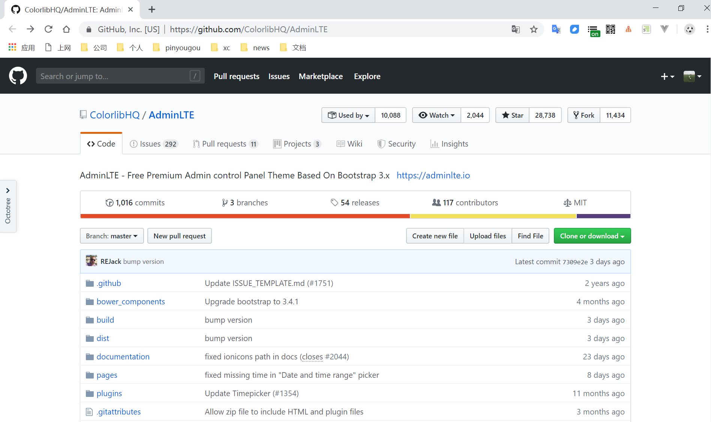
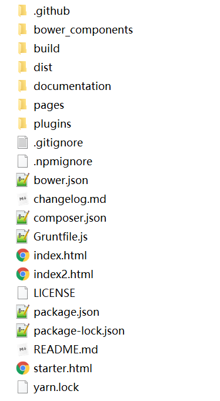
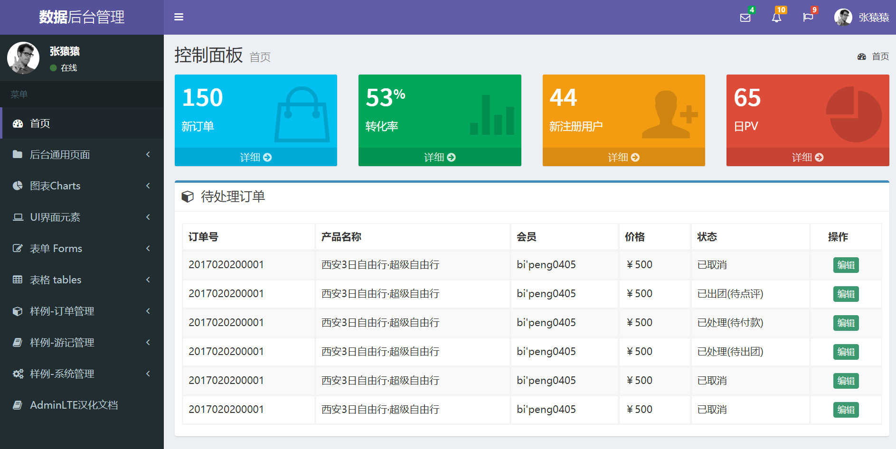
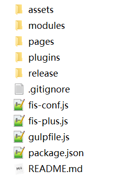
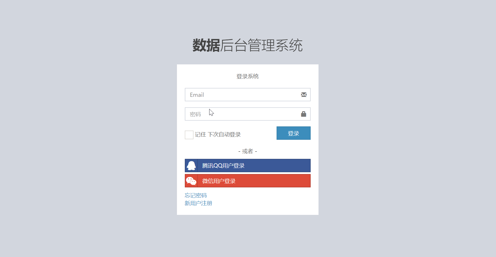
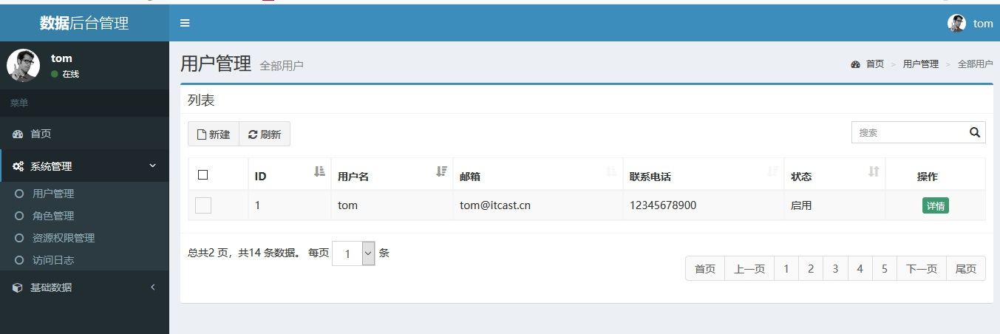
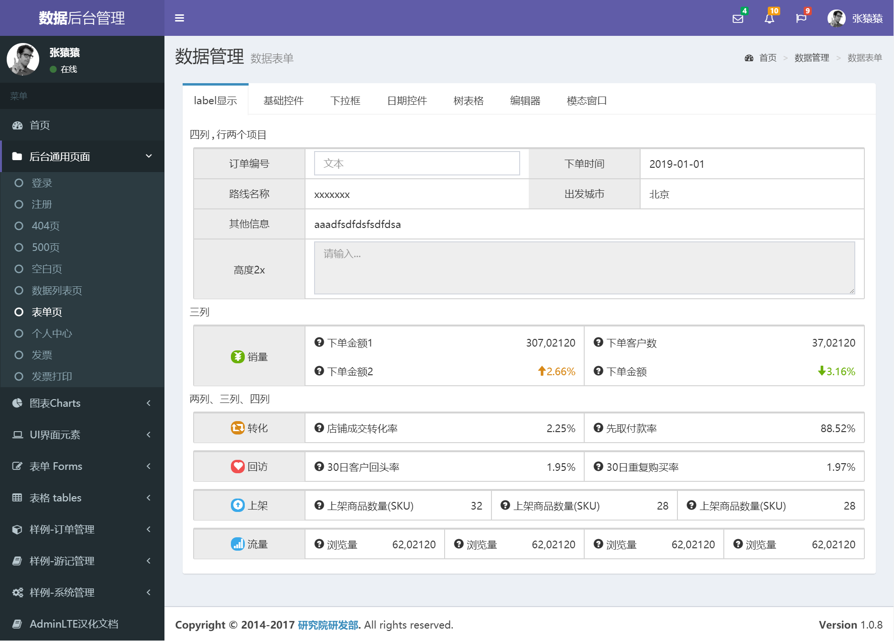

# 1. AdminLET快速入门

## 1.1 AdminLTE介绍

AdminLTE是一款建立在bootstrap和jquery之上的开源的模板主题工具，它提供了一系列响应的、可重复使用的组件，并内置了多个模板页面；同时自适应多种屏幕分辨率，兼容PC和移动端。通过AdminLTE，我们可以快速的创建一个响应式的Html5网站。AdminLTE框架在网页架构与设计上，有很大的辅助作用，尤其是前端架构设计师，用好AdminLTE 不但美观，而且可以免去写很大
CSS与JS的工作量。

### 1.1.1 GitHub获取AdminLTE

网址：[https://github.com/ColorlibHQ/AdminLTE](https://github.com/ColorlibHQ/AdminLTE)

我们可以从上面网址获取AdminLTE源代码



### 1.1.2 AdminLTE结构介绍

```tex
AdminLTE/
├── dist/
│ ├── CSS/
│ ├── JS
│ ├── img
├── build/
│ ├── less/
│ │ ├── AdminLTE's Less files
│ └── Bootstrap-less/ (Only for reference. No modifications have been made)
│ ├── mixins/
│ ├── variables.less
│ ├── mixins.less
└── plugins/
├── All the customized plugins CSS and JS files
```



AdminLTE依赖于两个框架Bootstrap3与JQuery1.11+

###1.1.3 AdminLTE布局与皮肤

####1）布局

.wrapper包住了body下的所有代码
.main-header里是网站的logo和导航栏的代码
.main-sidebar里是用户面板和侧边栏菜单的代码
.content-wrapper里是页面的页面和内容区域的代码
.main-footer里是页脚的代码
.control-sidebar里是页面右侧侧边栏区域的代码

####2）布局选项

fixed：固定
layout-boxed：盒子布局
layout-top-nav：顶部隐藏
sidebar-collapse：侧边栏隐藏
sidebar-mini：侧边栏隐藏时有小图标

####3）皮肤

skin-blue：蓝色
skin-black：黑色
skin-purple：紫色
skin-yellow：黄色
skin-red：红色
skin-green：绿色

以上项我们可以查看start.html页面中查看。

### 1.1.4 AdminLTE2-IT黑马-定制版

传智播客研究院针对英文版本AdminLTE进行了汉化，并优化与定制了部分页面，方便我们的学习与使用。后续SSM综合练习课程中使用的界面就是基于AdminLTE2-IT黑马-定制版。

大家可以去github上下载https://github.com/itheima2017/adminlte2-itheima

也可以在 http://research.itcast.cn/adminlte2-itcast/release/dist/pages/all-admin-index.html 在线进行浏览



我们将AdminLTE2-IT黑马-定制版本下载解压的目录结构如下：



由于AdminLTE2-IT黑马-定制版是基于FIS3进行开发，在目录结构中assets、modules、pages、plugins都是前端开发时所使用到的，最终发布的就是release。所以对于我们使用AdminLTE2-IT黑马-定制版来说，我们只需要关注release目录下的结构就可以。


在release目录下有css、img、pages、plugins目录。前两者就不在解决pages是产生的一些定制的页面，而plugins中是相关的插件，例如jquery、bootstrap等相关的css与js文件。

## 1.2 快速入门案例

本次入门案例我们基于AdminLTE2-IT黑马-定制版来完成

### 1.2.1 搭建环境

将AdminLTE2-IT黑马-定制版下的release目录下的css、img、plugins目录导入到我们自己的工程中

### 1.2.2 案例代码

浏览首页（all-admin-index.html）页面


# 2. 搭建SSM界面

## 2.1 首页

参考页面all-admin-index.html


## 2.2 登录页面

all-admin-login.html



## 2.3 用户管理页面

参考列表页面（all-admin-datalist.html）制作



## 2.4 角色管理页面

### 1）角色查询

参考列表页面（all-admin-datalist.html）制作


### 2）角色添加

参考列表页面（all-admin-dataform.html）制作



## 2.5 资源权限管理页面

### 1) 权限查询

参考列表页面（all-admin-datalist.html）制作


###2) 权限添加

参考列表页面（all-admin-dataform.html）制作


## 2.6 产品管理页面

### 1) 产品查询

参考列表页面（all-admin-datalist.html）制作


### 2) 产品详情

参考列表页面（all-admin-dataform.html）制作


### 3) 产品添加

参考列表页面（all-admin-dataform.html）制作


### 4）产品修改

参考列表页面（all-admin-dataform.html）制作


## 2.7 订单管理页面

### 1）订单查询
参考列表页面（all-admin-dataform.html）制作


### 2）订单详情
参考列表页面（all-admin-dataform.html）制作

