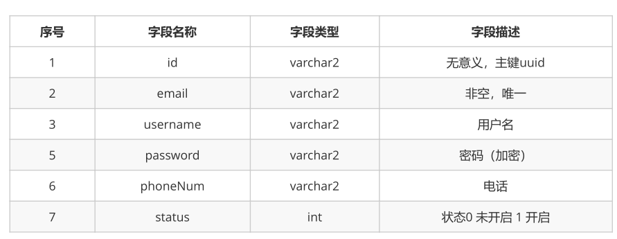
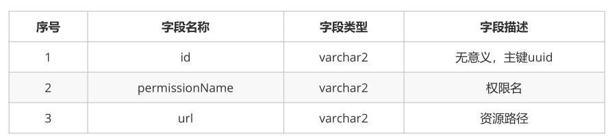
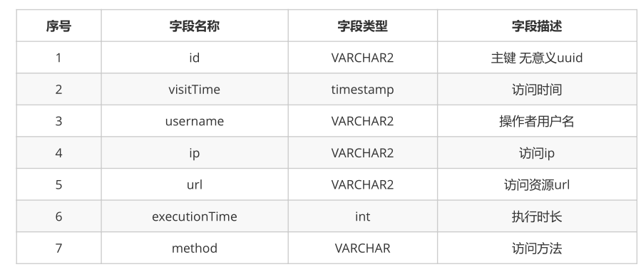
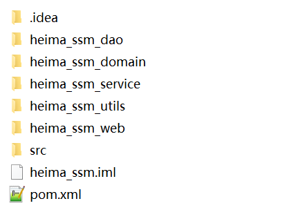

#1. 案例介绍

## 1.1 环境搭建

主要讲解maven工程搭建，以及基于oracle数据库的商品表信息，并完成SSM整合。

## 1.2 商品查询

基于SSM整合基础上完成商品查询，要掌握主面页面main.jsp及商品显示页面product-list.jsp页面的创建。

## 1.3 商品添加

进一步巩固SSM整合，并完成商品添加功能，要注意事务操作以及product-add.jsp页面生成。

## 1.4 订单查询

订单的查询操作，它主要完成简单的多表查询操作，查询订单时，需要查询出与订单关联的其它表中信息，所以大家一定要了解订单及其它表关联关系

## 1.5 订单分页查询

订单分页查询，我们使用的是mybatis分页插件PageHelper，要掌握PageHelper的基本使用。

## 1.6 订单详情查询

订单详情是用于查询某一个订单的信息，这个知识点主要考核学生对复杂的多表查询操作的掌握。

## 1.7 Spring Security 概述

Spring Security是 Spring 项目组中用来提供安全认证服务的框架，它的使用很复杂，我们在课程中只介绍了spring Security的基本操作，大家要掌握spring Security框架的配置及基本的认证与授权操作。

## 1.8 用户管理

用户管理中我们会介绍基于spring Security的用户登录、退出操作。以及用户查询、添加、详情有等操作，这些功能的练习是对前期SSM知识点的进一步巩固。

## 1.9 角色管理

角色管理主要完成角色查询、角色添加

## 1.10 资源权限管理

资源权限管理主要完成查询、添加操作，它的操作与角色管理类似，角色管理以及资源权限管理都是对权限管理的补充。

## 1.11 权限关联与控制

主要会讲解用户角色关联、角色权限关联，这两个操作是为了后续我们完成授权操作的基础，关于授权操作我们会在服务器端及页面端分别讲解

## 1.12 AOP日志处理

AOP日志处理，我们使用spring AOP切面来完成系统级别的日志收集。

# 2.数据库介绍

## 2.1 产品表


## 2.2 订单表


## 2.3 会员表


## 2.4 旅客表


## 2.5 用户表



## 2.6 资源权限表



## 2.7 日志表



# 3.搭建项目环境环境

## 3.1 创建Oracle用户

创建用户及密码：

```sql
语法[创建用户]： create user 用户名 identified by 口令[即密码]；
例子： create user test identified by test;
```

授权：

```sql
语法： grant connect, resource to 用户名;
例子： grant connect, resource to test;
```

创建表结构：

参考[SQL文件](orders.sql)

## 3.2 搭建SSM环境

分模块创建Maven工程

