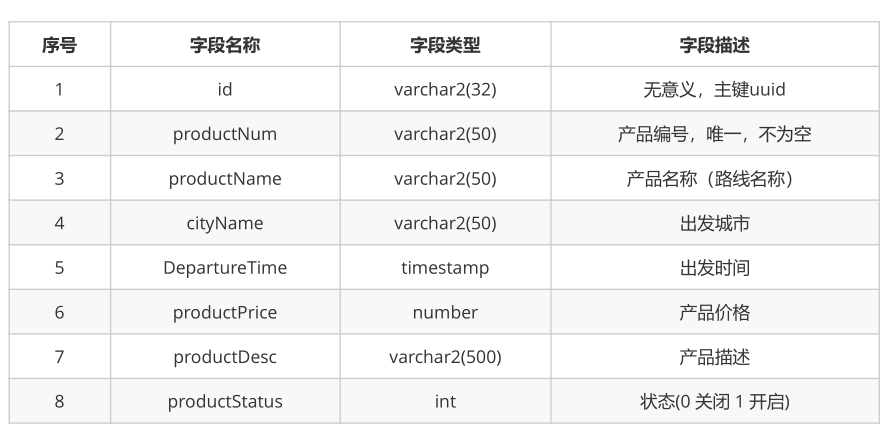
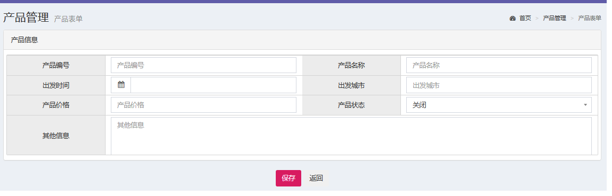
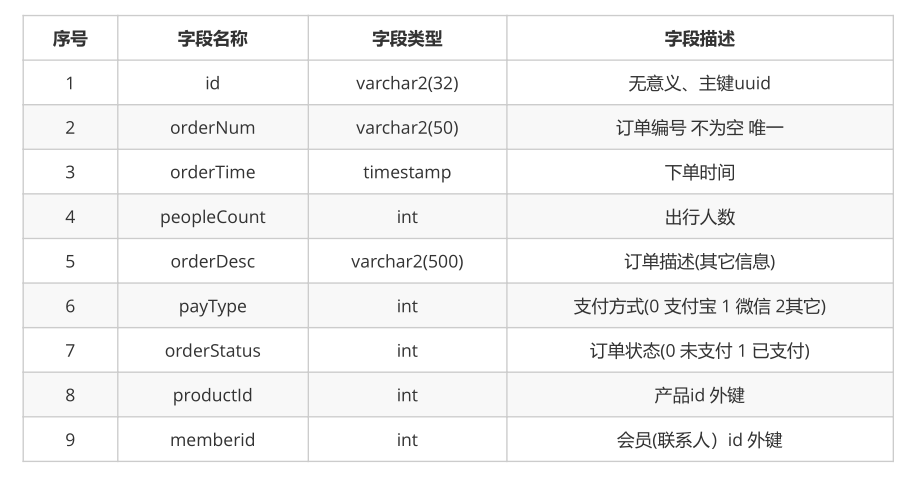
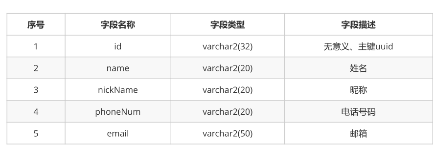
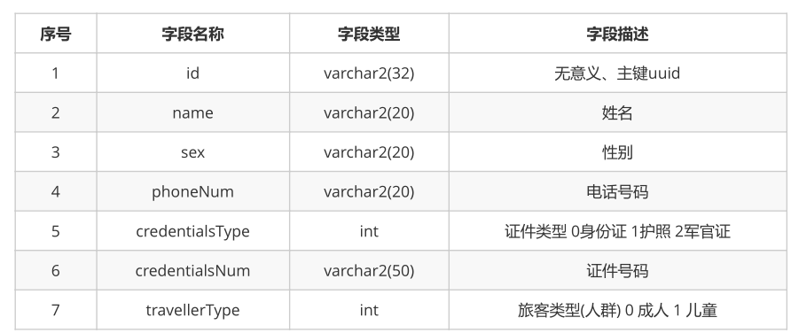
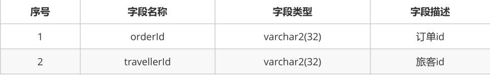
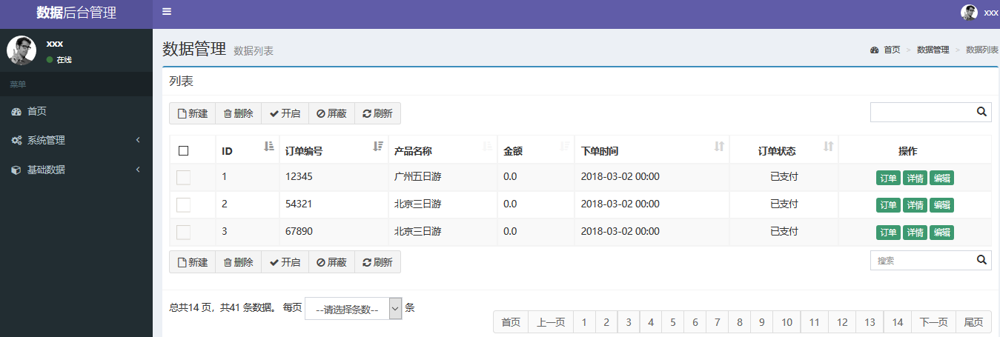

# 1. 商品操作

## 1.1 表结构



```java
public class Product {
    private String id; // 主键
    private String productNum; // 编号 唯一
    private String productName; // 名称
    private String cityName; // 出发城市
    @DateTimeFormat(pattern="yyyy-MM-dd HH:mm")
    private Date departureTime; // 出发时间
    private String departureTimeStr;
    private double productPrice; // 产品价格
    private String productDesc; // 产品描述
    private Integer productStatus; // 状态 0 关闭 1 开启
    private String productStatusStr;
}
```

## 1.2 商品添加页面

页面名称：product-add.jsp



页面详细代码请查看今天课程资料

## 1.3 Controller

```java
@Controller
@RequestMapping("/product")
public class ProductController {

    @Autowired
    private IProductService productService;

    //产品添加
    @RequestMapping("/save.do")
    public String save(Product product) throws Exception {
        productService.save(product);
        return "redirect:findAll.do";
    }

    //查询全部产品
    @RequestMapping("/findAll.do")
    public ModelAndView findAll() throws Exception {
        ModelAndView mv = new ModelAndView();
        List<Product> ps = productService.findAll();
        mv.addObject("productList", ps);
        mv.setViewName("product-list1");
        return mv;

    }
}
```

## 1.4 Dao

```java
public interface IProductDao {

    //根据id查询产品
    @Select("select * from product where id=#{id}")
    public Product findById(String id) throws Exception;

    //查询所有的产品信息
    @Select("select * from product")
    public List<Product> findAll() throws Exception;

    @Insert("insert into product(productNum,productName,cityName,departureTime,productPrice,productDesc,productStatus) values(#{productNum},#{productName},#{cityName},#{departureTime},#{productPrice},#{productDesc},#{productStatus})")
    void save(Product product);
}
```

# 2. 订单操作

## 2.1 表结构

### 1）订单表orders



```java
public class Orders {
    private String id;
    private String orderNum;
    private Date orderTime;
    private String orderTimeStr;
    private int orderStatus;
    private String orderStatusStr;
    private int peopleCount;
    private Product product;
    private List<Traveller> travellers;
    private Member member;
    private Integer payType;
    private String payTypeStr;
    private String orderDesc;
}
```

###2）会员表member



```java
public class Member {
	private String id;
	private String name;
	private String nickname;
	private String phoneNum;
	private String email;
	//省略getter/setter
}
```

### 3）旅客表traveller



```java
public class Traveller {
    private String id;
    private String name;
    private String sex;
    private String phoneNum;
    private Integer credentialsType;
    private String credentialsTypeStr;
    private String credentialsNum;
    private Integer travellerType;
    private String travellerTypeStr;
}
```

旅客与订单中间表



## 2.2 订单查询

### 2.2.1 页面

order-list.jsp



### 2.2.2 Controller

```java
@Controller
@RequestMapping("/orders")
public class OrdersController {

    @Autowired
    private IOrdersService ordersService;

    @RequestMapping("/findAll.do")
    public ModelAndView findAll() throws Exception {
        ModelAndView mv=new ModelAndView();
        List<Orders> ordersList = ordersService.findAll();
        mv.addObject("ordersList",ordersList);
        mv.setViewName("orders-list");
        return mv;
    }
}
```

### 2.2.3 Dao

* IOrderDao

```java
public interface IOrdersDao {

    @Select("select * from orders")
    @Results({
            @Result(id=true,property = "id",column = "id"),
            @Result(property = "orderNum",column = "orderNum"),
            @Result(property = "orderTime",column = "orderTime"),
            @Result(property = "orderStatus",column = "orderStatus"),
            @Result(property = "peopleCount",column = "peopleCount"),
            @Result(property = "peopleCount",column = "peopleCount"),
            @Result(property = "payType",column = "payType"),
            @Result(property = "orderDesc",column = "orderDesc"),
            @Result(property = "product",column = "productId",javaType = Product.class,one = @One(select = "com.itheima.ssm.dao.IProductDao.findById")),
    })
    public List<Orders> findAll() throws Exception;
}
```

* IProductDao

```java
public interface IProductDao {

    //根据id查询产品
    @Select("select * from product where id=#{id}")
    public Product findById(String id) throws Exception;
}
```

## 2.3 订单分页查询

### 2.3.1 PageHelper介绍

PageHelper是国内非常优秀的一款开源的mybatis分页插件，它支持基本主流与常用的数据库，例如mysql、oracle、mariaDB、DB2、SQLite、Hsqldb等。

本项目在 github 的项目地址：https://github.com/pagehelper/Mybatis-PageHelper

本项目在 gitosc 的项目地址：http://git.oschina.net/free/Mybatis_PageHelper

####PageHelper使用

####1）添加依赖

```xml
<dependency>
	<groupId>com.github.pagehelper</groupId>
	<artifactId>pagehelper</artifactId>
	<version>最新版本</version>
</dependency>
```

####2）配置

特别注意，新版拦截器是  ```com.github.pagehelper.PageInterceptor ```。```com.github.pagehelper.PageHelper``` 现在是一个特殊的  dialect 实现类，是分页插件的默认实现类，提供了和以前相同的用法。

```xml
<bean id="sqlSessionFactory" class="org.mybatis.spring.SqlSessionFactoryBean">
	<!-- 注意其他配置 -->
	<property name="plugins">
		<array>
		<bean class="com.github.pagehelper.PageInterceptor">
			<property name="properties">
				<!--使用下面的方式配置参数，一行配置一个 -->
				<value>
					params=value1
				</value>
			</property>
		</bean>
		</array>
	</property>
</bean>
```

#### 3）使用

```java
//获取第1页，10条内容，默认查询总数count
PageHelper.startPage(1, 10);
//紧跟着的第一个select方法会被分页
List<Country> list = countryMapper.selectIf(1);
```

### 2.3.2 订单分页

#### 1）Service

```java
@Override
public List<Orders> findAllByPage(int page, int pageSize) throws Exception {
	PageHelper.startPage(page, pageSize);
	return ordersDao.findAllByPage();
}
```

####2）Controller

```java
@RequestMapping("/findAll.do")
public ModelAndView findAll(@RequestParam(name = "page", required = true, defaultValue = "1")
	Integer page, @RequestParam(name = "pageSize", required = true, defaultValue = "10") 
                            	Integer pageSize) throws Exception {
		List<Orders> ordersList = ordersService.findAllByPage(page, pageSize);
		PageInfo pageInfo = new PageInfo(ordersList);
		ModelAndView mv = new ModelAndView();
		mv.setViewName("order-list");
		mv.addObject("pageInfo", pageInfo);
		return mv;
}
```

#### 3）页面

Order-list.jsp


### 2.3.4 订单详情

在order-list.jsp页面上对"详情"添加链接

```html
<button type="button" onclick="location.href='${pageContext.request.contextPath}/orders/findById.do?id=${orders.id}'">
	详情
</button>
```

#### 1）页面

order-show.jsp


#### 2）Controller

```java
@RequestMapping("/findById.do")
public ModelAndView findById(String id) throws Exception {
	Orders orders = ordersService.findById(id);
	ModelAndView mv = new ModelAndView();
	mv.setViewName("order-show");
	mv.addObject("orders", orders);
	return mv;
}
```

#### 3）Dao

```java
@Select("select * from orders where id=#{id}")
@Results({
@Result(id=true,column = "id",property = "id"),
@Result(column = "orderNum",property = "orderNum"),
@Result(column = "orderTime",property = "orderTime"),
@Result(column = "orderStatus",property = "orderStatus"),
@Result(column = "peopleCount",property = "peopleCount"),
@Result(column = "payType",property = "payType"),
@Result(column = "orderDesc",property = "orderDesc"),
@Result(column = "productId",property = "product",one = @One(select =
"com.itheima.ssm.dao.IProductDao.findById")),
@Result(column = "id",property = "travellers",many = @Many(select =
"com.itheima.ssm.dao.ITravellerDao.findByOrdersId")),
@Result(column = "memberId",property = "member",one = @One(select =
"com.itheima.ssm.dao.IMemberDao.findById")),
})
public Orders findById(String id) throws Exception;
```

* IMemberDao的findById方法

```java
@Select("select * from member where id=#{id}")
public Member findById(String id) throws Exception;
```

* ITravellerDao.findByOrdersId方法

```java
@Select("select * from traveller where id in (select travellerId from order_traveller where
orderId=#{ordersId})")
public List<Traveller> findByOrdersId(String ordersId) throws Exception;
```

