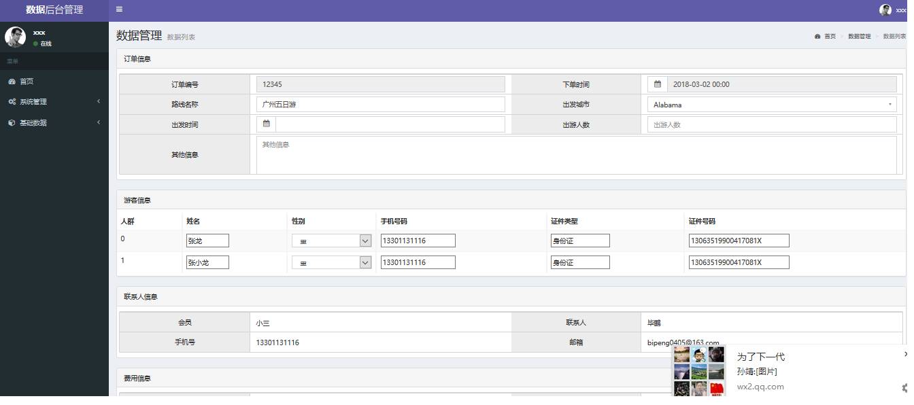
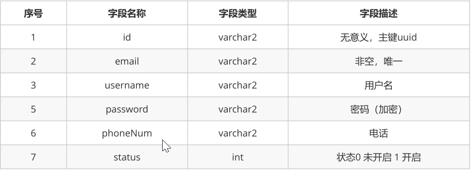
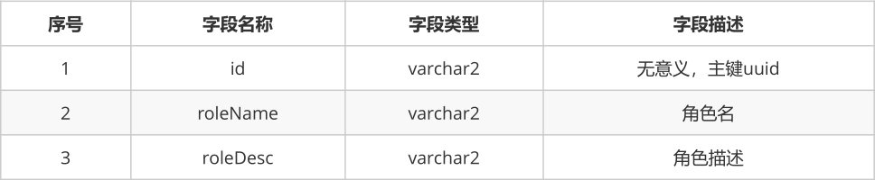
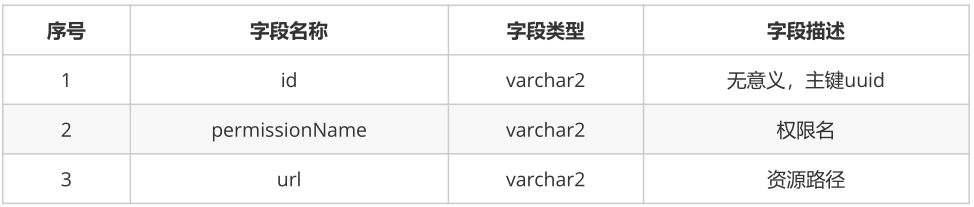
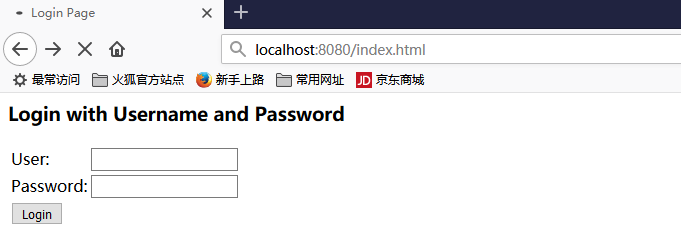

# 1. 订单详情

在order-list.jsp页面上对"详情"添加链接

```html
<button type="button" class="btn bg-olive btn-xs"
onclick="location.href='${pageContext.request.contextPath}/orders/findById.do?id=${orders.id}'">
详情</button>
```

## 1.1 订单详情 order-show.jsp



## 1.2 Controller

```java
@RequestMapping("/findById.do")
public ModelAndView findById(@RequestParam(name = "id", required = true) String ordersId) throws Exception {
    ModelAndView mv = new ModelAndView();
    Orders orders = ordersService.findById(ordersId);
    mv.addObject("orders",orders);
    mv.setViewName("orders-show");
    return mv;
}
```

## 1.3 Dao

IOrdersDao的findById方法

```java
@Select("select * from orders where id=#{id}")
@Results({
	@Result(id=true,column = "id",property = "id"),
	@Result(column = "orderNum",property = "orderNum"),
	@Result(column = "orderTime",property = "orderTime"),
	@Result(column = "orderStatus",property = "orderStatus"),
	@Result(column = "peopleCount",property = "peopleCount"),
	@Result(column = "payType",property = "payType"),
	@Result(column = "orderDesc",property = "orderDesc"),
	@Result(column = "productId",property = "product",one = @One(select =
	"com.itheima.ssm.dao.IProductDao.findById")),
	@Result(column = "id",property = "travellers",many = @Many(select =
	"com.itheima.ssm.dao.ITravellerDao.findByOrdersId")),
	@Result(column = "memberId",property = "member",one = @One(select =
													"com.itheima.ssm.dao.IMemberDao.findById")),
})
Orders findById(String id) throws Exception;
```

IMemberDao的findById方法

```java
@Select("select * from member where id=#{id}")
Member findById(String id) throws Exception;
```

ITravellerDao.findByOrdersId方法

```java
@Select("select * from traveller where id in (select travellerId from order_traveller where
orderId=#{ordersId})")
List<Traveller> findByOrdersId(String ordersId) throws Exception;
```

# 2. 权限操作

## 2.1 表结构设计

#### 1）用户表



```java
public class UserInfo {
    private String id;
    private String username;
    private String email;
    private String password;
    private String phoneNum;
    private int status;
    private String statusStr;
    private List<Role> roles;
}
```

### 2）角色表



```java
public class Role {
	private String id;
	private String roleName;
	private String roleDesc;
	private List<Permission> permissions;
	private List<User> users;
}
```

### 3）用户角色中间表

| 序号 | 字段名称 | 字段类型 | 字段描述 |
| ---- | -------- | -------- | -------- |
| 1    | USERID   | varchar2 | 用户外键 |
| 2    | ROLEID   | varchar2 | 角色外键 |

### 4）资源权限表



```java
public class Permission {
	private String id;
	private String permissionName;
	private String url;
	private List<Role> roles;
}
```

### 5）资源权限与角色关系表

| 序号 | 字段名称     | 字段类型 | 字段描述 |
| ---- | ------------ | -------- | -------- |
| 1    | PERMISSIONID | 权限ID   | 权限外键 |
| 2    | ROLEID       | 角色ID   | 角色外键 |

## 2.2 SpringSecurity权限框架

### 2.2.1 概述

Spring Security 的前身是 Acegi Security ，是 Spring 项目组中用来提供安全认证服务的框架。
(https://projects.spring.io/spring-security/) Spring Security 为基于J2EE企业应用软件提供了全面安全服务。特别是使用领先的J2EE解决方案-Spring框架开发的企业软件项目。人们使用Spring Security有很多种原因，不过通常吸引他们的是在J2EE Servlet规范或EJB规范中找不到典型企业应用场景的解决方案。 特别要指出的是他们不能再WAR 或 EAR 级别进行移植。这样，如果你更换服务器环境，就要，在新的目标环境进行大量的工作，对你的应用系统进行重新配 置安全。使用Spring Security 解决了这些问题，也为你提供很多有用的，完全可以指定的其他安全特性。 安全包括两个主要操作。

* “认证”，是为用户建立一个他所声明的主体。主题一般式指用户，设备或可以在你系 统中执行动作的其他系统。
* “授权”指的是一个用户能否在你的应用中执行某个操作，在到达授权判断之前，身份的主题已经由 身份验证过程建立了。

这些概念是通用的，不是Spring Security特有的。在身份验证层面，Spring Security广泛支持各种身份验证模式，这些验证模型绝大多数都由第三方提供，或则正在开发的有关标准机构提供的，例如 Internet Engineering TaskForce.作为补充，Spring Security 也提供了自己的一套验证功能。

Spring Security 目前支持认证一体化如下认证技术： HTTP BASIC authentication headers (一个基于IEFT RFC 的标准) HTTP Digest authentication headers (一个基于IEFT RFC 的标准) HTTP X.509 client certificate exchange(一个基于IEFT RFC 的标准) LDAP (一个非常常见的跨平台认证需要做法，特别是在大环境) Form-basedauthentication (提供简单用户接口的需求) OpenID authentication Computer Associates Siteminder JA-SIGCentral Authentication Service (CAS，这是一个流行的开源单点登录系统) Transparent authentication contextpropagation for Remote Method Invocation and HttpInvoker (一个Spring远程调用协议)

* Maven依赖

```xml
<dependencies>
	<dependency>
		<groupId>org.springframework.security</groupId>
		<artifactId>spring-security-web</artifactId>
		<version>5.0.1.RELEASE</version>
	</dependency>
	<dependency>
		<groupId>org.springframework.security</groupId>
		<artifactId>spring-security-config</artifactId>
		<version>5.0.1.RELEASE</version>
	</dependency>
</dependencies>
```

### 2.2.2 web.xml配置

```xml
<context-param>
  <param-name>contextConfigLocation</param-name>
  <param-value>classpath:spring-security.xml</param-value>
</context-param>
<listener>
  <listener-class>org.springframework.web.context.ContextLoaderListener</listener-class>
</listener>
<filter>
  <filter-name>springSecurityFilterChain</filter-name>
  <filter-class>org.springframework.web.filter.DelegatingFilterProxy</filter-class>
</filter>
<filter-mapping>
  <filter-name>springSecurityFilterChain</filter-name>
  <url-pattern>/*</url-pattern>
</filter-mapping>
```

### 2.2.3 SpringSecurity配置

```xml
<?xml version="1.0" encoding="UTF-8"?>
<beans xmlns="http://www.springframework.org/schema/beans"
xmlns:security="http://www.springframework.org/schema/security"
xmlns:xsi="http://www.w3.org/2001/XMLSchema-instance"
xsi:schemaLocation="http://www.springframework.org/schema/beans
http://www.springframework.org/schema/beans/spring-beans.xsd
http://www.springframework.org/schema/security
http://www.springframework.org/schema/security/spring-security.xsd">
	<security:http auto-config="true" use-expressions="false">
		<!-- intercept-url定义一个过滤规则 pattern表示对哪些url进行权限控制，ccess属性表示在请求对应
		的URL时需要什么权限，
		默认配置时它应该是一个以逗号分隔的角色列表，请求的用户只需拥有其中的一个角色就能成功访问对应
		的URL -->
		<security:intercept-url pattern="/**" access="ROLE_USER" />
		<!-- auto-config配置后，不需要在配置下面信息 <security:form-login /> 定义登录表单信息
		<security:http-basic
		/> <security:logout /> -->
	</security:http>
	<security:authentication-manager>
		<security:authentication-provider>
			<security:user-service>
				<security:user name="user" password="{noop}user" authorities="ROLE_USER" />
				<security:user name="admin" password="{noop}admin" authorities="ROLE_ADMIN" />
			</security:user-service>
		</security:authentication-provider>
	</security:authentication-manager>
</beans>
```

### 2.2.4 测试

我们在webapp下创建一个index.html页面，在页面中任意写些内容。



当我们访问index.html页面时发现会弹出登录窗口，可能你会奇怪，我们没有建立下面的登录页面，为什么Spring Security会跳到上面的登录页面呢？这是我们设置http的auto-config=”true”时Spring Security自动为我们生成的。

### 2.2.5 使用自定义页面

####1）spring配置文件

```xml
<?xml version="1.0" encoding="UTF-8"?>
<beans xmlns="http://www.springframework.org/schema/beans"
       xmlns:security="http://www.springframework.org/schema/security"
       xmlns:xsi="http://www.w3.org/2001/XMLSchema-instance"
       xsi:schemaLocation="http://www.springframework.org/schema/beans
http://www.springframework.org/schema/beans/spring-beans.xsd
http://www.springframework.org/schema/security
http://www.springframework.org/schema/security/spring-security.xsd">
    <!-- 配置不过滤的资源（静态资源及登录相关） -->
    <security:http security="none" pattern="/login.html"/>
    <security:http security="none" pattern="/failer.html"/>
    <security:http auto-config="true" use-expressions="false">
        <!-- 配置资料连接，表示任意路径都需要ROLE_USER权限 -->
        <security:intercept-url pattern="/**" access="ROLE_USER"/>
        <!-- 自定义登陆页面，login-page 自定义登陆页面 authentication-failure-url 用户权限校验失败之后才会跳转到这个页面，如果数据库中没有这个用户则不会跳转到这个页面。
            default-target-url 登陆成功后跳转的页面。 注：登陆页面用户名固定 username，密码 password，action:login -->
        <security:form-login login-page="/login.html"
                             login-processing-url="/login" username-parameter="username"
                             password-parameter="password" authentication-failure-url="/failer.html"
                             default-target-url="/success.html" authentication-success-forward-url="/success.html"
        />

        <!-- 关闭CSRF,默认是开启的 -->
        <security:csrf disabled="true"/>
    </security:http>
    <security:authentication-manager>
        <security:authentication-provider>
            <security:user-service>
                <security:user name="user" password="{noop}user"
                               authorities="ROLE_USER"/>
                <security:user name="admin" password="{noop}admin"
                               authorities="ROLE_ADMIN"/>
            </security:user-service>
        </security:authentication-provider>
    </security:authentication-manager>
</beans>
```

#### 2）登录页面

```html
<!DOCTYPE html>
<html>
<head>
    <meta charset="UTF-8">
    <title>Insert title here</title>
</head>
<body>
<form action="login" method="post">
    <table>
        <tr>
            <td>姓名：</td>
            <td><input type="text" name="username" /></td>
        </tr>
        <tr>
            <td>密码：</td>
            <td><input type="password" name="password" /></td>
        </tr>
        <tr>
            <td colspan="2" align="center"><input type="submit" value="登录" />
                <input type="reset" value="重置" /></td>
        </tr>
    </table>
</form>
</body>
</html>
```

#### 3）success.html

```html
<!DOCTYPE html>
<html lang="en">
<head>
    <meta charset="UTF-8">
    <title>Title</title>
</head>
<body>
success.html
</body>
</html>
```

#### 4）failer.html

```html
<!DOCTYPE html>
<html lang="en">
<head>
    <meta charset="UTF-8">
    <title>Title</title>
</head>
<body>
failer.html
</body>
</html>
```

## 2.3 Spring Security使用数据库认证

在Spring Security中如果想要使用数据进行认证操作，有很多种操作方式，这里我们介绍使用UserDetails、UserDetailsService来完成操作。

#### 1）UserDetails

```java
public interface UserDetails extends Serializable {
	Collection<? extends GrantedAuthority> getAuthorities();
	String getPassword();
	String getUsername();
	boolean isAccountNonExpired();
	boolean isAccountNonLocked();
	boolean isCredentialsNonExpired();
	boolean isEnabled();
}
```

UserDetails是一个接口，我们可以认为UserDetails作用是于封装当前进行认证的用户信息，但由于其是一个接口，所以我们可以对其进行实现，也可以使用Spring Security提供的一个UserDetails的实现类User来完成操作

以下是User类的部分代码

```java
public class User implements UserDetails, CredentialsContainer {
	private String password;
	private final String username;
	private final Set<GrantedAuthority> authorities;
	private final boolean accountNonExpired; //帐户是否过期
	private final boolean accountNonLocked; //帐户是否锁定
	private final boolean credentialsNonExpired; //认证是否过期
	private final boolean enabled; //帐户是否可用
｝
```

#### 2）UserDetailsService

上面将UserDetails与UserDetailsService做了一个简单的介绍，那么我们具体如何完成Spring Security的数据库认证操作哪，我们通过用户管理中用户登录来完成Spring Security的认证操作。

```java
public interface UserDetailsService {
	UserDetails loadUserByUsername(String username) throws UsernameNotFoundException;
}
```

# 3. 用户管理

## 3.1 用户登录

spring security的配置

```xml
<security:authentication-manager>
	<security:authentication-provider user-service-ref="userService">
	<!-- 配置加密的方式
	<security:password-encoder ref="passwordEncoder"/>
	-->
	</security:authentication-provider>
</security:authentication-manager>
```

### 3.1.1 Service

```java
public interface IUserService extends UserDetailsService{
}
```

```java
@Service("userService")
@Transactional
public class UserServiceImpl implements IUserService {
	@Autowired
	private IUserDao userDao;
	@Override
	public UserDetails loadUserByUsername(String username) throws UsernameNotFoundException {
		UserInfo userInfo = userDao.findByUsername(username);
		List<Role> roles = userInfo.getRoles();
		List<SimpleGrantedAuthority> authoritys = getAuthority(roles);
		User user = new User(userInfo.getUsername(), "{noop}" + userInfo.getPassword(),
		userInfo.getStatus() == 0 ? false : true, true, true, true, authoritys);
		return user;
	}
	private List<SimpleGrantedAuthority> getAuthority(List<Role> roles) {
		List<SimpleGrantedAuthority> authoritys = new ArrayList();
		for (Role role : roles) {
			authoritys.add(new SimpleGrantedAuthority(role.getRoleName()));
		}
		return authoritys;
	}
}
```

### 3.1.2 IUserDao

```java
public interface IUserDao {
    
	@Select("select * from user where id=#{id}")
	public UserInfo findById(Long id) throws Exception;
    
	@Select("select * from user where username=#{username}")
	@Results({
		@Result(id = true, property = "id", column = "id"),
		@Result(column = "username", property = "username"),
		@Result(column = "email", property = "email"),
		@Result(column = "password", property = "password"),
		@Result(column = "phoneNum", property = "phoneNum"),
		@Result(column = "status", property = "status"),
		@Result(column = "id", property = "roles", javaType = List.class, many =
		@Many(select = "com.itheima.ssm.dao.IRoleDao.findRoleByUserId")) })
	public UserInfo findByUsername(String username);
}
```

## 3.2 用户退出

使用spring security完成用户退出，非常简单

* 配置

```xml
<security:logout invalidate-session="true" logout-url="/logout.do" logout-success-
url="/login.jsp" />
```

* 页面中

```html
<a href="${pageContext.request.contextPath}/logout.do" class="btn btn-default btn-flat">注销</a>
```

