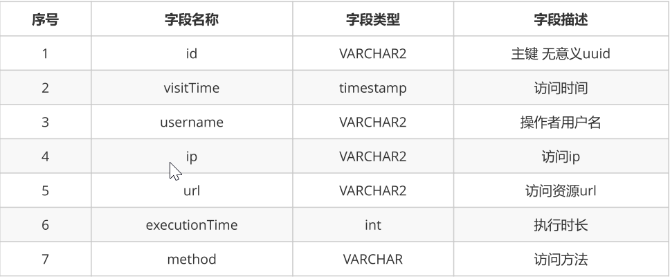

# 1. 权限关联控制

## 1.1 用户角色关联

用户与角色之间是多对多关系，我们要建立它们之间的关系，只需要在中间表user_role插入数据即可。

### 1.1.1 用户角色关联相关页面

* 在user-list.jsp页面上添加链接

```html
<a href="${pageContext.request.contextPath}/user/findUserByIdAndAllRole.do?id=${user.id}"
class="btn bg-olive btn-xs">添加角色</a>
```

展示可以添加角色的页面user-roe-add.jsp

### 1.1.2 UserController

* findUserByIdAndAllRole(Long id)方法

  此方法用于查找要操作的用户及可以添加的角色，参数是要操作的用户id

```java
@RequestMapping("/findUserByIdAndAllRole.do")
public ModelAndView findUserByIdAndAllRole(@RequestParam(name = "id", required = true) String userid) 
    throws Exception {
    ModelAndView mv = new ModelAndView();
    //1.根据用户id查询用户
    UserInfo userInfo = userService.findById(userid);
    //2.根据用户id查询可以添加的角色
    List<Role> otherRoles = userService.findOtherRoles(userid);
    mv.addObject("user", userInfo);
    mv.addObject("roleList", otherRoles);
    mv.setViewName("user-role-add");
    return mv;
}
```

调用IUserService的findById方法获取要操作的User

调用IRoleService的findOtherRole方法用于获取可以添加的角色信息

* addRoleToUser(Long userId,Long[] ids)方法

```java
@RequestMapping("/addRoleToUser.do")
public String addRoleToUser(@RequestParam(name = "userId", required = true) String userId, @RequestParam(name = "ids", required = true) String[] roleIds) {
    userService.addRoleToUser(userId, roleIds);
    return "redirect:findAll.do";
}
```

### 1.1.3 Dao

#### 1）IRoleDao

```java
@Select("select * from role where id not in( select roleId from user_role where userId=#{id})")
public List<Role> findOtherRole(Long id);
```

用于查找可以添加的角色

####2）IUserDao

```java
@Insert("insert into user_role(userId,roleId) value(#{userId},#{roleId})")
public void addRoleToUser(@Param("userId") Long userId, @Param("roleId") Long roleId);
```

用于添加用户与角色关系

## 1.2 角色权限关联

角色与权限之间是多对多关系，我们要建立它们之间的关系，只需要在中间表role_permission插入数据即可。

### 1.2.1 角色权限关联相关页面

* 在role-list.jsp页面上添加链接

```html
<a href="${pageContext.request.contextPath}/role/findRoleByIdAndAllPermission.do?
id=${role.id}" class="btn bg-olive btn-xs">添加权限</a>
```

* 展示可以添加权限的页面roe-permission-add.jsp

请在资料中查看页面详细代码

### 1.2.2 RoleController

* findRoleByIdAndAllPermission(Long roleId)方法

  此方法用于查找要操作的角色及可以添加的权限，参数是要操作的角色id

```java
//根据roleId查询role，并查询出可以添加的权限
@RequestMapping("/findRoleByIdAndAllPermission.do")
public ModelAndView findRoleByIdAndAllPermission(@RequestParam(name = "id", required = true) 
                                                 String roleId) throws Exception {
    ModelAndView mv = new ModelAndView();
    //根据roleId查询role
    Role role = roleService.findById(roleId);
    //根据roleId查询可以添加的权限
    List<Permission> otherPermissions = roleService.findOtherPermissions(roleId);
    mv.addObject("role", role);
    mv.addObject("permissionList", otherPermissions);
    mv.setViewName("role-permission-add");
    return mv;

}
```

调用IRoleService的findById方法获取要操作的Role

调用IPermissionService的findOtherPermission方法用于获取可以添加的权限信息

* addPermissionToRole(Long roleId,Long[] ids)方法

  些方法用于在角色与权限之间建立关系，参数roleId代表要操作的角色id,参数permissionIds代表的是权限id数组

```java
@RequestMapping("/addPermissionToRole.do")
public String addPermissionToRole(@RequestParam(name = "roleId", required = true) String roleId, @RequestParam(name = "ids", required = true) String[] permissionIds) throws Exception {
    roleService.addPermissionToRole(roleId, permissionIds);
    return "redirect:findAll.do";
}
```

### 1.2.3 Dao

* IPermissionDao

```java
@Select("select * from permission where id not in (select permissionId from role_permission
where roleId=#{roleId})")
public List<Permission> findOtherPermission(Long roleid);
```

用于查找可以添加的权限

* IRoleDao

```java
@Insert("insert into role_permission (roleId,permissionId) value (#{roleId},#
{permissionId})")
public void addPermissionToRole(@Param("roleId") Long roleId, @Param("permissionId") Long
permissionId);
```

用于绑定角色与权限的关系

## 1.3 服务器端方法级权限控制

在服务器端我们可以通过Spring security提供的注解对方法来进行权限控制。Spring Security在方法的权限控制上支持三种类型的注解，JSR-250注解、@Secured注解和支持表达式的注解，这三种注解默认都是没有启用的，需要单独通过global-method-security元素的对应属性进行启用

### 1.3.1 开启注解使用

* 配置文件

```xml
<security:global-method-security pre-post-annotations="enabled"
                                     jsr250-annotations="enabled"
                                     secured-annotations="enabled"/>
```

* 注解开启

  ```@EnableGlobalMethodSecurity``` ：```Spring Security```默认是禁用注解的，要想开启注解，需要在继承```WebSecurityConfigurerAdapter```的类上加```@EnableGlobalMethodSecurity```注解，并在该类中将```AuthenticationManager```定义为```Bean```

### 1.3.2 JSR-250注解

* @RolesAllowed表示访问对应方法时所应该具有的角色

  示例：

```java
//该方法只要具有"USER", "ADMIN"任意一种权限就可以访问。这里可以省略前缀ROLE_，实际的权限可能是ROLE_ADMIN
@RolesAllowed({"USER", "ADMIN"}) 
```

```java
//表示允许所有的角色进行访问，也就是说不进行权限控制
@PermitAll
```

```java
//@DenyAll是和PermitAll相反的，表示无论什么角色都不能访问
@DenyAll
```

### 1.3.3 支持表达式的注解

* @PreAuthorize 在方法调用之前,基于表达式的计算结果来限制对方法的访问

```java
//这里表示在changePassword方法执行之前，判断方法参数userId的值是否等于principal中保存的当前用户的userId，或者当前用户是否具有ROLE_ADMIN权限，两种符合其一，就可以访问该方法。
@PreAuthorize("#userId == authentication.principal.userId or hasAuthority(‘ADMIN’)")
void changePassword(@P("userId") long userId ){ 
	...
}
```

* @PostAuthorize 允许方法调用,但是如果表达式计算结果为false,将抛出一个安全性异常

```java
@PostAuthorize
User getUser("returnObject.userId == authentication.principal.userId or hasPermission(returnObject, 'ADMIN')");
```

* @PostFilter 允许方法调用,但必须按照表达式来过滤方法的结果
* @PreFilter 允许方法调用,但必须在进入方法之前过滤输入值

### 1.3.4 @Secured注解

* @Secured注解标注的方法进行权限控制的支持，其值默认为disabled。

```java
@Secured("IS_AUTHENTICATED_ANONYMOUSLY")
public Account readAccount(Long id);
@Secured("ROLE_TELLER")
```

## 1.4 页面端标签控制权限

在jsp页面中我们可以使用spring security提供的权限标签来进行权限控制

### 1.4.1 导入

* maven导入

```xml
<dependency>
	<groupId>org.springframework.security</groupId>
	<artifactId>spring-security-taglibs</artifactId>
	<version>version</version>
</dependency>
```

* 页面导入

```jsp
<%@taglib uri="http://www.springframework.org/security/tags" prefix="security"%>
```

###1.4.2 常用标签

在jsp中我们可以使用以下三种标签，其中authentication代表的是当前认证对象，可以获取当前认证对象信息，例如用户名。其它两个标签我们可以用于权限控制

#### 1）authentication

```xml
<security:authentication property="" htmlEscape="" scope="" var=""/>
```

#### 2）authorize

* property： 只允许指定Authentication所拥有的属性，可以进行属性的级联获取，如“principle.username”，
  不允许直接通过方法进行调用
* htmlEscape：表示是否需要将html进行转义。默认为true。
* scope：与var属性一起使用，用于指定存放获取的结果的属性名的作用范围，默认我pageContext。Jsp中拥
  有的作用范围都进行进行指定
* var： 用于指定一个属性名，这样当获取到了authentication的相关信息后会将其以var指定的属性名进行存放，默认是存放在pageConext中

#### 3）accesscontrollist

authorize是用来判断普通权限的，通过判断用户是否具有对应的权限而控制其所包含内容的显示

```xml
<security:authorize access="" method="" url="" var=""></security:authorize>
```

* access： 需要使用表达式来判断权限，当表达式的返回结果为true时表示拥有对应的权限
* method：method属性是配合url属性一起使用的，表示用户应当具有指定url指定method访问的权限，
* method的默认值为GET，可选值为http请求的7种方法
* url：url表示如果用户拥有访问指定url的权限即表示可以显示authorize标签包含的内容
* var：用于指定将权限鉴定的结果存放在pageContext的哪个属性中

#### 4）accesscontrollist

accesscontrollist标签是用于鉴定ACL权限的。其一共定义了三个属性：hasPermission、domainObject和var，其中前两个是必须指定的

```xml
<security:accesscontrollist hasPermission="" domainObject="" var=""></security:accesscontrollist>
```

* hasPermission：hasPermission属性用于指定以逗号分隔的权限列表
* domainObject：domainObject用于指定对应的域对象
* var：var则是用以将鉴定的结果以指定的属性名存入pageContext中，以供同一页面的其它地方使用

# 2. AOP记录日志

## 2.1 表结构



```sql
CREATE TABLE sysLog(
	id VARCHAR2(32) default SYS_GUID() PRIMARY KEY,
	visitTime timestamp,
	username VARCHAR2(50),
	ip VARCHAR2(30),
	url VARCHAR2(50),
	executionTime int,
	method VARCHAR2(200)
)
```

## 2.2 代码实现

###2.2.1 实体类

```java
public class SysLog {
	private String id;
	private Date visitTime;
	private String visitTimeStr;
	private String username;
	private String ip;
	private String url;
	private Long executionTime;
	private String method;
｝
```

### 2.2.2 AOP切面

```java
@Component
@Aspect
public class LogAop {

    @Autowired
    private HttpServletRequest request;

    @Autowired
    private ISysLogService sysLogService;

    private Date visitTime; //开始时间
    private Class clazz; //访问的类
    private Method method;//访问的方法

    //前置通知  主要是获取开始时间，执行的类是哪一个，执行的是哪一个方法
    @Before("execution(* com.itheima.ssm.controller.*.*(..))")
    public void doBefore(JoinPoint jp) throws NoSuchMethodException {
        visitTime = new Date();//当前时间就是开始访问的时间
        clazz = jp.getTarget().getClass(); //具体要访问的类
        String methodName = jp.getSignature().getName(); //获取访问的方法的名称
        Object[] args = jp.getArgs();//获取访问的方法的参数

        //获取具体执行的方法的Method对象
        if (args == null || args.length == 0) {
            method = clazz.getMethod(methodName); //只能获取无参数的方法
        } else {
            Class[] classArgs = new Class[args.length];
            for (int i = 0; i < args.length; i++) {
                classArgs[i] = args[i].getClass();
            }
            clazz.getMethod(methodName, classArgs);
        }
    }

    //后置通知
    @After("execution(* com.itheima.ssm.controller.*.*(..))")
    public void doAfter(JoinPoint jp) throws Exception {
        long time = new Date().getTime() - visitTime.getTime(); //获取访问的时长

        String url = "";
        //获取url
        if (clazz != null && method != null && clazz != LogAop.class) {
            //1.获取类上的@RequestMapping("/orders")
            RequestMapping classAnnotation = (RequestMapping) 
                clazz.getAnnotation(RequestMapping.class);
            if (classAnnotation != null) {
                String[] classValue = classAnnotation.value();
                //2.获取方法上的@RequestMapping(xxx)
                RequestMapping methodAnnotation = method.getAnnotation(RequestMapping.class);
                if (methodAnnotation != null) {
                    String[] methodValue = methodAnnotation.value();
                    url = classValue[0] + methodValue[0];

                    //获取访问的ip
                    String ip = request.getRemoteAddr();

                    //获取当前操作的用户
                    SecurityContext context = SecurityContextHolder.getContext();
                    //从上下文中获了当前登录的用户
                    User user = (User) context.getAuthentication().getPrincipal();
                    String username = user.getUsername();

                    //将日志相关信息封装到SysLog对象
                    SysLog sysLog = new SysLog();
                    sysLog.setExecutionTime(time); //执行时长
                    sysLog.setIp(ip);
                    sysLog.setMethod("[类名] " + clazz.getName() + "[方法名] " + method.getName());
                    sysLog.setUrl(url);
                    sysLog.setUsername(username);
                    sysLog.setVisitTime(visitTime);

                    //调用Service完成操作
                    sysLogService.save(sysLog);
                }
            }
        }

    }
}
```

在切面类中我们需要获取登录用户的username，还需要获取ip地址，我们怎么处理？

* username获取
  SecurityContextHolder获取

* ip地址获取

  ip地址的获取我们可以通过request.getRemoteAddr()方法获取到。

  在Spring中可以通过RequestContextListener来获取request或session对象。

### 2.2.3 SysLogController

```java
@Controller
@RequestMapping("/sysLog")
public class SysLogController {

    @Autowired
    private ISysLogService sysLogService;

    @RequestMapping("/findAll.do")
    public ModelAndView findAll() throws Exception {
        ModelAndView mv=new ModelAndView();
       List<SysLog> sysLogList= sysLogService.findAll();
       mv.addObject("sysLogs",sysLogList);
       mv.setViewName("syslog-list");
        return mv;
    }
}
```

### 2.2.4 Service

```java
@Service
@Transactional
public class SysLogServiceImpl implements ISysLogService {

    @Autowired
    private ISysLogDao sysLogDao;

    @Override
    public List<SysLog> findAll() throws Exception {
        return sysLogDao.findAll();
    }

    @Override
    public void save(SysLog sysLog) throws Exception {
        sysLogDao.save(sysLog);
    }
}
```

### 2.2.5 Dao

```java
public interface ISysLogDao {

    @Insert("insert into syslog(visitTime,username,ip,url,executionTime,method) values(#{visitTime},{username},#{ip},#{url},#{executionTime},#{method})")
    public void save(SysLog sysLog) throws Exception;

    @Select("select * from sysLog")
    List<SysLog> findAll() throws Exception;
}
```

