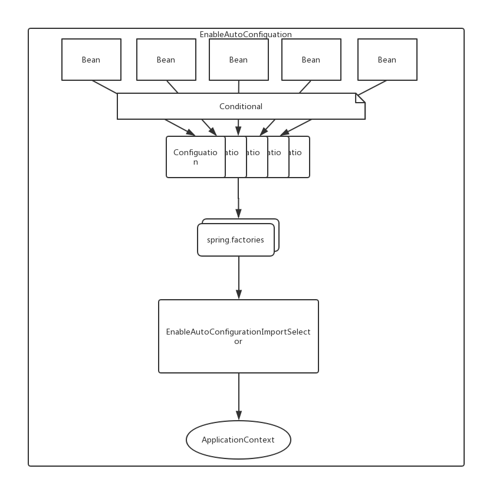

# SpringBoot基础

# 1. SpringBoot简介

## 1.1  Spring优缺点

### 1.1.1 优点

依赖注入(IOC+DI)和面向切面(AOP)编程,使代码解耦,更加的灵活和易于扩展

### 1.1.2 缺点

* Spring代码是轻量级的，但它的配置(依赖+applicationContext.xml)却是重量级的。
* 项目的依赖管理耗时耗力

## 1.2 SpringBoot概述

SpringBoot就是Spring,它做了那些没有它你也会去做得配置和添加依赖.让开发者专注于应用程序的逻辑处理.

### 1.2.2 特点

- 为基于Spring的开发提供更快的入门体验
- 开箱即用，没有代码生成，也无需XML配置。同时也可以修改默认值来满足特定的需求
- 提供了一些大型项目中常见的非功能性特性，如嵌入式服务器、安全、指标，健康检测、外部配置等
- SpringBoot不是对Spring功能上的增强，而是提供了一种快速使用Spring的方式

### 1.2.3 核心功能

- 起步依赖

  起步依赖本质上是一个Maven项目对象模型（Project Object Model，POM），定义了对其他库的传递依赖，这些东西加在一起即支持某项功能。

  简单的说，起步依赖就是将具备某种功能的坐标打包到一起，并提供一些默认的功能。

- 自动配置

  Spring Boot的自动配置是一个运行时（更准确地说，是应用程序启动时）的过程，考虑了众多因素，才决定Spring配置应该用哪个，不该用哪个。该过程是Spring自动完成的。

# 2. SpringBoot快速入门

## 2.1 代码实现

### 2.1.1 创建Maven工程

使用idea工具创建一个maven工程，该工程为普通的java工程即可


### 2.1.2 添加SpringBoot的起步依赖

SpringBoot要求，项目要继承SpringBoot的起步依赖spring-boot-starter-parent

```xml
<parent>
    <groupId>org.springframework.boot</groupId>
    <artifactId>spring-boot-starter-parent</artifactId>
    <version>2.0.1.RELEASE</version>
</parent>
```

SpringBoot要集成SpringMVC进行Controller的开发，所以项目要导入web的启动依赖

```xml
<dependencies>
    <dependency>
        <groupId>org.springframework.boot</groupId>
        <artifactId>spring-boot-starter-web</artifactId>
    </dependency>
</dependencies>
```

### 2.1.3 编写SpringBoot引导类

要通过SpringBoot提供的引导类起步SpringBoot才可以进行访问

```java
package com.itheima;

import org.springframework.boot.SpringApplication;
import org.springframework.boot.autoconfigure.SpringBootApplication;

@SpringBootApplication
public class MySpringBootApplication {

    public static void main(String[] args) {
        SpringApplication.run(MySpringBootApplication.class);
    }

}
```

### 2.1.4 编写Controller

在引导类MySpringBootApplication同级包或者子级包中创建QuickStartController

```java
package com.itheima.controller;

import org.springframework.stereotype.Controller;
import org.springframework.web.bind.annotation.RequestMapping;
import org.springframework.web.bind.annotation.ResponseBody;

@Controller
public class QuickStartController {
    
    @RequestMapping("/quick")
    @ResponseBody
    public String quick(){
        return "springboot 访问成功!";
    }
    
}
```

### 2.1.5 测试

执行SpringBoot起步类的主方法，控制台打印日志如下：

```
.   ____          _            __ _ _
 /\\ / ___'_ __ _ _(_)_ __  __ _ \ \ \ \
( ( )\___ | '_ | '_| | '_ \/ _` | \ \ \ \
 \\/  ___)| |_)| | | | | || (_| |  ) ) ) )
  '  |____| .__|_| |_|_| |_\__, | / / / /
 =========|_|==============|___/=/_/_/_/
 :: Spring Boot ::        (v2.0.1.RELEASE)

2018-05-08 14:29:59.714  INFO 5672 --- [           main] com.itheima.MySpringBootApplication      : Starting MySpringBootApplication on DESKTOP-RRUNFUH with PID 5672 (C:\Users\muzimoo\IdeaProjects\IdeaTest\springboot_quick\target\classes started by muzimoo in C:\Users\muzimoo\IdeaProjects\IdeaTest)
... ... ...
o.s.w.s.handler.SimpleUrlHandlerMapping  : Mapped URL path [/**] onto handler of type [class org.springframework.web.servlet.resource.ResourceHttpRequestHandler]
2018-05-08 14:30:03.126  INFO 5672 --- [           main] o.s.j.e.a.AnnotationMBeanExporter        : Registering beans for JMX exposure on startup
2018-05-08 14:30:03.196  INFO 5672 --- [           main] o.s.b.w.embedded.tomcat.TomcatWebServer  : Tomcat started on port(s): 8080 (http) with context path ''
2018-05-08 14:30:03.206  INFO 5672 --- [           main] com.itheima.MySpringBootApplication      : Started MySpringBootApplication in 4.252 seconds (JVM running for 5.583)
```

访问:[http://localhost:8080/quick](http://localhost:8080/quick)

## 2.2 快速入门解析

### 2.2.1 SpringBoot代码解析

- @SpringBootApplication：标注SpringBoot的启动类，该注解具备多种功能（后面详细剖析）
- SpringApplication.run(MySpringBootApplication.class) 代表运行SpringBoot的启动类，参数为SpringBoot启动类的字节码对象

### 2.2.2 SpringBoot工程热部署

我们在开发中反复修改类、页面等资源，每次修改后都是需要重新启动才生效，这样每次启动都很麻烦，浪费了大量的时间，我们可以在修改代码后不重启就能生效，在 pom.xml 中添加如下配置就可以实现这样的功能，我们称之为热部署。

```xml
<!--热部署配置-->
<dependency>
    <groupId>org.springframework.boot</groupId>
    <artifactId>spring-boot-devtools</artifactId>
</dependency>
```

注意：IDEA进行SpringBoot热部署失败原因

出现这种情况，并不是热部署配置问题，其根本原因是因为Intellij IEDA默认情况下不会自动编译，需要对IDEA进行自动编译的设置，如下：


然后 Shift+Ctrl+Alt+/，选择Registry


### 2.2.3 使用idea快速创建SpringBoot项目


通过idea快速创建的SpringBoot项目的pom.xml中已经导入了我们选择的web的起步依赖的坐标

```xml
<?xml version="1.0" encoding="UTF-8"?>
<project xmlns="http://maven.apache.org/POM/4.0.0" xmlns:xsi="http://www.w3.org/2001/XMLSchema-instance"
	xsi:schemaLocation="http://maven.apache.org/POM/4.0.0 http://maven.apache.org/xsd/maven-4.0.0.xsd">
	<modelVersion>4.0.0</modelVersion>

	<groupId>com.itheima</groupId>
	<artifactId>springboot_quick2</artifactId>
	<version>0.0.1-SNAPSHOT</version>
	<packaging>jar</packaging>

	<name>springboot_quick2</name>
	<description>Demo project for Spring Boot</description>

	<parent>
		<groupId>org.springframework.boot</groupId>
		<artifactId>spring-boot-starter-parent</artifactId>
		<version>2.0.1.RELEASE</version>
		<relativePath/> <!-- lookup parent from repository -->
	</parent>

	<properties>
		<project.build.sourceEncoding>UTF-8</project.build.sourceEncoding>
		<project.reporting.outputEncoding>UTF-8</project.reporting.outputEncoding>
		<java.version>9</java.version>
	</properties>

	<dependencies>
		<dependency>
			<groupId>org.springframework.boot</groupId>
			<artifactId>spring-boot-starter-web</artifactId>
		</dependency>

		<dependency>
			<groupId>org.springframework.boot</groupId>
			<artifactId>spring-boot-starter-test</artifactId>
			<scope>test</scope>
		</dependency>
	</dependencies>

	<build>
		<plugins>
			<plugin>
				<groupId>org.springframework.boot</groupId>
				<artifactId>spring-boot-maven-plugin</artifactId>
			</plugin>
		</plugins>
	</build>


</project>

```

可以使用快速入门的方式创建Controller进行访问，此处不再赘述

## 2.3 打包部署

添加`spring-boot-maven-plugin`插件

```xml
<build>
    <plugins>
        <plugin>
            <groupId>org.springframework.boot</groupId>
            <artifactId>spring-boot-maven-plugin</artifactId>
        </plugin>
    </plugins>
</build>
```

### 2.3.1 打成可执行jar包

1. 打包

```shell
mvn package
```

2. 执行jar

```shell
java -jar xxx.jar
```

### 2.3.2 打成war包

1. 在pom.xml里设置 `<packaging>war</packaging>`

2. 移除嵌入式tomcat插件

   ```xml
   <dependency>
       <groupId>org.springframework.boot</groupId>
       <artifactId>spring-boot-starter-web</artifactId>
       <!-- 移除嵌入式tomcat插件 -->
       <exclusions>
           <exclusion>
               <groupId>org.springframework.boot</groupId>
               <artifactId>spring-boot-starter-tomcat</artifactId>
           </exclusion>
       </exclusions>
   </dependency>
   ```

3. 添加servlet-api依赖

   ```xml
   <dependency>
       <groupId>javax.servlet</groupId>
       <artifactId>javax.servlet-api</artifactId>
       <version>3.1.0</version>
       <scope>provided</scope>
   </dependency>
   ```

4. 修改启动类,并填写初始化方法

   ```java
   public class SpringBootStartApplication extends SpringBootServletInitializer {
    
       @Override
       protected SpringApplicationBuilder configure(SpringApplicationBuilder builder) {
           // 注意这里要指向原先用main方法执行的Application启动类
           return builder.sources(DemoApplication.class);
       }
   }
   ```

   ```java
   @SpringBootApplication
   public class DemoApplication {

   	public static void main(String[] args) {
   		SpringApplication.run(DemoApplication.class, args);
   	}

   }
   ```

5. 打包部署

   ```shell
   mvn package
   ```

> 注意:打war包时,原先的启动类上的注解@SpringBootApplication是需要的!

# 3. SpringBoot原理分析

## 3.1 起步依赖原理分析

### 3.1.1 分析spring-boot-starter-parent

按住Ctrl点击pom.xml中的spring-boot-starter-parent，跳转到了spring-boot-starter-parent的pom.xml，xml配置如下（只摘抄了部分重点配置）：

```xml
<parent>
  <groupId>org.springframework.boot</groupId>
  <artifactId>spring-boot-dependencies</artifactId>
  <version>2.0.1.RELEASE</version>
  <relativePath>../../spring-boot-dependencies</relativePath>
</parent>
```

按住Ctrl点击pom.xml中的spring-boot-starter-dependencies，跳转到了spring-boot-starter-dependencies的pom.xml，xml配置如下（只摘抄了部分重点配置）：

```xml
<properties>
  	<activemq.version>5.15.3</activemq.version>
  	<antlr2.version>2.7.7</antlr2.version>
  	<appengine-sdk.version>1.9.63</appengine-sdk.version>
  	<artemis.version>2.4.0</artemis.version>
  	<aspectj.version>1.8.13</aspectj.version>
  	<assertj.version>3.9.1</assertj.version>
  	<atomikos.version>4.0.6</atomikos.version>
  	<bitronix.version>2.1.4</bitronix.version>
  	<build-helper-maven-plugin.version>3.0.0</build-helper-maven-plugin.version>
  	<byte-buddy.version>1.7.11</byte-buddy.version>
  	... ... ...
</properties>
<dependencyManagement>
  	<dependencies>
      	<dependency>
        	<groupId>org.springframework.boot</groupId>
        	<artifactId>spring-boot</artifactId>
        	<version>2.0.1.RELEASE</version>
      	</dependency>
      	<dependency>
        	<groupId>org.springframework.boot</groupId>
        	<artifactId>spring-boot-test</artifactId>
        	<version>2.0.1.RELEASE</version>
      	</dependency>
      	... ... ...
	</dependencies>
</dependencyManagement>
<build>
  	<pluginManagement>
    	<plugins>
      		<plugin>
        		<groupId>org.jetbrains.kotlin</groupId>
        		<artifactId>kotlin-maven-plugin</artifactId>
        		<version>${kotlin.version}</version>
      		</plugin>
      		<plugin>
        		<groupId>org.jooq</groupId>
        		<artifactId>jooq-codegen-maven</artifactId>
        		<version>${jooq.version}</version>
      		</plugin>
      		<plugin>
        		<groupId>org.springframework.boot</groupId>
        		<artifactId>spring-boot-maven-plugin</artifactId>
        		<version>2.0.1.RELEASE</version>
      		</plugin>
          	... ... ...
    	</plugins>
  	</pluginManagement>
</build>
```

从上面的spring-boot-starter-dependencies的pom.xml中我们可以发现，一部分坐标的版本、依赖管理、插件管理已经定义好，所以我们的SpringBoot工程继承spring-boot-starter-parent后已经具备版本锁定等配置了。所以起步依赖的作用就是进行依赖的传递。

### 3.1.2 分析spring-boot-starter-web

按住Ctrl点击pom.xml中的spring-boot-starter-web，跳转到了spring-boot-starter-web的pom.xml，xml配置如下（只摘抄了部分重点配置）：

```xml
<?xml version="1.0" encoding="UTF-8"?>
<project xsi:schemaLocation="http://maven.apache.org/POM/4.0.0 http://maven.apache.org/xsd/maven-4.0.0.xsd" xmlns="http://maven.apache.org/POM/4.0.0"
    xmlns:xsi="http://www.w3.org/2001/XMLSchema-instance">
  	<modelVersion>4.0.0</modelVersion>
  	<parent>
    	<groupId>org.springframework.boot</groupId>
    	<artifactId>spring-boot-starters</artifactId>
    	<version>2.0.1.RELEASE</version>
  	</parent>
  	<groupId>org.springframework.boot</groupId>
  	<artifactId>spring-boot-starter-web</artifactId>
  	<version>2.0.1.RELEASE</version>
  	<name>Spring Boot Web Starter</name>
  
  	<dependencies>
    	<dependency>
      		<groupId>org.springframework.boot</groupId>
      		<artifactId>spring-boot-starter</artifactId>
      		<version>2.0.1.RELEASE</version>
      		<scope>compile</scope>
    	</dependency>
    	<dependency>
      		<groupId>org.springframework.boot</groupId>
      		<artifactId>spring-boot-starter-json</artifactId>
      		<version>2.0.1.RELEASE</version>
      		<scope>compile</scope>
    	</dependency>
    	<dependency>
      		<groupId>org.springframework.boot</groupId>
      		<artifactId>spring-boot-starter-tomcat</artifactId>
      		<version>2.0.1.RELEASE</version>
      		<scope>compile</scope>
    	</dependency>
    	<dependency>
      		<groupId>org.hibernate.validator</groupId>
      		<artifactId>hibernate-validator</artifactId>
      		<version>6.0.9.Final</version>
      		<scope>compile</scope>
    	</dependency>
    	<dependency>
      		<groupId>org.springframework</groupId>
      		<artifactId>spring-web</artifactId>
      		<version>5.0.5.RELEASE</version>
      		<scope>compile</scope>
    	</dependency>
    	<dependency>
      		<groupId>org.springframework</groupId>
      		<artifactId>spring-webmvc</artifactId>
      		<version>5.0.5.RELEASE</version>
      		<scope>compile</scope>
    	</dependency>
  	</dependencies>
</project>
```

从上面的spring-boot-starter-web的pom.xml中我们可以发现，spring-boot-starter-web就是将web开发要使用的spring-web、spring-webmvc等坐标进行了“打包”，这样我们的工程只要引入spring-boot-starter-web起步依赖的坐标就可以进行web开发了，同样体现了依赖传递的作用。


## 3.2 自动配置原理解析

按住Ctrl点击查看启动类MySpringBootApplication上的注解@SpringBootApplication

```java
@SpringBootApplication
public class MySpringBootApplication {
    public static void main(String[] args) {
        SpringApplication.run(MySpringBootApplication.class);
    }
}
```

注解@SpringBootApplication的源码

```java
@Target(ElementType.TYPE)
@Retention(RetentionPolicy.RUNTIME)
@Documented
@Inherited
@SpringBootConfiguration
@EnableAutoConfiguration
@ComponentScan(excludeFilters = {
		@Filter(type = FilterType.CUSTOM, classes = TypeExcludeFilter.class),
		@Filter(type = FilterType.CUSTOM, classes = AutoConfigurationExcludeFilter.class) })
public @interface SpringBootApplication {

	/**
	 * Exclude specific auto-configuration classes such that they will never be applied.
	 * @return the classes to exclude
	 */
	@AliasFor(annotation = EnableAutoConfiguration.class)
	Class<?>[] exclude() default {};

	... ... ...

}
```

其中，

@SpringBootConfiguration：等同与@Configuration，既标注该类是Spring的一个配置类

@EnableAutoConfiguration：SpringBoot自动配置功能开启

按住Ctrl点击查看注解@EnableAutoConfiguration

```java
@Target(ElementType.TYPE)
@Retention(RetentionPolicy.RUNTIME)
@Documented
@Inherited
@AutoConfigurationPackage
@Import(AutoConfigurationImportSelector.class)
public @interface EnableAutoConfiguration {
	... ... ...
}
```

其中，@Import(AutoConfigurationImportSelector.class) 导入了AutoConfigurationImportSelector类

按住Ctrl点击查看AutoConfigurationImportSelector源码

```java
public String[] selectImports(AnnotationMetadata annotationMetadata) {
        ... ... ...
        List<String> configurations = getCandidateConfigurations(annotationMetadata,
                                                                   attributes);
        configurations = removeDuplicates(configurations);
        Set<String> exclusions = getExclusions(annotationMetadata, attributes);
        checkExcludedClasses(configurations, exclusions);
        configurations.removeAll(exclusions);
        configurations = filter(configurations, autoConfigurationMetadata);
        fireAutoConfigurationImportEvents(configurations, exclusions);
        return StringUtils.toStringArray(configurations);
}


protected List<String> getCandidateConfigurations(AnnotationMetadata metadata,
			AnnotationAttributes attributes) {
		List<String> configurations = SpringFactoriesLoader.loadFactoryNames(
				getSpringFactoriesLoaderFactoryClass(), getBeanClassLoader());
		
		return configurations;
}

```

其中，SpringFactoriesLoader.loadFactoryNames 方法的作用就是从META-INF/spring.factories文件中读取指定类对应的类名称列表 


spring.factories 文件中有关自动配置的配置信息如下：

```
... ... ...

org.springframework.boot.autoconfigure.web.reactive.function.client.WebClientAutoConfiguration,\
org.springframework.boot.autoconfigure.web.servlet.DispatcherServletAutoConfiguration,\
org.springframework.boot.autoconfigure.web.servlet.ServletWebServerFactoryAutoConfiguration,\
org.springframework.boot.autoconfigure.web.servlet.error.ErrorMvcAutoConfiguration,\
org.springframework.boot.autoconfigure.web.servlet.HttpEncodingAutoConfiguration,\
org.springframework.boot.autoconfigure.web.servlet.MultipartAutoConfiguration,\

... ... ...
```

上面配置文件存在大量的以Configuration为结尾的类名称，这些类就是存有自动配置信息的类，而SpringApplication在获取这些类名后再加载



我们以ServletWebServerFactoryAutoConfiguration为例来分析源码：

```java
@Configuration
@AutoConfigureOrder(Ordered.HIGHEST_PRECEDENCE)
@ConditionalOnClass(ServletRequest.class)
@ConditionalOnWebApplication(type = Type.SERVLET)
@EnableConfigurationProperties(ServerProperties.class)
@Import({ ServletWebServerFactoryAutoConfiguration.BeanPostProcessorsRegistrar.class,
		ServletWebServerFactoryConfiguration.EmbeddedTomcat.class,
		ServletWebServerFactoryConfiguration.EmbeddedJetty.class,
		ServletWebServerFactoryConfiguration.EmbeddedUndertow.class })
public class ServletWebServerFactoryAutoConfiguration {
	... ... ...
}
```

其中，

@EnableConfigurationProperties(ServerProperties.class) 代表加载ServerProperties服务器配置属性类

进入ServerProperties.class源码如下：

```java
@ConfigurationProperties(prefix = "server", ignoreUnknownFields = true)
public class ServerProperties {

	/**
	 * Server HTTP port.
	 */
	private Integer port;

	/**
	 * Network address to which the server should bind.
	 */
	private InetAddress address;
  
  	... ... ...
  
}
```

其中，

prefix = "server" 表示SpringBoot配置文件中的前缀，SpringBoot会将配置文件中以server开始的属性映射到该类的字段中。映射关系如下：


# 4. SpringBoot的配置文件

SpringBoot是基于约定的，所以很多配置都有默认值.如果可以需要修改配置,可以通过配置文件进行配置

1. application.properties
2. application.yml

## 4.1 配置文件的类型

### 4.1.1 application.properties

​	语法:key=value

### 4.1.2 application.yml

#### 4.1.2.1 yml配置文件简介

YAML 是专门用来写配置文件的语言，非常简洁和强大，远比 JSON 格式方便。

YML文件的扩展名可以使用.yml或者.yaml。

#### 4.1.2.2 yml配置文件的语法

- 大小写敏感
- 使用缩进表示层级关系
- 缩进时不允许使用Tab键，只允许使用空格。
- 缩进的空格数目不重要，只要相同层级的元素左侧对齐即可
- "#"号表示注释

##### 4.1.2.2.1 配置普通数据

- 语法： key: value

- 示例代码：

```yaml
name: haohao
```

- 注意：value之前有一个空格

##### 4.1.2.2.2 配置对象数据

- 语法： 

  ​	key: 

  ​		key1: value1

  ​		key2: value2

  ​	或者：

  ​	key: {key1: value1,key2: value2}

- 示例代码：

```yaml
person:
  name: haohao
  age: 31
  addr: beijing
#或者
person: {name: haohao,age: 31,addr: beijing}
```

- 注意：key1前面的空格个数不限定，在yml语法中，相同缩进代表同一个级别

##### 4.1.2.2.2 配置Map数据 

同上面的对象写法

##### 4.1.2.2.3 配置集合数据

- 语法： 

  ​	key: 

  ​		- value1

  ​		- value2

  或者：

  ​	key: [value1,value2]

- 示例代码：

 ```yaml
 city:
   - beijing
   - tianjin
   - shanghai
   - chongqing
   
 #或者
 
 city: [beijing,tianjin,shanghai,chongqing]
 
 #集合中的元素是对象形式
 student:
   - name: zhangsan
     age: 18
     score: 100
   - name: lisi
     age: 28
     score: 88
   - name: wangwu
     age: 38
     score: 90
     
 # 或者
 student: [{name: tom,age: 18,addr: beijing},{name: lucy,age: 17,addr: tianjin}]
 ```

- 注意：value1与之间的 - 之间存在一个空格

### 4.1.3 SpringBoot配置信息的查询

上面提及过，SpringBoot的配置文件，主要的目的就是对配置信息进行修改的，但在配置时的key从哪里去查询呢？我们可以查阅SpringBoot的官方文档

文档URL：https://docs.spring.io/spring-boot/docs/2.0.1.RELEASE/reference/htmlsingle/#common-application-properties

常用的配置摘抄如下：

```properties
# QUARTZ SCHEDULER (QuartzProperties)
spring.quartz.jdbc.initialize-schema=embedded # Database schema initialization mode.
spring.quartz.jdbc.schema=classpath:org/quartz/impl/jdbcjobstore/tables_@@platform@@.sql # Path to the SQL file to use to initialize the database schema.
spring.quartz.job-store-type=memory # Quartz job store type.
spring.quartz.properties.*= # Additional Quartz Scheduler properties.

# ----------------------------------------
# WEB PROPERTIES
# ----------------------------------------

# EMBEDDED SERVER CONFIGURATION (ServerProperties)
server.port=8080 # Server HTTP port.
server.servlet.context-path= # Context path of the application.
server.servlet.path=/ # Path of the main dispatcher servlet.

# HTTP encoding (HttpEncodingProperties)
spring.http.encoding.charset=UTF-8 # Charset of HTTP requests and responses. Added to the "Content-Type" header if not set explicitly.

# JACKSON (JacksonProperties)
spring.jackson.date-format= # Date format string or a fully-qualified date format class name. For instance, `yyyy-MM-dd HH:mm:ss`.

# SPRING MVC (WebMvcProperties)
spring.mvc.servlet.load-on-startup=-1 # Load on startup priority of the dispatcher servlet.
spring.mvc.static-path-pattern=/** # Path pattern used for static resources.
spring.mvc.view.prefix= # Spring MVC view prefix.
spring.mvc.view.suffix= # Spring MVC view suffix.

# DATASOURCE (DataSourceAutoConfiguration & DataSourceProperties)
spring.datasource.driver-class-name= # Fully qualified name of the JDBC driver. Auto-detected based on the URL by default.
spring.datasource.password= # Login password of the database.
spring.datasource.url= # JDBC URL of the database.
spring.datasource.username= # Login username of the database.

# JEST (Elasticsearch HTTP client) (JestProperties)
spring.elasticsearch.jest.password= # Login password.
spring.elasticsearch.jest.proxy.host= # Proxy host the HTTP client should use.
spring.elasticsearch.jest.proxy.port= # Proxy port the HTTP client should use.
spring.elasticsearch.jest.read-timeout=3s # Read timeout.
spring.elasticsearch.jest.username= # Login username.

```

我们可以通过配置application.poperties 或者 application.yml 来修改SpringBoot的默认配置

例如：

application.properties文件

```properties
server.port=8888
server.servlet.context-path=demo
```

application.yml文件

```yaml
server:
  port: 8888
  servlet:
    context-path: /demo
```

## 4.2 配置文件与配置类的属性映射方式

### 4.2.1 使用注解@Value映射

我们可以通过@Value注解将配置文件中的值映射到一个Spring管理的Bean的字段上

例如：

application.properties配置如下：

```properties
person.name=zhangsan
person.age=18
```

或者，application.yml配置如下：

```yaml
person:
  name: zhangsan
  age: 18
```

实体Bean代码如下：

```java
@Controller
public class QuickStartController {

    @Value("${person.name}")
    private String name;
    @Value("${person.age}")
    private Integer age;


    @RequestMapping("/quick")
    @ResponseBody
    public String quick(){
        return "springboot 访问成功! name="+name+",age="+age;
    }

}
```

> 注意@Value注解不能注入集合类型数据

### 4.2.2 使用注解@ConfigurationProperties映射

通过注解@ConfigurationProperties(prefix="配置文件中的key的前缀")可以将配置文件中的配置自动与实体进行映射

application.properties配置如下：

```properties
person.name=zhangsan
person.age=18
```

或者，application.yml配置如下：

```yaml
person:
  name: zhangsan
  age: 18
```

实体Bean代码如下：

```java
@Controller
@ConfigurationProperties(prefix = "person")
public class QuickStartController {

    private String name;
    private Integer age;

    @RequestMapping("/quick")
    @ResponseBody
    public String quick(){
        return "springboot 访问成功! name="+name+",age="+age;
    }

    public void setName(String name) {
        this.name = name;
    }

    public void setAge(Integer age) {
        this.age = age;
    }
}
```

注意：使用@ConfigurationProperties方式可以进行配置文件与实体字段的自动映射，但需要字段必须提供set方法才可以，而使用@Value注解修饰的字段不需要提供set方法

### 4.2.3 集合类型的映射

* 配置文件

```yml
my:
	servers:
	  - dev.example.com
	  - another.example.com
	
	map:
	  key1: value1
	  key2: value2
	  key3: value3
	  
	lMap:
	  - name: tom
	    age: 18
	    addr: beijing
	  - name: lucy
	    age: 17
	    addr: tianjin
```

* 配置类

```java
@Component
@ConfigurationProperties(prefix = "my")
public class Config {
    private List<String> servers = new ArrayList<String>();
    private Map<String,String> map = new HashMap<String,String>();
    private List<Map<String,String>> lMap;
    
    //seter...
}
```

* 使用配置类

```java
@RestController
public class HelloServlet {
    @Resource
    Config config;
}
```

# 5. SpringBoot与整合其他技术

## 5.1 SpringBoot整合Mybatis

### 5.1.1 添加Mybatis的起步依赖

```xml
<!--mybatis起步依赖-->
<dependency>
    <groupId>org.mybatis.spring.boot</groupId>
    <artifactId>mybatis-spring-boot-starter</artifactId>
    <version>1.1.1</version>
</dependency>
```

### 5.1.2 添加数据库驱动坐标

```xml
<!-- MySQL连接驱动 -->
<dependency>
    <groupId>mysql</groupId>
    <artifactId>mysql-connector-java</artifactId>
</dependency>
```

### 5.1.3 添加数据库连接信息

在application.properties中添加数据量的连接信息

```properties
#DB Configuration:
spring.datasource.driverClassName=com.mysql.jdbc.Driver
spring.datasource.url=jdbc:mysql://127.0.0.1:3306/test?useUnicode=true&characterEncoding=utf8
spring.datasource.username=root
spring.datasource.password=root
```

### 5.1.4 创建user表

在test数据库中创建user表

```sql
-- ----------------------------
-- Table structure for `user`
-- ----------------------------
DROP TABLE IF EXISTS `user`;
CREATE TABLE `user` (
  `id` int(11) NOT NULL AUTO_INCREMENT,
  `username` varchar(50) DEFAULT NULL,
  `password` varchar(50) DEFAULT NULL,
  `name` varchar(50) DEFAULT NULL,
  PRIMARY KEY (`id`)
) ENGINE=InnoDB AUTO_INCREMENT=10 DEFAULT CHARSET=utf8;

-- ----------------------------
-- Records of user
-- ----------------------------
INSERT INTO `user` VALUES ('1', 'zhangsan', '123', '张三');
INSERT INTO `user` VALUES ('2', 'lisi', '123', '李四');
```

### 5.1.5 创建实体Bean

```java
public class User {
    // 主键
    private Long id;
    // 用户名
    private String username;
    // 密码
    private String password;
    // 姓名
    private String name;
  
    //此处省略getter和setter方法 .. ..
    
}
```

### 5.1.6 编写Mapper

```java
@Mapper
public interface UserMapper {
	public List<User> queryUserList();
}
```

注意：@Mapper标记该类是一个mybatis的mapper接口，可以被spring boot自动扫描到spring上下文中

### 5.1.7 配置Mapper映射文件

在src\main\resources\mapper路径下加入UserMapper.xml配置文件"

```xml
<?xml version="1.0" encoding="utf-8" ?>
<!DOCTYPE mapper PUBLIC "-//mybatis.org//DTD Mapper 3.0//EN" "http://mybatis.org/dtd/mybatis-3-mapper.dtd" >
<mapper namespace="com.itheima.mapper.UserMapper">
    <select id="queryUserList" resultType="user">
        select * from user
    </select>
</mapper>
```

### 5.1.8 在application.properties中添加mybatis的信息

```properties
#spring集成Mybatis环境
#pojo别名扫描包
mybatis.type-aliases-package=com.itheima.domain
#加载Mybatis映射文件
mybatis.mapper-locations=classpath:mapper/*Mapper.xml
```

### 5.1.9 编写测试Controller

```java
@Controller
public class MapperController {

    @Autowired
    private UserMapper userMapper;

    @RequestMapping("/queryUser")
    @ResponseBody
    public List<User> queryUser(){
        List<User> users = userMapper.queryUserList();
        return users;
    }
}
```

## 5.2 SpringBoot整合Junit

### 5.2.1 添加Junit的起步依赖

```xml
<!--测试的起步依赖-->
<dependency>
    <groupId>org.springframework.boot</groupId>
    <artifactId>spring-boot-starter-test</artifactId>
    <scope>test</scope>
</dependency>
```

### 5.2.2 编写测试类

```java
package com.itheima.test;

import com.itheima.MySpringBootApplication;
import com.itheima.domain.User;
import com.itheima.mapper.UserMapper;
import org.junit.Test;
import org.junit.runner.RunWith;
import org.springframework.beans.factory.annotation.Autowired;
import org.springframework.boot.test.context.SpringBootTest;
import org.springframework.test.context.junit4.SpringRunner;

import java.util.List;

@RunWith(SpringRunner.class)
@SpringBootTest(classes = MySpringBootApplication.class)
public class MapperTest {

    @Autowired
    private UserMapper userMapper;

    @Test
    public void test() {
        List<User> users = userMapper.queryUserList();
        System.out.println(users);
    }

}
```

其中，SpringRunner继承自SpringJUnit4ClassRunner，使用哪一个Spring提供的测试测试引擎都可以

```java
public final class SpringRunner extends SpringJUnit4ClassRunner 
```

@SpringBootTest的属性指定的是引导类的字节码对象

## 5.3 SpringBoot整合Spring Data JPA

### 5.3.1 添加Spring Data JPA的起步依赖

```xml
<!-- springBoot JPA的起步依赖 -->
<dependency>
    <groupId>org.springframework.boot</groupId>
    <artifactId>spring-boot-starter-data-jpa</artifactId>
</dependency>
```

### 5.3.2 添加数据库驱动依赖

```xml
<!-- MySQL连接驱动 -->
<dependency>
    <groupId>mysql</groupId>
    <artifactId>mysql-connector-java</artifactId>
</dependency>
```

### 5.3.3 在application.properties中配置数据库和jpa的相关属性

```properties
#DB Configuration:
spring.datasource.driverClassName=com.mysql.jdbc.Driver
spring.datasource.url=jdbc:mysql://127.0.0.1:3306/test?useUnicode=true&characterEncoding=utf8
spring.datasource.username=root
spring.datasource.password=root

#JPA Configuration:
spring.jpa.database=MySQL
spring.jpa.show-sql=true
spring.jpa.generate-ddl=true
spring.jpa.hibernate.ddl-auto=update
spring.jpa.hibernate.naming_strategy=org.hibernate.implicit_naming_strategy
```

### 5.3.4 创建实体配置实体

```java
@Entity
public class User {
    // 主键
    @Id
    @GeneratedValue(strategy = GenerationType.IDENTITY)
    private Long id;
    // 用户名
    private String username;
    // 密码
    private String password;
    // 姓名
    private String name;
 
    //此处省略setter和getter方法... ...
}
```

### 5.3.5 编写UserRepository

```java
public interface UserRepository extends JpaRepository<User,Long>{
    public List<User> findAll();
}
```

### 5.3.6 编写测试类

```java
@RunWith(SpringRunner.class)
@SpringBootTest(classes=MySpringBootApplication.class)
public class JpaTest {

    @Autowired
    private UserRepository userRepository;

    @Test
    public void test(){
        List<User> users = userRepository.findAll();
        System.out.println(users);
    }

}
```

### 5.3.7 控制台打印信息


注意：如果是jdk9，执行报错如下：


原因：jdk缺少相应的jar

解决方案：手动导入对应的maven坐标，如下：

```xml
<!--jdk9需要导入如下坐标-->
<dependency>
    <groupId>javax.xml.bind</groupId>
    <artifactId>jaxb-api</artifactId>
    <version>2.3.0</version>
</dependency>
```

## 5.4 SpringBoot整合Redis

### 5.4.1 添加redis的起步依赖

```xml
<!-- 配置使用redis启动器 -->
<dependency>
    <groupId>org.springframework.boot</groupId>
    <artifactId>spring-boot-starter-data-redis</artifactId>
</dependency>
```

### 5.4.2 配置redis的连接信息

```properties
#Redis
spring.redis.host=127.0.0.1
spring.redis.port=6379
```

### 5.4.3 注入RedisTemplate测试redis操作

```java
@RunWith(SpringRunner.class)
@SpringBootTest(classes = SpringbootJpaApplication.class)
public class RedisTest {

    @Autowired
    private UserRepository userRepository;

    @Autowired
    private RedisTemplate<String, String> redisTemplate;

    @Test
    public void test() throws JsonProcessingException {
        //从redis缓存中获得指定的数据
        String userListData = redisTemplate.boundValueOps("user.findAll").get();
        //如果redis中没有数据的话
        if(null==userListData){
            //查询数据库获得数据
            List<User> all = userRepository.findAll();
            //转换成json格式字符串
            ObjectMapper om = new ObjectMapper();
            userListData = om.writeValueAsString(all);
            //将数据存储到redis中，下次在查询直接从redis中获得数据，不用在查询数据库
            redisTemplate.boundValueOps("user.findAll").set(userListData);
            System.out.println("===============从数据库获得数据===============");
        }else{
            System.out.println("===============从redis缓存中获得数据===============");
        }

        System.out.println(userListData);

    }

}
```

# 6. Actuator

SpringBoot的Actuator提供了监控应用程序的机制,帮助查看应用程序的运行和健康状况.

* 添加actuator依赖

```xml
<dependency>
    <groupId>org.springframework.boot</groupId>
    <artifactId>spring-boot-starter-actuator</artifactId>
</dependency>
```

* 访问端点

actuator访问路径:http://localhost:8080/actuator

默认情况下,SpringBoot处于安全的考虑,自己开放了部分的端点.

如果需要全部开放,配置如下信息

```properties
management.endpoints.web.exposure.include=*
```

* 常用的端点

  1. 查看应用程序加载的Bean:[/actuator/beans](http://localhost:8080/actuator/beans)
  2. 自动配置详解:[/actuator/conditions](http://localhost:8080/actuator/conditions)
  3. 查看配置属性:[/actuator/configprops](http://localhost:8080/actuator/configprops)
  4. 查看环境配置信息:[actuator/env](http://localhost:8080/actuator/env)
  5. 映射信息:[/actuator/mappings](http://localhost:8080/actuator/mappings)
  6. 系统性能度量指标:[/actuator/metrics](http://localhost:8080/actuator/metrics)
     - 检查某个具体指标的信息:[http://localhost:8080/actuator/metrics/XXX](http://localhost:8080/actuator/metrics/XXX)

  7. 追踪Web请求:[/actuator/httptrace](http://localhost:8080/actuator/httptrace)
  8. 线程快照:[/actuator/threaddump](http://localhost:8080/actuator/threaddump)
  9. 健康状况:[/actuator/health](http://localhost:8080/actuator/health)

  ```properties
  # 处于安全考虑,SpringBoot没有开放系统安全详细信息,配置如下信息
  management.endpoint.health.show-details=always
  ```

  10. 系统信息:[/actuator/info](http://localhost:8080/actuator/info)

  ```properties
  # 配置系统定义信息
  info.contactEmail=support@myreadinglist.com
  info.telephone=XXXXXXXX
  ```

