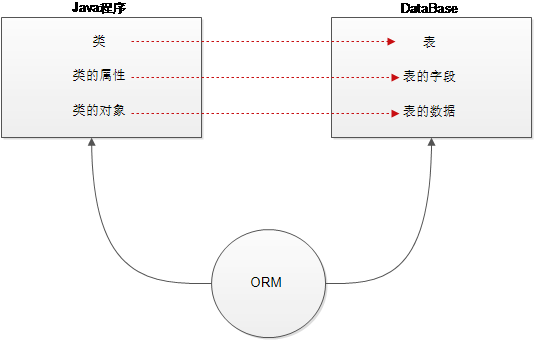

# 1.ORM思想

将对象与数据库表建立一种映射关系，这样就可以通过操作对象的方式实现对数据库表的操作.

## 1.1 映射关系

```
Java类-----------------------表
类的属性----------------------表的字段
类的对象----------------------表的数据行
```

> ORM 框架底层依然是通过JDBC技术发送SQL语句操作数据库
>
> 只不过SQL语句不需要程序员编写
>
> 而是由框架根据配置的ORM映射关系自动生成.



# 2. JPA与Hibernate介绍

**JPA是SUN针对ORM映射的标准和规范**

**Hibernate是ORM的一种实现框架**

**JPA的优点:**

```
1. 面向接口编程,标准化开发
2. 配置简单,易用
3. 提供了面向对象的查询语言,类似于SQL语法,易于查询
```


# 3. JPA入门案例

## 3.1 导入依赖

```xml
<properties>
    <project.build.sourceEncoding>UTF-8</project.build.sourceEncoding>
    <project.hibernate.version>5.0.7.Final</project.hibernate.version>
</properties>

<dependencies>
    <!-- junit -->
    <dependency>
        <groupId>junit</groupId>
        <artifactId>junit</artifactId>
        <version>4.12</version>
        <scope>test</scope>
    </dependency>

    <!-- hibernate对jpa的支持包 -->
    <dependency>
        <groupId>org.hibernate</groupId>
        <artifactId>hibernate-entitymanager</artifactId>
        <version>${project.hibernate.version}</version>
    </dependency>

    <!-- c3p0 -->
    <dependency>
        <groupId>org.hibernate</groupId>
        <artifactId>hibernate-c3p0</artifactId>
        <version>${project.hibernate.version}</version>
    </dependency>

    <!-- log日志 -->
    <dependency>
        <groupId>log4j</groupId>
        <artifactId>log4j</artifactId>
        <version>1.2.17</version>
    </dependency>

    <!-- Mysql and MariaDB -->
    <dependency>
        <groupId>mysql</groupId>
        <artifactId>mysql-connector-java</artifactId>
        <version>5.1.6</version>
    </dependency>
</dependencies>
```

## 3.2 准备数据

```sql
/*创建客户表*/
CREATE TABLE cst_customer (
  cust_id bigint(32) NOT NULL AUTO_INCREMENT COMMENT '客户编号(主键)',
  cust_name varchar(32) NOT NULL COMMENT '客户名称(公司名称)',
  cust_source varchar(32) DEFAULT NULL COMMENT '客户信息来源',
  cust_industry varchar(32) DEFAULT NULL COMMENT '客户所属行业',
  cust_level varchar(32) DEFAULT NULL COMMENT '客户级别',
  cust_address varchar(128) DEFAULT NULL COMMENT '客户联系地址',
  cust_phone varchar(64) DEFAULT NULL COMMENT '客户联系电话',
  PRIMARY KEY (`cust_id`)
) ENGINE=InnoDB AUTO_INCREMENT=1 DEFAULT CHARSET=utf8;
```

## 3.2 建立映射关系

```java
@Entity //声明实体类
@Table(name="cst_customer") //建立实体类和表的映射关系
public class Customer {
	
	@Id//声明当前私有属性为主键
	@GeneratedValue(strategy=GenerationType.IDENTITY) //配置主键的生成策略
	@Column(name="cust_id") //指定和表中cust_id字段的映射关系
	private Long custId;
	
	@Column(name="cust_name") //指定和表中cust_name字段的映射关系
	private String custName;
	
	@Column(name="cust_source")//指定和表中cust_source字段的映射关系
	private String custSource;
	
	@Column(name="cust_industry")//指定和表中cust_industry字段的映射关系
	private String custIndustry;
	
	@Column(name="cust_level")//指定和表中cust_level字段的映射关系
	private String custLevel;
	
	@Column(name="cust_address")//指定和表中cust_address字段的映射关系
	private String custAddress;
	
	@Column(name="cust_phone")//指定和表中cust_phone字段的映射关系
	private String custPhone;
    
    //get...set...方法
}
```

> 注意:实体类的配置,表名和属性名的映射可以省略,但是@Id和@Entity的配置不能省略

## 3.4 编写核心配置文件

* 文件位置

  META-INF/persistence.xml

* 文件内容

```xml
<persistence xmlns="http://java.sun.com/xml/ns/persistence" version="2.0">
     <!--transaction-type:RESOURCE_LOCAL 本地事务; JTA:分布式事务 -->
    <persistence-unit name="myJpa" transaction-type="RESOURCE_LOCAL">
        <!--jpa的实现方式 -->
        <provider>org.hibernate.jpa.HibernatePersistenceProvider</provider>
        <properties>
            <property name="javax.persistence.jdbc.user" value="root"/>
            <property name="javax.persistence.jdbc.password" value="root"/>
            <property name="javax.persistence.jdbc.driver" value="com.mysql.jdbc.Driver"/>
            <property name="javax.persistence.jdbc.url" value="jdbc:mysql:///jpa"/>
            <!--是否打印SQL-->
            <property name="hibernate.show_sql" value="true" />
            <!--是否格式化SQL-->
            <property name="hibernate.format_sql" value="true" />
            <!--DDL语句设置-->
            <property name="hibernate.hbm2ddl.auto" value="update" />
            <!--
				hbm2ddl取值:
						create: 程序运行时创建数据库表（如果有表，先删除表再创建）
                        update：程序运行时创建表（如果有表，不会创建表）
                        none：不会创建表
			-->
        </properties>
    </persistence-unit>
</persistence>
```

## 3.5 保存数据

```java
//获得EntityManagerFactory
EntityManagerFactory factory = Persistence.createEntityManagerFactory("myJpa");
//获得实体管理类
EntityManager em = factory.createEntityManager();
//获取事务对象
EntityTransaction tx = em.getTransaction();
//开启事务
tx.begin();
//准备数据
Customer c = new Customer();
c.setCustName("传智播客");
//保存操作
em.persist(c);	
//提交事务
tx.commit();
//释放资源
em.close();
factory.close();
```

## 3.6主键生成策略

* SEQUENCE:序列(Oracle数据库用)
* IDENTITY:数据库自增(Mysql数据库用)
* TABLE:Hibernate负责生成主键值,并自动创建一个序列表,存储实体类对应表中的主键值.
* AUTO:Hibernate自动选择主键生成策略(优先选择使用SEQUENCE)

# 4. JPA常用API介绍

## 4.1 Persistence

作用：加载配置文件,创建EntityManagerFactory对象

## 4.2 EntityManagerFactory

创建EntityManager对象,并且是线程安全对象,全局共享一个即可

## 4.3 EntityManager

CURD操作的核心对象

```java
getTransaction : 获取事务对象
persist ： 保存操作
merge ： 更新操作
remove ： 删除操作
find/getReference ： 根据id查询
```

## 4.4 EntityTransaction

操作事务的对象

```
begin：开启事务
commit：提交事务
rollback：回滚事务
```

# 5. JPA增删改查案例

创建JPA工具类

```java
/**
 * JPA工具类,用来获得EntityManager对象
 */
public class JpaUtils {
    private static EntityManagerFactory factory;
    static  {
        factory = Persistence.createEntityManagerFactory("myJpa");
    }
    public static EntityManager getEntityManager() {
       return factory.createEntityManager();
    }
}
```

## 5.1 根据ID查询对象

```java
/**
 * 根据ID查询对象,立即加载
 */
public void testFind() {
    EntityManager entityManager = JpaUtils.getEntityManager();
    //参数一:返回结果封装的类型; 参数二:主键
    Customer customer = entityManager.find(Customer.class, 1L);
    System.out.print(customer);
    entityManager.close();
}
```

```java
/**
* 根据ID查询对象,懒加载
*/
public  void testReference() {
    EntityManager entityManager = JpaUtils.getEntityManager();
    //参数一:返回结果封装的类型; 参数二:主键
    Customer customer = entityManager.getReference(Customer.class, 1L);
    System.out.print(customer);
    entityManager.close();
}
```

find和getReference的的异同

* 相同点

  都可以根据ID查询对象数据

* 不同点

  ```
  1. find方法立即加载，getReference懒加载
  2. find方法返回实体类对象,getReference返回代理对象
  3. 如果未查询到数据,find方法返回null,getReference会报错.
  ```

## 5.2 根据ID删除对象

```java
/**
 * 删除客户的案例
 */
@Test
public  void testRemove() {
    EntityManager entityManager = JpaUtils.getEntityManager();
    EntityTransaction tx = entityManager.getTransaction();
    tx.begin();
    //查询客户
    Customer customer = entityManager.find(Customer.class,1L);
    //删除客户
    entityManager.remove(customer);
    tx.commit();
    entityManager.close();
}
```

## 5.3 根据ID更新对象

```java
public  void testUpdate() {
    EntityManager entityManager = JpaUtils.getEntityManager();
    EntityTransaction tx = entityManager.getTransaction();
    tx.begin();
    //查询客户
    Customer customer = entityManager.find(Customer.class,1l);
    //更新客户
    customer.setCustIndustry("it教育");
    entityManager.merge(customer);
    //4.提交事务
    tx.commit();
    //5.释放资源
    entityManager.close();
}
```

# 6. JPA复杂查询

使用JPQL进行复杂查询

JPQL全称Java Persistence Query Language,是一种类似于SQL语法的面向对象的查询语言

* 注意事项
  * Jpql的类名和属性名是大小写敏感,sql相关的关键字是大小写不敏感
  * Jpql不支持"*"查询,如果查询所有from 类名即可,返回的List<类型>
  * 如果查询部分属性(字段信息),返回的数据类型List<Object[]>

## 6.1 查询全部

```java
public void testFindAll() {
    EntityManager em = JpaUtils.getEntityManager();
    //编写JPQL语句
    String jpql = "from Customer";
    //执行查询
    Query query = em.createQuery(jpql);
    //解析结果
    List list = query.getResultList();
    for (Object obj : list) {
        System.out.print(obj);
    }
    em.close();
}
```

## 6.2 分页查询

```java
public void testPaged() {
    EntityManager em = JpaUtils.getEntityManager();
    //编写查询语句
    String jpql = "from Customer";
    Query query = em.createQuery(jpql);
    //起始索引
    query.setFirstResult(0);
    //每页查询的条数
    query.setMaxResults(2);
    List list = query.getResultList();
    for(Object obj : list) {
        System.out.println(obj);
    }
    em.close();
}
```

## 6.3 条件查询

```java
public void testCondition() {
    EntityManager em = JpaUtils.getEntityManager();
    //编写查询语句
    String jpql = "from Customer where custName like ? ";
    //String jpql = "from Customer where custName like :custName ";
    Query query = em.createQuery(jpql);
    query.setParameter(1,"传智播客%");
    //query.setParameter("custName","传智播客%");
    List list = query.getResultList();
    for(Object obj : list) {
        System.out.println(obj);
    }
    em.close();
}
```

## 6.4 排序查询

```java
public void testOrders() {
    EntityManager em = JpaUtils.getEntityManager();
    String jpql = "from Customer order by custId desc";
    Query query = em.createQuery(jpql);
    List list = query.getResultList();
    for (Object obj : list) {
        System.out.println(obj);
    }
    em.close();
}
```

## 6.5 统计查询

```java
@Test
public void testCount() {
    EntityManager em = JpaUtils.getEntityManager();
    //编写JPQL语句
    String jpql = "select count(custId) from Customer";
    Query query = em.createQuery(jpql);
    //查询唯一结果
    Object result = query.getSingleResult();
    System.out.println(result);
    em.close();
}
```
