# 1. Oracle简介

ORACLE 数据库系统是美国ORACLE 公司（甲骨文）提供的以分布式数据库为核心的一组软件产品，是目前最流行的客户/服务器(CLIENT/SERVER)或 B/S体系结构的数据库之一。比如SilverStream 就是基于数据库的一种中间件。ORACLE数据库是目前世界上使用最为广泛的数据库管理系统，作为一个通用的数据库系统，它具有完整的数据管理功能；作为一个关系数据库，它是一个完备关系的产品；作为分布式数据库它实现了分布式处理功能。但它的所有知识，只要在一种机型上学习了 ORACLE知识，便能在各种类型的机器上使用它。

# 2. Oracle安装

[Oracle安装文档](./OracleInstall.pdf)

# 3. Oracle 体系结构

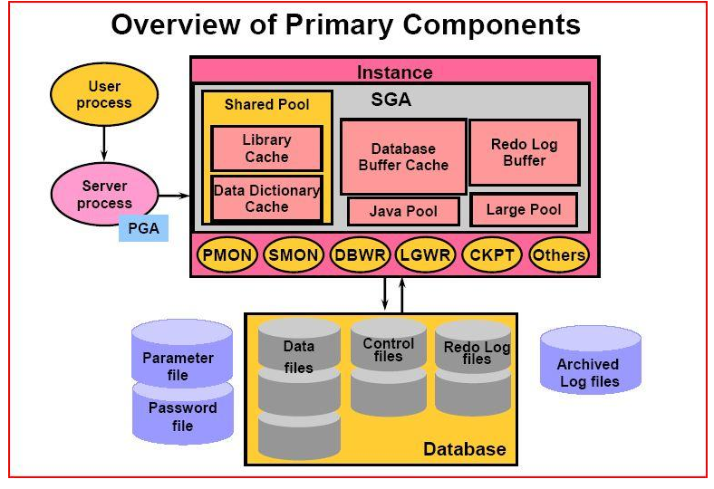

## 3.1 数据库

Oracle 数据库是数据的物理存储。这就包括（数据文件ORA或者 DBF、控制文件、联机日志、参数文件）。其实Oracle 数据库的概念和其它数据库不一样，这里的数据库是一个操作系统只有一个库。可以看作是Oracle 就只有一个大数据库。

## 3.2 实例

一个 Oracle 实例（Oracle Instance）有一系列的后台进程（Backguound Processes)和内存结构（Memory Structures)组成。一个数据库可以有 n 个实例。

## 3.3 用户

用户是在实例下建立的。不同实例可以建相同名字的用户。

## 3.4 表空间

表空间是 Oracle 对物理数据库上相关数据文件（ORA或者 DBF 文件）的逻辑映射。一个数据库在逻辑上被划分成一到若干个表空间，每个表空间包含了在逻辑上相关联的一组结构。每个数据库至少有一个表空间(称之为system表空间)。

每个表空间由同一磁盘上的一个或多个文件组成，这些文件叫数据文件(datafile)。一个数据文件只能属于一个表空间。


## 3.5 数据文件

数据文件是数据库的物理存储单位。数据库的数据是存储在表空间中的，真正是在某一个或者多个数据文件中。而一个表空间可以由一个或多个数据文件组成，一个数据文件只能属于一个表空间。一旦数据文件被加入到某个表空间后，就不能删除这个文件，如果要删除某个数据文件，只能删除其所属于的表空间才行。

>  注： 表的数据，是由用户放入某一个表空间的，而这个表空间会随机把这些表数据放到一个或者多个数据文件中。

由于 oracle 的数据库不是普通的概念，oracle 是有用户和表空间对数据进行管理和存放的。但是表不是有表空间去查询的，而是由用户去查的。因为不同用户可以在同一个表空间建立同一个名字的表！这里区分就是用户了！

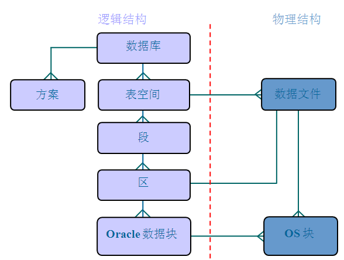

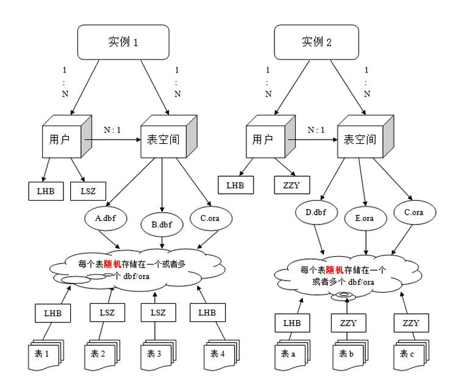

# 4. 表空间管理

## 4.1 创建表空间

```sql
--创建表空间
create tablespace itheima
datafile 'c:\itheima.dbf'
size 100m
autoextend on
next 10m;
```

itheima：为表空间名称
datafile：指定表空间对应的数据文件
size：后定义的是表空间的初始大小
autoextend on：自动增长 ，当表空间存储都占满时，自动增长
next：后指定的是一次自动增长的大小。

## 4.2 删除表空间

```sql
--删除表空间
drop tablespace itheima;
```

# 5. 用户管理

## 5.1 创建用户

```sql
--创建用户
create user itheima
identified by itheima
default tablespace itheima;
```

identified by：后边是用户的密码
default tablespace：后边是表空间名称

> oracle 数据库与其它数据库产品的区别在于，表和其它的数据库对象都是存储在用户下的。

## 5.2 用户授权

新创建的用户没有任何权限，登陆后会提示

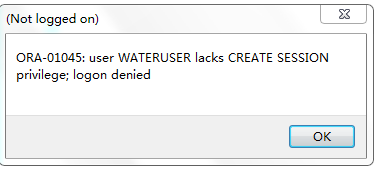

### 5.2.1 用户角色

Oracle 中已存在三个重要的角色：connect 角色，resource角色，dba角色。

* CONNECT 角色：是授予最终用户的典型权利，最基本的
  * ALTER SESSION --修改会话
  * CREATE CLUSTER --建立聚簇
  * CREATE DATABASE LINK --建立数据库链接
  * CREATE SEQUENCE --建立序列
  * CREATE SESSION --建立会话
  * CREATE SYNONYM --建立同义词
  * CREATE VIEW --建立视图

* RESOURCE 角色：是授予开发人员的
  * CREATE CLUSTER --建立聚簇
  * CREATE PROCEDURE --建立过程
  * CREATE SEQUENCE --建立序列
  * CREATE TABLE --建表
  * CREATE TRIGGER --建立触发器
  * CREATE TYPE --建立类型

* DBA角色：拥有全部特权，是系统最高权限，只有 DBA才可以创建数据库结构，并且系统权限也需要DBA授出，且 DBA用户可以操作全体用户的任意基表，包括删除等操作

### 5.2.2 授权

进入 system 用户下给用户赋予 dba 权限，否则无法正常登陆

```sql
grant dba to itcastuser
```

# 6. 数据类型

| No   | 数据类型           | 描述                                                         |
| ---- | ------------------ | ------------------------------------------------------------ |
| 1    | Varchar， varchar2 | 表示一个字符串                                               |
| 2    | NUMBER             | NUMBER(n)表示一个整数，长度是n;<br>NUMBER(m,n):表示一个小数，总长度是 m，小数是 n，整数是 m-n |
| 3    | DATA               | 表示日期类型                                                 |
| 4    | CLOB               | 大对象，表示大文本数据类型，可存 4G                          |
| 5    | BLOB               | 大对象，表示二进制数据，可存 4G                              |

# 7. 表管理

## 7.1 表管理

### 7.1.1 创建表

```sql
---创建一个person表
create table person(
       pid number(20),
       pname varchar2(10)
);
```

### 7.1.2 删除表

```sql
--删除表结构
drop table person;
```

#### 7.1.3 修改表

```sql
---修改表结构
---添加一列
alter table person add (gender number(1));
---修改列类型
alter table person modify gender char(1);
---修改列名称
alter table person rename column gender to sex;
---删除一列
alter table person drop column sex;
```

## 7.2 表数据管理

```sql
---查询表中记录
select * from person;
----添加一条记录
insert into person (pid, pname) values (1, '小明');
commit;
----修改一条记录
update person set pname = '小马' where pid = 1;
commit;
--删除表中全部记录
delete from person;
--先删除表，再次创建表。效果等同于删除表中全部记录。
truncate table person;
--在数据量大的情况下，尤其在表中带有索引的情况下，该操作效率高。
--索引可以提供查询效率，但是会影响增删改效率。
```

# 8. 序列

在很多数据库中都存在一个自动增长的列,如果现在要想在 oracle 中完成自动增长的功能,则只能依靠序列完成,所有的自动增长操作,需要用户手工完成处理。

## 8.1 定义序列

```sql
----序列不真的属于任何一张表，但是可以和逻辑表做绑定。
----序列：默认从1开始，依次递增，主要用来给主键赋值使用。
----dual：虚表，只是为了补全语法，没有任何意义。
create sequence s_person;
select s_person.nextval from dual;
```

nextval ：取得序列的下一个内容
currval ：取得序列的当前内容

## 8.2 使用序列

```sql
----添加一条记录
insert into person (pid, pname) values (s_person.nextval, '小明');
commit;
select * from person;
```

## 9. Scott用户

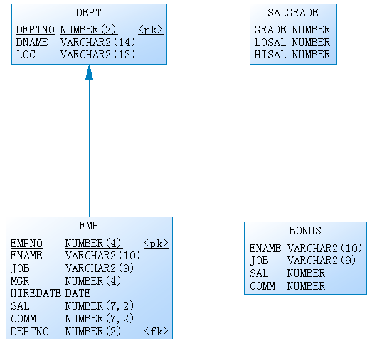

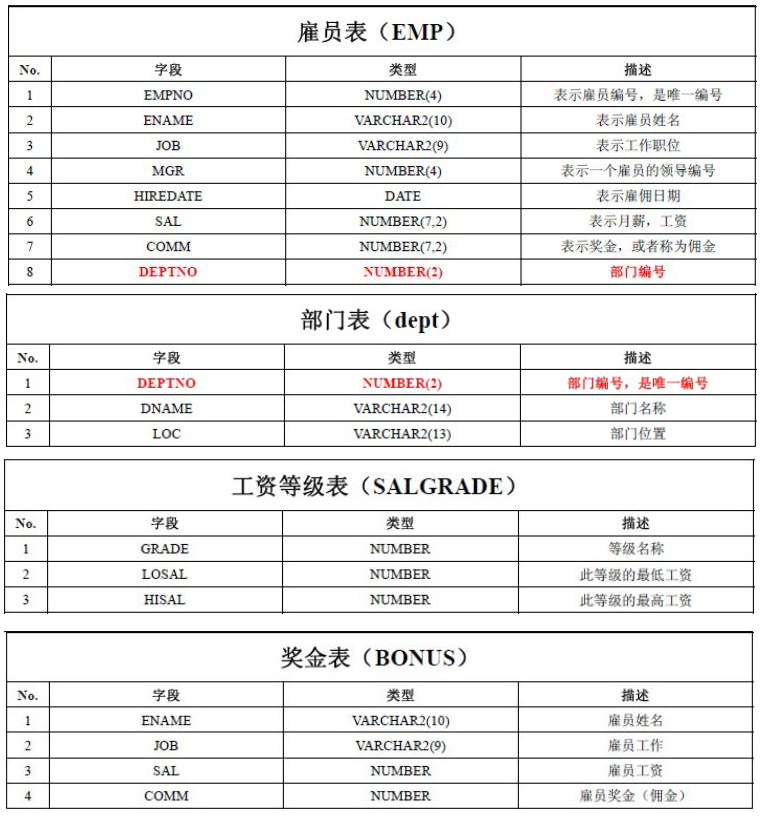

# 9. 单行函数

## 9.1 字符函数

1. 把小写的字符转换成大小的字符

```sql
upper('smith')
```

2. 把大写字符变成小写字符

```sql
lower('SMITH')
```

## 9.2 数值函数

四舍五入函数：ROUND()

默认情况下 ROUND 四舍五入取整，可以自己指定保留的位数。

TRUNC()

## 9.3 日期函数

Oracle 中提供了很多和日期相关的函数，包括日期的加减，在日期加减时有一些规律

日期 – 数字 = 日期

日期 + 数字 = 日期

日期 – 日期 = 数字

1. 查询雇员的进入公司的周数。


2. 获得两个时间段中的月数：MONTHS_BETWEEN()

   查询所有雇员进入公司的月数

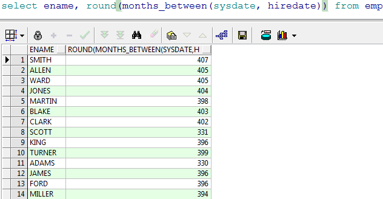

## 9.4 转换函数

1. TO_CHAR:字符串转换函数

   范例：查询所有的雇员将将年月日分开，此时可以使用TO_CHAR 函数来拆分

   拆分时需要使用通配符

   年：y, 年是四位使用 yyyy
   月：m, 月是两位使用 mm
   日：d,  日是两位使用 dd

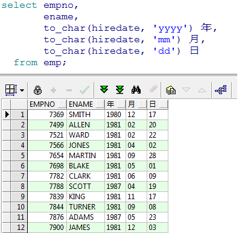

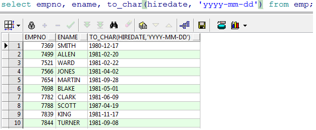

在结果中 10 以下的月前面被被补了前导零，可以使用 fm 去掉前导零


2. TO_DATE:日期转换函数

   TO_DATE可以把字符串的数据转换成日期类型

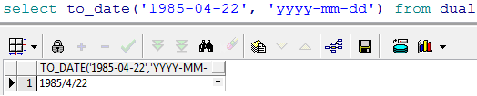

## 9.5 通用函数

1. 空值处理nvl

   范例：查询所有的雇员的年薪

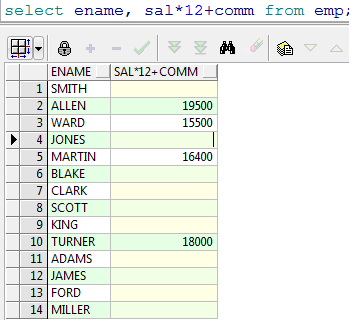

​		我们发现很多员工的年薪是空的，原因是很多员工的奖金是 null，null和任何数值计算都是null，这时我们可以使用 nvl来处理。

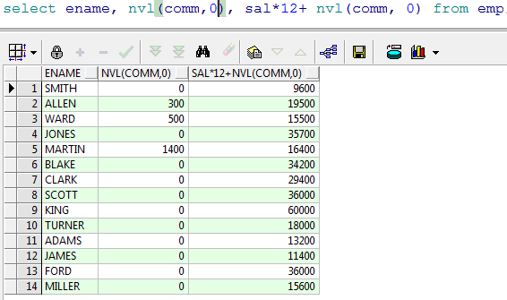

2. Decode函数

   该函数类似 if....else if...esle

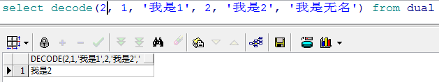

范例：查询出所有雇员的职位的中文名

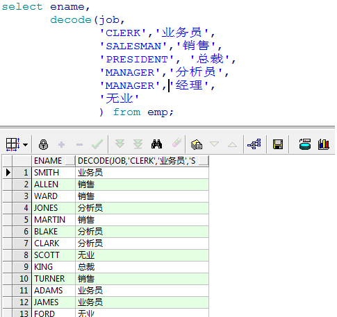

3. case when

```sql
select t.empno,
	t.ename,
	case
		when t.job = 'CLERK' 		then	'业务员'
		when t.job = 'MANAGER'  	then	 '经理'
		when t.job = 'ANALYST'     	then	'分析员'
		when t.job = 'PRESIDENT' 	then	'总裁'
		when t.job = 'SALESMAN' 	then	'销售'
		when t.job = 'SALESMAN' 	then	'销售'
		else	'无业'
	end
from emp t;
```

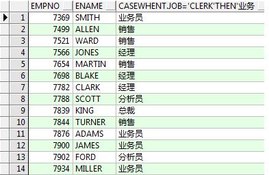

# 10. 多行函数（聚合函数）

## 10.1 统计记录数 count()

范例：查询出所有员工的记录数

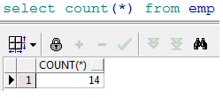

​	不建议使用 count(*)，可以使用一个具体的列以免影响性能。

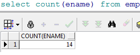

## 10.2 最小值查询 min()

范例：查询出来员工最低工资

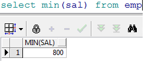

## 10.3 最大值查询 max()
范例：查询出员工的最高工资

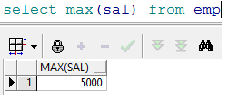

## 10.4 查询平均值 avg()

查询出员工的平均工资

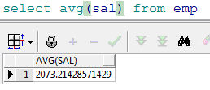

## 10.5 求和函数 sum()

范例：查询出 20 号部门的员工的工资总和

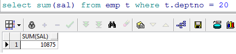

# 11. 分组统计

分组统计需要使用 GROUP BY来分组

范例：查询每个部门的人数


范例：查询出每个部门的平均工资

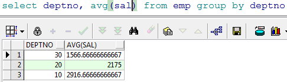

如果我们想查询出来部门编号，和部门下的人数

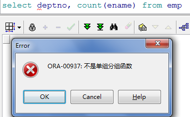

我们发现报了一个 ORA-00937 的错误

注意：
1.  如果使用分组函数，L SQL  只可以把 Y GOURP BY  分组条件字段和分组函数查询出来，不能有其
他字段。
2.  如果使用分组函数，不使用  GROUP BY  只可以查询出来分组函数的值

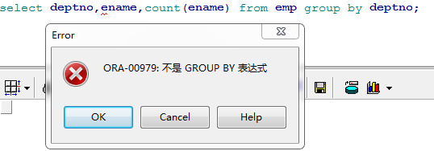

范例：按部门分组，查询出部门名称和部门的员工数量

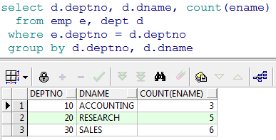

范例：查询出部门人数大于 5 人的部门

分析：需要给 count(ename)加条件，此时在本查询中不能使用 where，可以使用HAVING

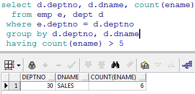

范例：查询出部门平均工资大于 2000的部门

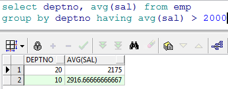

# 12. 多表查询

## 12.1 多表连接基本查询

使用一张以上的表做查询就是多表查询

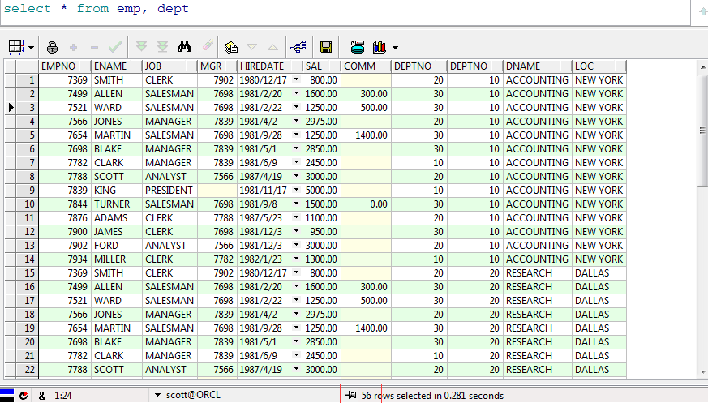

我们发现产生的记录数是 56条，我们还会发现emp 表是 14 条，dept 表是 4条，56 正是emp表和 dept表的记录数的乘积，我们称其为笛卡尔积。

如果多张表进行一起查询而且每张表的数据很大的话笛卡尔积就会变得非常大，对性能造成影响，想要去掉笛卡尔积我们需要关联查询。

在两张表中我们发现有一个共同的字段是 depno，depno 就是两张表的关联的字段，我们可以使用这个字段来做限制条件，两张表的关联查询字段一般是其中一张表的主键，另一张表的外键。

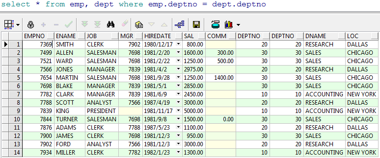

关联之后我们发现数据条数是 14条，不在是 56 条。

多表查询我们可以为每一张表起一个别名

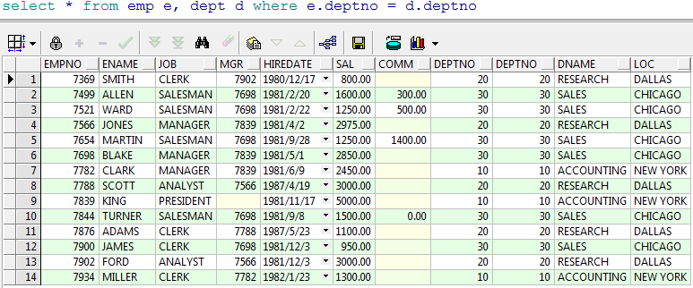

范例：查询出雇员的编号，姓名，部门的编号和名称，地址

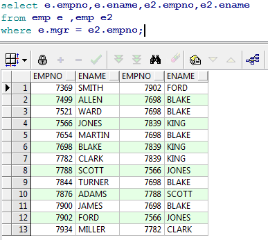

范例：查询出每个员工的上级领导
分析：emp 表中的 mgr字段是当前雇员的上级领导的编号，所以该字段对 emp表产生了自身关联，可以使用 mgr字段和 empno来关联


范例:在上一个例子的基础上查询该员工的部门名称

分析：只要在上一个例子基础上再加一张表的关联，使用deptno 来做关联字段即可

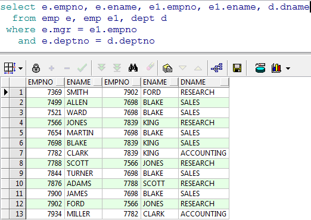

范例：查询出每个员工编号，姓名，部门名称，工资等级和他的上级领导的姓名，工资等级

```sql
select  e.empno,
		e.ename,
		decode(s.grade,
		1,'一级',
		2,'二级',
		3,'三级',
		4,'四级',
		5,'五级') grade,
		d.dname,
		e1.empno,
		e1.ename,
		decode(s1.grade,
		1,'一级',
		2,'二级',
		3,'三级',
		4,'四级',
		5,'五级') grade
from emp e, emp e1, dept d, salgrade s, salgrade s1
where e.mgr = e1.empno
	and e.deptno = d.deptno
	and e.sal between s.losal and s.hisal
	and e1.sal between s1.losal and s1.hisal
```

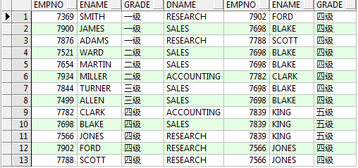

## 12.2 外连接（左右连接）

### 12.2.1 右连接

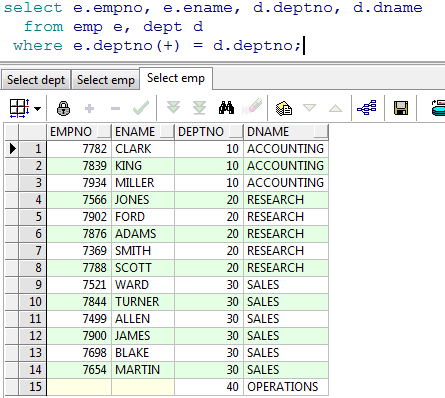

使用(+)表示左连接或者右连接，当(+)在左边表的关联条件字段上时是左连接，如果是在右边表的关联条件字段上就是右连接。

范例：查询出所有员工的上级领导

分析：我们发现使用我们以前的做法发现 KING 的上级领导没有被展示，我们需要使用左右连接把他查询出来

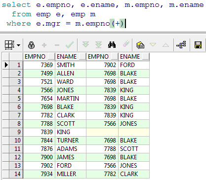

# 13. 子查询

子查询：在一个查询的内部还包括另一个查询，则此查询称为子查询。

Sql的任何位置都可以加入子查询。

范例：查询比 7654工资高的雇员

分析：查询出 7654员工的工资是多少，把它作为条件

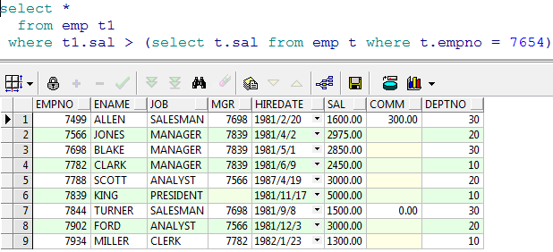

单行子查询：返回多个列，有可能是一个完整的记录

多行子查询：返回多条记录
范例：查询出比雇员 7654 的工资高，同时从事和 7788的工作一样的员工

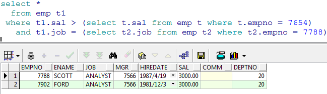

在返回多条记录的子查询可以把它的结果集当做一张表，给起个别名， 如图中的 a。

# 14. Rownum 与分页查询

ROWNUM:表示行号，实际上此是一个列,但是这个列是一个伪列,此列可以在每张表中出现。

范例：查询 emp 表带有 rownum 列

```sql
select rownum, t.* from emp t
```

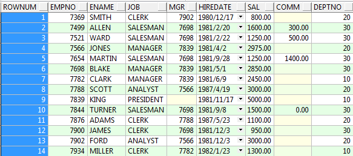

我们可以根据 rownum 来取结果集的前几行，比如前 5 行

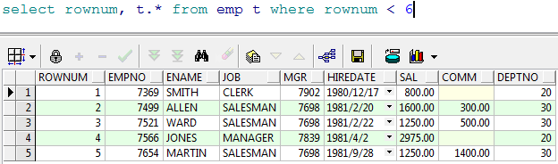

但是我们不能取到中间几行，因为rownum不支持大于号，只支持小于号，如果想 实现我们的需求怎么办呢？答案是使用子查询，也正是oracle分页的做法。

第一种写法：

```sql
select *
from (select rownum rm, a.* from (select * from emp) a where rownum < 11) b 
where b.rm >5
```

第二种写法：

```sql
select *
from (select rownum r ,emp.* from emp) b
where b.r >5 and b.r <11
```

