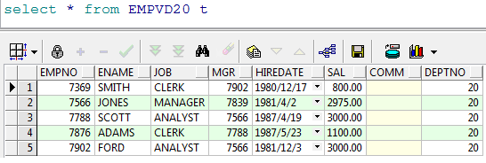
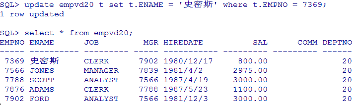
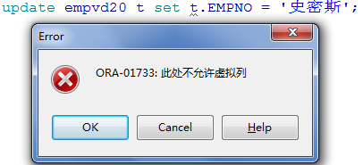
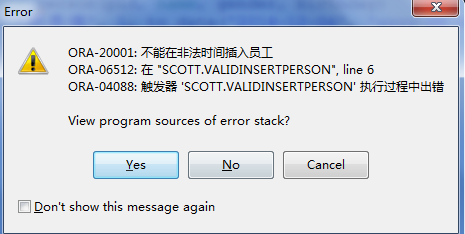
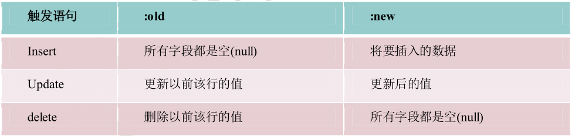
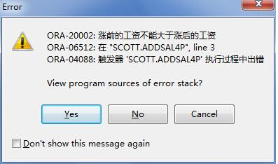
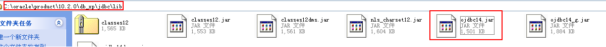
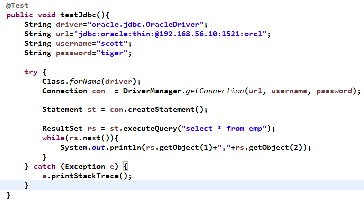

# 1. 视图

视图就是封装了一条复杂查询的语句。

语法 1.：CREATE VIEW 视图名称 AS 子查询

范例：建立一个视图，此视图包括了 20 部门的全部员工信息

```sql
create view empvd20 as select * from emp t where t.deptno = 20
```

视图创建完毕就可以使用视图来查询，查询出来的都是 20 部门的员工



语法 2：CREATE OR REPLACE VIEW 视图名称 AS 子查询

如果视图已经存在我们可以使用语法 2 来创建视图，这样已有的视图会被覆盖。

```sql
create or replace view empvd20 as select * from emp t where t.deptno = 20
```

那么视图可以修改吗？




我们尝试着修改视图但是发现是视图所查询的表的字段值被修改了。所以我们一般不会去修改视图。

我们可以设置视图为只读。

语法 3：CREATE OR REPLACE VIEW 视图名称 AS 子查询 WITH READ ONLY



作用：

	1. 屏蔽表中的敏感字段
 	2. 保证多个系统查询数据的统一性（同步）

# 2. 索引

索引是用于加速数据存取的数据对象。合理的使用索引可以大大降低 i/o 次数,从而提高数据访问性能。索引有很多种我们主要介绍常用的几种:

为什么添加了索引之后，会加快查询速度呢？

**图书馆：**如果杂乱地放书的话检索起来就非常困难,所以将书分类，然后再建一个箱子，箱子里面放卡片，卡片里面可以按类查询,按书名查或者类别查,这样的话速度会快很多很多，这个就有点像索引。索引的好处就是提高你找到书的速度，但是正是因为你建了索引，就应该有人专门来维护索引，维护索引是要有时间精力的开销的，也就是说索引是不能乱建的，所以建索引有个原则：如果有一个字段如果不经常查询，就不要去建索引。现在把书变成我们的表，把卡片变成我们的索引，就知道为什么索引会快，为什么会有开销。

创建索引的语法：

## 2.1 单列索引

单列索引是基于单个列所建立的索引，比如:

```sql
CREATE index 索引名 on 表名(列名)
```

## 2.2 复合索引

复合索引是基于两个列或多个列的索引。在同一张表上可以有多个索引，但是要求列的组合必须不同,比如：

```sql
Create index emp_idx1 on emp(ename,job);
Create index emp_idx1 on emp(job,ename);
```

范例：给 person 表的name建立索引

```sql
create index pname_index on person(name);
```

范例：给 person 表创建一个 name 和 gender 的索引

```sql
create index pname_gender_index on person(name, gender);
```

索引的使用原则：

1. 在大表上建立索引才有意义
2. 在 where子句后面或者是连接条件上的字段建立索引
3. 表中数据修改频率高时不建议建立索引

# 3. PL/SQL基本语法

## 3.1 概念

PLSQL 是 Oracle 对sql 语言的过程化扩展，指在 SQL 命令语言中增加了过程处理语句（如分支、循环等），使 SQL语言具有过程处理能力。把SQL 语言的数据操纵能力与过程语言的数据处理能力结合起来，使得 PLSQL面向过程但比过程语言简单、高效、灵活和实用。

范例 1：为职工涨工资，每人涨 10％的工资。

```sql
update emp set sal=sal*1.1
```

范例 2：例 2: 按职工的职称长工资,总裁涨 1000元,经理涨800 元，其他人员涨 400 元。

这样的需求我们就无法使用一条 SQL来实现，需要借助其他程序来帮助完成，也可以使用 pl/sql。

## 3.2 结构语法

```plsql
declare
	说明部分 （变量说明，游标申明，例外说明 〕
begin
	语句序列 （DML 语句〕…
exception
	例外处理语句
End;
```

## 3.3 常量和变量定义

###3.3.1 基本变量\常量定义语法

在程序的声明阶段可以来定义常量和变量。

变量的基本类型就是 oracle 中的建表时字段的变量如 char, varchar2, date, number,boolean, long

定义变量语法:

```plsql
varl char(15);
Psal number(9,2);
```

说明变量名、数据类型和长度后用分号结束说明语句。

定义常量语法：

```sql
married constant boolean:=true
```

### 3.3.2 引用型变量

```plsql
my_name	emp.ename%type;
```

引用型变量，即my_name 的类型与emp 表中 ename 列的类型一样

在 sql中使用 into 来赋值

```plsql
declare
	emprec emp.ename%type;
begin
	select t.ename into emprec from emp t where t.empno = 7369;
	dbms_output.put_line(emprec);
end;
```

### 3.3.3 记录型变量

```plsql
emp_rec emp%rowtype;
```

记录变量分量的引用

```plsql
emp_rec.ename:='ADAMS';
```

```plsql
declare
	p emp%rowtype;
begin
	select * into p from emp t where t.empno = 7369;
	dbms_output.put_line(p.ename || ' ' || p.sal);
end;
```

## 3.4 if分支

语法 1：

```plsql
IF 条件 THEN  语句 1;
语句 2;
END IF;
```

语法2：

```plsql
IF 条件 THEN 语句序列 1 ；
ELSE 语句序列 2 ；
END IF ；
```

语法 3：

```plsql
IF 条件1 THEN  语句;
ELSIF 条件2 THEN 语句;
ELSE 语句;
END IF;
```

范例 1：如果从控制台输入 1 则输出我是 1

```plsql
declare
	pnum number := &num;
begin
	if pnum = 1 then
		dbms_output.put_line('我是1');
	end if;
end;
```

范例 2：如果从控制台输入 1 则输出我是 1否则输出我不是 1

```plsql
declare
	mynum number := &num;
begin
	if mynum = 1 then
		dbms_output.put_line('我是1');
	else
		dbms_output.put_line('我不是1');
	end if;
end;
```

范例 3:判断人的不同年龄段 18岁以下是未成年人，18岁以上 40以下是成年人，40以上是老年人

```plsql
declare
	mynum number := &num;
begin
	if mynum < 18 then
		dbms_output.put_line('未成年人');
	elsif mynum >= 18 and mynum < 40 then
		dbms_output.put_line('中年人');
	elsif mynum >= 40 then
		dbms_output.put_line('老年人');
	end if;
end;
```

## 3.5 LOOP循环分支

语法 1：

```plsql
WHILE total <= 25000 
LOOP
	...
	total : = total + salary;
END LOOP;
```

语法 2：

```plsql
Loop
EXIT [when 条件];
……
End loop
```

语法 3：

```plsql
FOR I IN 1 . . 3 
LOOP
语句序列 ;
END LOOP ;
```

范例：使用语法 1 输出 1 到10 的数字

```plsql
declare
	step number := 1;
begin
	while step <= 10 loop
		dbms_output.put_line(step);
		step := step + 1;
	end loop;
end;
```

范例：使用语法 2 输出 1 到10 的数字

```plsql
declare
	step number := 1;
begin
	loop
		exit when step > 10;
		dbms_output.put_line(step);
		step := step + 1;
	end loop;
end;
```

范例：使用语法 3 输出 1 到10 的数字

```plsql
declare
	step number := 1;
begin
	for step in 1 .. 10 
		loop
			dbms_output.put_line(step);
		end loop;
end;
```

# 4. 游标 Cursor

在写 java 程序中有集合的概念，那么在 pl/sql 中也会用到多条记录，这时候我们就要用到游标，游标可以存储查询返回的多条数据。

语法：

```plsql
CURSOR 游标名 [ (参数名 数据类型,参数名 数据类型,...)] IS SELECT 语句;
```

例如： 

```plsql
cursor c1 is select ename from emp;
```

游标的使用步骤：

1. 打开游标： open c1; (打开游标执行查询)
2. 取一行游标的值：fetch c1 into pjob; (取一行到变量中)
3. 关闭游标： close c1;(关闭游标释放资源)
4. 游标的结束方式 exit when c1%notfound

> 上面的 pjob 必须与 emp表中的 job 列类型一致：
>
> 定义：pjob emp.empjob%type;

范例 1：使用游标方式输出 emp 表中的员工编号和姓名

```plsql
declare
	cursor pc is select * from emp;
	pemp emp%rowtype;
begin
	open pc;
		loop
			fetch pc into pemp;
			exit when pc%notfound;
			dbms_output.put_line(pemp.empno || ' ' || pemp.ename);
		end loop;
	close pc;
end;
```

范例 2：按员工的工种涨工资,总裁 1000 元，经理涨 800 元其，他人员涨 400 元。

```plsql
-- 备份出一张新表为 myemp;
create table myemp as select * from emp;q
```

```plsql
declare
	cursor pc is select * from myemp;
	addsal myemp.sal%type;
	pemp myemp%rowtype;
begin
	open pc;
		loop
			fetch pc into pemp;
			exit when pc%notfound;
			if 
				pemp.job = 'PRESIDENT' then addsal := 1000;
				elsif pemp.job = 'MANAGER' then addsal := 800;
				else addsal := 400;
			end if;
			update myemp t set t.sal = t.sal + addsal where t.empno =pemp.empno;
		end loop;
	close pc;
end;
```

范例 3：写一段PL/SQL 程序，为10号部门员工涨工资1000元。

```plsql
declare
	cursor pc(dno myemp.deptno%type) is select empno from myemp where deptno = dno;
	pno myemp.empno%type;
begin
	open pc(20);
		loop
			fetch pc into pno;
			exit when pc%notfound;
			update myemp t set t.sal = t.sal + 1000 where t.empno = pno;
		end loop;
	close pc;
end
```

# 5. 存储过程

存储过程（Stored Procedure）是在大型数据库系统中，一组为了完成特定功能的 SQL 语句集，经编译后存储在数据库中，用户通过指定存储过程的名字并给出参数（如果该存储过程带有参数）来执行它。存储过程是数据库中的一个重要对象，任何一个设计良好的数据库应用程序都应该用到存储过程。

创建存储过程语法：

```plsql
create [or replace] PROCEDURE  过程名[( 参数名 in/out  数据类型)]
AS
begin
	PLSQL 子程序体；
End;
--或者
create [or replace] PROCEDURE  过程名[( 参数名 in/out  数据类型)]
is
begin
	PLSQL 子程序体；
End 过程名;
```

范例1：创建一个输出 helloword 的存储过程

```plsql
create or replace procedure helloworld 
is
begin
	dbms_output.put_line('helloworld');
end helloworld;
```

在 plsql中调用存储过程

```plsql
begin
-- Call the procedure
helloworld ;
end;
```

范例 2：给指定的员工涨 100 工资，并打印出涨前和涨后的工资

分析：我们需要使用带有参数的存储过程

```plsql
create or replace procedure addSal1(eno in number) 
is
	pemp myemp%rowtype;
begin
	select * into pemp from myemp where empno = eno;
	update myemp set sal = sal + 100 where empno = eno;
	dbms_output.put_line('涨工资前' || pemp.sal || '涨工资后' || (pemp.sal + 100));
end addSal1;
```

调用

```plsql
begin
-- Call the procedure
addsal1(eno => 7902);
commit;
end;
```

# 6. 存储函数

```plsql
create or replace function  函数名(Name in type, Name in type, ...) return  数据类型 
is
	结果变量  数据类型;
begin
	return( 结果变量);
end 函数名;
```

存储过程和存储函数的区别


范例：使用存储函数来查询指定员工的年薪

```plsql
create or replace function empincome(eno in emp.empno%type) return	number 
is
	pemp emp%rowtype;
begin
	select t.* into pemp from emp t where t.empno = eno;
	return pemp.sal * 12 + nvl(pemp.comm, 0);
end;
```

使用存储过程来替换上面的例子

```plsql
create or replace procedure empincomep(eno in emp.empno%type,income out number) 
is
	psal emp.sal%type;
	pcomm emp.comm%type;
begin
	select t.sal, t.comm into psal, pcomm from emp t where t.empno=eno;
	income :=  psal *12+nvl(pcomm,0);
end;
```

调用：

```plsql
declare
	income number;
begin
	empincomep(7369, income);
	dbms_output.put_line(income);
end;
```

# 7. 触发器

##6.1 概念

数据库触发器是一个与表相关联的、存储的 PL/SQL 程序。每当一个特定的数据操作语句(Insert,update,delete)在指定的表上发出时，Oracle 自动地执行触发器中定义的语句序列。

触发器可用于：

1. 数据确认
2. 实施复杂的安全性检查
3. 做审计，跟踪表上所做的数据操作等
4. 数据的备份和同步

## 6.2 类型

* 语句级触发器 ：在指定的操作语句操作之前或之后执行一次，不管这条语句影响了多少行 。

* 行级触发器：触发语句作用的每一条记录都被触发。在行级触 发器中使用 old 和 new伪记录变量, 识别值的状态。

## 6.3 语法

```plsql
CREATE [or REPLACE] TRIGGER 触发器名
	{BEFORE | AFTER}
	{DELETE | INSERT | UPDATE [OF  列名]}
	ON 表名
	[FOR EACH ROW [WHEN( 条件) ] ]
begin
	PLSQL块
End;
```

范例：插入员工后打印一句话“一个新员工插入成功”

```plsql
create or replace trigger testTrigger
	after 
	insert on person
declare
	-- local variables here
begin
	dbms_output.put_line('一个员工被插入');
end;
```

范例：不能在休息时间插入员工

```plsql
create or replace trigger validInsertPerson
	before 
	insert on person
declare
	weekend varchar2(10);
begin
	select to_char(sysdate, 'day') into weekend from dual;
	if weekend in ('星期一') 
		then raise_application_error(-20001, '不能在非法时间插入员工');
	end if;
end;
```

当执行插入时会报错



在行级触发器中触发语句与伪记录变量的值



范例：判断员工涨工资之后的工资的值一定要大于涨工资之前的工资

```plsql
create or replace trigger addsal4p
	before 
	update of sal on myemp
	for each row
begin
	if :old.sal >= :new.sal 
		then raise_application_error(-20002, '涨前的工资不能大于涨后的工资');
	end if;
end;
```

调用

```plsql
update myemp t set t.sal = t.sal - 1;
```



# 8. Java应用调用存储过程

## 7.1 环境搭建

1. 导入连接Oracle的驱动包



2. 数据库连接字符串

```java
String driver="oracle.jdbc.OracleDriver";
String url="jdbc:oracle:thin:@192.168.56.10:1521:orcl";
String username="scott";
String password="tiger";
```

3. 测试代码

​	

## 7.2 实现过程的调用

1. 过程定义

```plsql
-- 统计年薪的过程
create or replace procedure proc_countyearsal(eno in number,esal out number)
as
begin
	select sal*12+nvl(comm,0) into esal from emp where empno=eno;
end;
```

```plsql
-- 调用
declare
	esal number;
begin
	proc_countyearsal(7839,esal);
	dbms_output.put_line(esal);
end;
```

2. Java调用过程

```java
@Test
public void testProcedure01(){
	String driver="oracle.jdbc.OracleDriver";
	String url="jdbc:oracle:thin:@192.168.56.10:1521:orcl";
	String username="scott";
	String password="tiger";
	try {
		Class.forName(driver);
		Connection con = DriverManager.getConnection(url,username, password);
		CallableStatement  callSt  =  con.prepareCall("{call proc_countyearsal(?,?)}");
		callSt.setInt(1, 7839);
		callSt.registerOutParameter(2, OracleTypes.NUMBER);
		callSt.execute();
		System.out.println(callSt.getObject(2));
	} catch (Exception e) {
		e.printStackTrace();
	}
}
```

