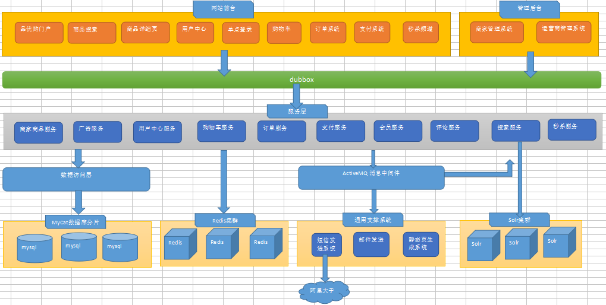
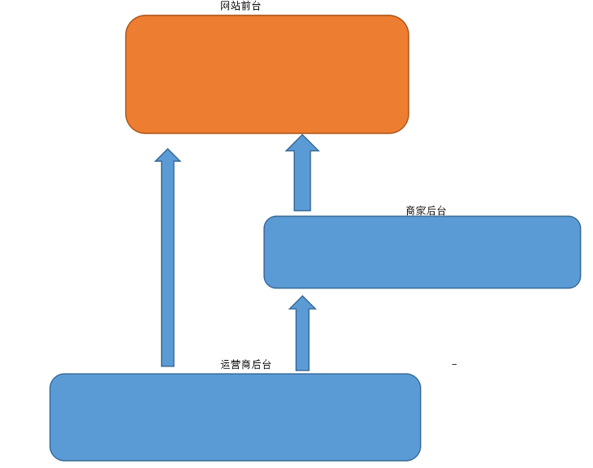

# 1. 了解电商行业特点并理解常见电商的模式

### [大型网站演变过程](./pic/大型网站演变过程.png)

### 1.1 电商技术特点

1. 用户多,高并发
1. 高可用:7*24小时不间断访问
1. 海量文件的存储
1. 安全要求性高
1. 一路演变而来,技术发展的目的是更好的处理业务.


### 1.2 电商模式

  * B2B:企业2企业;	阿里巴巴
  * B2C:企业2个人;     苏宁
  * C2C:个人2个人;     淘宝
  * C2B:个人2企业;     家装行业;土巴兔
  * F2C:工厂2个人;      格力
  * O2O:Online2Offline;线上到线上; 团购网站
  * B2B2C:企业2企业2个人;  品优购;京东;天猫

# 2. 了解整体品优购的架构特点

### 2.1 分布式架构优点

    1. 解耦
    2. 提高服务的复用和扩展



 ### 2.2 品优购架构
  后台:SSM+Dubbo
  前台:AngularJS+Bootstrap
  数据交互:Ajax
  数据格式:JSON



###2.3 Dubbo组件的运行原理

  1.  启动服务的提供方

  2.  服务提供方将服务的地址信息注册到注册中心

  3.  服务消费方启动,在注册中新中查找需要的所需服务地址信息

  4.  注册中心以长连接的方式通知服务的消费方服务变更信息

  5.  服务消费方通过服务的地址调用远程的服务

  6.  服务消费方和服务提供方会定期向dubbox的监控中心上报数据

  ###Dubbox组件
  Provider: 服务提供方。
  Consumer: 服务消费方。
  Registry: 注册中心。
  Monitor: 监控中心。
  Container: 容器。


# 3. Dubbo入门案例

### 虚拟机网路配置

1. 仅主机:相当于虚拟机和宿主机用一根网线连接，主机任何时候都可以连接虚拟机。
2. NAT:虚拟机将主机当作交换机,如果宿主机连上，虚拟机能够上网
3. 桥接:虚拟机相当于主机直接连接到外部交换机，宿主机有独立的IP地址

### 注册中心zookeeper安装

1. 将本地的zookeeper软件上传到Linux系统

2. 解压zookeeper软件; ```tar -zvxf   XXXX.tar.gz```

3. 进入zookeeper的目录中,创建data文件夹, ```mkdir data```

4. 进入conf目录下,将zoo.sample.cfg 修改为 zoo.cfg;  ```mv  zoo.sample.cfg zoo.cfg```

5. 在zoo.cfg中配置data目录; 

6. 使用 vi命令编辑文件
   1. vi编辑文件,按下esc键进入命令模式在,输入```:sh```,可以回到shell命令行
   2. 通过```control+d```回到vi模式

7. 进入到bin目录在启动zookeeper
   1. 启动 ``` ./zkServer.sh start```
   2. 关闭 ``` ./zkServer.sh stop```
   3. 查看启动状态 ```./zkServer.sh status```


### dubbo服务提供方

1. 创建Web工程,添加依赖

   ```xml
   <properties>
       <spring.version>4.2.4.RELEASE</spring.version>
   </properties>
   
   <dependencies>
   
       <!-- Spring -->
       <dependency>
           <groupId>org.springframework</groupId>
           <artifactId>spring-context</artifactId>
           <version>${spring.version}</version>
       </dependency>
       <dependency>
           <groupId>org.springframework</groupId>
           <artifactId>spring-beans</artifactId>
           <version>${spring.version}</version>
       </dependency>
       <dependency>
           <groupId>org.springframework</groupId>
           <artifactId>spring-webmvc</artifactId>
           <version>${spring.version}</version>
       </dependency>
       <dependency>
           <groupId>org.springframework</groupId>
           <artifactId>spring-jdbc</artifactId>
           <version>${spring.version}</version>
       </dependency>
       <dependency>
           <groupId>org.springframework</groupId>
           <artifactId>spring-aspects</artifactId>
           <version>${spring.version}</version>
       </dependency>
       <dependency>
           <groupId>org.springframework</groupId>
           <artifactId>spring-jms</artifactId>
           <version>${spring.version}</version>
       </dependency>
       <dependency>
           <groupId>org.springframework</groupId>
           <artifactId>spring-context-support</artifactId>
           <version>${spring.version}</version>
       </dependency>
       <dependency>
           <groupId>org.springframework</groupId>
           <artifactId>spring-test</artifactId>
           <version>${spring.version}</version>
       </dependency>
       <!-- dubbo相关 -->
       <dependency>
           <groupId>com.alibaba</groupId>
           <artifactId>dubbo</artifactId>
           <version>2.8.4</version>
       </dependency>
       <dependency>
           <groupId>org.apache.zookeeper</groupId>
           <artifactId>zookeeper</artifactId>
           <version>3.4.6</version>
       </dependency>
       <dependency>
           <groupId>com.github.sgroschupf</groupId>
           <artifactId>zkclient</artifactId>
           <version>0.1</version>
       </dependency>
       <dependency>
           <groupId>junit</groupId>
           <artifactId>junit</artifactId>
           <version>4.9</version>
       </dependency>
       <dependency>
           <groupId>javassist</groupId>
           <artifactId>javassist</artifactId>
           <version>3.11.0.GA</version>
       </dependency>
   </dependencies>
   
   <build>
       <plugins>
           <plugin>
               <groupId>org.apache.tomcat.maven</groupId>
               <artifactId>tomcat7-maven-plugin</artifactId>
               <version>2.2</version>
               <configuration>
                   <!-- 指定端口 -->
                   <port>8180</port>
                   <!-- 请求路径 -->
                   <path>/</path>
               </configuration>
           </plugin>
       </plugins>
   </build>
   ```

2. 配置web.xml,加载Spring框架

   ```xml
   <!-- 加载 spring 容器 -->
   <context-param>
       <param-name>contextConfigLocation</param-name>
       <param-value>classpath:applicationContext*.xml</param-value>
   </context-param>
   <listener>
       <listener-class>org.springframework.web.context.ContextLoaderListener</listener-class>
   </listener>
   ```

3. 创建服务的接口

   ```java
   package cn.itcast.dubbodemo.service;
   public interface UserService {
       public String getName();
   }
   ```

4. 创建服务接口的实现类

   ```java
   import com.alibaba.dubbo.config.annotation.Service;
   
   @Service
   public class UserServiceImpl implements UserService {
   
       public String getName() {
           return "Hello Dobbox";
       }
   }
   ```

5. 在服务的实现类上配置```@Service```(alibaba包下)的注解

6. 配置Spring的配置文件,将服务注册到zookeeper

   ```xml
   <!--服务名称-->
   <dubbo:application name="dubboxdemo-service"/>
   <!--注册中心的地址-->
   <dubbo:registry address="zookeeper://192.168.25.135:2181"/>
   <!--服务所在的包,扫描@Service注解-->
   <dubbo:annotation package="cn.itcast.dubbodemo.service" />
   ```

7. 在classpath下添加log4j.properties

### dubbo服务消费方

1. 创建Web工程,添加依赖

   和服务提供者一样

2. 配置web.xml,加载Spring-mvc框架

   ```xml
   <web-app>
       <display-name>Archetype Created Web Application</display-name>
       <!-- 解决 post 乱码 -->
       <filter>
           <filter-name>CharacterEncodingFilter</filter-name>
           <filter-class>org.springframework.web.filter.CharacterEncodingFilter</filter-class>
           <init-param>
               <param-name>encoding</param-name>
               <param-value>utf-8</param-value>
           </init-param>
           <init-param>
               <param-name>forceEncoding</param-name>
               <param-value>true</param-value>
           </init-param>
       </filter>
       <filter-mapping>
           <filter-name>CharacterEncodingFilter</filter-name>
           <url-pattern>/*</url-pattern>
       </filter-mapping>
       <servlet>
           <servlet-name>springmvc</servlet-name>
           <servlet-class>org.springframework.web.servlet.DispatcherServlet</servlet-class>
           <!-- 指定加载的配置文件 ，通过参数 contextConfigLocation 加载-->
           <init-param>
               <param-name>contextConfigLocation</param-name>
               <param-value>classpath:applicationContext-web.xml</param-value>
           </init-param>
       </servlet>
       <servlet-mapping>
           <servlet-name>springmvc</servlet-name>
           <url-pattern>*.do</url-pattern>
       </servlet-mapping>
   </web-app>
   ```

3. 拷贝服务提供方的接口文件,**Service接口的包名必须和提供者一致**

   ```java
   package cn.itcast.dubbodemo.service;
   public interface UserService {
       public String getName();
   }
   ```

4. 创建Controller,添加接口属性,通过```@Reference```注入接口的实现类

   ```java
   import cn.itcast.dubbodemo.service.UserService;
   import com.alibaba.dubbo.config.annotation.Reference;
   import org.springframework.stereotype.Controller;
   import org.springframework.web.bind.annotation.RequestMapping;
   import org.springframework.web.bind.annotation.ResponseBody;
   
   @Controller
   @RequestMapping("/user")
   public class UserController {
   
       @Reference
       private UserService userService;
   
       @RequestMapping("/showName")
       @ResponseBody
       public String showName() {
           return userService.getName();
       }
   }
   ```

5. 配置Spring-MVC的配置文件
   ```xml
   <!--类型转换器-->
   <mvc:annotation-driven >
   	<mvc:message-converters register-defaults="false">
   		<bean class="org.springframework.http.converter.StringHttpMessageConverter">
   			<constructor-arg value="UTF-8" />
   		</bean>
   	</mvc:message-converters>
   </mvc:annotation-driven>
   
   <!-- 引用 dubbo 服务 -->
   <dubbo:application name="dubboxdemo-web" />
   <!-- 注册中心的地址 -->
   <dubbo:registry address="zookeeper://192.168.25.135:2181"/>
   <!-- Controller所在包,扫描@Reference注解 -->
   <dubbo:annotation package="cn.itcast.dubbodemo.controller" />
   ```

6. 在classpath下添加log4j.properties

### 常见错误排查思路

1. 网络问题
2. 检查Zookeeper是否正常启动
3. 使用Dubbo-admin查看服务是否注册成功

[源码](https://github.com/fudingcheng/dubbo-learning)

# 4. 初始化品优购工程


# 5. 查询品牌数据

### Mybatis逆向工程

1. 在配置文件中指定数据库的连接信息
2. 确定生成的PO类所在包名和位置
3. 确定生成的Mapper包名和生成的位置
4. 确定生成的Mapper配置文件包名和位置
5. 指定对哪些表进行逆向处理
6. 执行main方法

PO实现```Serializable```接口的场景

1. PO类对象要在网络上进行传输
2. PO类对象要序列化到磁盘

### 服务提供方

* BrandController

```java
@Service
public class BrandServiceImpl implements BrandService {
	@Autowired
	private TbBrandMapper brandMapper;
	
	@Override
	public List<TbBrand> findAll() {
		return brandMapper.selectByExample(null);
	}
}
```

### 服务消费方

* BrandServiceImpl

```java
@RestController
@RequestMapping("/brand")
public class BrandController {
	@Reference
	private BrandService brandService;
	
	@RequestMapping("/findAll")
	public List<TbBrand> findAll(){
		return brandService.findAll();		
	}
}
```

