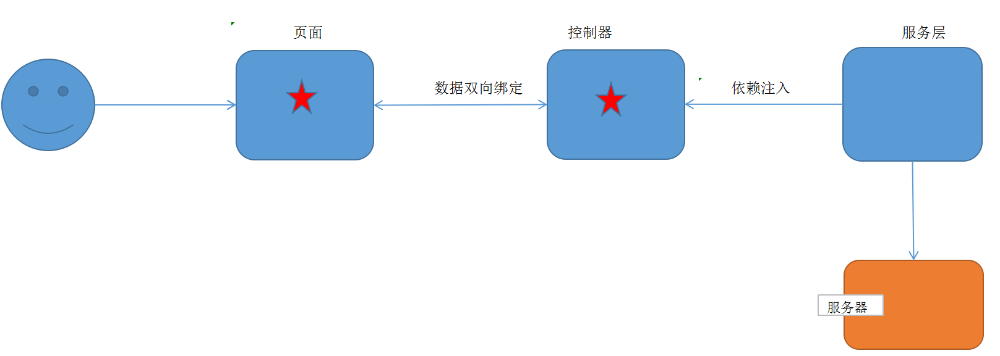
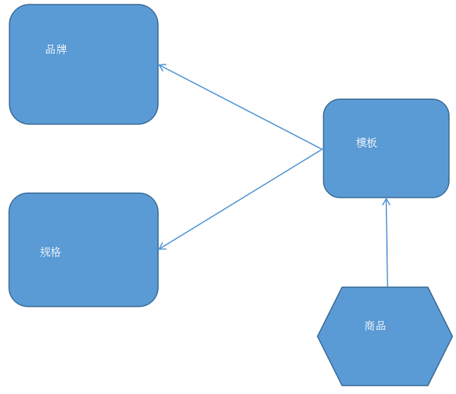

# 1. JavaScript的分层设计

分层的目的是解耦合,为了方便代码的维护和功能的扩展



## 1.1 服务层

服务层负责提供某一个方面的服务.

本项目中服务层主要负责和后台进行数据交互

```javascript
app.service('brandService',function($http){
	    	
	//读取列表数据绑定到表单中
	this.findAll=function(){
		return $http.get('../brand/findAll.do');		
	}
    
    ...
});
```

## 1.2 控制层

控制层负责控制页面数据显示

```javascript
app.controller('brandController' ,function($scope,brandService){	//注入服务层
	
	$scope.findAll=function(){
        //调用服务层,请求服务器获得数据
		brandService.findAll().success(
			function(response){
				$scope.list=response;
			}			
		);
	}
    ...
});	
```

## 1.3 baseController

公共控制层:负责各个controller层的公共业务逻辑,例如分页逻辑等

```javascript
app.controller('baseController' ,function($scope){	
	    
	//分页控件配置 
	$scope.paginationConf = {
         currentPage: 1,
         totalItems: 10,
         itemsPerPage: 10,
         perPageOptions: [10, 20, 30, 40, 50],
         onChange: function(){
        	 $scope.reloadList();//重新加载
     	 }
	}; 
    
    //刷新数据
    $scope.reloadList=function(){
    	$scope.search( $scope.paginationConf.currentPage, $scope.paginationConf.itemsPerPage);	   	
    }
	...	
});	
```

## 1.4 Controller继承

```javascript
app.controller('brandController' ,function($scope,$controller,brandService){	//注入服务
    
    $controller('baseController',{$scope:$scope});//继承
	
});	
```

## 1.5 页面加载JS文件顺序

分层后,引入JS文件有严格的顺序.

```html
<script type="text/javascript" src="../js/base_pagination.js"></script>
<script type="text/javascript" src="../js/service/brandService.js"></script>
<script type="text/javascript" src="../js/controller/baseController.js"></script>
<script type="text/javascript" src="../js/controller/brandController.js"></script>
```

# 2. 代码生成器的使用

## 2.1 原理

1. 完成一个模块的CURD开发
2. 将文件(包含.java文件/.html页面等)将模块名用关键字符替代,即得到模板文件
3. 连接数据库获得模块的数据库表名
4. 使用表名替换模版文件中的关键字符

## 2.2 注意事项

1. 代码生成器不能放在中文目录下执行
2. 指定生成的代码所在的包名(3级)

# 3. 规格管理

## 3.1 表结构

**规格表**

| Field     | Type                |Comment|
| --------- | ------------------- |-------|
| id        | bigint(20) NOT NULL |ID|
| spec_name | varchar(255) NULL   |规格名称|

**规格选项表**

| Field       | Type                |Comment|
| ----------- | ------------------- |-------|
| id          | bigint(20) NOT NULL |ID|
| option_name | varchar(200) NULL   |规格选项名称|
| spec_id     | bigint(30) NULL     |所属规格|
| orders      | int(11) NULL        |排序|

## 3.2 规格列表

```html
<script type="text/javascript" src="../plugins/angularjs/angular.min.js"></script>

<!-- 分页组件 -->
<script src="../plugins/angularjs/pagination.js"></script>
<link rel="stylesheet" href="../plugins/angularjs/pagination.css">

<script type="text/javascript" src="../js/base_pagination.js"></script>
<script type="text/javascript" src="../js/service/specificationService.js"></script>
<script type="text/javascript" src="../js/controller/baseController.js"></script>
<script type="text/javascript" src="../js/controller/specificationController.js"></script>


<body  ng-app="pinyougou" ng-controller="specificationController">
    <table>
        <!--标题-->
        <tr>
        	...
        </tr>
        <!--内容-->
        <tr ng-repeat="entity in list">
        	...
        </tr>
    </table>
    <!--分页工具栏-->
    <tm-pagination conf="paginationConf"></tm-pagination>
</body>
```

## 3.2 新增规格

### 3.2.1 新增规格选项

* HTML

```html
<!--弹框时,初始化规格选项数组-->
<button type="button"  
    	title="新建" 
     data-toggle="modal" data-target="#editModal" ng-click="entity={specificationOptionList:[]}">		新建
</button>

<div id="editModal">			
		<table>
		  	 <tr>
		  	 	<td>规格名称</td>
		  	 	<td><input ng-model="entity.specification.specName"></td>
		  	 </tr>
		 </table>				
		 
		 <!-- 规格选项 -->
		 <div class="btn-group">
          	  <button type="button"  title="新建" ng-click="addTableRow()"> 新增规格选项</button>
         </div>
			 
		 <table>
		     <thead>
		    	<th class="sorting">规格选项</th>
		    	<th class="sorting">排序</th>											
		      	<th class="sorting">操作</th>	
		     </thead>
		     <tbody>
		      	<tr ng-repeat="pojo in entity.specificationOptionList">
		  	  		<td>
		  				<input   placeholder="规格选项" ng-model="pojo.optionName"> 
		  			</td>
		  			<td>
		  				<input   placeholder="排序" ng-model="pojo.orders"> 
		  			</td>
					<td>
						<button title="删除" ng-click="deleTableRow($index)" >删除</button>
					</td>
		     	</tr>
             </tbody>
	    </table> 
    
						
		<button ng-click="save()">保存</button>
		<button data-dismiss="modal">关闭</button>
		
</div>
```

* Javascript

```javascript
$scope.addTableRow=function(){
	$scope.entity.specificationOptionList.push({});			
}
```

### 3.2.2 删除规格选项

* HTML

```html
<tr ng-repeat="pojo in entity.specificationOptionList">
	...	
    
    <button type="button" title="删除" ng-click="deleTableRow($index)" >删除</button>
</tr>
```

* Javascript

```javascript
$scope.deleTableRow=function(index){
	$scope.entity.specificationOptionList.splice(index,1);
}
```

### 3.2.3 保存规格数据

同时需要给2张表(规格和规格选项表中保存数据)

* 页面提交的数据格式

```javascript
{
    "specification":{},
    "specificationOptionList":[{},{}...]
}
```

* 组合实体类

```java
public class Specification implements Serializable{
	private TbSpecification specification;	
	private List<TbSpecificationOption> specificationOptionList;
}
```

* HTML:绑定数据

```html
<input placeholder="规格名称" ng-model="entity.specification.specName">

<tr ng-repeat="pojo in entity.specificationOptionList">
	<td>
		<input   placeholder="规格选项" ng-model="pojo.optionName"> 
	</td>
	<td>
		<input   placeholder="排序" ng-model="pojo.orders"> 
	</td>
</tr>

<button ng-click="save()">保存</button>

```

* Javascript

```javascript
//Controller
$scope.save=function(){				
	var serviceObject;//服务层对象  				
	if($scope.entity.specification.id!=null){//如果有ID
		serviceObject=specificationService.update( $scope.entity ); //修改  
	}else{
		serviceObject=specificationService.add( $scope.entity  );//增加 
	}				
	serviceObject.success(
		function(response){
			if(response.success){
	        	$scope.reloadList();//重新加载
			}else{
				alert(response.message);
			}
		}		
	);				
}

//Service
//增加 
this.add=function(entity){
	return  $http.post('../specification/add.do',entity );
}
//修改 
this.update=function(entity){
	return  $http.post('../specification/update.do',entity );
}
```

* Web层

```java
@RequestMapping("/add")
public Result add(@RequestBody Specification specification){
	try {
		specificationService.add(specification);
		return new Result(true, "增加成功");
	} catch (Exception e) {
		e.printStackTrace();
		return new Result(false, "增加失败");
	}
}
```

* 服务层

```java
public void add(Specification specification) {
	//获取规格实体,保存规格
	TbSpecification tbspecification = specification.getSpecification();				
	specificationMapper.insert(tbspecification);	
	
	//获取规格选项集合,保存规格选项
	List<TbSpecificationOption> specificationOptionList = 	specification.getSpecificationOptionList();
	
    for( TbSpecificationOption option:specificationOptionList){
		option.setSpecId(tbspecification.getId());//设置规格ID
		specificationOptionMapper.insert(option);//新增规格
	}
}
```

## 3.3 修改规格

### 3.3.1 数据回显 

* HTML 

```html
<button type="button" data-target="#editModal" ng-click="findOne(entity.id)">修改</button> 
```

* Javascript

```javascript
$scope.findOne=function(id){				
	specificationService.findOne(id).success(
		function(response){
			$scope.entity= response;					
		}
	);				
}
```

* Web层

```java
@RequestMapping("/findOne")
public Specification findOne(Long id){
	return specificationService.findOne(id);		
}
```

* 服务层

```java
public Specification findOne(Long id){
	
    //创建组合实体类
	Specification specification=new Specification();
	
    //封装规格数据
	TbSpecification tbSpecification = specificationMapper.selectByPrimaryKey(id);
	specification.setSpecification(tbSpecification);
	
    //封装规格选项数据
	TbSpecificationOptionExample example=new TbSpecificationOptionExample();
	com.pinyougou.pojo.TbSpecificationOptionExample.Criteria criteria = example.createCriteria();
	criteria.andSpecIdEqualTo(id);
	List<TbSpecificationOption> specificationOptionList = specificationOptionMapper.selectByExample(example);
	specification.setSpecificationOptionList(specificationOptionList);
    
	return specification;
}
```

#### 3.3.2 修改数据 

* Web层

```java
@RequestMapping("/update")
public Result update(@RequestBody Specification specification){
	try {
		specificationService.update(specification);
		return new Result(true, "修改成功");
	} catch (Exception e) {
		e.printStackTrace();
		return new Result(false, "修改失败");
	}
}	
```

* 服务层

```java
@Override
public void update(Specification specification){
	
	//获取规格实体
	TbSpecification tbspecification = specification.getSpecification();				
	specificationMapper.updateByPrimaryKey(tbspecification);	
	
	//删除原来规格对应的规格选项	
	TbSpecificationOptionExample example=new TbSpecificationOptionExample();
	com.pinyougou.pojo.TbSpecificationOptionExample.Criteria criteria = example.createCriteria();
	criteria.andSpecIdEqualTo(tbspecification.getId());
	specificationOptionMapper.deleteByExample(example);
	
	//获取规格选项集合
	List<TbSpecificationOption> specificationOptionList = specification.getSpecificationOptionList();
    //新增规格选项
	for( TbSpecificationOption option:specificationOptionList){
		option.setSpecId(tbspecification.getId());//设置规格ID
		specificationOptionMapper.insert(option);//新增规格
	}
}
```

### 3.4 删除规格

* 前台

  略

* Web层

  略

* 服务层

```java
public void delete(Long[] ids) {
	for(Long id:ids){
		//删除规格表数据
		specificationMapper.deleteByPrimaryKey(id);
		//删除规格选项表数据		
		TbSpecificationOptionExample example=new TbSpecificationOptionExample();
		com.pinyougou.pojo.TbSpecificationOptionExample.Criteria criteria = example.createCriteria();
		criteria.andSpecIdEqualTo(id);
		specificationOptionMapper.deleteByExample(example);
	}
}
```

# 4. 模板管理

模板用于关联规格和品牌



| Field                  | Type                | Comment    |
| ---------------------- | ------------------- | ---------- |
| id                     | bigint(11) NOT NULL | ID         |
| name                   | varchar(80) NULL    | 模板名称   |
| spec_ids               | varchar(1000) NULL  | 关联规格   |
| brand_ids              | varchar(1000) NULL  | 关联品牌   |
| custom_attribute_items | varchar(2000) NULL  | 自定义属性 |

### 4.1 模板列表

导入模块相关文件,代码略

### 4.2 新增模板

#### 4.2.1 select2使用

select2是一种增强的下拉列表,支持下拉项的多选.

1. 导入相关文件

   ```html
   <!--样式-->
   <link rel="stylesheet" href="../plugins/select2/select2.css" />
   <link rel="stylesheet" href="../plugins/select2/select2-bootstrap.css" />
   
   <!--JS文件-->
   <script src="../plugins/select2/select2.min.js" type="text/javascript"></script>
   <script type="text/javascript" src="../plugins/angularjs/angular.min.js"></script>
   <script type="text/javascript" src="../js/base_pagination.js"></script>
   <script type="text/javascript" src="../js/angular-select2.js"> </script>
   ```

2. 定义数据源

   ```javascript
   $scope.brandList={data:[{id:1,text:'联想'},{id:2,text:'华为'},{id:3,text:'小米'}]};
   ```

3. 实现多选下拉框

   ```html
   <input select2 	
          select2-model="entity.brandIds"	<!--绑定变量-->
          config="brandList"				<!--数据源-->
          multiple							<!--多选-->
          placeholder="选择品牌（可多选）"	  <!--提示信息-->
          class="form-control"				<!--样式-->
          type="text"/>
   ```

#### 4.2.2 显示品牌下拉列表

配置参考```select2的使用```

显示数据库数据

1. Mapper配置文件,添加查询语句

   ```sql
   <select id="selectOptionList" resultType="java.util.Map">
   	select id,name as text from tb_brand
   </select>
   ```

2. Dao接口新增方法

   ```java
   List<Map> selectOptionList();
   ```

3. Serivice新增方法,调用Dao查询数据

   ```java
   public List<Map> selectOptionList() {
   	// TODO Auto-generated method stub
   	return brandMapper.selectOptionList();
   }
   ```

4. BrandController,调用Service

   ```java
   @RequestMapping("/selectOptionList")
   public List<Map> selectOptionList() {
   	return brandService.selectOptionList();
   }
   ```

5. brandService.js

   ```javascript
   this.selectOptionList=function(){
   	return $http.get('../brand/selectOptionList.do');
   }
   ```

6. 在typeTemplateController.js中注入js,请求后台获得数据

   ```javascript
   app.controller('typeTemplateController',function(...,brandService){
   	$scope.brandList={data:[]};
       
      	//读取品牌列表
   	$scope.findBrandList=function(){
   		brandService.selectOptionList().success(
   			function(response){
   				$scope.brandList={data:response};
   			}
   		);		
   	}
   }     
   ```

7. 页面调用读取列表方法

   ```html
   <script type="text/javascript" src="../js/service/brandService.js"></script>
   <script type="text/javascript" src="../js/controller/baseController.js"></script>
   <script type="text/javascript" src="../js/controller/typeTemplateController.js"></script>
   
   <body ng-app="pinyougou" ng-controller="typeTemplateController" ng-init="findBrandList()">
   	<input 
              select2 
              select2-model="entity.brandIds"  
              config="brandList" 
              multiple 
              placeholder=" 选择品牌（可多选）" 
              class="form-control">
   </body>
   ```

#### 4.2.3 显示模板下拉列表

同品牌下拉列表

#### 4.2.4 保存模板数据

* 页面提交的数据格式

  ```javascript
  {
      "name":"",
      "brandIds":[{},{}...],
      "specIds":[{},{}...],
      "customAttributeItems":[{},{}...]
  }
  ```

* 实体类

  ```java
  public class TbTypeTemplate implements Serializable{
      private Long id;
      private String name;
      private String specIds;
      private String brandIds;
      private String customAttributeItems;
  }
  ```

* 绑定数据

  ```html
  <input  class="form-control" placeholder="商品类型" ng-model="entity.name">
  
  <input 
         select2 
         select2-model="entity.brandIds"  
         config="brandList" multiple placeholder="选择品牌（可多选） " class="form-control">
  
  <input select2 
         select2-model="entity.specIds"  
         config="specList" multiple placeholder=" 选择规格（可多选） " class="form-control">
  
  <tr ng-repeat="pojo in entity.customAttributeItems">
  	<td><input type="checkbox"></td>
  	<td><input placeholder="属性名称" ng-model="pojo.text"></td>
  	<td><button type="button"  title="删除" ng-click="deleTableRow($index)">删除</button></td>
  </tr>
  
  <button ng-click="save()">保存</button>
  ```

* Javascript

  ```javascript
  $scope.save=function(){				
  	var serviceObject;//服务层对象  				
  	if($scope.entity.id!=null){//如果有ID
  		serviceObject=typeTemplateService.update( $scope.entity ); //修改  
  	}else{
  		serviceObject=typeTemplateService.add( $scope.entity  );//增加 
  	}				
  	serviceObject.success(
  		function(response){
  			if(response.success){
  				//重新查询 
  	        	$scope.reloadList();//重新加载
  			}else{
  				alert(response.message);
  			}
  		}		
  	);				
  }
  ```

### 4.3 修改模板

* 页面

  ```html
  <button ng-click="findOne(entity.id)">修改</button>
  ```

* Javascript

  ```javascript
  $scope.findOne=function(id){				
  	typeTemplateService.findOne(id).success(
  		function(response){
  		   $scope.entity= response;		
  		   //转换字符串为json对象（集合）
  		   $scope.entity.brandIds=  JSON.parse( $scope.entity.brandIds);
  		   $scope.entity.specIds= JSON.parse($scope.entity.specIds);
  		   $scope.entity.customAttributeItems = JSON.parse($scope.entity.customAttributeItems);	
  		}
  	);				
  }
  ```

### 4.4 删除模板

同以上模块,代码略

### 4.5 优化列表显示

* 定义优化方法

  ```javascript
  $scope.jsonToString=function(jsonString,key){
  	var json= JSON.parse(jsonString);
  	var value="";
  	for(var i=0;i<json.length;i++){
  		if(i>0){
  			value+=",";
  		}			
  		value +=json[i][key];			
  	}
  	return value;
  }
  ```

* 页面调用方法

  ```html
  <tr ng-repeat="entity in list">
      <td><input  type="checkbox" ng-click="updateSelection($event, entity.id)" ></td>          
  	<td>{{entity.id}}</td>
  	<td>{{entity.name}}</td>
  	<td>{{jsonToString(entity.brandIds,'text')}}</td>
  	<td>{{jsonToString(entity.specIds,'text')}}</td>
  	<td>{{jsonToString(entity.customAttributeItems,'text')}}</td>
  	                                     
  	<button ng-click="findOne(entity.id)">修改</button>                                           
  </tr>
  ```


