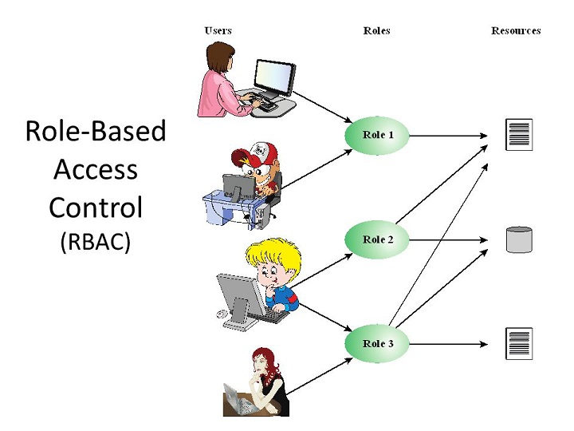

# 1. SpringSecurity权限框架

## 1.1 概念

SpringSecurity控制系统的访问权限

**Who|What|How**

控制Who对What可以进行How的操作

**RBAC**

Role Base Access Controller

权限授予给角色,角色授予给用户



## 1.2 入门Demo

* POM依赖

  ```xml
  <properties>
      <spring.version>4.2.4.RELEASE</spring.version>
  </properties>
  <dependencies>
      <dependency>
          <groupId>org.springframework</groupId>
          <artifactId>spring-core</artifactId>
          <version>${spring.version}</version>
      </dependency>
      <dependency>
          <groupId>org.springframework</groupId>
          <artifactId>spring-web</artifactId>
          <version>${spring.version}</version>
      </dependency>
      <dependency>
          <groupId>org.springframework</groupId>
          <artifactId>spring-webmvc</artifactId>
          <version>${spring.version}</version>
      </dependency>
      <dependency>
          <groupId>org.springframework</groupId>
          <artifactId>spring-context-support</artifactId>
          <version>${spring.version}</version>
      </dependency>
      <dependency>
          <groupId>org.springframework</groupId>
          <artifactId>spring-test</artifactId>
          <version>${spring.version}</version>
      </dependency>
      <dependency>
          <groupId>org.springframework</groupId>
          <artifactId>spring-jdbc</artifactId>
          <version>${spring.version}</version>
      </dependency>
      <dependency>
          <groupId>org.springframework.security</groupId>
          <artifactId>spring-security-web</artifactId>
          <version>4.2.7.RELEASE</version>
      </dependency>
      <dependency>
          <groupId>org.springframework.security</groupId>
          <artifactId>spring-security-config</artifactId>
          <version>4.2.7.RELEASE</version>
      </dependency>
      <dependency>
          <groupId>javax.servlet</groupId>
          <artifactId>servlet-api</artifactId>
          <version>2.5</version>
          <scope>provided</scope>
      </dependency>
  </dependencies>
  ```

* web.xml

  ```xml
  <!--初始化Spring容器-->
  <context-param>
      <param-name>contextConfigLocation</param-name>
      <param-value>classpath:spring-security.xml</param-value>
  </context-param>
  <listener>
      <listener-class>org.springframework.web.context.ContextLoaderListener</listener-class>
  </listener>
  
  <!--加载Spring-security权限过滤器-->
  <filter>
      <filter-name>springSecurityFilterChain</filter-name>
      <filter-class>org.springframework.web.filter.DelegatingFilterProxy</filter-class>
  </filter>
  <filter-mapping>
      <filter-name>springSecurityFilterChain</filter-name>
      <url-pattern>/*</url-pattern>
  </filter-mapping>
  ```

  

* spring-security.xml

  ```xml
  <!--设置不拦截的页面-->
  <http pattern="/login.html" security="none"/>
  <http pattern="/login_failur.html" security="none"/>
  
  <!--1.配置XXX资源访问的时候应该具备的角色才能访问-->
  <http use-expressions="false">
      <!--访问/**根目录下的任意资源(包括子目录),需要有ROLE_USER权限-->
      <intercept-url pattern="/**" access="ROLE_USER"/>
      <form-login 
                  login-page="/login.html" 
                  default-target-url="/index.html" 
                  authentication-failure-url="/login_failur.html"/>
     		
      	<!--CSRF（Cross-site request forgery）跨站请求伪造-->
          <csrf disabled="true"/>
  </http>
  
  <!-- 认证管理器 -->
  <!--2.配置了系统的用户拥有的角色-->
  <authentication-manager>
      <authentication-provider>
          <user-service>
              <!--配置User,指定用户名和密码及角色-->
              <user name="admin" password="123456" authorities="ROLE_USER"/>
              <user name="zs" password="123456" authorities="ROLE_PRODUCT"/>
          </user-service>
      </authentication-provider>
  </authentication-manager>
  ```
## 1.3 跨站请求伪造

作用:为了阻止其他站点的请求

原理:

1. 在服务器端生成身份验证的标识码,并存放在Session中
2. 在JSP动态页面通过EL表达式获得标识码
3. 其他站点的页面访问时,没有携带身份验证的标识码,就被视作是非法请求

  

* 自定义登录页

  ```html
  <form action='/login' method='POST'>
      <table>
          <tr>
              <td>用户名:</td>
              <td><input type='text' name='username' value=''></td>
          </tr>
          <tr>
              <td>密码:</td>
              <td><input type='password' name='password'/></td>
          </tr>
          <tr>
              <td colspan='2'><input name="submit" type="submit" value=" 登陆 "/></td>
          </tr>
      </table>
  </form>
  ```

  ```xml
  <form-login login-page="/login.html" 
              default-target-url="/index.html" 
              authentication-failure-url="/login_failur.html"/>
  ```

# 2. 运营商系统集成SpringSecurity

### 2.1 集成SpringSecurity

* pom依赖

  参考Spring-Security入门Demo,添加依赖

* web.xml

  参考Spring-Security入门Demo,添加权限过滤器

* spring-security.xml

  ```xml
  <!-- 设置页面不登陆也可以访问 -->
  <http pattern="/*.html" security="none"></http>
  <http pattern="/css/**" security="none"></http>
  <http pattern="/img/**" security="none"></http>
  <http pattern="/js/**" security="none"></http>
  <http pattern="/plugins/**" security="none"></http>
  
  <!-- 页面的拦截规则 -->
  <http use-expressions="false">
  	
      <!-- 当前用户必须有ROLE_USER的角色 才可以访问根目录及所属子目录的资源 -->
  	<intercept-url pattern="/**" access="ROLE_ADMIN"/>
  	
      <!-- 开启表单登陆功能 -->
  	<form-login  
                  login-page="/login.html" 
                  default-target-url="/admin/index.html" 
                  authentication-failure-url="/login.html" 
                  always-use-default-target="true"/>
  	<!--关闭扩展请求伪造防御-->
      <csrf disabled="true"/>
      <!--允许框架页的访问-->
      <headers>
  		<frame-options policy="SAMEORIGIN"/>
  	</headers>
      <!--开启退出功能-->
      <logout/>
  </http>
  
  <!-- 认证管理器 -->
  <authentication-manager>
  	<authentication-provider>
  		<user-service>
  			<user name="admin" password="123456" authorities="ROLE_ADMIN"/>
  			<user name="sunwukong" password="dasheng" authorities="ROLE_ADMIN"/>
  		</user-service>
  	</authentication-provider>	
  </authentication-manager>
  ```

* 登录页

  ```html
  <form  action="/login" method="post" id="loginform">
  	<input  name="username" type="text" placeholder="邮箱/用户名/手机号">
  	<input id="prependedInput" name="password" type="password" placeholder="请输入密码">
  	<a onclick="document:loginform.submit()">登录</a>
  </form>
  ```

### 2.2 显示登录名

​	登录成功,跳转到成功页面后,通过ajax方式加载登录用户名

* 页面

  ```html
  <body ng-app="pinyougou" ng-controller="indexController" ng-init="showLoginName()">
  	{{loginName}}
  </body>
  ```

* indexController.js

  ```javascript
  $scope.showLoginName=function(){
  	loginService.loginName().success(
  		function(response){
  			$scope.loginName=response.loginName;				
  		}
  	);		
  }
  ```

* loginService.js

  ```javascript
  app.service('loginService',function($http){
  	this.loginName=function(){
  		return $http.get('../login/name.do');
  	}
  });
  ```

* LoginController

  ```java
  @RequestMapping("/name")
  public Map name(){
  	String name = SecurityContextHolder.getContext().getAuthentication().getName();
  	Map map=new HashMap<>();
  	map.put("loginName", name);
  	return map;		
  }
  ```

### 2.3 退出

* spring-security.xml

  ```xml
  <logout 
          logout-url="" 				<!--退出URL,可选配置,默认/logout-->
          logout-success-url=""/>		<!--退出成功跳转的地址,可选配置-->
  ```

* 页面

  ```html
  <a href="../logout">注销</a>
  ```

# 3. 商家入驻

在pinyougou-shop-web系统中完成商家保存功能

| Field                | Type                  | Comment          |
| -------------------- | --------------------- | ---------------- |
| seller_id            | varchar(100) NOT NULL | 用户ID           |
| name                 | varchar(80) NULL      | 公司名           |
| nick_name            | varchar(50) NULL      | 店铺名称         |
| password             | varchar(60) NULL      | 密码             |
| email                | varchar(40) NULL      | EMAIL            |
| mobile               | varchar(11) NULL      | 公司手机         |
| telephone            | varchar(50) NULL      | 公司电话         |
| status               | varchar(1) NULL       | 状态             |
| address_detail       | varchar(100) NULL     | 详细地址         |
| linkman_name         | varchar(50) NULL      | 联系人姓名       |
| linkman_qq           | varchar(13) NULL      | 联系人QQ         |
| linkman_mobile       | varchar(11) NULL      | 联系人电话       |
| linkman_email        | varchar(40) NULL      | 联系人EMAIL      |
| license_number       | varchar(20) NULL      | 营业执照号       |
| tax_number           | varchar(20) NULL      | 税务登记证号     |
| org_number           | varchar(20) NULL      | 组织机构代码     |
| address              | bigint(20) NULL       | 公司地址         |
| logo_pic             | varchar(100) NULL     | 公司LOGO图       |
| brief                | varchar(2000) NULL    | 简介             |
| create_time          | datetime NULL         | 创建日期         |
| legal_person         | varchar(40) NULL      | 法定代表人       |
| legal_person_card_id | varchar(25) NULL      | 法定代表人身份证 |
| bank_user            | varchar(50) NULL      | 开户行账号名称   |
| bank_name            | varchar(100) NULL     | 开户行           |

* pom文件中添加服务提供者

  ```xml
  <dependency>
  	<groupId>com.pinyougou</groupId>
  	<artifactId>pinyougou-sellergoods-interface</artifactId>
  	<version>0.0.5-SNAPSHOT</version>
  </dependency>
  ```

* register.html

  ```html
  <script type="text/javascript" src="plugins/angularjs/angular.min.js"></script>
  
  <script type="text/javascript" src="js/base.js"></script>
  <script type="text/javascript" src="js/service/sellerService.js"></script>
  <script type="text/javascript" src="js/controller/baseController.js"></script>
  <script type="text/javascript" src="js/controller/sellerController.js"></script>
  
  <body ng-app="pinyougou" ng-controller="sellerController">
      <input type="text" placeholder="登陆名" ng-model="entity.sellerId">
      <input type="password" placeholder="登陆密码" ng-model="entity.password">
  	<input type="text" placeholder="店铺名称" ng-model="entity.nickName">
  	<input type="text" placeholder="公司名称" ng-model="entity.name">
  	...
      <a ng-click="add()" target="_blank">申请入驻</a>
  </body>
  ```

* sellerController.js

  ```javascript
  $scope.add=function(){
  	sellerService.add( $scope.entity  ).success(
  		function(response){
  			if(response.success){
  				//如果注册成功，跳转到登录页
  	        	location.href="shoplogin.html";
  			}else{
  				alert(response.message);
  			}
  		}		
  	);				
  }
  ```

* SellController.java

  ```java
  @RequestMapping("/add")
  public Result add(@RequestBody TbSeller seller){	
  	try {
  		sellerService.add(seller);
  		return new Result(true, "增加成功");
  	} catch (Exception e) {
  		e.printStackTrace();
  		return new Result(false, "增加失败");
  	}
  }
  ```

* SellServiceImpl.java

  ```java
  @Override
  public void add(TbSeller seller) {		
  	seller.setStatus("0");//状态
  	seller.setCreateTime(new Date());//申请日期
  	sellerMapper.insert(seller);		
  }
  ```

# 4. 商家审核

其实就是在pinyougou-manager-web中修改商家的状态

### 4.1 显示待审核列表

* seller_1.html

  ```html
  <body ng-app="pinyougou" ng-controller="sellerController" ng-init="searchEntity={status:'0'}">
      ...
  </body>
  ```

* baseController.js

  ```javascript
  $scope.paginationConf = {
       currentPage: 1,
       totalItems: 10,
       itemsPerPage: 10,
       perPageOptions: [10, 20, 30, 40, 50],
       onChange: function(){
      	 $scope.reloadList();//重新加载
   	 }
  };
  
  $scope.reloadList=function(){
  	//切换页码  
  	$scope.search( $scope.paginationConf.currentPage, $scope.paginationConf.itemsPerPage);	   	
  }
  ```

* sellerController.js

  ```javascript
  $scope.searchEntity={};//定义搜索对象 
  
  //搜索
  $scope.search=function(page,rows){			
  	sellerService.search(page,rows,$scope.searchEntity).success(
  		function(response){
  			$scope.list=response.rows;	
  			$scope.paginationConf.totalItems=response.total;//更新总记录数
  		}			
  	);
  }
  ```

### 4.2 查看商家详情

* seller_1.html

  ```html
  <tr ng-repeat="entity  in  list">
      ...
      <button type="button" ng-click="findOne(entity.sellerId)" data-target="#sellerModal">
          详情	         
      </button>                       
  </tr>
  -------------------------------------------------------------------
   <ul class="nav nav-tabs">
     <li class="active"><a href="#home" data-toggle="tab">基本信息</a></li>
     <li><a href="#linkman" data-toggle="tab">联系人</a></li>
     <li><a href="#certificate" data-toggle="tab">证件</a></li>
     <li><a href="#ceo" data-toggle="tab">法定代表人</a></li>
     <li><a href="#bank" data-toggle="tab">开户行</a></li>
   </ul>
  --------------------------------------------------------------------
  <div id="myTabContent" class="tab-content">
  	...
  </div>
  <div id="certificate" class="tab-content">
  	...
  </div>
  <div id="ceo" class="tab-content">
  	...
  </div>
  <div id="bank" class="tab-content">
  	...
  </div>
  --------------------------------------------------------------------
  <div class="modal-footer">						
  	<button  ng-click="updateStatus(entity.sellerId,'1')">审核通过</button>
      <button  ng-click="updateStatus(entity.sellerId,'2')">审核未通过</button>
      <button  ng-click="updateStatus(entity.sellerId,'3')">关闭商家</button>
  </div>
  ```

### 4.3 审核商家

* sellerController.js

  ```javascript
  $scope.updateStatus=function(sellerId,status){
  	sellerService.updateStatus(sellerId,status).success(
  		function(response){
  			if(response.success){
  				$scope.reloadList();//重新加载
  			}else{
  				alert(response.message);
  			}				
  		}
  	);		
  }
  ```

* SellerController.java

  ```java
  @RequestMapping("/updateStatus")
  public Result updateStatus(String sellerId,String status){
  	try {
  		sellerService.updateStatus(sellerId, status);
  		return new Result(true, "成功");
  	} catch (Exception e) {
  		e.printStackTrace();
  		return new Result(false, "失败");
  	}
  }
  ```

* SellerServiceImpl.java

  ```java
  public void updateStatus(String sellerId, String status) {
  	TbSeller seller = sellerMapper.selectByPrimaryKey(sellerId);
  	seller.setStatus(status);
  	sellerMapper.updateByPrimaryKey(seller);
  }
  ```

# 5. 商家系统集成SpringSecurity

### 5.1 集成SpringSecurity

- pom依赖

  参考Spring-Security入门Demo,添加依赖

- web.xml

  参考Spring-Security入门Demo,添加权限过滤器

- spring-security.xml

    ```xml
    <!-- 设置页面不登陆也可以访问 -->
    <http pattern="/*.html" security="none"></http>
    <http pattern="/css/**" security="none"></http>
    <http pattern="/img/**" security="none"></http>
    <http pattern="/js/**" security="none"></http>
    <http pattern="/plugins/**" security="none"></http>
    <http pattern="/seller/add.do" security="none"></http>

    <!-- 页面的拦截规则 -->
    <http use-expressions="false">
        <!-- 当前用户必须有ROLE_USER的角色 才可以访问根目录及所属子目录的资源 -->
        <intercept-url pattern="/**" access="ROLE_SELLER"/>
        <!-- 开启表单登陆功能 -->
        <form-login  
                    login-page="/shoplogin.html" 
                    default-target-url="/admin/index.html" 
                    authentication-failure-url="/shoplogin.html" 
                    always-use-default-target="true"/>

        <!--关闭扩展请求伪造防御-->
        <csrf disabled="true"/>

        <!--允许框架页的访问-->
        <headers>
            <frame-options policy="SAMEORIGIN"/>
        </headers>
         <!--开启退出功能-->
        <logout/>
    </http>

    <!-- 认证管理器 -->
    <authentication-manager>
        <authentication-provider user-service-ref="userDetailService">	
            <password-encoder ref="bcryptEncoder"></password-encoder>
        </authentication-provider>	
    </authentication-manager>

    <!-- 认证类 -->
    <beans:bean id="userDetailService" class="com.pinyougou.service.UserDetailsServiceImpl">
        <beans:property name="sellerService" ref="sellerService"></beans:property>
    </beans:bean>

    <!-- 引用dubbo 服务 -->
    <dubbo:application name="pinyougou-shop-web" />
    <dubbo:registry address="zookeeper://192.168.25.135:2181"/>	

    <!--自定义认证类-->
    <dubbo:reference 
           id="sellerService"
           interface="com.pinyougou.sellergoods.service.SellerService"/>
    <!--密码加密-->	
    <beans:bean 
           id="bcryptEncoder" 
           class="org.springframework.security.crypto.bcrypt.BCryptPasswordEncoder"/>
    ```

* 认证类

  ```java
  public class UserDetailsServiceImpl implements UserDetailsService {
  
  	private SellerService sellerService;
  	
  	public void setSellerService(SellerService sellerService) {
  		this.sellerService = sellerService;
  	}
  
  	@Override
  	public UserDetails loadUserByUsername(String username) throws UsernameNotFoundException {
  		System.out.println("经过了UserDetailsServiceImpl");
  		//构建角色列表
  		List<GrantedAuthority> grantAuths=new ArrayList();
  		grantAuths.add(new SimpleGrantedAuthority("ROLE_SELLER"));
  		
  		//得到商家对象
  		TbSeller seller = sellerService.findOne(username);
  		if(seller!=null){
  			if(seller.getStatus().equals("1")){
  			/**<user name="admin" password="123456" authorities="ROLE_ADMIN"/>**/
  				return new User(username,seller.getPassword(),grantAuths);
  			}else{
  				return null;
  			}			
  		}else{
  			return null;
  		}
  	}
  
  }
  ```

* 注册密码加密

  ```java
  @RequestMapping("/add")
  public Result add(@RequestBody TbSeller seller){
  	//密码加密
  	BCryptPasswordEncoder passwordEncoder=new BCryptPasswordEncoder();
  	String password = passwordEncoder.encode(seller.getPassword());//加密
  	seller.setPassword(password);
  	
  	try {
  		sellerService.add(seller);
  		return new Result(true, "增加成功");
  	} catch (Exception e) {
  		e.printStackTrace();
  		return new Result(false, "增加失败");
  	}
  }
  ```
