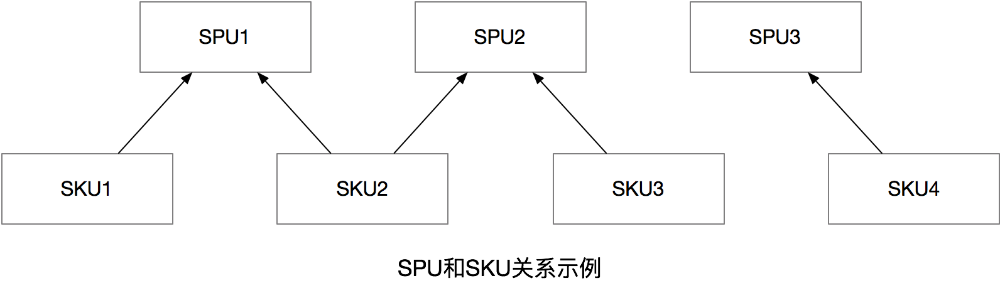
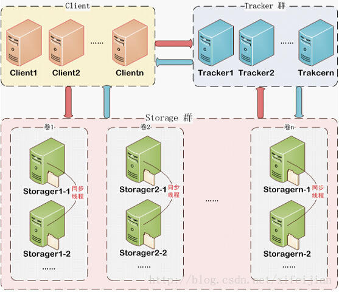
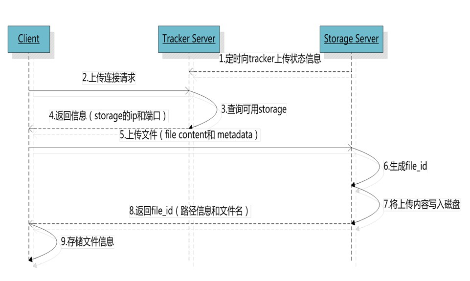

# 1. 商品分类管理

表结构

| Field     | Type                | Comment                          |
| --------- | ------------------- | -------------------------------- |
| id        | bigint(20) NOT NULL | 类目ID                           |
| parent_id | bigint(20) NULL     | 父类目ID=0时，代表的是一级的类目 |
| name      | varchar(50) NULL    | 类目名称                         |
| type_id   | bigint(11) NULL     | 类型id                           |

商品分类与模板及品牌和规格的关系


## 1.1 分类列表

 ```sql
--一级分类
SELECT * FROM tb_item_cat WHERE parent_id=0;
--二级分类
SELECT * FROM tb_item_cat WHERE parent_id=161;
--三级分类
SELECT * FROM tb_item_cat WHERE parent_id=162;
 ```


* item_cat.html

```html
<script type="text/javascript" src="../js/base.js"></script>
<script type="text/javascript" src="../js/service/itemCatService.js"></script>
<script type="text/javascript" src="../js/controller/baseController.js"></script>
<script type="text/javascript" src="../js/controller/itemCatController.js"></script>

<body ng-app="pinyougou" ng-controller="itemCatController" ng-init="findByParentId(0)">
    ...
    <tr ng-repeat="entity in list">
        <td><input  type="checkbox" ></td>			                              
        <td>{{entity.id}}</td>
        <td>{{entity.name}}</td>									    
        <td>
            {{entity.typeId}}    
        </td>									      
        <td class="text-center">
            <button ng-click="findByParentId(entity.id)">查询下级</button>
        </td>
    </tr>
</body>
```

* itemCatController.js

```javascript
$scope.findByParentId=function(parentId){
	itemCatService.findByParentId(parentId).success(
		function(response){
			$scope.list=response;				
		}
	);		
}
```

* itemCatService.js

```javascript
this.findByParentId=function(parentId){
	return $http.get('../itemCat/findByParentId.do?parentId='+parentId);
}
```

* ItemCatController.java

```java
@RequestMapping("/findByParentId")
public List<TbItemCat> findByParentId(Long parentId){
	return itemCatService.findByParentId(parentId);
}
```

* ItemCatServiceImpl.java

```java
public List<TbItemCat> findByParentId(Long parentId) {
	TbItemCatExample example=new TbItemCatExample();
	Criteria criteria = example.createCriteria();
	criteria.andParentIdEqualTo(parentId);
	return itemCatMapper.selectByExample(example);
}
```

## 1.2 面包屑

面包屑的作用记录用户在页面的浏览足迹,页面导航

思路分析:

1. 顶级分类不变的文字不会改变,使用2个变量分别代表二级和三级分类,变量的类型是对象类型;`{id:xxx,name:xxx}`
2. 点击`查询下级`按钮的时候完成2件事情,更新分类列表数据和更新面包屑
   * setGrade(grade+1):此方法的目的是确定更新分类的级别
   * selectList(entity):此方法的目的是更新分类列表数据和更新面包屑

* item_cat.html

```html
<!--面包屑导航-->
<ol class="breadcrumb">	                        	
    <li>
		 <a href="#" ng-click="grade=1;selectList({id:0})">顶级分类列表</a> 
	</li>
	<li>
		 <a href="#" ng-click="grade=2;selectList(entity_1)">{{entity_1.name}}</a>
	</li>
	<li>
		 <a href="#" ng-click="grade=3;selectList(entity_2)" >{{entity_2.name}}</a>
	</li>
</ol>
<!--查询下级按钮-->
<span ng-if="grade!=3">
	<button type="button" ng-click="setGrade(grade+1);selectList(entity)">查询下级</button>
</span>
```

* itemCatController.js

```javascript
//当前级别
$scope.grade=1;
//设置级别
$scope.setGrade=function(value){
	$scope.grade=value;
}

//查询下级:加载数据并更新面包屑
$scope.selectList=function(p_entity){
	//第一级
	if($scope.grade==1){
		$scope.entity_1=null;
		$scope.entity_2=null;
	}
    //第二级
	if($scope.grade==2){
		$scope.entity_1=p_entity;
		$scope.entity_2=null;
	}
    //第三级
	if($scope.grade==3){
		$scope.entity_2=p_entity;
	}
	
	$scope.findByParentId(p_entity.id);
}

//根据上级分类ID查询列表
$scope.findByParentId=function(parentId){
    itemCatService.findByParentId(parentId).success(
        function(response){
            $scope.list=response;
        }
    );
}
```

# 2. 电商概念

## 2.1 SPU

SPU = Standard Product Unit  （标准产品单位）

## 2.2 SKU

SKU=stock keeping unit（库存量单位）



一个SPU下有多个SKU

| 名词                  | 类型                                      |
| --------------------- | ----------------------------------------- |
| 手机                  | 分类                                      |
| Iphone X              | SPU      （土豪金、黑色 \|  移动、联通 ） |
| 联通版+土豪金Iphone X | SKU                                       |
| 移动版+黑色Iphone X   | SKU                                       |
| 联通版+黑色Iphone X   | SKU                                       |
| 移动版+土豪金Iphone X | SKU                                       |

## 2.3 表结构

### SPU

tb_goods:商品基本表

| Field            | Type                | Comment      |
| ---------------- | ------------------- | ------------ |
| id               | bigint(20) NOT NULL | 主键         |
| seller_id        | varchar(20) NULL    | 商家ID       |
| goods_name       | varchar(100) NULL   | SPU名        |
| default_item_id  | bigint(20) NULL     | 默认SKU      |
| audit_status     | varchar(2) NULL     | 状态         |
| is_marketable    | varchar(1) NULL     | 是否上架     |
| brand_id         | bigint(10) NULL     | 品牌         |
| caption          | varchar(100) NULL   | 副标题       |
| category1_id     | bigint(20) NULL     | 一级类目     |
| category2_id     | bigint(10) NULL     | 二级类目     |
| category3_id     | bigint(10) NULL     | 三级类目     |
| small_pic        | varchar(150) NULL   | 小图         |
| price            | decimal(10,2) NULL  | 商城价       |
| type_template_id | bigint(20) NULL     | 分类模板ID   |
| is_enable_spec   | varchar(1) NULL     | 是否启用规格 |
| is_delete        | varchar(1) NULL     | 是否删除     |

tb_goods_desc:商品详情表

| Field                  | Type                | Comment                              |
| ---------------------- | ------------------- | ------------------------------------ |
| goods_id               | bigint(20) NOT NULL | SPU_ID                               |
| introduction           | varchar(3000) NULL  | 描述                                 |
| specification_items    | varchar(3000) NULL  | 规格结果集，所有规格，包含isSelected |
| custom_attribute_items | varchar(3000) NULL  | 自定义属性（参数结果）               |
| item_images            | varchar(3000) NULL  |                                      |
| package_list           | varchar(3000) NULL  | 包装列表                             |
| sale_service           | varchar(3000) NULL  | 售后服务                             |

### SKU

tb_item

| Field          | Type                   | Comment                          |
| -------------- | ---------------------- | -------------------------------- |
| id             | bigint(20) NOT NULL    | 商品id，同时也是商品编号         |
| title          | varchar(100) NOT NULL  | 商品标题                         |
| sell_point     | varchar(500) NULL      | 商品卖点                         |
| price          | decimal(20,2) NOT NULL | 商品价格，单位为：元             |
| stock_count    | int(10) NULL           | 库存数量                         |
| num            | int(10) NOT NULL       | 库存数量                         |
| barcode        | varchar(30) NULL       | 商品条形码                       |
| image          | varchar(2000) NULL     | 商品图片                         |
| categoryId     | bigint(10) NOT NULL    | 所属类目，叶子类目               |
| status         | varchar(1) NOT NULL    | 商品状态，1-正常，2-下架，3-删除 |
| create_time    | datetime NOT NULL      | 创建时间                         |
| update_time    | datetime NOT NULL      | 更新时间                         |
| item_sn        | varchar(30) NULL       | 条形码                           |
| cost_price     | decimal(10,2) NULL     | 成本价                           |
| market_price   | decimal(10,2) NULL     | 市场价                           |
| is_default     | varchar(1) NULL        | 默认SKU                          |
| goods_id       | bigint(20) NULL        | 所属SPU                          |
| seller_id      | varchar(30) NULL       | 商家ID                           |
| cart_thumbnail | varchar(150) NULL      | 缩略图                           |
| category       | varchar(200) NULL      | 分类                             |
| brand          | varchar(100) NULL      | 品牌                             |
| spec           | varchar(200) NULL      | 规格                             |
| seller         | varchar(200) NULL      | 所属商家                         |

## 2.4 组合实体类

由于保存商品的时候,需要同时添加SPU和对应的SKU数据,所以定义组合实体类来接受页面提交的数据

一个商品对应一个SPU,对应多个SKU

```java
public class Goods implements Serializable{
	private TbGoods goods;			//商品SPU基本信息
	private TbGoodsDesc goodsDesc;	//商品SPU扩展信息
	private List<TbItem> itemList;  //SKU列表
}
```

## 2.5 JSON结构

```
{
   goods:{},
   goodsDesc:{}
   itemList:[{},{}]
}
```


# 3. 商品基本信息录入

* goods_edit.html

```html
<script type="text/javascript" src="../js/base.js"></script>
<script type="text/javascript" src="../js/service/goodsService.js"></script>
<script type="text/javascript" src="../js/service/uploadService.js"></script>
<script type="text/javascript" src="../js/controller/baseController.js"></script>
<script type="text/javascript" src="../js/controller/goodsController.js"></script>

<body ng-app="pinyougou" ng-controller="goodsController">
	<input type="text" ng-model="entity.goods.goodsName"   placeholder="商品名称">
	<input type="text" ng-model="entity.goods.caption" placeholder="副标题">
	<input type="text" ng-model="entity.goods.price" placeholder="价格">
    <textarea rows="4" ng-model="entity.goodsDesc.packageList" placeholder="包装列表">
	<textarea rows="4" ng-model="entity.goodsDesc.saleService"    placeholder="售后服务">
	...
	<button  ng-click="add()">保存</button>
</body>
```

* goodsController.js

```html
$scope.add=function(){				
	goodsService.add( $scope.entity  ).success(
		function(response){
			if(response.success){
				alert("新增成功");
				$scope.entity={};
			}else{
				alert(response.message);
			}
		}		
	);				
}
```

* GoodsController.java

```java
@RequestMapping("/add")
public Result add(@RequestBody Goods goods){
	//获取商家ID
	String sellerId = SecurityContextHolder.getContext().getAuthentication().getName();
	goods.getGoods().setSellerId(sellerId);//设置商家ID
	
	try {
		goodsService.add(goods);
		return new Result(true, "增加成功");
	} catch (Exception e) {
		e.printStackTrace();
		return new Result(false, "增加失败");
	}
}
```

* GoodsServiceImpl.java

```java
@Override
public void add(Goods goods) {
	
	goods.getGoods().setAuditStatus("0");//状态：未审核
	goodsMapper.insert(goods.getGoods());//插入商品基本信息
	
	goods.getGoodsDesc().setGoodsId(goods.getGoods().getId());//将商品基本表的ID给商品扩展表
	goodsDescMapper.insert(goods.getGoodsDesc());//插入商品扩展表数据
	
}
```

# 3. 富文本编辑器

编辑页面内容时达到所写即所得的效果。

## 3.1 使用方法

* 页面

```html
<link rel="stylesheet" href="../plugins/kindeditor/themes/default/default.css" />
<script charset="utf-8" src="../plugins/kindeditor/kindeditor-min.js"></script>
<script charset="utf-8" src="../plugins/kindeditor/lang/zh_CN.js"></script>

<body>
    <textarea name="content"></textarea>
</body>
```

* Javascript:初始化富文本编辑器

```javascript
var editor;
KindEditor.ready(function(K) {
	editor = K.create('textarea[name="content"]', {
		allowFileManager : true
	});
});
```

## 3.2 保存商品详情

```javascript
$scope.add=function(){		
    //获得富文本编辑器信息
	$scope.entity.goodsDesc.introduction=editor.html();
	goodsService.add( $scope.entity  ).success(
		function(response){
			if(response.success){
				alert("新增成功");
				$scope.entity={};
				editor.html("");//清空富文本编辑器
			}else{
				alert(response.message);
			}
		}		
	);				
}
```

# 4. 分布式文件服务器FastDFS

使用分布式方式解决海量文件存储的问题

* Tracker server：调度服务器；负责负载均衡和任务调度，管理所有的存储服务器。
* Storage server：存储服务器；负责文件的存储。



文件上传



文件名:


## 4.1 上传文件

* 配置文件

```properties
connect_timeout = 2
network_timeout = 30
charset = ISO8859-1
http.tracker_http_port = 8080
http.anti_steal_token = no
http.secret_key = FastDFS1234567890

tracker_server = 192.168.25.133:22122
```

* 编码

```java
// 1、加载配置文件，配置文件中的内容就是 tracker 服务的地址。
ClientGlobal.init("...\\fdfs_client.conf");
// 2、创建一个 TrackerClient 对象。直接 new 一个。
TrackerClient trackerClient = new TrackerClient();
// 3、使用 TrackerClient 对象创建连接，获得一个 TrackerServer 对象。
TrackerServer trackerServer = trackerClient.getConnection();
// 4、创建一个 StorageServer 的引用，值为 null
StorageServer storageServer = null;
// 5、创建一个 StorageClient 对象，需要两个参数 TrackerServer 对象、StorageServer的引用
StorageClient storageClient = new StorageClient(trackerServer, storageServer);
// 6、使用 StorageClient 对象上传图片。参数1:文件位置;参数2:文件扩展名,扩展名不带“.”;参数3:文件属性
String[] strings = storageClient.upload_file("...\\fast.jpg","jpg",null);
// 7、返回数组。包含组名和图片的路径。
for (String string : strings) {
    System.out.println(string);
}
```

* 结果

```tex
group1
M00/00/00/wKgZhVwlqxGABYyFAAEKGFTDYoc324.jpg

访问:http://ip/group1/M00/00/00/wKgZhVwlqxGABYyFAAEKGFTDYoc324.jpg
```

fastdfs与nginx的关系


# 5. 商品图片录入

## 5.1 图片录入

* goods_edit.html

```html
<table class="table table-bordered table-striped">
	<tr>
		<td>颜色</td>
		<td><input   placeholder="颜色" ng-model="image_entity.color">  </td>
	</tr>			    
	<tr>
		<td>商品图片</td>
		<td>
			<table>
				<tr>
					<td>
					<input type="file" id="file" />				                
		                <button  type="button" ng-click="uploadFile()">
	                   		上传
		                </button>	
		            </td>
					<td>
						
					</td>
				</tr>						
			</table>
		</td>
	</tr>		      	
</table>
```

* goodsController.js

```javascript
$scope.uploadFile=function(){
	uploadService.uploadFile().success(
		function(response){
			if(response.success){
				$scope.image_entity.url= response.message;
			}else{
				alert(response.message);					
			}
		}		
	);
}
```

* uploadService.js

```javascript
this.uploadFile=function(){
	var formdata=new FormData();		  //创建form表单
	formdata.append('file',file.files[0]);//绑定表单参数
	
	return $http({
		url:'../upload.do',						//提交的路径
		method:'post',							//提交方式
		data:formdata,							//表单数据
		headers:{ 'Content-Type':undefined },	//设置Content-Type="multipart/form-data"
		transformRequest: angular.identity		//序列化表单数据	
	});
}
```

* UploadController.java

```java
@RequestMapping("/upload")
public Result upload(MultipartFile file){
	
	String originalFilename = file.getOriginalFilename();//获取文件名
	String extName=originalFilename.substring( originalFilename.lastIndexOf(".")+1);//得到扩展名
	
	try {
		util.FastDFSClient client=new FastDFSClient("classpath:config/fdfs_client.conf");
		String fileId = client.uploadFile(file.getBytes(), extName);
		String url=file_server_url+fileId;//图片完整地址
		return new Result(true, url);
		
	} catch (Exception e) {
		e.printStackTrace();
		return new Result(false, "上传失败");
	}
	
}
```

* Spring配置文件添加文件解析器

```xml
<bean id="multipartResolver"
	class="org.springframework.web.multipart.commons.CommonsMultipartResolver">
	<property name="defaultEncoding" value="UTF-8"></property>
	<!-- 设定文件上传的最大值 5MB，5*1024*1024 -->
	<property name="maxUploadSize" value="5242880"></property>
</bean>
```

## 5.2 图片列表

* goods_edit.html

```html
<!--图片列表-->
<tr ng-repeat="pojo in entity.goodsDesc.itemImages">
  <td>
	  {{pojo.color}}
  </td>
  <td>
	  
  </td>
  <td> 
      <button type="button"  title="删除" ng-click="remove_image_entity($index)">删除</button>
  </td>
</tr>
-------------------------------------------------------------------------------------------
<!--图片上传-->
<table class="table table-bordered table-striped">
    <input   ng-model="image_entity.color" placeholder="颜色" >
    		      	
</table>

<button ng-click="add_image_entity()"><i class="fa fa-save"></i>保存</button>
```

* goodsController.js

```javascript
//在entity中初始化图片数组
$scope.entity={ goodsDesc:{itemImages:[],specificationItems:[]}};
//在entity中绑定图片信息
$scope.add_image_entity=function(){
	$scope.entity.goodsDesc.itemImages.push($scope.image_entity);			
}
```

