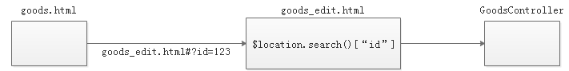

# 1. 商家系统显示商品列表

条件查询:商家只能查询自己的商品

## 1.1 显示商品列表

* 页面

```html
<!-- 分页组件开始 -->
<script src="../plugins/angularjs/pagination.js"></script>
<link rel="stylesheet" href="../plugins/angularjs/pagination.css">
<!-- 分页组件结束 -->

<script type="text/javascript" src="../js/base_pagination.js"></script>
<script type="text/javascript" src="../js/service/goodsService.js"></script>
<script type="text/javascript" src="../js/service/uploadService.js"></script>
<script type="text/javascript" src="../js/service/itemCatService.js"></script>
<script type="text/javascript" src="../js/service/typeTemplateService.js"></script>
<script type="text/javascript" src="../js/controller/baseController.js"></script>
<script type="text/javascript" src="../js/controller/goodsController.js"></script>

<body ng-app="pinyougou" ng-controller="goodsController">
     <tr ng-repeat="entity in list">
	 <td><input  type="checkbox"></td>			                              
	 <td>{{entity.id}}</td>
	 <td>{{entity.goodsName}}</td>
	 <td>{{entity.price}}</td>
	 <td>{{entity.category1Id}}</td>
	 <td>{{entity.category2Id}}</td>
	 <td>{{entity.category3Id}}</td>
	 <td>
	 	{{entity.auditStatus}}
	 </td>		                                  
	 <td class="text-center">                                           
		<a href="goods_edit.html#?id={{entity.id}}" class="btn bg-olive btn-xs">修改</a>      
	    </td>
	</tr>
</body>
```

* baseController.js

```javascript
//分页控件配置 
$scope.paginationConf = {
     currentPage: 1,
     totalItems: 10,
     itemsPerPage: 10,
     perPageOptions: [10, 20, 30, 40, 50],
     onChange: function(){
    	 $scope.reloadList();//重新加载
 	 }
}; 

$scope.reloadList=function(){
	//切换页码  
	$scope.search( $scope.paginationConf.currentPage, $scope.paginationConf.itemsPerPage);	   	
}
```

* goodsController.js

```javascript
$scope.searchEntity={};

$scope.search=function(page,rows){			
	goodsService.search(page,rows,$scope.searchEntity).success(
		function(response){
			$scope.list=response.rows;	
			$scope.paginationConf.totalItems=response.total;//更新总记录数
		}			
	);
}
```

* GoodsController.java

```java
@RequestMapping("/search")
public PageResult search(@RequestBody TbGoods goods, int page, int rows  ){
	//获取商家ID
	String sellerId = SecurityContextHolder.getContext().getAuthentication().getName();
	goods.setSellerId(sellerId);
	return goodsService.findPage(goods, page, rows);		
}
```

* GoodsServiceImpl.java

```java
public PageResult findPage(TbGoods goods, int pageNum, int pageSize) {
	PageHelper.startPage(pageNum, pageSize);
	
	TbGoodsExample example=new TbGoodsExample();
	Criteria criteria = example.createCriteria();
	
	criteria.andIsDeleteIsNull();//指定条件为未逻辑删除记录
	
	if(goods!=null){	
		if(goods.getSellerId()!=null && goods.getSellerId().length()>0){
			//criteria.andSellerIdLike("%"+goods.getSellerId()+"%");
			criteria.andSellerIdEqualTo(goods.getSellerId());
		}
		if(goods.getGoodsName()!=null && goods.getGoodsName().length()>0){
			criteria.andGoodsNameLike("%"+goods.getGoodsName()+"%");
		}
		if(goods.getAuditStatus()!=null && goods.getAuditStatus().length()>0){
			criteria.andAuditStatusLike("%"+goods.getAuditStatus()+"%");
		}
		if(goods.getIsMarketable()!=null && goods.getIsMarketable().length()>0){
			criteria.andIsMarketableLike("%"+goods.getIsMarketable()+"%");
		}
		if(goods.getCaption()!=null && goods.getCaption().length()>0){
			criteria.andCaptionLike("%"+goods.getCaption()+"%");
		}
		if(goods.getSmallPic()!=null && goods.getSmallPic().length()>0){
			criteria.andSmallPicLike("%"+goods.getSmallPic()+"%");
		}
		if(goods.getIsEnableSpec()!=null && goods.getIsEnableSpec().length()>0){
			criteria.andIsEnableSpecLike("%"+goods.getIsEnableSpec()+"%");
		}
		if(goods.getIsDelete()!=null && goods.getIsDelete().length()>0){
			criteria.andIsDeleteLike("%"+goods.getIsDelete()+"%");
		}

	}
	
	Page<TbGoods> page= (Page<TbGoods>)goodsMapper.selectByExample(example);		
	return new PageResult(page.getTotal(), page.getResult());
}
```

## 1.2 显示商品状态

将所有状态存在在数组中,页面通过状态值在数组中获得对应状态信息

* 页面

```html
<td>
	{{status[entity.auditStatus]}}
</td>	
```

* goodsConroller.js

```javascript
//状态数组
$scope.status=['未审核','已审核','审核未通过','已关闭'];
```

## 1.3 显示分类信息

在页面加载后,查询所有分类数组,以分类的ID作为索引将分类名称存放在数组中,页面通过分类ID在数组中获得对应分类信息

* 页面

```html
<body ng-app="pinyougou" ng-controller="goodsController" ng-init="findItemCatList()">
	<tr ng-repeat="entity in list">
		...
	    <td>{{itemCatList[entity.category1Id]}}</td>
	    <td>{{itemCatList[entity.category2Id]}}</td>
	    <td>{{itemCatList[entity.category3Id]}}</td>
        ...
	</tr>
</body>
```

* goodsController.js

```javascript
//商品分类数组
$scope.itemCatList=[];
//查询商品分类列表
$scope.findItemCatList=function(){
	itemCatService.findAll().success(
		function(response){
			for(var i=0;i<response.length;i++){
				$scope.itemCatList[response[i].id]=response[i].name;
			}
		}
	);
}
```

* ItemCatController.java

```java
@RequestMapping("/findAll")
public List<TbItemCat> findAll(){			
	return itemCatService.findAll();
}
```

* ItemCatServiceImpl.java

```java
public List<TbItemCat> findAll() {
    return itemCatMapper.selectByExample(null);
}
```

## 1.4 条件查询

* 页面

```html
状态：<select ng-model="searchEntity.auditStatus">
   	<option value="">全部</option>      
   	<option value="0">未审核</option>    
   	<option value="1">审核通过</option>    
   	<option value="2">审核未通过</option>    
   	<option value="3">已关闭</option>                                   
  </select>
商品名称：<input ng-model="searchEntity.goodsName">				
<button class="btn btn-default" ng-click="reloadList()">查询</button>  
```

# 2. 商家系统修改商品

后台根据商品ID查询商品信息,封装组合实体类,返回给前台

* 实体类

```java
public class Goods implements Serializable{
	private TbGoods goods;			//商品SPU基本信息
	private TbGoodsDesc goodsDesc;	//商品SPU扩展信息
	private List<TbItem> itemList;  //SKU列表
}
```

* Entity对象

```json
{
   goods:{},
   goodsDesc:{}
   itemList:[{},{}]
}
```



## 2.1 基本信息回显

* 页面good_edit.html

```html
<body ng-app="pinyougou" ng-controller="goodsController" ng-init="selectItemCat1List();findOne()">
	...
</body>
```

* goodsController.js

```javascript
//根据ID查询商品信息
$scope.findOne=function(){	
	var id=$location.search()['id'];
	if(id==null){
		return ;
	}	
	goodsService.findOne(id).success(
		function(response){
			$scope.entity= response;
		}
	);		
}
```

* GoodsController.java

```java
@RequestMapping("/findOne")
public Goods findOne(Long id){
	return goodsService.findOne(id);		
}
```

* GoodsServiceImpl.java

```java
public Goods findOne(Long id){
	Goods goods=new Goods();
	//商品基本表
	TbGoods tbGoods = goodsMapper.selectByPrimaryKey(id);
	goods.setGoods(tbGoods);
	//商品扩展表
	TbGoodsDesc goodsDesc = goodsDescMapper.selectByPrimaryKey(id);
	goods.setGoodsDesc(goodsDesc);
	
	//读取SKU列表
	TbItemExample example=new TbItemExample();
	com.pinyougou.pojo.TbItemExample.Criteria criteria = example.createCriteria();
	criteria.andGoodsIdEqualTo(id);
	List<TbItem> itemList = itemMapper.selectByExample(example);
	goods.setItemList(itemList);
	
	return goods;
}
```

## 2.2 富文本编辑器内容回显

```javascript
$scope.findOne=function(){	
	var id=$location.search()['id'];
	if(id==null){
		return ;
	}		
	goodsService.findOne(id).success(
		function(response){
			$scope.entity= response;
            //商品介绍 
			editor.html($scope.entity.goodsDesc.introduction);
		}
	);		
}
```

## 2.3 回显商品图片列表

```javascript
$scope.findOne=function(){	
	var id=$location.search()['id'];
	if(id==null){
		return ;
	}		
	goodsService.findOne(id).success(
		function(response){
			$scope.entity= response;
            //商品介绍 
			editor.html($scope.entity.goodsDesc.introduction );
			//商品图片
			$scope.entity.goodsDesc.itemImages=JSON.parse($scope.entity.goodsDesc.itemImages);
		}
	);
}
```

## 2.4 回显商品扩展属性

```javascript
$scope.findOne=function(){	
	var id=$location.search()['id'];
	if(id==null){
		return ;
	}		
	goodsService.findOne(id).success(
		function(response){
			$scope.entity= response;
            //商品介绍 
			editor.html($scope.entity.goodsDesc.introduction );
			//商品图片
			$scope.entity.goodsDesc.itemImages=JSON.parse($scope.entity.goodsDesc.itemImages);
			//扩展属性
			$scope.entity.goodsDesc.customAttributeItems
			    		=JSON.parse($scope.entity.goodsDesc.customAttributeItems);
		}
	);		
}

//冲突解决:监控模板ID变化,如果是新增,扩展属性来自于模板表,如果是修改,来自于商品
$scope.$watch('entity.goods.typeTemplateId',function(newValue,oldValue){
	typeTemplateService.findOne(newValue).success(
		function(response){
            //模板对象 	
			$scope.typeTemplate=response;	
            //品牌列表
			$scope.typeTemplate.brandIds= JSON.parse($scope.typeTemplate.brandIds);
            //如果是增加商品,从模板表中查询
			if( $location.search()['id']==null ){
                $scope.entity.goodsDesc.customAttributeItems=
                    JSON.parse($scope.typeTemplate.customAttributeItems);
			}
        }  
	);
});
```

## 2.5 回显商品规格信息

主要回显规格勾选的状态

* 页面

```html
<div ng-repeat="pojo in specList">
    <div class="col-md-2 title">{{pojo.text}}</div>
    
        <span ng-repeat="option in pojo.options">
       <input  type="checkbox"
        	 		ng-click="updateSpecAttribute($event,pojo.text,option.optionName)
                              ;createItemList()"                     	 
              		ng-checked="checkAttributeValue(pojo.text,option.optionName)" >
            {{option.optionName}}					                            				     
        </span>  																					
</div> 
```

* goodsController.js

```javascript
$scope.checkAttributeValue=function(specName,optionName){
	var items= $scope.entity.goodsDesc.specificationItems;
	var object =$scope.searchObjectByKey( items,'attributeName', specName);
	
	if(object!=null){
		if(object.attributeValue.indexOf(optionName)>=0){//如果能够查询到规格选项
			return true;
		}else{
			return false;
		}			
	}else{
		return false;
	}		
}
```

## 2.6 回显SKU列表信息

```javascript
$scope.findOne=function(){	
	var id=$location.search()['id'];
	if(id==null){
		return ;
	}		
	goodsService.findOne(id).success(
		function(response){
			$scope.entity= response;
            //商品介绍 
			editor.html($scope.entity.goodsDesc.introduction );
			//商品图片
			$scope.entity.goodsDesc.itemImages=JSON.parse($scope.entity.goodsDesc.itemImages);
			//扩展属性
			$scope.entity.goodsDesc.customAttributeItems
			    		=JSON.parse($scope.entity.goodsDesc.customAttributeItems);
            //规格选择
			$scope.entity.goodsDesc.specificationItems
                    	=JSON.parse($scope.entity.goodsDesc.specificationItems);
			//转换sku列表中的规格对象
			for(var i=0;i< $scope.entity.itemList.length;i++ ){
			    $scope.entity.itemList[i].spec= JSON.parse($scope.entity.itemList[i].spec);
			}
		}
	);		
}
```

## 2.7 修改商品

* goodsController.html

```html
<body ng-app="pinyougou" ng-controller="goodsController" ng-init="selectItemCat1List();findOne()">
	...
    <button class="btn btn-primary" ng-click="save()">保存</button>
</body>
```

* goodsController.js

```javascript
$scope.save=function(){	
	$scope.entity.goodsDesc.introduction=editor.html();
	
	var serviceObject;//服务层对象  				
	if($scope.entity.goods.id!=null){//如果有ID
		serviceObject=goodsService.update( $scope.entity ); //修改  
	}else{
		serviceObject=goodsService.add( $scope.entity  );//增加 
	}				
	serviceObject.success(
		function(response){
			if(response.success){
				alert("保存成功");
				location.href='goods.html';
			}else{
				alert(response.message);
			}
		}		
	);				
}
```

* GoodsController.java

```java
public Result update(@RequestBody Goods goods){
	//当前商家ID
	String sellerId = SecurityContextHolder.getContext().getAuthentication().getName();
	
	//首先判断商品是否是该商家的商品 
	Goods goods2 = goodsService.findOne(goods.getGoods().getId());
	if(!goods2.getGoods().getSellerId().equals(sellerId) 	//登录的商家修改的是否是自己的商品
       || 
      !goods.getGoods().getSellerId().equals(sellerId) 		//登录的商家提交修改的是否是自己的商品
      ){
		return new Result(false, "非法操作");
	}	
	
	try {
		goodsService.update(goods);
		return new Result(true, "修改成功");
	} catch (Exception e) {
		e.printStackTrace();
		return new Result(false, "修改失败");
	}
}
```

* GoodsServiceImpl.java

```java
public void update(Goods goods){
	//更新基本表数据
	goodsMapper.updateByPrimaryKey(goods.getGoods());
	//更新扩展表数据
	goodsDescMapper.updateByPrimaryKey(goods.getGoodsDesc());
	
	//删除原有的SKU列表数据		
	TbItemExample example=new TbItemExample();
	com.pinyougou.pojo.TbItemExample.Criteria criteria = example.createCriteria();
	criteria.andGoodsIdEqualTo(goods.getGoods().getId());		
	itemMapper.deleteByExample(example);
	
	//插入新的SKU列表数据
	saveItemList(goods);//插入SKU商品数据	
	
}

private void saveItemList(Goods goods){
	
	if("1".equals(goods.getGoods().getIsEnableSpec())){
		for(TbItem item:   goods.getItemList()){
			//构建标题  SPU名称+ 规格选项值
			String title=goods.getGoods().getGoodsName();//SPU名称
			Map<String,Object> map=  JSON.parseObject(item.getSpec());
			for(String key:map.keySet()) {
				title+=" "+map.get(key);
			}
			item.setTitle(title);
			
			setItemValues(item,goods);
			
			itemMapper.insert(item);
		}
	}else{//没有启用规格			
		
		TbItem item=new TbItem();
		item.setTitle(goods.getGoods().getGoodsName());//标题
		item.setPrice(goods.getGoods().getPrice());//价格
		item.setNum(99999);//库存数量
		item.setStatus("1");//状态
		item.setIsDefault("1");//默认
		item.setSpec("{}");//规格
		
		setItemValues(item,goods);
		
		itemMapper.insert(item);
	}
	
}
```

## 2.8 页面跳转

* 商品列表跳转到商品编辑页面

```html
<a href="goods_edit.html#?id={{entity.id}}">修改</a>
```

* 商品编辑页面返回到商品列表页面

```html
<a href="goods.html">返回列表</a>
```

# 3. 运营商系统审核商品

## 3.1 商品审核列表

条件查询,查询未审核的商品列表

* 页面

```html
<body  ng-app="pinyougou" 
       ng-controller="goodsController" 
       ng-init="findItemCatList();searchEntity={auditStatus:'0'}">
    
   	<tr ng-repeat="entity in list">
		...
		<td>{{itemCatList[entity.category1Id]}}</td>
		<td>{{itemCatList[entity.category2Id]}}</td>
		<td>{{itemCatList[entity.category3Id]}}</td>
    	...
	</tr>
    
</body>
```

* goodsController.js

```javascript
//状态数组
$scope.status=['未审核','已审核','审核未通过','已关闭'];
//商品分类数组
$scope.itemCatList=[];
//查询商品分类列表
$scope.findItemCatList=function(){
	itemCatService.findAll().success(
		function(response){
			for(var i=0;i<response.length;i++){
				$scope.itemCatList[response[i].id]=response[i].name;
			}
		}
	);
}
```

## 3.2 审核商品

* goodsController.html

```html
<button type="button"  title="审核通过" ng-click="updateStatus('1')" >审核通过</button>
<button type="button"  title="驳回" ng-click="updateStatus('2')" >驳回</button>       
```

* goodsController.js

```javascript
//更新状态
$scope.updateStatus=function(status){
	goodsService.updateStatus( $scope.selectIds ,status).success(
		function(response){
			if(response.success){
				$scope.reloadList();//刷新页面
				$scope.selectIds=[];
			}else{
				alert(response.message);
			}				
		}
	);		
}
```

* GoodsController.java

```java
@RequestMapping("/updateStatus")
public Result updateStatus(Long[] ids, String status){
	try {
		goodsService.updateStatus(ids, status);
		return new Result(true, "成功");
	} catch (Exception e) {
		e.printStackTrace();
		return new Result(false, "失败");
	}		
}
```

* GoodsServiceImpl.java

```java
public void updateStatus(Long[] ids, String status) {
	for(Long id:ids){
		TbGoods goods = goodsMapper.selectByPrimaryKey(id);
		goods.setAuditStatus(status);
		goodsMapper.updateByPrimaryKey(goods);
	}		
}
```

# 4. 运营商后台商品删除

删除分类为逻辑删除和物理删除

> 逻辑删除:后台执行update语句,修改数据的状态,前台查询未删除的数据,数据还保存在数据库.
>
> 物理删除:后台执行delete语句,从数据库删除数据.

* 页面删除按钮

```html
<button type="button" title=" 删 除 " ng-click="dele()">删除</button>
```

* goodsController.js

```javascript
//批量删除 
$scope.dele=function(){			
	//获取选中的复选框			
	goodsService.dele( $scope.selectIds ).success(
		function(response){
			if(response.success){
				$scope.reloadList();//刷新列表
				$scope.selectIds=[];
			}						
		}		
	);				
}
```

* GoodsController.java

```java
@RequestMapping("/delete")
public Result delete(Long [] ids){
	try {
		goodsService.delete(ids);
		return new Result(true, "删除成功"); 
	} catch (Exception e) {
		e.printStackTrace();
		return new Result(false, "删除失败");
	}
}
```

* GoodsServiceImpl.java

```java
public void delete(Long[] ids) {
	for(Long id:ids){			
		TbGoods goods = goodsMapper.selectByPrimaryKey(id);
		goods.setIsDelete("1");//表示逻辑删除
		goodsMapper.updateByPrimaryKey(goods);
	}		
}
```

# 5. 注解事务配置

* Spring配置文件

```xml
<!-- 事务管理器  -->  
<bean id="transactionManager"
      class="org.springframework.jdbc.datasource.DataSourceTransactionManager"> 
    <property name="dataSource" ref="dataSource" />  
</bean>
  
<!-- 开启事务控制的注解支持 -->  
<tx:annotation-driven transaction-manager="transactionManager"/>
```

* 在服务层添加事务注解

```java
@Transactional
public class GoodsServiceImpl implements GoodsService {
    ...
}
```

