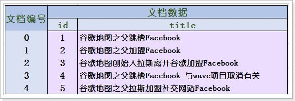
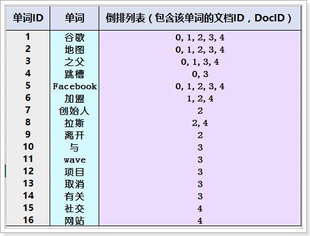
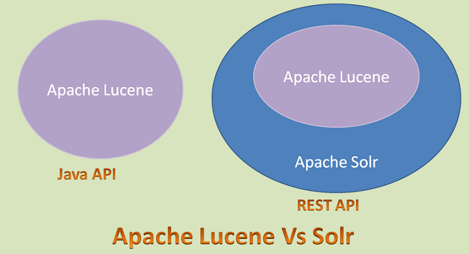
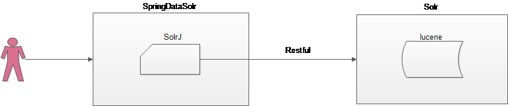

# 1. 完成solr环境搭建

## 1.1 全文检索背景

### 1.1.1 解决的问题

* 问题

```sql
--根据标题或者品牌查询商品
SELECT * FROM tb_item WHERE title LIKE '%手机%' OR brand LIKE '%apple%';
```

1. 查询效率低,模糊查询数据库不会使用索引.
2. 查询的准确率不高;

### 1.1.2 全文检索的原理

1. 文档进行分词处理
2. 清洗词条,去掉文档中的标点符号和空格
3. 清洗词条,去掉无意义的词(叹词,语气词,介词等)
4. 建立词条与文档之间的映射关系(索引库)，**倒排索引表**
5. 用户在进行条件查询时,将条件与词条进行匹配
6. 匹配到词条后,将词条对应的文档返回



倒排索引表：



### 1.1.3 相关概念

**lucene:**是全文检索的类库(框架).

**solr:**是搜索引擎服务器,底层依赖于lucene.提供了Restful风格的访问,能够实现跨语言和跨平台访问.

**solr与Luence的关系:**solr的底层依赖luence实现全文检索.

**solr与springdataSolr的关系:**Spring提供了简化solr操作的API.




### 1.1.4 Solr数据的来源

Solr中的数据来自于数据库


## 1.2 solr安装

1. 安装Tomcat
2. 解压 solr安装包
3. 将dist目录下的war包部署到Tomcat中
4. 启动Tomcat,解压solr的war包
5. 将solr下example/lib/ext 目录下的所有的 jar 包，添加到 solr 的工程中(\WEB-INF\lib目录下)
6. 复制solr安装包下的exampe/solr目录,作为solrhome文件夹
7. 将solrhome文件夹关联到Tomcat下的solr应用中

* web.xml

```xml
<env-entry>
    <env-entry-name>solr/home</env-entry-name>
    <env-entry-value>solrhome的位置</env-entry-value>
    <env-entry-type>java.lang.String</env-entry-type>
</env-entry>
```

## 1.3 中文分词器IK

中文分词器ik能够更好的按照中文的语义进行分词

1. 把 IKAnalyzer2012FF_u1.jar 添加到 solr 工程的 lib 目录下
2. 创建 WEB-INF/classes 文件夹把扩展词典、停用词词典、配置文件放到 solr 工程的WEB-INF/classes 目录下。
3. 修改 Solrhome 的 schema.xml 文件，配置一个 FieldType，使用 IKAnalyzer

```xml
<fieldType name="text_ik" class="solr.TextField">
	<analyzer class="org.wltea.analyzer.lucene.IKAnalyzer"/>
</fieldType>
```

## 1.4 配置域

配置域相对于solr相当于是在表相对于关系型数据库

### 1.4.1 field属性介绍

1.  name：字段名称
2.  type：字段类型；决定了分词的逻辑；
3.  index：是否建立索引

4.  stored：是否在Solr中存储

### 1.4.2 域的种类

1. 普通域

```xml
<field name="item_goodsid" type="long" indexed="true" stored="true"/>
<field name="item_title" type="text_ik" indexed="true" stored="true"/>
<field name="item_price" type="double" indexed="true" stored="true"/>
<field name="item_image" type="string" indexed="false" stored="true" />
<field name="item_category" type="string" indexed="true" stored="true" />
<field name="item_seller" type="text_ik" indexed="true" stored="true" />
<field name="item_brand" type="string" indexed="true" stored="true" />
<field name="item_updatetime" type="date" indexed="true" stored="true" />
```

2. 组合域

```xml
<field name="item_keywords" type="text_ik" indexed="true" stored="false" multiValued="true"/>
<copyField source="item_title" dest="item_keywords"/>
<copyField source="item_category" dest="item_keywords"/>
<copyField source="item_seller" dest="item_keywords"/>
<copyField source="item_brand" dest="item_keywords"/>
```

3. 动态域

```xml
<dynamicField name="item_spec_*" type="string" indexed="true" stored="true" />
```

# 2. SpringDataSolr的使用

SpringDataSolr的作用是简化Solr的操作



## 2.1 准备环境

* pom文件

```xml
<dependencies>
    <dependency>
    <groupId>org.springframework.data</groupId>
    <artifactId>spring-data-solr</artifactId>
        <version>1.5.5.RELEASE</version>
    </dependency>
    <dependency>
        <groupId>org.springframework</groupId>
        <artifactId>spring-test</artifactId>
        <version>4.2.4.RELEASE</version>
    </dependency>
    <dependency>
        <groupId>junit</groupId>
        <artifactId>junit</artifactId>
        <version>4.9</version>
    </dependency>
</dependencies>
```

* Spring配置文件

```xml
<!-- solr 服务器地址 -->
<solr:solr-server id="solrServer" url="http://127.0.0.1:8080/solr"/>
<!-- solr 模板，使用 solr 模板可对索引库进行 CRUD 的操作 -->
<bean id="solrTemplate" class="org.springframework.data.solr.core.SolrTemplate">
    <constructor-arg ref="solrServer"/>
</bean>
```

## 2.2 配置实体类

```java
public class TbItem implements Serializable{
	
	@Field
    private Long id;

	@Field("item_title")
    private String title;

    @Field("item_price")
    private BigDecimal price;

    @Field("item_image")
    private String image;
    
    @Field("item_goodsid")
    private Long goodsId;

    @Field("item_category")
    private String category;

    @Field("item_brand")
    private String brand;

    private String spec;

    @Field("item_seller")
    private String seller;
    
}
```

## 2.4 增加和修改

```java
@Test
public void testAdd(){
    TbItem item=new TbItem();
    item.setId(1L);
    item.setBrand("华为123");
    item.setCategory("手机");
    item.setGoodsId(1L);
    item.setSeller("华为 2 号专卖店");
    item.setTitle("华为 Mate9");
    item.setPrice(new BigDecimal(2000));
    solrTemplate.saveBean(item);
    solrTemplate.commit();
}
```

## 2.5 主键查询

```java
public void testFindOne(){
    TbItem item = solrTemplate.getById(1, TbItem.class);
    System.out.println(item.getTitle());
}
```

## 2.6 主键删除

```java
public void testDelete(){
    solrTemplate.deleteById("1");
    solrTemplate.commit();
}
```

## 2.7 批量插入

```java
public void testAddList(){
    List<TbItem>list=new ArrayList();
    for(int i=0;i<100;i++){
        TbItem item=new TbItem();
        item.setId(i+1L);
        item.setBrand("华为");
        item.setCategory("手机");
        item.setGoodsId(1L);
        item.setSeller("华为 2 号专卖店");
        item.setTitle("华为 Mate"+i);
        item.setPrice(new BigDecimal(2000+i));
        list.add(item);
    }
    solrTemplate.saveBeans(list);
    solrTemplate.commit();
}
```

## 2.8 分页查询

```java
public void testPageQuery(){
    Query query=new SimpleQuery("*:*");
    query.setOffset(20);//开始索引（默认 0）
    query.setRows(20);//每页记录数(默认 10)
    ScoredPage<TbItem> page = solrTemplate.queryForPage(query, TbItem.class);
    System.out.println("总记录数："+page.getTotalElements());
    List<TbItem>list = page.getContent();
    showList(list);
}
=====================================================
private void showList(List<TbItem>list){
    for(TbItem item:list){
        System.out.println(item.getTitle() +item.getPrice());
    }
}
```

## 2.9 条件查询

```java
public void testPageQueryMutil(){
    Query query=new SimpleQuery("*:*");
    Criteria criteria=new Criteria("item_brand").contains("华为");
    query.addCriteria(criteria);
    ScoredPage<TbItem> page = solrTemplate.queryForPage(query, TbItem.class);
    System.out.println("总记录数："+page.getTotalElements());
    List<TbItem>list = page.getContent();
    showList(list);
}
```

* 注意
  * is：查询条件进行分词，然后用分词的词条和文档的词条匹配查询
  * contains：查询条件不会进行分词，直接查询

## 2.10 全部删除

```java
public void testDeleteAll(){
    Query query=new SimpleQuery("*:*");
    solrTemplate.delete(query);
    solrTemplate.commit();
}
```

# 3. Solr导入数据

将搜索的数据(SKU)导入到solr中

* 创建solr-utils工程

  配置solr环境,同SolrDemo工程

  solr-utils工程需要额外依赖dao工程,查询数据库

* 在POJO类中的属性配置Solr注解

```java
public class TbItem implements Serializable{
	
	@Field
    private Long id;

	@Field("item_title")
    private String title;

    private String sellPoint;

    @Field("item_price")
    private BigDecimal price;

    private Integer stockCount;

    private Integer num;

    private String barcode;

    @Field("item_image")
    private String image;

    private Long categoryid;

    private String status;

    private Date createTime;

    private Date updateTime;

    private String itemSn;

    private BigDecimal costPirce;

    private BigDecimal marketPrice;

    private String isDefault;

    @Field("item_goodsid")
    private Long goodsId;

    private String sellerId;

    private String cartThumbnail;

    @Field("item_category")
    private String category;

    @Field("item_brand")
    private String brand;

    private String spec;

    @Field("item_seller")
    private String seller;
    
    @Dynamic
    @Field("item_spec_*")
    private Map<String,String> specMap;
    
    ...
}
```

* 查询数据库数据,导入solr中

```java
@Component
public class SolrUtil {

	@Autowired
	private TbItemMapper itemMapper;
	
	@Autowired
	private SolrTemplate solrTemplate;
	
	public void importItemData(){
		TbItemExample example=new TbItemExample();
		Criteria criteria = example.createCriteria();
        //审核通过的才导入的
		criteria.andStatusEqualTo("1");
		List<TbItem> itemList = itemMapper.selectByExample(example);
		
		System.out.println("---商品列表---");
		for(TbItem item:itemList){
			System.out.println(item.getId()+" "+ item.getTitle()+ " "+item.getPrice());	
            //从数据库中提取规格json字符串转换为map
			Map specMap = JSON.parseObject(item.getSpec(), Map.class);
			item.setSpecMap(specMap);
		}
		
		solrTemplate.saveBeans(itemList);
		solrTemplate.commit();
		
		System.out.println("---结束---");
	}
    
    public static void main(String[] args) {
        ApplicationContext context=
                new ClassPathXmlApplicationContext("classpath*:spring/applicationContext*.xml");
        SolrUtil solrUtil=  (SolrUtil) context.getBean("solrUtil");
        solrUtil.importItemData();
    }
    
}
```

# 4. 关键字搜索

创建独立的pinyougou-search-interface、pinyougou-search-service、pinyougou-search-web工程

## 4.1 服务层接口

```java
/**
 * 搜索方法
 * @param searchMap 前台发送的搜索条件类型可能是多个
 * @return Map		后台返回给前台的搜索结果也包含多种类型
 */
public Map search(Map searchMap);
```

## 4.2 数据格式

* 前台传输给后台

```json
{"keywords":"XXX","brand":"XXX","category":"XXX"}
```

* 后台返回给前台

```json
{"rows":[...],"brands":[...],"specs":[...]}
```

## 4.2 服务层实现

```java
@Autowired
private SolrTemplate solrTemplate;

@Override
public Map search(Map searchMap) {	
	Map map=new HashMap();
	
	Query query=new SimpleQuery("*:*");
	Criteria criteria=new Criteria("item_keywords").is(searchMap.get("keywords"));
	query.addCriteria(criteria);
	
	ScoredPage<TbItem> page = solrTemplate.queryForPage(query, TbItem.class);
	
	map.put("rows", page.getContent());
	
	return map;
}
```

## 4.3 Web层

```java
@Reference
private ItemSearchService itemSearchService;

@RequestMapping("/search")
public Map search(@RequestBody Map searchMap){
	return itemSearchService.search(searchMap);
}
```

* 页面

```html
<script type="text/javascript" src="plugins/angularjs/angular.min.js"></script>
<script type="text/javascript" src="js/base.js"></script>
<script type="text/javascript" src="js/service/searchService.js"></script>
<script type="text/javascript" src="js/controller/searchController.js"></script>

...

<body ng-app="pinyougou" ng-controller="searchController">
    <input type="text" id="autocomplete" ng-model="searchMap.keywords"  />
    <button ng-click="search()" type="button">搜索</button>
    ....
    <ul>
		<li  ng-repeat="item in resultMap.rows">	
			<a href="item.html" target="_blank"></a>
			<i>{{item.price}}</i>
			<em>{{item.title}}</em>
		</li>
	</ul>
</body>
```

* searchController.js

```javascript
$scope.search=function(){
	searchService.search($scope.searchMap).success(
		function(response){
			$scope.resultMap=response;				
		}
	);		
}
```

* searchService.js

```javascript
app.service('searchService',function($http){
	this.search=function(searchMap){
		return $http.post('itemsearch/search.do',searchMap);
	}
});
```

