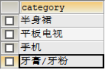

# 1. 搜索结果高亮显示

## 1.1 思路分析

搜索关键字的高亮显示,其实是在指定的域中对搜索的关键字使用样式进行颜色设置

## 1.2 实现步骤

1. 指定在哪些域中进行高亮显示，可以是一个域也可以是多个域
2. 指定包裹关键字的HTML标签(开始标签和结束标签)和颜色的样式
3. 执行高亮查询
4. 使用高亮结果将原对象中的域的属性值进行替换

## 1.3 代码实现

* 后台

```java
//查询列表
private Map searchList(Map searchMap){
	Map map=new HashMap();
	//高亮选项初始化
	HighlightQuery query=new SimpleHighlightQuery();		
	HighlightOptions highlightOptions=new HighlightOptions().addField("item_title");//高亮域
	highlightOptions.setSimplePrefix("<em style='color:red'>");//前缀
	highlightOptions.setSimplePostfix("</em>");		
	query.setHighlightOptions(highlightOptions);//为查询对象设置高亮选项
	
	//关键字查询
	Criteria criteria=new Criteria("item_keywords").is(searchMap.get("keywords"));
	query.addCriteria(criteria);

	//***********  获取高亮结果集  ***********
	//高亮页对象
	HighlightPage<TbItem> page = solrTemplate.queryForHighlightPage(query, TbItem.class);
	//高亮入口集合(每条记录的高亮入口)
	List<HighlightEntry<TbItem>> entryList = page.getHighlighted();		
  	//entry=实体+高亮片段
	for(HighlightEntry<TbItem> entry:entryList  ){
		//获取高亮列表(高亮域的个数)
		List<Highlight> highlightList = entry.getHighlights();		
		if(highlightList.size()>0 &&  highlightList.get(0).getSnipplets().size()>0 ){
			TbItem item = entry.getEntity();
			item.setTitle(highlightList.get(0).getSnipplets().get(0));			
		}			
	}
	map.put("rows", page.getContent());
	return map;
}
```

* 页面

```html
<body ng-app="pinyougou" ng-controller="searchController">
    <input type="text" id="autocomplete" ng-model="searchMap.keywords"  />
    <button ng-click="search()" type="button">搜索</button>
    ....
    <ul>
		<li  ng-repeat="item in resultMap.rows">	
			<a href="item.html" target="_blank"></a>
			<i>{{item.price}}</i>
            <!--{{item.title}}-->
            <div class="attr" ng-bind-html="item.title | trustHtml"></div>
		</li>
	</ul>
</body>
```

* baseController.js

```javascript
// 定义模块:
var app = angular.module("pinyougou",[]);
// 定义过滤器
app.filter('trustHtml',function($sce){
	return function(data){//传入参数时被过滤的内容
		return $sce.trustAsHtml(data);//返回的是过滤后的内容（信任html的转换）
	}	
});
```

# 2. 搜索页面过滤面板

过滤面板的作用是用来根据指定的条件过滤搜索的结果

## 2.1 过滤面板的显示

1. 针对搜索条件,对商品数据进行按照分类进行分组查询
2. 将分组的结果(分类信息)封装到响应数据集合中
3. 默认根据第一个分类信息,查询其对应的模板
4. 根据模板查询其对应的品牌信息,封装到结果集
5. 根据模板查询其对应的规格信息,封装到结果集

## 2.2 过滤的过滤查询

1. 用户点击过滤面板的分类、品牌和规格等过滤条件时，将条件封装到searchEntity中
2. 后台根据过滤条件筛选结果
3. 前台隐藏用户已点击的条件

# 3. 显示过滤面板中分类信息

## 3.1 重构代码

由于后台搜索方法中要同时封装商品、分类、品牌和规格的数据，所以对该方法进行重构，方便后期维护。

* 控制层

```java
@RequestMapping("/search")
public Map search(@RequestBody Map searchMap){
	return itemSearchService.search(searchMap);
}
```

* 服务层

```java
public Map search(Map searchMap) {
	Map map=new HashMap();
	
	//1.封装商品集合
	map.put(...);
	//2.封装分类集合
	map.put(...);
	//3.封装品牌和规格集合
	map.put(...);
    
	return map;
}
```

## 3.2 按照类型分组查询

分组就是将具有相同属性值得数据放置在同一组

### 3.2.1 思路分析

类比数据库的分组查询

```sql
--查询商品的种类信息
SELECT category FROM tb_item GROUP BY category
```

显示结果：



Solr支持类似于数据库的分组查询，可以通过solr提供的API指定分组的域

### 3.2.2 代码实现

* 业务层search方法

```java
public Map search(Map searchMap) {
	Map map=new HashMap();
	//1.封装商品集合
	map.putAll(searchList(searchMap));
	//2.封装分类集合
	List<String> categoryList = searchCategoryList(searchMap);
	map.put("categoryList", categoryList);
	return map;
}
```

* 业务层按照分类进行分组查询

```java
private List<String> searchCategoryList(Map searchMap){
	List<String> list=new ArrayList();
	
	Query query=new SimpleQuery("*:*");
	//根据关键字查询  
	Criteria criteria=new Criteria("item_keywords").is(searchMap.get("keywords"));
	query.addCriteria(criteria);
	//设置分组选项
	GroupOptions groupOptions=new GroupOptions().addGroupByField("item_category");  
	query.setGroupOptions(groupOptions);
	//获取分组页
	GroupPage<TbItem> page = solrTemplate.queryForGroupPage(query, TbItem.class);
	//获取分组结果对象
	GroupResult<TbItem> groupResult = page.getGroupResult("item_category");
	//获取分组入口页
	Page<GroupEntry<TbItem>> groupEntries = groupResult.getGroupEntries();
	//获取分组入口集合
	List<GroupEntry<TbItem>> entryList = groupEntries.getContent();
	//entry=分类名称+分类结果（商品数量等）
	for(GroupEntry<TbItem> entry:entryList  ){
		list.add(entry.getGroupValue()	);	//将分类名称添加到集合中
	}
	return list;
}
```

* 页面显示

```html
<body ng-app="pinyougou" ng-controller="searchController">
    <input type="text" id="autocomplete" ng-model="searchMap.keywords"  />
    <button ng-click="search()" type="button">搜索</button>
    <!--商品分类-->
	<span ng-repeat="category in resultMap.categoryList" > 
		<a href="#">{{category}}</a>
	</span>	
    <!--商品列表-->
    <ul>
		<li  ng-repeat="item in resultMap.rows">	
			<a href="item.html" target="_blank"></a>
			<i>{{item.price}}</i>
            <!--{{item.title}}-->
            <div class="attr" ng-bind-html="item.title | trustHtml"></div>
		</li>
	</ul>
</body>
```

# 4. 缓存品牌和规格信息

## 4.1 过滤面板数据分析

过滤面板的数据显示逻辑:

1. 分类名称---->模板ID
2. 模板ID---->品牌集合
3. 模板ID--->规格集合

如果查询数据库会导致数据库访问压力太大,所以将数据缓存到Redis中.

## 4.2 缓存数据

1. 在哪个系统缓存？

   在运行商后台管理系统中进行数据缓存

2. 缓存哪些数据？

   在Redis中缓存两部分的数据

   ​	分类集合

   ​	模板集合

3. 什么时候缓存？

   在数据库的数据发生变化的时候，就要将最新的数据缓存到redis中

   由于分类和模板的数据更改后都会进行查询操作，所以可以在查询方法处进行缓存

### 4.2.1 缓存分类与模板

* ItemCatServiceImpl

```java
/**
 * 分类列表
 */
public List<TbItemCat> findByParentId(Long parentId) {
	TbItemCatExample example = new TbItemCatExample();
	Criteria criteria = example.createCriteria();
	// 设置条件
	criteria.andParentIdEqualTo(parentId);
	//将模板ID放入缓存（以商品分类名称作为key）	
	List<TbItemCat> itemCatList = findAll();
	for(TbItemCat itemCat:itemCatList){
		redisTemplate.boundHashOps("itemCat").put(itemCat.getName(), itemCat.getTypeId());
	}
	System.out.println("将模板ID放入缓存");
	
	return itemCatMapper.selectByExample(example);
}

/**
 * 查询全部
 */
@Override
public List<TbItemCat> findAll() {
	return itemCatMapper.selectByExample(null);
}
```

### 4.2.2 缓存品牌与规格

* TypeTemplateServiceImpl


```java
/**
 * 模板列表
 */
public PageResult findPage(TbTypeTemplate typeTemplate, int pageNum, int pageSize) {
	PageHelper.startPage(pageNum, pageSize);
	
	TbTypeTemplateExample example=new TbTypeTemplateExample();
	Criteria criteria = example.createCriteria();
	...		
	Page<TbTypeTemplate> page= (Page<TbTypeTemplate>)typeTemplateMapper.selectByExample(example);
	//缓存处理
	saveToRedis();	
	return new PageResult(page.getTotal(), page.getResult());
}


/**
 * 将品牌列表与规格列表放入缓存
 */
private void saveToRedis(){
	List<TbTypeTemplate> templateList = findAll();
	for(TbTypeTemplate template:templateList){
		//得到品牌列表
		List brandList= JSON.parseArray(template.getBrandIds(), Map.class) ;
		redisTemplate.boundHashOps("brandList").put(template.getId(), brandList);
		
		//得到规格列表
		List<Map> specList = findSpecList(template.getId());
		redisTemplate.boundHashOps("specList").put(template.getId(), specList);
		
	}
	System.out.println("缓存品牌列表");
	
}
```

# 5. 显示品牌和规格信息

## 5.1 思路分析

* 搜索页面加载后，默认根据集合中第一个分类查询对应的品牌和规格信息
* 如果用户在过滤面板上点击某个分类，根据用户点击的分类查询对应的品牌和规格信息

## 5.2 编码实现

* 页面

```html
<script type="text/javascript" src="plugins/angularjs/angular.min.js"></script>
<script type="text/javascript" src="js/base.js"></script>
<script type="text/javascript" src="js/service/searchService.js"></script>
<script type="text/javascript" src="js/controller/searchController.js"></script>

...

<body ng-app="pinyougou" ng-controller="searchController">
    <input type="text" id="autocomplete" ng-model="searchMap.keywords"  />
    <button ng-click="search()" type="button">搜索</button>
    <!--分类集合-->
    <div ng-if="resultMap.categoryList!=null">
        <span ng-repeat="category in resultMap.categoryList" >
			   {{category}}
        </span>
    </div>
    <!--品牌集合-->
    <div class="type-wrap logo" ng-if="resultMap.brandList!=null">
		<ul>
            <li ng-repeat="brand in resultMap.brandList">
				{{brand.text}}
			</li>		
        </ul>					
	 </div>
    
    <!--规格集合-->
    <div  ng-repeat="spec in resultMap.specList" ng-if="searchMap.spec[spec.text]==null">
		<div>{{spec.text}}</div>
		<ul>
            <li ng-repeat="option in spec.options">
                {{option.optionName}}
            </li>							
		</ul>  
    </div>
    <!--商品集合-->
    <ul>
		<li  ng-repeat="item in resultMap.rows">	
			<a href="item.html" target="_blank"></a>
			<i>{{item.price}}</i>
			<em>{{item.title}}</em>
		</li>
	</ul>
</body>
```

* searchController.js

```javascript
$scope.search=function(){
	searchService.search($scope.searchMap).success(
		function(response){
			$scope.resultMap=response;				
		}
	);		
}
```

* searchService.js

```javascript
app.service('searchService',function($http){
	this.search=function(searchMap){
		return $http.post('itemsearch/search.do',searchMap);
	}
});
```

* 控制层

```java
@RequestMapping("/search")
public Map search(@RequestBody Map searchMap){
	return itemSearchService.search(searchMap);
}
```

* 服务层

```java
public Map search(Map searchMap) {
	Map map=new HashMap();
	
	//1.查询SKU列表
	map.putAll(searchList(searchMap));
	//2.分组查询 商品分类列表
	List<String> categoryList = searchCategoryList(searchMap);
	map.put("categoryList", categoryList);
	//3.查询品牌和规格列表
	map.putAll(searchBrandAndSpecList(categoryList.get(0)));
    
	return map;
}


/**
 * 根据商品分类名称查询品牌和规格列表
 */
private Map searchBrandAndSpecList(String category){
	Map map=new HashMap();
	//1.根据商品分类名称得到模板ID		
	Long templateId= (Long) redisTemplate.boundHashOps("itemCat").get(category);
	if(templateId!=null){
		//2.根据模板ID获取品牌列表
		List brandList = (List) redisTemplate.boundHashOps("brandList").get(templateId);
		map.put("brandList", brandList);	
		System.out.println("品牌列表条数："+brandList.size());
		
		//3.根据模板ID获取规格列表
		List specList = (List) redisTemplate.boundHashOps("specList").get(templateId);
		map.put("specList", specList);		
		System.out.println("规格列表条数："+specList.size());
	}
	return map;
}
```

# 6. 过滤查询

## 6.1 思路分析

构建查询实体,当用户点击过滤面板的[分类|品牌|规格]时,在searchMap中绑定查询条件

```
$scope.searchMap={'keywords':'','category':'','brand':'','spec':{}};
```

## 6.2 绑定查询条件

* HTML

```html
<body ng-app="pinyougou" ng-controller="searchController">
    
    ...
    <!--面包屑-->
    <ul>
        <li  ng-if="searchMap.category!=''">商品分类：{{searchMap.category}}</li>
        <li  ng-if="searchMap.brand!=''" >品牌：{{searchMap.brand}}</li>
        <li  ng-repeat="(key,value) in searchMap.spec">{{key}}：{{value}}</li>					
    </ul>

    <!--分类集合-->
    <div ng-if="resultMap.categoryList!=null && searchMap.category==''">
        <span ng-repeat="category in resultMap.categoryList" >
               <a href="#" ng-click="addSearchItem('category',category)">{{category}}</a>
        </span>
    </div>
    <!--品牌集合-->
    <div class="type-wrap logo" ng-if="resultMap.brandList!=null && searchMap.brand==''">
        <ul>
            <li ng-repeat="brand in resultMap.brandList">
                <a href="#" ng-click="addSearchItem('brand',brand.text)">{{brand.text}}</a>
            </li>		
        </ul>					
     </div>

    <!--规格集合-->
    <div  ng-repeat="spec in resultMap.specList" ng-if="searchMap.spec[spec.text]==null">
        <div>{{spec.text}}</div>
        <ul>
            <li ng-repeat="option in spec.options">
                <a href="#" ng-click="addSearchItem(spec.text,option.optionName)">
                    {{option.optionName}}
                </a>
            </li>							
        </ul>  
    </div>
</body>
```

* searchController.js

```javascript
$scope.addSearchItem=function(key,value){
	if(key=='category' || key=='brand'){//如果用户点击的是分类或品牌
		$scope.searchMap[key]=value;
		
	}else{//用户点击的是规格
		$scope.searchMap.spec[key]=value;		
	}
	$scope.search();//查询
}
```

## 6.3 撤销过滤条件

* HTML

```html
<body ng-app="pinyougou" ng-controller="searchController">
...
<!--面包屑-->
<ul>
    <li  ng-if="searchMap.category!=''" ng-click="removeSearchItem('category')">
        商品分类：{{searchMap.category}}
    </li>
    <li  ng-if="searchMap.brand!=''"    ng-click="removeSearchItem('brand')">
        品牌：{{searchMap.brand}}
    </li>
    <li  ng-repeat="(key,value) in searchMap.spec" ng-click="removeSearchItem(key)">
        {{key}}：{{value}}
    </li>					
</ul> 
...    
</body>
```
* JS

```javascript
$scope.removeSearchItem=function(key){
	if(key=='category' || key=='brand'){//如果用户点击的是分类或品牌
		$scope.searchMap[key]="";
	}else{//用户点击的是规格
		delete $scope.searchMap.spec[key];		
	}
	$scope.search();//查询
}
```

## 6.4 后台过滤查询

```java
private Map searchList(Map searchMap){
	Map map=new HashMap();
	//高亮选项初始化
	HighlightQuery query=new SimpleHighlightQuery();		
	...
	//1.1 关键字查询
	Criteria criteria=new Criteria("item_keywords").is(searchMap.get("keywords"));
	query.addCriteria(criteria);
	
	//1.2 按商品分类过滤
	if(!StringUtils.isEmpty(searchMap.get("category"))  )	{//如果用户选择了分类
		FilterQuery filterQuery=new SimpleFilterQuery();
		Criteria filterCriteria=new Criteria("item_category").is(searchMap.get("category"));
		filterQuery.addCriteria(filterCriteria);
		query.addFilterQuery(filterQuery);			
	}
	
	//1.3 按品牌过滤
	if(!StringUtils.isEmpty(searchMap.get("brand"))  )	{//如果用户选择了品牌
		FilterQuery filterQuery=new SimpleFilterQuery();
		Criteria filterCriteria=new Criteria("item_brand").is(searchMap.get("brand"));
		filterQuery.addCriteria(filterCriteria);
		query.addFilterQuery(filterQuery);			
	}
	//1.4 按规格过滤
	if(searchMap.get("spec")!=null){			
		Map<String,String> specMap= (Map<String, String>) searchMap.get("spec");
		for(String key :specMap.keySet()){
			
			FilterQuery filterQuery=new SimpleFilterQuery();
			Criteria filterCriteria=new Criteria("item_spec_"+key).is( specMap.get(key)  );
			filterQuery.addCriteria(filterCriteria);
			query.addFilterQuery(filterQuery);					
			
		}		
	}
	//执行查询
	HighlightPage<TbItem> page = solrTemplate.queryForHighlightPage(query, TbItem.class);
	...
	map.put("rows", page.getContent());
	return map;
}
```

