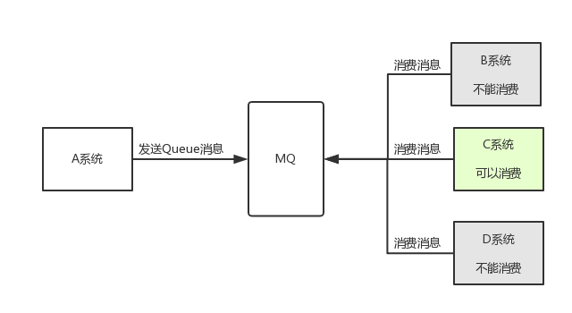
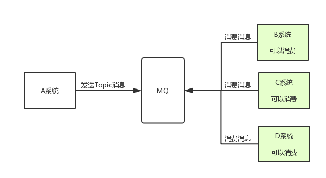

# 1. MQ介绍

##1.1 为什么要用MQ

消息队列是一种“先进先出”的数据结构


其应用场景主要包含以下3个方面

* 远程调用由同步（RPC）变为异步

系统的耦合性越高，容错性就越低。以电商应用为例，用户创建订单后，如果耦合调用库存系统、物流系统、支付系统，任何一个子系统出了故障或者因为升级等原因暂时不可用，都会造成下单操作异常，影响用户使用体验。


使用消息队列解耦合，系统的耦合性就会提高了。比如物流系统发生故障，需要几分钟才能来修复，在这段时间内，物流系统要处理的数据被缓存到消息队列中，用户的下单操作正常完成。当物流系统回复后，补充处理存在消息队列中的订单消息即可，终端系统感知不到物流系统发生过几分钟故障。


* 流量削峰


应用系统如果遇到系统请求流量的瞬间猛增，有可能会将系统压垮。有了消息队列可以将大量请求缓存起来，分散到很长一段时间处理，这样可以大大提到系统的稳定性和用户体验。


一般情况，为了保证系统的稳定性，如果系统负载超过阈值，就会阻止用户请求，这会影响用户体验，而如果使用消息队列将请求缓存起来，等待系统处理完毕后通知用户下单完毕，这样总不能下单体验要好。

<u>处于经济考量目的：</u>

业务系统正常时段的QPS如果是1000，流量最高峰是10000，为了应对流量高峰配置高性能的服务器显然不划算，这时可以使用消息队列对峰值流量削峰

* 数据分发


通过消息队列可以让数据在多个系统更加之间进行流通。数据的产生方不需要关心谁来使用数据，只需要将数据发送到消息队列，数据使用方直接在消息队列中直接获取数据即可


## 1.2 JMS

* JMS:Java针对消息机制提出的一套规范
* ActiveMQ:是JMS一种实现

## 1.3 消息正文格式

* TextMessage:字符串
* MapMessage:Map类型
* ObjectMessage:序列化对象
* BytesMessage:字节数据
* StreamMessage:原始流对象

## 1.4 两种消息类型

### 1.4.1 点对点



1.  一个消息的生产者对应一个消费者
2.  如果当前的消费方不存在,那么消息就会存储在消息队列中.

### 1.4.2 发布/订阅



1. 一个消息的消息生产者可以对应多个消费者
2. 如果当前的消费方不存在,那么消息就会过期了

# 2.JMS原生开发

## 2.1 点对点

### 2.1.1 消息生产者

```java
//1.创建连接工厂
ConnectionFactory connectionFactory=new ActiveMQConnectionFactory("tcp://192.168.25.135:61616");
//2.创建连接
Connection connection = connectionFactory.createConnection();
//3.启动连接
connection.start();
//4.获取session(会话对象)  参数1：是否启动事务  参数2：消息确认方式
Session session = connection.createSession(false, Session.AUTO_ACKNOWLEDGE);
//5.创建队列对象
Queue queue = session.createQueue("test-queue");		//消息对象
//6.创建消息生产者对象
MessageProducer producer = session.createProducer(queue);
//7.创建消息对象（文本消息）
TextMessage textMessage = session.createTextMessage("欢迎来到申请的品优购世界");
//8.发送消息
producer.send(textMessage);

//9.关闭资源
producer.close();
session.close();
connection.close();
```

### 2.1.2 消息消费者

```java
//1.创建连接工厂
ConnectionFactory connectionFactory=new ActiveMQConnectionFactory("tcp://192.168.25.135:61616");
//2.创建连接
Connection connection = connectionFactory.createConnection();
//3.启动连接
connection.start();
//4.获取session(会话对象)  参数1：是否启动事务  参数2：消息确认方式
final Session session = connection.createSession(false, Session.AUTO_ACKNOWLEDGE);
//5.创建队列对象
Queue queue = session.createQueue("test-queue");

//6.创建消息消费者对象
MessageConsumer consumer = session.createConsumer(queue);

//7.设置监听
consumer.setMessageListener(new MessageListener() {
	public void onMessage(Message message) {
		TextMessage textMessage=(TextMessage)message;
		try {
			System.out.println("提取的消息："+ textMessage.getText() );
			textMessage.acknowledge();
		} catch (JMSException e) {
			e.printStackTrace();
		}
	}
});
//8.等待键盘输入
System.in.read();


//9.关闭资源
//session.close();
//connection.close();
```

## 2.2 发布订阅

### 2.2.1 消息生产者

```java
//1.创建连接工厂
ConnectionFactory connectionFactory=new ActiveMQConnectionFactory("tcp://192.168.25.135:61616");
//2.创建连接
Connection connection = connectionFactory.createConnection();
//3.启动连接
connection.start();
//4.获取session(会话对象)  参数1：是否启动事务  参数2：消息确认方式
Session session = connection.createSession(false, Session.AUTO_ACKNOWLEDGE);
//5.创建主题对象
Topic topic = session.createTopic("test-topic");		
//6.创建消息生产者对象
MessageProducer producer = session.createProducer(topic);
//7.创建消息对象（文本消息）
TextMessage textMessage = session.createTextMessage("欢迎来到神奇的品优购世界");
//8.发送消息
producer.send(textMessage);
//9.关闭资源
producer.close();
session.close();
connection.close();
```

### 2.2.2 消息消费者

```java
//1.创建连接工厂
ConnectionFactory connectionFactory=new ActiveMQConnectionFactory("tcp://192.168.25.135:61616");
//2.创建连接
Connection connection = connectionFactory.createConnection();
//3.启动连接
connection.start();
//4.获取session(会话对象)  参数1：是否启动事务  参数2：消息确认方式
Session session = connection.createSession(false, Session.AUTO_ACKNOWLEDGE);
//5.创建主题对象
Topic topic = session.createTopic("test-topic");		
//6.创建消息消费者对象
MessageConsumer consumer = session.createConsumer(topic);
//7.设置监听
consumer.setMessageListener(new MessageListener() {
	
	public void onMessage(Message message) {
		TextMessage textMessage=(TextMessage)message;
		try {
			System.out.println("提取的消息："+ textMessage.getText() );
		} catch (JMSException e) {					
			e.printStackTrace();
		}
		
	}
});
//8.等待键盘输入
System.in.read();

//9.关闭资源
consumer.close();
session.close();
connection.close();
```

# 3. SpringJMS

## 3.1 点对点

### 3.1.1 消息生产者

* ```spring```配置文件

```xml
<context:component-scan base-package="cn.itcast.demo"></context:component-scan> 

<!-- 真正可以产生Connection的ConnectionFactory，由对应的 JMS服务厂商提供-->  
<bean id="targetConnectionFactory" class="org.apache.activemq.ActiveMQConnectionFactory">  
    <property name="brokerURL" value="tcp://192.168.25.135:61616"/>  
</bean>
   
<!-- Spring用于管理真正的ConnectionFactory的ConnectionFactory -->  
<bean id="connectionFactory" class="org.springframework.jms.connection.SingleConnectionFactory">  
    <property name="targetConnectionFactory" ref="targetConnectionFactory"/>
</bean>  
	   
<!-- Spring提供的JMS工具类，它可以进行消息发送、接收等 -->  
<bean id="jmsTemplate" class="org.springframework.jms.core.JmsTemplate">  
    <property name="connectionFactory" ref="connectionFactory"/>
</bean> 

<!--这个是队列目的地，点对点的  文本信息-->  
<bean id="queueTextDestination" class="org.apache.activemq.command.ActiveMQQueue">  
    <constructor-arg value="queue_text"/>  
</bean>    
```

* 生产者

```java
@Component
public class QueueProducer {
	@Autowired
	private JmsTemplate jmsTemplate;
	@Autowired
	private Destination queueTextDestination;		//消息类型
	
	/**
	 * 发送文本消息
	 * @param text
	 */
	public void sendTextMessage(final String text){
		jmsTemplate.send(queueTextDestination, new MessageCreator() {
			public Message createMessage(Session session) throws JMSException {
				return session.createTextMessage(text);
			}
		});
	}
}
```

* 测试

```java
@RunWith(SpringJUnit4ClassRunner.class)
@ContextConfiguration(locations="classpath:applicationContext-jms-producer.xml")
public class TestQueue {

	@Autowired
	private  QueueProducer queueProducer;
	
	@Test
	public void testSend(){
		queueProducer.sendTextMessage("spring JMS 点对点");
	}
}
```

### 3.1.2 消息消费者

* ```spring```配置文件

```xml
<!-- 真正可以产生Connection的ConnectionFactory，由对应的 JMS服务厂商提供-->  
<bean id="targetConnectionFactory" class="org.apache.activemq.ActiveMQConnectionFactory">  
    <property name="brokerURL" value="tcp://192.168.25.135:61616"/>  
</bean>
   
<!-- Spring用于管理真正的ConnectionFactory的ConnectionFactory -->  
<bean id="connectionFactory" class="org.springframework.jms.connection.SingleConnectionFactory">  
    <property name="targetConnectionFactory" ref="targetConnectionFactory"/>  
</bean>  

<!--这个是队列目的地，点对点的  文本信息-->  
<bean id="queueTextDestination" class="org.apache.activemq.command.ActiveMQQueue">  
    <constructor-arg value="queue_text"/>  
</bean>    

<!-- 我的监听类 -->
<bean id="myMessageListener" class="cn.itcast.demo.MyMessageListener"></bean>

<!-- 消息监听容器 -->
<bean class="org.springframework.jms.listener.DefaultMessageListenerContainer">
	<property name="connectionFactory" ref="connectionFactory" />
	<property name="destination" ref="queueTextDestination" />
	<property name="messageListener" ref="myMessageListener" />
</bean>
```

* 消费者监听器

```java
public class MyMessageListener implements MessageListener {

	public void onMessage(Message message) {
		
		TextMessage textMessage=(TextMessage)message;
		try {
			System.out.println("接收到消息："+textMessage.getText());
		} catch (JMSException e) {
			// TODO Auto-generated catch block
			e.printStackTrace();
		}
	}
}
```

* 测试

```java
@RunWith(SpringJUnit4ClassRunner.class)
@ContextConfiguration(locations="classpath:applicationContext-jms-consumer-queue.xml")
public class TestQueue {

	@Test
	public void testQueue(){
		try {
			System.in.read();
		} catch (IOException e) {
			// TODO Auto-generated catch block
			e.printStackTrace();
		}
	}
}
```

## 3.2 发布/订阅

### 3.2.1 消息生产者

* ```Spring```配置文件

```xml
<context:component-scan base-package="cn.itcast.demo"></context:component-scan>     

<!-- 真正可以产生Connection的ConnectionFactory，由对应的 JMS服务厂商提供-->  
<bean id="targetConnectionFactory" class="org.apache.activemq.ActiveMQConnectionFactory">  
    <property name="brokerURL" value="tcp://192.168.25.135:61616"/>  
</bean>
   
<!-- Spring用于管理真正的ConnectionFactory的ConnectionFactory -->  
<bean id="connectionFactory" class="org.springframework.jms.connection.SingleConnectionFactory">  
    <property name="targetConnectionFactory" ref="targetConnectionFactory"/>
</bean>  
	   
<!-- Spring提供的JMS工具类，它可以进行消息发送、接收等 -->  
<bean id="jmsTemplate" class="org.springframework.jms.core.JmsTemplate">   
    <property name="connectionFactory" ref="connectionFactory"/>
</bean>      

<!--这个是订阅模式  文本信息-->  
<bean id="topicTextDestination" class="org.apache.activemq.command.ActiveMQTopic">  
    <constructor-arg value="topic_text"/>  
</bean>  
```

* 消息生产者

```java
@Component
public class TopicProducer {

	@Autowired
	private JmsTemplate jmsTemplate;
	
	@Autowired
	private Destination topicTextDestination;
	
	/**
	 * 发送文本消息
	 * @param text
	 */
	public void sendTextMessage(final String text){
		jmsTemplate.send(topicTextDestination, new MessageCreator() {
			
			public Message createMessage(Session session) throws JMSException {
				return session.createTextMessage(text);
			}
		});	
	}	
}
```

* 测试

```java
@RunWith(SpringJUnit4ClassRunner.class)
@ContextConfiguration(locations="classpath:applicationContext-jms-producer.xml")
public class TestTopic {

	@Autowired
	private  TopicProducer topicProducer;
	
	@Test
	public void testSend(){
		topicProducer.sendTextMessage("spring JMS 发布订阅");
	}	
}
```

### 3.2.2 消息消费者

- ```Spring```配置文件

```xml
<!-- 真正可以产生Connection的ConnectionFactory，由对应的 JMS服务厂商提供-->  
<bean id="targetConnectionFactory" class="org.apache.activemq.ActiveMQConnectionFactory">  
    <property name="brokerURL" value="tcp://192.168.25.135:61616"/>  
</bean>
   
<!-- Spring用于管理真正的ConnectionFactory的ConnectionFactory -->  
<bean id="connectionFactory" class="org.springframework.jms.connection.SingleConnectionFactory">  
    <property name="targetConnectionFactory" ref="targetConnectionFactory"/>  
</bean>  

<!--这个是队列目的地，点对点的  文本信息-->  
<bean id="topicTextDestination" class="org.apache.activemq.command.ActiveMQTopic">  
    <constructor-arg value="topic_text"/>  
</bean>    

<!-- 我的监听类 -->
<bean id="myMessageListener" class="cn.itcast.demo.MyMessageListener"></bean>

<!-- 消息监听容器 -->
<bean class="org.springframework.jms.listener.DefaultMessageListenerContainer">
	<property name="connectionFactory" ref="connectionFactory" />
	<property name="destination" ref="topicTextDestination" />
	<property name="messageListener" ref="myMessageListener" />
</bean>
```

- 消费者监听器

```java
public class MyMessageListener implements MessageListener {
	public void onMessage(Message message) {
		
		TextMessage textMessage=(TextMessage)message;
		try {
			System.out.println("接收到消息："+textMessage.getText());
		} catch (JMSException e) {
			// TODO Auto-generated catch block
			e.printStackTrace();
		}
	}
}
```

- 测试

```java
@RunWith(SpringJUnit4ClassRunner.class)
@ContextConfiguration(locations="classpath:applicationContext-jms-consumer-topic.xml")
public class TestTopic {

	@Test
	public void testTopic(){
		try {
			System.in.read();
		} catch (IOException e) {
			// TODO Auto-generated catch block
			e.printStackTrace();
		}
	}
}
```

# 4. 优化商品审核和删除更新索引库

## 4.1 商品审核

### 4.1.1 审核商品消息生产者

* ```Spring```文件

```xml
<!-- Spring提供的JMS工具类，它可以进行消息发送、接收等 -->  
<bean id="jmsTemplate" class="org.springframework.jms.core.JmsTemplate">  
    <property name="connectionFactory" ref="connectionFactory"/>  
</bean>  

<!--这个是队列目的地，导入索引库-->  
<bean id="queueSolrDestination" class="org.apache.activemq.command.ActiveMQQueue">  
    <constructor-arg value="pinyougou_queue_solr"/>  
</bean>
```

* 发送消息

```java
@RequestMapping("/updateStatus")
public Result updateStatus(Long[] ids,String status){
	try {
		goodsService.updateStatus(ids, status);
		
		if("1".equals(status)){//如果是审核通过 
			//*****导入到索引库
			//得到需要导入的SKU列表
			List<TbItem> itemList = goodsService.findItemListByGoodsIdListAndStatus(ids, status);
			//导入到solr
			//itemSearchService.importList(itemList);	
			final String jsonString = JSON.toJSONString(itemList);//转换为json传输
          
			jmsTemplate.send(queueSolrDestination, new MessageCreator() {
				
				@Override
				public Message createMessage(Session session) throws JMSException {
					
					return session.createTextMessage(jsonString);
				}
			});
					
		return new Result(true, "修改状态成功"); 
	} catch (Exception e) {
		e.printStackTrace();
		return new Result(false, "修改状态失败");
	}
}
```

### 4.1.2 审核商品消息消费者

* ```spring```配置文件

```xml
<!--这个是队列目的地，导入索引库-->  
<bean id="queueSolrDestination" class="org.apache.activemq.command.ActiveMQQueue">  
    <constructor-arg value="pinyougou_queue_solr"/>  
</bean>    

<!-- 消息监听容器  导入索引库-->
<bean class="org.springframework.jms.listener.DefaultMessageListenerContainer">
	<property name="connectionFactory" ref="connectionFactory" />
	<property name="destination" ref="queueSolrDestination" />
	<property name="messageListener" ref="itemSearchListener" />
</bean>
```

* 消息监听器

```java
@Component
public class ItemSearchListener implements MessageListener {
	@Autowired
	private ItemSearchService itemSearchService;
	
	@Override
	public void onMessage(Message message) {
		
		TextMessage textMessage=(TextMessage)message;
		try {
			String text = textMessage.getText();//json字符串
			System.out.println("监听到消息:"+text);
			
			List<TbItem> itemList = JSON.parseArray(text, TbItem.class);
			itemSearchService.importList(itemList);
			System.out.println("导入到solr索引库");
			
		} catch (JMSException e) {
			// TODO Auto-generated catch block
			e.printStackTrace();
		}
	}
}
```

## 4.2 商品删除

### 4.2.1 删除商品消息生产者

* ```spring```配置文件

```xml
<bean id="queueSolrDeleteDestination" class="org.apache.activemq.command.ActiveMQQueue">  
    <constructor-arg value="pinyougou_queue_solr_delete"/>  
</bean>  
```

* 发送消息

```java
@RequestMapping("/delete")
public Result delete(final Long [] ids){
	try {
		goodsService.delete(ids);
		
		//从索引库中删除
		//itemSearchService.deleteByGoodsIds(Arrays.asList(ids));
		jmsTemplate.send(queueSolrDeleteDestination, new MessageCreator() {
			@Override
			public Message createMessage(Session session) throws JMSException {
				return session.createObjectMessage(ids);
			}
		});
		return new Result(true, "删除成功"); 
	} catch (Exception e) {
		e.printStackTrace();
		return new Result(false, "删除失败");
	}
}
```

### 4.2.2 删除商品消息消费者

* ```Spring```配置文件

```xml
<!--这个是队列目的地，导入索引库-->  
<bean id="queueSolrDeleteDestination" class="org.apache.activemq.command.ActiveMQQueue">  
    <constructor-arg value="pinyougou_queue_solr_delete"/>  
</bean>    

<!-- 消息监听容器  导入索引库-->
<bean class="org.springframework.jms.listener.DefaultMessageListenerContainer">
	<property name="connectionFactory" ref="connectionFactory" />
	<property name="destination" ref="queueSolrDeleteDestination" />
	<property name="messageListener" ref="itemDeleteListener" />
</bean>
```

* 消息监听器

```java
@Component
public class ItemDeleteListener implements MessageListener {

	@Autowired
	private ItemSearchService itemSearchService;
	
	@Override
	public void onMessage(Message message) {
		ObjectMessage objectMessage =(ObjectMessage)message;
		try {
			Long[] goodsIds= (Long[]) objectMessage.getObject();
			System.out.println("监听获取到消息："+goodsIds);
			itemSearchService.deleteByGoodsIds(Arrays.asList(goodsIds));
			System.out.println("执行索引库删除");
		} catch (JMSException e) {
			// TODO Auto-generated catch block
			e.printStackTrace();
		}
	}
}
```

# 5. 优化商品审核之生成静态页面 

## 5.1 消息生产者

* 配置文件

```xml
<bean id="topicPageDestination" class="org.apache.activemq.command.ActiveMQTopic">  
    <constructor-arg value="pinyougou_topic_page"/>  
</bean>  
```

* 生产者

```java
@Autowired
private Destination topicPageDestination;//用于生成商品详细页的消息目标(发布订阅)

//****生成商品详细页
for(final Long goodsId:ids){
	//	itemPageService.genItemHtml(goodsId);
	jmsTemplate.send(topicPageDestination, new MessageCreator() {
		@Override
		public Message createMessage(Session session) throws JMSException {							
			return session.createTextMessage(goodsId+"");
		}
	});				
}
```

## 5.2 消息消费者

* 配置文件

```xml
<bean class="org.springframework.jms.listener.DefaultMessageListenerContainer">
	<property name="connectionFactory" ref="connectionFactory" />
	<property name="destination" ref="topicPageDeleteDestination" />
	<property name="messageListener" ref="pageDeleteListener" />
</bean>
```

* 消费者

```java
@Component
public class PageListener implements MessageListener {

	@Autowired
	private ItemPageService itemPageService;
	
	@Override
	public void onMessage(Message message) {
		TextMessage textMessage=(TextMessage)message;
		try {
			String text = textMessage.getText();
			System.out.println("接收到消息："+text);
			boolean b = itemPageService.genItemHtml(Long.parseLong(text));
			System.out.println("网页生成结果："+b);
			
		} catch (JMSException e) {
			// TODO Auto-generated catch block
			e.printStackTrace();
		}
	}
}
```

# 6. 优化删除静态页面 

## 6.1 消息生产者

* ```Spring```配置

```xml
<bean id="topicPageDeleteDestination" class="org.apache.activemq.command.ActiveMQTopic">  
    <constructor-arg value="pinyougou_topic_page_delete"/>  
</bean>  
```

* 生产者

```java
@Autowired
private Destination topicPageDeleteDestination;
//删除每个服务器上的商品详细页
jmsTemplate.send(topicPageDeleteDestination, new MessageCreator() {
	@Override
	public Message createMessage(Session session) throws JMSException {
		return session.createObjectMessage(ids);
	}
});
```

## 6.2 消息消费者

* ```spring```配置文件

```xml
<bean id="topicPageDeleteDestination" class="org.apache.activemq.command.ActiveMQTopic">  
    <constructor-arg value="pinyougou_topic_page_delete"/>  
</bean>  

<bean class="org.springframework.jms.listener.DefaultMessageListenerContainer">
	<property name="connectionFactory" ref="connectionFactory" />
	<property name="destination" ref="topicPageDeleteDestination" />
	<property name="messageListener" ref="pageDeleteListener" />
</bean>
```

* 配置监听器

```java
@Component
public class PageDeleteListener implements MessageListener {
	@Autowired
	private ItemPageService itemPageService;
	@Override
	public void onMessage(Message message) {
		ObjectMessage objectMessage  =(ObjectMessage)message;
		try {
			Long [] goodsIds= (Long[]) objectMessage.getObject();
			System.out.println("接收到消息:"+goodsIds);
			boolean b = itemPageService.deleteItemHtml(goodsIds);		
			System.out.println("删除网页："+b);
			
		} catch (JMSException e) {
			// TODO Auto-generated catch block
			e.printStackTrace();
		}
	}
}
```