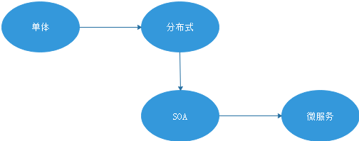

# 1. SpringBoot介绍

## 1.1 解决的问题

Spring的代码是轻量级的，但是Spring的配置是重量级的。

1. 项目的依赖较多，依赖关系也变得复杂
2. 核心配置文件配置会非常繁琐

## 1.2 原理

1. Spring通过**起步依赖**简化了项目依赖的复杂
2. Spring通过**自动配置**简化了核心配置文件的配置

**SpringBoot不是Spring的增强,而是简化了Spring的开发**

## 1.3 优点

简化了Spring应用的开发

# 2. SpringBoot入门

## 2.1 基本使用

* 配置文件

```xml
 <parent>
	<groupId>org.springframework.boot</groupId>
	<artifactId>spring-boot-starter-parent</artifactId>
	<version>1.4.0.RELEASE</version>
 </parent>
 <dependencies>
  <!--web启动器-->
	<dependency>
		<groupId>org.springframework.boot</groupId>
		<artifactId>spring-boot-starter-web</artifactId>
	</dependency>
	<!--开发工具依赖,包含热部署等-->
	<dependency>
		<groupId>org.springframework.boot</groupId>
		<artifactId>spring-boot-devtools</artifactId>
	</dependency>
 </dependencies>
```

* 程序的启动入口

```java
@SpringBootApplication
public class Application {
	public static void main(String[] args) {
		SpringApplication.run(Application.class, args);
	}
}
```

* 开发Controller

```java
@RestController
public class HelloWorldController {	
	@RequestMapping("/info")
	public String info(){
		//System.out.println("123");
		return "HelloWorld123!!"+env.getProperty("url");
	}
}
```

* 修改默认配置

  在```classpath```配置文件设置属性信息```application.properties```

```j  
server.port=8088
url=http://www.baidu.com 
```

* 在类中读取配置信息

```java
@Autowired
private Environment env;
```

## 2.2 整合ActiveMQ

* 配置文件

```xml
<!--activeMq启动器-->
<dependency>
	<groupId>org.springframework.boot</groupId>
	<artifactId>spring-boot-starter-activemq</artifactId>
</dependency>
```

* 发送消息

```java
@RestController
public class QueueController {

	@Autowired
	private JmsMessagingTemplate jmsMessagingTemplate;
	
	@RequestMapping("/send")
	public void send(String text){
		jmsMessagingTemplate.convertAndSend("itcast", text);
	}
	
	
	@RequestMapping("/sendmap")
	public void sendMap(){
		Map map=new HashMap<>();
		map.put("mobile", "13683391759");
		map.put("template_code", "SMS_86640114");
		map.put("sign_name","黑马");
		map.put("param", "{\"name\":\"小蔡\"}");
		
		jmsMessagingTemplate.convertAndSend("sms", map);
	}
}
```

* 接受消息

```java
@Component
public class Consumer {

	@JmsListener(destination="itcast")
	public void readMessage(String text){
		System.out.println("接收到消息:"+text);
	}
	
	@JmsListener(destination="sms")
	public void readMapMessage(Map map){
		System.out.println(map);		
	}
	
}
```

* 使用本地的中间件的配置

```tex
spring.activemq.broker-url=tcp://192.168.25.135:61616
```

# 3. 阿里大于

1. 申请短信签名
2. 申请模板
3. 创建accessKey
4. 下载SDK并安装到本地仓库
5. 使用Demo类进行测试

# 4. SpringBoot搭建短信微服务



作用：发送短信

```java
@Component
public class SmsListener {
	@Autowired
	private SmsUtil smsUtil;

	@JmsListener(destination="sms")
	public void sendSms(Map<String,String> map){
		/*SendSmsResponse response = smsUtil.sendSms(map.get("mobile"),
				map.get("template_code") ,
				map.get("sign_name")  , 
				map.get("param") );
		System.out.println("code:"+response.getCode());
		System.out.println("message:"+response.getMessage());*/

		System.out.println(map);
	}	
}
```

# 5. 用户注册

* HTML页面

```html
<input type="text"  ng-model="entity.username" placeholder="请输入你的用户名">
<input type="password" ng-model="entity.password" placeholder="设置登录密码">
<input type="password" ng-model="password" placeholder="再次确认密码">
<input type="text"  ng-model="entity.phone" placeholder="请输入你的手机号">
<input type="text" placeholder="短信验证码" ng-model="smscode">  
	
<a href="#" ng-click="sendCode()">获取短信验证码</a>
<a ng-click="reg()" target="_blank">完成注册</a>
```

* JS代码

```javascript
//注册用户
$scope.reg=function(){
	
	//比较两次输入的密码是否一致
	if($scope.password!=$scope.entity.password){
		alert("两次输入密码不一致，请重新输入");
		$scope.entity.password="";
		$scope.password="";
		return ;			
	}
	//新增
	userService.add($scope.entity,$scope.smscode).success(
		function(response){
			alert(response.message);
		}		
	);
}
```

* 后台Controller

```java
@Override
public void add(TbUser user) {
	
	user.setCreated(new Date());//用户注册时间
	user.setUpdated(new Date());//修改时间
	user.setSourceType("1");//注册来源
	user.setPassword(DigestUtils.md5Hex(user.getPassword()));//密码加密
	
	userMapper.insert(user);		
}
```

# 6. 短信验证码

## 6.1 发送验证码

* 前台

```javascript
//发送验证码
$scope.sendCode=function(){

    var reg_telephone = 
        new RegExp("^(13[09]|14[5|7]|15[0|1|2|3|5|6|7|8|9]|18[0|1|2|3|5|6|7|8|9])\\d{8}$");

	if($scope.entity.phone==null || $scope.entity.phone==""){
		alert("请填写手机号码");
		return ;
	}

	if(!reg_telephone.test($scope.entity.phone)){
		alert("手机号码不合法");
		return;
	}
	
	userService.sendCode($scope.entity.phone  ).success(
		function(response){
			alert(response.message);
		}
	);		
}
```

* 后台Controller

```java
@RequestMapping("/sendCode")
public Result sendCode(String phone){
	
	if(!PhoneFormatCheckUtils.isPhoneLegal(phone)){
		return new Result(false, "手机格式不正确");
	}
	
	try {
		userService.createSmsCode(phone);
		return new Result(true, "验证码发送成功");
	} catch (Exception e) {
		e.printStackTrace();
		return new Result(false, "验证码发送失败");
	}
}
```

* 后台服务层

```java
@Override
public void createSmsCode(final String phone) {
	//1.生成一个6位随机数（验证码）
	final String smscode=  (long)(Math.random()*1000000)+"";
	System.out.println("验证码："+smscode);
	
	//2.将验证码放入redis
	redisTemplate.boundHashOps("smscode").put(phone, smscode);
	//3.将短信内容发送给activeMQ
	
	jmsTemplate.send(smsDestination, new MessageCreator() {
		
		@Override
		public Message createMessage(Session session) throws JMSException {
			MapMessage message = session.createMapMessage();
			message.setString("mobile", phone);//手机号
			message.setString("template_code", template_code);//模板码
			message.setString("sign_name", sign_name);//签名
			Map map=new HashMap();
			map.put("number", smscode);				
			message.setString("param", JSON.toJSONString(map));
			return message;
		}
	});
}
```

* 短信微服务

```java
@Component
public class SmsListener {
	
	@Autowired
	private SmsUtil smsUtil;

	@JmsListener(destination="sms")
	public void sendSms(Map<String,String> map){

			/*SendSmsResponse response = smsUtil.sendSms(map.get("mobile"),
					map.get("template_code") ,
					map.get("sign_name")  , 
					map.get("param") );
			System.out.println("code:"+response.getCode());
			System.out.println("message:"+response.getMessage());*/

			System.out.println(map);
	}
	
}
```

## 6.2 校验验证码

* UserController

```java
@RequestMapping("/add")
public Result add(@RequestBody TbUser user,String smscode){
	
	//校验验证码是否正确
	boolean checkSmsCode = userService.checkSmsCode(user.getPhone(), smscode);
	if(!checkSmsCode){
		return new Result(false, "验证码不正确！");
	}
		
	try {
		userService.add(user);
		return new Result(true, "增加成功");
	} catch (Exception e) {
		e.printStackTrace();
		return new Result(false, "增加失败");
	}
}
```

* UserService

```java
public boolean checkSmsCode(String phone, String code) {
	 
	String systemcode= (String) redisTemplate.boundHashOps("smscode").get(phone);
	if(systemcode==null){
		return false;
	}
	if(!systemcode.equals(code)){
		return false;
	}
	
	return true;
}
```

