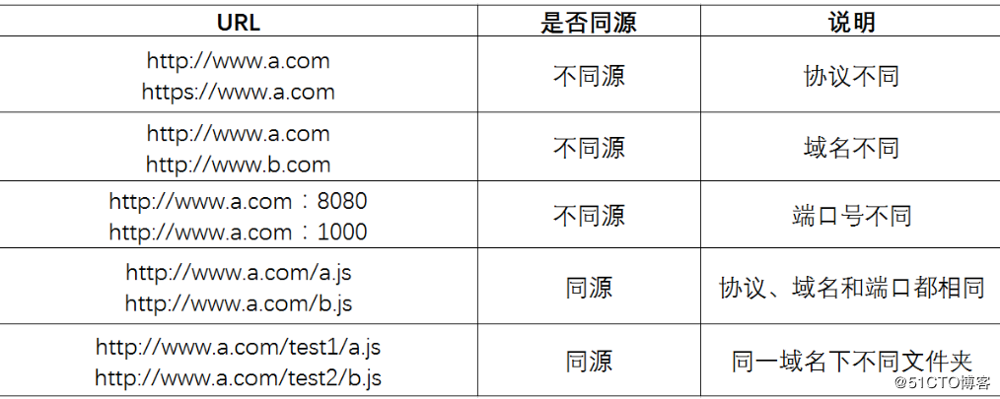

# 1. 页面跨域请求

## 1.1 浏览器同源策略

浏览器JS的ajax请求有同源限制，协议、端口或者域名不一样都属于非同源，默认是不可以跨域访问非同源服务器

	协议
	端口
	域名



## 1.2 跨域请求的解决方案

### 1.2.1 JSONP

```Javascript```创建```<script>```标签请求跨域服务器,通过回调函数接受服务器返回的数据

###1.2.2 CORS


#### 1.2.2.1 服务端编码

服务器端设置响应头允许客户端跨域请求

```java
//可以访问的域(当此方法不需要操作cookie)
response.setHeader("Access-Control-Allow-Origin", "http://localhost:9105");
//如果操作cookie，必须加上这句话
response.setHeader("Access-Control-Allow-Credentials", "true");
```

或者

```java
@CrossOrigin(origins="http://localhost:9105",allowCredentials ="true")
```

#### 1.2.2.2 客户端编码

```javascript
$http.get('http://localhost:9107/cart/addGoodsToCartList.do?itemId='
		+$scope.sku.id+'&num='+$scope.num ,{'withCredentials':true} ).success(
			function(response){
				if(response.success){
					location.href='http://localhost:9107/cart.html';						
				}else{
					alert(response.message);
				}					
			}						
);	
```


# 2. 结算页收获地址显示 

* 页面加载完毕后显示

```java
<body ng-app="pinyougou" ng-controller="cartController" ng-init="findAddressList()">
```

* Javascript

```java
$scope.findAddressList=function(){
	cartService.findAddressList().success(
		function(response){
			$scope.addressList=response;
			for(var i=0;i<$scope.addressList.length;i++){
				if($scope.addressList[i].isDefault=='1'){
					$scope.address=$scope.addressList[i];
					break;
				}					
			}
			
		}
	);		
}
```

* 页面遍历显示

```html
<div ng-repeat="address in addressList">
<div class="con name {{isSeletedAddress(address)?'selected':''}}">
  	<a href="javascript:;" ng-click="selectAddress(address)">{{address.contact}}</a>
</div>
<div class="con address">{{address.address}}<span>{{address.mobile}}</span>
	<span class="base" ng-if="address.isDefault=='1'">默认地址</span>
</div>
```

* 地址选择高亮

```javascript
//选择地址
$scope.selectAddress=function(address){
	$scope.address =address;		
}
//确定高亮
$scope.isSeletedAddress=function(address){
	if(address==$scope.address){
		return true;
	}else{
		return false;
	}		
}
```

# 3. 结算页支付方式选择

记录支付方式

* HTML

```html
<ul class="payType">
	<li class="selected" ng-click="selectPayType('1')">微信付款</li>
	<li ng-click="selectPayType('2')">货到付款</li>
</ul>
```

* JS

```javascript
$scope.order={paymentType:'1'};//订单对象

//选择支付类型
$scope.selectPayType=function(type){
	$scope.order.paymentType=type;
}
```

# 4. 结算页商品清单列表

* 页面加载完毕后显示商品清单

```html
<body ng-app="pinyougou" ng-controller="cartController" ng-init="findAddressList();findCartList()">

<div class="sendGoods" ng-repeat="cart in cartList">
	<ul class="yui3-g" ng-repeat="item in cart.orderItemList">
		<li class="yui3-u-1-6">
			<span></span>
		</li>
		<li class="yui3-u-7-12">
			<div class="desc">{{item.title}}</div>
			<div class="seven">7天无理由退货</div>
		</li>
		<li class="yui3-u-1-12">
			<div class="price">￥{{item.price}}</div>
		</li>
		<li class="yui3-u-1-12">
			<div class="num">X{{item.num}}</div>
		</li>
		<li class="yui3-u-1-12">
			<div class="exit">有货</div>
		</li>
	</ul>
</div>
```

# 5. 保存订单

## 5.1 雪花算法

* 解决的问题

  分布式系统中,数据库表分片后,生成全局唯一ID

* ID的二进制表示方式(64位)

  * 第1位:保留位,不使用
  * 后41位:时间戳
  * 后5位:数据中心ID(机房)
  * 后5位:机器ID(计算机)
  * 后12位:序列号

* 代码

  [github地址](https://github.com/souyunku/SnowFlake)

##5.2 代码实现

* HTML

```html
<a class="sui-btn btn-danger btn-xlarge" ng-click="submitOrder()" >提交订单</a>
```

* JS

```javascript
$scope.submitOrder=function(){
	$scope.order.receiverAreaName=$scope.address.address;//地址
	$scope.order.receiverMobile=$scope.address.mobile;//手机
	$scope.order.receiver=$scope.address.contact;//联系人
	
	cartService.submitOrder( $scope.order ).success(
		function(response){
			//alert(response.message);
			if(response.success){
				//页面跳转
				if($scope.order.paymentType=='1'){//如果是微信支付，跳转到支付页面
					location.href="pay.html";
				}else{//如果货到付款，跳转到提示页面
					location.href="paysuccess.html";
				}
				
			}else{
				alert(response.message);	//也可以跳转到提示页面				
			}
		}				
	);		
}
```

* Java

```java
//控制层
@RequestMapping("/add")
public Result add(@RequestBody TbOrder order){
	
	//获取当前登录人账号
	String username = SecurityContextHolder.getContext().getAuthentication().getName();
	order.setUserId(username);
	order.setSourceType("2");//订单来源  PC
	
	try {
		orderService.add(order);
		return new Result(true, "增加成功");
	} catch (Exception e) {
		e.printStackTrace();
		return new Result(false, "增加失败");
	}
}

//业务层
public void add(TbOrder order) {
	
	//1.从redis中提取购物车列表
	List<Cart> cartList= (List<Cart>) redisTemplate.boundHashOps("cartList").get(order.getUserId());
			
	//2.循环购物车列表添加订单
	for(Cart  cart:cartList){
		TbOrder tbOrder=new TbOrder();
		long orderId = idWorker.nextId();	//获取ID		
		tbOrder.setOrderId(orderId);
		tbOrder.setPaymentType(order.getPaymentType());//支付类型
		tbOrder.setStatus("1");//未付款 
		tbOrder.setCreateTime(new Date());//下单时间
		tbOrder.setUpdateTime(new Date());//更新时间
		tbOrder.setUserId(order.getUserId());//当前用户
		tbOrder.setReceiverAreaName(order.getReceiverAreaName());//收货人地址
		tbOrder.setReceiverMobile(order.getReceiverMobile());//收货人电话
		tbOrder.setReceiver(order.getReceiver());//收货人
		tbOrder.setSourceType(order.getSourceType());//订单来源
		tbOrder.setSellerId(cart.getSellerId());//商家ID
		
		double money=0;//合计数
		//循环购物车中每条明细记录
		for(TbOrderItem orderItem:cart.getOrderItemList()  ){
			orderItem.setId(idWorker.nextId());//主键
			orderItem.setOrderId(orderId);//订单编号
			orderItem.setSellerId(cart.getSellerId());//商家ID
			orderItemMapper.insert(orderItem);
			money+=orderItem.getTotalFee().doubleValue();
		}
		tbOrder.setPayment(new BigDecimal(money));//合计
		orderMapper.insert(tbOrder);
	}
	
	//3.清除redis中的购物车
	redisTemplate.boundHashOps("cartList").delete(order.getUserId());
}
```

