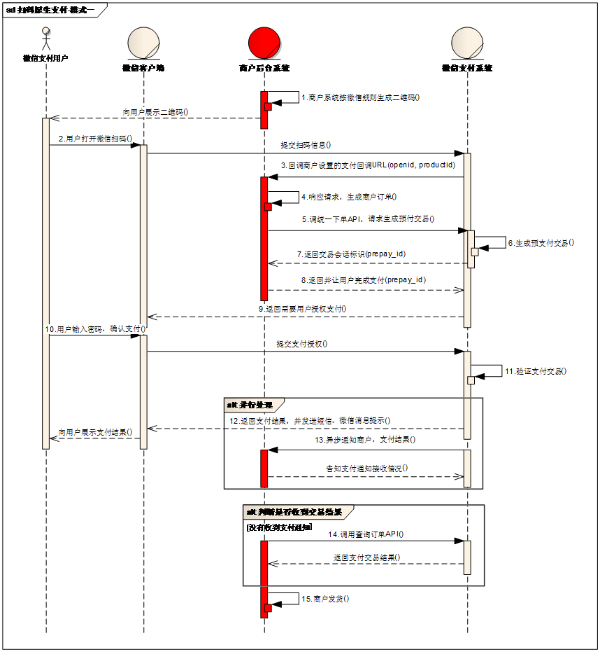

# 1. 二维码生成插件Qrious

## 1.1 二维码

二维码也称为二维条码，是指在一维条码的基础上扩展出另一维具有可读性的条码，使用黑白矩形图案表示二进制数据，被设备扫描后可获取其中所包含的信息。一维条码的宽度记载着数据，而其长度没有记载数据。二维条码的长度、宽度均记载着数据。


## 1.2 容错级别

| 等级   | 说明         |
| ---- | ---------- |
| L等级  | 7%的字码可被修正  |
| M等级  | 15%的字码可被修正 |
| Q等级  | 25%的字码可被修正 |
| H等级  | 30%的字码可被修正 |

## 1.2 Qrious使用

Qrious是前端的二维码插件。

* HTML

```html
<script src="qrious.js"></script>
<body>
    
</body>
```

* JS

```javascript
 var qr=new QRious({
	    element:document.getElementById('qrious'),
		size:250,
		value:'www.baidu.com',
		level:'H'
 });
```

# 2. 微信支付开发流程

## 2.1 扫码支付

* 模式一

  

  ```
  1. 商户按照规则生成二维码
  2. 用户扫码
  3. 微信调用商户服务器,商户生成订单
  4. 商户调用统一下单API,生成预支付交易
  5. 微信提示用户输入密码进行支付
  6. 微信给用户返回支付结果
  7. 微信异步通信商户通知支付结果
  ```

  应用场景:无人售货商店扫码支付

* 模式二

  

  ```
  1. 商户生成订单
  2. 商户调用统一下单API
  3. 微信返回二维码链接
  4. 商户根据连接生成二维码
  5. 用户扫码支付
  6. 微信提示用户输入密码进行支付
  7. 微信给用户返回支付结果
  8. 微信异步通信商户通知支付结果
  ```

  应用场景:PC应用扫码支付

## 2.2 接口信息

* 下单接口

```html
https://api.mch.weixin.qq.com/pay/unifiedorder
```

* 环境参数配置

```properties
appid=wx8397f8696b538317
partner=1473426802
partnerkey=T6m9iK73b0kn9g5v426MKfHQH7X8rKwb
notifyurl=http://a31ef7db.ngrok.io/WeChatPay/WeChatPayNotify
```

# 3. 显示支付码

* pay.html

```html
<body ng-app="pinyougou" ng-controller="payController" ng-init="createNative()">
    ...
    订单金额:{{money}}
    总金额:{{out_trade_no}}
</body>
```

* JS

```javascript
$scope.createNative=function(){
	payService.createNative().success(
		function(response){	
			//显示订单号和金额
			$scope.money= (response.total_fee/100).toFixed(2);
			$scope.out_trade_no=response.out_trade_no;
			
			//生成二维码
			 var qr=new QRious({
				    element:document.getElementById('qrious'),
					size:250,
					value:response.code_url,
					level:'H'
		     });
		}	
	);	
}
```

* 控制层

```java
@RequestMapping("/createNative")
public Map createNative(){
	IdWorker idworker=new IdWorker();
	return weixinPayService.createNative(idworker.nextId()+"","1");
}
```

* 服务层

```java
@Value("${appid}")
private String appid;

@Value("${partner}")
private String partner;

@Value("${partnerkey}")
private String partnerkey;

@Override
public Map createNative(String out_trade_no, String total_fee) {
	//1.参数封装
	Map param=new HashMap();
	param.put("appid", appid);//公众账号ID
	param.put("mch_id", partner);//商户
	param.put("nonce_str", WXPayUtil.generateNonceStr());//随机字符串
	param.put("body", "品优购");
	param.put("out_trade_no", out_trade_no);//交易订单号
	param.put("total_fee", total_fee);//金额（分）
	param.put("spbill_create_ip", "127.0.0.1");
	param.put("notify_url", "http://www.itcast.cn");
	param.put("trade_type", "NATIVE");//交易类型
		
	try {
		String xmlParam = WXPayUtil.generateSignedXml(param, partnerkey);
		System.out.println("请求的参数："+xmlParam);
		
		//2.发送请求			
		HttpClient httpClient=new HttpClient("https://api.mch.weixin.qq.com/pay/unifiedorder");
		httpClient.setHttps(true);
		httpClient.setXmlParam(xmlParam);
		httpClient.post();
		
		//3.获取结果
		String xmlResult = httpClient.getContent();
		
		Map<String, String> mapResult = WXPayUtil.xmlToMap(xmlResult);
		System.out.println("微信返回结果"+mapResult);
		Map map=new HashMap<>();
		map.put("code_url", mapResult.get("code_url"));//生成支付二维码的链接
		map.put("out_trade_no", out_trade_no);
		map.put("total_fee", total_fee);
		
		return map;
		
	} catch (Exception e) {
		// TODO Auto-generated catch block
		e.printStackTrace();
		return new HashMap();
	}
}
```

# 4. 查询支付状态

后台循环调用微信支付系统,查询订单支付状态,当支付成功后跳转到成功页面,当超时后,重新请求下单接口,生成新的支付二维码

* JS

```javascript
//发起支付请求
$scope.createNative=function(){
	payService.createNative().success(
		function(response){
			...
			queryPayStatus();//调用查询
		}	
	);	
}

//获得支付状态
queryPayStatus=function(){
	payService.queryPayStatus($scope.out_trade_no).success(
		function(response){
			if(response.success){
				location.href="paysuccess.html#?money="+$scope.money;
			}else{
				if(response.message=='二维码超时'){
					$scope.createNative();//重新生成二维码
				}else{
					location.href="payfail.html";
				}
			}				
		}		
	);		
}
```

* 后端控制层

```java
@RequestMapping("/queryPayStatus")
public Result queryPayStatus(String out_trade_no){
	Result result=null;
	int x=0;
	while(true){
		Map<String,String> map = weixinPayService.queryPayStatus(out_trade_no);//调用查询
		if(map==null){
			result=new Result(false, "支付发生错误");
			break;
		}
        
		if(map.get("trade_state").equals("SUCCESS")){//支付成功
			result=new Result(true, "支付成功");				
			break;
		}
		
		try {
			Thread.sleep(3000);
		} catch (InterruptedException e) {
			// TODO Auto-generated catch block
			e.printStackTrace();
		}
		
		x++;
		System.err.println("计时器:"+x);
		if(x>=100){				
			result=new Result(false, "二维码超时");
			break;				
		}
		
	}
	return result;
}
```

* 后端业务层

```java
@Override
public Map queryPayStatus(String out_trade_no) {
	//1.封装参数
	Map param=new HashMap();
	param.put("appid", appid);
	param.put("mch_id", partner);
	param.put("out_trade_no", out_trade_no);
	param.put("nonce_str", WXPayUtil.generateNonceStr());
	try {
		String xmlParam = WXPayUtil.generateSignedXml(param, partnerkey);
		//2.发送请求
		HttpClient httpClient=new HttpClient("https://api.mch.weixin.qq.com/pay/orderquery");
		httpClient.setHttps(true);
		httpClient.setXmlParam(xmlParam);
		httpClient.post();
		
		//3.获取结果
		String xmlResult = httpClient.getContent();
		Map<String, String> map = WXPayUtil.xmlToMap(xmlResult);
		System.out.println("调动查询API返回结果："+xmlResult);
		
		return map;
	} catch (Exception e) {
		// TODO Auto-generated catch block
		e.printStackTrace();
		return null;
	}
}
```

# 5. 记录支付日志

## 5.1 支付记录表

| Field          | Type                 | Comment |
| -------------- | -------------------- | ------- |
| out_trade_no   | varchar(30) NOT NULL | 支付订单号   |
| create_time    | datetime NULL        | 创建日期    |
| pay_time       | datetime NULL        | 支付完成时间  |
| total_fee      | bigint(20) NULL      | 支付金额（分） |
| user_id        | varchar(50) NULL     | 用户ID    |
| transaction_id | varchar(30) NULL     | 交易号码    |
| trade_state    | varchar(1) NULL      | 交易状态    |
| order_list     | varchar(200) NULL    | 订单编号列表  |
| pay_type       | varchar(1) NULL      | 支付类型    |

## 5.2 记录日志

支付日志的目的是记录用户支付的行为,当生成订单后就立即生成支付记录,并缓存到缓存中.

* 生成订单业务层

```java
public void add(TbOrder order) {
	
	//1.从redis中提取购物车列表
	List<Cart> cartList= (List<Cart>) redisTemplate.boundHashOps("cartList").get(order.getUserId());
	
	List<String> orderIdList=new ArrayList();//订单ID集合
	double total_money=0;//总金额
	//2.循环购物车列表添加订单
	for(Cart  cart:cartList){
		TbOrder tbOrder=new TbOrder();
		long orderId = idWorker.nextId();	//获取ID		
		tbOrder.setOrderId(orderId);
		tbOrder.setPaymentType(order.getPaymentType());//支付类型
		tbOrder.setStatus("1");//未付款 
		tbOrder.setCreateTime(new Date());//下单时间
		tbOrder.setUpdateTime(new Date());//更新时间
		tbOrder.setUserId(order.getUserId());//当前用户
		tbOrder.setReceiverAreaName(order.getReceiverAreaName());//收货人地址
		tbOrder.setReceiverMobile(order.getReceiverMobile());//收货人电话
		tbOrder.setReceiver(order.getReceiver());//收货人
		tbOrder.setSourceType(order.getSourceType());//订单来源
		tbOrder.setSellerId(order.getSellerId());//商家ID
		
		double money=0;//合计数
		//循环购物车中每条明细记录
		for(TbOrderItem orderItem:cart.getOrderItemList()  ){
			orderItem.setId(idWorker.nextId());//主键
			orderItem.setOrderId(orderId);//订单编号
			orderItem.setSellerId(cart.getSellerId());//商家ID
			orderItemMapper.insert(orderItem);				
			money+=orderItem.getTotalFee().doubleValue();
		}
		
		tbOrder.setPayment(new BigDecimal(money));//合计
		orderMapper.insert(tbOrder);
		
		orderIdList.add(orderId+"");
		total_money+=money;
	}
	
	//添加支付日志
	if("1".equals(order.getPaymentType())){
		TbPayLog payLog=new TbPayLog();
		
		payLog.setOutTradeNo(idWorker.nextId()+"");//支付订单号
		payLog.setCreateTime(new Date());
		payLog.setUserId(order.getUserId());//用户ID
		payLog.setOrderList(orderIdList.toString().replace("[", "").replace("]", ""));//订单ID串
		payLog.setTotalFee( (long)( total_money*100)   );//金额（分）
		payLog.setTradeState("0");//交易状态
		payLog.setPayType("1");//微信

      	payLogMapper.insert(payLog);			
		redisTemplate.boundHashOps("payLog").put(order.getUserId(), payLog);//放入缓存 
	}
	
	//3.清除redis中的购物车
	redisTemplate.boundHashOps("cartList").delete(order.getUserId());
}
```

* 改造下单支付控制层

```java
@RequestMapping("/createNative")
public Map createNative(){
	//1.获取当前登录用户
	String username = SecurityContextHolder.getContext().getAuthentication().getName();
	//2.提取支付日志（从缓存 ）
	TbPayLog payLog = orderService.searchPayLogFromRedis(username);
	//3.调用微信支付接口
	if(payLog!=null){
		return weixinPayService.createNative(payLog.getOutTradeNo(), payLog.getTotalFee()+"");		
	}else{
		return new HashMap<>();
	}		
}
```

## 5.3 支付完成

* 支付成功需要执行

```
1. 更新支付日志表
2. 更新订单状态
3. 删除缓存
```

* 查询订单支付状态

```java
if(map.get("trade_state").equals("SUCCESS")){//支付成功
	result=new Result(true, "支付成功");				
	orderService.updateOrderStatus(out_trade_no, map.get("transaction_id"));//修改订单状态
	break;
}
```

* 订单模块业务层

```java
public void updateOrderStatus(String out_trade_no, String transaction_id) {
	//1.修改支付日志的状态及相关字段
	TbPayLog payLog = payLogMapper.selectByPrimaryKey(out_trade_no);
	payLog.setPayTime(new Date());//支付时间
	payLog.setTradeState("1");//交易成功
	payLog.setTransactionId(transaction_id);//微信的交易流水号
	
	payLogMapper.updateByPrimaryKey(payLog);//修改
	
  	//2.修改订单表的状态
	String orderList = payLog.getOrderList();// 订单ID 串
	String[] orderIds = orderList.split(",");
	
	for(String orderId:orderIds){
		TbOrder order = orderMapper.selectByPrimaryKey(Long.valueOf(orderId));
		order.setStatus("2");//已付款状态
		order.setPaymentTime(new Date());//支付时间
		orderMapper.updateByPrimaryKey(order);			
	}
	
	//3.清除缓存中的payLog
	redisTemplate.boundHashOps("payLog").delete(payLog.getUserId());
}
```
