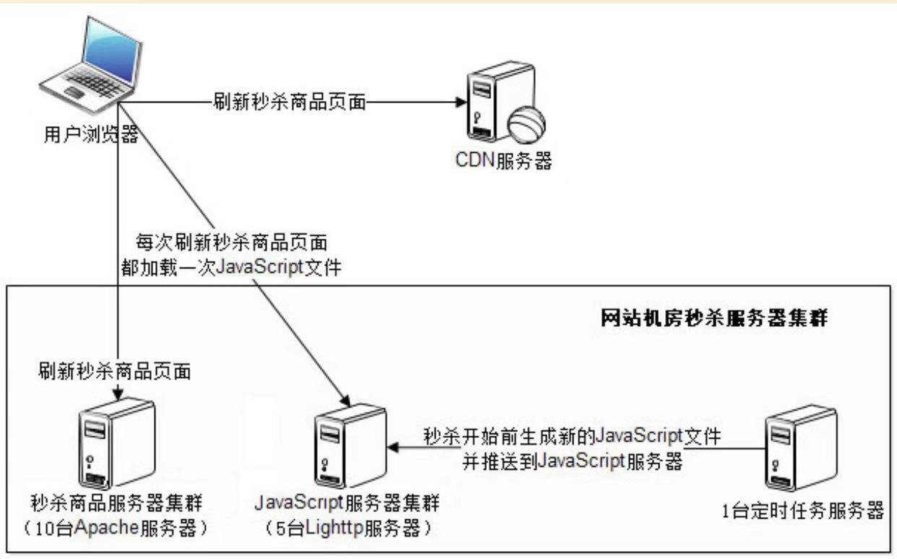
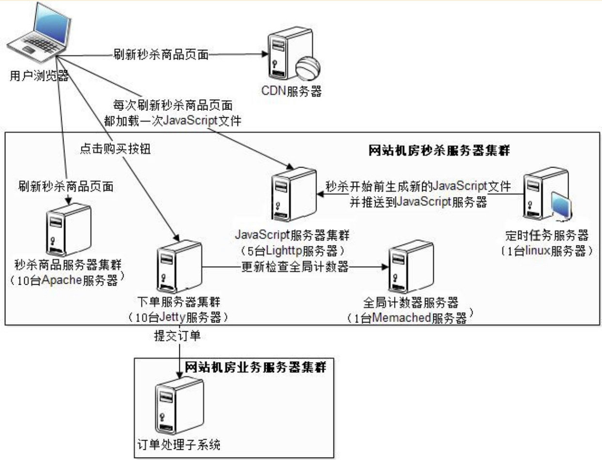

# 1. 技术挑战
1. 对现有网站的业务造成冲击
2. 应用服务器并发访问压力大
3. 高并发的请求给数据库的造成很大压力
4. 陡增的网络带宽
5. 防止秒杀开始前用户获得下单URL进行提前下单

# 2. 应对方案
1. 秒杀系统独立部署
2. 应用服务器搭建集群
3. 商品页面进行静态化处理,页面尽量简单，部署在静态Web服务器中,秒杀产生的订单数据保存在redis中。
4. 与网络运行商租借临时带宽
5. 动态生成随机下单的URL

# 3. 秒杀业务流程

1. 用户点击秒杀页面商品的【购买按钮】,进入秒杀商品详情页面
2. 用户点击商品详情页的【下单按钮】,进行商品秒杀

# 4. 秒杀业务中的问题

## 4.1 问题1

如何控制【购买按钮】在秒杀开始时才能点击？

在用户浏览器刷新秒杀商品页面时，秒杀商品页面通过每次都从JS文件服务器中加载新的JS文件，在该JS文件中控制【购买按钮】是否可用，JS文件的内容通过定时任务服务器生成，秒杀开始时推送新的JS文件，控制秒杀按钮可用。

## 4.2 问题2

如何控制只能让部分人抢到商品？

1. 搭建下单服务器集群，设置每台机器最多支持10个人下单成功！
2. 在用户在秒杀页面点击【购买按钮】后，请求下单服务器，下单服务器判断当前服务器的下单数目是否已满，如果数目已满就直接将页面跳转到下单结束页面,如果下单数目未满，跳转到商品详情页面，填写订单信息后点击【下单按钮】提交订单，下单服务器检查全局的数目是否已满，如果全局下单数目已满将页面跳转到结束页面，如果未满代表抢购成功，请求订单服务，完成订单数据的保存。
---
# 5. 总结

