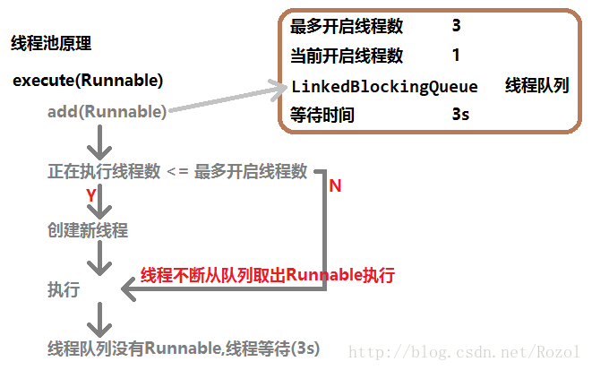

# 1. 线程创建的方式

1. 继承Thread类，重写run方法
2. 实现Runnable接口

使用第二种方式比较好，耦合度比较低。

```java
public class Test {
    public static void main(String[] args) {
        // 方式一: 继承Thread类
        run1();

        // 方式二: 重写Thread的run方法
        run2();

        // 方式三: 实现Runnable接口
        run3();

        // 方式四: 实现Runnable接口2
        run4();
    }


    /**
     * 方式一: 继承Thread类
     */
    private static void run1() {
        MyThreadClass thread1_1 = new MyThreadClass();
        MyThreadClass thread1_2 = new MyThreadClass("thread 1_2");

        thread1_1.setName("thread 1_1");

        thread1_1.start();
        thread1_2.start();      
    }

    /**
     * 方式二: 重写Thread的run方法
     */
    private static void run2() {
        new Thread("thread 2"){
            public void run() {
                for (int x = 0; x < 100; x++) {
                    System.out.println(Thread.currentThread().getName() + ": " + x);
                }
            };
        }.start();      
    }

    /**
     * 方式二: 实现Runnable接口
     */
    private static void run3() {
        Thread thread2_1 = new Thread(new MyRunnable());
        thread2_1.setName("thread 3_1");
        thread2_1.start();

        Thread thread2_2 = new Thread(new MyRunnable(), "thread 3_2");
        thread2_2.start();      
    }

    /**
     * 方式三: 实现Runnable接口2
     */
    private static void run4() {
        new Thread(new Runnable() {
            @Override
            public void run() {
                for (int x = 0; x < 100; x++) {
                    System.out.println(Thread.currentThread().getName() + ": " + x);
                }
            }
        }, "thread 4").start();     
    }
}
```

```java
public class MyThreadClass extends Thread{

    public MyThreadClass(){};

    public MyThreadClass(String name){
        super(name);
    };

    @Override
    public void run(){ //继承Thread类并重写run()方法
        for(int x = 0; x < 100; x++){
            //public final String getName(); //返回该线程的名称
            System.out.println(getName() + ": " + x);
        }
    }
}
```

```java
public class MyRunnable implements Runnable{
    @Override
    public void run() {
        for (int x = 0; x < 100; x++) {
            //public static Thread currenthread(); //返回对当前正在执行的线程对象的引用
            System.out.println(Thread.currentThread().getName() + ": " + x);
        }
    }
}
```

# 2. 线程的同步锁

```java
/**
 * 同步锁的几种实现放方式
 * 区别: 
 *      Synchronized: 采用CPU悲观锁机制(JVM执行), 线程是独占的, 当很多线程进程锁时会引起CPU频繁切换而影响性能
 *      Lock: java写的乐观锁, 每次不加锁假设没有冲突去执行, 如果发生冲突则重试
 * @author Luzhuo
 */
public class Test {
    public static void main(String[] args) {
        // 方式1: 同步代码块
        SynchronizedBlock block = new SynchronizedBlock();

        Thread thread1_1 = new Thread(block, "1号窗口");
        Thread thread1_2 = new Thread(block, "2号窗口");

        thread1_1.start();
        thread1_2.start();

        // 方式2: 同步方法
        SynchronizedMethod method = new SynchronizedMethod();

        Thread thread2_1 = new Thread(method, "1号窗口");
        Thread thread2_2 = new Thread(method, "2号窗口");

        thread2_1.start();
        thread2_2.start();

        // 方式3: 静态同步方法
        SynchronizedStaticMethod staticMethod = new SynchronizedStaticMethod();

        Thread thread3_1 = new Thread(staticMethod, "1号窗口");
        Thread thread3_2 = new Thread(staticMethod, "2号窗口");

        thread3_1.start();
        thread3_2.start();

        // 方式4: Lock锁
        LockBlock lockBlock = new LockBlock();

        Thread thread4_1 = new Thread(lockBlock, "1号窗口");
        Thread thread4_2 = new Thread(lockBlock, "2号窗口");

        thread4_1.start();
        thread4_2.start();

        // ==========================================================

        // 数据安全访问的几种方式
        DataSecurity data = new DataSecurity();

        Thread thread5_1 = new Thread(data, "thread 1");
        Thread thread5_2 = new Thread(data, "thread 2");

        thread5_1.start();
        thread5_2.start();
    }
}
```

```java
/**
 * 同步代码块
 * @author Luzhuo
 */
public class SynchronizedBlock implements Runnable{
    private static int x = 100; // 票的数量
    private Object obj = new Object();

    @Override
    public void run() {
        while (true) {
            syncBlock();
        }
    }

    /**
     * 方式1: 同步代码块, 锁对象:任意对象
     */
    public void syncBlock() {
        // synchronized代码同步锁
        synchronized (obj) { // 锁对象是new Object(); 
            if (x > 0) {
                try {
                    // public static void sleep(long millis); // 以指定毫秒数内暂停线程
                    Thread.sleep(10);
                } catch (InterruptedException e) {
                    e.printStackTrace();
                }
                System.out.println(Thread.currentThread().getName() + "正在出售第 " + (x--) + " 张票");
            }
        }
    }
}
```

```java
/**
 * 同步方法
 * @author Luzhuo
 */
public class SynchronizedMethod implements Runnable{
    private static int x = 100; // 票的数量

    @Override
    public void run() {
        while(true){
            syncMethod();
        }
    }

    /**
     * 方式2: 同步方法: 锁对象:this
     */
    private synchronized void syncMethod() {  //锁对象是 this
        if (x > 0) {
            try {
                Thread.sleep(10);
            } catch (InterruptedException e) {
                e.printStackTrace();
            }
            System.out.println(Thread.currentThread().getName() + "正在出售第 " + (x--) + " 张票");
        }
    }
}
```

```java
/**
 * 静态同步方法
 * @author Luzhuo
 *
 */
public class SynchronizedStaticMethod implements Runnable{
    private static int x = 100; // 票的数量

    @Override
    public void run() {
        while(true){
            syncStaticMethod();
        }
    }

    /**
     * 方式3: 静态同步方法: 锁对象: 类.class 字节码文件对象
     */
    private static synchronized void syncStaticMethod(){ //锁对象是 Ticket.class
        if (x > 0) {
            try {
                Thread.sleep(10);
            } catch (InterruptedException e) {
                e.printStackTrace();
            }
            System.out.println(Thread.currentThread().getName() + "正在出售第 " + (x--) + " 张票");
        }
    }
}
```

## 2.1 解决问题

多线程操作共享变量时，保证线程安全，将线程的并发执行改为串行化。

## 2.2 实现方式

### 2.2.1 Synchronized 

锁对象的区别：

```
同步代码块：添加锁的时候，锁对象可以是任意的对象，但是要保证多个线程间使用的是统一把锁
方法上：当前的锁对象是this(对象本身)
静态方法：类.class字节码文件对象
```

### 2.2.2 Lock

优点：

```
1. 相比Synchronized更加的灵活
2. 实现非阻塞锁
3. 实现超时锁
```

Lock底层的实现机制

```
volatile+Cas算法
volatile作用：保证共享变量在多个线程间的可见性；不能保证共享变量的原子性操作。
Cas算法作用：保证写操作的原子性。
```

```java
/**
 * Lock是Java5之后加入的
 * @author Luzhuo
 */
public class LockBlock implements Runnable{
    private int x = 100; // 票的数量

    @Override
    public void run() {
        while (true) {
            lockBlock();
        }
    }

    // 定义一个锁对象
    private final Lock lock = new ReentrantLock();

    /**
     * 方式4: Lock锁代码块
     */
    public void lockBlock() {
        // void lock(); //获取锁
        lock.lock();

        try{

            if (x > 0) {
                try {
                    Thread.sleep(10);
                } catch (InterruptedException e) {
                    e.printStackTrace();
                }
                System.out.println(Thread.currentThread().getName() + "正在出售第 " + (x--) + " 张票");
            }

        }finally {
            // void unlock(); //释放锁
            lock.unlock();
        }
    }
}
```

# 3. 死锁

条件

```
1.2个线程，都要获得2把锁
2.线程1持有锁A，想要获得锁B
3.线程2持有锁B，想要获得锁A

结果：2个线程同时持有对象想要获得的锁，并且互不相让。
```

解决方案：重启。

避免：同一个线程尽量不要获得2个锁。

```java
/**
 * 死锁的案例
 * 死锁的产生: 线程1拿着objA的锁去获取objB的锁, 线程2拿着objB的锁去获取objA的锁, 两者互不相让就产生了死锁
 * @author Luzhuo
 */
public class 死锁{
    public static void main(String[] args) {
        死锁.DieLock d1 = new 死锁.DieLock(true);
        死锁.DieLock d2 = new 死锁.DieLock(false);
        d1.start();
        d2.start();
    }

    public static class DieLock extends Thread{
        private boolean flag;

        public DieLock(boolean flag){
            this.flag = flag;
        }

        public void run() {
            if(flag){
                while(true){
                    synchronized (Mylock.objA) {
                        System.out.println("if objA");
                        synchronized (Mylock.objB) {
                            System.out.println("if objB");
                        }
                    }
                }
            }else{
                while(true){
                    synchronized (Mylock.objB) {
                        System.out.println("else objB");
                        synchronized (Mylock.objA) {
                            System.out.println("else objA");
                        }
                    }
                }
            }
            // 执行结果:
            // if objA -> if objA -> if objA -> else objB -> 死锁
            // else objB -> else objB -> else objB -> if objA -> 死锁
            // if objA -> else objB -> 死锁
        }
    }

    public static class Mylock {
        public static final Object objA = new Object();
        public static final Object objB = new Object();
    }
}
```

# 4. 线程安全的数据访问

```java
/**
 * 多线程下数据安全访问的几种方式(第3,4个线程安全, 第1,2个线程不安全)
 * 以下方式中, 只有 synchronized 能保证数据访问安全
 * @author Luzhuo
 */
public class DataSecurity implements Runnable{
    private static int num1 = 100;
    /**
     * 数据访问不安全
     * 由于子线程修改数据后, 可能不去及时更新主线程数据, 而去继续执行其他操作
     * @return
     */
    public int getNum1(){
        return num1--;
    }


    private static volatile int num2 = 100;
    /**
     * 数据访问不安全;
     * volatile[ˈvɑ:lətl] 原解释: 保证修改的值会立即被更新到主内存,当其他线程读取时,会去主内存中读取最新值
     * 实际情况: 由于线程1修改数据时, 若线程2拿到的是旧数据, 那么线程2修改的数据将无效, 所以无法保证数据安全
     */
    public int getNum2(){
        return num2--;
    }

    private static int num3 = 100;
    /**
     * 数据访问安全
     * 锁的机制保证了该数据只有一个线程在修改
     * @return
     */
    public synchronized int getNum3(){
        num3--;
        return num3;
    }


    private AtomicInteger num4 = new AtomicInteger(100);
    /**
     * 数据访问安全
     * 使用Java自定的线程安全封装类
     * @return
     */
    public int getNum4(){
        return num4.getAndDecrement();
    }

    @Override
    public void run() {
        int number = Integer.MAX_VALUE;

        while(number > 0){
            try {

                Thread.sleep(10);
//              number = getNum1(); // 原始方式
//              number = getNum2(); // volatile 关键词
//              number = getNum3(); // synchronized 锁机制
                number = getNum4(); // Java线程安全封装类
                System.out.println(Thread.currentThread().getName() + ": " + number);

            } catch (InterruptedException e) {
                e.printStackTrace();
            }
        }
    }
}
```

## 4.1 条件

```
1. 存在共享变量
2. 多个线程同时进行写操作
```

## 4.2 解决方案

```
1.使用Synchronized
2.使用Lock
3.将普通的变量改为使用JDK中提供的原子类进行操作
```

# 5. 线程的等待唤醒机制

等待唤醒机制可以实现不同线程间的通信（数据交互）。

```
1. 多个线程共享同一把锁
2. 线程等待的方法锁对象.wait();
3. 线程唤醒的方法所对象.notify();
4. notify和notifyAll，前者是随机唤醒一个线程，后者是唤醒当前锁上的所有线程
```

## 5.1 Synchronized

```
锁对象.wait();	//等待
锁对象.notify();	//随机唤醒一个线程
锁对象.notifyAll()	//唤醒所有线程
```

```java
/**
 * 多线程的等待唤醒机制
 * wait: 当前线程等待,会释放锁; notify/notifyAll: 唤醒其他线程
 * @author Luzhuo
 */
public class 等待唤醒机制 {
    public static void main(String[] args) {
        Bean bean = new Bean();

        SetThread st = new SetThread(bean);
        GetThread gt = new GetThread(bean);
        Thread t1 = new Thread(st, "setData");
        Thread t2 = new Thread(gt, "getData");

        t1.start();
        t2.start();
    }

    /**
     * Bean
     * @author Luzhuo
     */
    public static class Bean {
        public int number = 0;
        public boolean flag = false;
    }

    public static class SetThread implements Runnable {
        private Bean mBean;
        private int count = 0;

        public SetThread(Bean bean) {
            this.mBean = bean;
        }

        @Override
        public void run() {
            while (true) {
                synchronized (mBean) {
                    try{
                        Thread.sleep(10);

                        if (mBean.flag) { // bean = true 则等待
                            // public final void wait(); // 当前线程等待
                            mBean.wait(); // wait和notify必须在同步代码块中使用, 因为在执行这两个方法之前要先获得锁
                        }

                        // 设置值
                        mBean.number = count;
                        System.out.println(Thread.currentThread().getName() + ": " + count);
                        count++;

                        mBean.flag = true;
                        // public final void notify(); // 唤醒对象监视器上等待的单个线程
                        mBean.notify(); // 唤醒一个等待该锁的线程, 然后继续执行完锁定区, 再释放锁

                    } catch (InterruptedException e) {
                        e.printStackTrace();
                    }
                }
            }
        }
    }

    public static class GetThread implements Runnable{
        private Bean mBean;

        public GetThread(Bean bean){
            this.mBean = bean;
        }

        @Override
        public void run(){
            while(true){
                synchronized (mBean) {
                    try{
                        Thread.sleep(10);

                        if(!mBean.flag) { // flag = false
                            mBean.wait(); // 等待会释放锁对象
                        }

                        System.out.println(Thread.currentThread().getName() + ": " + mBean.number);
                        mBean.flag = false;
                        mBean.notify();

                    } catch (InterruptedException e) {
                        e.printStackTrace();
                    }
                }
            }
        }
    }
}
```

## 5.2 Lock

```
Condition condition = lock.newCondition();	//获得condition
condition.await();	//等待
condition.signal();	//随机唤醒一个线程
condition.signalAll();	//唤醒所有线程
```

```java
/**
 * 案例: 生产者-消费者(等待唤醒机制 使用Lock的案例)
 * 一边生产一边消费
 * @author Luzhuo
 */
public class 生产者消费者Lock {
    public static void main(String[] args) {
        Resource resorce = new Resource(); // 资源
        new Thread(new Producer(resorce)).start(); // 生产者
        new Thread(new Consumer(resorce)).start();; // 消费者
    }

    private static class Resource {
        private String[] datas = new String[1];
        // jdk 1.5 之后的锁, 替代 synchronized 代码块  // jdk1.5之后的监视器, Condition 替代  Object 的等待和唤醒机制 （1个Lock下拥有多个Condition对象）
        private final Lock lock = new ReentrantLock();
        // 创建锁下的监视器对象 (生产者)
        Condition pro = lock.newCondition();
        // 创建锁下的监视器对象 (消费者)
        Condition con = lock.newCondition();

        public void save(String data){
            lock.lock(); // 获取锁

            try{
                Thread.sleep(10);

                while(datas[0] != null){
                    // 等待-生产者
                    pro.await();
                }

                datas[0] = data;   
                System.out.println(Thread.currentThread().getName() + "Resource:save:" + datas[0]);
                // 唤醒-消费者
                con.signal();

            } catch (InterruptedException e) {
                e.printStackTrace();
            } finally {
                lock.unlock(); // 释放锁
            }
        }

        //需要提供从容器中取出商品的方法
        public void get(){
            lock.lock();

            try{
                Thread.sleep(10);

                while(datas[0] == null){
                    con.await(); // 等待-消费者
                }

                System.out.println(Thread.currentThread().getName() + "Resource:get:" + datas[0]);
                datas[0] = null;

                pro.signal(); // 唤醒-生产者

            }catch (InterruptedException e) {
                e.printStackTrace();
            }finally{
                lock.unlock();
            }

        }
    }

    /**
     * 生产者
     */
    private static class Producer implements Runnable  {    //给生产者生产商品进行编号
        private int num = 1;
        private Resource resource ;
        Producer(Resource resource){
            this.resource = resource;
        }

        public void run(){
            while(true){ resource.save("data:" + num++); }
        }
    }

    /**
     * 消费者
     */
    private static class Consumer implements Runnable{
        private Resource resource ;
        Consumer(Resource resource){
            this.resource = resource;
        }

        public void run(){
            while(true){ resource.get(); }
        }
    }
}
```

# 6. 线程池

线程的创建开销资源，为了提高使用线程的效率，可以将线程对象提前创建出来放置在线程池中。

使用的时候可以从线程池中获取，使用完毕后归还到线程池。这样就可以避免创建线程和销毁线程的资源开销。

线程池的几种创建方式

```
1. 线程池无限大(核心: 0, 最大: Integer.MAX_VALUE)
ExecutorService threadpool = Executors.newCachedThreadPool();
2. 限制线程池大小(x, x), 超过线程池数量限制的任务将加入等待队列
ExecutorService threadpool = Executors.newFixedThreadPool(3);
3. 单线程池
ExecutorService threadpool = Executors.newSingleThreadExecutor(); 
```

```
 // 周期性线程池(x, Integer.MAX_VALUE)
 ScheduledExecutorService scheduledThreadPool = Executors.newScheduledThreadPool(5);
 // 延迟执行
 for(int i = 0; i < 10; i++){
     scheduledThreadPool.schedule(new Runnable() {  
         public void run() {  
             try {
                 System.out.println(Thread.currentThread().getName());

                 Thread.sleep(100);
             } catch (InterruptedException e) {
                 e.printStackTrace();
             }                   
         }  
      }, 3, TimeUnit.SECONDS);  // 延迟3秒后去执行
 }
```

```
ScheduledExecutorService scheduledThreadPool = Executors.newScheduledThreadPool(5);
// 周期执行
for(int i = 0; i < 10; i++){
    scheduledThreadPool.scheduleAtFixedRate(new Runnable() {  
        public void run() {  
            try {
                System.out.println(Thread.currentThread().getName());

                Thread.sleep(100);
            } catch (InterruptedException e) {
                e.printStackTrace();
            }    
        }
    }, 1, 3, TimeUnit.SECONDS); // 延迟1秒后去执行, 每3秒为一个周期去执行
}
```

## 6.1 自定义线程池

```java
/**
 * 线程池原理
 * 最多开启maxCount个线程, 未处理的任务都放到LinkedBlockingQueue集合里, 当线程执行完会从LinkedBlockingQueue集合里取出新任务继续执行
 * @author Luzhuo
 */
public class ThreadPool {
    int maxCount = 3; // 最多开启多少个线程
    private final AtomicInteger count = new AtomicInteger(0); // 当前开的线程数   AtomicInteger:线程同步的Integer
    private final BlockingQueue<Runnable> runnables = new LinkedBlockingQueue<Runnable>(); // LinkedBlockingQueue:链式阻塞队列(线程安全); 在Java源码的线程池中, 使用的是SynchronousQueue来存储任务

    /**
     * 执行线程
     * @param runnable
     */
    public void execute(Runnable runnable){
        runnables.add(runnable);
        if(count.incrementAndGet() <= maxCount){
            createThread();
        }
    }

    /**
     * 创建线程
     */
    private void createThread(){
        new Thread(){
            @Override
            public void run() {
                while(true){
                    if(runnables.size() > 0){
                        Runnable remove = runnables.remove(); // 取出一个异步任务
                        if(remove != null){
                            remove.run();
                        }
                    }else return;
                }
            }
        }.start();
    }
}
```

```java
public class Test {
    public static void main(String[] args) {
        // 自定义线程池ThreadPool
        threadPool();
    }

    /**
     * 自定义线程池ThreadPool
     */
    private static void threadPool() {
        ThreadPool threadPool = new ThreadPool();
        for (int i = 0; i < 10; i++) {
            threadPool.execute(new Runnable() {
                @Override
                public void run() {
                    while(true){
                        try {
                            Thread.sleep(10);
                            System.out.println(Thread.currentThread().getName());
                        } catch (InterruptedException e) {
                            e.printStackTrace();
                        }
                    }
                }
            });
        }
    }
}
```



## 6.2 JDK线程池 

```java
/**
 * Java自带线程池的使用
 * @author Luzhuo
 */
public class Test {
    public static void main(String[] args) {
        // 线程池无限大(核心: 0, 最大: Integer.MAX_VALUE)
        ExecutorService threadpool = Executors.newCachedThreadPool();

        // 限制线程池大小(x, x), 超过线程池数量限制的任务将加入等待队列
        threadpool = Executors.newFixedThreadPool(3); // 获取逻辑处理器数: Runtime.getRuntime().availableProcessors();

        // 单线程池(1, 1)
        threadpool = Executors.newSingleThreadExecutor(); 

        for(int i = 0; i < 10; i++){ // 执行10个任务
            run(threadpool);
        }

        // 周期性线程池(x, Integer.MAX_VALUE)
        ScheduledExecutorService scheduledThreadPool = Executors.newScheduledThreadPool(5);
        // 延迟执行
        for(int i = 0; i < 10; i++){
            scheduledThreadPool.schedule(new Runnable() {  
                public void run() {  
                    try {
                        System.out.println(Thread.currentThread().getName());

                        Thread.sleep(100);
                    } catch (InterruptedException e) {
                        e.printStackTrace();
                    }                   
                }  
             }, 3, TimeUnit.SECONDS);  // 延迟3秒后去执行
        }

        // 周期执行
        for(int i = 0; i < 10; i++){
            scheduledThreadPool.scheduleAtFixedRate(new Runnable() {  
                public void run() {  
                    try {
                        System.out.println(Thread.currentThread().getName());

                        Thread.sleep(100);
                    } catch (InterruptedException e) {
                        e.printStackTrace();
                    }    
                }
            }, 1, 3, TimeUnit.SECONDS); // 延迟1秒后去执行, 每3秒为一个周期去执行
        }
    }

    private static void run(ExecutorService executorService){
        executorService.execute(new Runnable() {
            @Override
            public void run() {
                try {
                    Thread.sleep(10);

                    System.out.println(Thread.currentThread().getName());

                } catch (InterruptedException e) {
                    e.printStackTrace();
                }
            }
        });
    }
}
```

