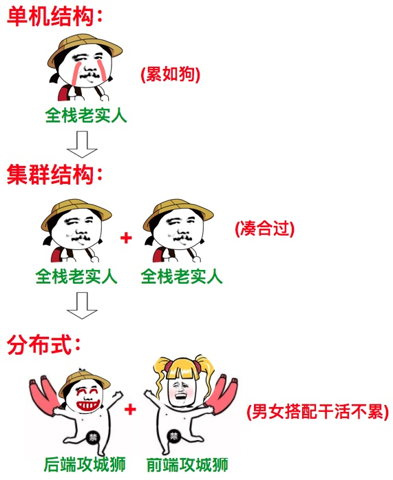
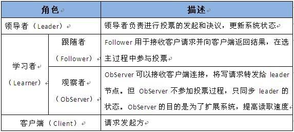
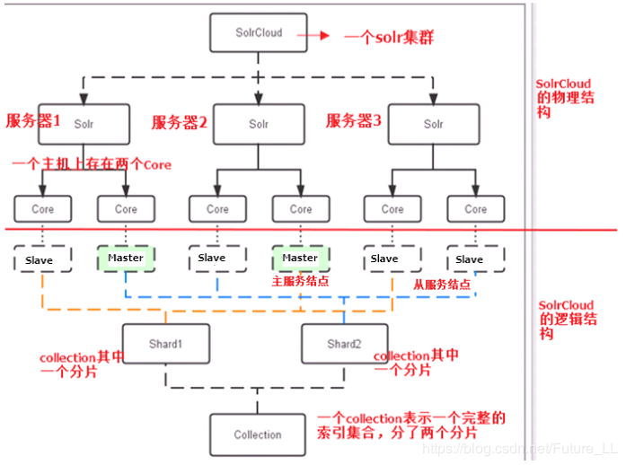
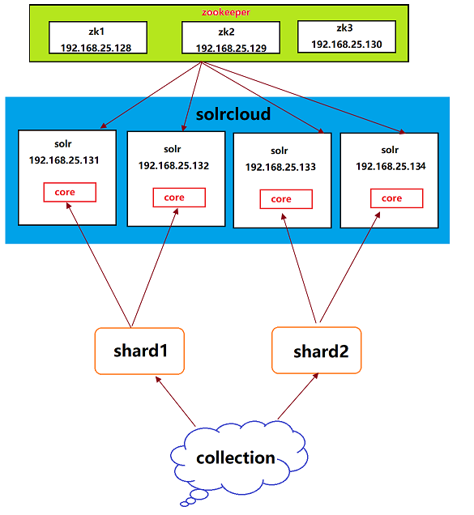
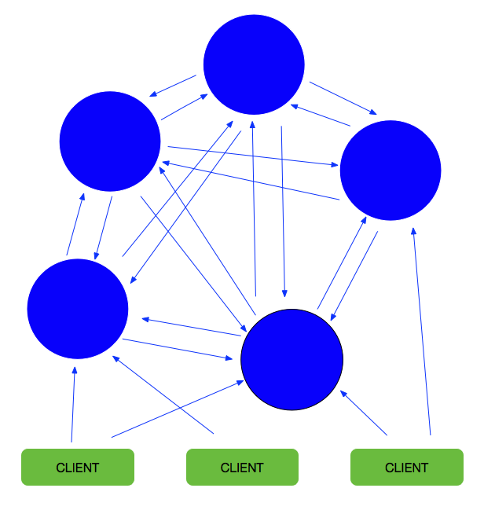
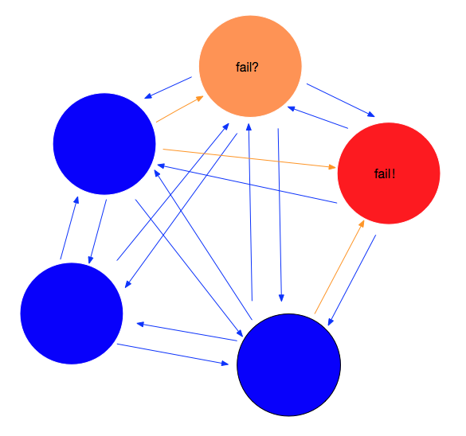

# 1. 集群和分布式的区别

## 1.1 集群

各节点执行相同的任务

优点:

1. 负载均衡
2. 高可用
3. 存储扩容

## 1.2 分布式

各节点执行的任务不同



# 2. ZooKeeper集群


## 2.1 角色分类




## 2.2 选举原则

基于Paxos。

```tex
超过半数节点启动
谁大谁就是leader
选举结果必须超过半数节点认同才是有效的
leader不会退位
```

## 2.3 异常测试

* 超过半数节点启动集群才正常
* 从服务器挂掉,集群正常(节点的数量大于半数)
* 主服务器挂掉,集群正常,其他从节点重新进行选举

## 2.4 客户端连接

```java
<dubbo:registry
	protocol="zookeeper"
	address="192.168.25.140:2181,192.168.25.140:2182,192.168.25.140:2183">
</dubbo:registry>
```

# 3. Solr集群



## 3.1 特点

1. 查询时自动负载均衡
2. 集中式的配置信息
3. 自动容错
4. 近实时搜索


## 3.2 与ZK关系

1. Zookeeper确定solr集群中节点的主从关系,solr提供数据查询
2. 配置文件统一管理



## 3.3 步骤

1. 上传solr-Tomcat和solrhome
2. 在solr应用的web.xml中指定solrhome的位置
3. 修改Tomcat的端口号(伪集群)
4. 在Tomcat的启动文件中配置zookeeper的地址
5. 在solrhome/solr.xml中配置solr服务器的ip和端口
6. 将solr的conf文件夹上传到zookeeper中
7. 启动每个Tomcat

## 3.4 客户端连接

```java
<bean id="solrServer" class="org.apache.solr.client.solrj.impl.CloudSolrServer">
	<constructor-arg
		value="192.168.25.140:2181,192.168.25.140:2182,192.168.25.140:2183" />
	<property name="defaultCollection" value="collection1"></property>
</bean>
```

# 4. Redis集群



## 4.1 优点

* 可以提供更大的存储空间


* 可以数据的高可用



## 4.2 名词解释

乒乓机制：节点间通讯的一种方式

投票机制：确定集群中某个节点状态是否正常

槽机制：确定数据存储到哪个节点

## 4.3 特点

* 无中心化
* 根据key计算对应的槽点(0-16383)决定数据存储的节点,从而实现数据的分片(分布式存储)
* 集群自主决定主从节点

例如6个节点1,2,3,4,5,6

| 主    | 从    |
| :--- | :--- |
| 1    | 4    |
| 2    | 5    |
| 3    | 6    |

## 4.4 客户端连接

```java
<!--集群配置-->
<bean id="redis-clusterConfiguration"
	class="org.springframework.data.redis.connection.redis-clusterConfiguration">
	<property name="maxRedirects" value="${redis.maxRedirects}"></property>
	<property name="clusterNodes">
        <set>
        	<bean class="org.springframework.data.redis.connection.redis-clusterNode">
        		<constructor-arg name="host" value="${redis.host1}"></constructor-arg>
        		<constructor-arg name="port" value="${redis.port1}"></constructor-arg>
        	</bean>
            <bean class="org.springframework.data.redis.connection.redis-clusterNode">
                <constructor-arg name="host" value="${redis.host2}"></constructor-arg>
                <constructor-arg name="port" value="${redis.port2}"></constructor-arg>
            </bean>
            <bean class="org.springframework.data.redis.connection.redis-clusterNode">
                <constructor-arg name="host" value="${redis.host3}"></constructor-arg>
                <constructor-arg name="port" value="${redis.port3}"></constructor-arg>
            </bean>

            <bean class="org.springframework.data.redis.connection.redis-clusterNode">
                <constructor-arg name="host" value="${redis.host4}"></constructor-arg>
                <constructor-arg name="port" value="${redis.port4}"></constructor-arg>
            </bean>
            <bean class="org.springframework.data.redis.connection.redis-clusterNode">
                <constructor-arg name="host" value="${redis.host5}"></constructor-arg>
                <constructor-arg name="port" value="${redis.port5}"></constructor-arg>
            </bean>
            <bean class="org.springframework.data.redis.connection.redis-clusterNode">
                <constructor-arg name="host" value="${redis.host6}"></constructor-arg>
                <constructor-arg name="port" value="${redis.port6}"></constructor-arg>
            </bean>
        </set>
	</property>
</bean>

<!--连接池配置-->
<bean id="jedisPoolConfig" class="redis.clients.jedis.JedisPoolConfig">
    <property name="maxIdle" value="${redis.maxIdle}" />
    <property name="maxTotal" value="${redis.maxTotal}" />
</bean>

<!--连接工厂-->
<bean id="jeidsConnectionFactory"
	class="org.springframework.data.redis.connection.jedis.JedisConnectionFactory" >
		<constructor-arg ref="redis-clusterConfiguration" />
		<constructor-arg ref="jedisPoolConfig" />
</bean>

<!--连接模板-->
<bean id="redisTemplate" class="org.springframework.data.redis.core.RedisTemplate">
	<property name="connectionFactory" ref="jeidsConnectionFactory" />
</bean>
```

