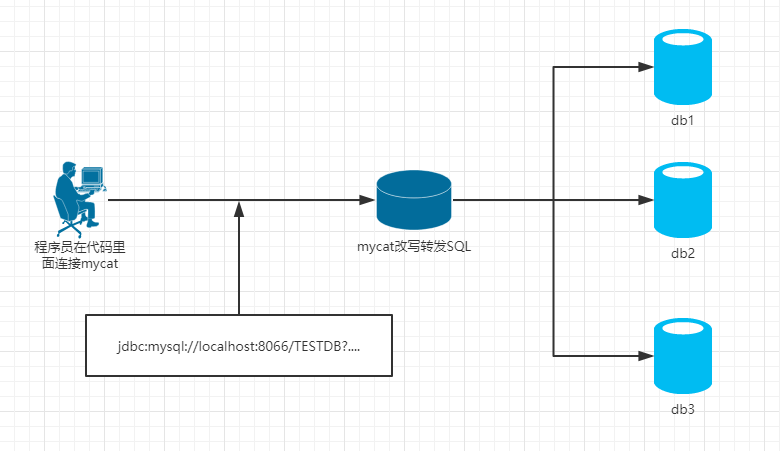
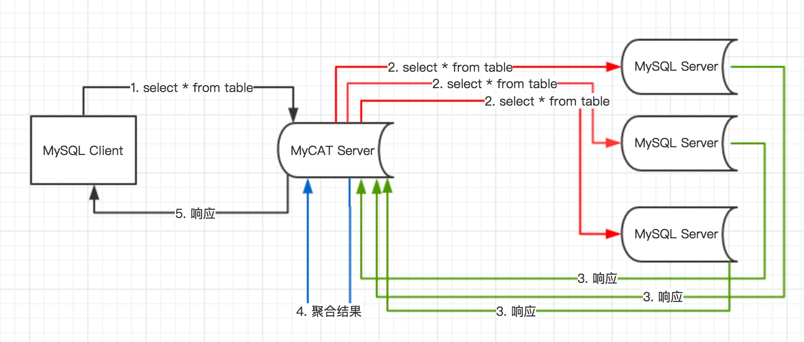
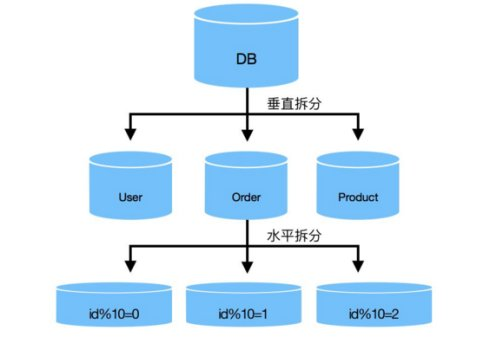
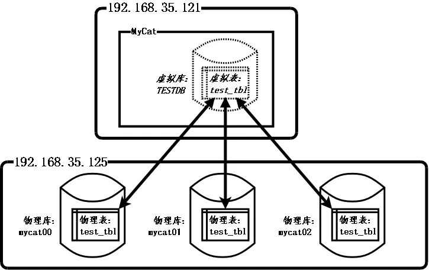
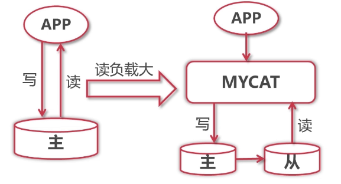
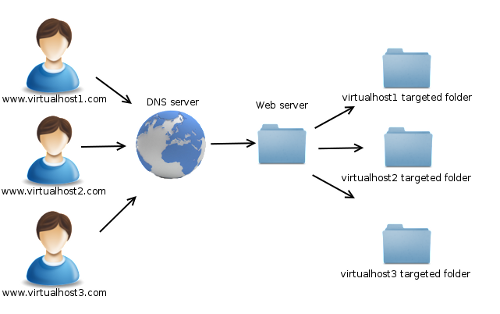
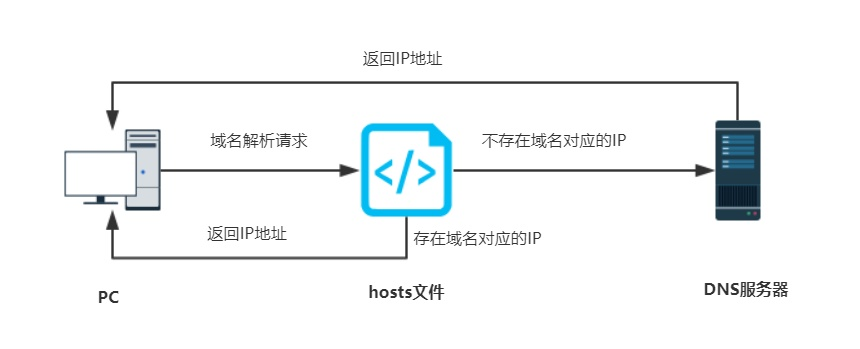
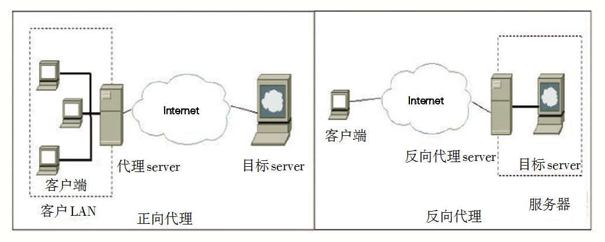
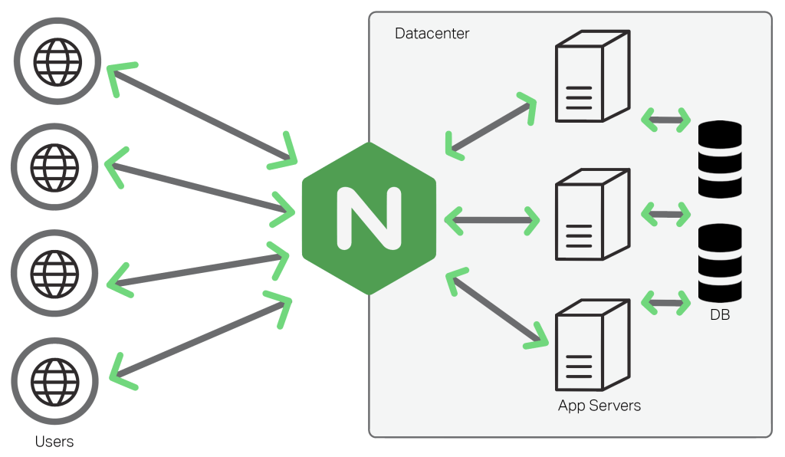
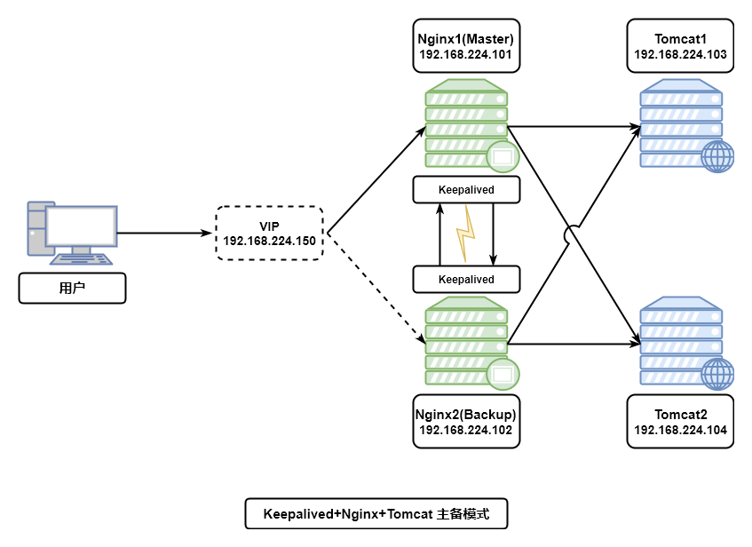

# 1. MyCat

## 1.1 背景

* 问题

单个数据库无法实现海量数据的存储

* 解决

MyCat数据库中间件，可以实现数据库的集群，实现数据的海量存储

* 优点

使用简单,不需要改变之前的使用习惯



## 1.2 Mycat原理



## 1.3 数据库分片模式

将数据根据某个特定的规则分别存储到不同的数据库中

* 垂直切分

  将不同的表存储到不同的数据库中

* 水平切分

  将同一个表存储到不同的数据库中



## 1.4 Mycat配置


### 1.4.1 基础概念

1. 逻辑库:程序员连接的数据库
2. 逻辑表:程序员操作的表
3. 数据节点:分片的数据库
4. 节点主机:物理库所安装的计算机
5. 分片规则:表切分的规则



### 1.4.2 配置逻辑库

%mycat%/conf/schema.xml

```xml
<!--逻辑库-->
<schema name="pinyougouDB" checkSQLschema="false" sqlMaxLimit="100">
	<!-- 逻辑表tb_test存储在dn1,dn2,dn3共3个分片,默认的规则为ID值划分 -->
	<table name="tb_test"  dataNode="dn1,dn2,dn3" rule="auto-sharding-long" />
	<table name="tb_order" dataNode="dn1,dn2,dn3" rule="sharding-by-murmur-order" />
</schema>

<!--数据节点-->
<dataNode name="dn1" dataHost="localhost1" database="db1" />
<dataNode name="dn2" dataHost="localhost1" database="db2" />
<dataNode name="dn3" dataHost="localhost1" database="db3" />

<!--节点主机-->
<dataHost name="localhost1" maxCon="1000" minCon="10" balance="0"
	writeType="0" dbType="mysql" dbDriver="native" switchType="1"  slaveThreshold="100">
	<heartbeat>select user()</heartbeat>
	<writeHost host="hostM1" url="192.168.25.131:3306" user="root" password="123456"/>
</dataHost>
```
### 1.4.3 配置mycat用户名和密码

%mycat%/conf/server.xml

```xml
<!--编码-->
<property name="charset">utf8</property>

<!--用户-->
<user name="test">
	<property name="password">test</property>
	<property name="schemas">pinyougouDB</property>
</user>

<user name="root">
	<property name="password">123456</property>
	<property name="schemas">pinyougouDB</property>
</user>
```

## 1.5 分片规则

%mycat%/conf/rule.xml 

```xml
<!--规格名称-->
<tableRule name="auto-sharding-long">
	<rule>
		<columns>id</columns>
		<algorithm>rang-long</algorithm>
	</rule>
</tableRule>

<tableRule name="sharding-by-murmur-order">
	<rule>
		<columns>order_id</columns>
		<algorithm>murmur</algorithm>
	</rule>
</tableRule>

<!--------------------------------------华丽分割线--------------------------------------------->

<!--规则定义-->

<!--值的范围-->
<function name="rang-long"
	class="org.opencloudb.route.function.AutoPartitionByLong">
	<property name="mapFile">autopartition-long.txt</property>
</function>

<!--平均原则-->
<function name="murmur"
	class="org.opencloudb.route.function.PartitionByMurmurHash">
    <!-- 默认是0 -->
	<property name="seed">0</property>
    <!-- 要分片的数据库节点数量，必须指定，否则没法分片 -->
	<property name="count">3</property>
    <!-- 一个实际的数据库节点被映射为这么多虚拟节点，默认是160倍，也就是虚拟节点数是物理节点数的160倍 -->
	<property name="virtualBucketTimes">160</property>
    <!--节点的权重，没有指定权重的节点默认是1。-->
	<!--<property name="weightMapFile">weightMapFile</property>-->
    <!--输入物理节点和虚拟节点的映射-->
	<!--<property name="bucketMapPath">/etc/mycat/bucketMapPath</property>-->
</function>
```

[其他规格介绍](https://www.cnblogs.com/leeSmall/p/9462658.html)

> 注意事项:
>
> 1. 表名mycat中一致大写
> 2. 不能用*

## 1.6 读写分离



* mycat:负责读写分离
* mysql:负责主从备份

# 2. Nginx

## 2.1 基本操作

* 启动

  ```nginx
  ./nginx
  ```

* 关闭

  ```nginx
  ./nginx -s stop
  #或者
  ./nginx -s quit
  ```

* 重启

  ```nginx
  ./nginx -s reload
  ```

## 2.2 应用场景

### 2.2.1 web服务器

部署静态资源

```nginx
#80端口
server {
    server_name  localhost;
    listen       80;
    
    location / {
        root   html/item;				#项目根路径
        index  index.html index.htm;	#默认页面
    }
}
```

### 2.2.2 虚拟主机

**虚拟主机**（英语：virtual hosting）或称 **共享主机**（shared web hosting），又称**虚拟服务器**，是一种在单一主机或主机群上，实现多网域服务的方法，可以运行多个网站或服务的技术。虚拟主机之间完全独立，并可由用户自行管理，虚拟并非指不存在，而是指空间是由实体的服务器延伸而来，其硬件系统可以是基于服务器群，或者单个服务器。

**优点：**

1. 方便管理：所有的虚拟主机都在同一部主机中，因此彼此可以共享相同的配置设置，借此节省管理的人力与成本。
2. 提高性能：相同主机内的虚拟主机可以共享彼此的程序集，因此可以缩短对客户端的回应时间。
3. 降低成本：虚拟主机使得单一服务器的资源可以被更有效的利用，包括存储器、存储空间或处理器资源。



### 2.2.2.1 端口设置

```nginx
#80端口
server {
    server_name  localhost;
    listen       80;
    
    location / {
        root   html/item;				#项目根路径
        index  index.html index.htm;	#默认页面
    }
}
	
#81端口
server {
    server_name  localhost;
    listen       81;
    
    location / {
        root   html2/item;
        index  index.html index.htm;
    }
}
```

#### 2.2.2.2 域名设置

域名解析过程



```
1. 用户输入网址
2. 在本地hosts文件匹配域名对应的IP地址,找到就根据IP地址访问目标服务器
3. 本地hosts文件没有域名对应的IP地址,就从公网DNS服务器继续查找,找到对应IP访问目标服务器
4. 以上都没有匹配到IP地址,浏览器报错!
```

一个域名只能解析到一个IP地址,一个IP地址(一台计算机)可以被多个域名绑定

```nginx
#购物车模块
server{
    server_name cart.pinyougou.com;
	listen 		80;			   #配置域名后,端口可以设置为80
	
	location /{
		root  cart;
		index cart.html;
	}
}

#搜索模块
server{
    server_name search.pinyougou.com;
	listen 		80;				#配置域名后,端口可以设置为80
	
	location /{
		root  search;
		index search.html;
	}
}
```

### 2.2.3 反向代理

* 网络代理的方式
  1. 正向代理:针对客户端而言,客户端通过代理服务器实现上网/翻墙等功能.
  2. 反向代理:针对服务器而言,服务器通过反向代理服务器实现请求的负载均衡.



* 反向代理配置

负载均衡（应用服务器）是目标，反向代理是手段。



```nginx
server {
    server_name www.pinyougou.com;
	listen    80;
	
	location / {
		proxy_pass http://tomcat-portal;
		index index.html;
	}
}

#反向代理
upstream tomcat-portal {
	server    192.168.25.131:8081;
	server    192.168.25.131:8082  weight=2;	#该服务器负载的数量时其他2个的2倍
	server    192.168.25.131:8083;
}
```

>  Web层的负载均衡通过Nginx的反向代理实现
>
>  服务层的负载均衡通过ZooKeeper的集中配置实现		

## 2.3 Nginx的高可用

nginx的高可用通过keepalive软件实现



1. 将域名解析到虚拟IP
2. 主服务器提供正常的网络访问
3. 从服务器通过keepalive和主服务器通信进行心跳监测
4. 当检测到主服务器宕机,从服务器自动升级为主服务器


   ​