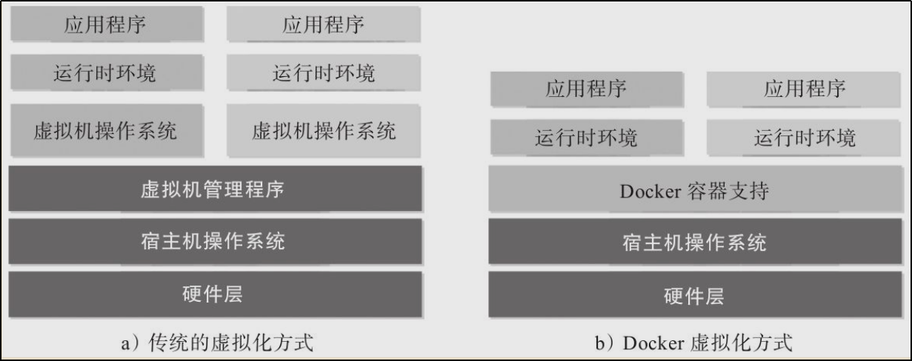
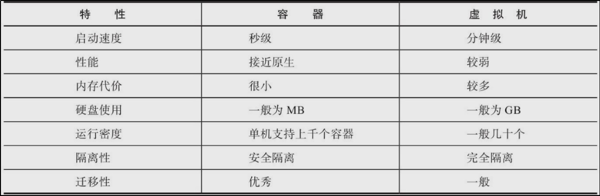
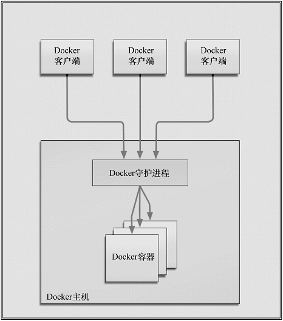
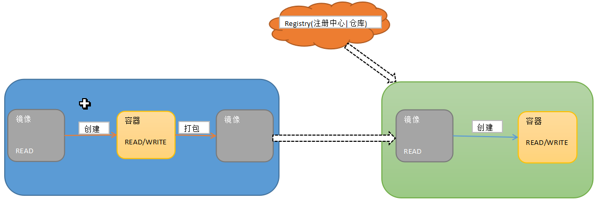

# 1. 容器化技术

容器化技术基于虚拟化技术，但是又比虚拟化效率高，更加的轻便。



## 1.1 背景

### 1.1.1  问题

由于客户机环境的差异，应用程序的迁移和部署，通常要针对不同的客户机进行大量的环境配置工作。

###1.1.2 解决

利用容器化技术封装应用程序和其依赖的环境，实现应用程序与客户机硬件的解耦合，屏蔽客户机硬件环境的差异

### 1.1.3 原理

通过Docker虚拟化实现应用程序的"一次封装,到处运行".

### 1.1.4 优点

1. 简单易用
2. 快速的交付和部署
3. 高效的资源利用
4. 容器升级简单



## 1.2 Docker组件

Docker是基于C/S结构的软件。通过Docker提供的客户端命令行工具docker或者RESTful API请求服务器端。这种操作既可以是本地也可以远程。类似于：putty/Linux的关系。



## 1.3 重要概念

1. Docker镜像：类似于虚拟机的镜像文件.用来创建容器.	
2. Docker容器：从镜像创建的运行实例.镜像是只读的文件,容器是可写的.
3. Docker注册中心：Docker存放镜像的文件的仓库.类似于Maven的中央仓库.



# 2. Docker安装和启动

```shell
#在线安装
yum install docker

#查看docker版本
docker -v		

#启动docker
systemctl start docker

#关闭docker
systemctl stop docker

#重启docker
systemctl restart docker

#查看docker状态
systemctl status docker

#配置开机启动docker
systemctl enable docker

#查看docker概要信息
docker info

#查看docker帮助文档
docker help
```

# 3. Docker镜像操作

## 3.1 基本操作

```shell
#列出本地所有镜像
docker images

#在Docker Hub搜索镜像
docker search 镜像名称

#从Docker Hub拉取镜像
docker pull 镜像名称:Tag(默认为最新的)

#删除某个镜像
docker rmi 镜像ID

#删除所有镜像
docker rmi `docker images -q`
```

## 3.2 加载下载

```shell
#1.编辑/etc/docker/daemon.json文件
vi /etc/docker/daemon.json
#2.添加如下代码
{
"registry-mirrors": ["https://docker.mirrors.ustc.edu.cn"]
}
#3.重启Docker服务
systemctl docker restart
```

# 4. Docker容器操作  

## 4.1 基本操作

```shell
#查看正在运行的容器
docker ps

#查询所有的容器
docker ps -a

#查看最后一次运行的容器
docker ps -l

#查看停止的容器
docker ps -f status=exited

#创建并启动容器(交互式)
docker run -it --name=自定义容器名称  镜像名称:tag  /bin/bash

#创建并启动容器(守护式)
docker run -id --name=自定义容器名称  镜像名称:tag  

#登录守护容器
docker exec -it 容器名称/容器ID /bin/bash

#停止容器
docker stop 容器ID/名称

#启动容器
docker start 容器ID/名称
```

## 4.2 文件拷贝

```sh
#宿主机--->容器
docker cp 本地文件/目录	容器ID/名称:容器目录 
#容器--->宿主机
docker cp 容器ID/名称:容器目录/文件 	本地目录
```

## 4.3 目录挂载(共享目录)

```sh
docker run -id -v 宿主机目录:容器目录 --privileged=true --name=容器名称 镜像名称:tag 
#eg:docker run -id -v /home:/home --privileged=true --name=mycentos centos:7 
```

## 4.4 容器属性数据

```shell
#查看全部属性数据
docker inspect 容器名称
#查看某个数据,例如IP地址
docker inspect --format='{过滤条件}'  容器ID
#例如查看centos容器的IP
docker inspect --format='{{.NetworkSettings.IPAddress}}' 容器ID
```

## 4.5 删除容器

```shell
#删除某个容器
docker rm 容器ID		#不能删除正在运行的容器,必须先停止,再删除
#删除所有容器
docker rm `docker ps -a -q`
```

# 5. 常见容器部署

## 5.1 mysql容器

```shell
#拉取镜像
docker pull mysql

#创建MySQL容器	
##-p 代表端口映射,宿主机映射端口:容器运行端口
##-e 代表添加环境变量 MYSQL_ROOT_PASSWORD 是 root 用户的登陆密码
docker run -id --name pinyougou_mysql -p 33306:3306 -e MYSQL_ROOT_PASSWORD=123456 mysql

#进入Mysql容器
docker exec -it pinyougou_mysql /bin/bash

#本地登录Mysql测试
mysql -u root -p

#远程可以通过宿主机的IP:映射端口登录
```

## 5.2 tomcat容器

```shell
#拉取镜像
docker pull tomcat:7-jre7

#创建容器,并设置共享目录
docker run -id --name=pinyougou_tomcat -p 9000:8080 -v /usr/local/myhtml:/usr/local/tomcat/webapps --privileged=true tomcat:7-jre7

#进入Tomcat容器查看文件
docker exec -it 容器ID /bin/bash
```

## 5.3 Nginx部署

```sh
#拉取镜像
docker pull nginx

#创建容器
docker run -id --name=pinyougou_nginx -p 80:80 nginx

#拷贝容器中的配置文件到宿主机
docker cp pinyougou_nginx:/etc/nginx/nginx.conf nginx.conf

#编辑nginx.conf 添加反向代理
server {
	server_name passport.pinyougou.com;
    listen 80;
    
    location / {
        proxy_pass http://tomcat-cas;
        index index.html index.htm;
    }
}

upstream tomcat-cas {
	server 172.17.0.7:8080;
}
```

## 5.4 Redis部署

```sh
#拉取镜像
docker pull redis

#创建容器
docker run -di --name=pinyougou_redis -p 6379:6379 redis

#本地连接测试
redis-cli -h 192.168.247.135
```

# 6. 容器备份和迁移

## 6.1 容器保存

```shell
docker commit 容器名称 镜像名称
```

## 6.2 镜像备份

```sh
docker save -o 包名.tar 镜像
```

## 6.3 镜像恢复

```sh
docker load -i 包名.tar
```

# 7. 总结

