# 1. Vue.js

## 1.1 Vue.js介绍

### 1.1.1 Vue.js是什么?

Vue (读音 /vjuː/，类似于 view) 是一套用于构建用户界面的渐进式框架。与其它大型框架不同的是，Vue 被设计为可以自底向上逐层应用。Vue 的核心库只关注视图层，不仅易于上手，还便于与第三方库或既有项目整合。另一方面，当与现代化的工具链以及各种 支持类库结合使用时， Vue 也完全能够为复杂的单页应用提供驱动。

**渐进式框架(Progressive)：**说明vue.js的轻量，是指一个前端项目可以使用vue.js一两个特性也可以整个项目都用vue.js。

**自底向上逐层应用：**作为渐进式框架要实现的目标就是方便项目增量开发。

### 1.1.2 Vue.js与ECMAScript

Vue 不支持 IE8 及以下版本，因为 Vue 使用了 IE8 无法模拟的 ECMAScript 5 特性。

> **ECMAScript**是一种由[Ecma国际](https://zh.wikipedia.org/wiki/Ecma%E5%9B%BD%E9%99%85)（前身为[欧洲计算机制造商协会](https://zh.wikipedia.org/wiki/%E6%AC%A7%E6%B4%B2%E8%AE%A1%E7%AE%97%E6%9C%BA%E5%88%B6%E9%80%A0%E5%95%86%E5%8D%8F%E4%BC%9A)）通过ECMA-262标准化的[脚本](https://zh.wikipedia.org/wiki/%E8%84%9A%E6%9C%AC%E8%AF%AD%E8%A8%80)[程序设计语言](https://zh.wikipedia.org/wiki/%E7%A8%8B%E5%BA%8F%E8%AE%BE%E8%AE%A1%E8%AF%AD%E8%A8%80)。这种语言在[万维网](https://zh.wikipedia.org/wiki/%E4%B8%87%E7%BB%B4%E7%BD%91)上应用广泛，它往往被称为[JavaScript](https://zh.wikipedia.org/wiki/JavaScript)或[JScript](https://zh.wikipedia.org/wiki/JScript)，但实际上后两者是ECMA-262标准的实现和扩展。

ECMAScript（简称ES）是一种规范，我们平常所说的Js/Javascript是ECMAScript的实现，早期主要应用的ES3，当
前主流浏览器都支持ES5、ES6，ES8已于2017年发布。

ES6：[http://www.ecma-international.org/ecma-262/6.0/](http://www.ecma-international.org/ecma-262/6.0/)
ES7 ：[http://www.ecma-international.org/ecma-262/7.0/](http://www.ecma-international.org/ecma-262/7.0/)

### 1.1.3 Vue.js的使用

1. 在html页面使用script引入vue.js的库即可使用。
2. 使用Npm管理依赖，使用webpack打包工具对vue.js应用打包。
3. Vue-CLI脚手架,使用 vue.js官方提供的CLI脚本架很方便去创建vue.js工程雏形。

### 1.1.4 Vue.js的功能

1. 声明式渲染

   Vue.js 的核心是一个允许采用简洁的模板语法来声明式地将数据渲染进 DOM 的系统。

   ```html
   <div id="app">
     {{ message }}
   </div>
   ```

   ```javascript
   var app = new Vue({
     el: '#app',
     data: {
       message: 'Hello Vue!'
     }
   })
   ```

2. 条件与循环

   dom中可以使用vue.js提供的v-if、v-for等标签，方便对数据进行判断、循环。

   * v-if:判断

   ```html
   <div id="app-3">
     <p v-if="seen">现在你看到我了</p>
   </div>
   ```

   ```javascript
   var app3 = new Vue({
     el: '#app-3',
     data: {
       seen: true
     }
   })
   ```

   * v-for:循环

   ```html
   <div id="app-4">
     <ol>
       <li v-for="todo in todos">
         {{ todo.text }}
       </li>
     </ol>
   </div>
   ```

   ```javascript
   var app4 = new Vue({
     el: '#app-4',
     data: {
       todos: [
         { text: '学习 JavaScript' },
         { text: '学习 Vue' },
         { text: '整个牛项目' }
       ]
     }
   })
   ```

3. 双向数据绑定
   Vue 还提供了 v-model 指令，它能轻松实现表单输入和应用状态之间的双向绑定。

   ```html
   <div id="app-6">
     <p>{{ message }}</p>
     <input v-model="message">
   </div>
   ```

   ```javascript
   var app6 = new Vue({
     el: '#app-6',
     data: {
       message: 'Hello Vue!'
     }
   })
   ```

4. 处理用户输入

   为了让用户和你的应用进行交互，我们可以用 `v-on` 指令添加一个事件监听器，通过它调用在 Vue 实例中定义的方法

   ```html
   <div id="app-5">
     <p>{{ message }}</p>
     <button v-on:click="reverseMessage">逆转消息</button>
   </div>
   ```

   ```javascript
   var app5 = new Vue({
     el: '#app-5',
     data: {
       message: 'Hello Vue.js!'
     },
     methods: {
       reverseMessage: function () {
         this.message = this.message.split('').reverse().join('')
       }
     }
   })
   ```

5. 组件化应用构建 
   组件系统是 Vue 的另一个重要概念，因为它是一种抽象，允许我们使用小型、独立和通常可复用的组件构建大型应用。仔细想想，几乎任意类型的应用界面都可以抽象为一个组件树：
   
## 1.2 Vue.js基础
### 1.2.1 MVVM模式
vue.js是一个MVVM的框架，理解MVVM有利于学习vue.js。
* MVVM 拆分解释为：
  * Model: 负责数据存储
  * View: 负责页面展示
  * View Model: 负责业务逻辑处理（比如Ajax请求等），对数据进行加工后交给视图展示
* MVVM 要解决的问题是将业务逻辑代码与视图代码进行完全分离，使各自的职责更加清晰，后期代码维护更加简单

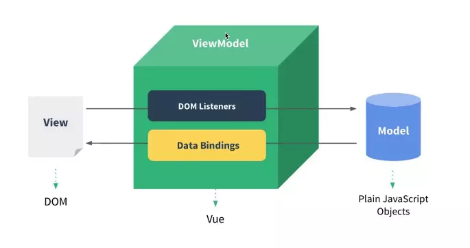

从上图看出，VM(ViewModel)可以把view视图和Model模型解耦合，VM的要做的工作就是vue.js所承担的。

MVVM拆开来即为Model-View-ViewModel，有View，ViewModel，Model三部分组成。View层代表的是视图、模版，负责将数据模型转化为UI展现出来。Model层代表的是模型、数据，可以在Model层中定义数据修改和操作的业务逻辑。ViewModel层连接Model和View。

在MVVM的架构下，View层和Model层并没有直接联系，而是通过ViewModel层进行交互。ViewModel层通过双向数据绑定将View层和Model层连接了起来，使得View层和Model层的同步工作完全是自动的。因此开发者只需关注业务逻辑，无需手动操作DOM，复杂的数据状态维护交给MVVM统一来管理。

### 1.2.2 入门程序

```html
<body>
    <div id="app">
        {{name}}
    </div>
</body>
<script>
    var VM = new Vue({
        el:'#app',		//vm接管了app区域的管理
        data:{			//model数据
            name:'黑马程序员'
        }
    });
</script>
</html>
```

vue程序编写步骤:

1. 定义html，引入vue.js
2. 定义app div，此区域作为vue的接管区域
3. 定义vue实例，接管app区域。
4. 定义model（数据对象）
5. VM完成在app中展示数据

### 1.2.3 vue事件定义

```html
<body>
    <div id="app">
        
        <a v-bind:href="url">
            <!--输出变量值,v-text可以解决页面值闪烁问题-->
            <span v-text="name"></span>
        </a>
        <!--绑定变量-->
        <input type="text" v-model="num1"/> +
        <input type="text" v-model="num2"/>=
        <span v-text="result"></span>
        <!--事件绑定-->
        <button v-on:click="change">计算</button>
        <!--v-bind-->
        <div v-bind:style="{ fontSize: size + 'px' }">javaEE培训</div>
    </div>
</body>
<script src="vue.min.js"></script>
<script>
    var VM = new Vue({
        el: '#app
        data: {						//定义model数据
            name: '黑马程序员',
            num1: 0,
            num2: 0,
            result: 0,
            url: 'http://www.itcast.cn',
            size: 11
        },
        methods: {					//定义方法
            change: function () {
                this.result = Number.parseInt(this.num1) + Number.parseInt(this.num2)
            }
        }
    });
</script>
</html>
```

### 1.2.4 判断和循环

```html
<body>

<div id="app">
   
    <ul>
        <!--遍历数组-->
        <li v-for="(item,index) in list" :key="index" v-if="index % 2 ==0">{{index}}-{{item}}</li>
        <!--遍历对象-->
        <li v-for="(value,key) in user">{{key}}--{{value}}</li>
        <!--遍历对象数组-->
        <li v-for="(item,index) in userlist" :key="item.user.uname">
            <div v-if="item.user.uname == 'itheima'" style="background: #00f50c">
                {{index}}--{{item.user.uname}}--{{item.user.age}}
            </div>
            <div v-else="">
                {{index}}--{{item.user.uname}}--{{item.user.age}}
            </div>
        </li>
    </ul>
</div>
</body>
<script>
    var VM = new Vue({
        el:'#app',		
        data:{			//model数据
            list:[1,2,3,4,5],	//数组
            user:{uname:'itcast',age:10},	//对象
            userlist:[			//对象数组
                {user:{uname:'itcast',age:10}},
                {user:{uname:'itheima',age:11}}
            ]
        }
    });
</script>
</html>
```

### 1.2.5 总结

1. {{XXX}}:输出XXX变量值

2. v-model:在表单控件或者组件上创建双向绑定到Vue的变量上,适用于如下元素

   ```html
   input
   select
   textarea
   components（Vue中的组件）
   ```

3. [v-text="XXX"]:输出XXX变量值,解决插值表达式闪烁问题

4. [v-on:事件的类型]:绑定一个按钮的事件

5. v-bind:可以将数据对象绑定在dom的任意属性中

   ```html
   <!--举例-->
     
   <div v‐bind:style="{ fontSize: size + 'px' }"></div>
   <!--缩写形式-->
   
   <div :style="{ fontSize: size + 'px' }"></div>
   ```

   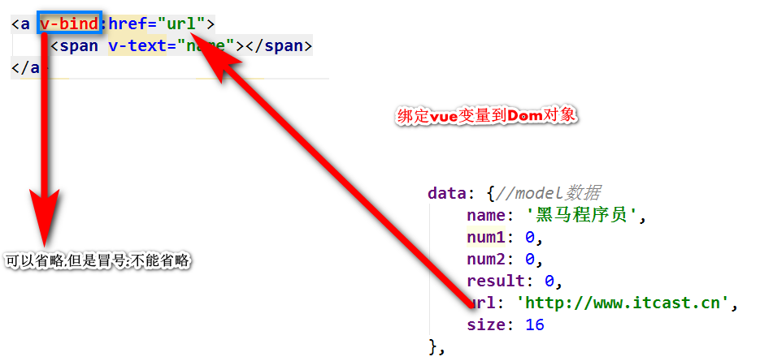

6. v-if:判断

7. v-for:循环

# 2. Webpack

## 2.1 介绍

[Webpack](https://webpack.github.io/) is [one of the available module bundlers](https://www.toptal.com/front-end/webpack-browserify-gulp-which-is-better) that processes [JavaScript](https://www.toptal.com/javascript) code, as well as all static assets, such as stylesheets, images, and fonts, into a bundled file. Processing can include all the necessary tasks for managing and optimizing code dependencies, such as compilation, concatenation, minification, and compression.


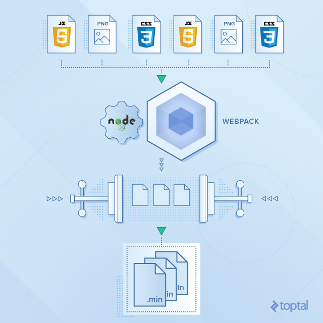

* 优点

1. 模块化开发
   程序员在开发时可以分模块创建不同的js、 css等小文件方便开发，最后'
2. 使用webpack将这些小文件打包成一个文件，减少了http的请求次数。
3. 编译typescript、ES6等高级js语法
   随着前端技术的强大，开发中可以使用javascript的很多高级版本，比如：typescript、ES6等，方便开发，webpack可以将打包文件转换成浏览器可识别的js语法。
4. CSS预编译
   webpack允许在开发中使用Sass 和 Less等原生CSS的扩展技术，通过sass-loader、less-loader将Sass 和 Less的语法编译成浏览器可识别的css语法。

* 不足

1. 配置有些繁琐
2. 文档不丰富

## 2.2 安装Webpack

### 2.2.1 安装node.js

webpack基于node.js运行，首先需要安装node.js。

> **Node.js**是一个能够在[服务器](https://zh.wikipedia.org/wiki/%E4%BC%BA%E6%9C%8D%E5%99%A8)端运行[JavaScript](https://zh.wikipedia.org/wiki/JavaScript)的[开放源代码](https://zh.wikipedia.org/wiki/%E9%96%8B%E6%94%BE%E5%8E%9F%E5%A7%8B%E7%A2%BC)、[跨平台](https://zh.wikipedia.org/wiki/%E8%B7%A8%E5%B9%B3%E5%8F%B0)JavaScript [运行环境](https://zh.wikipedia.org/wiki/%E6%89%A7%E8%A1%8C%E7%8E%AF%E5%A2%83)。Node.js采用[Google](https://zh.wikipedia.org/wiki/Google)开发的[V8](https://zh.wikipedia.org/wiki/V8_(JavaScript%E5%BC%95%E6%93%8E))运行代码，使用[事件驱动](https://zh.wikipedia.org/wiki/%E4%BA%8B%E4%BB%B6%E9%A9%85%E5%8B%95)、[非阻塞](https://zh.wikipedia.org/w/index.php?title=%E9%9D%9E%E9%98%BB%E5%A1%9E&action=edit&redlink=1)和 [异步输入输出](https://zh.wikipedia.org/w/index.php?title=%E9%9D%9E%E5%90%8C%E6%AD%A5%E8%BC%B8%E5%85%A5%E8%BC%B8%E5%87%BA&action=edit&redlink=1)模型等技术来提高性能，可优化应用程序的传输量和规模。这些技术通常用于数据密集的即时应用程序。
>
> Node.js大部分基本模块都用JavaScript语言编写。在Node.js出现之前，JavaScript通常作为客户端程序设计语言使用，以JavaScript写出的程序常在用户的浏览器上运行。Node.js的出现使JavaScript也能用于服务端编程。Node.js含有一系列内置模块，使得程序可以脱离[Apache HTTP Server](https://zh.wikipedia.org/wiki/Apache_HTTP_Server)或[IIS](https://zh.wikipedia.org/wiki/IIS)，作为独立服务器运行。

1. [官网](https://nodejs.org/en/download/)下载

2. 默认安装即可

3. 测试

   ```shell
   node ‐v
   ```

### 2.2.2 安装npm

#### 2.2.2.1 npm介绍

**npm**（全称 Node Package Manager，即“node包管理器”）是[Node.js](https://zh.wikipedia.org/wiki/Node.js)默认的、以[JavaScript](https://zh.wikipedia.org/wiki/JavaScript)编写的[软件包管理系统](https://zh.wikipedia.org/wiki/%E8%BB%9F%E9%AB%94%E5%A5%97%E4%BB%B6%E7%AE%A1%E7%90%86%E7%B3%BB%E7%B5%B1)。npm会随着Node.js自动安装。

```shell
npm -v
```

npm可以管理本地项目的所需模块并自动维护依赖情况，也可以管理全局安装的JavaScript工具

#### 2.2.2.2 设置npm包路径

包路径就是npm从远程下载的js包所存放的路径

```shell
# 查看npm管理包路径
npm config ls
# 更改npm包管理目录
npm config set prefix "C:\work\develop\nodejs\npm_modules"
npm config set cache "C:\work\develop\nodejs\npm_cache"
```

### 2.2.3 安装cnpm

npm默认会去国外的镜像去下载js包，在开发中通常我们使用国内镜像，这里我们使用淘宝镜像下边我们来安装cnpm

```shell
# 安装淘宝cnpm镜像
npm install -g cnpm --registry=https://registry.npm.taobao.org
# 查看cnpm版本
cnpm -v
```

如果cnmp执行失败,将cnpm的命令目录配置到环境变量

### 2.2.4 安装nrm

nrm可以用来查看npm的镜像源

```shell
# 安装nrm
cnpm install -g nrm
# 查看npm镜像
nrm ls
# 切换镜像
nrm use XXX
```

### 2.2.5 安装webpack

* 本地安装:使用于某个具体项目
* 全局安装:使用于全局项目

```shell
# 注意:安装时指定版本3.6.0,如果不指定会安装4.0(需要Webpack-cli依赖)
cnpm install webpack@3.6.0 -g
```

## 2.3 入门程序

需求:计算2个数之和

### 2.3.1 定义模块

* 定义model01.js,封装某个模块的JS代码

```javascript
var add = function (x, y) {
    return x+y;
}
var add2 = function (x, y) {
    return x+y+2;
}
module.exports.add = add;
// module.exports ={add,add2};//如果有多个方法这样导出
// module.exports.add2 = add2//如果有多个方法也可以这样导出
```

* 定义main.js,main.js是本程序的js主文件,相当于后台的入口程序


```javascript
//导入model01.js
var {add} = require("./model01")	//引入mode101.js
var Vue = require("./vue.min")		//引入vue.js
var VM = new Vue({					//创建vue对象
    el:'#app',
    data:{
        name:'黑马程序员',
        num1:0,
        num2:0,
        result:0,
        url:'http://www.itcast.cn',
        size:11
    },
    methods:{
        change:function () {
            this.result = add(Number.parseInt(this.num1),Number.parseInt(this.num2));
        }
    }
});
```

### 2.3.2 打包测试

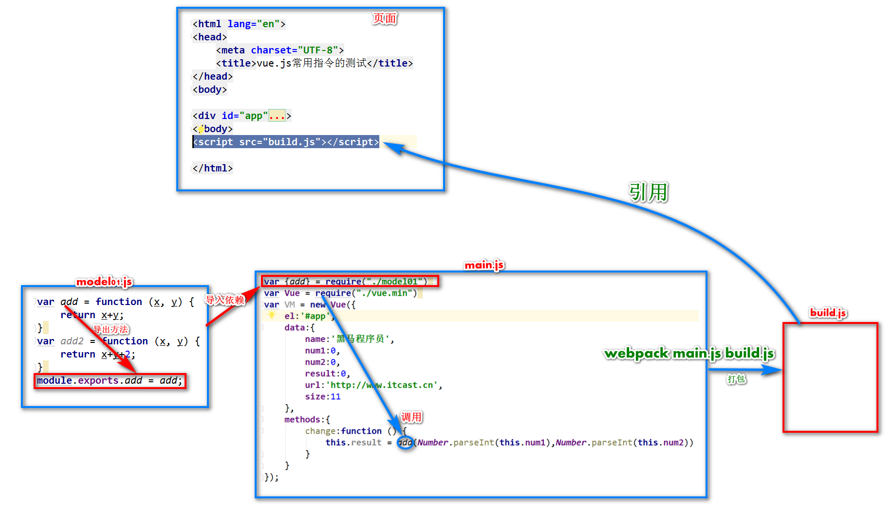

* 打包main.js

  在工程目录下打包

```shell
# 打包main.js 生成build.js
webpack main.js build.js 
```

* html中引入打包生成的Js文件

```html
<body>
<div id="app">
    ...
</div>
</body>
<!--引入打包后的js文件-->
<script src="build.js"></script>

</html>
```

## 2.4 webpack-dev-server

webpack-dev-serve服务器可以实现代码调试及热部署功能

### 2.4.1 准备工作

1. 在工程目录下创建```src```和```dist```文件夹
2. 将js源码文件(```main.js```和```model01.js```)拷贝到src下

### 2.4.2 安装webpack-dev-server

```shell
# 在工程目录安装webpack webpack-dev-server html-webpack-plugin
cnpm install webpack@3.6.0 webpack-dev-server@2.9.1 html-webpack-plugin@2.30.1 --save-dev
```

安装完毕后会在工程目录中生成package.json文件

### 2.4.3 配置webpack-dev-server

#### 2.4.3.1 package.json

该文件类似于Maven的pom文件

```json
{
  "scripts": {	# 可执行的命令
    "dev": "webpack‐dev‐server ‐‐inline ‐‐hot ‐‐open ‐‐port 5008"
              # inline：自动刷新
			  # hot：热加载
		      # port：指定端口
		      # open：自动在默认浏览器打开
		      # host：可以指定服务器的 ip，不指定则为127.0.0.1，如果对外发布则填写公网ip地址
  },
  "devDependencies": {	# 开发人员在开发过程中所需要的依赖。
    "html‐webpack‐plugin": "^2.30.1",
    "webpack": "^3.6.0",
    "webpack‐dev‐server": "^2.9.1"
  }
}
```

#### 2.4.3.2 webpack.config.js

在工程目录下创建webpack的配置文件,用于配置应用的入口文件\输出文件\插件参数等

```javascript
var htmlwp = require('html-webpack-plugin');	// 引入html-webpack-plugin插件
module.exports={
    entry:'./src/main.js',  		// 指定打包的入口文件
    output:{
        path : __dirname+'/dist',   // 注意：__dirname表示webpack.config.js所在目录的绝对路径
        filename:'build.js'		    // 输出文件
    },
    
    plugins:[						//创建插件对象
        new htmlwp({
            title: '首页',  		   // 生成的页面标题
            filename: 'index.html', // webpack-dev-server在内存中生成的文件名称
            template: 'vue_02.html' // 根据vue_02.html这个模板来生成(模板文件需要自己提供)
        })
    ]
}
```

* 配置模板文件

  模板文件不需要添加```build.js```,```webpack-dev-serve```会自动将build.js注入到生成的页面

```html
<!DOCTYPE html>
<html lang="en">
    <head>
    	...
    </head>
    <body>
    <div id="app">
        <input type="text" v-model="num1"/> +
        <input type="text" v-model="num2"/>=
        <span v-text="result"></span>
        <button v-on:click="change">计算</button>
    </div>
    </body>
</html>
```

### 2.4.5 启动

* 方式一:进入工程目录,执行```npm run dev```
* 方式二:使用webstorm，右键```package.json```文件，选择```Show npm Scripts```,双击```dev```执行


### 2.4.6 debug调试

webpack 将多个源文件打包成一个文件，并且文件的内容产生了很大的变化，webpack提供devtool进行调试，devtool是基于sourcemap的方式.

* 配置```devtool```启用debug调试

```javascript
var htmlwp = require('html-webpack-plugin');	// 引入html-webpack-plugin插件
module.exports={
    entry:'./src/main.js',  		// 指定打包的入口文件
    output:{
        path : __dirname+'/dist',   // 注意：__dirname表示webpack.config.js所在目录的绝对路径
        filename:'build.js'		    // 输出文件
    },
    devtool: "eval-source-map",		// 启用debugger
    plugins:[						// 创建插件对象
        new htmlwp({
            title: '首页',  		   // 生成的页面标题
            filename: 'index.html', // webpack-dev-server在内存中生成的文件名称
            template: 'vue_02.html' // 根据vue_02.html这个模板来生成(模板文件需要自己提供)
        })
    ]
}
```

* 在需要调试出添加```debugger```代码

```javascript
var add = function (x, y) {
    debugger;
    return x+y;
}
```

* 刷新浏览器,即可自动进入debugger模式

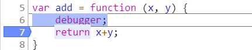

# 3. CMS前端工程搭建

前端工程使用```Vue```脚手架进行初始化.

## 3.1 脚手架

```Vue-cli```,脚手架是一个能够快速构建工程的工具.降低了项目的初始化和复杂配置的难度.

### 3.1.1 安装脚手架

```shell
npm i vue-cli -g
```

* 常用命令

```shell
### 列出所有可用的官方模板
vue list
### 从指定模板中生成一个新的项目
vue init
### 查看帮助文档
vue help
```

### 3.1.2 初始化项目

#### 3.1.2.1 查看模板

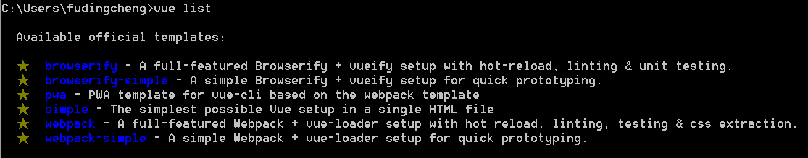

#### 3.1.2.2 创建项目

* webpack-simple

```shell
# vue init 模板名称 自定义项目名称
举例:vue init webpack-simple my-project
```

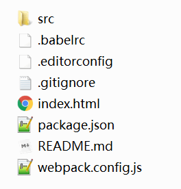

* webpack

```shell
# vue init 模板名称 自定义项目名称
举例:vue init webpack my-project
```

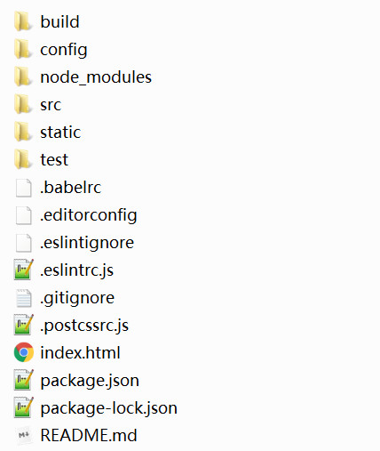

#### 2.1.2.3 启动项目

```shell
# 安装项目依赖
npm install
# 启动项目
npm run dev
```

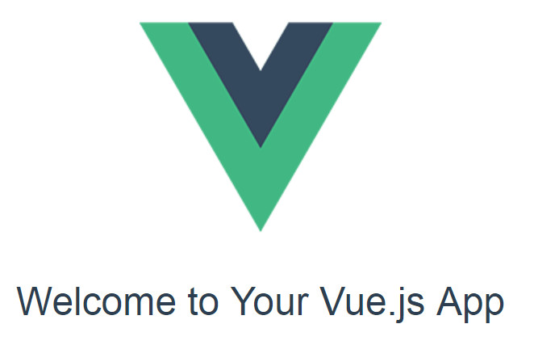

## 3.2 导入前端工程

项目中提供的初始化工程,是在```Vue```的```webpack```模板上进行了二次封装

1. 将项目拷贝到```nginx中```
2. 通过```WebStorm```打开

### 3.2.1 工程结构

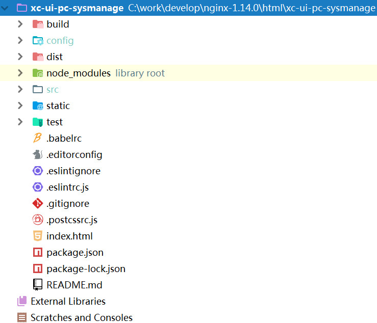

### 3.2.2 配置文件说明

#### package.json

* 位置:工程根路径/package.json
* 作用:描述工程的信息及可执行命令,依赖等

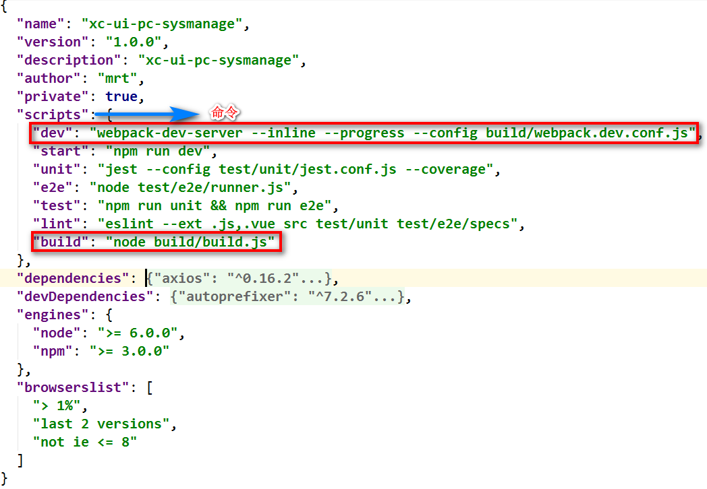

```shell
# 开发使用,运行项目
npm run dev
# 打包项目
npm run build
```

#### webpack.base.conf.js

* 位置:工程根路径/build/webpack.base.conf.js

* 作用:配置应用的入口文件\输出文件\插件参数等

#### main.js

* 位置:工程根路径/src/main.js
* 作用:加载了很多第三方组件;如:Element-UI、Base64、VueRouter

#### src

* 位置:工程根路径/src
* 作用:存放页面及JS代码

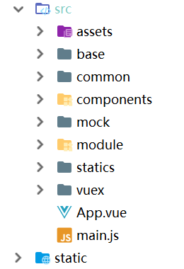

> assets：存放一些静态文件，如图片。
> base：存放基础组件
> base/api：基础api接口
> base/component：基础组件，被各各模块都使用的组件
> base/router：总的路由配置，加载各模块的路由配置文件。
> common：工具类
> component：组件目录，本项目不用。
> mock：存放前端单元测试方法。
> module：存放各业务模块的页面和api方法。下级目录以模块名命名
> ​	下边以cms举例
> ​		cms/api：cms模块的api接口
> ​		cms/component：cms模块的组件
> ​		cms/page： cms模块的页面
> ​		cms/router ：cms模块的路由配置
> statics：存放第三方组件的静态资源
> vuex：存放vuex文件，本项目不使用

#### static
与src的平级目录，此目录存放静态资源它与assets的区别在于，static目录中的文件不被```webpack```打包处理，会原样拷贝到dist目录下

## 3.3 单页面应用

**单页应用**（英语：single-page application，缩写**SPA**）是一种[网络应用程序](https://zh.wikipedia.org/wiki/%E7%BD%91%E7%BB%9C%E5%BA%94%E7%94%A8%E7%A8%8B%E5%BA%8F)或[网站](https://zh.wikipedia.org/wiki/%E7%B6%B2%E7%AB%99)的模型，它通过动态重写当前页面来与用户交互，而非传统的从服务器重新加载整个新页面。这种方法避免了页面之间切换打断[用户体验](https://zh.wikipedia.org/wiki/%E7%94%A8%E6%88%B7%E4%BD%93%E9%AA%8C)，使应用程序更像一个[桌面应用程序](https://zh.wikipedia.org/wiki/%E5%BA%94%E7%94%A8%E8%BD%AF%E4%BB%B6)。在单页应用中，所有必要的代码（[HTML](https://zh.wikipedia.org/wiki/HTML)、[JavaScript](https://zh.wikipedia.org/wiki/JavaScript)和[CSS](https://zh.wikipedia.org/wiki/%E5%B1%82%E5%8F%A0%E6%A0%B7%E5%BC%8F%E8%A1%A8)）都通过单个页面的加载而检索[[1\]](https://zh.wikipedia.org/wiki/%E5%8D%95%E9%A1%B5%E5%BA%94%E7%94%A8#cite_note-Flanagan2006-1)，或者根据需要（通常是为响应用户操作）[动态装载](https://zh.wikipedia.org/wiki/%E5%8B%95%E6%85%8B%E8%A3%9D%E8%BC%89)适当的资源并添加到页面。

* 优点：
  1. 用户操作体验好，用户不用刷新页面，整个交互过程都是通过Ajax来操作。
  2. 适合前后端分离开发，服务端提供http接口，前端请求http接口获取数据，使用JS进行客户端渲染。

* 缺点:

  1. 首页加载慢

     单页面应用会将js,css打包成一个文件,在加载页面显示的时候加载打包文件，如果打包文件较大或者网速慢则用户体验不好。

  2. SEO不友好
    SEO（Search Engine Optimization）为搜索引擎优化。它是一种利用搜索引擎的搜索规则来提高网站在搜索引擎排名的方法。目前各家搜索引擎对JS支持不好，所以使用单页面应用将大大减少搜索引擎对网站的收录。

* 总结

  本项目的门户、课程介绍不采用单页面应用架构去开发，对于需要用户登录的管理系统采用单页面开发。

# 4. CMS前端页面查询开发

## 4.1 搭建页面

模块的位置

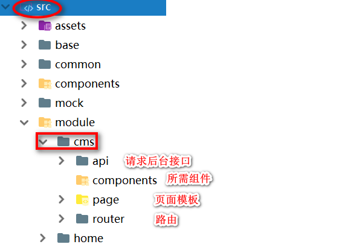

### 4.1.1 创建页面

#### 4.1.1.1 页面结构

```html
<template>
  <!--template内容必须有一个根元素，否则vue会报错-->
  <div>
      <!--1.编写页面静态部分，即view部分-->
  </div>
</template>
 
<script>
  	  /*2.编写页面静态部分，即view部分*/
</script>

<style>
     /*3.编写页面样式，不是必须*/
</style>
```

#### 4.1.1.2 页面路由

相当于管理系统的左侧树形菜单,点击后再右侧打开列表数据页面

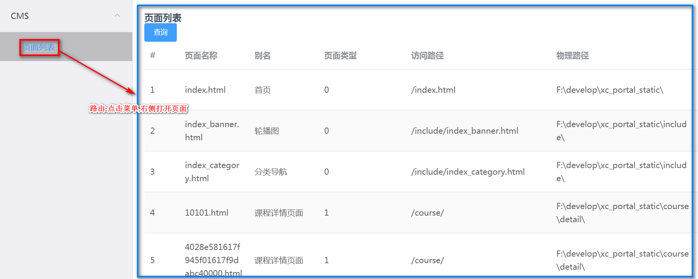

1. 在cms的router目录下配置路由```index.js```

```javascript
import Home from '@/module/home/page/home.vue';
import page_list from '@/module/cms/page/page_list.vue';
export default [{
    path: '/',
    component: Home,
    name: 'CMS',//菜单名称
    hidden: false,
    children:[
      {path:'/cms/page/list',name:'页面列表',component: page_list,hidden:false}
    ]
  }
]
```

2. 在src/base目录下的router中导入cms模块的路由

```javascript
//导入路由规则
import HomeRouter from '@/module/home/router'
import CmsRouter from '@/module/cms/router'
//合并路由规则
concat(HomeRouter)//加入home模块的路由
concat(CmsRouter)//加入cms模块的路由
export default routes;
```

3. 启动项目测试

   访问:[http://localhost:11000/](http://localhost:11000/)

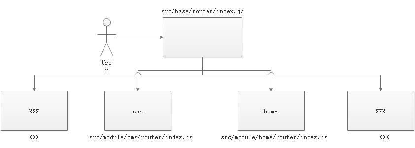

### 4.1.2 数据列表UI

CMS前端工程的UI是基于Element-UI开发

#### 4.1.2.1 Element-UI介绍

Element，一套为开发者、设计师和产品经理准备的基于 Vue 2.0 的桌面端组件库

官方站点:[http://element-cn.eleme.io/#/zh-CN/](http://element-cn.eleme.io/#/zh-CN/)

#### 4.1.2.2 列表组件开发

本功能实现的页面列表，用户可以进行分页查询、输入查询条件查询,需要引入3个组件

1. Table表格

   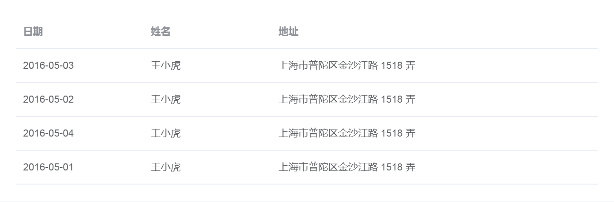

2. Form表单

   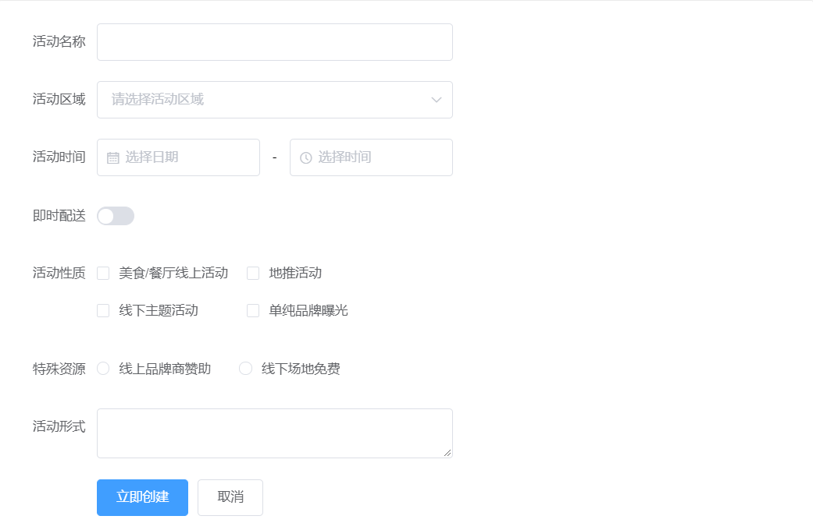

3. Pagination分页


### 4.1.3 内容完善

* page_list.vue

```html
<template>
  <div>
    <el‐button type="primary" v‐on:click="query"  size="small">查询</el‐button>
  <el‐table
    :data="list"
    stripe
    style="width: 100%">
    <el‐table‐column type="index" width="60">
    </el‐table‐column>
    <el‐table‐column prop="pageName" label="页面名称" width="120">
    </el‐table‐column>
    <el‐table‐column prop="pageAliase" label="别名" width="120">
    </el‐table‐column>
    <el‐table‐column prop="pageType" label="页面类型" width="150">
    </el‐table‐column>
    <el‐table‐column prop="pageWebPath" label="访问路径" width="250">
    </el‐table‐column>
    <el‐table‐column prop="pagePhysicalPath" label="物理路径" width="250">
    </el‐table‐column>
    <el‐table‐column prop="pageCreateTime" label="创建时间" width="180" >
    </el‐table‐column>
  </el‐table>
    <el‐pagination
      layout="prev, pager, next"
      :page‐size="this.params.size"
       v‐on:current‐change="changePage"
      :total="total" :current‐page="this.params.page" style="float:right;">
    </el‐pagination>
  </div>
</template>
<script>
  export default {
    data() {
      return {
        list:[],
        total:50,
        params:{
          page:1,//页码
          size:2//每页显示个数
        }
      }
    },
    methods:{
      //分页查询
      changePage:function () {
        this.query()
      },
      //查询
      query:function () {
        alert("查询")
      }
    }
  }
</script>
```

## 4.2 API调用

将列表中的数据从数据库动态查询

### 4.2.1 Api方法定义

* 位置:src/module/cms/api/cms.js

```javascript
//public是对axios的工具类封装，定义了http请求方法
import http from './../../../base/api/public'
export const page_list = (page,size,params) => {
  return http.requestQuickGet('http://localhost:31001/cms/page/list/'+page+'/'+size)
}
```

axios实现了http方法的封装，vue.js官方不再继续维护vue-resource,推荐使用 axios。

### 4.2.2 Api的调用

* src/module/cms/page/page_list.vue

````html
<template>
  <div>
    <!--编写页面静态部分，即view部分-->
    ...
  </div>
</template>
<script>
  /*导入cms.js*/
  import * as cmsApi from '../api/cms'
  export default {
    data() {
      return {
        list: [],
        total:0,
        params:{
          page:1,
          size:10
        }
      }
    },
    methods:{
      query:function(){
          //调用服务端的接口
          cmsApi.page_list(this.params.page,this.params.size).then((res)=>{
          //将res结果数据赋值给数据模型对象
          this.list = res.queryResult.list;
          this.total = res.queryResult.total;
        })
      }
  }
</script>
````

## 4.3 跨域问题解决

### 4.3.1 问题分析

* 跨域报错信息:

```javascript
No 'Access-Control-Allow-Origin' header is present on the requested resource. Origin
'http://localhost:11000' is therefore not allowed access.
```

* 解决方案:proxyTable

* 解决原理:将跨域请求通过代理服务器访问,服务器与服务器之间不存在跨域问题

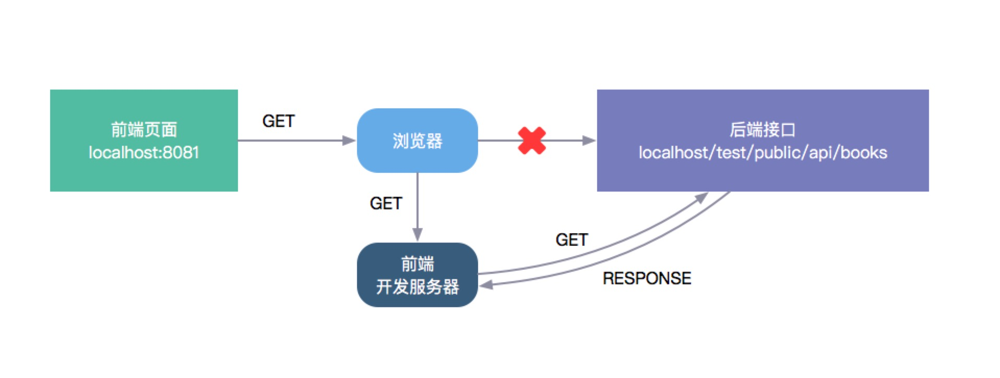

### 4.3.2 proxyTable配置

1. 修改api方法中url的定义,请求前加/api前缀

   * src/module/cms/api/cms.js

   ```javascript
   import http from './../../../base/api/public'
   let sysConfig = require('@/../config/sysConfig')
   let apiUrl = sysConfig.xcApiUrlPre;
   export const page_list = (page,size,params) => {
     return http.requestQuickGet(apiUrl+'/cms/page/list/'+page+'/'+size)
   }
   ```

2. 在config/index.js下配置proxyTable。

   * config/index.js

   ```javascript
   //...
   '/api/cms': {
     target: 'http://localhost:31001',
     pathRewrite: {
       '^/api': ''
     }
   //...
   ```

## 4.4 分页查询

### 4.4.1 定义分页视图

* src/module/cms/page/page_list.vue

```html
<template>
  <div>
      ...
      <el-pagination
          layout="prev, pager, next"
          :total="total"
          :page-size="params.size"
          :current-page="params.page"
          v-on:current-change="changePage"
          style="float:right">
       </el-pagination>
  </div>
</template>
```

### 4.4.2 定义数据模型对象

```html
<script>
    ...
    data() {
      return {
        list: [],
        total:0,
        params:{
          page:1,
          size:10
        }
      }
    }
</script>
```

### 4.4.3 定义分页方法

```html
<script>
    ...
methods:{
	changePage:function(page){//形参就是当前页码
	  this.params.page = page;
	  this.query()
	}
}
</script>
```

## 4.5 钩子函数

### 4.5.1 介绍

目前实现的功能是进入页面点击查询按钮向服务端表求查询，实际的需求是进入页面立即查询。
这要用到vue的钩子函数，每个 Vue 实例在被创建时都要经过一系列的初始化过程——例如，需要设置数据监听、编译模板、将实例挂载到 DOM 并在数据变化时更新 DOM 等。同时在这个过程中也会运行一些叫做**生命周期钩子的函数**，这给了用户在不同阶段添加自己的代码的机会。

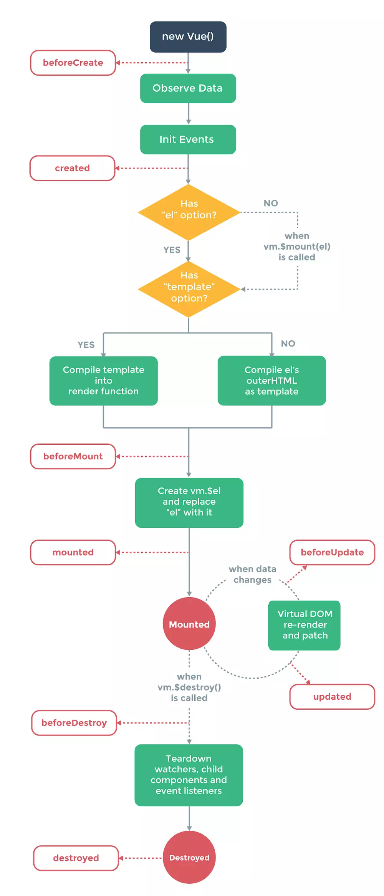

* 参考代码

```html
<!DOCTYPE html>
<html lang="en">
<head>
 <meta charset="UTF-8">
 <script type="text/javascript" src="../assets/js/vue.js"></script>
 <title>构造器的声明周期</title>
</head>
<body>
 <h1>构造器的声明周期</h1>
 <hr>
 <div id="app">
     {{message}}
     <p><button @click="jia">加分</button></p>
 </div>
     <button onclick="app.$destroy()">销毁</button>

 <script type="text/javascript">
     var app=new Vue({
         el:'#app',
         data:{
             message:1
         },
         methods:{
             jia:function(){
                 this.message ++;
             }
         },
         beforeCreate:function(){
             console.log('1-beforeCreate 初始化之后');
         },
         created:function(){
             console.log('2-created 创建完成');
         },
         beforeMount:function(){
             console.log('3-beforeMount 挂载之前');
         },
         mounted:function(){
             console.log('4-mounted 被创建');
         },
         beforeUpdate:function(){
             console.log('5-beforeUpdate 数据更新前');
         },
         updated:function(){
             console.log('6-updated 被更新后');
         },
         activated:function(){
             console.log('7 keep-alive组件激活时调用。该钩子在服务器端渲染期间不被调用 ');
         },
         deactivated:function(){
             console.log('8 keep-alive组件停用时调用。该钩子在服务端渲染期间不被调用。');
         },
         beforeDestroy:function(){
             console.log('9-beforeDestroy 销毁之前');
         },
         destroyed:function(){
             console.log('10-destroyed 销毁之后')
         }

     })
 </script>
</body>
</html>
```

### 4.5.2 应用

* src/module/cms/page/page_list.vue

```html
<script>
    methods:{
      query:function(){
        // alert('查询')
        //调用服务端的接口
        cmsApi.page_list(this.params.page,this.params.size).then((res)=>{
          //将res结果数据赋值给数据模型对象
          this.list = res.queryResult.list;
          this.total = res.queryResult.total;
        })

      },
      ...
    },
    mounted(){
      //当DOM元素渲染完成后调用query
      this.query()
    }
</script>
```

