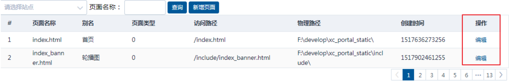
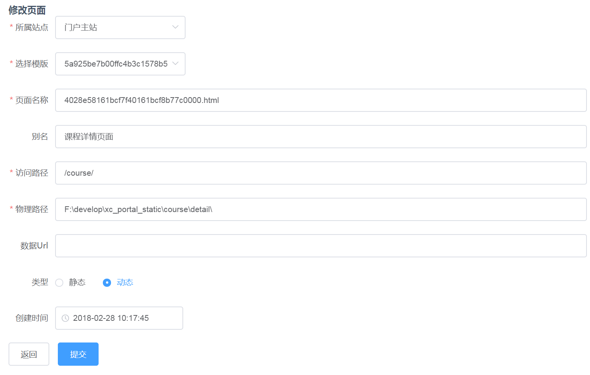
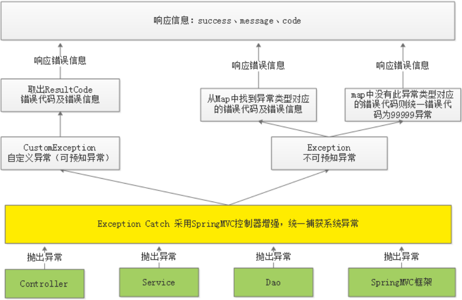

# 1. 自定义条件查询

需求:在页面输入查询条件，查询符合条件的页面信息

查询条件:

1. 站点Id：精确匹配
2. 模板Id：精确匹配
3. 页面别名：模糊匹配

## 1.1 服务端开发

### 1.1.1 Dao

无须自定义条件查询方法,调用父类提供的```findAll(Example<S> example, Pageable pageable)```即可

#### 1.1.1.1 创建Dao

```java
public interface CmsPageRepository extends MongoRepository<CmsPage,String> {
    
}
```

#### 1.1.1.2 测试功能

```java
public void testFindAllByExample() {
    //分页参数
    int page = 0;//从0开始
    int size = 10;
    Pageable pageable = PageRequest.of(page,size);

    //条件值对象
    CmsPage cmsPage= new CmsPage();
    //条件1:要查询5a751fab6abb5044e0d19ea1站点的页面
    cmsPage.setSiteId("5b30b052f58b4411fc6cb1cf");
    //条件2:设置模板id条件
    cmsPage.setTemplateId("5ad9a24d68db5239b8fef199");
    //条件3:设置页面别名
    cmsPage.setPageAliase("轮播");
    //条件匹配器
    ExampleMatcher exampleMatcher = ExampleMatcher.matching();
    exampleMatcher = exampleMatcher
        .withMatcher("pageAliase", 	ExampleMatcher.GenericPropertyMatchers.contains());
   
    //定义Example,封装查询条件和分页对象
    Example<CmsPage> example = Example.of(cmsPage,exampleMatcher);
    Page<CmsPage> all = cmsPageRepository.findAll(example, pageable);
    List<CmsPage> content = all.getContent();
    System.out.println(content);
}
```

### 1.1.2 Service

```java
@Service
public class PageService {

    @Autowired
    CmsPageRepository cmsPageRepository;

    /**
     * 页面查询方法
     * @param page 页码，从1开始记数
     * @param size 每页记录数
     * @param queryPageRequest 查询条件
     * @return
     */
    public QueryResponseResult findList(int page, int size, QueryPageRequest queryPageRequest){
        if(queryPageRequest == null){
            queryPageRequest = new QueryPageRequest();
        }
        //自定义条件查询
        //定义条件匹配器
        ExampleMatcher exampleMatcher = ExampleMatcher.matching()
                .withMatcher("pageAliase", ExampleMatcher.GenericPropertyMatchers.contains());
        //条件值对象
        CmsPage cmsPage = new CmsPage();
        //设置条件值（站点id）
        if(StringUtils.isNotEmpty(queryPageRequest.getSiteId())){
            cmsPage.setSiteId(queryPageRequest.getSiteId());
        }
        //设置模板id作为查询条件
        if(StringUtils.isNotEmpty(queryPageRequest.getTemplateId())){
            cmsPage.setTemplateId(queryPageRequest.getTemplateId());
        }
        //设置页面别名作为查询条件
        if(StringUtils.isNotEmpty(queryPageRequest.getPageAliase())){
            cmsPage.setPageAliase(queryPageRequest.getPageAliase());
        }
        //定义条件对象Example
        Example<CmsPage> example = Example.of(cmsPage,exampleMatcher);
        //分页参数
        if(page <=0){
            page = 1;
        }
        page = page -1;
        if(size<=0){
            size = 10;
        }
        Pageable pageable = PageRequest.of(page,size);
        //实现自定义条件查询并且分页查询
        Page<CmsPage> all = cmsPageRepository.findAll(example,pageable);
        QueryResult queryResult = new QueryResult();
        //数据列表
        queryResult.setList(all.getContent());
        //数据总记录数
        queryResult.setTotal(all.getTotalElements());
        QueryResponseResult queryResponseResult = 
            				new QueryResponseResult(CommonCode.SUCCESS,queryResult);
        return queryResponseResult;
    }
}
```

### 1.1.3 Controller

```java
@GetMapping("/list/{page}/{size}")
public QueryResponseResult findList(@PathVariable("page") int page, 
                                    @PathVariable("size")int size, 
                                    QueryPageRequest queryPageRequest) {
        //调用service
        return pageService.findList(page,size,queryPageRequest);
}
```

### 1.1.4 测试

测试路径:[http://localhost:31001/cms/page/list/1/10](http://localhost:31001/cms/page/list/1/10)

通过SwaggerUI/POSTMan进行测试

## 1.2 前端开发

### 1.2.1 编写页面

* 添加UI

在```src/module/cms/page/page_list.vue```页面添加查询表单

```html
<el-form :model="params">
  <el-select v-model="params.siteId" placeholder="请选择站点">
    <el-option
      v-for="item in siteList"
      :key="item.siteId"
      :label="item.siteName"
      :value="item.siteId">
    </el-option>
  </el-select>
  页面别名：<el-input v-model="params.pageAliase"  style="width: 100px"></el-input>
  <el-button type="primary" size="small" v-on:click="query">查询</el-button>
  <router-link :to="{path:'/cms/page/add',query:{
  					  page:this.params.page,
  					  siteId:this.params.siteId
  					}}">
  </router-link>
</el-form>
```

* 定义数据模型

```javascript
data() {
  return {
    siteList:[],//站点列表
    list: [],
    total:0,
    params:{
      siteId:'',		//站点ID
      pageAliase:'',	//网站别名
      page:1,			
      size:10
    }
  }
}
```

* 在钩子方法中初始化查询条件

```json
mounted(){
  //当DOM元素渲染完成后调用query
  this.query()
  //初始化站点列表
  this.siteList = [
    {
      siteId:'5a751fab6abb5044e0d19ea1',
      siteName:'门户主站'
    },
    {
      siteId:'102',
      siteName:'测试站'
    }
  ]
}
```

### 1.2.2 调用API

* 在```src/module/cms/api/cms.js```中定义查询API

```javascript
import http from './../../../base/api/public'
import querystring from 'querystring'
let sysConfig = require('@/../config/sysConfig')
let apiUrl = sysConfig.xcApiUrlPre;

//页面查询
export const page_list = (page,size,params) =>{
  //将params对象数据拼装成key/value串
  let queryString =  querystring.stringify(params);
  //请求服务端的页面查询接口
  return http.requestQuickGet(apiUrl+'/cms/page/list/'+page+'/'+size+"?"+queryString);
}
```

* 页面调用

```javascript
query:function(){
  // alert('查询')
  //调用服务端的接口
  cmsApi.page_list(this.params.page,this.params.size,this.params).then((res)=>{
    //将res结果数据赋值给数据模型对象
    this.list = res.queryResult.list;
    this.total = res.queryResult.total;
  })
}
```

# 2. 新增页面

页面提交```JSON```数据,服务端接受数据保存到```MongoDB```

## 2.1 接口定义

### 2.1.1 定义响应模型

处理完保存操作后,需要给前端返回保存对象,所以需要重新定义响应模型

```java
@Data
public class CmsPageResult extends ResponseResult {
    CmsPage cmsPage;
    public CmsPageResult(ResultCode resultCode,CmsPage cmsPage) {
        super(resultCode);
        this.cmsPage = cmsPage;
    }
}
```

### 2.1.2 定义添加Api

```java
@Api(value="cms页面管理接口",description = "cms页面管理接口，提供页面的增、删、改、查")
public interface CmsPageControllerApi {
    //新增页面
    @ApiOperation("新增页面")
    public CmsPageResult add(CmsPage cmsPage);
}
```

## 2.2 页面服务端开发

### 2.2.1 页面唯一索引

在cms_page集合上创建页面名称、站点Id、页面webpath为唯一索引,通过唯一索引保证页面的唯一性.

### 2.2.2 Dao

* 定义查询唯一索引值方法

```java
public interface CmsPageRepository extends MongoRepository<CmsPage,String> {
    //根据页面名称、站点Id、页面webpath查询
    CmsPage findByPageNameAndSiteIdAndPageWebPath(String pageName,String siteId,String pageWebPath);
}
```

* 保存方法使用父类的```save```方法

### 2.2.3 Service

```java
 //添加页面
 public CmsPageResult add(CmsPage cmsPage){
		//校验页面是否存在，根据页面名称、站点Id、页面webpath查询        
        CmsPage cmsPage1 =cmsPageRepository.findByPageNameAndSiteIdAndPageWebPath(
            											cmsPage.getPageName(),
														cmsPage.getSiteId(), 
            											cmsPage.getPageWebPath());
    	if(cmsPage1==null){
    	    cmsPage.setPageId(null);//添加页面主键由spring data 自动生成
    	    cmsPageRepository.save(cmsPage);
    	    //返回结果
    	    CmsPageResult cmsPageResult = new CmsPageResult(CommonCode.SUCCESS,cmsPage);
    	    return cmsPageResult;
    	}
    return new CmsPageResult(CommonCode.FAIL,null);
}
```

### 2.2.4 Controller

```java
//添加页面
@Override
@PostMapping("/add")
public CmsPageResult add(@RequestBody CmsPage cmsPage) {
    return pageService.add(cmsPage);
}
```

通过```swagger```或者```postMan```测试

## 2.3 前端开发

### 2.3.1 新增页面

#### 2.3.1.1 编写```page_add.vue```

1. 创建新增页面

```src/module/cms/page/page_add.vue```

2. 配置路由

```{path:'/cms/page/add',name:'新增页面',component: page_add,hidden:true}```

3. 在列表页面上增加添加按钮

```router-link```是```vue```提供的路由功能，用于在页面生成路由链接，最终在```html```渲染后就是```<a>```标签。

```to：```目标路由地址

```html
<router‐link class="mui‐tab‐item" :to="{path:'/cms/page/add/'}">
  <el‐button  type="primary" size="small">新增页面</el‐button>
</router‐link>
```

4. 完善新增页面内容

```html
<template>
<div>
  <el-form   :model="pageForm" label-width="80px" :rules="pageFormRules" ref="pageForm">
    <el-form-item label="所属站点" prop="siteId">
      <el-select v-model="pageForm.siteId" placeholder="请选择站点">
        <el-option
          v-for="item in siteList"
          :key="item.siteId"
          :label="item.siteName"
          :value="item.siteId">
        </el-option>
      </el-select>
    </el-form-item>
    <el-form-item label="选择模版" prop="templateId">
      <el-select v-model="pageForm.templateId" placeholder="请选择">
        <el-option
          v-for="item in templateList"
          :key="item.templateId"
          :label="item.templateName"
          :value="item.templateId">
        </el-option>
      </el-select>
    </el-form-item>
    <el-form-item label="页面名称" prop="pageName">
      <el-input v-model="pageForm.pageName" auto-complete="off" ></el-input>
    </el-form-item>

    <el-form-item label="别名" prop="pageAliase">
      <el-input v-model="pageForm.pageAliase" auto-complete="off" ></el-input>
    </el-form-item>
    <el-form-item label="访问路径" prop="pageWebPath">
      <el-input v-model="pageForm.pageWebPath" auto-complete="off" ></el-input>
    </el-form-item>

    <el-form-item label="物理路径" prop="pagePhysicalPath">
      <el-input v-model="pageForm.pagePhysicalPath" auto-complete="off" ></el-input>
    </el-form-item>

    <el-form-item label="类型">
      <el-radio-group v-model="pageForm.pageType">
        <el-radio class="radio" label="0">静态</el-radio>
        <el-radio class="radio" label="1">动态</el-radio>
      </el-radio-group>
    </el-form-item>
    <el-form-item label="创建时间">
      <el-date-picker type="datetime" placeholder="创建时间" v-model="pageForm.pageCreateTime"></el-date-picker>
    </el-form-item>

  </el-form>
  <div slot="footer" class="dialog-footer">
    <el-button type="primary" @click="addSubmit" >提交</el-button>
    <el-button type="primary" @click="go_back" >返回</el-button>
  </div>
</div>
</template>
```

5. 数据对象

   静态数据显示

```json
data(){
  return {
    //站点列表
    siteList:[],
    //模版列表
    templateList:[],
    //新增界面数据
    pageForm: {
      siteId:'',
      templateId:'',
      pageName: '',
      pageAliase: '',
      pageWebPath: '',
      pageParameter:'',
      pagePhysicalPath:'',
      pageType:'',
      pageCreateTime: new Date()
    }
  }
},
methods:{
  addSubmit(){
alert("提交")    
  }
}
```

6. 站点和模板数据

```json
created:function(){
  //初始化站点列表
  this.siteList = [
    {
      siteId:'5a751fab6abb5044e0d19ea1',
      siteName:'门户主站'
    },
    {
      siteId:'102',
      siteName:'测试站'
    }
  ]
  //模板列表
  this.templateList = [
    {
      templateId:'5a962b52b00ffc514038faf7',
      templateName:'首页'
    },
    {
      templateId:'5a962bf8b00ffc514038fafa',
      templateName:'轮播图'
    }
  ]
}
```

7. 测试

#### 2.3.1.2 添加返回

在新增页面上添加返回按钮,方便用户返回查询列表

1. 在列表页面的新增按钮带上页码参数,方法通过路由传递到新增页面

```html
<router‐link class="mui‐tab‐item" :to="{path:'/cms/page/add/',query:{
  page: this.params.page,
  siteId: this.params.siteId}}">
  <el‐button  type="primary" size="small">新增页面</el‐button>
</router‐link>
```

2. 在新增页面定义返回方法

```html
<el‐button type="primary" @click="go_back" >返回</el‐button>
```

```javascript
//返回方法
go_back(){
  this.$router.push({
    path: '/cms/page/list', query: {
      page: this.$route.query.page,
      siteId:this.$route.query.siteId
    }
  })
}
```

```this.$route.query``` 表示取出路由上的参数列表，有两个取路由参数的方法：

* 通过在路由上添加key/value串使用this.```$route.query```来取参数，例如：```/router1?id=456```可以通过```this.$route.query.id```获取参数id的值。
* 通过将参数作为路由一部分进行传参数使用this.```$route.params```来获取，例如：定义的路由为```/router1/:id```,请求```/router1/123```时可以通过```this.$route.params.id```来获取，此种情况用```this.$route.query.id```是拿不到的。

3. 在钩子方法中获取新增页面传递的参数,回显当前页码

   返回URL:http://localhost:12000/#/cms/page/list?page=2&siteId=5a751fab6abb5044e0d19ea1

```javascript
//钩子方法中获取URL(路由)中的参数
created(){
  //取出路由中的参数，赋值给数据对象
  this.params.page = Number.parseInt(this.$route.query.page || 1)
  this.params.siteId = this.$route.query.siteId || ''
}
```

#### 2.3.1.3 表单校验

1. 配置校验规则

   Element-UI的Form组件提供表单校验的方法,在```form```属性上配置```rules```（表单验证规则）,并添加```ref```作为表单的引用

```html
<el‐form   :model="pageForm" :rules="pageFormRules" label‐width="80px" ref="pageForm">
```

2. 在数据模型中配置校验规则

```javascript
pageFormRules: {
  siteId:[
    {required: true, message: '请选择站点', trigger: 'blur'}
  ],
  templateId:[
    {required: true, message: '请选择模版', trigger: 'blur'}
  ],
  pageName: [
    {required: true, message: '请输入页面名称', trigger: 'blur'}
  ],
  pageWebPath: [
    {required: true, message: '请输入访问路径', trigger: 'blur'}
  ],
  pagePhysicalPath: [
    {required: true, message: '请输入物理路径', trigger: 'blur'}
  ]
}
```

3. 执行校验

```javascript
this.$refs.pageForm.validate((valid) => {
        if (valid) {
          alert('提交');
        } else {
          alert('校验失败');
          return false;
        }
})
```

### 2.3.2 Api调用

1. 在```cms.js```中定义```page_add```方法

```javascript
/*页面添加*/
export const page_add = params => {
  return http.requestPost(apiUrl+'/cms/page/add',params)
}
```

2. 添加事件

```javascript
addSubmit:function(){
  this.$refs['pageForm'].validate((valid) => {
    if (valid) {//表单校验成功
      //确认提示
      this.$confirm('您确认提交吗?', '提示', { }).then(() => {
        //调用page_add方法请求服务端的新增页面接口
        cmsApi.page_add(this.pageForm).then(res=>{
          //解析服务端响应内容
          if(res.success){
            this.$message.success("提交成功")
            //将表单清空
            this.$refs['pageForm'].resetFields();
          }else if(res.message){
            this.$message.error(res.message)
          }else{
            this.$message.error("提交失败")
          }
        });
      })

    }
  });
}
```

# 3. 修改页面

修改页面用户操作流程：

1. 用户进入修改页面，在页面上显示了修改页面的信息
2. 用户修改页面的内容，点击“提交”，提示“修改成功”或“修改失败”

## 3.1 接口定义

```java
@ApiOperation("通过ID查询页面")
public CmsPage findById(String id);

@ApiOperation("修改页面")
public CmsPageResult edit(String id,CmsPage cmsPage);
```

提交方式使用```post```、```put```都可以，只是根据```http```方法的规范，```put```方法是对服务器指定资源进行修改，所以这里使用```put```方法对页面修改进行修改。

## 3.2 服务端开发

### 3.2.1 Dao

使用 Spring Data提供的findById方法完成根据主键查询 。
使用 Spring Data提供的save方法完成数据保存 。

### 3.2.2 Service

1. 根据主键查询页面数据

```java
public CmsPage getById(String id){
    Optional<CmsPage> optional = cmsPageRepository.findById(id);
    if(optional.isPresent()){
        CmsPage cmsPage = optional.get();
        return cmsPage;
    }
    return null;
}
```

2. 更新页面数据

```java
public CmsPageResult update(String id,CmsPage cmsPage){
    //如果主键有值,save方法进行更新操作
    cmsPageRepository.save(cmsPage);
    return new CmsPageResult(CommonCode.SUCCESS,cmsPage);
}
```

### 3.2.3 Controller

1. 根据id查询页面

```java
@Override
@GetMapping("/get/{id}")
public CmsPage findById(@PathVariable("id") String id) {
    return pageService.getById(id);
}
```

2. 保存页面信息

```java
@Override
@PutMapping("/edit/{id}")//这里使用put方法，http 方法中put表示更新
public CmsPageResult edit(@PathVariable("id") String id, @RequestBody CmsPage cmsPage) {
    return pageService.update(id,cmsPage);
}
```

## 3.3 前端开发

### 3.3.1 修改页面处理流程

1. 进入页面，通过钩子方法请求服务端获取页面信息，并赋值给数据模型对象
2. 页面信息通过数据绑定在表单显示
3. 用户修改信息点击“提交”请求服务端修改页面信息接口

### 3.3.2 修改页面

#### 3.3.2.1 编写```page_edit```页面

修改页面的布局同添加页面，可以直接复制添加页面，在添加页面基础上修改。

1. 编写```page_edit.vue```

   UI通过保存页面

```java
<template>
  <div>
    <el-form   :model="pageForm" label-width="80px" :rules="pageFormRules" ref="pageForm" >
      <el-form-item label="所属站点" prop="siteId">
        <el-select v-model="pageForm.siteId" placeholder="请选择站点">
          <el-option
            v-for="item in siteList"
            :key="item.siteId"
            :label="item.siteName"
            :value="item.siteId">
          </el-option>
        </el-select>
      </el-form-item>
      <el-form-item label="选择模版" prop="templateId">
        <el-select v-model="pageForm.templateId" placeholder="请选择">
          <el-option
            v-for="item in templateList"
            :key="item.templateId"
            :label="item.templateName"
            :value="item.templateId">
          </el-option>
        </el-select>
      </el-form-item>
      <el-form-item label="页面名称" prop="pageName">
        <el-input v-model="pageForm.pageName" auto-complete="off" ></el-input>
      </el-form-item>

      <el-form-item label="别名" prop="pageAliase">
        <el-input v-model="pageForm.pageAliase" auto-complete="off" ></el-input>
      </el-form-item>
      <el-form-item label="访问路径" prop="pageWebPath">
        <el-input v-model="pageForm.pageWebPath" auto-complete="off" ></el-input>
      </el-form-item>

      <el-form-item label="物理路径" prop="pagePhysicalPath">
        <el-input v-model="pageForm.pagePhysicalPath" auto-complete="off" ></el-input>
      </el-form-item>
      <el-form-item label="数据Url" prop="dataUrl">
        <el-input v-model="pageForm.dataUrl" auto-complete="off" ></el-input>
      </el-form-item>
      <el-form-item label="类型">
        <el-radio-group v-model="pageForm.pageType">
          <el-radio class="radio" label="0">静态</el-radio>
          <el-radio class="radio" label="1">动态</el-radio>
        </el-radio-group>
      </el-form-item>
      <el-form-item label="创建时间">
        <el-date-picker type="datetime" placeholder="创建时间" v-model="pageForm.pageCreateTime"></el-date-picker>
      </el-form-item>

    </el-form>
    <div slot="footer" class="dialog-footer">
      <el-button @click="go_back">返回</el-button>
      <el-button type="primary" @click.native="editSubmit" :loading="addLoading">提交</el-button>
    </div>
  </div>
</template>
```

2. 配置路由

```json
import page_edit from '@/module/cms/page/page_edit.vue';
{path:'/cms/page/edit/:pageId', name:'修改页面',component: page_edit,hidden:true}
```

3. 在列表页面列表添加“编辑”按钮

```html
<el‐table‐column label="操作" width="80">
  <template slot‐scope="page">
    <el‐button
      size="small"type="text"		
      @click="edit(page.row.pageId)">编辑
    </el‐button>
  </template>
</el‐table‐column>
```

4. 编写编辑方法

```javascript
edit:function (pageId) {
  this.$router.push({ path: '/cms/page/edit/'+pageId,query:{
    page: this.params.page,
    siteId: this.params.siteId}})
}
```

5. 测试效果



#### 3.3.2.2 页面内容显示

1. 定义Api方法

```javascript
/*页面查询*/
export const page_get = id => {
  return http.requestQuickGet(apiUrl+'/cms/page/get/'+id)
}
```

2. 定义数据对象

   进入修改页面传入pageId参数，在数据模型中添加pageId,保证修改完毕后,回到当前页的位置

```json
data(){
      return {
    	...
        //页面id
        pageId:''
    	...
	}
}
```

3. 在钩子方法中查询页面信息

```javascript
created: function () {
  //页面参数通过路由传入，这里通过this.$route.params来获取
  this.pageId=this.$route.params.pageId;
  //根据主键查询页面信息
  cmsApi.page_get(this.pageId).then((res) => {
    console.log(res);
    if(res.success){
      this.pageForm = res.cmsPage;
    }
  });
}
```

5. 浏览效果



### 3.3.3 修改Api调用

1. 定义api方法

```javascript
/*页面修改，采用put方法*/
export const page_edit = (id,params) => {
  return http.requestPut(apiUrl+'/cms/page/edit/'+id,params)
}
```

2. 提交按钮方法

```html
<el‐button type="primary" @click="editSubmit" >提交</el‐button>
```

3. 提交事件方法

```javascript
editSubmit(){
  this.$refs.pageForm.validate((valid) => {
    if (valid) {
      this.$confirm('确认提交吗？', '提示', {}).then(() => {
        cmsApi.page_edit(this.pageId,this.pageForm).then((res) => {
            console.log(res);
          if(res.success){
            this.$message({
              message: '修改成功',
              type: 'success'
            });
            //自动返回
            this.go_back();
          }else{
            this.$message.error('修改失败');
          }
        });
      });
    }
  });
}
```

4. 测试功能

# 4. 删除页面

用户操作流程：

1. 用户进入用户列表，点击“删除”
2. 执行删除操作，提示“删除成功”或“删除失败”

## 4.1 接口定义

```java
@ApiOperation("通过ID删除页面")
public ResponseResult delete(String id);
```

## 4.2 服务端开发

### 4.2.1 Dao
使用 Spring Data提供的deleteById方法完成删除操作 。

### 4.2.2 Service

```java
//删除页面
public ResponseResult delete(String id){
    CmsPage one = this.getById(id);
    if(one!=null){
        //删除页面
        cmsPageRepository.deleteById(id);
        return new ResponseResult(CommonCode.SUCCESS);
    }
    return new ResponseResult(CommonCode.FAIL);
}
```

### 4.2.3 Controller

```java
@DeleteMapping("/del/{id}") //使用http的delete方法完成岗位操作
public ResponseResult delete(@PathVariable("id") String id) {
    return pageService.delete(id);
}
```

## 4.3  前端开发

### 4.3.1 Api方法

```java
/*页面删除*/
export const page_del = id => {
  return http.requestDelete(apiUrl+'/cms/page/del/'+id)
}
```

### 4.3.2编写页面

1. 在```page_list.vue```页面总添加删除按钮

```html
<el‐table‐column label=" 操作" width="120">
  <template slot‐scope="page">
    <el‐button
      size="small"type="text"
      @click="edit(page.row.pageId)">编辑
    </el‐button>
    <el‐button
      size="small"type="text"
      @click="del(page.row.pageId)">删除
    </el‐button>
  </template>
</el‐table‐column>
```

2. 删除事件

```javascript
// 删除
del:function (pageId) {
  this.$confirm('确认删除此页面吗?', '提示', {}).then(() => {
    cmsApi.page_del(pageId).then((res)=>{
      if(res.success){
        this.$message({
          type: 'success',
          message: '删除成功!'
        });
        //查询页面
        this.query()
      }else{
        this.$message({
          type: 'error',
          message: '删除失败!'
        });
      }
    })
  })
}
```

# 5. 异常处理

## 5.1 问题分析

* 问题描述
  1. 异常信息不具体
  2. 异常没有集中处理

* 解决方法:
  1. 在Service方法中的编码顺序是先校验判断，有问题则抛出具体的异常信息，最后执行具体的业务操作，返回成功信息
  2. 在统一异常处理类中去捕获异常，无需controller捕获异常，向用户返回统一规范的响应信息。

* 代码模板

```java
//添加页面
public CmsPageResult method(Object obj){
	//判断obj是否为空
    if(obj==null){
        //抛出异常
    }
    //处理业务,判断是否存在业务异常
    
    //执行业务操作
    
    //返回处理结果
    return new Result(code,message);
}
```

## 5.2 异常处理

### 5.2.1 异常处理思路

1. 自定义异常类型。

2. 自定义错误代码及错误信息。

3. 对于可预知的异常由程序员在代码中主动抛出，由SpringMVC统一捕获。

   可预知异常是程序员在代码中手动抛出本系统定义的特定异常类型，由于是程序员抛出的异常，通常异常信息比较齐全，程序员在抛出时会指定错误代码及错误信息，获取异常信息也比较方便。

4. 对于不可预知的异常（运行时异常）由SpringMVC统一捕获Exception类型的异常。
不可预知异常通常是由于系统出现bug、或一些不要抗拒的错误（比如网络中断、服务器宕机等），异常类型为```RuntimeException```类型（运行时异常）。

5. 可预知的异常及不可预知的运行时异常最终会采用统一的信息格式(错误代码+错误信息)来表示，最终也会随请求响应给客户端

### 5.2.2 异常处理流程



1. 在```controller、service、dao```中程序员抛出自定义异常；```springMVC```框架抛出框架异常类型
2. 统一由异常捕获类捕获异常，并进行处理
3. 捕获到自定义异常则直接取出错误代码及错误信息，响应给用户。
4. 捕获到非自定义异常类型首先从```Map```中找该异常类型是否对应具体的错误代码，如果有则取出错误代码和错误信息并响应给用户，如果从Map中找不到异常类型所对应的错误代码则统一为99999错误代码并响应给用户。
5. 将错误代码及错误信息以```Json```格式响应给用户。

## 5.3 可预知异常处理

### 5.3.1 自定义异常类

```java
public class CustomException extends RuntimeException {
    private ResultCode resultCode;
    public CustomException(ResultCode resultCode) {
       //异常信息为错误代码+异常信息
       super("错误代码："+resultCode.code()+"错误信息："+resultCode.message());
       this.resultCode = resultCode;
    }
    public ResultCode getResultCode(){
        return this.resultCode;
    }
}
```

### 5.3.2 异常抛出类

```java
public class ExceptionCast {
    //使用此静态方法抛出自定义异常
    public static void cast(ResultCode resultCode){
        throw new CustomException(resultCode);
    }
}
```

### 5.3.3 异常捕获类

```java
@ControllerAdvice
public class ExceptionCatch {
    private static final Logger LOGGER = LoggerFactory.getLogger(ExceptionCatch.class);
    //捕获 CustomException异常
    @ExceptionHandler(CustomException.class)
    @ResponseBody
    public ResponseResult customException(CustomException e) {
        LOGGER.error("catch exception : {}\r\nexception: ",e.getMessage(), e);
        ResultCode resultCode = e.getResultCode();
        ResponseResult responseResult = new ResponseResult(resultCode);
        return responseResult;
    }
}
```

### 5.3.4 异常处理测试

#### 5.3.4.1 定义错误代码

```java
@ToString
public enum CmsCode implements ResultCode {
    CMS_ADDPAGE_EXISTSNAME(false,24001,"页面名称已存在！"),
    //操作代码
    boolean success;
    //操作代码
    int code;
    //提示信息
    String message;
    private CmsCode(boolean success, int code, String message){
        this.success = success;
        this.code = code;
        this.message = message;
    }

    @Override
    public boolean success() {
        return success;
    }

    @Override
    public int code() {
        return code;
    }

    @Override
    public String message() {
        return message;
    }
}
```

#### 5.3.4.2 异常处理测试

1. 抛出异常

   在controller、service、 dao中都可以抛出异常。

   修改PageService的add方法，添加抛出异常的代码

```java
//校验页面是否存在，根据页面名称、站点Id、页面webpath查询
CmsPage cmsPage1 =cmsPageRepository.findByPageNameAndSiteIdAndPageWebPath(cmsPage.getPageName(),
cmsPage.getSiteId(), cmsPage.getPageWebPath());
if(cmsPage1 !=null){
     //校验页面是否存在，已存在则抛出异常
    ExceptionCast.cast(CmsCode.CMS_ADDPAGE_EXISTS);
}
```

2. 启动工程，扫描到异常捕获的类ExceptionCatch

   在springBoot的启动类中添加包扫描

```java
@ComponentScan(basePackages="com.xuecheng.framework")//扫描common工程下的类
```

3. 前端测试异常处理

```javascript
addSubmit(){
  this.$refs.pageForm.validate((valid) => {
    if (valid) {
      this.$confirm('确认提交吗？', '提示', {}).then(() => {
        cmsApi.page_add(this.pageForm).then((res) => {
            console.log(res);
          if(res.success){
            this.$message({
              message: '提交成功',
              type: 'success'
            });
            this.$refs['pageForm'].resetFields();
          }else if(res.message){
            this.$message.error(res.message);
          }else{
            this.$message.error('提交失败');
          }
        });
      });
    }
  });
}
```

## 5.4 不可预知异常处理

### 5.4.1 定义异常捕获方法

#### 5.4.1.1 异常抛出测试

使用postman测试添加页面，不输入cmsPost信息，提交，报错信息如下：

```java
org.springframework.http.converter.HttpMessageNotReadableException
此异常是springMVC在进行参数转换时报的错误。
```

具体响应信息

```json
{
    "timestamp": 1528712906727,
    "status": 400,
    "error": "Bad Request",
    "exception": "org.springframework.http.converter.HttpMessageNotReadableException",
    "message": "Required request body is missing: public
				com.xuecheng.framework.domain.cms.response.CmsPageResult
				com.xuecheng.manage_cms.web.controller.CmsPageController.add(
    					com.xuecheng.framework.domain.cms.CmsPage)",
    "path": "/cms/page/add"
}
```

上边的响应信息在客户端是无法解析的。

在异常捕获类中添加对Exception异常的捕获：

```java
@ExceptionHandler(Exception.class)
@ResponseBody
public ResponseResult exception(Exception exception){
    //记录日志
    LOGGER.error("catch exception:{}",exception.getMessage());
    return null;
}
```

#### 5.4.1.2 异常捕获方法

针对上边的问题其解决方案是：

1. 我们在map中配置HttpMessageNotReadableException和错误代码。
2. 在异常捕获类中对Exception异常进行捕获，并从map中获取异常类型对应的错误代码，如果存在错误代码则返回此错误，否则统一返回99999错误。

具体的开发实现如下：

1. 在通用错误代码类CommCode中配置非法参数异常

```java
INVALID_PARAM(false,10003,"非法参数！")
```

2. 在异常捕获类中配置 HttpMessageNotReadableException 为非法参数异常。

```java
@ControllerAdvice
public class ExceptionCatch {
    private static final Logger LOGGER = LoggerFactory.getLogger(ExceptionCatch.class);
    //使用EXCEPTIONS存放异常类型和错误代码的映射，ImmutableMap的特点的一旦创建不可改变，并且线程安全
    private static ImmutableMap<Class<? extends Throwable>,ResultCode> EXCEPTIONS;
    //使用builder来构建一个异常类型和错误代码的异常
    protected static ImmutableMap.Builder<Class<? extends Throwable>,ResultCode> builder =
ImmutableMap.builder();
    //捕获Exception异常
    @ResponseBody
    @ExceptionHandler(Exception.class)
    public ResponseResult exception(Exception e) {
        LOGGER.error("catch exception : {}\r\nexception: ",e.getMessage(), e);
        if(EXCEPTIONS == null)
            EXCEPTIONS = builder.build();
        final ResultCode resultCode = EXCEPTIONS.get(e.getClass());
        final ResponseResult responseResult;
        if (resultCode != null) {
            responseResult = new ResponseResult(resultCode);
        } else {
            responseResult = new ResponseResult(CommonCode.SERVER_ERROR);
        }
        return responseResult;
    }
    //捕获 CustomException异常
    @ExceptionHandler(CustomException.class)
    @ResponseBody
    public ResponseResult customException(CustomException e) {
        LOGGER.error("catch exception : {}\r\nexception: ",e.getMessage(), e);
        ResultCode resultCode = e.getResultCode();
        ResponseResult responseResult = new ResponseResult(resultCode);
        return responseResult;
            static{
        //在这里加入一些基础的异常类型判断
        builder.put(HttpMessageNotReadableException.class,CommonCode.INVALIDPARAM);
    }
}
```

### 5.4.2 异常处理测试

模拟“问题测试”中的测试步骤，异常结果为“非法参数”。