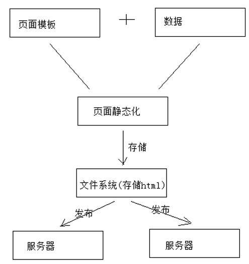
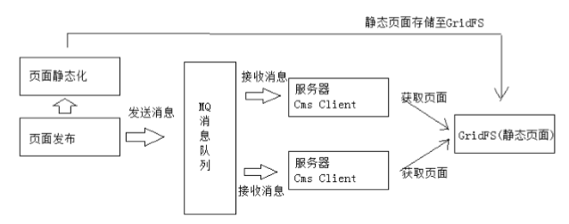
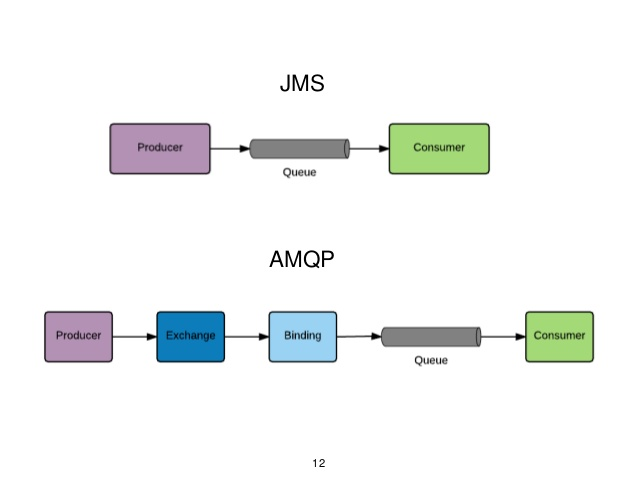
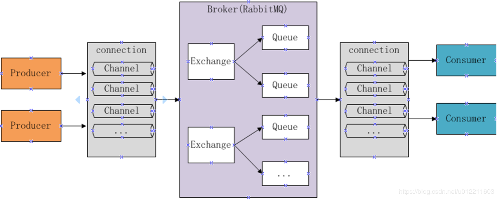
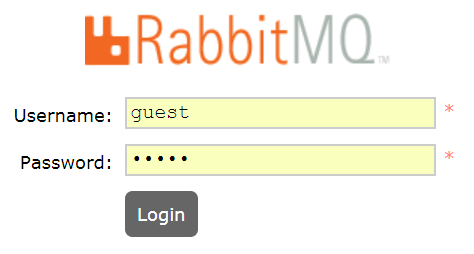
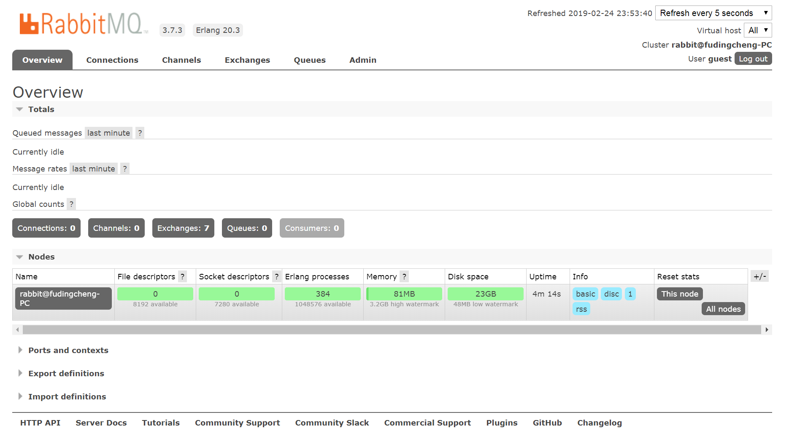

# 1. 页面发布

目前为止,我们已经完成了页面静态化的部分,接下来就要实现页面发布



## 需求分析

页面发布流程:



1. 管理员进入管理界面点击“页面发布”，前端请求cms页面发布接口。

2. cms页面发布接口执行页面静态化，并将静态化页面(html文件)存储至GridFS中。

3. 静态化成功后，向消息队列发送页面发布的消息。

   - 页面发布的最终目标是将页面发布到服务器。

   - 通过消息队列将页面发布的消息发送给各各服务器。

4. 消息队列负责将消息发送给各各服务器上部署的Cms Client(Cms客户端)。

   在服务器上部署Cms Client(Cms客户端)，客户端接收消息队列的通知。

5. 每个接收到页面发布消息的Cms Client从GridFS获取Html页面文件，并将Html文件存储在本地服务器。

   CmsClient根据页面发布消息的内容请求GridFS获取页面文件，存储在本地服务器。


# 2. RabbitMQ

## 2.1 介绍

MQ全称为Message Queue，即消息队列，RabbitMQ是由erlang语言开发，基于AMQP（Advanced Message Queue 高级消息队列协议）协议实现的消息队列，它是一种应用程序之间的通信方法，消息队列在分布式系统开发中应用非常广泛。

官网地址:[http://www.rabbitmq.com/](http://www.rabbitmq.com/)

### 2.1.1 应用场景

1. 任务异步处理。

   将不需要同步处理的并且耗时长的操作由消息队列通知消息接收方进行异步处理。提高了应用程序的响应效率。

2. 应用程序解耦合

   MQ相当于一个中介，生产方通过MQ与消费方交互，它将应用程序进行解耦合。

3. 流量削峰

   将用户的请求数据存入MQ中,消费方异步的从MQ中取出数据进行处理.

### 2.1.2 优点

1. 使得简单，功能强大。
2. 基于AMQP协议。
3. 社区活跃，文档完善。
4. 高并发性能好，这主要得益于Erlang语言。
5. Spring Boot默认已集成RabbitMQ

### 2.1.3 AMQP

**高级消息队列协议**即**Advanced Message Queuing Protocol**（AMQP）是一个用于统一[面向消息中间件](https://zh.wikipedia.org/w/index.php?title=%E9%9D%A2%E5%90%91%E6%B6%88%E6%81%AF%E4%B8%AD%E9%97%B4%E4%BB%B6&action=edit&redlink=1)实现的一套标准协议，其设计目标是对于*消息*的排序、路由（包括点对点和[订阅-发布](https://zh.wikipedia.org/wiki/%E5%8F%91%E5%B8%83/%E8%AE%A2%E9%98%85)）、保持可靠性、保证安全性[[1\]](https://zh.wikipedia.org/wiki/%E9%AB%98%E7%BA%A7%E6%B6%88%E6%81%AF%E9%98%9F%E5%88%97%E5%8D%8F%E8%AE%AE#cite_note-acmqueue-1)。高级消息队列协议保证了由不同提供商发行的客户端之间的[互操作性](https://zh.wikipedia.org/wiki/%E4%BA%92%E6%93%8D%E4%BD%9C%E6%80%A7)。与先前的中间件标准（如[Java消息服务](https://zh.wikipedia.org/wiki/Java%E6%B6%88%E6%81%AF%E6%9C%8D%E5%8A%A1)），在特定的API接口层面和实现行为进行了统一不同，高级消息队列协议关注于各种消息如何作为字节流进行传递。因此，使用了符合协议实现的任意应用程序之间可以保持对消息的创建、传递。

### 2.1.4 AMQP VS JMS



|              | JMS                                                          | AMQP                                                         |
| ------------ | ------------------------------------------------------------ | ------------------------------------------------------------ |
| **定义**     | Java api,即一组标准的API                                     | Wire-protocol,一种数据通讯协议                               |
| **跨语言**   | 否                                                           | 是                                                           |
| **跨平台**   | 否                                                           | 是                                                           |
| **消息模型** | 1. 点对点                                                    | 1. direct exchange                                           |
|              | 2. 发布/订阅                                                 | 2. fanout exchange                                           |
|              |                                                              | 3. topic change                                              |
|              |                                                              | 4. headers exchange                                          |
|              |                                                              | 5. system exchange                                           |
| **消息类型** | 1. TextMessage                                               | byte[]                                                       |
|              | 2. MapMessage                                                |                                                              |
|              | 3. BytesMessage                                              |                                                              |
|              | 4. StreamMessage                                             |                                                              |
|              | 5. ObjectMessage                                             |                                                              |
| **综合评价** | JMS 定义了JAVA API层面的标准；在java体系中，多个client均可以通过JMS进行交互，不需要应用修改代码，但是其对跨平台的支持较差； | AMQP定义了wire-level层的协议标准；天然具有跨平台、跨语言特性。 |

## 2.2 工作原理

### 2.2.1 原理图



组成部分说明如下：

* Broker：消息队列服务进程，此进程包括两个部分：Exchange和Queue。
* Exchange：消息队列交换机，按一定的规则将消息路由转发到某个队列，对消息进行过虑。
* Queue：消息队列，存储消息的队列，消息到达队列并转发给指定的消费方。
* Producer：消息生产者，即生产方客户端，生产方客户端将消息发送到MQ。
* Consumer：消息消费者，即消费方客户端，接收MQ转发的消息。

### 2.2.2 发送消息

1. 生产者和Broker建立TCP连接。
2. 生产者和Broker建立通道。
3. 生产者通过通道消息发送给Broker，由Exchange将消息进行转发。
4. Exchange将消息转发到指定的Queue（队列）

### 2.2.3 消费消息

1. 消费者和Broker建立TCP连接
2. 消费者和Broker建立通道
3. 消费者监听指定的Queue（队列）
4. 当有消息到达Queue时Broker默认将消息推送给消费者。
5. 消费者接收到消息。

## 2.3 下载安装

RabbitMQ由Erlang语言开发，Erlang语言用于并发及分布式系统的开发，在电信领域应用广泛，OTP（OpenTelecom Platform）作为Erlang语言的一部分，包含了很多基于Erlang开发的中间件及工具库，安装RabbitMQ需要安装Erlang/OTP，并保持版本匹配
RabbitMQ的下载地址：http://www.rabbitmq.com/download.html

### 2.3.1 安装步骤

1. 安装erlang

   下载地址:http://erlang.org/download/otp_win64_20.3.exe
   erlang安装完成需要配置erlang环境变量： ERLANG_HOME=XXX\erl9.3 在path中添加%ERLANG_HOME%\bin;

2. 安装RabbitMQ

   下载地址:https://github.com/rabbitmq/rabbitmq-server/releases/tag/v3.7.3

3. 安装并运行服务

```shell
# 安装服务
rabbitmq-service.bat install
# 停止服务
rabbitmq-service.bat stop
# 启动服务
rabbitmq-service.bat start 
```

4. 安装管理插件

   安装rabbitMQ的管理插件，方便在浏览器端管理RabbitMQ

```shell
rabbitmq-plugins.bat enable rabbitmq_management
```

5. 启动成功,登录RabbitMQ

   进入浏览器，输入：http://localhost:15672



用户名和密码:guest/guest



### 2.3.2 注意事项

1. 安装erlang和rabbitMQ以管理员身份运行。

2. 当卸载重新安装时会出现RabbitMQ服务注册失败，此时需要进入注册表清理erlang.

   搜索RabbitMQ、ErlSrv，将对应的项全部删除。

## 2.4 入门案例


### 2.4.1 搭建环境

创建生产者和消费者Maven工程,加入RabbitMQ的Java客户端的依赖

```xml
<dependency>
    <groupId>com.rabbitmq</groupId>
    <artifactId>amqp‐client</artifactId>
    <version>4.0.3</version><!‐‐此版本与spring boot 1.5.9版本匹配‐‐>
</dependency>
<dependency>
    <groupId>org.springframework.boot</groupId>
    <artifactId>spring‐boot‐starter‐logging</artifactId>
</dependency>
```

### 2.4.2 生产者

```java
public class Producer01 {

    //队列
    private static final String QUEUE = "helloworld";

    public static void main(String[] args) {
        //通过连接工厂创建新的连接和mq建立连接
        ConnectionFactory connectionFactory = new ConnectionFactory();
        connectionFactory.setHost("127.0.0.1");
        connectionFactory.setPort(5672);//端口
        connectionFactory.setUsername("guest");
        connectionFactory.setPassword("guest");
        //设置虚拟机，一个mq服务可以设置多个虚拟机，每个虚拟机就相当于一个独立的mq
        connectionFactory.setVirtualHost("/");

        Connection connection = null;
        Channel channel = null;
        try {
            //建立新连接
            connection = connectionFactory.newConnection();
            //创建会话通道,生产者和mq服务所有通信都在channel通道中完成
            channel = connection.createChannel();
            //声明队列，如果队列在mq 中没有则要创建
            //参数：String queue, boolean durable, boolean exclusive, boolean autoDelete, Map<String, Object> arguments
            /**
             * 参数明细
             * 1、queue 队列名称
             * 2、durable 是否持久化，如果持久化，mq重启后队列还在
             * 3、exclusive 是否独占连接，队列只允许在该连接中访问，如果connection连接关闭队列则自动删除,如果将此参数设置true可用于临时队列的创建
             * 4、autoDelete 自动删除，队列不再使用时是否自动删除此队列，如果将此参数和exclusive参数设置为true就可以实现临时队列（队列不用了就自动删除）
             * 5、arguments 参数，可以设置一个队列的扩展参数，比如：可设置存活时间
             */
            channel.queueDeclare(QUEUE,true,false,false,null);
            //发送消息
            //参数：String exchange, String routingKey, BasicProperties props, byte[] body
            /**
             * 参数明细：
             * 1、exchange，交换机，如果不指定将使用mq的默认交换机（设置为""）
             * 2、routingKey，路由key，交换机根据路由key来将消息转发到指定的队列，如果使用默认交换机，routingKey设置为队列的名称
             * 3、props，消息的属性
             * 4、body，消息内容
             */
            //消息内容
            String message = "hello world 黑马程序员";
            channel.basicPublish("",QUEUE,null,message.getBytes());
            System.out.println("send to mq "+message);
        } catch (Exception e) {
            e.printStackTrace();
        } finally {
            //关闭连接
            //先关闭通道
            try {
                channel.close();
            } catch (IOException e) {
                e.printStackTrace();
            } catch (TimeoutException e) {
                e.printStackTrace();
            }
            try {
                connection.close();
            } catch (IOException e) {
                e.printStackTrace();
            }
        }


    }
}
```

### 2.4.3 消费者

```java
public class Consumer01 {

    //队列
    private static final String QUEUE = "helloworld";

    public static void main(String[] args) throws IOException, TimeoutException {
        //通过连接工厂创建新的连接和mq建立连接
        ConnectionFactory connectionFactory = new ConnectionFactory();
        connectionFactory.setHost("127.0.0.1");
        connectionFactory.setPort(5672);//端口
        connectionFactory.setUsername("guest");
        connectionFactory.setPassword("guest");
        //设置虚拟机，一个mq服务可以设置多个虚拟机，每个虚拟机就相当于一个独立的mq
        connectionFactory.setVirtualHost("/");

        //建立新连接
        Connection connection = connectionFactory.newConnection();
        //创建会话通道,生产者和mq服务所有通信都在channel通道中完成
        Channel channel = connection.createChannel();

        //监听队列
        //声明队列，如果队列在mq 中没有则要创建
        //参数：String queue, boolean durable, boolean exclusive, boolean autoDelete, Map<String, Object> arguments
        /**
         * 参数明细
         * 1、queue 队列名称
         * 2、durable 是否持久化，如果持久化，mq重启后队列还在
         * 3、exclusive 是否独占连接，队列只允许在该连接中访问，如果connection连接关闭队列则自动删除,如果将此参数设置true可用于临时队列的创建
         * 4、autoDelete 自动删除，队列不再使用时是否自动删除此队列，如果将此参数和exclusive参数设置为true就可以实现临时队列（队列不用了就自动删除）
         * 5、arguments 参数，可以设置一个队列的扩展参数，比如：可设置存活时间
         */
        channel.queueDeclare(QUEUE,true,false,false,null);

        //实现消费方法
        DefaultConsumer defaultConsumer = new DefaultConsumer(channel){

            /**
             * 当接收到消息后此方法将被调用
             * @param consumerTag  消费者标签，用来标识消费者的，在监听队列时设置channel.basicConsume
             * @param envelope 信封，通过envelope
             * @param properties 消息属性
             * @param body 消息内容
             * @throws IOException
             */
            @Override
            public void handleDelivery(String consumerTag, Envelope envelope, AMQP.BasicProperties properties, byte[] body) throws IOException {
                //交换机
                String exchange = envelope.getExchange();
                //消息id，mq在channel中用来标识消息的id，可用于确认消息已接收
                long deliveryTag = envelope.getDeliveryTag();
                //消息内容
                String message= new String(body,"utf-8");
                System.out.println("receive message:"+message);
            }
        };

        //监听队列
        //参数：String queue, boolean autoAck, Consumer callback
        /**
         * 参数明细：
         * 1、queue 队列名称
         * 2、autoAck 自动回复，当消费者接收到消息后要告诉mq消息已接收，如果将此参数设置为tru表示会自动回复mq，如果设置为false要通过编程实现回复
         * 3、callback，消费方法，当消费者接收到消息要执行的方法
         */
        channel.basicConsume(QUEUE,true,defaultConsumer);

    }
}
```

### 2.4.3 总结

* 消息发送方
  1. 创建连接
  2. 创建通道
  3. 声明队列
  4. 发送消息

* 消息消费方
  1. 创建连接
  2. 创建通道
  3. 声明队列
  4. 监听队列
  5. 接收消息
  6. ack回复

## 2.5 工作模式

### 2.5.1 Work queues


work queues与入门程序相比，多了一个消费端，两个消费端共同消费同一个队列中的消息。

**应用场景：**对于任务过重或任务较多情况使用工作队列可以提高任务处理的速度。

**测试:**

1. 使用入门程序，启动多个消费者。
2. 生产者发送多个消息。

结果:

1. 一条消息只会被一个消费者接收；
2. rabbit采用轮询的方式将消息是平均发送给消费者的；
3. 消费者在处理完某条消息后，才会收到下一条消息。

### 2.5.2 Publish/Subscribe


发布订阅模式：

1. 每个消费者监听自己的队列。
2. 生产者将消息发给broker，由交换机将消息转发到绑定此交换机的每个队列，每个绑定交换机的队列都将接收到消息

案例：

用户通知，当用户充值成功或转账完成系统通知用户，通知方式有短信、邮件多种方法 。

#### 2.5.2.1 生产者

1. 声明Exchange_fanout_inform交换机。
2. 声明两个队列并且绑定到此交换机，绑定时不需要指定routingkey
3. 发送消息时不需要指定routingkey

```java
public class Producer02_publish {
    //队列名称
    private static final String QUEUE_INFORM_EMAIL = "queue_inform_email";
    private static final String QUEUE_INFORM_SMS = "queue_inform_sms";
    private static final String EXCHANGE_FANOUT_INFORM="exchange_fanout_inform";

    public static void main(String[] args) {
        //通过连接工厂创建新的连接和mq建立连接
        ConnectionFactory connectionFactory = new ConnectionFactory();
        connectionFactory.setHost("127.0.0.1");
        connectionFactory.setPort(5672);//端口
        connectionFactory.setUsername("guest");
        connectionFactory.setPassword("guest");
        //设置虚拟机，一个mq服务可以设置多个虚拟机，每个虚拟机就相当于一个独立的mq
        connectionFactory.setVirtualHost("/");

        Connection connection = null;
        Channel channel = null;
        try {
            //建立新连接
            connection = connectionFactory.newConnection();
            //创建会话通道,生产者和mq服务所有通信都在channel通道中完成
            channel = connection.createChannel();
            //声明队列，如果队列在mq 中没有则要创建
            //参数：String queue, boolean durable, boolean exclusive, boolean autoDelete, Map<String, Object> arguments
            /**
             * 参数明细
             * 1、queue 队列名称
             * 2、durable 是否持久化，如果持久化，mq重启后队列还在
             * 3、exclusive 是否独占连接，队列只允许在该连接中访问，如果connection连接关闭队列则自动删除,如果将此参数设置true可用于临时队列的创建
             * 4、autoDelete 自动删除，队列不再使用时是否自动删除此队列，如果将此参数和exclusive参数设置为true就可以实现临时队列（队列不用了就自动删除）
             * 5、arguments 参数，可以设置一个队列的扩展参数，比如：可设置存活时间
             */
            channel.queueDeclare(QUEUE_INFORM_EMAIL,true,false,false,null);
            channel.queueDeclare(QUEUE_INFORM_SMS,true,false,false,null);
            //声明一个交换机
            //参数：String exchange, String type
            /**
             * 参数明细：
             * 1、交换机的名称
             * 2、交换机的类型
             * fanout：对应的rabbitmq的工作模式是 publish/subscribe
             * direct：对应的Routing	工作模式
             * topic：对应的Topics工作模式
             * headers： 对应的headers工作模式
             */
            channel.exchangeDeclare(EXCHANGE_FANOUT_INFORM, BuiltinExchangeType.FANOUT);
            //进行交换机和队列绑定
            //参数：String queue, String exchange, String routingKey
            /**
             * 参数明细：
             * 1、queue 队列名称
             * 2、exchange 交换机名称
             * 3、routingKey 路由key，作用是交换机根据路由key的值将消息转发到指定的队列中，在发布订阅模式中调协为空字符串
             */
            channel.queueBind(QUEUE_INFORM_EMAIL,EXCHANGE_FANOUT_INFORM,"");
            channel.queueBind(QUEUE_INFORM_SMS,EXCHANGE_FANOUT_INFORM,"");
            //发送消息
            //参数：String exchange, String routingKey, BasicProperties props, byte[] body
            /**
             * 参数明细：
             * 1、exchange，交换机，如果不指定将使用mq的默认交换机（设置为""）
             * 2、routingKey，路由key，交换机根据路由key来将消息转发到指定的队列，如果使用默认交换机，routingKey设置为队列的名称
             * 3、props，消息的属性
             * 4、body，消息内容
             */
            for(int i=0;i<5;i++){
                //消息内容
                String message = "send inform message to user";
                channel.basicPublish(EXCHANGE_FANOUT_INFORM,"",null,message.getBytes());
                System.out.println("send to mq "+message);
            }

        } catch (Exception e) {
            e.printStackTrace();
        } finally {
            //关闭连接
            //先关闭通道
            try {
                channel.close();
            } catch (IOException e) {
                e.printStackTrace();
            } catch (TimeoutException e) {
                e.printStackTrace();
            }
            try {
                connection.close();
            } catch (IOException e) {
                e.printStackTrace();
            }
        }
    }
}
```

#### 2.5.2.2 消费者

##### email消费

```java
public class Consumer02_subscribe_email {
    //队列名称
    private static final String QUEUE_INFORM_EMAIL = "queue_inform_email";
    private static final String EXCHANGE_FANOUT_INFORM="exchange_fanout_inform";


    public static void main(String[] args) throws IOException, TimeoutException {
        //通过连接工厂创建新的连接和mq建立连接
        ConnectionFactory connectionFactory = new ConnectionFactory();
        connectionFactory.setHost("127.0.0.1");
        connectionFactory.setPort(5672);//端口
        connectionFactory.setUsername("guest");
        connectionFactory.setPassword("guest");
        //设置虚拟机，一个mq服务可以设置多个虚拟机，每个虚拟机就相当于一个独立的mq
        connectionFactory.setVirtualHost("/");

        //建立新连接
        Connection connection = connectionFactory.newConnection();
        //创建会话通道,生产者和mq服务所有通信都在channel通道中完成
        Channel channel = connection.createChannel();

        /**
         * 参数明细
         * 1、queue 队列名称
         * 2、durable 是否持久化，如果持久化，mq重启后队列还在
         * 3、exclusive 是否独占连接，队列只允许在该连接中访问，如果connection连接关闭队列则自动删除,如果将此参数设置true可用于临时队列的创建
         * 4、autoDelete 自动删除，队列不再使用时是否自动删除此队列，如果将此参数和exclusive参数设置为true就可以实现临时队列（队列不用了就自动删除）
         * 5、arguments 参数，可以设置一个队列的扩展参数，比如：可设置存活时间
         */
        channel.queueDeclare(QUEUE_INFORM_EMAIL,true,false,false,null);
        //声明一个交换机
        //参数：String exchange, String type
        /**
         * 参数明细：
         * 1、交换机的名称
         * 2、交换机的类型
         * fanout：对应的rabbitmq的工作模式是 publish/subscribe
         * direct：对应的Routing	工作模式
         * topic：对应的Topics工作模式
         * headers： 对应的headers工作模式
         */
        channel.exchangeDeclare(EXCHANGE_FANOUT_INFORM, BuiltinExchangeType.FANOUT);
        //进行交换机和队列绑定
        //参数：String queue, String exchange, String routingKey
        /**
         * 参数明细：
         * 1、queue 队列名称
         * 2、exchange 交换机名称
         * 3、routingKey 路由key，作用是交换机根据路由key的值将消息转发到指定的队列中，在发布订阅模式中调协为空字符串
         */
        channel.queueBind(QUEUE_INFORM_EMAIL, EXCHANGE_FANOUT_INFORM, "");

        //实现消费方法
        DefaultConsumer defaultConsumer = new DefaultConsumer(channel){

            /**
             * 当接收到消息后此方法将被调用
             * @param consumerTag  消费者标签，用来标识消费者的，在监听队列时设置channel.basicConsume
             * @param envelope 信封，通过envelope
             * @param properties 消息属性
             * @param body 消息内容
             * @throws IOException
             */
            @Override
            public void handleDelivery(String consumerTag, Envelope envelope, AMQP.BasicProperties properties, byte[] body) throws IOException {
                //交换机
                String exchange = envelope.getExchange();
                //消息id，mq在channel中用来标识消息的id，可用于确认消息已接收
                long deliveryTag = envelope.getDeliveryTag();
                //消息内容
                String message= new String(body,"utf-8");
                System.out.println("receive message:"+message);
            }
        };

        //监听队列
        //参数：String queue, boolean autoAck, Consumer callback
        /**
         * 参数明细：
         * 1、queue 队列名称
         * 2、autoAck 自动回复，当消费者接收到消息后要告诉mq消息已接收，如果将此参数设置为tru表示会自动回复mq，如果设置为false要通过编程实现回复
         * 3、callback，消费方法，当消费者接收到消息要执行的方法
         */
        channel.basicConsume(QUEUE_INFORM_EMAIL,true,defaultConsumer);

    }
}
```

##### sms消费

```java
public class Consumer02_subscribe_sms {
    //队列名称
    private static final String QUEUE_INFORM_SMS = "queue_inform_sms";
    private static final String EXCHANGE_FANOUT_INFORM="exchange_fanout_inform";


    public static void main(String[] args) throws IOException, TimeoutException {
        //通过连接工厂创建新的连接和mq建立连接
        ConnectionFactory connectionFactory = new ConnectionFactory();
        connectionFactory.setHost("127.0.0.1");
        connectionFactory.setPort(5672);//端口
        connectionFactory.setUsername("guest");
        connectionFactory.setPassword("guest");
        //设置虚拟机，一个mq服务可以设置多个虚拟机，每个虚拟机就相当于一个独立的mq
        connectionFactory.setVirtualHost("/");

        //建立新连接
        Connection connection = connectionFactory.newConnection();
        //创建会话通道,生产者和mq服务所有通信都在channel通道中完成
        Channel channel = connection.createChannel();

        /**
         * 参数明细
         * 1、queue 队列名称
         * 2、durable 是否持久化，如果持久化，mq重启后队列还在
         * 3、exclusive 是否独占连接，队列只允许在该连接中访问，如果connection连接关闭队列则自动删除,如果将此参数设置true可用于临时队列的创建
         * 4、autoDelete 自动删除，队列不再使用时是否自动删除此队列，如果将此参数和exclusive参数设置为true就可以实现临时队列（队列不用了就自动删除）
         * 5、arguments 参数，可以设置一个队列的扩展参数，比如：可设置存活时间
         */
        channel.queueDeclare(QUEUE_INFORM_SMS,true,false,false,null);
        //声明一个交换机
        //参数：String exchange, String type
        /**
         * 参数明细：
         * 1、交换机的名称
         * 2、交换机的类型
         * fanout：对应的rabbitmq的工作模式是 publish/subscribe
         * direct：对应的Routing	工作模式
         * topic：对应的Topics工作模式
         * headers： 对应的headers工作模式
         */
        channel.exchangeDeclare(EXCHANGE_FANOUT_INFORM, BuiltinExchangeType.FANOUT);
        //进行交换机和队列绑定
        //参数：String queue, String exchange, String routingKey
        /**
         * 参数明细：
         * 1、queue 队列名称
         * 2、exchange 交换机名称
         * 3、routingKey 路由key，作用是交换机根据路由key的值将消息转发到指定的队列中，在发布订阅模式中调协为空字符串
         */
        channel.queueBind(QUEUE_INFORM_SMS, EXCHANGE_FANOUT_INFORM, "");

        //实现消费方法
        DefaultConsumer defaultConsumer = new DefaultConsumer(channel){

            /**
             * 当接收到消息后此方法将被调用
             * @param consumerTag  消费者标签，用来标识消费者的，在监听队列时设置channel.basicConsume
             * @param envelope 信封，通过envelope
             * @param properties 消息属性
             * @param body 消息内容
             * @throws IOException
             */
            @Override
            public void handleDelivery(String consumerTag, Envelope envelope, AMQP.BasicProperties properties, byte[] body) throws IOException {
                //交换机
                String exchange = envelope.getExchange();
                //消息id，mq在channel中用来标识消息的id，可用于确认消息已接收
                long deliveryTag = envelope.getDeliveryTag();
                //消息内容
                String message= new String(body,"utf-8");
                System.out.println("receive message:"+message);
            }
        };

        //监听队列
        //参数：String queue, boolean autoAck, Consumer callback
        /**
         * 参数明细：
         * 1、queue 队列名称
         * 2、autoAck 自动回复，当消费者接收到消息后要告诉mq消息已接收，如果将此参数设置为tru表示会自动回复mq，如果设置为false要通过编程实现回复
         * 3、callback，消费方法，当消费者接收到消息要执行的方法
         */
        channel.basicConsume(QUEUE_INFORM_SMS,true,defaultConsumer);

    }
}
```

#### 2.5.2.3 思考

1. publish/subscribe与work queues有什么区别。

   区别：

   * work queues不用定义交换机，而publish/subscribe需要定义交换机。
   * publish/subscribe的生产方是面向交换机发送消息，work queues的生产方是面向队列发送消息(底层使用默认交换机)。
   * publish/subscribe需要设置队列和交换机的绑定，work queues不需要设置，实质上work queues会将队列绑定到默认的交换机 。

   相同点:

   * 所以两者实现的发布/订阅的效果是一样的，多个消费端监听同一个队列不会重复消费消息。

2. 实质工作用什么 publish/subscribe还是work queues。

   建议使用 publish/subscribe，发布订阅模式比工作队列模式更强大，并且发布订阅模式可以指定自己专用的交换机。

### 2.5.3 Routing


路由模式：

1. 每个消费者监听自己的队列，并且设置routingkey。
2. 生产者将消息发给交换机，由交换机根据routingkey来转发消息到指定的队列。

#### 2.5.3.1 生产者

```java
public class Producer03_routing {
    //队列名称
    private static final String QUEUE_INFORM_EMAIL = "queue_inform_email";
    private static final String QUEUE_INFORM_SMS = "queue_inform_sms";
    private static final String EXCHANGE_ROUTING_INFORM="exchange_routing_inform";
    private static final String ROUTINGKEY_EMAIL="inform_email";
    private static final String ROUTINGKEY_SMS="inform_sms";
    public static void main(String[] args) {
        //通过连接工厂创建新的连接和mq建立连接
        ConnectionFactory connectionFactory = new ConnectionFactory();
        connectionFactory.setHost("127.0.0.1");
        connectionFactory.setPort(5672);//端口
        connectionFactory.setUsername("guest");
        connectionFactory.setPassword("guest");
        //设置虚拟机，一个mq服务可以设置多个虚拟机，每个虚拟机就相当于一个独立的mq
        connectionFactory.setVirtualHost("/");

        Connection connection = null;
        Channel channel = null;
        try {
            //建立新连接
            connection = connectionFactory.newConnection();
            //创建会话通道,生产者和mq服务所有通信都在channel通道中完成
            channel = connection.createChannel();
            //声明队列，如果队列在mq 中没有则要创建
            //参数：String queue, boolean durable, boolean exclusive, boolean autoDelete, Map<String, Object> arguments
            /**
             * 参数明细
             * 1、queue 队列名称
             * 2、durable 是否持久化，如果持久化，mq重启后队列还在
             * 3、exclusive 是否独占连接，队列只允许在该连接中访问，如果connection连接关闭队列则自动删除,如果将此参数设置true可用于临时队列的创建
             * 4、autoDelete 自动删除，队列不再使用时是否自动删除此队列，如果将此参数和exclusive参数设置为true就可以实现临时队列（队列不用了就自动删除）
             * 5、arguments 参数，可以设置一个队列的扩展参数，比如：可设置存活时间
             */
            channel.queueDeclare(QUEUE_INFORM_EMAIL,true,false,false,null);
            channel.queueDeclare(QUEUE_INFORM_SMS,true,false,false,null);
            //声明一个交换机
            //参数：String exchange, String type
            /**
             * 参数明细：
             * 1、交换机的名称
             * 2、交换机的类型
             * fanout：对应的rabbitmq的工作模式是 publish/subscribe
             * direct：对应的Routing	工作模式
             * topic：对应的Topics工作模式
             * headers： 对应的headers工作模式
             */
            channel.exchangeDeclare(EXCHANGE_ROUTING_INFORM, BuiltinExchangeType.DIRECT);
            //进行交换机和队列绑定
            //参数：String queue, String exchange, String routingKey
            /**
             * 参数明细：
             * 1、queue 队列名称
             * 2、exchange 交换机名称
             * 3、routingKey 路由key，作用是交换机根据路由key的值将消息转发到指定的队列中，在发布订阅模式中调协为空字符串
             */
            channel.queueBind(QUEUE_INFORM_EMAIL,EXCHANGE_ROUTING_INFORM,ROUTINGKEY_EMAIL);
            channel.queueBind(QUEUE_INFORM_EMAIL,EXCHANGE_ROUTING_INFORM,"inform");
            channel.queueBind(QUEUE_INFORM_SMS,EXCHANGE_ROUTING_INFORM,ROUTINGKEY_SMS);
            channel.queueBind(QUEUE_INFORM_SMS,EXCHANGE_ROUTING_INFORM,"inform");
            //发送消息
            //参数：String exchange, String routingKey, BasicProperties props, byte[] body
            /**
             * 参数明细：
             * 1、exchange，交换机，如果不指定将使用mq的默认交换机（设置为""）
             * 2、routingKey，路由key，交换机根据路由key来将消息转发到指定的队列，如果使用默认交换机，routingKey设置为队列的名称
             * 3、props，消息的属性
             * 4、body，消息内容
             */
           /* for(int i=0;i<5;i++){
                //发送消息的时候指定routingKey
                String message = "send email inform message to user";
                channel.basicPublish(EXCHANGE_ROUTING_INFORM,ROUTINGKEY_EMAIL,null,message.getBytes());
                System.out.println("send to mq "+message);
            }
            for(int i=0;i<5;i++){
                //发送消息的时候指定routingKey
                String message = "send sms inform message to user";
                channel.basicPublish(EXCHANGE_ROUTING_INFORM,ROUTINGKEY_SMS,null,message.getBytes());
                System.out.println("send to mq "+message);
            }*/
            for(int i=0;i<5;i++){
                //发送消息的时候指定routingKey
                String message = "send inform message to user";
                channel.basicPublish(EXCHANGE_ROUTING_INFORM,"inform",null,message.getBytes());
                System.out.println("send to mq "+message);
            }

        } catch (Exception e) {
            e.printStackTrace();
        } finally {
            //关闭连接
            //先关闭通道
            try {
                channel.close();
            } catch (IOException e) {
                e.printStackTrace();
            } catch (TimeoutException e) {
                e.printStackTrace();
            }
            try {
                connection.close();
            } catch (IOException e) {
                e.printStackTrace();
            }
        }


    }
}
```

#### 2.5.3.2 消费者

##### email消费

```java
public class Consumer03_routing_email {
    //队列名称
    private static final String QUEUE_INFORM_EMAIL = "queue_inform_email";
    private static final String EXCHANGE_ROUTING_INFORM="exchange_routing_inform";
    private static final String ROUTINGKEY_EMAIL="inform_email";

    public static void main(String[] args) throws IOException, TimeoutException {
        //通过连接工厂创建新的连接和mq建立连接
        ConnectionFactory connectionFactory = new ConnectionFactory();
        connectionFactory.setHost("127.0.0.1");
        connectionFactory.setPort(5672);//端口
        connectionFactory.setUsername("guest");
        connectionFactory.setPassword("guest");
        //设置虚拟机，一个mq服务可以设置多个虚拟机，每个虚拟机就相当于一个独立的mq
        connectionFactory.setVirtualHost("/");

        //建立新连接
        Connection connection = connectionFactory.newConnection();
        //创建会话通道,生产者和mq服务所有通信都在channel通道中完成
        Channel channel = connection.createChannel();

        /**
         * 参数明细
         * 1、queue 队列名称
         * 2、durable 是否持久化，如果持久化，mq重启后队列还在
         * 3、exclusive 是否独占连接，队列只允许在该连接中访问，如果connection连接关闭队列则自动删除,如果将此参数设置true可用于临时队列的创建
         * 4、autoDelete 自动删除，队列不再使用时是否自动删除此队列，如果将此参数和exclusive参数设置为true就可以实现临时队列（队列不用了就自动删除）
         * 5、arguments 参数，可以设置一个队列的扩展参数，比如：可设置存活时间
         */
        channel.queueDeclare(QUEUE_INFORM_EMAIL,true,false,false,null);
        //声明一个交换机
        //参数：String exchange, String type
        /**
         * 参数明细：
         * 1、交换机的名称
         * 2、交换机的类型
         * fanout：对应的rabbitmq的工作模式是 publish/subscribe
         * direct：对应的Routing	工作模式
         * topic：对应的Topics工作模式
         * headers： 对应的headers工作模式
         */
        channel.exchangeDeclare(EXCHANGE_ROUTING_INFORM, BuiltinExchangeType.DIRECT);
        //进行交换机和队列绑定
        //参数：String queue, String exchange, String routingKey
        /**
         * 参数明细：
         * 1、queue 队列名称
         * 2、exchange 交换机名称
         * 3、routingKey 路由key，作用是交换机根据路由key的值将消息转发到指定的队列中，在发布订阅模式中调协为空字符串
         */
        channel.queueBind(QUEUE_INFORM_EMAIL, EXCHANGE_ROUTING_INFORM,ROUTINGKEY_EMAIL);

        //实现消费方法
        DefaultConsumer defaultConsumer = new DefaultConsumer(channel){

            /**
             * 当接收到消息后此方法将被调用
             * @param consumerTag  消费者标签，用来标识消费者的，在监听队列时设置channel.basicConsume
             * @param envelope 信封，通过envelope
             * @param properties 消息属性
             * @param body 消息内容
             * @throws IOException
             */
            @Override
            public void handleDelivery(String consumerTag, Envelope envelope, AMQP.BasicProperties properties, byte[] body) throws IOException {
                //交换机
                String exchange = envelope.getExchange();
                //消息id，mq在channel中用来标识消息的id，可用于确认消息已接收
                long deliveryTag = envelope.getDeliveryTag();
                //消息内容
                String message= new String(body,"utf-8");
                System.out.println("receive message:"+message);
            }
        };

        //监听队列
        //参数：String queue, boolean autoAck, Consumer callback
        /**
         * 参数明细：
         * 1、queue 队列名称
         * 2、autoAck 自动回复，当消费者接收到消息后要告诉mq消息已接收，如果将此参数设置为tru表示会自动回复mq，如果设置为false要通过编程实现回复
         * 3、callback，消费方法，当消费者接收到消息要执行的方法
         */
        channel.basicConsume(QUEUE_INFORM_EMAIL,true,defaultConsumer);

    }
}
```

##### sms消费

```java
public class Consumer03_routing_sms {
    //队列名称
    private static final String QUEUE_INFORM_SMS = "queue_inform_sms";
    private static final String EXCHANGE_ROUTING_INFORM="exchange_routing_inform";
    private static final String ROUTINGKEY_SMS="inform_sms";

    public static void main(String[] args) throws IOException, TimeoutException {
        //通过连接工厂创建新的连接和mq建立连接
        ConnectionFactory connectionFactory = new ConnectionFactory();
        connectionFactory.setHost("127.0.0.1");
        connectionFactory.setPort(5672);//端口
        connectionFactory.setUsername("guest");
        connectionFactory.setPassword("guest");
        //设置虚拟机，一个mq服务可以设置多个虚拟机，每个虚拟机就相当于一个独立的mq
        connectionFactory.setVirtualHost("/");

        //建立新连接
        Connection connection = connectionFactory.newConnection();
        //创建会话通道,生产者和mq服务所有通信都在channel通道中完成
        Channel channel = connection.createChannel();

        /**
         * 参数明细
         * 1、queue 队列名称
         * 2、durable 是否持久化，如果持久化，mq重启后队列还在
         * 3、exclusive 是否独占连接，队列只允许在该连接中访问，如果connection连接关闭队列则自动删除,如果将此参数设置true可用于临时队列的创建
         * 4、autoDelete 自动删除，队列不再使用时是否自动删除此队列，如果将此参数和exclusive参数设置为true就可以实现临时队列（队列不用了就自动删除）
         * 5、arguments 参数，可以设置一个队列的扩展参数，比如：可设置存活时间
         */
        channel.queueDeclare(QUEUE_INFORM_SMS,true,false,false,null);
        //声明一个交换机
        //参数：String exchange, String type
        /**
         * 参数明细：
         * 1、交换机的名称
         * 2、交换机的类型
         * fanout：对应的rabbitmq的工作模式是 publish/subscribe
         * direct：对应的Routing	工作模式
         * topic：对应的Topics工作模式
         * headers： 对应的headers工作模式
         */
        channel.exchangeDeclare(EXCHANGE_ROUTING_INFORM, BuiltinExchangeType.DIRECT);
        //进行交换机和队列绑定
        //参数：String queue, String exchange, String routingKey
        /**
         * 参数明细：
         * 1、queue 队列名称
         * 2、exchange 交换机名称
         * 3、routingKey 路由key，作用是交换机根据路由key的值将消息转发到指定的队列中，在发布订阅模式中调协为空字符串
         */
        channel.queueBind(QUEUE_INFORM_SMS, EXCHANGE_ROUTING_INFORM,ROUTINGKEY_SMS);

        //实现消费方法
        DefaultConsumer defaultConsumer = new DefaultConsumer(channel){

            /**
             * 当接收到消息后此方法将被调用
             * @param consumerTag  消费者标签，用来标识消费者的，在监听队列时设置channel.basicConsume
             * @param envelope 信封，通过envelope
             * @param properties 消息属性
             * @param body 消息内容
             * @throws IOException
             */
            @Override
            public void handleDelivery(String consumerTag, Envelope envelope, AMQP.BasicProperties properties, byte[] body) throws IOException {
                //交换机
                String exchange = envelope.getExchange();
                //消息id，mq在channel中用来标识消息的id，可用于确认消息已接收
                long deliveryTag = envelope.getDeliveryTag();
                //消息内容
                String message= new String(body,"utf-8");
                System.out.println("receive message:"+message);
            }
        };

        //监听队列
        //参数：String queue, boolean autoAck, Consumer callback
        /**
         * 参数明细：
         * 1、queue 队列名称
         * 2、autoAck 自动回复，当消费者接收到消息后要告诉mq消息已接收，如果将此参数设置为tru表示会自动回复mq，如果设置为false要通过编程实现回复
         * 3、callback，消费方法，当消费者接收到消息要执行的方法
         */
        channel.basicConsume(QUEUE_INFORM_SMS,true,defaultConsumer);

    }
}
```

#### 2.5.3.3 思考

1. Routing模式和Publish/subscibe有啥区别？

   Routing模式要求队列在绑定交换机时要指定routingkey，消息会转发到符合routingkey的队列。

### 2.5.4 Topics


路由模式：

1. 每个消费者监听自己的队列，并且设置带统配符的routingkey。
2. 生产者将消息发给broker，由交换机根据routingkey来转发消息到指定的队列。

通配符规则:

1. '#'号:匹配0个或者多个字符
2. '*'号:匹配1个字符

案例：
	根据用户的通知设置去通知用户，设置接收Email的用户只接收Email，设置接收sms的用户只接收sms，设置两种通知类型都接收的则两种通知都有效。


#### 2.5.4.1 生产者

```java
public class Producer04_topics {
    //队列名称
    private static final String QUEUE_INFORM_EMAIL = "queue_inform_email";
    private static final String QUEUE_INFORM_SMS = "queue_inform_sms";
    private static final String EXCHANGE_TOPICS_INFORM="exchange_topics_inform";
    private static final String ROUTINGKEY_EMAIL="inform.#.email.#";
    private static final String ROUTINGKEY_SMS="inform.#.sms.#";
    public static void main(String[] args) {
        //通过连接工厂创建新的连接和mq建立连接
        ConnectionFactory connectionFactory = new ConnectionFactory();
        connectionFactory.setHost("127.0.0.1");
        connectionFactory.setPort(5672);//端口
        connectionFactory.setUsername("guest");
        connectionFactory.setPassword("guest");
        //设置虚拟机，一个mq服务可以设置多个虚拟机，每个虚拟机就相当于一个独立的mq
        connectionFactory.setVirtualHost("/");

        Connection connection = null;
        Channel channel = null;
        try {
            //建立新连接
            connection = connectionFactory.newConnection();
            //创建会话通道,生产者和mq服务所有通信都在channel通道中完成
            channel = connection.createChannel();
            //声明队列，如果队列在mq 中没有则要创建
            //参数：String queue, boolean durable, boolean exclusive, boolean autoDelete, Map<String, Object> arguments
            /**
             * 参数明细
             * 1、queue 队列名称
             * 2、durable 是否持久化，如果持久化，mq重启后队列还在
             * 3、exclusive 是否独占连接，队列只允许在该连接中访问，如果connection连接关闭队列则自动删除,如果将此参数设置true可用于临时队列的创建
             * 4、autoDelete 自动删除，队列不再使用时是否自动删除此队列，如果将此参数和exclusive参数设置为true就可以实现临时队列（队列不用了就自动删除）
             * 5、arguments 参数，可以设置一个队列的扩展参数，比如：可设置存活时间
             */
            channel.queueDeclare(QUEUE_INFORM_EMAIL,true,false,false,null);
            channel.queueDeclare(QUEUE_INFORM_SMS,true,false,false,null);
            //声明一个交换机
            //参数：String exchange, String type
            /**
             * 参数明细：
             * 1、交换机的名称
             * 2、交换机的类型
             * fanout：对应的rabbitmq的工作模式是 publish/subscribe
             * direct：对应的Routing	工作模式
             * topic：对应的Topics工作模式
             * headers： 对应的headers工作模式
             */
            channel.exchangeDeclare(EXCHANGE_TOPICS_INFORM, BuiltinExchangeType.TOPIC);
            //进行交换机和队列绑定
            //参数：String queue, String exchange, String routingKey
            /**
             * 参数明细：
             * 1、queue 队列名称
             * 2、exchange 交换机名称
             * 3、routingKey 路由key，作用是交换机根据路由key的值将消息转发到指定的队列中，在发布订阅模式中调协为空字符串
             */
            channel.queueBind(QUEUE_INFORM_EMAIL,EXCHANGE_TOPICS_INFORM,ROUTINGKEY_EMAIL);
            channel.queueBind(QUEUE_INFORM_SMS,EXCHANGE_TOPICS_INFORM,ROUTINGKEY_SMS);
            //发送消息
            //参数：String exchange, String routingKey, BasicProperties props, byte[] body
            /**
             * 参数明细：
             * 1、exchange，交换机，如果不指定将使用mq的默认交换机（设置为""）
             * 2、routingKey，路由key，交换机根据路由key来将消息转发到指定的队列，如果使用默认交换机，routingKey设置为队列的名称
             * 3、props，消息的属性
             * 4、body，消息内容
             */
            for(int i=0;i<5;i++){
                //发送消息的时候指定routingKey
                String message = "send email inform message to user";
                channel.basicPublish(EXCHANGE_TOPICS_INFORM,"inform.email",null,message.getBytes());
                System.out.println("send to mq "+message);
            }
            for(int i=0;i<5;i++){
                //发送消息的时候指定routingKey
                String message = "send sms inform message to user";
                channel.basicPublish(EXCHANGE_TOPICS_INFORM,"inform.sms",null,message.getBytes());
                System.out.println("send to mq "+message);
            }
            for(int i=0;i<5;i++){
                //发送消息的时候指定routingKey
                String message = "send sms and email inform message to user";
                channel.basicPublish(EXCHANGE_TOPICS_INFORM,"inform.sms.email",null,message.getBytes());
                System.out.println("send to mq "+message);
            }


        } catch (Exception e) {
            e.printStackTrace();
        } finally {
            //关闭连接
            //先关闭通道
            try {
                channel.close();
            } catch (IOException e) {
                e.printStackTrace();
            } catch (TimeoutException e) {
                e.printStackTrace();
            }
            try {
                connection.close();
            } catch (IOException e) {
                e.printStackTrace();
            }
        }
    }
}
```

####2.5.4.2 消费者

##### email消费者

```java
public class Consumer04_topics_email {
    //队列名称
    private static final String QUEUE_INFORM_EMAIL = "queue_inform_email";
    private static final String EXCHANGE_TOPICS_INFORM="exchange_topics_inform";
    private static final String ROUTINGKEY_EMAIL="inform.#.email.#";

    public static void main(String[] args) throws IOException, TimeoutException {
        //通过连接工厂创建新的连接和mq建立连接
        ConnectionFactory connectionFactory = new ConnectionFactory();
        connectionFactory.setHost("127.0.0.1");
        connectionFactory.setPort(5672);//端口
        connectionFactory.setUsername("guest");
        connectionFactory.setPassword("guest");
        //设置虚拟机，一个mq服务可以设置多个虚拟机，每个虚拟机就相当于一个独立的mq
        connectionFactory.setVirtualHost("/");

        //建立新连接
        Connection connection = connectionFactory.newConnection();
        //创建会话通道,生产者和mq服务所有通信都在channel通道中完成
        Channel channel = connection.createChannel();

        /**
         * 参数明细
         * 1、queue 队列名称
         * 2、durable 是否持久化，如果持久化，mq重启后队列还在
         * 3、exclusive 是否独占连接，队列只允许在该连接中访问，如果connection连接关闭队列则自动删除,如果将此参数设置true可用于临时队列的创建
         * 4、autoDelete 自动删除，队列不再使用时是否自动删除此队列，如果将此参数和exclusive参数设置为true就可以实现临时队列（队列不用了就自动删除）
         * 5、arguments 参数，可以设置一个队列的扩展参数，比如：可设置存活时间
         */
        channel.queueDeclare(QUEUE_INFORM_EMAIL,true,false,false,null);
        //声明一个交换机
        //参数：String exchange, String type
        /**
         * 参数明细：
         * 1、交换机的名称
         * 2、交换机的类型
         * fanout：对应的rabbitmq的工作模式是 publish/subscribe
         * direct：对应的Routing	工作模式
         * topic：对应的Topics工作模式
         * headers： 对应的headers工作模式
         */
        channel.exchangeDeclare(EXCHANGE_TOPICS_INFORM, BuiltinExchangeType.TOPIC);
        //进行交换机和队列绑定
        //参数：String queue, String exchange, String routingKey
        /**
         * 参数明细：
         * 1、queue 队列名称
         * 2、exchange 交换机名称
         * 3、routingKey 路由key，作用是交换机根据路由key的值将消息转发到指定的队列中，在发布订阅模式中调协为空字符串
         */
        channel.queueBind(QUEUE_INFORM_EMAIL, EXCHANGE_TOPICS_INFORM,ROUTINGKEY_EMAIL);

        //实现消费方法
        DefaultConsumer defaultConsumer = new DefaultConsumer(channel){

            /**
             * 当接收到消息后此方法将被调用
             * @param consumerTag  消费者标签，用来标识消费者的，在监听队列时设置channel.basicConsume
             * @param envelope 信封，通过envelope
             * @param properties 消息属性
             * @param body 消息内容
             * @throws IOException
             */
            @Override
            public void handleDelivery(String consumerTag, Envelope envelope, AMQP.BasicProperties properties, byte[] body) throws IOException {
                //交换机
                String exchange = envelope.getExchange();
                //消息id，mq在channel中用来标识消息的id，可用于确认消息已接收
                long deliveryTag = envelope.getDeliveryTag();
                //消息内容
                String message= new String(body,"utf-8");
                System.out.println("receive message:"+message);
            }
        };

        //监听队列
        //参数：String queue, boolean autoAck, Consumer callback
        /**
         * 参数明细：
         * 1、queue 队列名称
         * 2、autoAck 自动回复，当消费者接收到消息后要告诉mq消息已接收，如果将此参数设置为tru表示会自动回复mq，如果设置为false要通过编程实现回复
         * 3、callback，消费方法，当消费者接收到消息要执行的方法
         */
        channel.basicConsume(QUEUE_INFORM_EMAIL,true,defaultConsumer);

    }
}
```

##### sms消费者

```java
public class Consumer04_topics_sms {
    //队列名称
    private static final String QUEUE_INFORM_SMS = "queue_inform_sms";
    private static final String EXCHANGE_TOPICS_INFORM="exchange_topics_inform";
    private static final String ROUTINGKEY_SMS="inform.#.sms.#";

    public static void main(String[] args) throws IOException, TimeoutException {
        //通过连接工厂创建新的连接和mq建立连接
        ConnectionFactory connectionFactory = new ConnectionFactory();
        connectionFactory.setHost("127.0.0.1");
        connectionFactory.setPort(5672);//端口
        connectionFactory.setUsername("guest");
        connectionFactory.setPassword("guest");
        //设置虚拟机，一个mq服务可以设置多个虚拟机，每个虚拟机就相当于一个独立的mq
        connectionFactory.setVirtualHost("/");

        //建立新连接
        Connection connection = connectionFactory.newConnection();
        //创建会话通道,生产者和mq服务所有通信都在channel通道中完成
        Channel channel = connection.createChannel();

        /**
         * 参数明细
         * 1、queue 队列名称
         * 2、durable 是否持久化，如果持久化，mq重启后队列还在
         * 3、exclusive 是否独占连接，队列只允许在该连接中访问，如果connection连接关闭队列则自动删除,如果将此参数设置true可用于临时队列的创建
         * 4、autoDelete 自动删除，队列不再使用时是否自动删除此队列，如果将此参数和exclusive参数设置为true就可以实现临时队列（队列不用了就自动删除）
         * 5、arguments 参数，可以设置一个队列的扩展参数，比如：可设置存活时间
         */
        channel.queueDeclare(QUEUE_INFORM_SMS,true,false,false,null);
        //声明一个交换机
        //参数：String exchange, String type
        /**
         * 参数明细：
         * 1、交换机的名称
         * 2、交换机的类型
         * fanout：对应的rabbitmq的工作模式是 publish/subscribe
         * direct：对应的Routing	工作模式
         * topic：对应的Topics工作模式
         * headers： 对应的headers工作模式
         */
        channel.exchangeDeclare(EXCHANGE_TOPICS_INFORM, BuiltinExchangeType.TOPIC);
        //进行交换机和队列绑定
        //参数：String queue, String exchange, String routingKey
        /**
         * 参数明细：
         * 1、queue 队列名称
         * 2、exchange 交换机名称
         * 3、routingKey 路由key，作用是交换机根据路由key的值将消息转发到指定的队列中，在发布订阅模式中调协为空字符串
         */
        channel.queueBind(QUEUE_INFORM_SMS, EXCHANGE_TOPICS_INFORM,ROUTINGKEY_SMS);

        //实现消费方法
        DefaultConsumer defaultConsumer = new DefaultConsumer(channel){

            /**
             * 当接收到消息后此方法将被调用
             * @param consumerTag  消费者标签，用来标识消费者的，在监听队列时设置channel.basicConsume
             * @param envelope 信封，通过envelope
             * @param properties 消息属性
             * @param body 消息内容
             * @throws IOException
             */
            @Override
            public void handleDelivery(String consumerTag, Envelope envelope, AMQP.BasicProperties properties, byte[] body) throws IOException {
                //交换机
                String exchange = envelope.getExchange();
                //消息id，mq在channel中用来标识消息的id，可用于确认消息已接收
                long deliveryTag = envelope.getDeliveryTag();
                //消息内容
                String message= new String(body,"utf-8");
                System.out.println("receive message:"+message);
            }
        };

        //监听队列
        //参数：String queue, boolean autoAck, Consumer callback
        /**
         * 参数明细：
         * 1、queue 队列名称
         * 2、autoAck 自动回复，当消费者接收到消息后要告诉mq消息已接收，如果将此参数设置为tru表示会自动回复mq，如果设置为false要通过编程实现回复
         * 3、callback，消费方法，当消费者接收到消息要执行的方法
         */
        channel.basicConsume(QUEUE_INFORM_SMS,true,defaultConsumer);

    }
}
```

### 2.5.5 Header

header模式与routing不同的地方在于，header模式取消routingkey，使用header中的 key/value（键值对）匹配队列。

案例：

根据用户的通知设置去通知用户，设置接收Email的用户只接收Email，设置接收sms的用户只接收sms，设置两种通知类型都接收的则两种通知都有效。

#### 2.5.5.1 生产者

```java
Map<String, Object> headers_email = new Hashtable<String, Object>();
headers_email.put("inform_type", "email");
Map<String, Object> headers_sms = new Hashtable<String, Object>();
headers_sms.put("inform_type", "sms");
channel.queueBind(QUEUE_INFORM_EMAIL,EXCHANGE_HEADERS_INFORM,"",headers_email);
channel.queueBind(QUEUE_INFORM_SMS,EXCHANGE_HEADERS_INFORM,"",headers_sms);
```

```java
String message = "email inform to user"+i;
Map<String,Object> headers =  new Hashtable<String, Object>();
headers.put("inform_type", "email");//匹配email通知消费者绑定的header
//headers.put("inform_type", "sms");//匹配sms通知消费者绑定的header
AMQP.BasicProperties.Builder properties = new AMQP.BasicProperties.Builder();
properties.headers(headers);
//Email通知
channel.basicPublish(EXCHANGE_HEADERS_INFORM, "", properties.build(), message.getBytes());
```

#### 2.5.5.2 消费者

发送邮件

```java
channel.exchangeDeclare(EXCHANGE_HEADERS_INFORM, BuiltinExchangeType.HEADERS);
Map<String, Object> headers_email = new Hashtable<String, Object>();
headers_email.put("inform_email", "email");
//交换机和队列绑定
channel.queueBind(QUEUE_INFORM_EMAIL,EXCHANGE_HEADERS_INFORM,"",headers_email);
//指定消费队列
channel.basicConsume(QUEUE_INFORM_EMAIL, true, consumer);
```

### 2.5.6 RPC


RPC即客户端远程调用服务端的方法 ，使用MQ可以实现RPC的异步调用，基于Direct交换机实现，流程如下：

1. 客户端即是生产者就是消费者，向RPC请求队列发送RPC调用消息，同时监听RPC响应队列。
2. 服务端监听RPC请求队列的消息，收到消息后执行服务端的方法，得到方法返回的结果
3. 服务端将RPC方法 的结果发送到RPC响应队列
4. 客户端（RPC调用方）监听RPC响应队列，接收到RPC调用结果。

# 3. SpringBoot整合RabbitMQ

## 3.1 搭建环境

使用 spring-boot-starter-amqp会自动添加spring-rabbit依赖

```xml
<dependency>
    <groupId>org.springframework.boot</groupId>
    <artifactId>spring‐boot‐starter‐amqp</artifactId>
</dependency>
<dependency>
    <groupId>org.springframework.boot</groupId>
    <artifactId>spring‐boot‐starter‐test</artifactId>
</dependency>
<dependency>
    <groupId>org.springframework.boot</groupId>
    <artifactId>spring‐boot‐starter‐logging</artifactId>
</dependency>
```

## 3.2 配置

### 3.2.1 配置参数

```yaml
server:
  port: 44000
spring:
  application:
    name: test‐rabbitmq‐producer
  rabbitmq:
    host: 127.0.0.1
    port: 5672
    username: guest
    password: guest
    virtualHost: /
```

### 3.2.2 配置Bean

```java
@Configuration
public class RabbitmqConfig {
    public static final String QUEUE_INFORM_EMAIL = "queue_inform_email";
    public static final String QUEUE_INFORM_SMS = "queue_inform_sms";
    public static final String EXCHANGE_TOPICS_INFORM="exchange_topics_inform";
    public static final String ROUTINGKEY_EMAIL="inform.#.email.#";	//inform.email
    public static final String ROUTINGKEY_SMS="inform.#.sms.#";

    //声明交换机
    @Bean(EXCHANGE_TOPICS_INFORM)
    public Exchange EXCHANGE_TOPICS_INFORM(){
        //durable(true) 持久化，mq重启之后交换机还在
        return ExchangeBuilder.topicExchange(EXCHANGE_TOPICS_INFORM).durable(true).build();
    }

    //声明QUEUE_INFORM_EMAIL队列
    @Bean(QUEUE_INFORM_EMAIL)
    public Queue QUEUE_INFORM_EMAIL(){
        return new Queue(QUEUE_INFORM_EMAIL);
    }
    //声明QUEUE_INFORM_SMS队列
    @Bean(QUEUE_INFORM_SMS)
    public Queue QUEUE_INFORM_SMS(){
        return new Queue(QUEUE_INFORM_SMS);
    }

    //ROUTINGKEY_EMAIL队列绑定交换机，指定routingKey
    @Bean
    public Binding BINDING_QUEUE_INFORM_EMAIL(@Qualifier(QUEUE_INFORM_EMAIL) Queue queue,
                                              @Qualifier(EXCHANGE_TOPICS_INFORM) Exchange exchange){
        return BindingBuilder.bind(queue).to(exchange).with(ROUTINGKEY_EMAIL).noargs();
    }
    //ROUTINGKEY_SMS队列绑定交换机，指定routingKey
    @Bean
    public Binding BINDING_ROUTINGKEY_SMS(@Qualifier(QUEUE_INFORM_SMS) Queue queue,
                                              @Qualifier(EXCHANGE_TOPICS_INFORM) Exchange exchange){
        return BindingBuilder.bind(queue).to(exchange).with(ROUTINGKEY_SMS).noargs();
    }
    
}
```

## 3.3 生产者

```java
@SpringBootTest
@RunWith(SpringRunner.class)
public class Producer05_topics_springboot {
    @Autowired
    RabbitTemplate rabbitTemplate;

    //使用rabbitTemplate发送消息
    @Test
    public void testSendEmail(){

        String message = "send email message to user";
        /**
         * 参数：
         * 1、交换机名称
         * 2、routingKey
         * 3、消息内容
         */
        rabbitTemplate.convertAndSend(RabbitmqConfig.EXCHANGE_TOPICS_INFORM,"inform.email",message);

    }
}
```

## 3.4 消费者

```java
@Component
public class ReceiveHandler {
    //监听email队列
    @RabbitListener(queues = {RabbitmqConfig.QUEUE_INFORM_EMAIL})
    public void receive_email(String msg,Message message,Channel channel){
        System.out.println(msg);
    }
    //监听sms队列
    @RabbitListener(queues = {RabbitmqConfig.QUEUE_INFORM_SMS})
    public void receive_sms(String msg,Message message,Channel channel){
        System.out.println(msg);
    }
}
```

