# 1. 我的课程

## 1.1 需求分析

课程添加完成后可通过我的课程进入课程修改页面，此页面显示我的课程列表，如下图所示，可分页查询。

注意：由于课程图片服务器没有搭建，这里在测试时图片暂时无法显示。

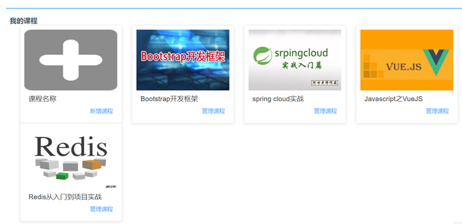

上边的查询要实现分页、会存在多表关联查询，所以建议使用mybatis实现我的课程查询。

## 1.2 PageHelper

### 1.2.1 PageHelper介绍

PageHelper是mybatis的通用分页插件，通过mybatis的拦截器实现分页功能，拦截sql查询请求，添加分页语句，最终实现分页查询功能。

我的课程具有分页功能，本项目使用Pagehelper实现Mybatis分页功能开发，由于本项目使用springboot开发，在springboot上集成pagehelper（https://github.com/pagehelper/pagehelper-spring-boot）

PageHelper的使用方法及原理如下：

在调用dao的service方法中设置分页参数：PageHelper.startPage(page, size)，分页参数会设置在ThreadLocal中PageHelper 在mybatis执行sql前进行拦截，从ThreadLocal取出分页参数，修改当前执行的sql语句，添加分页sql。

最后执行添加了分页sql的sql语句，实现分页查询。

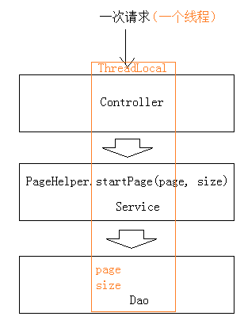

### 1.2.2 PageHelper配置

1. 添加依赖

```xml
<dependency>
    <groupId>com.github.pagehelper</groupId>
    <artifactId>pagehelper‐spring‐boot‐starter</artifactId>
    <version>1.2.4</version>
</dependency>
```

2. 配置pageHelper

```yaml
pagehelper:
  helper‐dialect: mysql
```

### 1.2.3 PageHelper测试

1. 定义mapper 接口

```java
@Mapper
public interface CourseMapper {
    CourseBase findCourseBaseById(String id);
    Page<CourseInfo> findCourseListPage(CourseListRequest courseListRequest);
}
```

2. 定义mapper.xml映射文件

```xml
<select id="findCourseListPage" resultType="com.xuecheng.framework.domain.course.ext.CourseInfo"
        parameterType="com.xuecheng.framework.domain.course.request.CourseListRequest">
    SELECT
    course_base.*,
    (SELECT pic FROM course_pic WHERE courseid = course_base.id) pic
    FROM
    course_base
</select>
```

3. 测试Dao

```java
//测试分页
@Test
public void testPageHelper(){
    PageHelper.startPage(1, 10);//查询第一页，每页显示10条记录
    CourseListRequest courseListRequest = new CourseListRequest();
    Page<CourseInfo> courseListPage = courseMapper.findCourseListPage(courseListRequest);
    List<CourseInfo> result = courseListPage.getResult();
    System.out.println(courseListPage);
}
```

测试前修改日志级别为debug，并跟踪运行日志，发现sql语句中已经包括分页语句。

## 1.3 前端说明

我的课程列表使用element 的card组件，如下：

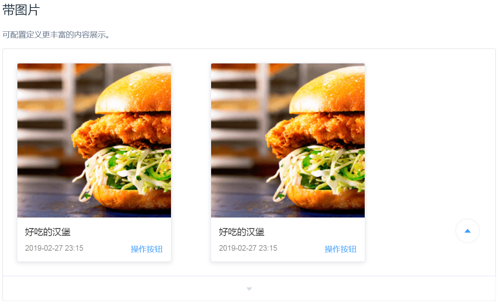

页面:src/module/course/page/course_list.vue

* UI

```html
<template>
  <section>
    <el-row >
      <el-col :span="8"  :offset=2 >
        <el-card :body-style="{ padding: '10px' }">
          
          <div style="padding: 10px;">
            <span>课程名称</span>
            <div class="bottom clearfix">
              <time class="time"></time>
              <router-link class="mui-tab-item" :to="{path:'/course/add/base'}">
                  <el-button type="text" class="button" >新增课程</el-button>
              </router-link>
            </div>
          </div>
        </el-card>
      </el-col>
      <el-col :span="8" v-for="(course, index) in courses" :key="course.id" :offset="index>0?2:2">
        <el-card :body-style="{ padding: '10px' }">
          
          <div style="padding: 10px;">
            <span>{{course.name}}</span>
            <div class="bottom clearfix">
              <time class="time"></time>
              <el-button type="text" class="button" @click="handleManage(course.id)">管理课程</el-button>
            </div>
          </div>
        </el-card>
      </el-col>

      <!--分页-->
      <el-col :span="24" class="toolbar">
        <el-pagination background layout="prev, pager, next" @current-change="handleCurrentChange" :page-size="size"
                       :total="total" :current-page="page"
                       style="float:right;">
        </el-pagination>
      </el-col>
    </el-row>
  </section>
</template>
```

* 脚本

```javascript
<script>
  import * as courseApi from '../api/course';
  import utilApi from '../../../common/utils';
  let sysConfig = require('@/../config/sysConfig')
  export default {
    data() {
      return {
        page:1,
        size:7,
        total: 0,
        courses: [
          {
            id:'4028e58161bd3b380161bd3bcd2f0000',
            name:'test01',
            pic:''
          },
          {
            id:'4028e581617f945f01617f9dabc40000',
            name:'test02',
            pic:''
          }
          ],
        sels: [],//列表选中列
        imgUrl:sysConfig.imgUrl
      }
    },
    methods: {
        //分页方法
      handleCurrentChange(val) {
        this.page = val;
        this.getCourse();
      },
      //获取课程列表
      getCourse() {
        courseApi.findCourseList(this.page,this.size,{}).then((res) => {
          console.log(res);
          if(res.success){
            this.total = res.queryResult.total;
            this.courses = res.queryResult.list;
          }

        });
      },
      handleManage: function (id) {
        console.log(id)
        this.$router.push({ path: '/course/manager/'+id})
      }

    },
    created(){

    },
    mounted() {
      //查询我的课程
      this.getCourse();
    }
  }
</script>
```

* 样式

```css
<style scoped>
  .el-col-8{
    width:20%
  }
  .el-col-offset-2{
    margin-left:2%
  }
  .time {
    font-size: 13px;
    color: #999;
  }

  .bottom {
    margin-top: 13px;
    line-height: 12px;
  }

  .button {
    padding: 0;
    float: right;
  }

  .image {
    width: 100%;
    display: block;
  }

  .clearfix:before,
  .clearfix:after {
    display: table;
    content: "";
  }

  .clearfix:after {
    clear: both
  }
</style>
```

## 1.4 API接口

输入参数：
	页码、每页显示个数、查询条件

输出结果类型：

​	QueryResponseResult<自定义类型>

在api工程创建course包，创建CourseControllerApi接口。

```java
@ApiOperation("查询我的课程列表")
public QueryResponseResult<CourseInfo> findCourseList(
        int page,
        int size,
        CourseListRequest courseListRequest
);
```

#2. 新增课程

## 2.1 需求分析


用户操作流程如下:

1. 用户进入“我的课程”页面，点击“新增课程”，进入新增课程页面

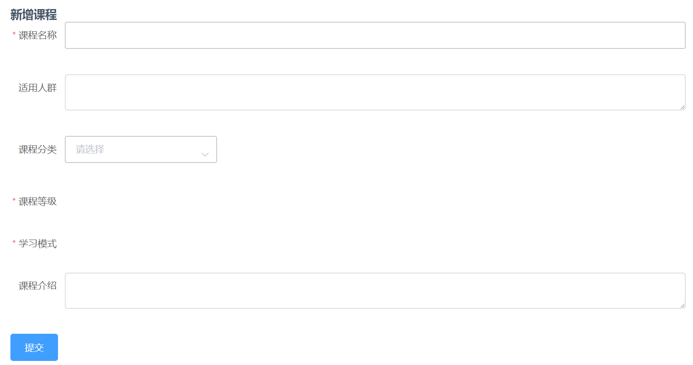

2. 填写课程信息，选择课程分类、课程等级、学习模式等。
3. 信息填写完毕，点击“提交”，课程添加成功或课程添加失败并提示失败原因。

需要解决的是在新增页面上输入的信息：

1. 课程分类

   多级分类，需要方便用户去选择。

2. 课程等级、学习模式等这些选项建议是可以配置的。

   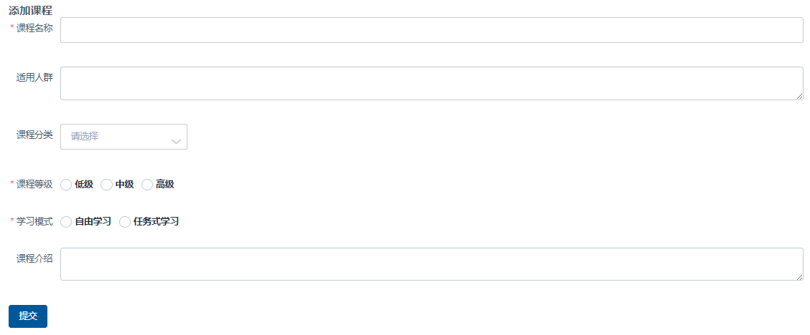

## 2.2 课程分类查询

### 2.2.1 介绍

在新增课程界面需要选择课程所属分类， 分类信息是整个项目非常重要的信息,课程即商品,分类信息设置的好坏直接影响用户访问量。

分类信息在哪里应用？

1. 首页分类导航

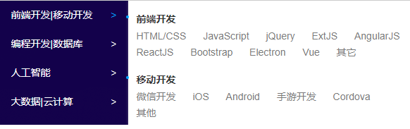

2. 课程的归属地

   添加课程时要选择课程的所属分类。

### 2.2.2 数据结构

分类表category的结构如下：

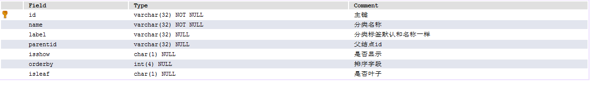

### 2.2.3 分类查询

#### 2.2.3.1 显示方式

在添加课程时需要选择课程所属的分类，这里需要定义课程分类查询接口。

接口格式要根据前端需要的数据格式来定义，前端展示课程分类使用elemenet-ui的cascader（级联选择器）组件。

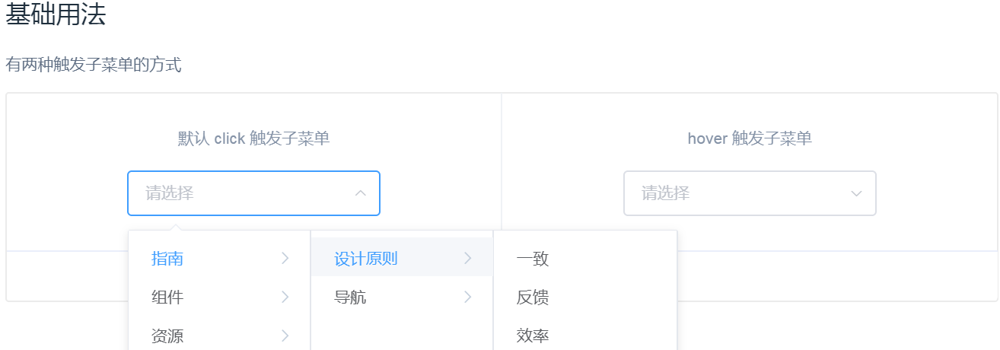

参考代码

```html
<div class="block">
  <span class="demonstration">默认 click 触发子菜单</span>
  <el-cascader
    :options="options"
    v-model="selectedOptions"
    @change="handleChange">
  </el-cascader>
</div>
<div class="block">
  <span class="demonstration">hover 触发子菜单</span>
  <el-cascader
    expand-trigger="hover"
    :options="options"
    v-model="selectedOptions2"
    @change="handleChange">
  </el-cascader>
</div>
<script>
  export default {
    data() {
      return {
        options: [{
          value: 'zhinan',
          label: '指南',
          children: [{
            value: 'shejiyuanze',
            label: '设计原则',
            children: [{
              value: 'yizhi',
              label: '一致'
            }, {
              value: 'fankui',
              label: '反馈'
            }, {
              value: 'xiaolv',
              label: '效率'
            }, {
              value: 'kekong',
              label: '可控'
            }]
          }, {
            value: 'daohang',
            label: '导航',
            children: [{
              value: 'cexiangdaohang',
              label: '侧向导航'
            }, {
              value: 'dingbudaohang',
              label: '顶部导航'
            }]
          }]
        },
       ...
    },
    methods: {
      handleChange(value) {
        console.log(value);
      }
    }
  };
</script>
```

#### 2.2.3.2 数据模型

```java
@Data
@ToString
@Entity
@Table(name="category")
@GenericGenerator(name = "jpa‐assigned", strategy = "assigned")
public class Category implements Serializable {
    private static final long serialVersionUID = ‐906357110051689484L;
    @Id
    @GeneratedValue(generator = "jpa‐assigned")
    @Column(length = 32)
    private String id;
    private String name;
    private String label;
    private String parentid;
    private String isshow;
    private Integer orderby;
    private String isleaf;
}
```

### 2.2.4 API接口

```java
@Api(value = "课程分类管理",description = "课程分类管理",tags = {"课程分类管理"})
public interface CategoryControllerApi {
    @ApiOperation("查询分类")
    public CategoryNode findList();
}
```

## 2.3 数据字典

### 2.3.1 介绍

在新增课程界面需要选择课程等级、课程状态等，这些信息统一采用数据字典管理的方式

本项目对一些业务的分类配置信息，比如：课程等级、课程状态、用户类型、用户状态等进行统一管理，通过在数据库创建数据字典表来维护这些分类信息。

数据字典对系统的业务分类进行统一管理，并且也可以解决硬编码问题，比如添加课程时选择课程等级，下拉框中的课程等级信息如果在页面硬编码将造成不易修改维护的问题,所以从数据字典表中获取,如果要修改名称则在数据字典修改即可，提高系统的可维护性。

### 2.3.2 数据模型

在mongodb中创建数据字典表sys_dictionary

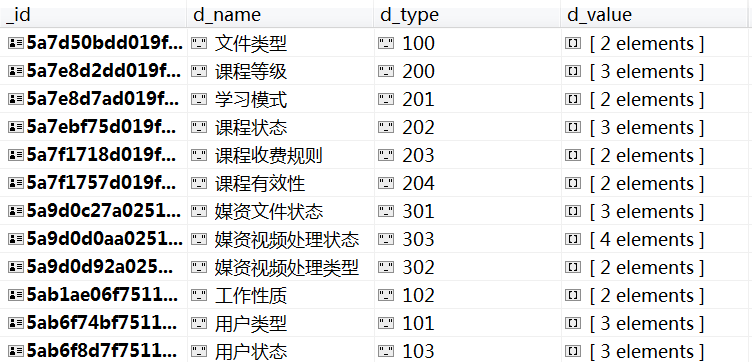

```json
{ 
    "_id" : ObjectId("5a7d50bdd019f150f4ab8ef7"), 
    "d_name" : "文件类型", 
    "d_type" : "100", 
    "d_value" : [
        {
            "sd_name" : "cms配置图片", 
            "sd_id" : "100001", 
            "sd_status" : "1"
        }, 
        {
            "sd_name" : "课程图片", 
            "sd_id" : "100002", 
            "sd_status" : "1"
        }
    ]
}
```

字段说明如下：

​	d_name ：字典名称
​	d_type：字典分类
​	d_value：字典数据
​	sd_name：项目名称
​	sd_id：项目id
​	sd_status：项目状态（1：可用，0不可用）	

数据模型类:

```java
@Data
@ToString
@Document(collection = "sys_dictionary")
public class SysDictionary {
    @Id
    private String id;
    @Field("d_name")
    private String dName;
    @Field("d_type")
    private String dType;
    @Field("d_value")
    private List<SysDictionaryValue> dValue;
}
```

```java
@Data
@ToString
public class SysDictionaryValue {
    @Field("sd_id")
    private String sdId;
    @Field("sd_name")
    private String sdName;
    @Field("sd_status")
    private String sdStatus;
}
```

### 2.3.3 API接口

```java
public interface SysDicthinaryControllerApi {
    //数据字典
    @ApiOperation(value="数据字典查询接口")
    public SysDictionary getByType(String type);
}
```

# 3. 修改课程

## 3.1  需求分析

课程添加成功进入课程管理页面，通过课程管理页面修改课程的基本信息、编辑课程图片、编辑课程营销信息等。

本小节实现修改课程。

## 3.2.1 页面结构

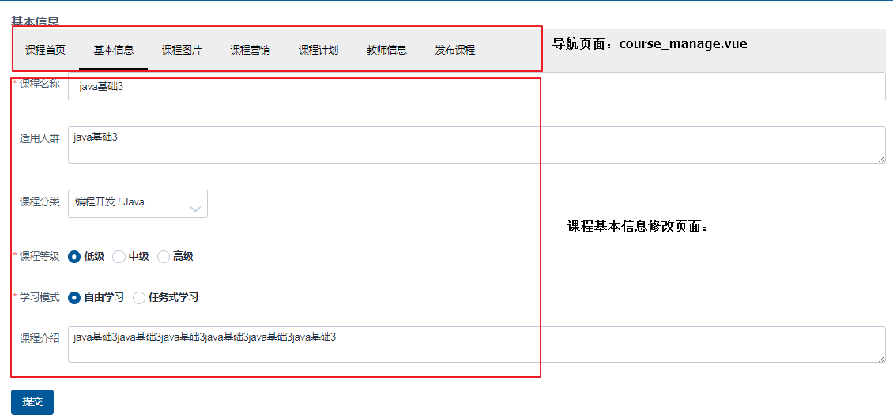

### 3.2.2 课程管理导航页面

1. 定义course_manage.vue为课程管理导航页面。


```java
 <template>
  <div>
    <el‐menu
      :default‐active="activeIndex"
      class="el‐menu‐demo"
      mode="horizontal"
      background‐color="#eee"
      text‐color="#000"
      active‐text‐color="#000">
      <router‐link class="mui‐tab‐item" :to="{path:'/course/manage/summary/'+this.courseid}">
      <el‐menu‐item index="1">课程首页</el‐menu‐item>
      </router‐link>
      <router‐link class="mui‐tab‐item" :to="{path:'/course/manage/baseinfo/'+this.courseid}">
      <el‐menu‐item index="2">基本信息</el‐menu‐item>
      </router‐link>
      <router‐link class="mui‐tab‐item" :to="{path:'/course/manage/picture/'+this.courseid}">
        <el‐menu‐item index="3">课程图片</el‐menu‐item>
      </router‐link>
      <router‐link class="mui‐tab‐item" :to="{path:'/course/manage/marketinfo/'+this.courseid}">
      <el‐menu‐item index="4">课程营销</el‐menu‐item>
      </router‐link>
      <router‐link class="mui‐tab‐item" :to="{path:'/course/manage/plan/'+this.courseid}">
      <el‐menu‐item index="5">课程计划</el‐menu‐item>
      </router‐link>
      <router‐link class="mui‐tab‐item" :to="{path:'/course/manage/teacher/'+this.courseid}">
        <el‐menu‐item index="6">教师信息</el‐menu‐item>
      </router‐link>
      <router‐link class="mui‐tab‐item" :to="{path:'/course/manage/pub/'+this.courseid}">
        <el‐menu‐item index="7">发布课程</el‐menu‐item>
      </router‐link>
    </el‐menu>
    <router‐view class="main"></router‐view>
  </div>
</template>
<script>
  import * as courseApi from '../api/course';
  import utilApi from '../../../common/utils';
  export default {
    data() {
      return {
        activeIndex:'2',
        courseid:''
      }
    },
    methods: {
    },
    mounted(){
      //课程id
      this.courseid = this.$route.params.courseid
      console.log("courseid=" + this.courseid)
      //跳转到页面列表
      this.$router.push({ path: '/course/manage/baseinfo/'+this.courseid})
    }
  }
</script>
<style scoped>
</style>
```

2. 创建各各信息管理页面

   通过管理页面的导航可以进入各各信息管理页面，这里先创建各各信息管理页面，页面内容暂时为空，待开发时再完善，在本模块的page目录下创建course_manage目录，此目录存放各各信息管理页面，页面明细如下：

   课程管理首页：course_summary.vue
   基本信息修改页面：course_baseinfo.vue
   图片管理页面：course_picture.vue 营销信息页面：course_marketinfo.vue
   老师信息页面：course_teacher.vue
   课程计划页面：course_plan.vue
   课程发布页面：course_pub.vue

3. 创建路由

```javascript
import course_manage from '@/module/course/page/course_manage.vue';
import course_summary from '@/module/course/page/course_manage/course_summary.vue';
import course_picture from '@/module/course/page/course_manage/course_picture.vue';
import course_baseinfo from '@/module/course/page/course_manage/course_baseinfo.vue';
import course_marketinfo from '@/module/course/page/course_manage/course_marketinfo.vue';
import course_teacher from '@/module/course/page/course_manage/course_teacher.vue';
import course_plan from '@/module/course/page/course_manage/course_plan.vue';
import course_pub from '@/module/course/page/course_manage/course_pub.vue';
{ path: '/course/manager/:courseid', name: '管理课程',component: course_manage,hidden: true ,
        children: [
          { path: '/course/manage/plan/:courseid', name: '课程计划',component:
course_plan,hidden: false },
          { path: '/course/manage/baseinfo/:courseid', name: '基本信息',component:
course_baseinfo,hidden: false },
          { path: '/course/manage/picture/:courseid', name: '课程图片',component:
course_picture,hidden: false },
          { path: '/course/manage/marketinfo/:courseid', name: '营销信息',component:
course_marketinfo,hidden: false },
          { path: '/course/manage/teacher/:courseid', name: '教师信息',component:
           course_teacher,hidden: false},
          { path: '/course/manage/pub/:courseid', name: '发布课程',component: 
           course_pub,hidden:false},
          { path: '/course/manage/summary/:courseid', name: '课程首页',component:
course_summary,hidden: false }
]}
```

## 3.3 API接口

修改课程需要如下接口：

1. 根据id查询课程信息

```java
@ApiOperation("获取课程基础信息")
public CourseBase getCourseBaseById(String courseId) throws RuntimeException;
```

2. 修改课程提交

```java
@ApiOperation("更新课程基础信息")
public ResponseResult updateCourseBase(String id,CourseBase courseBase);
```

# 4. 课程营销

## 4.1 需求分析

课程营销信息包括课程价格、课程有效期等信息。

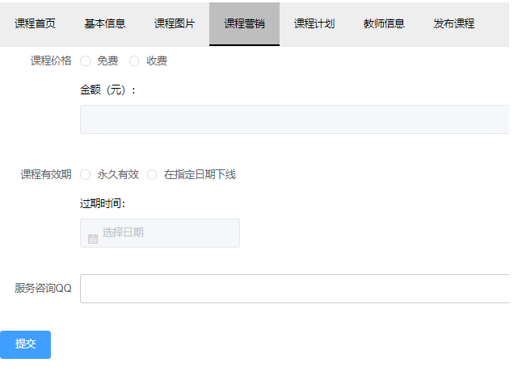

## 4.2 数据模型

课程营销信息使用course_market表存储。

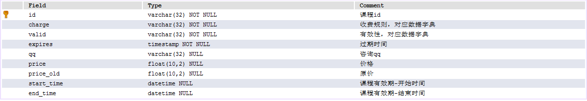

数据模型

```java
@Data
@ToString
@Entity
@Table(name="course_market")
@GenericGenerator(name = "jpa‐assigned", strategy = "assigned")
public class CourseMarket implements Serializable {
    private static final long serialVersionUID = ‐916357110051689486L;
    @Id
    @GeneratedValue(generator = "jpa‐assigned")
    @Column(length = 32)
    private String id;
    private String charge;
    private String valid;
    private String qq;
    private Float price;
    private Float price_old;
    @Column(name = "start_time")
    private Date startTime;
    @Column(name = "end_time")
    private Date endTime;
}
```

## 4.3 接口

课程营销信息需要定义如下接口：

1. 查询课程营销信息

```java
@ApiOperation("获取课程营销信息")
public CourseMarket getCourseMarketById(String courseId);
```

2. 更新课程营销信息

```java
@ApiOperation("更新课程营销信息")
public ResponseResult updateCourseMarket(String id,CourseMarket courseMarket);
```

接口实现可采用先查询课程营销，如果存在则更新信息，否则添加课程营销信息的方法。