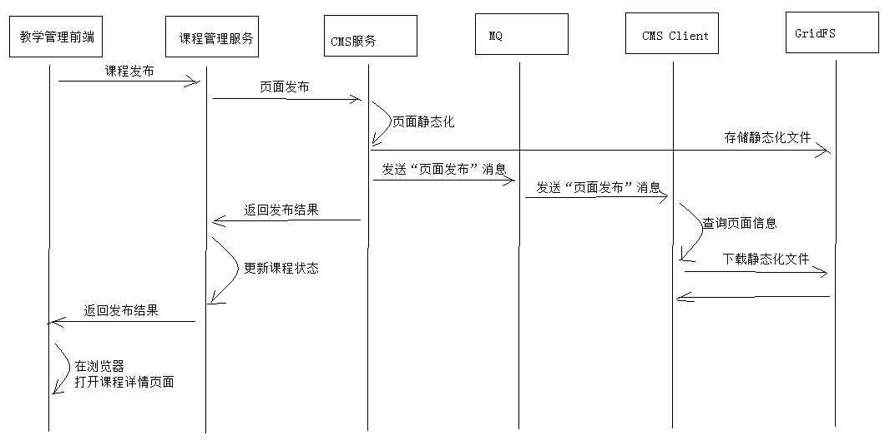

#1. 课程发布

## 1.1 需求分析

课程发布后将在Nginx服务器中生成正式的课程详情页面，课程发布后用户即可浏览课程查看详情页面，并开始课程的学习。

课程发布生成课程详情页面的流程与课程预览业务流程相同，如下：

1. 用户进入教学管理中心，进入某个课程的管理界面
2. 点击课程发布，前端请求到课程管理服务
3. 课程管理服务远程调用CMS生成课程发布页面，CMS将课程详情页面发布到Nginx服务器
4. 课程管理服务修改课程发布状态为 “已发布”，并向前端返回发布成功
5. 用户在教学管理中心点击“课程详情页面”链接，查看课程详情页面内容



## 1.2 CMS 一键发布接口

根据需求分析内容，需要在 cms服务增加页面发布接口供课程管理服务调用，此接口的功能如下：

1. 接收课程管理服务发布的页面信息
2. 将页面信息添加到 数据库（mongodb）
3. 对页面信息进行静态化
4. 将页面信息发布到服务器

### 1.2.3 接口定义

1. 创建响应结果类型

   页面发布成功cms返回页面的url

   页面Url规则= cmsSite.siteDomain+cmsSite.siteWebPath+ cmsPage.pageWebPath + cmsPage.pageName

```java
@Data
@NoArgsConstructor//无参构造器注解
public class CmsPostPageResult extends ResponseResult  {
    String pageUrl;
    public CmsPostPageResult(ResultCode resultCode,String pageUrl) {
        super(resultCode);
        this.pageUrl = pageUrl;
    }
}
```

2. 在api工程定义页面发布接口

```java
@ApiOperation("一键发布页面")
public CmsPostPageResult postPageQuick(CmsPage cmsPage);
```

### 1.2.4 Dao

接口中需要获取站点的信息（站点域名、站点访问路径等）

```java
public interface CmsSiteRepository extends MongoRepository<CmsSite,String> {
}
```

### 1.2.5 Service
1. 页面发布方法

```java
//一键发布页面
public CmsPostPageResult postPageQuick(CmsPage cmsPage){
    //添加页面
    CmsPageResult save = this.save(cmsPage);
    if(!save.isSuccess()){
        return new CmsPostPageResult(CommonCode.FAIL,null);
    }
    CmsPage cmsPage1 = save.getCmsPage();
    //要布的页面id
    String pageId = cmsPage1.getPageId();
    //发布页面
    ResponseResult responseResult = this.postPage(pageId);
    if(!responseResult.isSuccess()){
        return new CmsPostPageResult(CommonCode.FAIL,null);
    }
    //得到页面的url
    //页面url=站点域名+站点webpath+页面webpath+页面名称
    //站点id
    String siteId = cmsPage1.getSiteId();
    //查询站点信息
    CmsSite cmsSite = findCmsSiteById(siteId);
    //站点域名
    String siteDomain = cmsSite.getSiteDomain();
    //站点web路径
    String siteWebPath = cmsSite.getSiteWebPath();
    //页面web路径
    String pageWebPath = cmsPage1.getPageWebPath();
    //页面名称
    String pageName = cmsPage1.getPageName();
    //页面的web访问地址
    String pageUrl = siteDomain+siteWebPath+pageWebPath+pageName;
    return new CmsPostPageResult(CommonCode.SUCCESS,pageUrl);
}
```
2. 添加页面到MongoDB，如果已存在则更新页面

```java
//添加页面，如果已存在则更新页面
public CmsPageResult save(CmsPage cmsPage){
    //校验页面是否存在，根据页面名称、站点Id、页面webpath查询
    CmsPage cmsPage1 =cmsPageRepository.findByPageNameAndSiteIdAndPageWebPath(cmsPage.getPageName(),
													cmsPage.getSiteId(), cmsPage.getPageWebPath());
    if(cmsPage1 !=null){
        //更新
        return this.update(cmsPage1.getPageId(),cmsPage);
    }else{
        //添加
        return this.add(cmsPage);
    }
}
```

3. 查看站点信息

```java
    //根据id查询站点信息
    public CmsSite findCmsSiteById(String siteId){
        Optional<CmsSite> optional = cmsSiteRepository.findById(siteId);
        if(optional.isPresent()){
            return optional.get();
        }
        return null;
    }
```

### 2.2.6 Controller

```java
@Override
@PostMapping("/postPageQuick")
public CmsPostPageResult postPageQuick(@RequestBody CmsPage cmsPage) {
    return pageService.postPageQuick(cmsPage);
}
```

## 1.3 课程发布接口

### 1.3.1 Api接口

此Api接口由课程管理提供，由课程管理前端调用此Api接口，实现课程发布。

在api工程下课程管理包下定义接口：

```java
@ApiOperation("发布课程")
public CoursePublishResult publish(@PathVariable String id);
```

### 1.3.2 创建Feign Client

在课程管理工程创建CMS服务页面发布的Feign Client

```java
@FeignClient(value = XcServiceList.XC_SERVICE_MANAGE_CMS)
public interface CmsPageClient {
    //一键发布页面
    @PostMapping("/cms/page/postPageQuick")
    public CmsPostPageResult postPageQuick(CmsPage cmsPage);
}
```

### 1.3.3 Service

1. 配置课程发布页面参数

   在application.yml中配置

```yaml
course‐publish:
  siteId: 5b30cba5f58b4411fc6cb1e5
  templateId: 5ad9a24d68db5239b8fef199
  previewUrl: http://www.xuecheng.com/cms/preview/
  pageWebPath: /course/detail/
  pagePhysicalPath: /course/detail/
  dataUrlPre: http://localhost:31200/course/courseview/
```

> siteId：站点id
> templateId：模板id
> dataurlPre：数据url的前缀
> pageWebPath: 页面的web访问路径
> pagePhysicalPath：页面的物理存储路径。

2. Service方法如下

```java
@Value("${course‐publish.dataUrlPre}")
private String publish_dataUrlPre;
@Value("${course‐publish.pagePhysicalPath}")
private String publish_page_physicalpath;
@Value("${course‐publish.pageWebPath}")
private String publish_page_webpath;
@Value("${course‐publish.siteId}")
private String publish_siteId;
@Value("${course‐publish.templateId}")
private String publish_templateId;
@Value("${course‐publish.previewUrl}")
private String previewUrl;
@Autowired
CmsPageClient cmsPageClient;
 //课程发布
@Transactional
public CoursePublishResult publish(String courseId){
    //课程信息
    CourseBase one = this.findCourseBaseById(courseId);
    //发布课程详情页面
    CmsPostPageResult cmsPostPageResult = publish_page(courseId);
    if(!cmsPostPageResult.isSuccess()){
        ExceptionCast.cast(CommonCode.FAIL);
                }
    //更新课程状态
    CourseBase courseBase = saveCoursePubState(courseId);
    //课程索引...
    //课程缓存...
    //页面url
    String pageUrl = cmsPostPageResult.getPageUrl();
    return new CoursePublishResult(CommonCode.SUCCESS,pageUrl);
}
//更新课程发布状态
private CourseBase saveCoursePubState(String courseId){
    CourseBase courseBase = this.findCourseBaseById(courseId);
    //更新发布状态
    courseBase.setStatus("202002");
    CourseBase save = courseBaseRepository.save(courseBase);
    return save;
}
//发布课程正式页面
public CmsPostPageResult publish_page(String courseId){
    CourseBase one = this.findCourseBaseById(courseId);
    //发布课程预览页面
    CmsPage cmsPage = new CmsPage();
    //站点
    cmsPage.setSiteId(publish_siteId);//课程预览站点
    //模板
    cmsPage.setTemplateId(publish_templateId);
    //页面名称
    cmsPage.setPageName(courseId+".html");
    //页面别名
    cmsPage.setPageAliase(one.getName());
    //页面访问路径
    cmsPage.setPageWebPath(publish_page_webpath);
    //页面存储路径
    cmsPage.setPagePhysicalPath(publish_page_physicalpath);
    //数据url
    cmsPage.setDataUrl(publish_dataUrlPre+courseId);
    //发布页面
    CmsPostPageResult cmsPostPageResult = cmsPageClient.postPageQuick(cmsPage);
    return cmsPostPageResult;
}
```

### 1.3.4 Controller

```java
@Override
@PostMapping("/publish/{id}")
public CoursePublishResult publish(@PathVariable String id) {
    return courseService.publish(id);
}
```

## 1.4 测试CMS一键发布接口

### 1.4.1 配置虚拟主机

在nginx配置课程详情页面的虚拟主机，实现访问：www.xuecheng.com/course/detail/.....html。

```nginx
#静态资源服务
upstream static_server_pool{
  server 127.0.0.1:91 weight=10;
}
server {
  listen       80;
  server_name www.xuecheng.com;
  ssi on;
  ssi_silent_errors on;
  #课程预览
  location /course/detail/ { 
	proxy_pass http://static_server_pool;        
  }
}
#学成网静态资源
server {
	listen       91;    
	server_name localhost;    
   
#公司信息    
location /static/company/ {      
	alias   F:/develop/xuecheng/static/company/;        
}     
...
```

cms会将课程预览页面发布到服务器的F:/develop/xuecheng/static/course/detail/下，通过www.xuecheng.com/course/detail/来访问。

### 1.4.2 新增站点和模板

1. 新增课程详情页面的站点信息

   如果已增加课程详情页面的站点则忽略此步骤。

   向cms_site中新增如下信息

```json
{
    "_id" : ObjectId("5b30b052f58b4411fc6cb1cf"),
    "_class" : "com.xuecheng.framework.domain.cms.CmsSite",
    "siteName" : "课程详情站点",
    "siteDomain" : "http://www.xuecheng.com",
    "sitePort" : "80",
    "siteWebPath" : "",
    "siteCreateTime" : ISODate("2018‐02‐03T02:34:19.113+0000")
}
```

2. 新增课程详情模板信息

   可直接使用前边章节制作的课程详情信息模板。

   可以GridFS的测试代码添加模板，如果已添加则不用重复添加。

   使用测试GridFS Api将模板文件存储到mongodb:

```java
//文件存储2
@Test
public void testStore2() throws FileNotFoundException {
    File file = new File("C:\\Users\\admin\\Desktop\\coursedetail_t.html");
    FileInputStream inputStream = new FileInputStream(file);
    //保存模版文件内容
    GridFSFile gridFSFile = gridFsTemplate.store(inputStream, "测试文件","");
    String fileId = gridFSFile.getId().toString();
    System.out.println(fileId);
}
```

### 1.4.3 单元测试

1. 启动RabbitMQ服务
2. 启动cms服务
3. 启动cms_client，注意配置routingKey和队列名称

```yaml
xuecheng:
  mq:
  #cms客户端监控的队列名称（不同的客户端监控的队列不能重复）
    queue: queue_cms_postpage_03
    routingKey: 5b30b052f58b4411fc6cb1cf  #此routingKey为门户站点ID
```

## 1.5  前端开发

## 1.5.1 API 方法

```javascript
/*发布课程*/
export const publish = id => {
  return http.requestPost(apiUrl+'/course/publish/'+id);
}
```

### 1.5.2 页面

修改 course_pub.vue

添加：

```html
<el‐card class="box‐card">
  <div slot="header" class="clearfix">
    <span>课程发布</span>
  </div>
  <div class="text item">
    <div v‐if="course.status == '202001'">
      状态：制作中<br/>
      <el‐button type="primary"  @click.native="publish" >新课程发布</el‐button>
    </div>
    <div v‐else‐if="course.status == '202003'">
      状态：已下线
      <br/><br/>
      <span><a :href="'http://www.xuecheng.com/course/detail/'+this.courseid+'.html'"
target="_blank">点我查看课程详情页面 </a> </span>
    </div>
    <div v‐else‐if="course.status == '202002'">
      状态：已发布<br/>
      <el‐button type="primary"  @click.native="publish" >修改发布</el‐button>
      <br/><br/>
      <span><a :href="'http://www.xuecheng.com/course/detail/'+this.courseid+'.html'"
target="_blank">点我查看课程详情页面 </a> </span>
    </div>
  </div>
</el‐card>
```

发布方法 ,发布成功重新查询课程，如果课程状态已更改则显示课程详情页面的链接。

```javascript
//发布
publish(){
  this.$confirm('课程发布后将不允许回退，是否继续？', '提示', {}).then(() => {
    courseApi.publish(this.courseid).then((res) => {
      if(res.success){
        this.$message.error('发布成功');
                        //查询课程信息
        this.getcourse()
      }else{
        this.$message.error('发布失败');
      }
    });
  });
},
//查询课程信息
getcourse(){
  courseApi.getCoursebaseById(this.courseid).then((res) => {
    console.log(res);
    this.course = res;
  });
}
```

在钩子方法中查询课程信息：

```javascript
mounted(){
  //课程id
  this.courseid = this.$route.params.courseid;
  console.log("courseid=" + this.courseid)
  //查询课程信息
  this.getcourse()
}
```

# 2. Elasticsearch

[参考文档](../ElasticSearch/ElasticSearch.md)