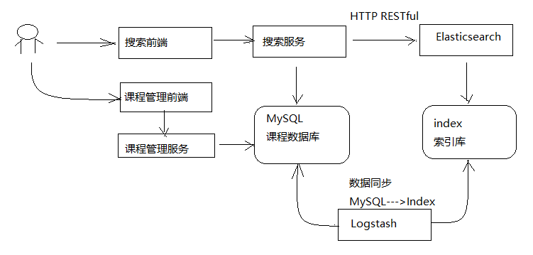
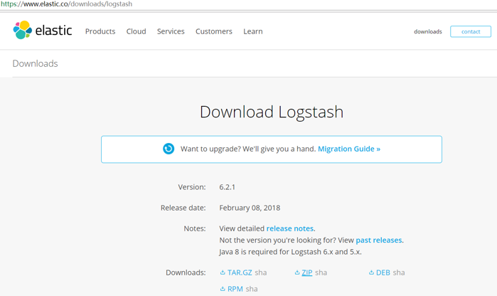
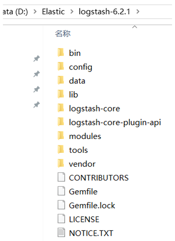
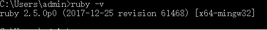
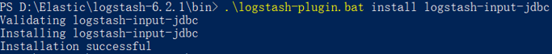
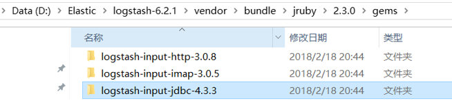
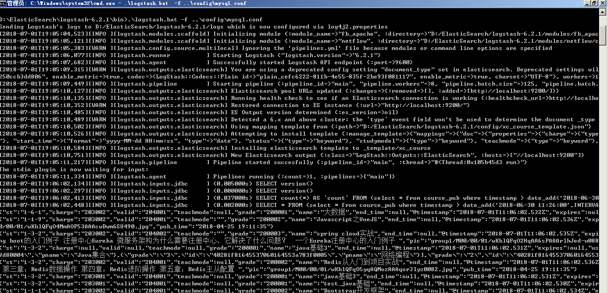
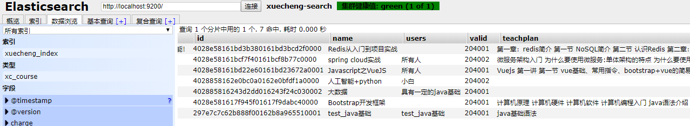
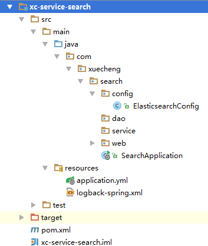
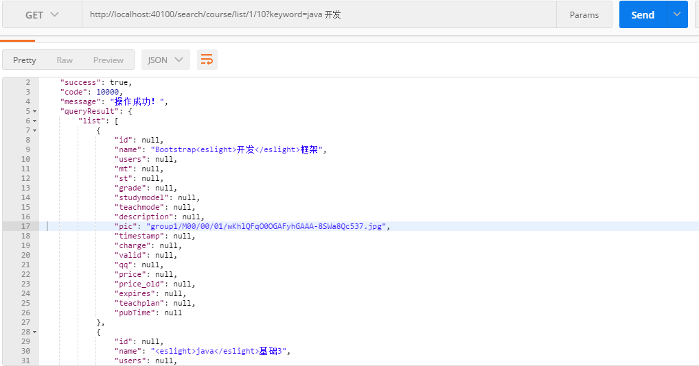

# 1. 搜索服务

## 1.1 需求分析


1. 根据分类搜索课程信息。
2. 根据关键字搜索课程信息，搜索方式为全文检索，关键字需要匹配课程的名称、 课程内容。
3. 根据难度等级搜索课程。
4. 搜索结点分页显示。

## 1.2 搜索流程



1. 课程管理服务将数据写到MySQL数据库
2. 使用Logstash将MySQL数据库中的数据写到ES的索引库。
3. 用户在前端搜索课程信息，请求到搜索服务。
4. 搜索服务请求ES搜索课程信息。

# 2. 课程索引

## 2.1 技术方案

如何维护课程索引信息？

1. 当课程管理向MySQL添加后同时将课程信息添加到索引库。

   采用Logstach实现，Logstach会从MySQL中将数据采集到ES索引库。

2. 当课程在MySQL更新信息后同时更新该课程在索引库的信息。

   采用Logstach实现。

3. 当课程在MySQL删除后同时将该课程从索引库删除。

   手工写程序实现，在删除课程后将索引库中该课程信息删除。

## 2.2 准备课程索引信息

课程发布成功在MySQL数据库存储课程发布信息，此信息作为课程索引信息。

### 2.2.1 创建课程发布表

课程信息分布在course_base、course_pic等不同的表中。

课程发布成功为了方便进行索引将这几张表的数据合并在一张表中，作为课程发布信息。

创建course_pub表

| Field       | Type                  | Comment                |
| ----------- | --------------------- | ---------------------- |
| id          | varchar(32) NOT NULL  | 主键                   |
| name        | varchar(32) NOT NULL  | 课程名称               |
| users       | varchar(500) NOT NULL | 适用人群               |
| mt          | varchar(32) NOT NULL  | 大分类                 |
| st          | varchar(32) NOT NULL  | 小分类                 |
| grade       | varchar(32) NOT NULL  | 课程等级               |
| studymodel  | varchar(32) NOT NULL  | 学习模式               |
| teachmode   | varchar(32) NULL      | 教育模式               |
| description | text NOT NULL         | 课程介绍               |
| timestamp   | timestamp NOT NULL    | 时间戳logstash使用     |
| charge      | varchar(32) NOT NULL  | 收费规则，对应数据字典 |
| valid       | varchar(32) NOT NULL  | 有效性，对应数据字典   |
| qq          | varchar(32) NULL      | 咨询qq                 |
| price       | float(10,2) NULL      | 价格                   |
| price_old   | float(10,2) NULL      | 原价格                 |
| expires     | varchar(32) NULL      | 过期时间               |
| start_time  | varchar(32) NULL      | 课程有效期-开始时间    |
| end_time    | varchar(32) NULL      | 课程有效期-结束时间    |
| pic         | varchar(500) NULL     | 课程图片               |
| teachplan   | text NOT NULL         | 课程计划               |
| pub_time    | varchar(32) NULL      | 发布时间               |

### 2.2.2 创建课程发布表模型

在课程管理服务创建模型：

```java
@Data
@ToString
@Entity
@Table(name="course_pub")
@GenericGenerator(name = "jpa‐assigned", strategy = "assigned")
public class CoursePub implements Serializable {
    private static final long serialVersionUID = ‐916357110051689487L;
    @Id
    @GeneratedValue(generator = "jpa‐assigned")
    @Column(length = 32)
    private String id;
    private String name;
    private String users;
    private String mt;
    private String st;
    private String grade;
    private String studymodel;
    private String teachmode;
    private String description;
    private String pic;//图片
    private Date timestamp;//时间戳
    private String charge;
    private String valid;
    private String qq;
    private Float price;
    private Float price_old;
    private String expires;
    private String teachplan;//课程计划
    @Column(name="pub_time")
    private String pubTime;//课程发布时间
}
```

### 2.2.3 修改课程发布

#### Dao

```java
public interface CoursePubRepository extends JpaRepository<CoursePub, String> {
}
```

#### Service

* 保存CoursePub

```java
public CoursePub saveCoursePub(String id, CoursePub coursePub){
    if(StringUtils.isNotEmpty(id)){
        ExceptionCast.cast(CourseCode.COURSE_PUBLISH_COURSEIDISNULL);
    }
    CoursePub coursePubNew = null;
    Optional<CoursePub> coursePubOptional = coursePubRepository.findById(id);
    if(coursePubOptional.isPresent()){
        coursePubNew = coursePubOptional.get();
    }
    if(coursePubNew == null){
        coursePubNew = new CoursePub();
    }
    BeanUtils.copyProperties(coursePub,coursePubNew);
    //设置主键
    coursePubNew.setId(id);
    //更新时间戳为最新时间
    coursePub.setTimestamp(new Date());
    //发布时间
    SimpleDateFormat simpleDateFormat = new SimpleDateFormat("YYYY‐MM‐dd HH:mm:ss");
    String date = simpleDateFormat.format(new Date());
    coursePub.setPubTime(date);
    coursePubRepository.save(coursePub);
    return coursePub;
}
```

* 创建coursePub对象

```java
private CoursePub createCoursePub(String id){
    CoursePub coursePub = new CoursePub();
    coursePub.setId(id);
    //基础信息
    Optional<CourseBase> courseBaseOptional = courseBaseRepository.findById(id);
    if(courseBaseOptional == null){
        CourseBase courseBase = courseBaseOptional.get();
        BeanUtils.copyProperties(courseBase, coursePub);
    }
    //查询课程图片
    Optional<CoursePic> picOptional = coursePicRepository.findById(id);
    if(picOptional.isPresent()){
        CoursePic coursePic = picOptional.get();
        BeanUtils.copyProperties(coursePic, coursePub);
    }
    //课程营销信息
    Optional<CourseMarket> marketOptional = courseMarketRepository.findById(id);
    if(marketOptional.isPresent()){
        CourseMarket courseMarket = marketOptional.get();
        BeanUtils.copyProperties(courseMarket, coursePub);
    }
    //课程计划
    TeachplanNode teachplanNode = teachplanMapper.selectList(id);
    //将课程计划转成json
    String teachplanString = JSON.toJSONString(teachplanNode);
    coursePub.setTeachplan(teachplanString);
    return coursePub;
}
```

* 修改课程发布方法，添加调用saveCoursePub方法的代码，添加部分的代码如下：

```java
public CoursePublishResult publish(String id) {
    //查询课程
    CourseBase courseBaseById = this.findCourseBaseById(id);

    //准备页面信息
    CmsPage cmsPage = new CmsPage();
    cmsPage.setSiteId(publish_siteId);//站点id
    cmsPage.setDataUrl(publish_dataUrlPre+id);//数据模型url
    cmsPage.setPageName(id+".html");//页面名称
    cmsPage.setPageAliase(courseBaseById.getName());//页面别名，就是课程名称
    cmsPage.setPagePhysicalPath(publish_page_physicalpath);//页面物理路径
    cmsPage.setPageWebPath(publish_page_webpath);//页面webpath
    cmsPage.setTemplateId(publish_templateId);//页面模板id
    //调用cms一键发布接口将课程详情页面发布到服务器
    CmsPostPageResult cmsPostPageResult = cmsPageClient.postPageQuick(cmsPage);
    if(!cmsPostPageResult.isSuccess()){
        return new CoursePublishResult(CommonCode.FAIL,null);
    }

    //保存课程的发布状态为“已发布”
    CourseBase courseBase = this.saveCoursePubState(id);
    if(courseBase == null){
        return new CoursePublishResult(CommonCode.FAIL,null);
    }

    //保存课程索引信息
    //先创建一个coursePub对象
    CoursePub coursePub = createCoursePub(id);
    //将coursePub对象保存到数据库
    saveCoursePub(id,coursePub);
    //缓存课程的信息
    //...
    //得到页面的url
    String pageUrl = cmsPostPageResult.getPageUrl();
    return new CoursePublishResult(CommonCode.SUCCESS,pageUrl);
}
```

## 2.3  搭建ES环境

### 2.3.1 ES安装

开发环境使用ES单机环境，启动ES服务端。

注意：旧的ES环境，可以删除elasticsearch-6.2.1\data\nodes目录以完全清除ES环境。

安装elasticsearch-head并启动。

### 2.3.2 创建索引库

创建索引库

创建xc_course索引库，一个分片，0个副本。

### 2.3.3 创建映射

Post http://localhost:9200/xc_course/doc/_mapping

```json
{
    "properties": {
        "description": {
            "analyzer": "ik_max_word",
            "search_analyzer": "ik_smart",
            "type": "text"
        },
        "grade": {
            "type": "keyword"
        },
        "id": {
            "type": "keyword"
        },
        "mt": {
            "type": "keyword"
        },
        "name": {
            "analyzer": "ik_max_word",
            "search_analyzer": "ik_smart",
            "type": "text"
        },
        "users": {
            "index": false,
            "type": "text"
        },
        "charge": {
            "type": "keyword"
        },
        "valid": {
            "type": "keyword"
        },
        "pic": {
            "index": false,
            "type": "keyword"
        },
        "qq": {
            "index": false,
            "type": "keyword"
        },
        "price": {
            "type": "float"
        },
        "price_old": {
            "type": "float"
        },
        "st": {
            "type": "keyword"
        },
        "status": {
            "type": "keyword"
        },
        "studymodel": {
            "type": "keyword"
        },
        "teachmode": {
            "type": "keyword"
        },
        "teachplan": {
            "analyzer": "ik_max_word",
            "search_analyzer": "ik_smart",
            "type": "text"
        },
        "expires": {
            "type": "date",
            "format": "yyyy‐MM‐dd HH:mm:ss"
        },
        "pub_time": {
            "type": "date",
            "format": "yyyy‐MM‐dd HH:mm:ss"
        },
        "start_time": {
            "type": "date",
            "format": "yyyy‐MM‐dd HH:mm:ss"
        },
        "end_time": {
            "type": "date",
            "format": "yyyy‐MM‐dd HH:mm:ss"
        }
    }
}
```

## 2.4 Logstash 创建索引

Logstash是ES下的一款开源软件，它能够同时 从多个来源采集数据、转换数据，然后将数据发送到Eleasticsearch中创建索引。

本项目使用Logstash将MySQL中的数据采用到ES索引中。

### 2.4.1 下载Logstash

下载Logstash6.2.1版本，和本项目使用的Elasticsearch6.2.1版本一致。



解压：



### 2.4.2 安装logstash-input-jdbc

logstash-input-jdbc 是用ruby语言开发的，先下载ruby并安装

下载地址: https://rubyinstaller.org/downloads/

下载 2.5版本即可。

安装完成查看是否安装成功



Logstash5.x以上版本本身自带有logstash-input-jdbc，6.x版本本身不带logstash-input-jdbc插件，需要手动安装



安装成功后我们可以在logstash根目录下的目录查看对应的插件版本



解压老师提供的logstash-6.2.1.zip,此logstash中已集成了logstash-input-jdbc插件。

### 2.4.3 创建模板文件

Logstash的工作是从MySQL中读取数据，向ES中创建索引，这里需要提前创建mapping的模板文件以便logstash使用。

在logstach的config目录创建xc_course_template.json，内容如下：

本教程的xc_course_template.json目录是：D:/ElasticSearch/logstash-6.2.1/config/xc_course_template.json

```json
{
    "mappings": {
        "doc": {
            "properties": {
                "charge": {
                    "type": "keyword"
                },
                "description": {
                    "analyzer": "ik_max_word",
                    "search_analyzer": "ik_smart",
                    "type": "text"
                },
                "end_time": {
                    "format": "yyyy‐MM‐ddHH:mm:ss",
                    "type": "date"
                },
                "expires": {
                    "format": "yyyy‐MM‐ddHH:mm:ss",
                    "type": "date"
                },
                "grade": {
                    "type": "keyword"
                },
                "id": {
                    "type": "keyword"
                },
                "mt": {
                    "type": "keyword"
                },
                "name": {
                    "analyzer": "ik_max_word",
                    "search_analyzer": "ik_smart",
                    "type": "text"
                },
                "pic": {
                    "index": false,
                    "type": "keyword"
                },
                "price": {
                    "type": "float"
                },
                "price_old": {
                    "type": "float"
                },
                "pub_time": {
                    "format": "yyyy‐MM‐ddHH:mm:ss",
                    "type": "date"
                },
                "qq": {
                    "index": false,
                    "type": "keyword"
                },
                "st": {
                    "type": "keyword"
                },
                "start_time": {
                    "format": "yyyy‐MM‐ddHH:mm:ss",
                    "type": "date"
                },
                "status": {
                    "type": "keyword"
                },
                "studymodel": {
                    "type": "keyword"
                },
                "teachmode": {
                    "type": "keyword"
                },
                "teachplan": {
                    "analyzer": "ik_max_word",
                    "search_analyzer": "ik_smart",
                    "type": "text"
                },
                "users": {
                    "index": false,
                    "type": "text"
                },
                "valid": {
                    "type": "keyword"
                }
            }
        }
    },
    "template": "xc_course"
}
```

### 2.4.4 配置mysql.conf

在logstash的config目录下配置mysql.conf文件供logstash使用，logstash会根据mysql.conf文件的配置的地址从MySQL中读取数据向ES中写入索引

参考https://www.elastic.co/guide/en/logstash/current/plugins-inputs-jdbc.html

配置输入数据源和输出数据源。

```properties
input {
  stdin {
  }
  jdbc {
  jdbc_connection_string => "jdbc:mysql://localhost:3306/xc_course?useUnicode=true&characterEncoding=utf-8&useSSL=true&serverTimezone=UTC"
  # the user we wish to excute our statement as
  jdbc_user => "root"
  jdbc_password => mysql
  # the path to our downloaded jdbc driver  
  jdbc_driver_library => "F:/develop/maven/repository3/mysql/mysql-connector-java/5.1.41/mysql-connector-java-5.1.41.jar"
  # the name of the driver class for mysql
  jdbc_driver_class => "com.mysql.jdbc.Driver"
  jdbc_paging_enabled => "true"
  jdbc_page_size => "50000"
  #要执行的sql文件
  #statement_filepath => "/conf/course.sql"
  statement => "select * from course_pub where timestamp > date_add(:sql_last_value,INTERVAL 8 HOUR)"
  #定时配置
  schedule => "* * * * *"
  record_last_run => true
  last_run_metadata_path => "D:/Elastic/logstash-6.2.1/config/logstash_metadata"
  }
}


output {
  elasticsearch {
  #ES的ip地址和端口
  hosts => "localhost:9200"
  #hosts => ["localhost:9200","localhost:9202","localhost:9203"]
  #ES索引库名称
  index => "xc_course"
  document_id => "%{id}"
  document_type => "doc"
  template =>"D:/ElasticSearch/logstash-6.2.1/config/xc_course_template.json"
  template_name =>"xc_course"
  template_overwrite =>"true"
  }
  stdout {
 #日志输出
  codec => json_lines
  }
}
```

说明：

1. ES采用UTC时区问题

   ES采用UTC 时区，比北京时间早8小时，所以ES读取数据时让最后更新时间加8小时

   where timestamp > date_add(:sql_last_value,INTERVAL 8 HOUR)

2. logstash每个执行完成会在D:/ElasticSearch/logstash-6.2.1/config/logstash_metadata记录执行时间下次以此时间为基准进行增量同步数据到索引库。

### 3.4.5 测试

启动logstash.bat：

```shell
.\logstash.bat ‐f ..\config\mysql.conf
```



修改course_pub中的数据，并且修改timestamp为当前时间，观察Logstash日志是否读取到要索引的数据。

最后用 head登录ES查看索引文档内容是否修改。



# 3. 课程搜索

## 3.1 需求分析


1. 根据分类搜索课程信息。
2. 根据关键字搜索课程信息，搜索方式为全文检索，关键字需要匹配课程的名称、 课程内容。

3. 根据难度等级搜索课程。
4. 搜索结点分页显示。

**技术分析：**

1. 根据关键字搜索，采用MultiMatchQuery，搜索name、description、teachplan
2. 根据分类、课程等级搜索采用过虑器实现。
3. 分页查询。
4. 高亮显示。

## 3.2 创建搜索服务工程

1. 创建xc-service-search工程



2. 配置

   配置appliction.yml

```yaml
server:
  port: 40100
spring:
  application:
    name: xc‐search‐service
elasticsearch:
  hostlist: 127.0.0.1:9200 #多个结点中间用逗号分隔
  course:
    index: xc_course
    type: doc
```

​	配置RestHighLevelClient和RestClient

```java
@Configuration
public class ElasticsearchConfig {
    @Value("${xuecheng.elasticsearch.hostlist}")
    private String hostlist;
    @Bean
    public RestHighLevelClient restHighLevelClient(){
        //解析hostlist配置信息
        String[] split = hostlist.split(",");
        //创建HttpHost数组，其中存放es主机和端口的配置信息
        HttpHost[] httpHostArray = new HttpHost[split.length];
        for(int i=0;i<split.length;i++){
            String item = split[i];
            httpHostArray[i] = new HttpHost(item.split(":")[0], Integer.parseInt(item.split(":")
[1]), "http");
        }
        //创建RestHighLevelClient客户端
        return new RestHighLevelClient(RestClient.builder(httpHostArray));
    }
    @Bean
    public RestClient restClient(){
        //解析hostlist配置信息
        String[] split = hostlist.split(",");
        //创建HttpHost数组，其中存放es主机和端口的配置信息
        HttpHost[] httpHostArray = new HttpHost[split.length];
        for(int i=0;i<split.length;i++){
            String item = split[i];
            httpHostArray[i] = new HttpHost(item.split(":")[0], Integer.parseInt(item.split(":")
[1]), "http");
        }
        return RestClient.builder(httpHostArray).build();
    }
}
```

## 3.3 API

```java
@Api(value = "课程搜索",description = "课程搜索",tags = {"课程搜索"})
public interface EsCourseControllerApi {
    @ApiOperation("课程搜索")
    public QueryResponseResult<CoursePub> list(int page,int size,
                       CourseSearchParam courseSearchParam) throws IOException;
}
```

## 3.4 Service

Service搜索方法包含三个方面

1. 按关键字搜索
2. 按分类和难度等级搜索
3. 分页与高亮

* 在appliction.yml中配置source_field

```yaml
elasticsearch:
  hostlist: 127.0.0.1:9200 #多个结点中间用逗号分隔
  course:
    index: xc_course
    type: doc
    source_field:
id,name,grade,mt,st,charge,valid,pic,qq,price,price_old,status,studymodel,teachmode,expires,pub_
time,start_time,end_time
```

* service完整代码如下

```java
@Service
public class EsCourseService {

    @Value("${xuecheng.course.index}")
    private String index;
    @Value("${xuecheng.course.type}")
    private String type;
    @Value("${xuecheng.course.source_field}")
    private String source_field;

    @Autowired
    RestHighLevelClient restHighLevelClient;

    //课程搜索
    public QueryResponseResult<CoursePub> list(int page, int size, CourseSearchParam courseSearchParam) {
        if(courseSearchParam == null){
            courseSearchParam = new CourseSearchParam();
        }
        //创建搜索请求对象
        SearchRequest searchRequest = new SearchRequest(index);
        //设置搜索类型
        searchRequest.types(type);

        SearchSourceBuilder searchSourceBuilder = new SearchSourceBuilder();
        //过虑源字段
        String[] source_field_array = source_field.split(",");
        searchSourceBuilder.fetchSource(source_field_array,new String[]{});
        //创建布尔查询对象
        BoolQueryBuilder boolQueryBuilder = QueryBuilders.boolQuery();
        //搜索条件
        //根据关键字搜索
        if(StringUtils.isNotEmpty(courseSearchParam.getKeyword())){
            MultiMatchQueryBuilder multiMatchQueryBuilder = QueryBuilders.multiMatchQuery(courseSearchParam.getKeyword(), "name", "description", "teachplan")
                    .minimumShouldMatch("70%")
                    .field("name", 10);
            boolQueryBuilder.must(multiMatchQueryBuilder);
        }
        if(StringUtils.isNotEmpty(courseSearchParam.getMt())){
            //根据一级分类
            boolQueryBuilder.filter(QueryBuilders.termQuery("mt",courseSearchParam.getMt()));
        }
        if(StringUtils.isNotEmpty(courseSearchParam.getSt())){
            //根据二级分类
            boolQueryBuilder.filter(QueryBuilders.termQuery("st",courseSearchParam.getSt()));
        }
        if(StringUtils.isNotEmpty(courseSearchParam.getGrade())){
            //根据难度等级
            boolQueryBuilder.filter(QueryBuilders.termQuery("grade",courseSearchParam.getGrade()));
        }

        //设置boolQueryBuilder到searchSourceBuilder
        searchSourceBuilder.query(boolQueryBuilder);
        searchRequest.source(searchSourceBuilder);

        QueryResult<CoursePub> queryResult = new QueryResult();
        List<CoursePub> list = new ArrayList<>();
        try {
            //执行搜索
            SearchResponse searchResponse = restHighLevelClient.search(searchRequest);
            //获取响应结果
            SearchHits hits = searchResponse.getHits();
            //匹配的总记录数
            long totalHits = hits.totalHits;
            queryResult.setTotal(totalHits);
            SearchHit[] searchHits = hits.getHits();
            for(SearchHit hit:searchHits){
                CoursePub coursePub = new CoursePub();
                //源文档
                Map<String, Object> sourceAsMap = hit.getSourceAsMap();
                //取出name
                String name = (String) sourceAsMap.get("name");
                coursePub.setName(name);
                //图片
                String pic = (String) sourceAsMap.get("pic");
                coursePub.setPic(pic);
                //价格
                Double price = null;
                try {
                    if(sourceAsMap.get("price")!=null ){
                        price = (Double) sourceAsMap.get("price");
                    }

                } catch (Exception e) {
                    e.printStackTrace();
                }
                coursePub.setPrice(price);
                //旧价格
                Double price_old = null;
                try {
                    if(sourceAsMap.get("price_old")!=null ){
                        price_old = (Double) sourceAsMap.get("price_old");
                    }
                } catch (Exception e) {
                    e.printStackTrace();
                }
                coursePub.setPrice_old(price_old);
                //将coursePub对象放入list
                list.add(coursePub);
            }


        } catch (IOException e) {
            e.printStackTrace();
        }

        queryResult.setList(list);
        QueryResponseResult<CoursePub> queryResponseResult = new QueryResponseResult<CoursePub>(CommonCode.SUCCESS,queryResult);

        return queryResponseResult;
    }
}
```

## 3.5 Controller

```java
@RestController
@RequestMapping("/search/course")
public class EsCourseController implements EsCourseControllerApi {
    @Autowired
    EsCourseService esCourseService;
   
    @Override
    @GetMapping(value="/list/{page}/{size}")
    public QueryResponseResult<CoursePub> list(@PathVariable("page") int page,
@PathVariable("size") int size, CourseSearchParam courseSearchParam) throws IOException {
        return esCourseService.list(page,size,courseSearchParam);
    }
}
```

## 3.6 测试

使用postman测试/search/course

