# 1. 搜索前端技术需求

## 1.1 需求描述

采用vue.js开发搜索界面则SEO不友好，需要解决SEO的问题。


## 1.2 了解SEO

**搜索引擎优化**（英语：**search engine optimization**，[缩写](https://zh.wikipedia.org/wiki/%E7%BC%A9%E5%86%99)为**SEO**），是一种透过了解[搜索引擎](https://zh.wikipedia.org/wiki/%E6%90%9C%E5%B0%8B%E5%BC%95%E6%93%8E)的运作规则来调整[网站](https://zh.wikipedia.org/wiki/%E7%B6%B2%E7%AB%99)，以及提高目的[网站](https://zh.wikipedia.org/wiki/%E7%B6%B2%E7%AB%99)在有关搜索引擎内排名的方式。由于不少研究发现，搜索引擎的用户往往只会留意搜索结果最前面的几个条目，所以不少[网站](https://zh.wikipedia.org/wiki/%E7%B6%B2%E7%AB%99)都希望透过各种形式来影响搜索引擎的排序，让自己的[网站](https://zh.wikipedia.org/wiki/%E7%B6%B2%E7%AB%99)可以有优秀的搜索排名。当中尤以各种依靠广告维生的网站为甚。

所谓“针对搜索引擎作最优化的处理”，是指为了要让网站更容易被搜索引擎接受。搜索引擎会将网站彼此间的内容做一些相关性的数据比对，然后再由[浏览器](https://zh.wikipedia.org/wiki/%E7%80%8F%E8%A6%BD%E5%99%A8)将这些内容以最快速且接近最完整的方式，呈现给搜索者。搜索引擎优化就是通过搜索引擎的规则进行优化，为用户打造更好的用户体验，最终的目的就是做好用户体验。

对于任何一个网站来说，要想在网站推广中获取成功，搜索引擎优化都是至为关键的一项任务。同时，随着搜索引擎不断变换它们的搜索排名算法规则，每次算法上的改变都会让一些排名很好的网站在一夜之间名落孙山，而失去排名的直接后果就是失去了网站固有的可观访问流量。所以每次搜索引擎算演法的改变都会在网站之中引起不小的骚动和焦虑。可以说，搜索引擎优化是一个愈来愈复杂的任务。

经过许多专业的SEO研究机构调查后发现，当用户利用搜索引擎查找数据、产品或服务时，大部分人通常只会点击搜索结果当中，最前面出现的几个链接，因此，大部分的网站都希望能透过各种方式或手法来试图影响网站页面在搜索引击的排名。不过，搜索引擎的算法会不断的更新，网站的排名也会因此会有动荡，所以如果没有持续做好SEO，很快地排名就很有可能会掉下来。

**总结：**seo是网站为了提高自已的网站排名，获得更多的流量，对网站的结构及内容进行调整优化，以便搜索引擎（百度，google等）更好抓取到更优质的网站的内容。

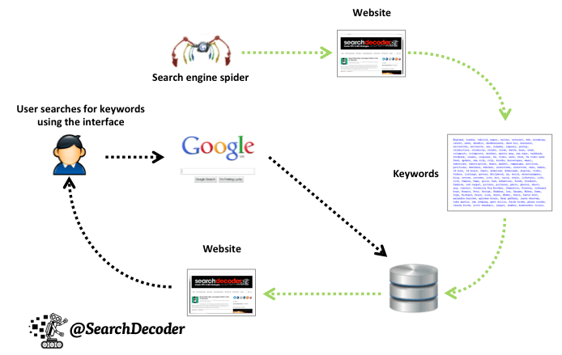

从上图可以看到SEO是网站自己为了方便spider抓取网页而作出的网页内容优化，常见的SEO方法比如：

1. 对url链接的规范化，多用restful风格的url，多用静态资源url； 
2. 注意title、keywords的设置。
3. 由于spider对javascript支持不好，对于网页跳转用href标签。

## 1.3 服务端渲染和客户端渲染

采用什么技术有利于SEO？要解答这个问题需要理解服务端渲染和客户端渲染。

什么是服务端渲染?

我们用传统的servlet开发来举例：浏览器请求servlet，servlet在服务端生成html响应给浏览器，浏览器展示html的内容，这个过程就是服务端渲染，如下图：

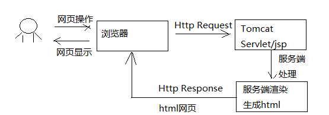

**服务端渲染的特点：**

1. 在服务端生成html网页的dom元素。
2. 客户端（浏览器）只负责显示dom元素内容。

当初随着web2.0的到来，AJAX技术兴起，出现了客户端渲染：客户端（浏览器） 使用AJAX向服务端发起http请求，获取到了想要的数据，客户端拿着数据开始渲染html网页，生成Dom元素，并最终将网页内容展示给用户，如下图：

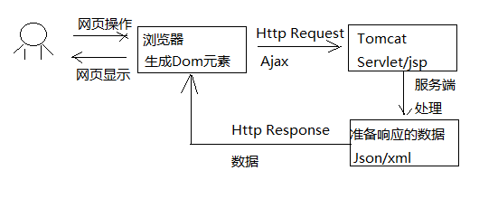

**客户端渲染的特点：**

1. 在服务端只是给客户端响应的了数据，而不是html网页
2. 客户端（浏览器）负责获取服务端的数据生成Dom元素。

两种方式各有什么优缺点？

**客户端渲染：**

​	**缺点:**不利于网站进行SEO，因为网站大量使用javascript技术，不利于spider抓取网页。

​	**优点:**客户端负责渲染，用户体验性好，服务端只提供数据不用关心用户界面的内容，有利于提高服务端的开发效率。

​	**适用场景:**对SEO没有要求的系统，比如后台管理类的系统，如电商后台管理，用户管理等。

**服务端渲染：**

​	**优点:**有利于SEO，网站通过href的url将spider直接引到服务端，服务端提供优质的网页内容给spider。

​	**缺点:**服务端完成一部分客户端的工作，通常完成一个需求需要修改客户端和服务端的代码，开发效率低，不利于系统的稳定性。

​	**适用场景:**对SEO有要求的系统，比如：门户首页、商品详情页面等。

# 2. Nuxt.js

## 2.1 Nuxt.js 介绍

移动互联网的兴起促进了web前后端分离开发模式的发展，服务端只专注业务，前端只专注用户体验，前端大量运用的前端渲染技术，比如流行的vue.js、react框架都实现了功能强大的前端渲染。

但是，对于有SEO需求的网页如果使用前端渲染技术去开发就不利于SEO了，有没有一种即使用vue.js、react的前端技术也实现服务端渲染的技术呢？其实，对于服务端渲染的需求，vue.js、react这样流行的前端框架提供了服务端渲染的解决方案。

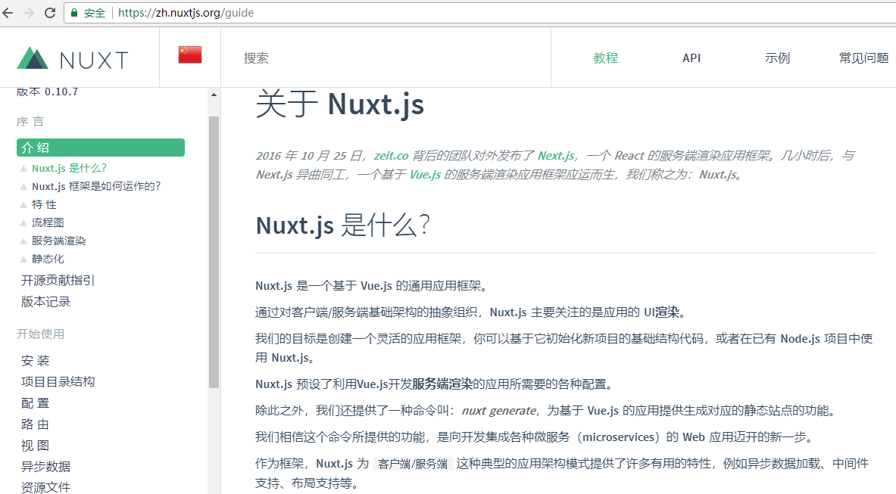

从上图可以看到：

​	react框架提供next.js实现服务端渲染。

​	vue.js框架提供Nuxt.js实现服务端渲染。

## 2.2 Nuxt.js 工作原理

下图展示了从客户端请求到Nuxt.js进行服务端渲染的整体的工作流程：

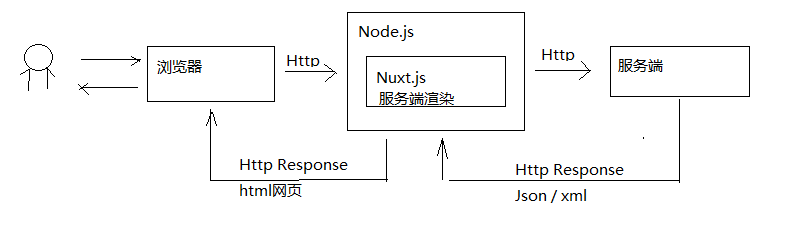

1. 用户打开浏览器，输入网址请求到Node.js
2. 部署在Node.js的应用Nuxt.js接收浏览器请求，并请求服务端获取数据
3. Nuxt.js获取到数据后进行服务端渲染
4. Nuxt.js将html网页响应给浏览器

**Nuxt.js使用了哪些技术？**

Nuxt.js使用Vue.js+webpack+Babel三大技术框架/组件，如下图：


Nuxt.js 集成了以下组件/框架，用于开发完整而强大的 Web 应用：

- [Vue 2](https://github.com/vuejs/vue)
- [Vue-Router](https://github.com/vuejs/vue-router)
- [Vuex](https://github.com/vuejs/vuex) (当配置了 [Vuex 状态树配置项](https://zh.nuxtjs.org/guide/vuex-store) 时才会引入)
- [Vue-Meta](https://github.com/declandewet/vue-meta)

Babel 是一个js的转码器，负责将ES6的代码转成浏览器识别的ES5代码。

Webpack是一个前端工程打包工具。

Vue.js是一个优秀的前端框架。

**Nuxt.js的特性有哪些？**

* 基于 Vue.js
* 自动代码分层
* 服务端渲染
* 强大的路由功能，支持异步数据
* 静态文件服务
* ES6/ES7  语法支持
* 打包和压缩 JS 和 CSS
* HTML 头部标签管理
* 本地开发支持热加载
* 集成 ESLint
* 支持各种样式预处理器： SASS、LESS、 Stylus等等

## 2.3. Nuxt.js 使用

### 2.3.1 创建Nuxt工程

nuxt.js有标准的目录结构，官方提供了模板工程，可以模板工程快速创建nuxt项目。

模板工程地址：https://github.com/nuxt-community/starter-template/archive/master.zip

本项目提供基于 Nuxt.js的封装工程，基于此封装工程开发搜索前端，见“资料”--》xc-ui-pc-portal.zip，解压xc-ui-pc-portal.zip到本项目前端工程目录下。

本前端工程属于门户的一部分，将承载一部分考虑SEO的非静态化页面。

本工程基于Nuxt.js模板工程构建，Nuxt.js使用1.3版本，并加入了今后开发中所使用的依赖包，直接解压本工程即可使用。

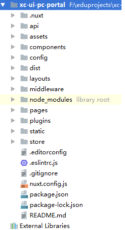

### 2.3.2 目录结构

本工程的目录结构如下：

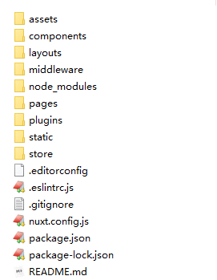

* 资源目录
  资源目录 assets 用于组织未编译的静态资源如 LESS、SASS 或 JavaScript。

* 组件目录
  组件目录 components 用于组织应用的 Vue.js 组件。Nuxt.js 不会扩展增强该目录下 Vue.js 组件，即这些组件不会像页面组件那样有 asyncData 方法的特性。

* 布局目录
  布局目录 layouts 用于组织应用的布局组件。

  该目录名为Nuxt.js保留的，不可更改。

* 中间件目录
  middleware 目录用于存放应用的中间件。

* 页面目录
  页面目录 pages 用于组织应用的路由及视图。Nuxt.js 框架读取该目录下所有的 .vue 文件并自动生成对应的路由配置。
  该目录名为Nuxt.js保留的，不可更改。

* 插件目录
  插件目录 plugins 用于组织那些需要在 根vue.js应用 实例化之前需要运行的 Javascript 插件。

* 静态文件目录
  静态文件目录 static 用于存放应用的静态文件，此类文件不会被 Nuxt.js 调用 Webpack 进行构建编译处理。 服务器启动的时候，该目录下的文件会映射至应用的根路径 / 下。
  举个例子: /static/logo.png 映射至 /logo.png
  该目录名为Nuxt.js保留的，不可更改。

* Store 目录
  store 目录用于组织应用的 Vuex 状态树 文件。 Nuxt.js 框架集成了 Vuex 状态树 的相关功能配置，在 store 目
  录下创建一个 index.js 文件可激活这些配置。
  该目录名为Nuxt.js保留的，不可更改。

* nuxt.config.js 文件
  nuxt.config.js 文件用于组织Nuxt.js 应用的个性化配置，以便覆盖默认配置。
  该文件名为Nuxt.js保留的，不可更改。

* package.json 文件
  package.json 文件用于描述应用的依赖关系和对外暴露的脚本接口。
  该文件名为Nuxt.js保留的，不可更改。

nuxt.js  提供了目录的别名，方便在程序中引用：

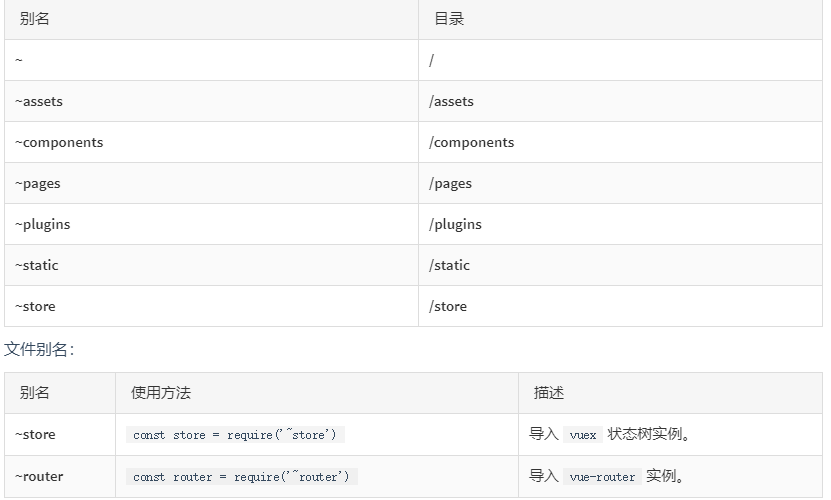

### 2.3.3  页面布局

页面布局就是页面内容的整体结构，通过在layouts目录下添加布局文件来实现。在layouts 根目录下的所有文件都属于个性化布局文件，可以在页面组件中利用 layout 属性来引用。

一个例子：

1. 定义：layouts/test.vue布局文件，如下：

   注意：布局文件中一定要加 `<nuxt/>` 组件用于显示页面内容。

```html
<template>
  <div>
    <div>这里是头</div>
    <nuxt/>
    <div>这里是尾</div>
  </div>
</template>
<script>
  export default {
  }
</script>
<style>
</style>
```

2. 在pages目录创建user目录，并创建index.vue页面

   在 pages/user/index.vue 页面里， 可以指定页面组件使用 test 布局，代码如下：

```html
<template>
  <div>
  测试页面
  </div>
</template>
<script>
  export default{
    layout:'test'
  }
</script>
<style>
</style>
```

3. 测试

   请求：http://localhost:10000/user，如果如下:

```tex
这里是头
测试页面
这里是尾
```

### 2.3.4 路由

#### 2.3.4.1 基础路由

Nuxt.js 依据 `pages `目录结构自动生成 vue-router  模块的路由配置。

Nuxt.js根据`pages`的目录结构及页面名称定义规范来生成路由，下边是一个基础路由的例子：

假设 `pages`的目录结构如下：

```yaml
pages/
‐‐| user/
‐‐‐‐‐| index.vue
‐‐‐‐‐| one.vue
```

那么，Nuxt.js 自动生成的路由配置如下：

```json
router: {
  routes: [
    {
      name: 'user',
      path: '/user',
      component: 'pages/user/index.vue'
    },
    {
      name: 'user‐one',
      path: '/user/one',
      component: 'pages/user/one.vue'
    }
  ]
}
```

index.vue 代码如下：

```html
<template>
  <div>
    用户管理首页
  </div>
</template>
<script>
export default{
   layout:"test"
}
</script>
<style>
</style>
```

one.vue代码如下：

```html
<template>
  <div>
    one页面
  </div>
</template>
<script>
export default{
   layout:"test"
}
</script>
<style>
</style>
```

分别访问如下链接进行测试：

http://localhost:10000/user
http://localhost:10000/user/one

#### 2.3.4.2 嵌套路由

你可以通过 vue-router 的子路由创建 Nuxt.js 应用的嵌套路由。

创建内嵌子路由，你需要添加一个 Vue 文件，同时添加一个与该文件同名的目录用来存放子视图组件。

别忘了在父级 Vue 文件内增加  <nuxt -child/> 用于显示子视图内容。

假设文件结构如：

```yaml
pages/
‐‐| user/
‐‐‐‐‐| _id.vue
‐‐‐‐‐| index.vue
‐‐| user.vue
```

Nuxt.js 自动生成的路由配置如下：

```json
router: {
  routes: [
    {
      path: '/user',
      component: 'pages/user.vue',
      children: [
        {
          path: '',
          component: 'pages/user/index.vue',
          name: 'user'
        },
        {
          path: ':id',
          component: 'pages/user/_id.vue',
          name: 'user‐id'
        }
      ]
    }
  ]
}
```

将user.vue文件创建到与user目录的父目录下，即和user目录保持平级。

```html
<template>
  <div>
    用户管理导航，<nuxt‐link :to="'/user/101'">修改</nuxt‐link>
    <nuxt‐child/>
  </div>
</template>
<script>
  export default{
    layout:"test"
  }
</script>
<style>
</style>
```

_id.vue页面实现了向页面传入id参数，页面内容如下：

```html
<template>
  <div>
     修改用户信息{{id}}
  </div>
</template>
<script>
  export default{
    layout:"test",
    data(){
        return {
            id:''
        }
    },
    mounted(){
      this.id = this.$route.params.id;
      console.log(this.id)
    }
  }
</script>
<style>
</style>
```

测试：http://localhost:10000/user

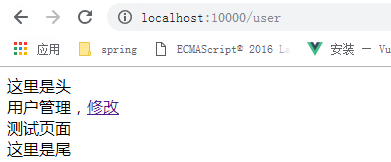

点击修改：
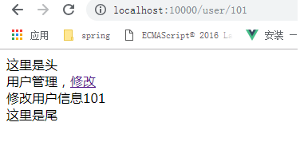

### 2.3.5 获取数据

#### 2.3.5.1 asyncData 方法

Nuxt.js 扩展了 Vue.js，增加了一个叫 asyncData 的方法， asyncData 方法会在组件（限于页面组件）每次加载之前被调用。它可以在服务端或路由更新之前被调用。 在这个方法被调用的时候，第一个参数被设定为当前页面的上下文对象，你可以利用 asyncData 方法来获取数据，Nuxt.js 会将  asyncData 返回的数据融合组件  data 方法返回的数据一并返回给当前组件。

注意：由于 asyncData 方法是在组件 初始化 前被调用的，所以在方法内是没有办法通过  this 来引用组件的实例对象。

例子：

在上边例子中的user/_id.vue中添加，页面代码如下：

```html
 <template>
  <div>
 修改用户信息{{id}},名称：{{name}}
  </div>
</template>
<script>
  export default{
    layout:'test',
    //根据id查询用户信息
    asyncData(){
      console.log("async方法")
      return {
        name:'黑马程序员'
      }
    },
    data(){
      return {
        id:''
      }
    },
    mounted(){
      this.id = this.$route.params.id;
    }
 }
</script>
<style>
</style>
```

此方法在服务端被执行，观察服务端控制台打印输出 “async方法”。

此方法返回data模型数据，在服务端被渲染，最后响应给前端，刷新此页面查看页面源代码可以看到name模型数据已在页面源代码中显示。

#### 2.3.5.2 async /await方法

使用async 和 await配合promise也可以实现同步调用，nuxt.js中使用async/await实现同步调用效果。

1. 先测试异步调用，增加a、b两个方法，并在mounted中调用。

```javascript
methods:{
    a(){
        return new Promise(function(resolve,reject){
          setTimeout(function () {
            resolve(1)
          },2000)
        })
    },
    b(){
      return new Promise(function(resolve,reject){
        setTimeout(function () {
          resolve(2)
        },1000)
      })
    }
},
    mounted(){
        this.a().then(res=>{
            alert(res)
          console.log(res)
        })
        this.b().then(res=>{
          alert(res)
          console.log(res)
        })
    }
```

2. 使用async/await完成同步调用

```javascript
async asyncData({ store, route }) {
         console.log("async方法")
     var a = await new Promise(function (resolve, reject) {
       setTimeout(function () {
         console.log("1")
         resolve(1)
       },2000)
     });
     var a = await new Promise(function (resolve, reject) {
       setTimeout(function () {
         console.log("2")
         resolve(2)
       },1000)
     });
     return {
           name:'黑马程序员'
     }
   }
```

观察服务端控制台发现是按照a、b方法的调用顺序输出1、2，实现了使用async/await完成同步调用。

# 3. 搜索前端开发

## 3.1 搜索页面

### 3.1.1 需求分析


上图是课程搜索前端的界面，用户通过前端向服务端发起搜索请求，搜索功能包括：

1. 界面默认查询所有课程，并分页显示
2. 通过一级分类和二分类搜索课程，选择一级分类后将显示下属的二级分类
3. 通过关键字搜索课程
4. 通过课程等级搜索课程

### 3.1.2 页面布局

nuxt.js将/layout/default.vue作为所有页面的默认布局，通常布局包括：页头、内容区、页尾

default.vue内容如下：

```html
<template>
  <div>
    <Header />
    <nuxt/>
    <Footer />
  </div>
</template>
<script>
  import Footer from '../components/Footer.vue'
  import Header from '../components/Header.vue'
  export default {
    components: {
      Header,
      Footer
    }
  }
</script>
<style>
</style>
```

### 3.1.3 Nginx代理配置

搜索页面中以/static开头的静态资源通过nginx解析，如下：

/static/plugins：指向门户目录下的plugins目录。

/static/css：指向门户目录下的的css目录

修改Nginx中www.xuecheng.com虚拟主机的配置：

```nginx
#静态资源，包括系统所需要的图片，js、css等静态资源
location /static/img/ {      
	alias   F:/develop/xc_portal_static/img/; 
}         
location /static/css/ {      
	alias   F:/develop/xc_portal_static/css/;        
}     
location /static/js/ {      
	alias   F:/develop/xc_portal_static/js/;        
}     
location /static/plugins/ {      
	alias   F:/develop/xc_portal_static/plugins/;        
	add_header Access‐Control‐Allow‐Origin http://ucenter.xuecheng.com;          
	add_header Access‐Control‐Allow‐Credentials true;          
	add_header Access‐Control‐Allow‐Methods GET;        
}
```

配置搜索Url，下图是Nginx搜索转发流程图：

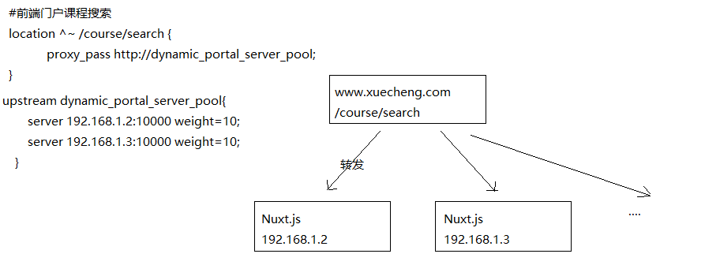

用户请求/course/search时Nginx将请求转发到nuxt.js服务，nginx在转发时根据每台nuxt服务的负载情况进行转发，实现负载均衡。

本教程开发环境Nuxt.js服务和www.xuecheng.com虚拟机主在同一台计算机，使用同一个 nginx，配置如下：

```nginx
#前端门户课程搜索    
location ^~ /course/search {      
	proxy_pass http://dynamic_portal_server_pool;          
}     
#后端搜索服务    
location /openapi/search/ {      
	proxy_pass http://search_server_pool/search/;          
}     
 #分类信息    
location /static/category/ {      
	proxy_pass http://static_server_pool;        
}
```

dynamic_portal_server_pool 配置如下 ：

```nginx
#前端动态门户
upstream dynamic_portal_server_pool{
	server 127.0.0.1:10000 weight=10;        
}
 #后台搜索（公开api）
upstream search_server_pool{    
   server 127.0.0.1:40100 weight=10;      
}
```

其它配置：

```nginx
#开发环境webpack定时加载此文件
location ^~ /__webpack_hmr { 
	proxy_pass http://dynamic_portal_server_pool/__webpack_hmr;      
}
```

```nginx
#开发环境nuxt访问_nuxt
location ^~ /_nuxt/ { 
	proxy_pass http://dynamic_portal_server_pool/_nuxt/;      
}
```

在静态虚拟主机中添加：

```nginx
#学成网静态资源
server {
	listen       91;    
	server_name localhost;    
#分类信息
location /static/category/ { 
    alias  C:/work/develop/nginx-1.14.0/html/xc-ui-pc-static-portal/res/;
}
```

### 3.1.4 搜索页面

创建搜索页面如下：

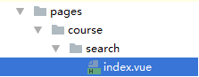

页面文件参考：“资料”--》“search”--》index_1.vue，重要代码如下：

nuxt.js支持定义header，本页面我们在header中引入css样式并定义头部信息。

```javascript
//配置文件
let config = require('~/config/sysConfig')
import querystring from 'querystring'
import * as courseApi from '~/api/course'
export default {
  head() {
    return {
      title: '传智播客‐一样的教育,不一样的品质',
      meta: [
        {charset: 'utf‐8'},
        {name: 'description', content: '传智播客专注IT培训,Java培训,Android培训,安卓培训,PHP培
训,C++培训,网页设计培训,平面设计培训,UI设计培训,移动开发培训,网络营销培训,web前端培训,云计算大数据培训,
全栈工程师培训,产品经理培训。'},
        {name: 'keywords', content: this.keywords}
      ],
      link: [
        {rel: 'stylesheet', href: '/static/plugins/normalize‐css/normalize.css'},
        {rel: 'stylesheet', href: '/static/plugins/bootstrap/dist/css/bootstrap.css'},
        {rel: 'stylesheet', href: '/static/css/page‐learing‐list.css'}
      ]
    }
  },
```

其它数据模型及方法：

```javascript
<script>
  //配置文件
  let config = require('~/config/sysConfig')
  import querystring from 'querystring'
  import * as courseApi from '~/api/course'
  export default {
    head() {
      return {
        title: '传智播客‐一样的教育,不一样的品质',
        meta: [
          {charset: 'utf‐8'},
          {name: 'description', content: '传智播客专注IT培训,Java培训,Android培训,安卓培训,PHP培
训,C++培训,网页设计培训,平面设计培训,UI设计培训,移动开发培训,网络营销培训,web前端培训,云计算大数据培训,
全栈工程师培训,产品经理培训。'},
          {name: 'keywords', content: this.keywords}
        ],
        link: [
          {rel: 'stylesheet', href: '/static/plugins/normalize‐css/normalize.css'},
          {rel: 'stylesheet', href: '/static/plugins/bootstrap/dist/css/bootstrap.css'},
          {rel: 'stylesheet', href: '/static/css/page‐learing‐list.css'}
        ]
      }
    },
    async asyncData({ store, route }) {
      return {
        courselist: {},
        first_category:{},
                  second_category:{},
        mt:'',
        st:'',
        grade:'',
        keyword:'',
        total:0,
        imgUrl:config.imgUrl
      }
    },
    data() {
      return {
        courselist: {},
        first_category:{},
        second_category:{},
        mt:'',
        st:'',
        grade:'',
        keyword:'',
        imgUrl:config.imgUrl,
        total:0,//总记录数
        page:1,//页码
        page_size:12//每页显示个数
      }
    },
    watch:{//路由发生变化立即搜索search表示search方法
      '$route':'search'
    },
    methods: {
      //分页触发
      handleCurrentChange(page) {
      },
      //搜索方法
      search(){
//刷新当前页面        
        window.location.reload();
      }
    }
  }
</script>
```

### 3.1.5 测试

重启Nginx，请求：http://www.xuecheng.com/course/search，页面效果如下：

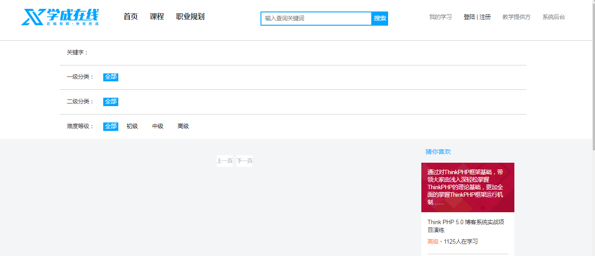

## 3.2  查询全部

### 3.2.1 需求分析

初次进入页面，没有输入任何查询条件，默认查询全部课程，分页显示。

### 3.2.2 API方法

在api目录创建本工程所用的api方法类，api方法类使用了public.js等一些抽取类：

/api/public.js-------------抽取axios 的基础方法

/api/util.js-----------------工具类

/config/sysConfig.js----系统配置类，配置了系统参数变量

创建course.js，作为课程相关业务模块的api方法类。

```javascript
import http from './public'
import qs from 'qs'
let config = require('~/config/sysConfig')
let apiURL = config.apiURL
let staticURL = config.staticURL
if (typeof window === 'undefined') {
  apiURL = config.backApiURL
  staticURL = config.backStaticURL
}
/*搜索*/
export const search_course = (page,size,params) => {
  let querys = qs.stringify(params);
  return http.requestQuickGet(apiURL+"/search/course/list/"+page+"/"+size+"?"+querys);
}
```

### 3.2.3搜索方法

实现思路如下：

1. 用户请求本页面到达node.js
2. 在asyncData方法中向服务端请求查询课程
3. asyncData方法执行完成开始服务端渲染

在asyncData中执行搜索，代码如下：

```javascript
async asyncData({ store, route }) {//服务端调用方法
      //搜索课程
      let page = route.query.page;
      if(!page){
        page = 1;
      }else{
        page = Number.parseInt(page)
      }
      console.log(page);
      //请求搜索服务，搜索服务
      let course_data = await courseApi.search_course(page,2,route.query);
      console.log(course_data)
      if (course_data && course_data.queryResult ) {
        let keywords = ''
        let mt=''
        let st=''
        let grade=''
        let keyword=''
        let total = course_data.queryResult.total
        if( route.query.mt){
          mt = route.query.mt
        }
        if( route.query.st){
          st = route.query.st
        }
        if( route.query.grade){
          grade = route.query.grade
        }
        if( route.query.keyword){
          keyword = route.query.keyword
        }
        return {
          courselist: course_data.queryResult.list,//课程列表
          keywords:keywords,
          mt:mt,
                      st:st,
          grade:grade,
          keyword:keyword,
          page:page,
          total:total,
          imgUrl:config.imgUrl
        }
      }else{
        return {
          courselist: {},
          first_category:{},
          second_category:{},
          mt:'',
          st:'',
          grade:'',
          keyword:'',
          page:page,
          total:0,
          imgUrl:config.imgUrl
        }
      }
    }
}
```

### 3.2.5 页面

在页面中展示课程列表。

```html
<div class="content‐list">
  <div class="recom‐item" v‐for="(course, index) in courselist">
    <nuxt‐link :to="'/course/detail/'+course.id+'.html'" target="_blank">
      <div v‐if="course.pic">
        <p></p>
      </div>
      <div v‐else>
        <p></p>
      </div>
      <ul >
        <li class="course_title"><span v‐html="course.name"></span></li>
        <li style="float: left"><span v‐if="course.charge == '203001'">免费</span>
course.charge == '203002'">￥{{course.price | money}}</span>
          <!‐‐ <em> ∙ </em>‐‐>&nbsp;&nbsp;<!‐‐<em>1125人在学习</em>‐‐></li>
      </ul>
    </nuxt‐link>
  </div>
  <li class="clearfix"></li>
</div>
```

## 3.3  分页查询

### 3.3.1 服务端代码

```java
...
//分页
//当前页码
if(page<=0){
    page = 1;
}
//起始记录下标
int from  = (page ‐1) * size;
searchSourceBuilder.from(from);
searchSourceBuilder.size(size);
...
```

### 3.3.2 前端代码

使用Element-UI的el-pagination分页插件：

```html
<div style="text‐align: center">
  <el‐pagination
    background
    layout="prev, pager, next"
    @current‐change="handleCurrentChange"
    :total="total"
    :page‐size="page_size"
    :current‐page="page"
    prev‐text="上一页"
    next‐text="下一页">
  </el‐pagination>
</div>
```

定义分页触发方法：

```javascript
methods:{
  //分页触发
  handleCurrentChange(page) {
    this.page = page
    this.$route.query.page = page
    let querys = querystring.stringify(this.$route.query)
    window.location = '/course/search?'+querys;
  }
  ...
```

## 3.4  按分类搜索

### 3.4.1 需求分析

1. 通过一级分类搜索
2. 选择一级分类后将显示下属的二级分类
3. 选择二分类进行搜索
4. 选择一级分类的全部则表示没有按照分类搜索
5. 选择一级分类的全部时二级分类不显示

### 3.4.2 API方法

课程分类将通过页面静态化的方式写入静态资源下，通过/category/category.json可访问

通过www.xuecheng.com/static/category/category.json即可访问。

category.json的内容如下：

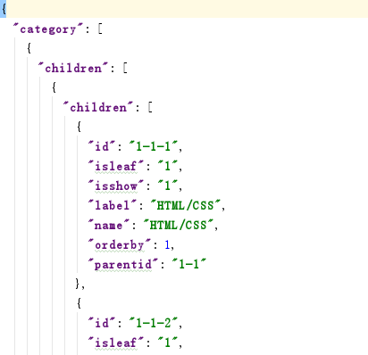

我们需要定义api方法获取所有的分类

在/api/course.js中添加：

```javascript
/*获取分类*/
export const sysres_category = () => {
  return http.requestQuickGet(staticURL+"/static/category/category.json");
}
```

### 3.4.3 在asyncData中查询分类

进入搜索页面将默认显示所有一级分类，当前如果已选择一级分类则要显示所有一级分类及该一级分类下属的二级分类。

在asyncData方法中实现上边的需求，代码如下：

```javascript
 async asyncData({ store, route }) {//服务端调用方法
  //搜索课程
  let page = route.query.page;
  if(!page){
    page = 1;
  }else{
    page = Number.parseInt(page)
  }
  console.log(page);
  //请求搜索服务，搜索服务
  let course_data = await courseApi.search_course(page,2,route.query);
  console.log(course_data)
  //查询分类
  let category_data = await courseApi.sysres_category()
  if (course_data && course_data.queryResult ) {
    //全部分类
    let category = category_data.category//分部分类
    let first_category = category[0].children//一级分类
    let second_category=[]//二级分类
    let keywords = ''
    let mt=''
    let st=''
    let grade=''
    let keyword=''
    let total = course_data.queryResult.total
    if( route.query.mt){
      mt = route.query.mt
    }
    if( route.query.st){
      st = route.query.st
    }
    if( route.query.grade){
      grade = route.query.grade
    }
    if( route.query.keyword){
      keyword = route.query.keyword
    }
    //遍历一级分类
    for(var i in first_category){
      keywords+=first_category[i].name+' '
                  if(mt!=''&& mt == first_category[i].id){
        //取出二级分类
        second_category = first_category[i].children;
        // console.log(second_category)
        break;
      }
    }
    return {
      courselist: course_data.queryResult.list,//课程列表
      first_category: first_category,
      second_category: second_category,
      keywords:keywords,
      mt:mt,
      st:st,
      grade:grade,
      keyword:keyword,
      page:page,
      total:total,
      imgUrl:config.imgUrl
    }
  }else{
    return {
      courselist: {},
      first_category:{},
      second_category:{},
      mt:'',
      st:'',
      grade:'',
      keyword:'',
      page:page,
      total:0,
      imgUrl:config.imgUrl
    }
  }
}
```

### 3.3.4  页面

在页面显示一级分类及二级分类，需要根据当前是否选择一级分类、是否选择二分类显示页面内容。

```html
<ul>
  <li>一级分类：</li>
  <li v‐if="mt!=''"><nuxt‐link  class="title‐link" :to="'/course/search?
keyword='+keyword+'&grade='+grade">全部</nuxt‐link></li>
  <li class="all" v‐else>全部</li>
  <ol>
  <li v‐for="category_v in first_category">
    <nuxt‐link  class="title‐link all" :to="'/course/search?keyword='+keyword+'&mt=' +
category_v.id" v‐if="category_v.id == mt">{{category_v.name}}</nuxt‐link>
    <nuxt‐link  class="title‐link" :to="'/course/search?keyword='+keyword+'&mt=' +
category_v.id" v‐else>{{category_v.name}}</nuxt‐link>
  </li>
  </ol>
  <!‐‐<ol>
    <li>数据分析</li>
    <li>机器学习工程</li>
    <li>前端开发工程</li>
  </ol>‐‐>
</ul>
<ul>
  <li>二级分类：</li>
  <li v‐if="st!=''"><nuxt‐link  class="title‐link" :to="'/course/search?
keyword='+keyword+'&mt='+mt+'&grade='+grade">全部</nuxt‐link></li>
  <li class="all" v‐else>全部</li>
  <ol v‐if="second_category.length>0">
    <li v‐for="category_v in second_category">
      <nuxt‐link  class="title‐link all" :to="'/course/search?keyword='+keyword+'&mt='+mt+'&st='
+ category_v.id" v‐if="category_v.id == st">{{category_v.name}}</nuxt‐link>
      <nuxt‐link  class="title‐link" :to="'/course/search?keyword='+keyword+'&mt='+mt+'&st=' +
category_v.id" v‐else>{{category_v.name}}</nuxt‐link>
    </li>
   <!‐‐ <li>大数据</li>
    <li>云计算</li>‐‐>
  </ol>
  <!‐‐<a href="#" class="more">更多 ∨</a>‐‐>
</ul>
```

### 3.3.5  立即搜索

当用户点击分类时立即执行搜索，实现思路如下：

1. 点击分类立即更改路由。
2. 通过监听路由，路由更改则刷新页面。

* 创建搜索方法

```javascript
search(){
  //刷新当前页面
  window.location.reload();
}
```

* 定义watch

  通过vue.js的watch可以实现监视某个变量，当变量值出现变化时执行某个方法。

  实现思路是：

  1. 点击分类页面路由更改
  2. 通过watch监视路由，路由更改触发search方法

  与methods并行定义watch：

```javascript
watch:{//路由发生变化立即搜索search表示search方法
  '$route':'search'
}
```

## 3.5 按难度等级搜索

### 3.5.1 需求分析

用户选择不同的课程难度等级去搜索课程。


### 3.5.2 API方法

使用 search_course方法完成搜索。

### 3.5.3页面

按难度等级搜索思路如下：

1. 点击难度等级立即更改路由。
2. 通过监听路由，路由更改则立即执行search搜索方法。

```html
<ul> 
  <li>难度等级：</li>
  <li v‐if="grade!=''">
    <nuxt‐link  class="title‐link" :to="'/course/search?keyword='+keyword+'&mt=' +
mt+'&st='+st+'&grade='">全部
    </nuxt‐link>
  </li>
  <li class="all" v‐else>全部</li>
  <ol>
    <li v‐if="grade=='200001'" class="all">初级</li>
    <li v‐else><nuxt‐link  class="title‐link" :to="'/course/search?keyword='+keyword+'&mt=' +
mt+'&st='+st+'&grade=200001'">初级</nuxt‐link></li>
    <li v‐if="grade=='200002'" class="all">中级</li>
    <li v‐else><nuxt‐link  class="title‐link" :to="'/course/search?keyword='+keyword+'&mt=' +
mt+'&st='+st+'&grade=200002'">中级</nuxt‐link></li>
    <li v‐if="grade=='200003'" class="all">高级</li>
    <li v‐else><nuxt‐link  class="title‐link" :to="'/course/search?keyword='+keyword+'&mt=' +
mt+'&st='+st+'&grade=200003'">高级</nuxt‐link></li>
  </ol>
</ul>
```

## 3.6  高亮显示

### 3.6.1 服务端代码

修改service的搜索方法，添加高亮设置：

```java
//设置高亮
HighlightBuilder highlightBuilder = new HighlightBuilder();
highlightBuilder.preTags("<font class='eslight'>");
highlightBuilder.postTags("</font>");
//设置高亮字段
highlightBuilder.fields().add(new HighlightBuilder.Field("name"));
searchSourceBuilder.highlighter(highlightBuilder);

searchRequest.source(searchSourceBuilder);

QueryResult<CoursePub> queryResult = new QueryResult();
List<CoursePub> list = new ArrayList<>();
try {
    //执行搜索
    SearchResponse searchResponse = restHighLevelClient.search(searchRequest);
    //获取响应结果
    SearchHits hits = searchResponse.getHits();
    //匹配的总记录数
    long totalHits = hits.totalHits;
    queryResult.setTotal(totalHits);
    SearchHit[] searchHits = hits.getHits();
    for(SearchHit hit:searchHits){
        CoursePub coursePub = new CoursePub();
        //源文档
        Map<String, Object> sourceAsMap = hit.getSourceAsMap();
        //取出id
        String id = (String)sourceAsMap.get("id");
        coursePub.setId(id);
        //取出name
        String name = (String) sourceAsMap.get("name");
        //取出高亮字段name
        Map<String, HighlightField> highlightFields = hit.getHighlightFields();
        if(highlightFields!=null){
            HighlightField highlightFieldName = highlightFields.get("name");
            if(highlightFieldName!=null){
                Text[] fragments = highlightFieldName.fragments();
                StringBuffer stringBuffer = new StringBuffer();
                for(Text text:fragments){
                    stringBuffer.append(text);
                }
                name = stringBuffer.toString();
            }

        }
        coursePub.setName(name);
        //图片
        String pic = (String) sourceAsMap.get("pic");
        coursePub.setPic(pic);
        //价格
        Double price = null;
        try {
            if(sourceAsMap.get("price")!=null ){
                price = (Double) sourceAsMap.get("price");
            }

        } catch (Exception e) {
            e.printStackTrace();
        }
        coursePub.setPrice(price);
        //旧价格
        Double price_old = null;
        try {
            if(sourceAsMap.get("price_old")!=null ){
                price_old = (Double) sourceAsMap.get("price_old");
            }
        } catch (Exception e) {
            e.printStackTrace();
        }
        coursePub.setPrice_old(price_old);
        //将coursePub对象放入list
        list.add(coursePub);
    }

} catch (IOException e) {
    e.printStackTrace();
}
```

### 3.6.2 前端代码

在search/index.vue中定义eslight样式：

```html
<style>
  .eslight{
    color: red;
  }
</style>
```

# 4. 集成测试

## 4.1  需求分析

本次集成测试的目的如下：

1. 测试课程发布与CMS接口是否正常。
2. 测试课程发布与ES接口是否正常。
3. 测试课程从创建到发布的整个过程。

## 4.2  准备环境

1. 启动MySQL、MongoDB
2. 启动ElasticSearch、RabbitMQ
3. 启动Eureka Server
4. 启动CMS、课程管理服务、搜索服务。
5. 启动Nginx、系统管理前端、教学管理前端、Nuxt.js。