# 1. 在线学习需求分析

## 1.1  需求描述

学成在线作为在线教育网站，提供多种学习形式，包括：录播、直播、图文、社群等，学生登录进入学习中心即可

在线学习，本章节将开发录播课程的在线学习功能，需求如下：

1. 学生可以在windows浏览器上在线观看视频。
2. 播放器具有快进、快退、暂停等基本功能。
3. 学生可以方便切换章节进行学习。

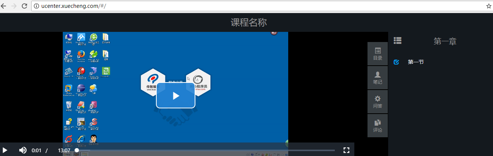

**什么是录播课程？**

录播课程就是提供录制好课程视频，供用户在线点播，反复学习。

**课程视频如何管理？**

媒资管理系统专门来管理课程视频，用户视频文件上传到媒资系统，并对视频进行编码处理。

## 1.2  视频点播解决方案

### 1.2.1 流媒体

**流媒体**（streaming media）是指将一连串的媒体数据压缩后，经过[网络](https://zh.wikipedia.org/wiki/%E7%B6%B2%E8%B7%AF)分段发送数据，在网络上即时传输影音以供观赏的一种技术与过程，此技术使得数据包得以像流水一样发送；如果不使用此技术，就必须在使用前下载整个媒体文件。

流媒体文件一般定义在bit层次结构，因此流数据包并不一定必须按照字节对齐，虽然通常的媒体文件都是按照这种字节对齐的方式打包的。流媒体的三大操作平台是[微软公司](https://zh.wikipedia.org/wiki/%E5%BE%AE%E8%BD%AF%E5%85%AC%E5%8F%B8)、[RealNetworks](https://zh.wikipedia.org/wiki/RealNetworks)、[苹果公司](https://zh.wikipedia.org/wiki/%E8%8B%B9%E6%9E%9C%E5%85%AC%E5%8F%B8)提供的。

**流式传输**

在网络上传输音、视频信息有两个方式：下载和流式传输。

下载：就是把音、视频文件完全下载到本机后开始播放，它的特点是必须等到视频文件下载完成方可播放，播放等待时间较长，无法去播放还未下载的部分视频。

流式传输：就是客户端通过链接视频服务器实时传输音、视频信息，实现“边下载边播放”。

流式传输包括如下两种方式：

1. 顺序流式传输

   即顺序下载音、视频文件，可以实现边下载边播放，不过，用户只能观看已下载的视频内容，无法快进到未下载的视频部分，顺序流式传输可以使用Http服务器来实现，比如Nginx、Apache等。

2. 实时流式传输

   实时流式传输可以解决顺序流式传输无法快进的问题，它与Http流式传输不同，它必须使用流媒体服务器并且使用流媒体协议来传输视频，它比Http流式传输复杂。常见的实时流式传输协议有RTSP、RTMP、RSVP等。

**流媒体系统的概要结构**

通过流媒体系统的概要结构学习流媒体系统的基本业务流程。


1. 将原始的视频文件通过编码器转换为适合网络传输的流格式，编码后的视频直接输送给媒体服务器。

   原始的视频文件通常是事先录制好的视频，比如通过摄像机、摄像头等录像、录音设备采集到的音视频文件，体积较大，要想在网络上传输需要经过压缩处理，即通过编码器进行编码 。

2. 媒体服务获取到编码好的视频文件，对外提供流媒体数据传输接口，接口协议包括 ：HTTP、RTSP、RTMP等 。
3. 播放器通过流媒体协议与媒体服务器通信，获取视频数据，播放视频。

### 1.2.2 点播方案

本项目包括点播和直播两种方式，我们先调研点播的方案，如下：

1. 播放器通过 http协议从http服务器上下载视频文件进行播放

   问题：必须等到视频下载完才可以播放，不支持快进到某个时间点进行播放

2. 播放器通过rtmp协议连接媒体服务器以实时流方式播放视频

   使用rtmp协议需要架设媒体服务器，造价高，对于直播多采用此方案。

3.  播放器使用HLS协议连接http服务器（Nginx、Apache等）实现近实时流方式播放视频

   HLS协议规定：基于Http协议，视频封装格式为ts，视频的编码格式为H264,音频编码格式为MP3、AAC或者AC-

**HLS**

**HTTP Live Streaming**（缩写是**HLS**）是一个由[苹果公司](https://zh.wikipedia.org/wiki/%E8%8B%B9%E6%9E%9C%E5%85%AC%E5%8F%B8)提出的基于[HTTP](https://zh.wikipedia.org/wiki/HTTP)的[流媒体](https://zh.wikipedia.org/wiki/%E6%B5%81%E5%AA%92%E4%BD%93)[网络传输协议](https://zh.wikipedia.org/wiki/%E7%BD%91%E7%BB%9C%E4%BC%A0%E8%BE%93%E5%8D%8F%E8%AE%AE)。是苹果公司[QuickTime X](https://zh.wikipedia.org/w/index.php?title=QuickTime_X&action=edit&redlink=1)和[iPhone](https://zh.wikipedia.org/wiki/IPhone)软件系统的一部分。它的工作原理是把整个流分成一个个小的基于HTTP的文件来下载，每次只下载一些。当媒体流正在播放时，客户端可以选择从许多不同的备用源中以不同的速率下载同样的资源，允许流媒体会话适应不同的数据速率。在开始一个流媒体会话时，客户端会下载一个包含元数据的[extended M3U (m3u8)](https://zh.wikipedia.org/w/index.php?title=Extended_M3U&action=edit&redlink=1) [playlist](https://zh.wikipedia.org/w/index.php?title=Playlist&action=edit&redlink=1)文件，用于寻找可用的媒体流。

HLS只请求基本的HTTP报文，与[实时传输协议（RTP）](https://zh.wikipedia.org/wiki/%E5%AE%9E%E6%97%B6%E4%BC%A0%E8%BE%93%E5%8D%8F%E8%AE%AE)不同，HLS可以穿过任何允许HTTP数据通过的[防火墙](https://zh.wikipedia.org/wiki/%E9%98%B2%E7%81%AB%E5%A2%99)或者[代理服务器](https://zh.wikipedia.org/wiki/%E4%BB%A3%E7%90%86%E6%9C%8D%E5%8A%A1%E5%99%A8)。它也很容易使用[内容分发网络来传输媒体流。](https://zh.wikipedia.org/wiki/%E5%85%A7%E5%AE%B9%E5%88%86%E7%99%BC%E7%B6%B2%E7%B5%A1)

苹果公司把HLS协议作为一个[互联网草案](https://zh.wikipedia.org/w/index.php?title=Internet-Draft&action=edit&redlink=1)（逐步提交），在第一阶段中已作为一个非正式的标准提交到[IETF](https://zh.wikipedia.org/wiki/IETF)。2017年8月，RFC 8216发布，描述了HLS协议第7版的定义。

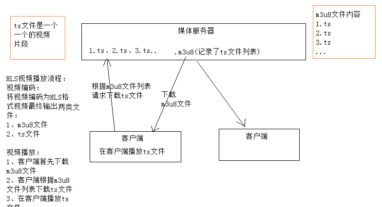

采用 HLS方案即可实现边下载边播放，并可不用使用rtmp等流媒体协议，不用构建专用的媒体服务器，节省成本。

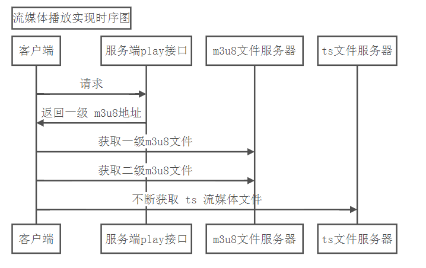

本项目点播方案确定为方案3。

# 2. 视频编码

## 2.1  视频编码格式

所谓[视频](https://baike.baidu.com/item/%E8%A7%86%E9%A2%91)[编码](https://baike.baidu.com/item/%E7%BC%96%E7%A0%81)方式就是指通过特定的[压缩技术](https://baike.baidu.com/item/%E5%8E%8B%E7%BC%A9%E6%8A%80%E6%9C%AF/1444262)，将某个[视频格式](https://baike.baidu.com/item/%E8%A7%86%E9%A2%91%E6%A0%BC%E5%BC%8F/123472)的文件转换成另一种视频格式文件的[方式](https://baike.baidu.com/item/%E6%96%B9%E5%BC%8F/3616191)。[视频流](https://baike.baidu.com/item/%E8%A7%86%E9%A2%91%E6%B5%81)传输中最为重要的编解码标准有国际电联的H.261、H.263、H.264，运动静止图像专家组的[M-JPEG](https://baike.baidu.com/item/M-JPEG)和[国际标准化组织](https://baike.baidu.com/item/%E5%9B%BD%E9%99%85%E6%A0%87%E5%87%86%E5%8C%96%E7%BB%84%E7%BB%87/779832)[运动图像](https://baike.baidu.com/item/%E8%BF%90%E5%8A%A8%E5%9B%BE%E5%83%8F/7181391)专家组的MPEG系列标准，此外在[互联网](https://baike.baidu.com/item/%E4%BA%92%E8%81%94%E7%BD%91/199186)上被广泛应用的还有Real-Networks的RealVideo、[微软公司](https://baike.baidu.com/item/%E5%BE%AE%E8%BD%AF%E5%85%AC%E5%8F%B8/732128)的WMV以及Apple公司的QuickTime等。

首先我们要分清文件格式和编码格式：

**文件格式：**是指.mp4、.avi、.rmvb等 这些不同扩展名的视频文件的文件格式 ，视频文件的内容主要包括视频和音频，其文件格式是按照一 定的编码格式去编码，并且按照该文件所规定的封装格式将视频、音频、字幕等信息封装在一起，播放器会根据它们的封装格式去提取出编码，然后由播放器解码，最终播放音视频。

音视频编码格式：通过音视频的压缩技术，将视频格式转换成另一种视频格式，通过视频编码实现流媒体的传输。

比如：一个.avi的视频文件原来的编码是a，通过编码后编码格式变为b，音频原来为c，通过编码后变为d。

音视频编码格式各类繁多，主要有几下几类：

**MPEG系列** （由ISO[国际标准组织机构]下属的MPEG[运动图象专家组]开发 ）视频编码方面主要是Mpeg1（vcd用的就是它）、Mpeg2（DVD使用）、Mpeg4（的DVDRIP使用的都是它的变种，如：divx，xvid等）、Mpeg4AVC（正热门）；音频编码方面主要是MPEG Audio Layer 1/2、MPEG Audio Layer 3（大名鼎鼎的mp3）、MPEG-2 AAC 、MPEG-4 AAC等等。注意：DVD音频没有采用Mpeg的。

**H.26X系列** （由ITU[国际电传视讯联盟]主导，侧重网络传输，注意：只是视频编码） 包括H.261、H.262、H.263、H.263+、H.263++、H.264（就是MPEG4 AVC-合作的结晶）

目前最常用的编码标准是视频H.264，音频AAC。

提问：

H.264是**编码格式**还是文件格式？

mp4是编码格式还是**文件格式**？

## 2.2 FFmpeg  的基本使用

我们将视频录制完成后，使用视频编码软件对视频进行编码，本项目 使用FFmpeg对视频进行编码 。

FFmpeg是一套可以用来记录、转换数字音频、视频，并能将其转化为流的开源计算机程序。采用LGPL或GPL许可证。它提供了录制、转换以及流化音视频的完整解决方案。它包含了非常先进的音频/视频编解码库libavcodec，为了保证高可移植性和编解码质量，libavcodec里很多code都是从头开发的。

FFmpeg在Linux平台下开发，但它同样也可以在其它操作系统环境中编译运行，包括Windows、Mac OS X等。这个项目最早由Fabrice Bellard发起，2004年至2015年间由Michael Niedermayer主要负责维护。许多FFmpeg的开发人员都来自MPlayer项目，而且当前FFmpeg也是放在MPlayer项目组的服务器上。项目的名称来自MPEG[视频编码标准](https://baike.baidu.com/item/%E8%A7%86%E9%A2%91%E7%BC%96%E7%A0%81%E6%A0%87%E5%87%86)，前面的"FF"代表"Fast Forward"。

FFmpeg被许多开源项目采用，QQ影音、暴风影音、VLC等。

下载：FFmpeg https://www.ffmpeg.org/download.html#build-windows

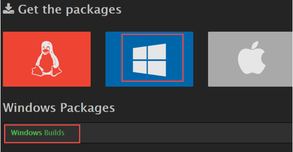

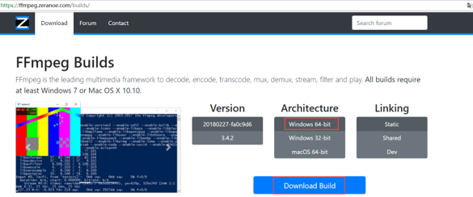

下载 ：ffmpeg-20180227-fa0c9d6-win64-static.zip，并解压，本教程将ffmpeg解压到了F:\devenv\edusoft\ffmpeg-20180227-fa0c9d6-win64-static\ffmpeg-20180227-fa0c9d6-win64-static下。

将F:\devenv\edusoft\ffmpeg-20180227-fa0c9d6-win64-static\ffmpeg-20180227-fa0c9d6-win64-static\bin目录配置在path环境变量中。

检测是否安装成功：

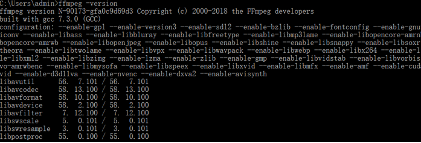

简单的测试：

将一个.avi文件转成mp4、mp3、gif等。

比如我们将lucene.avi文件转成mp4，运行如下命令：

```shell
ffmpeg -i lucene.avi lucene.mp4
```

转成mp3

```shell
ffmpeg -i lucene.avi lucene.mp3
```

转成gif：

```shell
ffmpeg -i lucene.avi lucene.gif
```

官方文档（英文）：http://ffmpeg.org/ffmpeg.html

## 2.2  生成m3u8/ts文件

使用ffmpeg生成 m3u8的步骤如下：

**第一步：先将avi视频转成mp4**

```shell
ffmpeg.exe ‐i  lucene.avi ‐c:v libx264 ‐s 1280x720 ‐pix_fmt yuv420p ‐b:a 63k ‐b:v 753k ‐r 18 .\lucene.mp4
```

下面把各参数意思大概讲讲，大概了解意思即可，不再此展开流媒体专业知识的讲解。

-c:v 视频编码为x264 ，x264编码是H264的一种开源编码格式。

-s 设置分辨率

-pix_fmt yuv420p：设置像素采样方式，主流的采样方式有三种，YUV4:4:4，YUV4:2:2，YUV4:2:0，它的作用是根据采样方式来从码流中还原每个像素点的YUV（亮度信息与色彩信息）值。

-b 设置码率，-b:a和-b:v分别表示音频的码率和视频的码率，-b表示音频加视频的总码率。码率对一个视频质量有很大的作用，后边会介绍。

-r：帧率，表示每秒更新图像画面的次数，通常大于24肉眼就没有连贯与停顿的感觉了。

**第二步：将mp4生成m3u8**

```shell
ffmpeg ‐i  lucene.mp4   ‐hls_time 10 ‐hls_list_size 0  ‐hls_segment_filename ./hls/lucene_%05d.ts ./hls/lucene.m3u8
```

-hls_time 设置每片的长度，单位为秒

-hls_list_size n: 保存的分片的数量，设置为0表示保存所有分片

-hls_segment_filename ：段文件的名称，%05d表示5位数字

生成的效果是：将lucene.mp4视频文件每10秒生成一个ts文件，最后生成一个m3u8文件，m3u8文件是ts的索引文件。

使用VLC打开m3u8文件，测试播放效果，【VLC 是一款自由、开源的跨平台多媒体播放器及框架，可播放大多数多媒体文件，以及 DVD、音频 CD、VCD 及各类流媒体协议。（http://www.videolan.org/）】

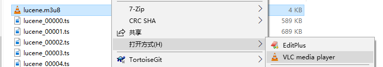

### 2.2.1 码率的设置

码率又叫比特率即每秒传输的bit数，单位为bps(Bit Per Second)，码率越大传送数据的速度越快。

码率的计算公式是：文件大小（转成bit）/ 时长（秒）/1024 = kbps 即每秒传输千位数

例如一个1M的视频，它的时长是10s，它的码率等于

```properties
1*1024*1024*8/10/1024 = 819Kbps
```

码率设置到多少才能达到最好，通过根据个人的经验或参考一些视频网台给出的参考，下图是优酷对码率的要求：

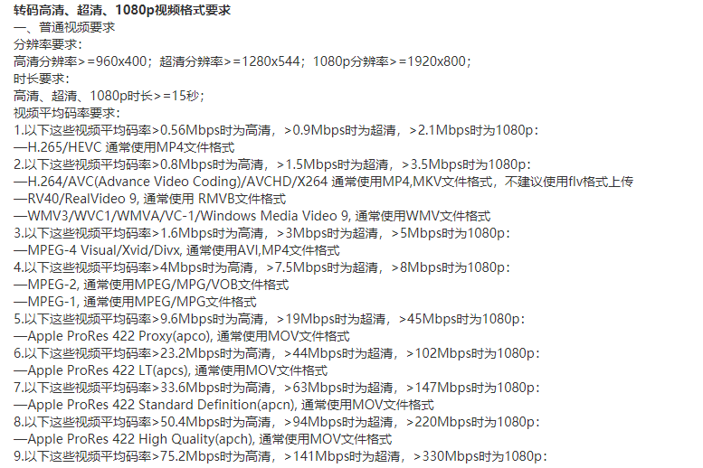


# 3. 播放器

## 3.1  技术选型

视频编码后要使用播放器对其进行解码、播放视频内容。在web应用中常用的播放器有flash播放器、H5播放器或浏览器插件播放器，其中以flash和H5播放器最常见。

flash播放器：缺点是需要在客户机安装Adobe Flash Player播放器，优点是flash播放器已经很成熟了，并且浏览器对flash支持也很好。

H5播放器：基于h5自带video标签进行构建，优点是大部分浏览器支持H5，不用再安装第三方的flash播放器，并且随着前端技术的发展，h5技术会越来越成熟。

本项目采用H5播放器，使用Video.js开源播放器。

Video.js是一款基于HTML5世界的网络视频播放器。它支持HTML5和Flash视频，它支持在台式机和移动设备上播放视频。这个项目于2010年中开始，目前已在40万网站使用。

官方地址：http://videojs.com/

## 3.2  下载video.js

Video.js ： https://github.com/videojs/video.js

videojs-contrib-hls ： https://github.com/videojs/videojs-contrib-hls#installation（ videojs-contrib-hls是播放hls的一个插件）

使用文档：http://docs.videojs.com/tutorial-videojs_.html

本教程使用 video.js 6.7.3 版本，videojs-contrib-hls 5.14.1版本。

下载上边两个文件，为了测试需求将其放在门户的plugins目录中。

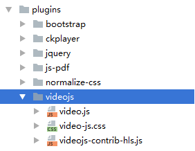

## 3.3  搭建媒体服务器

正常使用video.js播放视频是通过一个网页，用户通过浏览器打开网页去播放视频，网页和视频都从web服务器请求，通常视频的url地址使用单独的域名。

### 3.3.1 Nginx媒体服务器

HLS协议基于Http协议，本项目使用Nginx作为视频服务器。下图是Nginx媒体服务器的配置流程图：

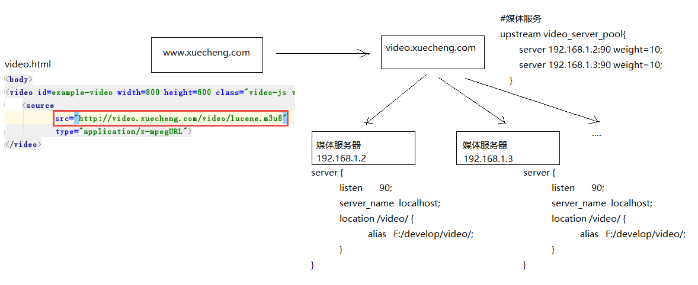

1. 用户打开www.xuecheng.com上边的 video.html网页

   在此网页中引入视频链接，视频地址指向 video.xuecheng.com

2. video.xuecheng.com进行负载均衡处理，将视频请求转发到媒体服务器

   根据上边的流程，我们在媒体服务器上安装Nginx，并配置如下：

```nginx
#学成网媒体服务
server {
	listen       90;    
	server_name  localhost;    
	#视频目录    
	location /video/ {    
		alias   F:/develop/video/;        
	}    
}
```

### 3.3.2 媒体服务器代理

媒体服务器不止一台，通过代理实现负载均衡功能，使用Nginx作为媒体服务器的代理，此代理服务器作为video.xuecheng.com域名服务器。

配置video.xuecheng.com虚拟主机：

注意：开发中代理服务器和媒体服务器在同一台服务器，使用同一个Nginx。

```nginx
#学成网媒体服务代理
map $http_origin $origin_list{
    default http://www.xuecheng.com;
    "~http://www.xuecheng.com" http://www.xuecheng.com;
    "~http://ucenter.xuecheng.com" http://ucenter.xuecheng.com;
}
#学成网媒体服务代理
server {
	listen       80;    
	server_name video.xuecheng.com;    
	   
	location /video {      
		proxy_pass http://video_server_pool;          
		add_header Access‐Control‐Allow‐Origin $origin_list;        
	#add_header Access‐Control‐Allow‐Origin *;        
		add_header Access‐Control‐Allow‐Credentials true;          
		add_header Access‐Control‐Allow‐Methods GET;        
	}     
   
}
```

cors跨域参数：

Access-Control-Allow-Origin：允许跨域访问的外域地址

通常允许跨域访问的站点不是一个，所以这里用map定义了多个站点。

如果允许任何站点跨域访问则设置为*，通常这是不建议的。

Access-Control-Allow-Credentials： 允许客户端携带证书访问

Access-Control-Allow-Methods：允许客户端跨域访问的方法

video_server_pool的配置如下：

```nginx
#媒体服务
upstream video_server_pool{
	server 127.0.0.1:90 weight=10;    
}
```

## 3.4  测试video.js

参考https://github.com/videojs/videojs-contrib-hls#installation

http://jsbin.com/vokipos/8/edit?html,output

1. 编写测试页面video.html。

```html
<!DOCTYPE html>
<html lang="en">
<head>
    <meta http‐equiv="content‐type" content="text/html; charset=utf‐8" />
    <title>视频播放</title>
    <link href="/plugins/videojs/video‐js.css" rel="stylesheet">
</head>
<body>
<video id=example‐video width=800 height=600 class="video‐js vjs‐default‐skin vjs‐big‐play‐
centered" controls poster="http://127.0.0.1:90/video/add.jpg">
    <source
            src="http://video.xuecheng.com/video/hls/lucene.m3u8"
            type="application/x‐mpegURL">
</video>
<input type="button" onClick="switchvideo()" value="switch"/>
<script src="/plugins/videojs/video.js"></script>
<script src="/plugins/videojs/videojs‐contrib‐hls.js"></script>
<script>
    var player = videojs('example‐video');
    //player.play();
//切换视频    
    function switchvideo(){
        player.src({
            src: 'http://video.xuecheng.com/video/hls/lucene.m3u8',
            type: 'application/x‐mpegURL',
            withCredentials: true
        });
        player.play();
    }
</script>
</body>
</html>
```

2. 测试

   配置hosts文件，本教程开发环境使用Window10，修改C:\Windows\System32\drivers\etc\hosts文件

```properties
127.0.0.1 video.xuecheng.com
```

​	效果：

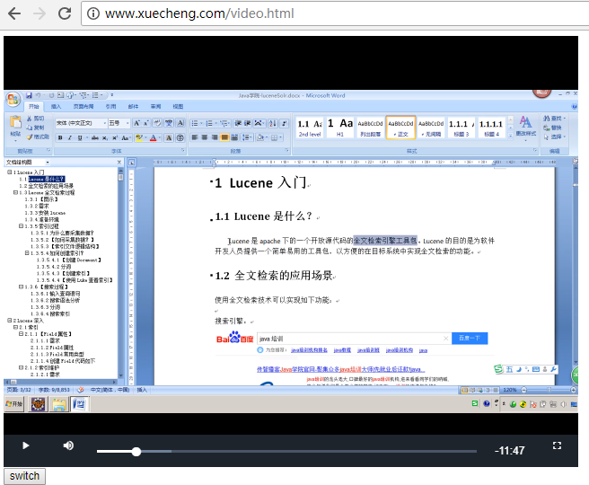

点击"switch"测试切换视频功能。

# 4. 搭建学习中心前端

学成网学习中心提供学生在线学习的各各模块，上一章节测试的点播学习功能也属于学习中心的一部分，本章节将实现学习中心点播学习的前端部分。之所以先实现前端部分，主要是因为要将video.js+vue.js集成，一部分精力还是要放在技术研究。

## 4.1  界面原型

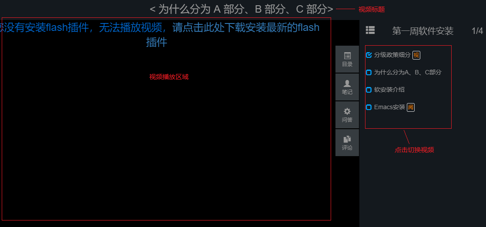

## 4.2  创建学习中心工程

学习中心的用户是学生，为了便于系统维护和扩展，单独创建学习中心工程：

1. 从资料目录拷贝xc-ui-pc-leanring.zip 并解压到xc-ui-pc-leanring目录。
2. 使用webstorm创建打开xc-ui-pc-leanring目录
3. 进入xc-ui-pc-leanring目录，执行cnpm install，将根据package.json的依赖配置远程下载依赖的js包。

创建完成，xc-ui-pc-leanring工程如下：

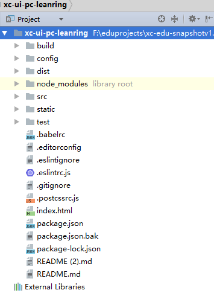

### 4.2.1 配置域名

学习中心的二级域名为ucenter.xuecheng.com，我们在nginx中配置ucenter虚拟主机。

### 4.2.2 访问

启动工程，看到下边的界面说明本工程创建完成：


## 4.3  调试视频播放页面

使用vue-video-player组件将video.js集成到vue.js中，本项目使用vue-video-player实现video.js播放。

组件地址：https://github.com/surmon-china/vue-video-player

上面的 xc-ui-pc-learning工程已经添加vue-video-player组件，我们在vue页面直接使用即可。

前边我们已经测试通过 video.js，下面我们直接在vue页面中使用vue-video-player完成视频播放。

导入learning_video.vue页面到course 模块下。

配置路由：

```html
import learning_video from '@/module/course/page/learning_video.vue';
  {
    path: '/learning/:courseId/:chapter',
    component: learning_video,
    name: '录播视频学习',
    hidden: false,
    iconCls: 'el‐icon‐document'
  }
```

预览效果：

请求：http://ucenter.xuecheng.com/#/learning/1/2

第一个参数： courseId，课程id，这里是测试页面效果随便输入一个ID即可，这里输入1

第二个参数：chapter，课程计划id，这里是测试页面效果随便输入一个ID即可，这里输入2

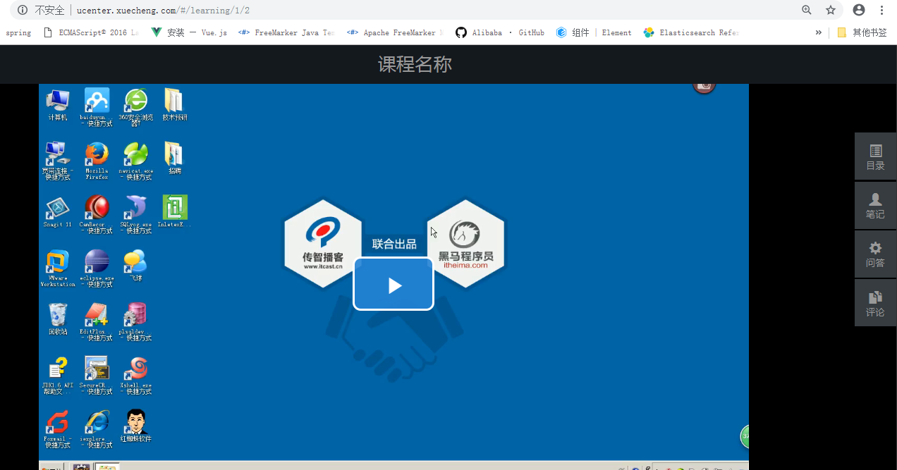


# 5. 媒资管理

前边章节完成在线视频播放，如何实现点击课程计划播放视频呢，课程视频如何管理呢？

本节开始将对课程视频进行管理。

## 5.1 需求分析

[媒体资产管理](https://baike.baidu.com/item/%E5%AA%92%E4%BD%93%E8%B5%84%E4%BA%A7%E7%AE%A1%E7%90%86/1988289)（Media Asset Management，简称MAM）是对各种类型媒体资料数据，如视音频资料、文本文件、图表等进行全面管理的完整解决方案。其目的是将现有的影视节目进行数字化或数据化，并采用适当的方式编码，再记录到成熟稳定的[媒体](https://baike.baidu.com/item/%E5%AA%92%E4%BD%93/203321)上，达到影视节目长期保存和重复利用的目的，以满足影视节目的制作、播出和交换的需要。

每个教学机构都可以在媒资系统管理自己的教学资源，包括：视频、教案等文件。

目前媒资管理的主要管理对象是课程录播视频，包括：媒资文件的查询、视频上传、视频删除、视频处理等。

媒资查询：教学机构查询自己所拥有的媒体文件。

视频上传：将用户线下录制的教学视频上传到媒资系统。

视频处理：视频上传成功，系统自动对视频进行编码处理。

视频删除 ：如果该视频已不再使用，可以从媒资系统删除。

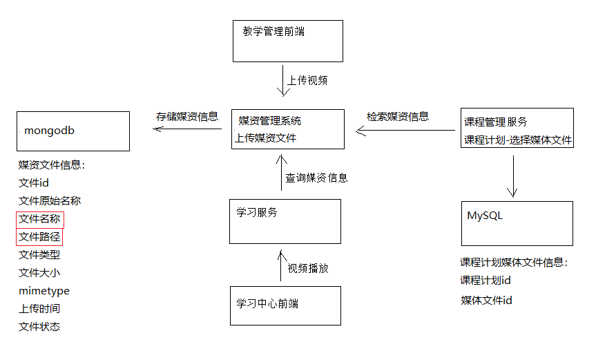

1. 上传媒资文件

   前端/客户端请求媒资系统上传文件。

   文件上传成功将文件存储到媒资服务器，将文件信息存储到数据库。

2. 使用媒资
   课程管理请求媒资系统查询媒资信息，将课程计划与媒资信息对应、存储。

3. 视频播放

   用户进入学习中心请求学习服务学习在线播放视频。

   学习服务校验用户资格通过后请求媒资系统获取视频地址。

## 5.2  开发环境

### 5.2.1 创建媒资数据库

1. 媒资文件信息

```java
@Data
@ToString
@Document(collection = "media_file")
public class MediaFile {
    /*
    文件id、名称、大小、文件类型、文件状态（未上传、上传完成、上传失败）、上传时间、视频处理方式、视频处理状态、hls_m3u8,hls_ts_list、课程视频信息（课程id、章节id）
     */
    @Id
    //文件id
    private String fileId;
    //文件名称
    private String fileName;
    //文件原始名称
    private String fileOriginalName;
    //文件路径
    private String filePath;
    //文件url
    private String fileUrl;
    //文件类型
    private String fileType;
    //mimetype
    private String mimeType;
    //文件大小
    private Long fileSize;
    //文件状态
    private String fileStatus;
    //上传时间
    private Date uploadTime;
    //处理状态
    private String processStatus;
    //hls处理
    private MediaFileProcess_m3u8 mediaFileProcess_m3u8;

    //tag标签用于查询
    private String tag;

}
```

2. 创建xc_media数据库`xc_media`

   媒资系统使用mongodb数据库存储媒资信息。

### 5.2.2 创建媒资服务工程

媒资管理的相关功能单独在媒资服务中开发，下边创建媒资服务工程（xc-service-manage-media）。

媒资服务的配置与cms类似，导入 “资料”--》xc-service-manage-media工程，工程结构如下：

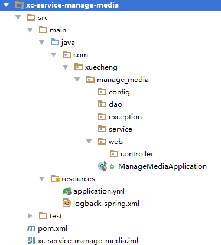

## 5.3 上传文件

### 5.3.1 断点续传解决方案

通常视频文件都比较大，所以对于媒资系统上传文件的需求要满足大文件的上传要求。http协议本身对上传文件大小没有限制，但是客户的网络环境质量、电脑硬件环境等参差不齐，如果一个大文件快上传完了网断了，电断了没有上传完成，需要客户重新上传，这是致命的，所以对于大文件上传的要求最基本的是断点续传。

什么是断点续传：

引用百度百科：断点续传指的是在下载或上传时，将下载或上传任务（一个文件或一个压缩包）人为的划分为几个部分，每一个部分采用一个线程进行上传或下载，如果碰到网络故障，可以从已经上传或下载的部分开始继续上传下载未完成的部分，而没有必要从头开始上传下载，断点续传可以提高节省操作时间，提高用户体验性。

如下图：

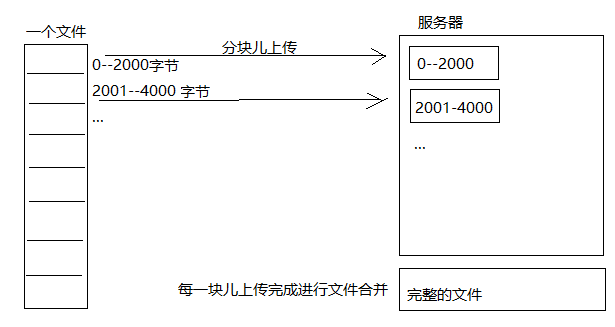

上传流程如下：

1. 上传前先把文件分成块
2. 一块一块的上传，上传中断后重新上传，已上传的分块则不用再上传
3. 各分块上传完成最后合并文件

文件下载则同理。

### 5.3.2 文件分块与合并

为了更好的理解文件分块上传的原理，下边用java代码测试文件的分块与合并。

#### 5.3.2.1文件分块

文件分块的流程如下：

1. 获取源文件长度
2. 根据设定的分块文件的大小计算出块数
3. 从源文件读数据依次向每一个块文件写数据。

```java
//测试文件分块
@Test
public void testChunk() throws IOException {
    //源文件
    File sourceFile = new File("C:\\Users\\fudingcheng\\Desktop\\video\\lucene.avi");
    //块文件目录
    String chunkFileFolder = "C:\\Users\\fudingcheng\\Desktop\\video\\chunks\\";

    //先定义块文件大小
    long chunkFileSize = 1 * 1024 * 1024;

    //块数
    long chunkFileNum = (long) Math.ceil(sourceFile.length() * 1.0 /chunkFileSize);

    //创建读文件的对象
    RandomAccessFile raf_read = new RandomAccessFile(sourceFile,"r");

    //缓冲区
    byte[] b = new byte[1024];
    for(int i=0;i<chunkFileNum;i++){
        //块文件
        File chunkFile = new File(chunkFileFolder+i);

        //创建向块文件的写对象
        RandomAccessFile raf_write = new RandomAccessFile(chunkFile,"rw");
        int len = -1;

        while((len = raf_read.read(b))!=-1){

            raf_write.write(b,0,len);
            //如果块文件的大小达到 1M开始写下一块儿
            if(chunkFile.length()>=chunkFileSize){
                break;
            }
        }
        raf_write.close();


    }
    raf_read.close();
}
```

#### 5.3.2.2文件合并

文件合并流程：

1. 找到要合并的文件并按文件合并的先后进行排序。
2. 创建合并文件
3. 依次从合并的文件中读取数据向合并文件写入数

```java
@Test
public void testMergeFile() throws IOException {
    //块文件目录
    String chunkFileFolderPath = "C:\\Users\\fudingcheng\\Desktop\\video\\chunks\\";
    //块文件目录对象
    File chunkFileFolder = new File(chunkFileFolderPath);
    //块文件列表
    File[] files = chunkFileFolder.listFiles();
    //将块文件排序，按名称升序
    List<File> fileList = Arrays.asList(files);
    Collections.sort(fileList, new Comparator<File>() {
        @Override
        public int compare(File o1, File o2) {
            if(Integer.parseInt(o1.getName())>Integer.parseInt(o2.getName())){
                return 1;
            }
            return -1;

        }
    });

    //合并文件
    File mergeFile = new File("C:\\Users\\fudingcheng\\Desktop\\video\\lucene_merge.avi");
    //创建新文件
    boolean newFile = mergeFile.createNewFile();

    //创建写对象
    RandomAccessFile raf_write = new RandomAccessFile(mergeFile,"rw");

    byte[] b = new byte[1024];
    for(File chunkFile:fileList){
        //创建一个读块文件的对象
        RandomAccessFile raf_read = new RandomAccessFile(chunkFile,"r");
        int len = -1;
        while((len = raf_read.read(b))!=-1){
            raf_write.write(b,0,len);
        }
        raf_read.close();
    }
    raf_write.close();
}
```

### 5.3.3 前端页面

上传文件的页面内容参考：“资料”--》upload.vue文件

#### 5.3.3.1 WebUploader介绍

如何在web页面实现断点续传？

常见的方案有：

1. 通过Flash上传，比如SWFupload、Uploadify。
2. 安装浏览器插件，变相的pc客户端，用的比较少。
3. Html5

随着html5的流行，本项目采用Html5完成文件分块上传。

本项目使用WebUploader完成大文件上传功能的开发，WebUploader官网地址：http://fexteam.gz01.bdysite.com/webuploader/


使用WebUploader上传流程如下：

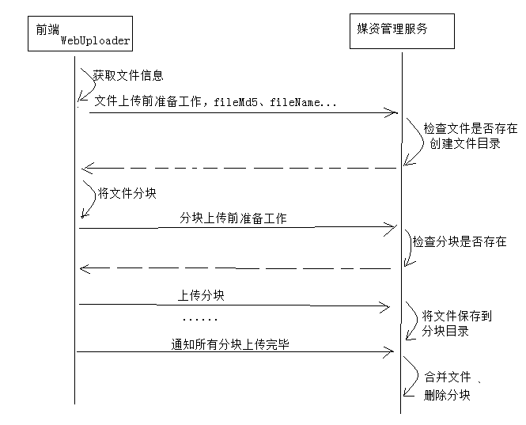

#### 5.3.3.2 钩子方法

在webuploader中提供很多钩子方法，下边列出一些重要的：

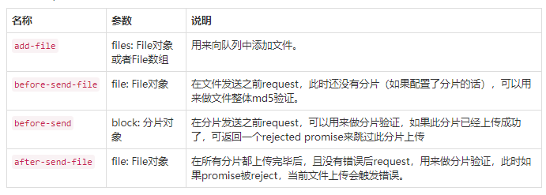

本项目使用如下钩子方法：

1. before-send-file

   在开始对文件分块儿之前调用，可以做一些上传文件前的准备工作，比如检查文件目录是否创建完成等。

2. before-send

   在上传文件分块之前调用此方法，可以请求服务端检查分块是否存在，如果已存在则此分块儿不再上传。

3. after-send-file

   在所有分块上传完成后触发，可以请求服务端合并分块文件。

注册钩子方法源代码：

```javascript
WebUploader.Uploader.register({
    "before‐send‐file":"beforeSendFile",
    "before‐send":"beforeSend",
    "after‐send‐file":"afterSendFile"
}
```

#### 5.3.3.3 构建WebUploader

使用webUploader前需要创建webUploader对象。

指定上传分块的地址：/api/media/upload/uploadchunk

```javascript
// 创建uploader对象，配置参数
this.uploader = WebUploader.create(
  {
    swf:"/static/plugins/webuploader/dist/Uploader.swf",//上传文件的flash文件，浏览器不支持h5时启动
flash
    server:"/api/media/upload/uploadchunk",//上传分块的服务端地址，注意跨域问题
    fileVal:"file",//文件上传域的name
    pick:"#picker",//指定选择文件的按钮容器
    auto:false,//手动触发上传
    disableGlobalDnd:true,//禁掉整个页面的拖拽功能
    chunked:true,// 是否分块上传
    chunkSize:1*1024*1024, // 分块大小（默认5M）
    threads:3, // 开启多个线程（默认3个）
    prepareNextFile:true// 允许在文件传输时提前把下一个文件准备好
  }
)
```

#### 5.3.3.4 before-send-file

文件开始上传前前端请求服务端准备上传工作。

参考源代码如下：

```javascript
type:"POST",
url:"/api/media/upload/register",
data:{
  // 文件唯一表示
  fileMd5:this.fileMd5,
  fileName: file.name,
  fileSize:file.size,
  mimetype:file.type,
  fileExt:file.ext
}
```

#### 5.3.3.5 before-send

上传分块前前端请求服务端校验分块是否存在。

参考源代码如下：

```javascript
type:"POST",
url:"/api/media/upload/checkchunk",
data:{
  // 文件唯一表示
  fileMd5:this.fileMd5,
  // 当前分块下标
  chunk:block.chunk,
  // 当前分块大小
  chunkSize:block.end‐block.start
}
```

#### 5.3.3.6 after-send-file

在所有分块上传完成后触发，可以请求服务端合并分块文件

参考代码如下：

```javascript
type:"POST",
url:"/api/media/upload/mergechunks",
data:{
  fileMd5:this.fileMd5,
  fileName: file.name,
  fileSize:file.size,
  mimetype:file.type,
  fileExt:file.ext
}
```

#### 5.3.3.7 页面效果

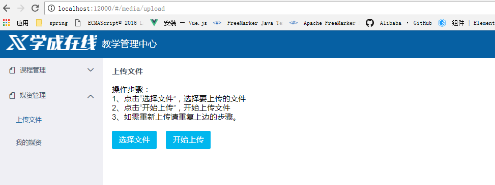

### 5.3.4 Api接口

定义文件上传的Api接口，此接收是前端WebUploader调用服务端的接口。

编写此接口需要参数前端WebUploader应用代码。

```java
@Api(value = "媒资管理接口",description = "媒资管理接口，提供文件上传、处理等接口")
public interface MediaUploadControllerApi {

    //文件上传前的准备工作,校验文件是否存在
    @ApiOperation("文件上传注册")
    public ResponseResult register( String fileMd5,
                                    String fileName,
                                    Long fileSize,
                                    String mimetype,
                                    String fileExt);

    @ApiOperation("校验分块文件是否存在")
    public CheckChunkResult checkchunk(String fileMd5,
                                        Integer chunk,
                                        Integer chunkSize);

    @ApiOperation("上传分块")
    public ResponseResult uploadchunk(MultipartFile file,
                                      String fileMd5,
                                      Integer chunk);

    @ApiOperation("合并分块")
    public ResponseResult mergechunks(String fileMd5,
                                       String fileName,
                                       Long fileSize,
                                       String mimetype,
                                       String fileExt);

}
```

### 5.3.5媒资服务端编写

#### 5.3.5.1  业务流程

服务端需要实现如下功能：

1. 上传前检查上传环境

   检查文件是否上传，已上传则直接返回。

   检查文件上传路径是否存在，不存在则创建。

2. 分块检查

   检查分块文件是否上传，已上传则返回true。

   未上传则检查上传路径是否存在，不存在则创建。

3. 分块上传

   将分块文件上传到指定的路径。

4. 合并分块

   将所有分块文件合并为一个文件。

   在数据库记录文件信息。

#### 5.3.5.2 上传注册

由于上传过程复杂，开发时按业务流程分别实现。

1. 配置

   application.yml配置上传文件的路径：

```yaml
xc‐service‐manage‐media:
  upload‐location: F:/develop/video/
```

2. 定义Dao

   媒资文件管理Dao

```java
public interface MediaFileRepository extends MongoRepository<MediaFile,String> {
}
```

3. Service

```java
@Service
public class MediaUploadService {
    @Autowired
    MediaFileRepository mediaFileRepository;

    @Value("${xc-service-manage-media.upload-location}")
    String upload_location;
    @Value("${xc-service-manage-media.mq.routingkey-media-video}")
    String routingkey_media_video;

    @Autowired
    RabbitTemplate rabbitTemplate;
}
```

功能：

1. 检查上传文件是否存在
2. 创建文件目录

```java
//得到文件所属目录路径
private String getFileFolderPath(String fileMd5){
    return  upload_location + fileMd5.substring(0,1) + "/" + fileMd5.substring(1,2) + "/" + fileMd5 
        + "/";
}

//得到文件的路径
private String getFilePath(String fileMd5,String fileExt){
    return upload_location + fileMd5.substring(0,1) + "/" + fileMd5.substring(1,2) + "/" + fileMd5 + 
        "/" + fileMd5 + "." +fileExt;
}
```

```java
public ResponseResult register(String fileMd5, String fileName, Long fileSize, String mimetype, 
                               String fileExt) {

    //1  检查文件在磁盘上是否存在
    //文件所属目录的路径
    String fileFolderPath = this.getFileFolderPath(fileMd5);
    //文件的路径
    String filePath =this.getFilePath(fileMd5,fileExt);
    File file = new File(filePath);
    //文件是否存在
    boolean exists = file.exists();

    //2 检查文件信息在mongodb中是否存在
    Optional<MediaFile> optional = mediaFileRepository.findById(fileMd5);
    if(exists && optional.isPresent()){
        //文件存在
        ExceptionCast.cast(MediaCode.UPLOAD_FILE_REGISTER_EXIST);
    }
    //文件不存在时作一些准备工作，检查文件所在目录是否存在，如果不存在则创建
    File fileFolder = new File(fileFolderPath);
    if(!fileFolder.exists()){
        fileFolder.mkdirs();
    }

    return new ResponseResult(CommonCode.SUCCESS);
}
```

#### 5.3.5.3 分块检查

在Service 中定义分块检查方法：

```java
//得到块文件所属目录路径
private String getChunkFileFolderPath(String fileMd5){
    return  upload_location + fileMd5.substring(0,1) + "/" + fileMd5.substring(1,2) + "/" + fileMd5 
        + "/chunk/";
}
```

```java
/**
 *
 * @param fileMd5 文件md5
 * @param chunk 块的下标
 * @param chunkSize 块的大小
 * @return
 */
public CheckChunkResult checkchunk(String fileMd5, Integer chunk, Integer chunkSize) {
    //检查分块文件是否存在
    //得到分块文件的所在目录
    String chunkFileFolderPath = this.getChunkFileFolderPath(fileMd5);
    //块文件
    File chunkFile = new File(chunkFileFolderPath + chunk);
    if(chunkFile.exists()){
        //块文件存在
        return new CheckChunkResult(CommonCode.SUCCESS,true);
    }else{
        //块文件不存在
        return new CheckChunkResult(CommonCode.SUCCESS,false);
    }

}
```

#### 5.3.5.4 上传分块

在Service 中定义分块上传分块方法：

```java
//上传分块
public ResponseResult uploadchunk(MultipartFile file, String fileMd5, Integer chunk) {
    //检查分块目录，如果不存在则要自动创建
    //得到分块目录
    String chunkFileFolderPath = this.getChunkFileFolderPath(fileMd5);
    //得到分块文件路径
    String chunkFilePath = chunkFileFolderPath + chunk;

    File chunkFileFolder = new File(chunkFileFolderPath);
    //如果不存在则要自动创建
    if(!chunkFileFolder.exists()){
        chunkFileFolder.mkdirs();
    }
    //得到上传文件的输入流
    InputStream inputStream = null;
    FileOutputStream outputStream  =null;
    try {
        inputStream = file.getInputStream();
        outputStream = new FileOutputStream(new File(chunkFilePath));
        IOUtils.copy(inputStream,outputStream);
    } catch (IOException e) {
        e.printStackTrace();
    }finally {
        try {
            inputStream.close();
        } catch (IOException e) {
            e.printStackTrace();
        }
        try {
            outputStream.close();
        } catch (IOException e) {
            e.printStackTrace();
        }
    }
    return new ResponseResult(CommonCode.SUCCESS);

}
```

#### 5.3.5.5 合并分块

在Service 中定义分块合并分块方法，功能如下：

1. 将块文件合并
2. 校验文件md5是否正确
3. 向Mongodb写入文件信息

```java
public ResponseResult mergechunks(String fileMd5, String fileName, Long fileSize, String mimetype, 
                                  String fileExt) {

    //1、合并所有分块
    //得到分块文件的属目录
    String chunkFileFolderPath = this.getChunkFileFolderPath(fileMd5);
    File chunkFileFolder = new File(chunkFileFolderPath);
    //分块文件列表
    File[] files = chunkFileFolder.listFiles();
    List<File> fileList = Arrays.asList(files);

    //创建一个合并文件
    String filePath = this.getFilePath(fileMd5, fileExt);
    File mergeFile = new File(filePath);

    //执行合并
    mergeFile = this.mergeFile(fileList, mergeFile);
    if(mergeFile == null){
        //合并文件失败
        ExceptionCast.cast(MediaCode.MERGE_FILE_FAIL);
    }

    //2、校验文件的md5值是否和前端传入的md5一到
    boolean checkFileMd5 = this.checkFileMd5(mergeFile, fileMd5);
    if(!checkFileMd5){
        //校验文件失败
        ExceptionCast.cast(MediaCode.MERGE_FILE_CHECKFAIL);
    }
    //3、将文件的信息写入mongodb
    MediaFile mediaFile = new MediaFile();
    mediaFile.setFileId(fileMd5);
    mediaFile.setFileOriginalName(fileName);
    mediaFile.setFileName(fileMd5 + "." +fileExt);
    //文件路径保存相对路径
    String filePath1 = fileMd5.substring(0,1) + "/" + fileMd5.substring(1,2) + "/" + fileMd5 + "/";
    mediaFile.setFilePath(filePath1);
    mediaFile.setFileSize(fileSize);
    mediaFile.setUploadTime(new Date());
    mediaFile.setMimeType(mimetype);
    mediaFile.setFileType(fileExt);
    //状态为上传成功
    mediaFile.setFileStatus("301002");
    mediaFileRepository.save(mediaFile);
    //向MQ发送视频处理消息
    sendProcessVideoMsg(mediaFile.getFileId());
    return new ResponseResult(CommonCode.SUCCESS);
}
```

```java
//校验文件
private boolean checkFileMd5(File mergeFile,String md5){

    try {
        //创建文件输入流
        FileInputStream inputStream = new FileInputStream(mergeFile);
        //得到文件的md5
        String md5Hex = DigestUtils.md5Hex(inputStream);

        //和传入的md5比较
        if(md5.equalsIgnoreCase(md5Hex)){
            return true;
        }
    } catch (Exception e) {
        e.printStackTrace();
        return false;
    }
    return false;

}
```

```java
public ResponseResult sendProcessVideoMsg(String mediaId){

    //查询数据库mediaFile
    Optional<MediaFile> optional = mediaFileRepository.findById(mediaId);
    if(!optional.isPresent()){
        ExceptionCast.cast(CommonCode.FAIL);
    }
    //构建消息内容
    Map<String,String> map = new HashMap<>();
    map.put("mediaId",mediaId);
    String jsonString = JSON.toJSONString(map);
    //向MQ发送视频处理消息
    try {
        rabbitTemplate.convertAndSend(RabbitMQConfig.EX_MEDIA_PROCESSTASK,routingkey_media_video,jsonString);
    } catch (AmqpException e) {
        e.printStackTrace();
        return new ResponseResult(CommonCode.FAIL);
    }

    return new ResponseResult(CommonCode.SUCCESS);
}
```

```java
//合并文件
private File mergeFile(List<File> chunkFileList, File mergeFile) {
    try {
        //如果合并文件已存在则删除，否则创建新文件
        if (mergeFile.exists()) {
            mergeFile.delete();
        } else {
            //创建一个新文件
            mergeFile.createNewFile();
        }

        //对块文件进行排序
        Collections.sort(chunkFileList, new Comparator<File>() {
            @Override
            public int compare(File o1, File o2) {
                if(Integer.parseInt(o1.getName())>Integer.parseInt(o2.getName())){
                    return 1;
                }
                return -1;

            }
        });
        //创建一个写对象
        RandomAccessFile raf_write = new RandomAccessFile(mergeFile,"rw");
        byte[] b = new byte[1024];
        for(File chunkFile:chunkFileList){
            RandomAccessFile raf_read = new RandomAccessFile(chunkFile,"r");
            int len = -1;
            while ((len = raf_read.read(b))!=-1){
                raf_write.write(b,0,len);
            }
            raf_read.close();
        }
        raf_write.close();
        return mergeFile;
    } catch (IOException e) {
        e.printStackTrace();
        return null;
    }
}
```

#### 5.3.5.6 Controller

```java
@RestController
@RequestMapping("/media/upload")
public class MediaUploadController implements MediaUploadControllerApi {

    @Autowired
    MediaUploadService mediaUploadService;

    //文件上传前的注册
    @Override
    @PostMapping("/register")
    public ResponseResult register(String fileMd5, String fileName, Long fileSize, String mimetype, String fileExt) {
        return mediaUploadService.register(fileMd5,fileName,fileSize,mimetype,fileExt);
    }

    @Override
    @PostMapping("/checkchunk")
    public CheckChunkResult checkchunk(String fileMd5, Integer chunk, Integer chunkSize) {
        return mediaUploadService.checkchunk(fileMd5,chunk,chunkSize);
    }

    @Override
    @PostMapping("/uploadchunk")
    public ResponseResult uploadchunk(MultipartFile file, String fileMd5, Integer chunk) {
        return mediaUploadService.uploadchunk(file,fileMd5,chunk);
    }

    @Override
    @PostMapping("/mergechunks")
    public ResponseResult mergechunks(String fileMd5, String fileName, Long fileSize, String mimetype, String fileExt) {
        return mediaUploadService.mergechunks(fileMd5,fileName,fileSize, mimetype,fileExt);
    }
}
```

