# 1. 视频处理

## 1.1 需求分析

原始视频通常需要经过编码处理，生成m3u8和ts文件方可基于HLS协议播放视频。通常用户上传原始视频，系统自动处理成标准格式，系统对用户上传的视频自动编码、转换，最终生成m3u8文件和ts文件，处理流程如下：

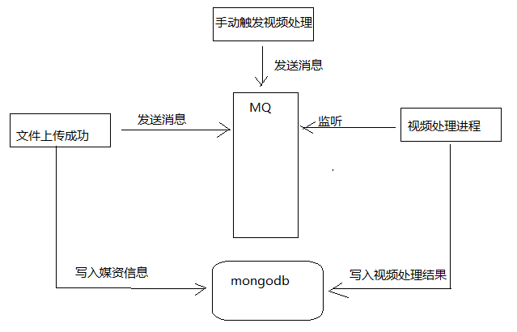

1. 用户上传视频成功 
2. 系统对上传成功的视频自动开始编码处理
3. 用户查看视频处理结果，没有处理成功的视频用户可在管理界面再次触发处理
4. 视频处理完成将视频地址及处理结果保存到数据库

视频处理进程的任务是接收视频处理消息进行视频处理，业务流程如下：

1. 监听MQ，接收视频处理消息
2. 进行视频处理。
3. 向数据库写入视频处理结果。

视频处理进程属于媒资管理系统的一部分，考虑提高系统的扩展性，将视频处理单独定义视频处理工程。

## 1.2  视频处理开发

### 1.2.1 视频处理工程创建

1. 导入“资料”下的视频处理工程：xc-service-manage-media-processor

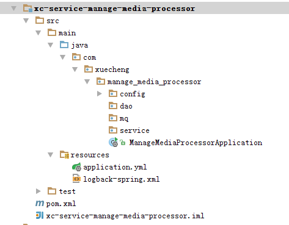

2. RabbitMQ配置

   使用rabbitMQ的routing交换机模式，视频处理程序监听视频处理队列，如下图：

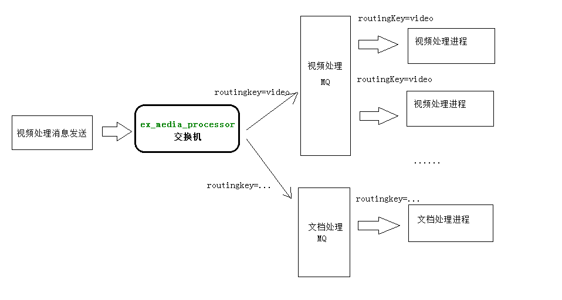

* 在application.yml中配置队列名称及routingkey

```yaml
xc‐service‐manage‐media:
  mq:
    queue‐media‐video‐processor: queue_media_video_processor
    routingkey‐media‐video: routingkey_media_video
```


* RabbitMQ 配置如下：

```java
@Configuration
public class RabbitMQConfig {
    public static final String EX_MEDIA_PROCESSTASK = "ex_media_processor";
    //视频处理队列
    @Value("${xc‐service‐manage‐media.mq.queue‐media‐video‐processor}")
    public  String queue_media_video_processtask;
    //视频处理路由
    @Value("${xc‐service‐manage‐media.mq.routingkey‐media‐video}")
    public  String routingkey_media_video;
    /**
     * 交换机配置
     * @return the exchange
     */
    @Bean(EX_MEDIA_PROCESSTASK)
    public Exchange EX_MEDIA_VIDEOTASK() {
        return ExchangeBuilder.directExchange(EX_MEDIA_PROCESSTASK).durable(true).build();
    }
    //声明队列
    @Bean("queue_media_video_processtask")
    public Queue QUEUE_PROCESSTASK() {
        Queue queue = new Queue(queue_media_video_processtask,true,false,true);
        return queue;
    }
    /**
     * 绑定队列到交换机 .
     * @param queue    the queue
     * @param exchange the exchange
     * @return the binding
     */
    @Bean
    public Binding binding_queue_media_processtask(@Qualifier("queue_media_video_processtask")
Queue queue, @Qualifier(EX_MEDIA_PROCESSTASK) Exchange exchange) {
        return BindingBuilder.bind(queue).to(exchange).with(routingkey_media_video).noargs();
    }
}
```

### 1.2.2 视频处理技术方案

如何通过程序进行视频处理？

ffmpeg是一个可行的视频处理程序，可以通过Java调用ffmpeg.exe完成视频处理。

在java中可以使用Runtime类和Process Builder类两种方式来执行外部程序，工作中至少掌握一种。

本项目使用Process Builder的方式来调用ffmpeg完成视频处理。

关于Process Builder的测试如下：

```java
@SpringBootTest
@RunWith(SpringRunner.class)
public class TestProcessBuilder {

    //使用processBuilder来调用第三方应用程序
    @Test
    public void testProcessBuilder() throws IOException {
        //创建processBuilder对象
        ProcessBuilder processBuilder = new ProcessBuilder();
        //设置第三方应用程序的命令
		//processBuilder.command("ping","127.0.0.1");
        processBuilder.command("ipconfig");

        //将标准输入流和错误流合并
        processBuilder.redirectErrorStream(true);
        //启动一个进程
        Process process = processBuilder.start();

        //通过标准输入流来拿到正常和错误的信息
        InputStream inputStream = process.getInputStream();

        //转成字符流
        InputStreamReader reader = new InputStreamReader(inputStream,"gbk");
        //缓冲
        char[] chars = new char[1024];
        int len = -1;
        while ((len = reader.read(chars))!=-1){
            String string = new String(chars,0,len);
            System.out.println(string);
        }
        inputStream.close();
        reader.close();

    }
}
```

关于FFMpeg的测试如下：

```java
@Test
public void testFFmpeg() throws IOException {
    //创建processBuilder对象
    ProcessBuilder processBuilder = new ProcessBuilder();
    //设置第三方应用程序的命令
    List<String> command = new ArrayList<>();
    command.add("D:\\Program Files\\ffmpeg-20180227-fa0c9d6-win64-static\\bin\\ffmpeg.exe");
    command.add("-i");
    command.add("E:\\ffmpeg_test\\1.avi");
    command.add("-y");//覆盖输出文件
    command.add("-c:v");
    command.add("libx264");
    command.add("-s");
    command.add("1280x720");
    command.add("-pix_fmt");
    command.add("yuv420p");
    command.add("-b:a");
    command.add("63k");
    command.add("-b:v");
    command.add("753k");
    command.add("-r");
    command.add("18");
    command.add("E:\\ffmpeg_test\\1.mp4");
    processBuilder.command(command);

    //将标准输入流和错误流合并
    processBuilder.redirectErrorStream(true);
    //启动一个进程
    Process process = processBuilder.start();

    //通过标准输入流来拿到正常和错误的信息
    InputStream inputStream = process.getInputStream();

    //转成字符流
    InputStreamReader reader = new InputStreamReader(inputStream,"gbk");
    //缓冲
    char[] chars = new char[1024];
    int len = -1;
    while ((len = reader.read(chars))!=-1){
        String string = new String(chars,0,len);
        System.out.println(string);
    }
    inputStream.close();
    reader.close();

}
```

Mp4VideoUtil.java完成avi转mp4

HlsVideoUtil.java 完成mp4转hls

分别测试每个工具类的使用方法。

```java
public static void main(String[] args) throws IOException {
    //ffmpeg的路径
    String ffmpeg_path = "D:\\Program Files\\ffmpeg‐20180227‐fa0c9d6‐win64‐static\\bin\\ffmpeg.exe";//ffmpeg的安装位置
    //源avi视频的路径
    String video_path = "E:\\ffmpeg_test\\1.avi";
    //转换后mp4文件的名称
    String mp4_name = "1.mp4";
    //转换后mp4文件的路径
    String mp4_path = "E:\\ffmpeg_test\\";
    //创建工具类对象
    Mp4VideoUtil videoUtil = new Mp4VideoUtil(ffmpeg_path,video_path,mp4_name,mp4_path);
    //开始视频转换，成功将返回success
    String s = videoUtil.generateMp4();
    System.out.println(s);
}
```

### 1.2.3 视频处理实现

#### 1.2.3.1确定消息格式

MQ消息统一采用json格式，视频处理生产方会向MQ发送如下消息，视频处理消费方接收此消息后进行视频处理：

```json
｛“mediaId”:XXX｝
```

#### 1.2.3.2处理流程

1. 接收视频处理消息

2. 判断媒体文件是否需要处理（本视频处理程序目前只接收avi视频的处理）

   当前只有avi文件需要处理，其它文件需要更新处理状态为“无需处理”。

3. 处理前初始化处理状态为“未处理”
4. 处理失败需要在数据库记录处理日志，及处理状态为“处理失败”
5. 处理成功记录处理状态为“处理成功”

#### 1.2.3.3数据模型

在MediaFile类中添加mediaFileProcess_m3u8属性记录ts文件列表，代码如下：

```java
//处理状态
private String processStatus;
//hls处理
private MediaFileProcess_m3u8 mediaFileProcess_m3u8;
```

```java
@Data
@ToString
public class MediaFileProcess_m3u8 extends MediaFileProcess {
    //ts列表
    private List<String> tslist;
}
```

#### 1.2.3.4 视频处理生成Mp4

1. 创建Dao

   视频处理结果需要保存到媒资数据库，创建dao如下：

```java
public interface MediaFileRepository extends MongoRepository<MediaFile,String> {
}
```

2. 在application.yml中配置ffmpeg的位置及视频目录的根目录：

```yaml
xc‐service‐manage‐media:
  video‐location: F:/develop/video/
  ffmpeg‐path: D:/Program Files/ffmpeg‐20180227‐fa0c9d6‐win64‐static/bin/ffmpeg.exe
```

3. 处理任务类

   在mq包下创建MediaProcessTask类，此类负责监听视频处理队列，并进行视频处理。

   整个视频处理内容较多，这里分两部分实现：生成Mp4和生成m3u8，下边代码实现了生成mp4。

```java
@Component
public class MediaProcessTask {

    @Value("${xc-service-manage-media.ffmpeg-path}")
    String ffmpeg_path;

    //上传文件根目录
    @Value("${xc-service-manage-media.video-location}")
    String serverPath;

    @Autowired
    MediaFileRepository mediaFileRepository;

    //接收视频处理消息进行视频处理
    @RabbitListener(queues="${xc-service-manage-media.mq.queue-media-video-processor}",containerFactory = "customContainerFactory")
    public void receiveMediaProcessTask(String msg){
        //1、解析消息内容，得到mediaId
        Map map = JSON.parseObject(msg, Map.class);
        String mediaId = (String) map.get("mediaId");
        //2、拿mediaId从数据库查询文件信息
        Optional<MediaFile> optional = mediaFileRepository.findById(mediaId);
        if(!optional.isPresent()){
            return ;
        }
        MediaFile mediaFile = optional.get();
        //文件类型
        String fileType = mediaFile.getFileType();
        if(!fileType.equals("avi")){
            mediaFile.setProcessStatus("303004");//无需处理
            mediaFileRepository.save(mediaFile);
            return ;
        }else{
            //需要处理
            mediaFile.setProcessStatus("303001");//处理中
            mediaFileRepository.save(mediaFile);
        }
        //3、使用工具类将avi文件生成mp4
        //String ffmpeg_path, String video_path, String mp4_name, String mp4folder_path
        //要处理的视频文件的路径
        String video_path = serverPath + mediaFile.getFilePath() + mediaFile.getFileName();
        //生成的mp4的文件名称
        String mp4_name = mediaFile.getFileId() + ".mp4";
        //生成的mp4所在的路径
        String mp4folder_path = serverPath + mediaFile.getFilePath();
        //创建工具类对象
        Mp4VideoUtil mp4VideoUtil =new Mp4VideoUtil(ffmpeg_path,video_path,mp4_name,mp4folder_path);
        //进行处理
        String result = mp4VideoUtil.generateMp4();
        if(result == null || !result.equals("success")){
            //处理失败
            mediaFile.setProcessStatus("303003");
            //定义mediaFileProcess_m3u8
            MediaFileProcess_m3u8 mediaFileProcess_m3u8 = new MediaFileProcess_m3u8();
            //记录失败原因
            mediaFileProcess_m3u8.setErrormsg(result);
            mediaFile.setMediaFileProcess_m3u8(mediaFileProcess_m3u8);
            mediaFileRepository.save(mediaFile);
            return ;
        }

        //4、将mp4生成m3u8和ts文件
        //String ffmpeg_path, String video_path, String m3u8_name,String m3u8folder_path
        //mp4视频文件路径
        String mp4_video_path = serverPath + mediaFile.getFilePath() + mp4_name;
        //m3u8_name文件名称
        String m3u8_name = mediaFile.getFileId() +".m3u8";
        //m3u8文件所在目录
        String m3u8folder_path = serverPath + mediaFile.getFilePath() + "hls/";
        HlsVideoUtil hlsVideoUtil = new HlsVideoUtil(ffmpeg_path,mp4_video_path,m3u8_name,m3u8folder_path);
        //生成m3u8和ts文件
        String tsResult = hlsVideoUtil.generateM3u8();
        if(tsResult == null || !tsResult.equals("success")){
            //处理失败
            mediaFile.setProcessStatus("303003");
            //定义mediaFileProcess_m3u8
            MediaFileProcess_m3u8 mediaFileProcess_m3u8 = new MediaFileProcess_m3u8();
            //记录失败原因
            mediaFileProcess_m3u8.setErrormsg(result);
            mediaFile.setMediaFileProcess_m3u8(mediaFileProcess_m3u8);
            mediaFileRepository.save(mediaFile);
            return ;
        }
        //处理成功
        //获取ts文件列表
        List<String> ts_list = hlsVideoUtil.get_ts_list();

        mediaFile.setProcessStatus("303002");
        //定义mediaFileProcess_m3u8
        MediaFileProcess_m3u8 mediaFileProcess_m3u8 = new MediaFileProcess_m3u8();
        mediaFileProcess_m3u8.setTslist(ts_list);
        mediaFile.setMediaFileProcess_m3u8(mediaFileProcess_m3u8);

        //保存fileUrl（此url就是视频播放的相对路径）
        String fileUrl =mediaFile.getFilePath() + "hls/"+m3u8_name;
        mediaFile.setFileUrl(fileUrl);
        mediaFileRepository.save(mediaFile);
    }
}
```

说明：

1. 原始视频转成mp4如何判断转换成功？

   根据视频时长来判断，取原视频和转换成功视频的时长（时分秒），如果相等则相同。

#### 1.2.3.5 视频处理生成m3u8

下边是完整的视频处理任务类代码，包括了生成m3u8及生成mp4的代码。

说明：

mp4转成m3u8如何判断转换成功？

1. 根据视频时长来判断，同mp4转换成功的判断方法。
2. 最后还要判断m3u8文件内容是否完整。

## 1.3  发送视频处理消息

当视频上传成功后向 MQ 发送视频 处理消息。

修改媒资管理服务的文件上传代码，当文件上传成功向MQ发送视频处理消息。

### 1.3.1 RabbitMQ配置

1. 将media-processor工程下的RabbitmqConfig配置类拷贝到media工程下。

2. 在media工程下配置mq队列等信息

   修改application.yml

```yaml
xc‐service‐manage‐media:
  mq:
    queue‐media‐video‐processor: queue_media_video_processor
    routingkey‐media‐video: routingkey_media_video
```

### 1.3.2 修改Service

在文件合并方法中添加向mq发送视频处理消息的代码：

```java
//向MQ发送视频处理消息
public ResponseResult sendProcessVideoMsg(String mediaId){
   Optional<MediaFile> optional = mediaFileRepository.findById(fileMd5);
    if(！optional.isPresent()){
      return new ResponseResult(CommonCode.FAIL);
    }
   MediaFile mediaFile = optional.get();
    //发送视频处理消息
    Map<String,String> msgMap = new HashMap<>();
    msgMap.put("mediaId",mediaId);
    //发送的消息
    String msg = JSON.toJSONString(msgMap);
    try {
       this.rabbitTemplate.convertAndSend(RabbitMQConfig.EX_MEDIA_PROCESSTASK,routingkey_media_v
                                          ideo,msg);
        LOGGER.info("send media process task msg:{}",msg);
    }catch (Exception e){
        e.printStackTrace();
        LOGGER.info("send media process task error,msg is:{},error:{}",msg,e.getMessage());
        return new ResponseResult(CommonCode.FAIL);
    }
    return new ResponseResult(CommonCode.SUCCESS);
}
```

在mergechunks方法最后调用sendProcessVideo方法。

```java
......
	//状态为上传成功
	mediaFile.setFileStatus("301002");
	mediaFileRepository.save(mediaFile);
	String mediaId = mediaFile.getFileId();
	//向MQ发送视频处理消息
	sendProcessVideoMsg(mediaId);
......
```

## 1.4  视频处理测试

测试流程：

1. 上传avi文件
2. 观察日志是否发送消息
3. 观察视频处理进程是否接收到消息进行处理
4. 观察mp4文件是否生成
5. 观察m3u8及 ts文件是否生成

## 1.5  视频处理并发设置

代码中使用@RabbitListener注解指定消费方法，默认情况是单线程监听队列，可以观察当队列有多个任务时消费端每次只消费一个消息，单线程处理消息容易引起消息处理缓慢，消息堆积，不能最大利用硬件资源。

可以配置mq的容器工厂参数，增加并发处理数量即可实现多线程处理监听队列，实现多线程处理消息。

1. 在RabbitmqConfig.java中添加容器工厂配置：

```java
//消费者并发数量
public static final int DEFAULT_CONCURRENT = 10;
@Bean("customContainerFactory")
public SimpleRabbitListenerContainerFactory
containerFactory(SimpleRabbitListenerContainerFactoryConfigurer configurer, ConnectionFactory
connectionFactory) {
    SimpleRabbitListenerContainerFactory factory = new SimpleRabbitListenerContainerFactory();
    factory.setConcurrentConsumers(DEFAULT_CONCURRENT);
    factory.setMaxConcurrentConsumers(DEFAULT_CONCURRENT);
    configurer.configure(factory, connectionFactory);
    return factory;
}
```

2. 在@RabbitListener注解中指定容器工厂

```java
//视频处理方法
@RabbitListener(queues = {"${xc‐service‐manage‐media.mq.queue‐media‐video‐processor}"},
                containerFactory="customContainerFactory")
```

再次测试当队列有多个任务时消费端的并发处理能力。

# 2. 我的媒资

## 2.1  需求分析

通过我的媒资可以查询本教育机构拥有的媒资文件，进行文件处理、删除文件、修改文件信息等操作，具体需求如下：

1. 分页查询我的媒资文件
2. 删除媒资文件
3. 处理媒资文件
4. 修改媒资文件信息

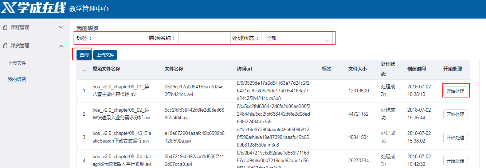

## 2.2 API

本节讲解我的媒资文件分页查询、处理媒资文件，其它功能请学员自行实现。

```java
@Api(value = "媒体文件管理",description = "媒体文件管理接口",tags = {"媒体文件管理接口"})
public interface MediaFileControllerApi {
   
    @ApiOperation("查询文件列表")
    public QueryResponseResult findList(int page, int size, QueryMediaFileRequest
queryMediaFileRequest) ;
}
```

## 2.3  服务端开发

### 2.3.1 Dao

```java
@Repository
public interface MediaFileDao extends MongoRepository<MediaFile,String> {
}
```

### 2.3.2 Service

定义findList方法实现媒资文件查询列表。

```java
public class MediaFileService {

    @Autowired
    MediaFileRepository mediaFileRepository;

    //查询我的媒资列表
    public QueryResponseResult<MediaFile> findList(int page, int size, QueryMediaFileRequest queryMediaFileRequest) {
        if(queryMediaFileRequest == null){
            queryMediaFileRequest = new QueryMediaFileRequest();
        }
        //条件值对象
        MediaFile mediaFile = new MediaFile();
        if(StringUtils.isNotEmpty(queryMediaFileRequest.getTag())){
            mediaFile.setTag(queryMediaFileRequest.getTag());
        }
        if(StringUtils.isNotEmpty(queryMediaFileRequest.getFileOriginalName())){
            mediaFile.setFileOriginalName(queryMediaFileRequest.getFileOriginalName());
        }
        if(StringUtils.isNotEmpty(queryMediaFileRequest.getProcessStatus())){
            mediaFile.setProcessStatus(queryMediaFileRequest.getProcessStatus());
        }

        //条件匹配器
        ExampleMatcher exampleMatcher = ExampleMatcher.matching()                                   
            .withMatcher("tag",ExampleMatcher.GenericPropertyMatchers.contains())                               .withMatcher("fileOriginalName",ExampleMatcher.GenericPropertyMatchers.contains());
			//.withMatcher("processStatus",ExampleMatcher.GenericPropertyMatchers.exact());//如果不设置匹配器默认精确匹配

        //定义example条件对象
        Example<MediaFile> example = Example.of(mediaFile,exampleMatcher);
        //分页查询对象
        if(page<=0){
            page = 1;
        }
        page = page-1;
        if(size<=0){
            size = 10;
        }
        Pageable pageable = new PageRequest(page,size);
        //分页查询
        Page<MediaFile> all = mediaFileRepository.findAll(example, pageable);
        //总记录数
        long total = all.getTotalElements();
        //数据列表
        List<MediaFile> content = all.getContent();
        //返回的数据集
        QueryResult<MediaFile> queryResult = new QueryResult<>();
        queryResult.setList(content);
        queryResult.setTotal(total);

        //返回结果
        QueryResponseResult queryResponseResult = new 
            QueryResponseResult(CommonCode.SUCCESS,queryResult);
        return queryResponseResult;
    }
}
```

### 2.3.3 Controller

```java
@RestController
@RequestMapping("/media/file")
public class MediaFileController implements MediaFileControllerApi {
    @Autowired
    MediaFileService mediaFileService;
    @Autowired
    MediaUploadService mediaUploadService;
    @Override
    @GetMapping("/list/{page}/{size}")
    public QueryResponseResult findList(@PathVariable("page") int page, @PathVariable("size")
int size, QueryMediaFileRequest queryMediaFileRequest) {
     //媒资文件查询    
        return mediaFileService.findList(page,size,queryMediaFileRequest);
    }
}
```

## 2.4  前端开发

### 2.4.1 API 方法

在media模块定义api方法如下：

```javascript
import http from './../../../base/api/public'
import querystring from 'querystring'
let sysConfig = require('@/../config/sysConfig')
let apiUrl = sysConfig.xcApiUrlPre;
/*页面列表*/
export const media_list = (page,size,params) => {
  //params为json格式
  //使用querystring将json对象转成key/value串
  let querys = querystring.stringify(params)
  return http.requestQuickGet(apiUrl+'/media/file/list/'+page+'/'+size+'/?'+querys)
}
/*发送处理消息*/
export const media_process = (id) => {
  return http.requestPost(apiUrl+'/media/file/process/'+id)
}
```

### 2.4.2 页面

在media模块创建media_list.vue，可参考cms系统的page_list.vue来编写此页面。

1. 视图

```html
<template>
  <div>
    <!‐‐查询表单‐‐>
    <el‐form :model="params">
      标签：
      <el‐input v‐model="params.tag" style="width:160px"></el‐input>
      原始名称：
      <el‐input v‐model="params.fileOriginalName" style="width:160px"></el‐input>
      处理状态：
      <el‐select v‐model="params.processStatus" placeholder="请选择处理状态">
        <el‐option
          v‐for="item in processStatusList"
          :key="item.id"
          :label="item.name"
          :value="item.id">
        </el‐option>
      </el‐select>
      <br/>
      <el‐button type="primary" v‐on:click="query" size="small">查询</el‐button>
      <router‐link class="mui‐tab‐item" :to="{path:'/media/upload'}">
        <el‐button  type="primary" size="small" >上传文件</el‐button>
      </router‐link>
    </el‐form>
    <!‐‐列表‐‐>
    <el‐table :data="list" highlight‐current‐row v‐loading="listLoading" style="width: 100%;">
      <el‐table‐column type="index" width="30">
                </el‐table‐column>
      <el‐table‐column prop="fileOriginalName" label="原始文件名称" width="220">
      </el‐table‐column>
      <el‐table‐column prop="fileName" label="文件名称" width="220">
      </el‐table‐column>
      <el‐table‐column prop="fileUrl" label="访问url" width="260">
      </el‐table‐column>
      <el‐table‐column prop="tag" label="标签" width="100">
      </el‐table‐column>
      <el‐table‐column prop="fileSize" label="文件大小" width="120">
      </el‐table‐column>
      <el‐table‐column prop="processStatus" label="处理状态" width="100"
:formatter="formatProcessStatus">
      </el‐table‐column>
      <el‐table‐column prop="uploadTime" label="创建时间" width="110"
:formatter="formatCreatetime">
      </el‐table‐column>
      <el‐table‐column label="开始处理" width="100" >
        <template slot‐scope="scope">
          <el‐button
            size="small" type="primary" plain @click="process(scope.row.fileId)">开始处理
          </el‐button>
        </template>
      </el‐table‐column>
    </el‐table>
    <!‐‐分页‐‐>
    <el‐col :span="24" class="toolbar">
      <el‐pagination background layout="prev, pager, next" @current‐change="changePage" :page‐
size="this.params.size"
                     :total="total" :current‐page="this.params.page"
                     style="float:right;">
      </el‐pagination>
    </el‐col>
  </div>
</template>
```

2. 数据对象

```json
import * as mediaApi from '../api/media'
import utilApi from '@/common/utils';
export default{
  data(){
    return {
      params:{
        page:1,//页码
        size:2,//每页显示个数
        tag:'',//标签
        fileName:'',//文件名称
        processStatus:''//处理状态
		      },
      listLoading:false,
      list:[],
      total:0,
      processStatusList:[]
    }
  }
  。。。
```

3. 方法

```javascript
methods:{
      formatCreatetime(row, column){
        var createTime = new Date(row.uploadTime);
        if (createTime) {
          return utilApi.formatDate(createTime, 'yyyy‐MM‐dd hh:mm:ss');
        }
      },
      formatProcessStatus(row,column){
        var processStatus = row.processStatus;
        if (processStatus) {
            if(processStatus == '303001'){
              return "处理中";
            }else if(processStatus == '303002'){
              return "处理成功";
            }else if(processStatus == '303003'){
              return "处理失败";
            }else if(processStatus == '303004'){
              return "无需处理";
            }
        }
      },
      changePage(page){
        this.params.page = page;
        this.query()
      },
      process (id) {
//        console.log(id)
        mediaApi.media_process(id).then((res)=>{
          console.log(res)
         if(res.success){
           this.$message.success('开始处理，请稍后查看处理结果');
         }else{
           this.$message.error('操作失败，请刷新页面重试');
         }
        })
      },
      query(){
        mediaApi.media_list(this.params.page,this.params.size,this.params).then((res)=>{
          console.log(res)
          this.total = res.queryResult.total
          this.list = res.queryResult.list
        })
      }
    }
    ...
```

4. 钩子方法

```javascript
created(){
      //默认第一页
    this.params.page = Number.parseInt(this.$route.query.page||1);
  },
  mounted() {
    //默认查询页面
    this.query()
    //初始化处理状态
    this.processStatusList = [
      {
        id:'',
        name:'全部'
      },
      {
        id:'303001',
        name:'处理中'
      },
      {
        id:'303002',
        name:'处理成功'
      },
      {
        id:'303003',
        name:'处理失败'
      },
      {
        id:'303004',
        name:'无需处理'
      }
    ]
  }
}
```

# 3. 媒资与课程关联

## 3.1 需求分析

到目前为止，媒资管理已完成文件上传、视频处理、我的媒资功能等基本功能。其它模块已可以使用媒资管理功能，本节要讲解课程计划在编辑时如何选择媒资文件。

操作的业务流程如下：

1. 进入课程计划修改页面
2. 选择视频

打开媒资文件查询窗口，找到该课程章节的视频，选择此视频。

点击“选择媒资文件”打开媒资文件列表

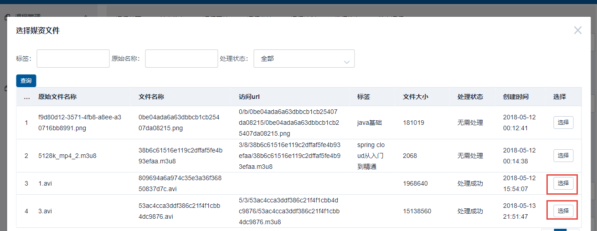

3. 选择成功后，将在课程管理数据库保存课程计划对应在的课程视频地址。

   在课程管理数据库创建表 teachplan_media 存储课程计划与媒资关联信息，如下：


## 3.2  选择视频

### 3.2.1 Vue父子组件通信

上一章已实现了我的媒资页面，所以媒资查询窗口页面不需要再开发，将“我的媒资页面”作为一个组件在修改课程计划页面中引用

如下图：

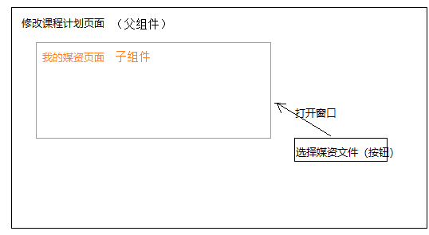

修改课程计划页面为父组件，我的媒资查询页面为子组件。

问题1：

我的媒资页面在选择媒资文件时不允许显示，比如“视频处理”按钮，该如何控制？

这时就需要父组件（修改课程计划页面）向子组件（我的媒资页面）传入一个变量，使用此变量来控制当前是否进入选择媒资文件业务，从而控制哪些元素不显示，如下图：

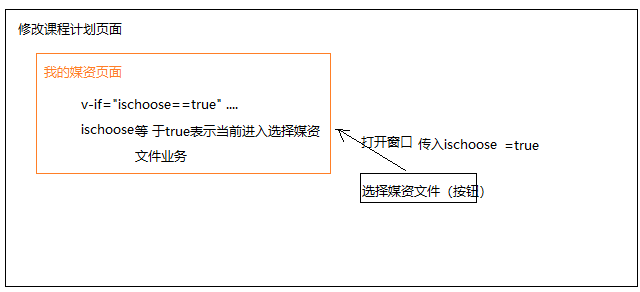

问题2：

在我的媒资页面选择了媒资文件，如何将选择的媒资文件信息传到父组件？

这时就需要子组件调用父组件的方法来解决此问题，如下图：

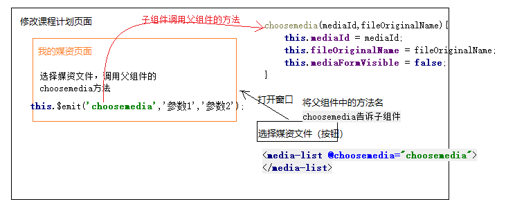

### 3.2.2 父组件（修改课程计划）

本节实现功能：在课程计划页面打开我的媒资页面。

1. 引入子组件

```javascript
import mediaList from '@/module/media/page/media_list.vue';
  export default {
    components:{
      mediaList
    },
  data() {
  ....
```

2. 使用子组件

   在父组件的视图中使用子组件，同时传入变量ischoose，并指定父组件的方法名为choosemedia

   这里使用el-dialog 实现弹出窗口。

```html
<el‐dialog title="选择媒资文件" :visible.sync="mediaFormVisible">
  <media‐list v‐bind:ischoose="true" @choosemedia="choosemedia"></media‐list>
</el‐dialog>
```

3. choosemedia方法

   在父组件中定义choosemedia方法，接收子组件调用，参数包括：媒资文件id、媒资文件的原始名称、媒资文件url

```javascript
choosemedia(mediaId,fileOriginalName,mediaUrl){
   
}
```

4. 打开子组件窗口

   4.1 打开子组件窗口按钮定义

```html
添加“选择视频”按钮：
<el‐button style="font‐size: 12px;" type="text" on‐click={ () => this.querymedia(data.id) }>选择
视频</el‐button>
```

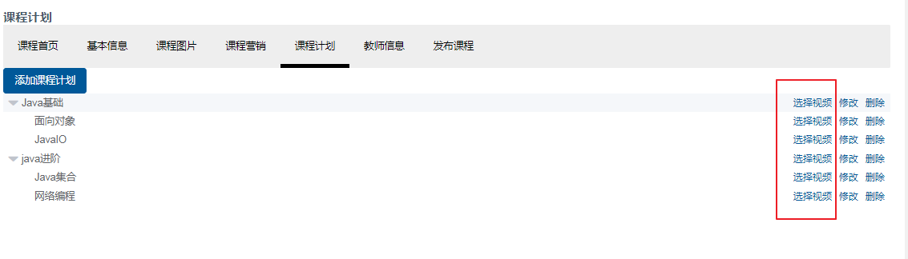

​	4.2 打开子组件窗口方法

​	定义querymedia方法：

```javascript
methods: {
  //打开查询媒资文件窗口，传入课程计划id
  querymedia(teachplanId){
     this.activeTeachplanId = teachplanId;
    this.mediaFormVisible = true;
}
```

### 3.2.3 子组件（我的媒资查询）

1. 定义ischoose变量，接收父组件传入的ischoose

```javascript
export default{
  props: ['ischoose'],
  data(){
```

2. 父组件传的ischoose变量为 true时表示当前是选择媒资文件业务，需要控制页面元素是否显示

   2.1 ischoose=true，选择按钮显示

```html
<el‐table‐column label=" 选择" width="80" v‐if="ischoose == true">
  <template slot‐scope="scope">
  <el‐button
    size="small" type="primary" plain @click="choose(scope.row)">选择</el‐button>
  </template>
</el‐table‐column>
```

​	2.2 ischoose=false，视频处理按钮显示

```html
<el‐table‐column label=" 开始处理" width="100" v‐if="ischoose != true">
  <template slot‐scope="scope">
    <el‐button
      size="small" type="primary" plain @click="process(scope.row.fileId)">开始处理
    </el‐button>
  </template>
</el‐table‐column>
```

​	2.3  选择媒资文件方法

​		选择媒资文件方法用户点击“选择”按钮将向父	

```javascript
choose(mediaFile){ 
    if(mediaFile.processStatus !='303002' && mediaFile.processStatus !='303004'){
      this.$message.error('该文件未处理，不允许选择');
      return ;
    }
  if(!mediaFile.fileUrl){
    this.$message.error('该文件的访问url为空，不允许选择');
    return ;
  }
  //调用父组件的choosemedia方法
  this.$emit('choosemedia',mediaFile.fileId,mediaFile.fileOriginalName);
}
```

## 3.3  保存视频信息

### 3.3.1 需求分析

用户进入课程计划页面，选择视频，将课程计划与视频信息保存在课程管理数据库中。

用户操作流程：

1. 进入课程计划，点击”选择视频“，打开我的媒资查询页面
2. 为课程计划选择对应的视频，选择“选择”
3. 前端请求课程管理服务保存课程计划与视频信息。

### 3.3.2 数据模型

在课程管理数据库创建表 teachplan_media 存储课程计划与媒资关联信息，如下：

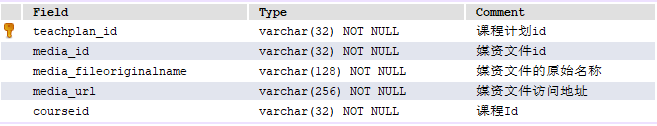

创建teachplanMedia 模型类：

```java
@Data 
@ToString
@Entity
@Table(name="teachplan_media")
@GenericGenerator(name = "jpa‐assigned", strategy = "assigned")
public class TeachplanMedia implements Serializable {
    private static final long serialVersionUID = ‐916357110051689485L;
    @Id
    @GeneratedValue(generator = "jpa‐assigned")
    @Column(name="teachplan_id")
    private String teachplanId;
    @Column(name="media_id")
    private String mediaId;
    @Column(name="media_fileoriginalname")
    private String mediaFileOriginalName;
    
    @Column(name="media_url")
    private String mediaUrl;
    
    @Column(name="courseid")
    private String courseId;
}
```

### 3.3.3 API接口

此接口作为前端请求课程管理服务保存课程计划与视频信息的接口：

在课程管理服务增加接口：

```java
@ApiOperation("保存媒资信息")
public ResponseResult savemedia(TeachplanMedia teachplanMedia);
```

### 3.3.4 服务端开发

#### 3.3.3.1 DAO

创建 TeachplanMediaRepository用于对TeachplanMedia的操作。

```java
public interface TeachplanMediaRepository extends JpaRepository<TeachplanMedia, String> { 
}
```

#### 3.3.3.2 Service

```java
//保存媒资信息
public ResponseResult savemedia(TeachplanMedia teachplanMedia) {
    if(teachplanMedia == null){
        ExceptionCast.cast(CommonCode.INVALIDPARAM);
    }
    //课程计划
    String teachplanId = teachplanMedia.getTeachplanId();
    //查询课程计划
    Optional<Teachplan> optional = teachplanRepository.findById(teachplanId);
    if(!optional.isPresent()){
        ExceptionCast.cast(CourseCode.COURSE_MEDIA_TEACHPLAN_ISNULL);
    }
    Teachplan teachplan = optional.get();
    //只允许为叶子结点课程计划选择视频
    String grade = teachplan.getGrade();
    if(StringUtils.isEmpty(grade) || !grade.equals("3")){
        ExceptionCast.cast(CourseCode.COURSE_MEDIA_TEACHPLAN_GRADEERROR);
    }
    TeachplanMedia one = null;
    Optional<TeachplanMedia> teachplanMediaOptional =
teachplanMediaRepository.findById(teachplanId);
    if(!teachplanMediaOptional.isPresent()){
        one = new TeachplanMedia();
    }else{
        one = teachplanMediaOptional.get();
    }
    //保存媒资信息与课程计划信息
    one.setTeachplanId(teachplanId);
    one.setCourseId(teachplanMedia.getCourseId());
    one.setMediaFileOriginalName(teachplanMedia.getMediaFileOriginalName());
    one.setMediaId(teachplanMedia.getMediaId());
    one.setMediaUrl(teachplanMedia.getMediaUrl());
    teachplanMediaRepository.save(one);
    return new ResponseResult(CommonCode.SUCCESS);
}
```

#### 3.3.3.3 Controller

```java
@Override
@PostMapping("/savemedia")
public ResponseResult savemedia(@RequestBody TeachplanMedia teachplanMedia) {
    return courseService.savemedia(teachplanMedia);
}
```

### 3.3.4 前端开发

#### 3.3.4.1 API方法

定义api方法，调用课程管理服务保存媒资信息接口

```java
/* 保存媒资信息*/
export const savemedia = teachplanMedia => {
  return http.requestPost(apiUrl+'/course/savemedia',teachplanMedia);
}
```

#### 3.3.4.2 API调用

在课程视频方法中调用api：

```javascript
choosemedia(mediaId,fileOriginalName,mediaUrl){
  this.mediaFormVisible = false;
  //保存课程计划与视频对应关系
  let teachplanMedia = {};
  teachplanMedia.teachplanId = this.activeTeachplanId;
  teachplanMedia.mediaId = mediaId;
  teachplanMedia.mediaFileOriginalName = fileOriginalName;
  teachplanMedia.mediaUrl = mediaUrl;
  teachplanMedia.courseId = this.courseid;
  //保存媒资信息到课程数据库
  courseApi.savemedia(teachplanMedia).then(res=>{
      if(res.success){
          this.$message.success("选择视频成功")
      }else{
        this.$message.error(res.message)
      }
  })
},
```

### 3.3.5 测试

1. 向叶子结点课程计划保存媒资信息

   操作结果：保存成功

2. 向非叶子结点课程计划保存媒资信息

   操作结果：保存失败

## 3.4  查询视频信息

### 3.4.1 需求分析

课程计划的视频信息保存后在页面无法查看，本节解决课程计划页面显示相关联的媒资信息。

解决方案：

在获取课程计划树结点信息时将关联的媒资信息一并查询，并在前端显示，下图说明了课程计划显示的区域。

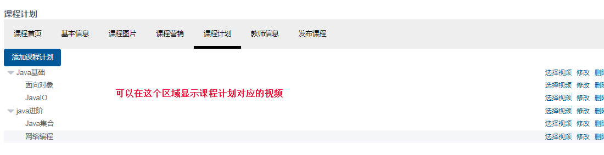

### 3.4.2 Dao

修改课程计划查询的Dao:

1. 修改模型

   在课程计划结果信息中添加媒资信息

```java
@Data 
@ToString
public class TeachplanNode extends Teachplan {
    List<TeachplanNode> children;
    //媒资信息
    private String mediaId;
    private String mediaFileOriginalName;
}
```

2. 修改sql语句，添加关联查询媒资信息

   添加mediaId、mediaFileOriginalName

```html
<resultMap type="com.xuecheng.framework.domain.course.ext.TeachplanNode" id="teachplanMap" > 
    <id property="id" column="one_id"/>
    <result property="pname" column="one_name"/>
    <result property="grade" column="one_grade"/>
    <collection property="children"
ofType="com.xuecheng.framework.domain.course.ext.TeachplanNode">
                <id property="id" column="two_id"/> 
        <result property="pname" column="two_name"/>
        <result property="grade" column="two_grade"/>
        <collection property="children"
ofType="com.xuecheng.framework.domain.course.ext.TeachplanNode">
            <id property="id" column="three_id"/>
            <result property="pname" column="three_name"/>
            <result property="grade" column="three_grade"/>
            <result property="mediaId" column="mediaId"/>
            <result property="mediaFileOriginalName" column="mediaFileOriginalName"/>
        </collection>
    </collection>
</resultMap>
<select id="selectList" resultMap="teachplanMap" parameterType="java.lang.String" >
    SELECT
    a.id one_id,
    a.pname one_name,
    a.grade one_grade,
    a.orderby one_orderby,
    b.id two_id,
    b.pname two_name,
    b.grade two_grade,
    b.orderby two_orderby,
    c.id three_id,
    c.pname three_name,
    c.grade three_grade,
    c.orderby three_orderby,
    media.media_id mediaId,
    media.media_fileoriginalname mediaFileOriginalName
    FROM
    teachplan a LEFT JOIN teachplan b
    ON a.id = b.parentid
    LEFT JOIN teachplan c
    ON b.id = c.parentid
    LEFT JOIN teachplan_media media
    ON c.id = media.teachplan_id
    WHERE  a.parentid = '0'
    <if test="_parameter!=null and _parameter!=''">
        and a.courseid=#{courseId}
    </if>
    ORDER BY a.orderby,
    b.orderby,
    c.orderby
</select>
```

### 3.4.3 页面查询视频

课程计划结点信息已包括媒资信息，可在页面获取信息后显示：

```html
<el‐button style="font‐size: 12px;" type="text" on‐click={ () => this.querymedia(data.id) }>
{data.mediaFileOriginalName}&nbsp;&nbsp;&nbsp;&nbsp;选择视频</el‐button>
```

效果如下：

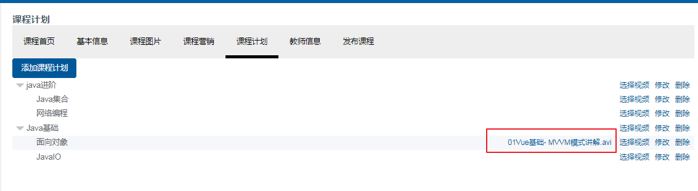

选择视频后立即刷新课程计划树，在提交成功后，添加查询课程计划代码：this.findTeachplan()，完整代码如下：

```javascript
choosemedia(mediaId,fileOriginalName,mediaUrl){ 
  this.mediaFormVisible = false;
  //保存课程计划与视频对应关系
  let teachplanMedia = {};
  teachplanMedia.teachplanId = this.activeTeachplanId;
  teachplanMedia.mediaId = mediaId;
  teachplanMedia.mediaFileOriginalName = fileOriginalName;
  teachplanMedia.mediaUrl = mediaUrl;
  teachplanMedia.courseId = this.courseid;
  //保存媒资信息到课程数据库
  courseApi.savemedia(teachplanMedia).then(res=>{
      if(res.success){
          this.$message.success("选择视频成功")
        //查询课程计划
        this.findTeachplan()
      }else{
        this.$message.error(res.message)
      }
  })
},
```

