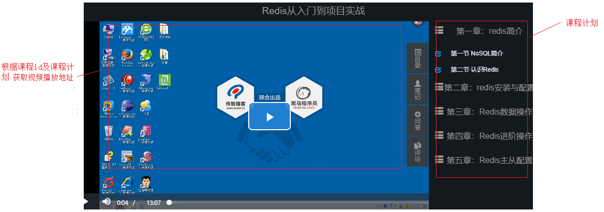
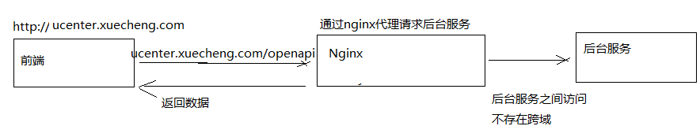
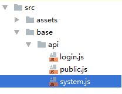
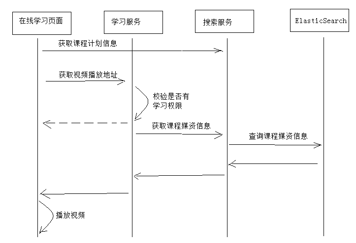
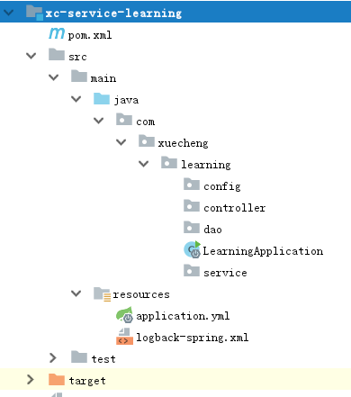

# 1.  学习页面查询课程计划

## 1.1  需求分析

到目前为止，我们已可以编辑课程计划信息并上传课程视频，下一步我们要实现在线学习页面动态读取章节对应的视频并进行播放。在线学习页面所需要的信息有两类：一类是课程计划信息、一类是课程学习信息（视频地址、学习进度等），如下图：



在线学习集成媒资管理的需求如下：

1. 在线学习页面显示课程计划
2. 点击课程计划播放该课程计划对应的视频

本章节实现学习页面动态显示课程计划，进入不同课程的学习页面右侧动态显示当前课程的课程计划。

## 1.2 Api 接口

课程计划信息从哪里获取？

目前课程计划信息在课程管理数据库和ES索引库中存在，考虑性能要求，课程发布后对课程的查询统一从ES索引库中查询。

前端通过请求搜索服务获取课程信息，需要单独在搜索服务中定义课程信息查询接口。

本接口接收课程id，查询课程所有信息返回给前端。

```java
@ApiOperation("根据id查询课程信息")
public Map<String,CoursePub> getall(String id);
```

返回的课程信息为json结构：key为课程id，value为课程内容。

## 1.3  服务端开发

在搜索服务中开发查询课程信息接口。

### 1.3.1 Service

在搜索服务中增加查询课程信息接口的service

```java
public Map<String, CoursePub> getall(String id) {
    //设置索引库
    SearchRequest searchRequest = new SearchRequest(es_index);
    //设置类型
    searchRequest.types(es_type);
    SearchSourceBuilder searchSourceBuilder = new SearchSourceBuilder();
    //查询条件，根据课程id查询
    searchSourceBuilder.query(QueryBuilders.termsQuery("id", id));
    //取消source源字段过虑，查询所有字段
      searchSourceBuilder.fetchSource(new String[]{"name", "grade", "charge","pic"}, newString[]{});
    searchRequest.source(searchSourceBuilder);
    SearchResponse searchResponse = null;
    try {
        //执行搜索
        searchResponse = restHighLevelClient.search(searchRequest);
    } catch (IOException e) {
        e.printStackTrace();
    }
    //获取搜索结果
    SearchHits hits = searchResponse.getHits();
    SearchHit[] searchHits = hits.getHits();
    Map<String,CoursePub> map = new HashMap<>();
    for (SearchHit hit : searchHits) {
        String courseId = hit.getId();
        Map<String, Object> sourceAsMap = hit.getSourceAsMap();
        String courseId = (String) sourceAsMap.get("id");
        String name = (String) sourceAsMap.get("name");
        String grade = (String) sourceAsMap.get("grade");
        String charge = (String) sourceAsMap.get("charge");
        String pic = (String) sourceAsMap.get("pic");
        String description = (String) sourceAsMap.get("description");
        String teachplan = (String) sourceAsMap.get("teachplan");
        CoursePub coursePub = new CoursePub();
        coursePub.setId(courseId);
        coursePub.setName(name);
        coursePub.setPic(pic);
                    coursePub.setGrade(grade);
        coursePub.setTeachplan(teachplan);
        coursePub.setDescription(description);
        map.put(courseId,coursePub);
    }
    return map;
}
```

### 1.3.2 Controller

```java
@Override
@GetMapping("/getall/{id}")
public Map<String, CoursePub> getall(@PathVariable("id") String id)  {
    return esCourseService.getall(id);
}
```

### 1.3.3 测试

使用swagger-ui或postman测试查询课程信息接口。

## 1.4 前端开发

### 1.4.1 配置虚拟主机

学习中心的二级域名为ucenter.xuecheng.com，我们在nginx中配置ucenter虚拟主机。

```java
#学成网用户中心
server{
	listen80; 
	server_nameucenter.xuecheng.com; 

	#个人中心 
	location / { 
		proxy_passhttp://ucenter_server_pool; 
	} 
}
	#前端ucenter
upstreamucenter_server_pool{
	#server127.0.0.1:7081weight=10;
	server127.0.0.1:13000weight=10;
}
```

在学习中心要调用搜索的API，使用Nginx解决代理，如下图：



配置搜索Api代理路径：

```java
#后台搜索（公开api）
upstreamsearch_server_pool{
	server127.0.0.1:40100weight=10; 
}
#后端搜索服务
location/openapi/search/{
	proxy_passhttp://search_server_pool/search/; 
}
```

### 1.4.2 API方法

在学习中心对课程信息的查询属于基础常用功能，所以我们将课程查询的api方法定义在base模块下，如下图：



在system.js中定义课程查询方法：

```java
import http from './public'
export const course_view = id => {
  return http.requestGet('/openapi/search/course/getall/'+id);
}
```

### 1.4.3 API调用

在learning_video.vue页面中调用课程信息查询接口，得到课程计划，将课程计划json串转成对象。

1. 定义视图

   a. 课程名称

```html
 <div class="nav nav‐stacked" v‐for="(teachplan_first, index) in teachplanList">
                  <div class="tit nav‐justified text‐center"><i class="pull‐left glyphicon
glyphicon‐th‐list"></i>{{teachplan_first.pname}}<i class="pull‐right"></i>
 </div>
<li   v‐if="teachplan_first.children!=null" v‐for="                                                   (teachplan_second, index)in teachplan_first.children"><i class="glyphicon glyphicon‐check"></i>
	  <a :href="url" @click="study(teachplan_second.id)">
	    {{teachplan_second.pname}}
	  </a>
</li>
```

​	b. 课程名称

```html
 <div class="top text‐center">
             {{coursename}}
 </div>
```

2. 定义数据对象

```javascript
data() {
  return {
    url:'',//当前url
    courseId:'',//课程id
    chapter:'',//章节Id
    coursename:'',//课程名称
    coursepic:'',//课程图片
    teachplanList:[],//课程计划
    playerOptions: {//播放参数
      autoplay: false,
      controls: true,
      sources: [{
        type: "application/x‐mpegURL",
        src: ''
      }]
    },
  }
}
```

3. 在created钩子方法中获取课程信息

```javascript
created(){
     //当前请求的url
   this.url = window.location
   //课程id
   this.courseId = this.$route.params.courseId
   //章节id
   this.chapter = this.$route.params.chapter
   //查询课程信息
   systemApi.course_view(this.courseId).then((view_course)=>{
       if(!view_course || !view_course[this.courseId]){
          this.$message.error("获取课程信息失败，请重新进入此页面！")
          return ;
       }
       let courseInfo = view_course[this.courseId]
       console.log(courseInfo)
       this.coursename = courseInfo.name
       if(courseInfo.teachplan){
         let teachplan = JSON.parse(courseInfo.teachplan);
         this.teachplanList = teachplan.children;
       }
   })
 },
```

### 1.4.4 测试

在浏览器请求：http://ucenter.xuecheng.com/#/learning/4028e581617f945f01617f9dabc40000/0

第一个参数为课程id，测试时从ES索引库找一个课程id

第二个参数为课程计划id，此参数用于点击课程计划播放视频。

# 2. 学习页面获取视频播放地址

## 2.1  需求分析

用户进入在线学习页面，点击课程计划将播放该课程计划对应的教学视频。

业务流程如下：


业务流程说明：

1. 用户进入在线学习页面，页面请求搜索服务获取课程信息（包括课程计划信息）并且在页面展示。
2. 在线学习请求学习服务获取视频播放地址。
3. 学习服务校验当前用户是否有权限学习，如果没有权限学习则提示用户。
4. 学习服务校验通过，请求搜索服务获取课程媒资信息。
5. 搜索服务请求ElasticSearch获取课程媒资信息。

为什么要请求ElasticSearch查询课程媒资信息？

   出于性能的考虑，公开查询课程信息从搜索服务查询。

什么时候将课程媒资信息存储到ElasticSearch中？

   课程媒资信息是在课程发布的时候存入ElasticSearch，因为课程发布后课程信息将基本不再修改。

## 2.2  课程发布存储媒资信息

### 2.2.1 需求分析

课程媒资信息是在课程发布的时候存入ElasticSearch索引库，因为课程发布后课程信息将基本不再修改。

业务流程如下：

1. 课程发布，向课程媒资信息表写入数据。

   1.1 根据课程id删除teachplanMediaPub中的数据

   1.2 根据课程id查询teachplanMedia数据

   1.3 将查询到的teachplanMedia数据插入到teachplanMediaPub中

2. Logstash定时扫描课程媒资信息表，并将课程媒资信息写入索引库。

### 2.2.2 数据模型

在xc_course数据库创建课程计划媒资发布表：

```sql
CREATE TABLE `teachplan_media_pub` (
  `teachplan_id` varchar(32) NOT NULL COMMENT '课程计划id',
  `media_id` varchar(32) NOT NULL COMMENT '媒资文件id',
  `media_fileoriginalname` varchar(128) NOT NULL COMMENT '媒资文件的原始名称',
  `media_url` varchar(256) NOT NULL COMMENT '媒资文件访问地址',
  `courseid` varchar(32) NOT NULL COMMENT '课程Id',
  `timestamp` timestamp NOT NULL DEFAULT CURRENT_TIMESTAMP ON UPDATE CURRENT_TIMESTAMP COMMENT
'logstash使用',
  PRIMARY KEY (`teachplan_id`)
) ENGINE=InnoDB DEFAULT CHARSET=utf8
```

数据模型类如下：

```java
@Data
@ToString
@Entity
@Table(name="teachplan_media_pub")
@GenericGenerator(name = "jpa‐assigned", strategy = "assigned")
public class TeachplanMediaPub implements Serializable {
    private static final long serialVersionUID = ‐916357110051689485L;
    @Id
    @GeneratedValue(generator = "jpa‐assigned")
    @Column(name="teachplan_id")
    private String teachplanId;
    @Column(name="media_id")
    private String mediaId;
    @Column(name="media_fileoriginalname")
    private String mediaFileOriginalName;
    @Column(name="media_url")
    private String mediaUrl;
    @Column(name="courseid")
    private String courseId;
    @Column(name="timestamp")
    private Date timestamp;//时间戳
}
```

### 2.2.3 Dao

创建TeachplanMediaPub表的Dao，向TeachplanMediaPub存储信息采用先删除该课程的媒资信息，再添加该课程的媒资信息，所以这里定义根据课程id删除课程计划媒资方法：

```java
public interface TeachplanMediaPubRepository extends JpaRepository<TeachplanMediaPub, String> {
    //根据课程id删除课程计划媒资信息
    long deleteByCourseId(String courseId);
}
//从TeachplanMedia查询课程计划媒资信息
public interface TeachplanMediaRepository extends JpaRepository<TeachplanMedia, String> {
    List<TeachplanMedia> findByCourseId(String courseId);
}
```

###　2.2.4 Service

编写保存课程计划媒资信息方法，并在课程发布时调用此方法。

１.保存课程计划媒资信息方法

　本方法采用先删除该课程的媒资信息，再添加该课程的媒资信息。

```java
//保存课程计划媒资信息
private void saveTeachplanMediaPub(String courseId){
    //查询课程媒资信息
    List<TeachplanMedia> teachplanMediaList = teachplanMediaRepository.findByCourseId(courseId);
    //将课程计划媒资信息存储待索引表
    teachplanMediaPubRepository.deleteByCourseId(courseId);
    List<TeachplanMediaPub> teachplanMediaPubList = new ArrayList<>();
    for(TeachplanMedia teachplanMedia:teachplanMediaList){
        TeachplanMediaPub teachplanMediaPub =new TeachplanMediaPub();
        BeanUtils.copyProperties(teachplanMedia,teachplanMediaPub);
        teachplanMediaPubList.add(teachplanMediaPub);
    }
    teachplanMediaPubRepository.saveAll(teachplanMediaPubList);
}
```

2. 课程发布时调用此方法

   修改课程发布的service方法：

```java
....
//保存课程计划媒资信息到待索引表
saveTeachplanMediaPub(courseId);
//页面url
String pageUrl = cmsPostPageResult.getPageUrl();
return new CoursePublishResult(CommonCode.SUCCESS,pageUrl);
.....
```

### 3.2.5 测试

  测试课程发布后是否成功将课程媒资信息存储到teachplan_media_pub中，测试流程如下：

1. 指定一个课程
2. 为课程计划添加课程媒资
3. 执行课程发布
4. 观察课程计划媒资信息是否存储至teachplan_media_pub中

注意：由于此测试仅用于测试发布课程计划媒资信息的功能，可暂时将cms页面发布的功能暂时屏蔽，提高测试效率。

## 2.3 Logstash 扫描课程计划媒资

Logstash定时扫描课程媒资信息表，并将课程媒资信息写入索引库。

### 2.3.1 创建索引

1. 创建xc_course_media索引

2. 并向此索引创建如下映射

   Post http://localhost:9200/xc_course_media/doc/_mapping

```json
{
    "properties": {
        "courseid": {
            "type": "keyword"
        },
        "teachplan_id": {
            "type": "keyword"
        },
        "media_id": {
            "type": "keyword"
        },
        "media_url": {
            "index": false,
            "type": "text"
        },
        "media_fileoriginalname": {
            "index": false,
            "type": "text"
        }
    }
}
```

### 2.3.2 创建Logstash模板文件

在logstach的config目录创建xc_course_media_template.json，内容如下：

本教程的xc_course_media_template.json目录是：D:/ElasticSearch/logstash-6.2.1/config/xc_course_media_template.json

```json
{
    "mappings": {
        "doc": {
            "properties": {
                "courseid": {
                    "type": "keyword"
                },
                "teachplan_id": {
                    "type": "keyword"
                },
                "media_id": {
                    "type": "keyword"
                },
                "media_url": {
                    "index": false,
                    "type": "text"
                },
                "media_fileoriginalname": {
                    "index": false,
                    "type": "text"
                }
            }
        },
        "template": "xc_course_media"
    }
}
```

### 2.3.3 配置mysql.conf

在logstash的config目录下配置mysql_course_media.conf文件供logstash使用，logstash会根据mysql_course_media.conf文件的配置的地址从MySQL中读取数据向ES中写入索引。

参考https://www.elastic.co/guide/en/logstash/current/plugins-inputs-jdbc.html

配置输入数据源和输出数据源。

```java
input {
  stdin {
  }
  jdbc {
  jdbc_connection_string => "jdbc:mysql://localhost:3306/xc_course?
useUnicode=true&characterEncoding=utf‐8&useSSL=true&serverTimezone=UTC"
  # the user we wish to excute our statement as
  jdbc_user => "root"
  jdbc_password => mysql
  # the path to our downloaded jdbc driver 
  jdbc_driver_library => "F:/develop/maven/repository3/mysql/mysql‐connector‐java/5.1.41/mysql‐
connector‐java‐5.1.41.jar"
  # the name of the driver class for mysql
  jdbc_driver_class => "com.mysql.jdbc.Driver"
  jdbc_paging_enabled => "true"
  jdbc_page_size => "50000"
  #要执行的sql文件
  #statement_filepath => "/conf/course.sql"
  statement => "select * from teachplan_media_pub where timestamp >
date_add(:sql_last_value,INTERVAL 8 HOUR)"
  #定时配置
  schedule => "* * * * *"
  record_last_run => true
  last_run_metadata_path => "D:/ElasticSearch/logstash‐6.2.1/config/xc_course_media_metadata"
  }
}
output {
  elasticsearch {
  #ES的ip地址和端口
  hosts => "localhost:9200"
  #hosts => ["localhost:9200","localhost:9202","localhost:9203"]
  #ES索引库名称
  index => "xc_course_media"
  document_id => "%{id}"
  document_type => "doc"
  template =>"D:/ElasticSearch/logstash‐6.2.1/config/xc_course_media_template.json"
  template_name =>"xc_course_media"
  template_overwrite =>"true"
  }
  stdout {
 #日志输出
  codec => json_lines
  }
}
```

### 2.3.4 启动logstash.bat

启动logstash.bat采集teachplan_media_pub中的数据，向ES写入索引。

```shell
logstash.bat ‐f ../config/mysql_course_media.conf
```

## 2.4  搜索服务查询课程媒资接口

### 2.4.1 需求分析

搜索服务提供查询课程媒资接口，此接口供学习服务调用。

### 2.4.2 Api

在课程搜索包下定义Api

```java
@ApiOperation("根据课程计划查询媒资信息")
public TeachplanMediaPub getmedia(String teachplanId);
```

### 2.4.3 Service

1. 配置课程计划媒资索引库等信息

   在application.yml中配置

```yaml
xuecheng:
  elasticsearch:
    media:
      index: xc_course_media
      type: doc
      source_field: courseid,media_id,media_url,teachplan_id,media_fileoriginalname
```

2. service方法开发

   在课程搜索服务中定义课程媒资查询接口，为了适应后续需求，service参数定义为数组，可一次查询多个课程计划的媒资信息。

```java
//根据课程计划查询媒资信息
public QueryResponseResult<TeachplanMediaPub> getmedia(String[] teachplanIds){
    //设置索引
    SearchRequest searchRequest = new SearchRequest(media_index);
    //设置类型
    searchRequest.types(media_type);
    SearchSourceBuilder searchSourceBuilder = new SearchSourceBuilder();
    //source源字段过虑
    String[] source_fields = media_source_field.split(",");
    searchSourceBuilder.fetchSource(source_fields, new String[]{});
    //查询条件，根据课程计划id查询(可传入多个id)
    searchSourceBuilder.query(QueryBuilders.termsQuery("teachplan_id", teachplanIds));
    searchRequest.source(searchSourceBuilder);
    SearchResponse searchResponse = null;
    try {
        //执行搜索
                searchResponse = restHighLevelClient.search(searchRequest);
    } catch (IOException e) {
        e.printStackTrace();
    }
    //获取搜索结果
    SearchHits hits = searchResponse.getHits();
    SearchHit[] searchHits = hits.getHits();
    Map<String,CoursePub> map = new HashMap<>();
    //数据列表
    List<TeachplanMediaPub> teachplanMediaPubList = new ArrayList<>();
    for (SearchHit hit : searchHits) {
        TeachplanMediaPub teachplanMediaPub  =new TeachplanMediaPub();
        Map<String, Object> sourceAsMap = hit.getSourceAsMap();
        //取出课程计划媒资信息
        String courseid = (String) sourceAsMap.get("courseid");
        String media_id = (String) sourceAsMap.get("media_id");
        String media_url = (String) sourceAsMap.get("media_url");
        String teachplan_id = (String) sourceAsMap.get("teachplan_id");
        String media_fileoriginalname = (String) sourceAsMap.get("media_fileoriginalname");
        teachplanMediaPub.setCourseId(courseid);
        teachplanMediaPub.setMediaUrl(media_url);
        teachplanMediaPub.setMediaFileOriginalName(media_fileoriginalname);
        teachplanMediaPub.setMediaId(media_id);
        teachplanMediaPub.setTeachplanId(teachplan_id);
        //将数据加入列表
        teachplanMediaPubList.add(teachplanMediaPub);
    }
    //构建返回课程媒资信息对象
    QueryResult<TeachplanMediaPub> queryResult = new QueryResult<>();
    queryResult.setList(teachplanMediaPubList);
    QueryResponseResult<TeachplanMediaPub> queryResponseResult = new
QueryResponseResult<TeachplanMediaPub>(CommonCode.SUCCESS,queryResult);
    return queryResponseResult;
}
```

### 2.4.4 Controller

```java
@Override
@GetMapping(value="/getmedia/{teachplanId}")
public TeachplanMediaPub getmedia(@PathVariable("teachplanId") String teachplanId) {
    //将课程计划id放在数组中，为调用service作准备
    String[] teachplanIds = new String[]{teachplanId};
    //通过service查询ES获取课程媒资信息
    QueryResponseResult<TeachplanMediaPub> mediaPubQueryResponseResult =
        esCourseService.getmedia(teachplanIds);
    QueryResult<TeachplanMediaPub> queryResult = mediaPubQueryResponseResult.getQueryResult();
    if(queryResult!=null&& queryResult.getList()!=null&& queryResult.getList().size()>0){
        //返回课程计划对应课程媒资
        return queryResult.getList().get(0);
    }
    return new TeachplanMediaPub();
}
```

### 2.4.5 测试

使用swagger-ui和postman测试课程媒资查询接口。

# 3. 在线学习接口

## 3.1  需求分析

根据下边的业务流程，本章节完成前端学习页面请求学习服务获取课程视频地址，并自动播放视频。



## 3.2 搭建开发环境

### 3.2.1  创建数据库

创建xc_learning数据库，学习数据库将记录学生的选课信息、学习信息。

导入：资料/xc_learning.sql

### 3.2.2 创建学习服务工程

参考课程管理服务工程结构，创建学习服务工程：



pom.xml

```xml
<dependencies>
    <!‐‐ 导入Eureka服务的依赖 ‐‐>
    <dependency>
     <groupId>org.springframework.cloud</groupId>    
     <artifactId>spring‐cloud‐starter‐netflix‐eureka‐client</artifactId>    
    </dependency>
    <dependency>
        <groupId>com.squareup.okhttp3</groupId>
        <artifactId>okhttp</artifactId>
    </dependency>
    <dependency>
            <groupId>org.springframework.cloud</groupId>
            <artifactId>spring‐cloud‐starter‐openfeign</artifactId>
        </dependency>
    <dependency>
        <groupId>com.netflix.feign</groupId>
        <artifactId>feign‐okhttp</artifactId>
        <version>8.18.0</version>
    </dependency>
    <dependency>
        <groupId>com.xuecheng</groupId>
        <artifactId>xc‐service‐api</artifactId>
        <version>1.0‐SNAPSHOT</version>
    </dependency>
    <dependency>
        <groupId>com.xuecheng</groupId>
        <artifactId>xc‐framework‐model</artifactId>
        <version>1.0‐SNAPSHOT</version>
    </dependency>
    <dependency>
        <groupId>com.xuecheng</groupId>
        <artifactId>xc‐framework‐utils</artifactId>
        <version>1.0‐SNAPSHOT</version>
    </dependency>
    <dependency>
        <groupId>com.xuecheng</groupId>
        <artifactId>xc‐framework‐common</artifactId>
        <version>1.0‐SNAPSHOT</version>
    </dependency>
    <dependency>
        <groupId>org.springframework.boot</groupId>
        <artifactId>spring‐boot‐starter‐web</artifactId>
    </dependency>
    <dependency>
        <groupId>mysql</groupId>
        <artifactId>mysql‐connector‐java</artifactId>
    </dependency>
    <dependency>
        <groupId>com.alibaba</groupId>
        <artifactId>druid‐spring‐boot‐starter</artifactId>
        <version>1.1.10</version>
    </dependency>
    <dependency>
        <groupId>com.alibaba</groupId>
        <artifactId>druid</artifactId>
    </dependency>
    <dependency>
        <groupId>org.mybatis.spring.boot</groupId>
        <artifactId>mybatis‐spring‐boot‐starter</artifactId>
    </dependency>
    <dependency>
        <groupId>com.github.pagehelper</groupId>
        <artifactId>pagehelper‐spring‐boot‐starter</artifactId>
            </dependency>
    <dependency>
        <groupId>org.springframework</groupId>
        <artifactId>spring‐orm</artifactId>
        <version>${springframework.version}</version>
    </dependency>
    <dependency>
        <groupId>org.springframework.boot</groupId>
        <artifactId>spring‐boot‐starter‐data‐jpa</artifactId>
    </dependency>
    <dependency>
        <groupId>com.alibaba</groupId>
        <artifactId>fastjson</artifactId>
    </dependency>
    <dependency>
        <groupId>commons‐io</groupId>
        <artifactId>commons‐io</artifactId>
    </dependency>
    <dependency>
        <groupId>org.apache.commons</groupId>
        <artifactId>commons‐lang3</artifactId>
    </dependency>
    <dependency>
        <groupId>org.springframework.boot</groupId>
        <artifactId>spring‐boot‐starter‐test</artifactId>
    </dependency>
    <dependency>
        <groupId>org.springframework.boot</groupId>
        <artifactId>spring‐boot‐starter‐amqp</artifactId>
    </dependency>
</dependencies>
```

application.yml

```yaml
server:
  port: ${PORT:40600}
spring:
  application:
    name: xc‐service‐learning
  datasource:
    druid:
      url: ${MYSQL_URL:jdbc:mysql://localhost:3306/xc_learning?characterEncoding=utf‐8}
      username: root
      password: mysql
      driverClassName: com.mysql.jdbc.Driver
      initialSize: 5  #初始建立连接数量
      minIdle: 5  #最小连接数量
      maxActive: 20 #最大连接数量
      maxWait: 10000  #获取连接最大等待时间，毫秒
      testOnBorrow: true #申请连接时检测连接是否有效
      testOnReturn: false #归还连接时检测连接是否有效
      timeBetweenEvictionRunsMillis: 60000 #配置间隔检测连接是否有效的时间（单位是毫秒）
            minEvictableIdleTimeMillis: 300000  #连接在连接池的最小生存时间（毫秒）
eureka:
  client:
    registerWithEureka: true #服务注册开关
    fetchRegistry: true #服务发现开关
    serviceUrl: #Eureka客户端与Eureka服务端进行交互的地址，多个中间用逗号分隔
      defaultZone: ${EUREKA_SERVER:http://localhost:50101/eureka/}
  instance:
    prefer‐ip‐address:  true  #将自己的ip地址注册到Eureka服务中
    ip‐address: ${IP_ADDRESS:127.0.0.1}
    instance‐id: ${spring.application.name}:${server.port} #指定实例id
ribbon:
  MaxAutoRetries: 2 #最大重试次数，当Eureka中可以找到服务，但是服务连不上时将会重试，如果eureka中找不
到服务则直接走断路器
  MaxAutoRetriesNextServer: 3 #切换实例的重试次数
  OkToRetryOnAllOperations: false  #对所有操作请求都进行重试，如果是get则可以，如果是post，put等操作
没有实现幂等的情况下是很危险的,所以设置为false
  ConnectTimeout: 5000  #请求连接的超时时间
  ReadTimeout: 6000 #请求处理的超时时间
```

启动类：

```java
@EnableDiscoveryClient
@EnableFeignClients
@SpringBootApplication
@EntityScan("com.xuecheng.framework.domain.learning")//扫描实体类
@ComponentScan(basePackages={"com.xuecheng.api"})//扫描接口
@ComponentScan(basePackages={"com.xuecheng.learning"})//扫描接口
@ComponentScan(basePackages={"com.xuecheng.framework"})//扫描common下的所有类
public class LearningApplication {
    public static void main(String[] args) throws Exception {
        SpringApplication.run(LearningApplication.class, args);
    }
    @Bean
    @LoadBalanced
    public RestTemplate restTemplate() {
        return new RestTemplate(new OkHttp3ClientHttpRequestFactory());
    }
}
```

### 3.3 Api 接口

此api接口是课程学习页面请求学习服务获取课程学习地址。

定义返回值类型：

```java
@Data
@ToString
@NoArgsConstructor
public class GetMediaResult extends ResponseResult {
    public GetMediaResult(ResultCode resultCode, String fileUrl) {
        super(resultCode);
        this.fileUrl = fileUrl;
    }
    //媒资文件播放地址
    private String fileUrl;
}
```

定义接口，学习服务根据传入课程ID、章节Id(课程计划ID)来取学习地址。

```java
@Api(value = "录播课程学习管理",description = "录播课程学习管理")
public interface CourseLearningControllerApi {
    @ApiOperation("获取课程学习地址")
    public GetMediaResult getmedia(String courseId,String teachplanId);
}
```

## 3.4  服务端开发

### 3.4.1 需求分析

学习服务根据传入课程ID、章节Id(课程计划ID)请求搜索服务获取学习地址。

### 3.4.2 搜索服务注册Eureka

学习服务要调用搜索服务查询课程媒资信息，所以需要将搜索服务注册到eureka中。

1. 查看服务名称是否为xc-service-search

```yaml
# 注意修改application.xml中的服务名称：
spring:
  application:
    name: xc‐service‐search
```

2. 配置搜索服务的配置文件application.yml，加入Eureka配置 如下：

```yaml
eureka:
  client:
      registerWithEureka: true #服务注册开关
      fetchRegistry: true #服务发现开关
      serviceUrl: #Eureka客户端与Eureka服务端进行交互的地址，多个中间用逗号分隔
        defaultZone:${EUREKA_SERVER:http://localhost:50101/eureka/,http://localhost:50102/eureka/}
  instance:
    prefer‐ip‐address:  true  #将自己的ip地址注册到Eureka服务中
    ip‐address: ${IP_ADDRESS:127.0.0.1}
    instance‐id: ${spring.application.name}:${server.port} #指定实例id
ribbon:
  MaxAutoRetries: 2 #最大重试次数，当Eureka中可以找到服务，但是服务连不上时将会重试，如果eureka中找不到服务则直接走断路器
  MaxAutoRetriesNextServer: 3 #切换实例的重试次数
  OkToRetryOnAllOperations: false  #对所有操作请求都进行重试，如果是get则可以，如果是post，put等操作没有实现幂等的情况下是很危险的,所以设置为false
  ConnectTimeout: 5000  #请求连接的超时时间
  ReadTimeout: 6000 #请求处理的超时时间
```

3. 添加eureka依赖：

```xml
<!‐‐  导入Eureka客户端的依赖 ‐‐>
<dependency>
  <groupId>org.springframework.cloud</groupId>
  <artifactId>spring‐cloud‐starter‐netflix‐eureka‐client</artifactId>
</dependency>
```

4. 修改启动类，在class上添加如下注解：

```java
@EnableDiscoveryClient 
```

### 3.4.3 搜索服务客户端

在学习服务创建搜索服务的客户端接口，此接口会生成代理对象，调用搜索服务：

```java
package com.xuecheng.learning.client; 
import com.xuecheng.api.search.EsCourseControllerApi;
import com.xuecheng.framework.client.XcServiceList;
import org.springframework.cloud.netflix.feign.FeignClient;
@FeignClient(value = "xc‐service‐search")
public interface CourseSearchClient {
  @GetMapping(value="/getmedia/{teachplanId}")
  public TeachplanMediaPub getmedia(@PathVariable("teachplanId") String teachplanId);
}
```

### 3.4.4 Service

在学习服务中定义service方法，此方法远程请求课程管理服务、媒资管理服务获取课程学习地址。

```java
@Service 
public class LearningService {
    @Autowired
    CourseSearchClient courseSearchClient;
    //获取课程
    public GetMediaResult getMedia(String courseId, String teachplanId) {
        //校验学生的学习权限。。是否资费等
        //调用搜索服务查询
        TeachplanMediaPub teachplanMediaPub = courseSearchClient.getmedia(teachplanId);
        if(teachplanMediaPub == null || StringUtils.isEmpty(teachplanMediaPub.getMediaUrl())){
            //获取视频播放地址出错
            ExceptionCast.cast(LearningCode.LEARNING_GETMEDIA_ERROR);
        }
        return new GetMediaResult(CommonCode.SUCCESS,teachplanMediaPub.getMediaUrl());
    }
}
```

### 3.4.5 Controller

调用service根据课程计划id查询视频播放地址：

```java
@RestController 
@RequestMapping("/learning/course")
public class CourseLearningController implements CourseLearningControllerApi {
    @Autowired
    LearningService learningService;
    @Override
    @GetMapping("/getmedia/{courseId}/{teachplanId}")
    public GetMediaResult getmedia(@PathVariable String courseId, @PathVariable String
teachplanId) {
        //获取课程学习地址
        return learningService.getMedia(courseId, teachplanId);
    }
}
```

### 3.4.6 测试

使用swagger-ui或postman测试学习服务查询课程视频地址接口。

## 3.5 前端开发

### 3.5.1需求分析

需要在学习中心前端页面需要完成如下功能：

1. 进入课程学习页面需要带上课程Id参数及课程计划Id的参数，其中课程Id参数必带，课程计划Id可以为空。
2. 进入页面根据课程Id取出该课程的课程计划显示在右侧。
3. 进入页面后判断如果请求参数中有课程计划Id则播放该章节的视频。
4. 进入页面后判断如果课程计划id为0则需要取出本课程第一个课程计划的Id，并播放第一个课程计划的视频。

### 3.5.2 api方法

```javascript
let sysConfig = require('@/../config/sysConfig')
let apiUrl = sysConfig.xcApiUrlPre;
/*获取播放地址*/
export const get_media = (courseId,chapter) => {
  return http.requestGet(apiUrl+'/api/learning/course/getmedia/'+courseId+'/'+chapter);
}
```

### 3.5.3 配置代理

在Nginx中的ucenter.xuecheng.com虚拟主机中配置/api/learning/的路径转发，此url请转发到学习服务。

```nginx
#学习服务
upstream learning_server_pool{
	server 127.0.0.1:40600 weight=10;    
}  
#学习服务
location ^~ /api/learning/ { 
	proxy_pass http://learning_server_pool/learning/;      
}
```

### 3.5.4 视频播放页面

1. 如果传入的课程计划id为0则取出第一个课程计划id

   在created钩子方法中完成

```javascript
created(){ 
        //当前请求的url
      this.url = window.location
      //课程id
      this.courseId = this.$route.params.courseId
      //课程计划id
      this.chapter = this.$route.params.chapter
      //查询课程信息
      systemApi.course_view(this.courseId).then((view_course)=>{
          if(!view_course || !view_course[this.courseId]){
            this.$message.error("获取课程信息失败，请重新进入此页面！")
            return ;
          }
    
          let courseInfo = view_course[this.courseId]
          console.log(courseInfo)
          this.coursename = courseInfo.name
          if(courseInfo.teachplan){
            //将从服务端获取的课程计划json转成对象
            let teachplan = JSON.parse(courseInfo.teachplan);
            //将课程计划赋值给数据模型
            this.teachplanList = teachplan.children;
            console.log(this.teachplanList)
            if(!this.chapter || this.chapter == '0'){
              //取出第一个教学计划
              this.chapter = this.getFirstTeachplan()
              console.log(this.chapter)
              //开始学习
              this.study(this.chapter)
            }
          }
      })
    },
```

取出第一个章节id：

```javascript
 //取出第一个章节
getFirstTeachplan(){
  for(var i=0;i<this.teachplanList.length;i++){
      let firstTeachplan = this.teachplanList[i];
      if(firstTeachplan.children && firstTeachplan.children.length>0){
        let secondTeachplan = firstTeachplan.children[0];
        return secondTeachplan.id;
      }
    }
  return ;
},
```

开始学习：

```javascript
//开始学习
study(chapter){
  // 获取播放地址
  courseApi.get_media(this.courseId,chapter).then((res)=>{
    if(res.success){
      let fileUrl = sysConfig.videoUrl + res.fileUrl
      //播放视频
      this.playvideo(fileUrl)
    }else if(res.message){
      this.$message.error(res.message)
    }else{
      this.$message.error("播放视频失败，请刷新页面重试")
    }
  }).catch(res=>{
    this.$message.error("播放视频失败，请刷新页面重试")
  });
},
```

2. 点击右侧课程章节切换播放

   在原有代码基础上添加click事件，点击调用开始学习方法（study）。

```html
<li   v‐if="teachplan_first.children!=null" v‐for="(teachplan_second, index) in 
teachplan_first.children"><i class="glyphicon glyphicon‐check"></i>
  <a :href="url" @click="study(teachplan_second.id)">
    {{teachplan_second.pname}}
  </a>
</li>
```

### 3.5.4 测试

访问在线学习页面：http://ucenter.xuecheng.com/#/learning/课程 id/课程计划id

通过url传入两个参数：课程id和课程计划id

如果没有课程计划则传入0

测试项目如下：

1. 传入正确的课程id、课程计划id，自动播放本章节的视频
2. 传入正确的课程id、课程计划id传入0，自动播放第一个视频
3. 传入错误的课程id或课程计划id，提示错误信息。
4. 通过右侧章节目录切换章节及播放视频。