# 1. 用户认证

## 1.1  用户认证流程分析

用户认证流程如下：

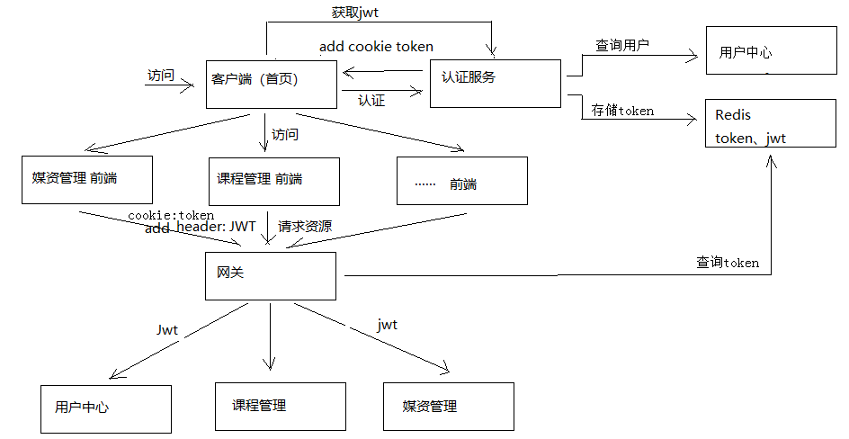

业务流程说明如下：

1. 客户端请求认证服务进行认证。

2. 认证服务认证通过向浏览器cookie写入token(身份令牌)

   2.1 认证服务请求用户中心查询用户信息。

   2.2 认证服务请求Spring Security申请令牌。

   2.3 认证服务将token(身份令牌)和jwt令牌存储至redis中。

   2.4 认证服务向cookie写入 token(身份令牌).

3. 前端携带token请求认证服务获取jwt令牌

   3.1 前端获取到jwt令牌并存储在sessionStorage。

   3.2 前端从jwt令牌中解析中用户信息并显示在页面。

4. 前端携带cookie中的token身份令牌及jwt令牌访问资源服务

   4.1 前端请求资源服务需要携带两个token，一个是cookie中的身份令牌，一个是http header中的jwt令牌

   4.2 前端请求资源服务前在http header上添加jwt请求资源

5. 网关校验token的合法性

   5.1 用户请求必须携带 token身份令牌和jwt令牌

   5.2 网关校验redis中token是否合法，已过期则要求用户重新登录

6. 资源服务校验jwt的合法性并完成授权

   资源服务校验jwt令牌，完成授权，拥有权限的方法正常执行，没有权限的方法将拒绝访问。

## 1.2  认证服务查询数据库

### 1.2.1 需求分析

认证服务根据数据库中的用户信息去校验用户的身份，即校验账号和密码是否匹配。

认证服务不直接连接数据库，而是通过用户中心服务去查询用户中心数据库。

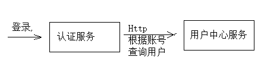

完整的流程图如下：

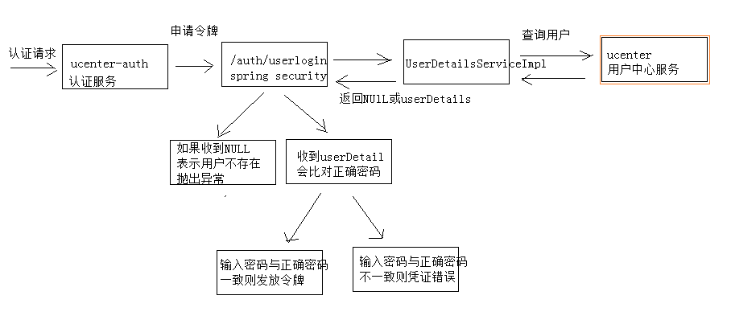

### 1.2.2 搭建环境

#### 1.2.2.1 创建用户中心数据库

用户中心负责用户管理，包括：用户信息管理、角色管理、权限管理等。

创建xc_user数据库（MySQL）

导入xc_user.sql(已导入不用重复导入)

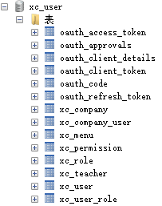

#### 1.2.2.2 创建用户中心工程

导入“资料”-》xc-service-ucenter.zip

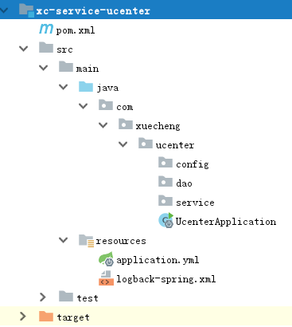

### 1.2.4 查询用户接口

完成用户中心根据账号查询用户信息接口功能。

#### 1.2.4.1 Api接口

用户中心对外提供如下接口：

1. 响应数据类型

   此接口将来被用来查询用户信息及用户权限信息，所以这里定义扩展类型

```java
@Data
@ToString
public class XcUserExt extends XcUser {
    //权限信息
    private List<XcMenu> permissions;
    //企业信息
    private String companyId;
}
```

2. 根据账号查询用户信息

```java
@Api(value = "用户中心",description = "用户中心管理")
public interface UcenterControllerApi {
    public XcUserExt getUserext(String username);
}
```

### 1.2.4.2 DAO

添加XcUser、XcCompantUser两个表的Dao

```java
public interface XcUserRepository extends JpaRepository<XcUser, String> {
        XcUser findXcUserByUsername(String username);
}
```

```java
public interface XcCompanyUserRepository extends JpaRepository<XcCompanyUser,String> {
    //根据用户id查询所属企业id
    XcCompanyUser findByUserId(String userId);
}
```

#### 1.2.4.2 Service

```java
@Service
public class UserService {
    @Autowired
    private XcUserRepository xcUserRepository;
    //根据用户账号查询用户信息
    public XcUser findXcUserByUsername(String username){
        return xcUserRepository.findXcUserByUsername(username);
    }
    //根据账号查询用户的信息，返回用户扩展信息
    public XcUserExt getUserExt(String username){
        XcUser xcUser = this.findXcUserByUsername(username);
        if(xcUser == null){
            return null;
        }
        XcUserExt xcUserExt = new XcUserExt();
        BeanUtils.copyProperties(xcUser,xcUserExt);
        //用户id
        String userId = xcUserExt.getId();
        //查询用户所属公司
        XcCompanyUser xcCompanyUser = xcCompanyUserRepository.findXcCompanyUserByUserId(userId);
        if(xcCompanyUser!=null){
            String companyId = xcCompanyUser.getCompanyId();
            xcUserExt.setCompanyId(companyId);
        }
        return xcUserExt;
    }
}
```

#### 1.2.4.3 Controller

```java
@RestController
@RequestMapping("/ucenter")
public class UcenterController implements UcenterControllerApi {
  @Autowired
  UserService userService;
  @Override
  @GetMapping("/getuserext")
  public XcUserExt getUserext(@RequestParam("username") String username) {
      XcUserExt xcUser = userService.getUserExt(username);
      return xcUser;
  }
}
```

#### 1.2.4.4 测试

使用Swagger-ui或postman测试用户信息查询接口

### 1.2.5 调用查询用户接口

#### 1.2.5.1 创建client

认证服务需要远程调用用户中心服务查询用户，在认证服务中创建Feign客户端

```java
@FeignClient(value = XcServiceList.XC_SERVICE_UCENTER)
public interface UserClient {
@GetMapping("/ucenter/getuserext")    
    public XcUserExt getUserext(@RequestParam("username") String username)
}
```

#### 1.2.5.2 UserDetailsServiceImpl

认证服务调用spring security接口申请令牌，spring security接口会调用UserDetailsServiceImpl从数据库查询用户，如果查询不到则返回 NULL，表示不存在；在UserDetailsServiceImpl中将正确的密码返回， spring security会自动去比对输入密码的正确性。

1. 修改UserDetailsServiceImpl的loadUserByUsername方法，调用Ucenter服务的查询用户接口

```java
 @Service
public class UserDetailsServiceImpl implements UserDetailsService {
    @Autowired
    UserClient userClient;
    @Override
    public UserDetails loadUserByUsername(String username) throws UsernameNotFoundException {
        //取出身份，如果身份为空说明没有认证
        Authentication authentication = SecurityContextHolder.getContext().getAuthentication();
        //没有认证统一采用httpbasic认证，httpbasic中存储了client_id和client_secret，开始认证client_id和client_secret
        if(authentication==null){
            ClientDetails clientDetails = clientDetailsService.loadClientByClientId(username);
            if(clientDetails!=null){
                //密码
                String clientSecret = clientDetails.getClientSecret();
                return new 	  	                     User(username,clientSecret,AuthorityUtils.commaSeparatedStringToAuthorityList(""));
            }
        }
        if (StringUtils.isEmpty(username)) {
            return null;
        }
        //请求ucenter查询用户
        XcUserExt userext = userClient.getUserext(username);
        if(userext == null){
            //返回NULL表示用户不存在，Spring Security会抛出异常
            return null;
        }
        //从数据库查询用户正确的密码，Spring Security会去比对输入密码的正确性
        String password = userext.getPassword();
        String user_permission_string = "";
        UserJwt userDetails = new UserJwt(username,
                password,
                AuthorityUtils.commaSeparatedStringToAuthorityList(user_permission_string));
        //用户id
        userDetails.setId(userext.getId());
        //用户名称
        userDetails.setName(userext.getName());
        //用户头像
        userDetails.setUserpic(userext.getUserpic());
        //用户所属企业id
        userDetails.setCompanyId(userext.getCompanyId());
        return userDetails;
    }
}
```

2. 测试，请求http://localhost:40400/auth/userlogin

   观察 UserDetailsServiceImpl是否正常请求Ucenter的查询用户接口。

#### 1.2.5.3 BCryptPasswordEncoder

早期使用md5对密码进行编码，每次算出的md5值都一样，这样非常不安全，Spring Security推荐使用BCryptPasswordEncoder对密码加随机盐，每次的Hash值都不一样，安全性高。

1. BCryptPasswordEncoder测试程序如下

```java
@Test
public void testPasswrodEncoder(){
    String password = "111111";
    PasswordEncoder passwordEncoder = new BCryptPasswordEncoder();
    for(int i=0;i<10;i++) {
        //每个计算出的Hash值都不一样
        String hashPass = passwordEncoder.encode(password);
        System.out.println(hashPass);
        //虽然每次计算的密码Hash值不一样但是校验是通过的
        boolean f = passwordEncoder.matches(password, hashPass);
        System.out.println(f);
    }
}
```

2. 在AuthorizationServerConfig配置类中配置BCryptPasswordEncoder

```java
//采用bcrypt对密码进行Hash
@Bean
public PasswordEncoder passwordEncoder() {
    return new BCryptPasswordEncoder();
}
```

3. 测试

   请求http://localhost:40400/auth/userlogin，输入正常的账号和密码进行测试

#### 1.2.5.4 解析申请令牌错误信息

当账号输入错误应该返回用户不存在的信息，当密码错误要返回用户名或密码错误信息，业务流程图如下：

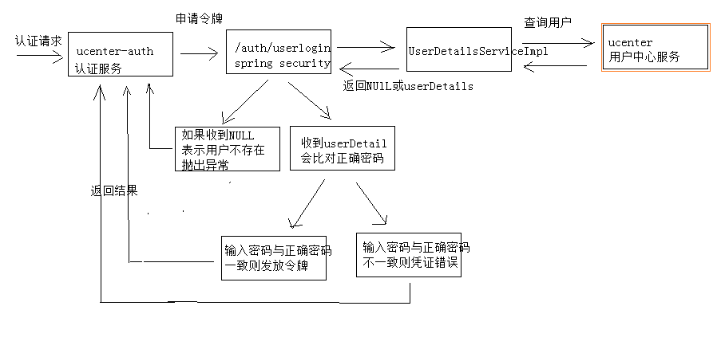

修改申请令牌的程序解析返回的错误:

由于restTemplate收到400或401的错误会抛出异常，而spring security针对账号不存在及密码错误会返回400及401，所以在代码中控制针对400或401的响应不要抛出异常。

```java
 ......
Map map = null;
try {
    ((RestTemplate) restTemplate).setErrorHandler(new DefaultResponseErrorHandler() {
        @Override
        public void handleError(ClientHttpResponse response) throws IOException {
            // 设置 当响应400和401时照常响应数据，不要报错
            if (response.getRawStatusCode() != 400 && response.getRawStatusCode() != 401 ) {
                super.handleError(response);
            }
        }
    });
    //http请求spring security的申请令牌接口
    ResponseEntity<Map> mapResponseEntity = restTemplate.exchange(path, HttpMethod.POST, new
HttpEntity<MultiValueMap<String, String>>(formData, header), Map.class);
    map = mapResponseEntity.getBody();
} catch (Exception e) {
    e.printStackTrace();
    LOGGER.error("request oauth_token_password error: {}",e.getMessage());
    e.printStackTrace();
    ExceptionCast.cast(AuthCode.AUTH_LOGIN_APPLYTOKEN_FAIL);
}
if(map == null ||
        map.get("access_token") == null ||
        map.get("refresh_token") == null ||
        map.get("jti") == null){//jti是jwt令牌的唯一标识作为用户身份令牌
    //获取spring security返回的错误信息
        String error_description = (String) map.get("error_description");
    if(StringUtils.isNotEmpty(error_description)){
        if(error_description.equals("坏的凭证")){
            ExceptionCast.cast(AuthCode.AUTH_CREDENTIAL_ERROR);
        }else if(error_description.indexOf("UserDetailsService returned null")>=0){
            ExceptionCast.cast(AuthCode.AUTH_ACCOUNT_NOTEXISTS);
        }
    }
    ExceptionCast.cast(AuthCode.AUTH_LOGIN_APPLYTOKEN_FAIL);
}
......
```

用户不存在：

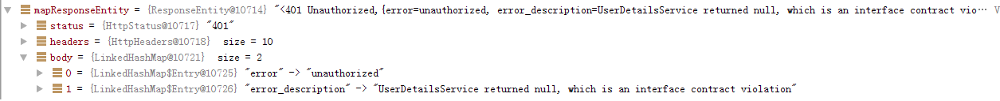

密码错误：

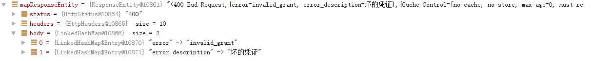

#### 1.2.5.5 测试

使用postman请求http://localhost:40400/auth/userlogin

1. 输入正确的账号和密码进行测试

   从数据库找到测试账号，本课程所提供的用户信息初始密码统一为111111

2. 输入错误的账号和密码进行测试

## 1.3 用户登录前端

### 1.3.1 需求分析

点击用户登录固定跳转到用户中心前端的登录页面，如下：

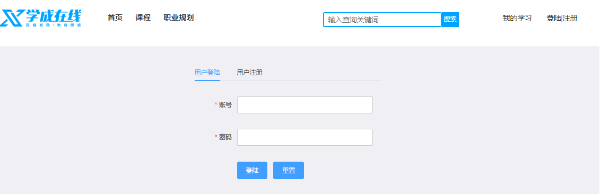

输入账号和密码，登录成功，跳转到首页。

用户中心前端（xc-ui-pc-learning工程）提供登录页面，所有子系统连接到此页面。

说明：

页面有“登录|注册”链接的前端系统有：门户系统、搜索系统、用户中心。

本小节修改门户系统的页头，其它三处可参考门户修改。

### 1.3.2 Api方法

进入xc-ui-pc-learning工程定义api方法，在base模块下定义login.js。

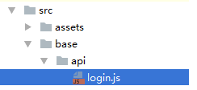

```javascript
/*登陆*/
export const login = params => {
  //let loginRequest = querystring.stringify(params)
  let loginRequest = qs.stringify(params);
  return http.requestPostForm('/openapi/auth/userlogin',loginRequest);
}
```

### 1.3.3 页面

1. 登录页面

   进入用户中心前端，找到登录页面loginpage.vue：

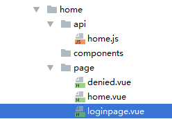

loginpage.vue使用了loginForm.vue组件，loginForm.vue页面包括了登录表单

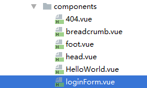

2. 路由配置

   在home模块配置路由：

```javascript
import Home from '@/module/home/page/home.vue';
import Login from '@/module/home/page/loginpage.vue';
import Denied from '@/module/home/page/denied.vue';
import Logout from '@/module/home/page/logout.vue';
import order_pay from '@/module/order/page/order_pay.vue';
export default [{
    path: '/',
    component: Home,
    name: '个人中心',
    hidden: true
  },
  {
    path: '/login',
    component: Login,
    name: 'Login',
    hidden: true
  },
  .....
```

3. 登录后跳转

   请求登录页面需携带returnUrl参数，要求此参数使用Base64编码。

   登录成功后将跳转到returnUrl，loginForm.vue组件的登录方法如下：

```javascript
login: function () {
        this.$refs.loginForm.validate((valid) => {
      if (valid) {
          this.editLoading = true;
          let para = Object.assign({}, this.loginForm);
          loginApi.login(para).then((res) => {
            this.editLoading = false;
            if(res.success){
              this.$message('登陆成功');
              //刷新 当前页面
             // alert(this.returnUrl)
              console.log(this.returnUrl)
              if(this.returnUrl!='undefined' && this.returnUrl!=''
                                               && !this.returnUrl.includes("/userlogout")
                                               && !this.returnUrl.includes("/userlogin")){
                window.location.href = this.returnUrl;
              }else{
                //跳转到首页
                window.location.href = 'http://www.xuecheng.com/'
              }
            }else{
                if(res.message){
                  this.$message.error(res.message);
                }else{
                  this.$message.error('登陆失败');
                }
            }
          },
            (res) => {
              this.editLoading = false;
            });
      }
    });
},
```

### 1.3.5  点击登录页面

在门户的页头点击“登录|注册”连接到用户中心的登录页面，并且携带returnUrl。

修改门户的header.html，代码如下：

```html
 <a href="javascript:;" @click="showlogin" v‐if="logined == false">登陆&nbsp;|&nbsp;注册</a>
```

```javascript
showlogin: function(){
 //this.loginFormVisible = true;   
 	window.location = "http://ucenter.xuecheng.com/#/login?returnUrl="+
	Base64.encode(window.location)
}
```

### 1.3.6 测试

测试之前修改认证服务的配置：

修改 application.yml中cookie域名

```yaml
cookieDomain: xuecheng.com
```

测试流程如下：

1. 输入www.xuecheng.com进入系统（需要在 hosts文件配置）
2. 输入正确的账号和密码，提交
3. 输入错误的账号和密码，提交


# 2. 前端显示当前用户

## 2.1  需求分析

用户登录成功在页头显示当前登录的用户名称。

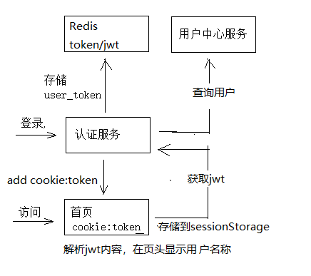

1. 用户请求认证服务，登录成功。

2. 用户登录成功，认证服务向cookie写入身份令牌，向redis写入user_token（身份令牌及授权jwt授权令牌）

3. 客户端携带cookie中的身份令牌请求认证服务获取jwt令牌。

4. 客户端解析jwt令牌，并将解析的用户信息存储到sessionStorage中。

   jwt令牌中包括了用户的基本信息，客户端解析jwt令牌即可获取用户信息。

5. 客户端从sessionStorage中读取用户信息，并在页头显示。

sessionStorage ：

​	sessionStorage 是**H5**的一个会话存储对象，在SessionStorage中保存的数据只在同一窗口或同一标签页中有效，在关闭窗口之后将会删除SessionStorage中的数据。

​	seesionStorage的存储方式采用key/value的方式，可保存5M左右的数据（不同的浏览器会有区别）。

## 2.2 jwt 查询接口

### 2.2.1 需求分析

认证服务对外提供jwt查询接口，流程如下：

1. 客户端携带cookie中的身份令牌请求认证服务获取jwt
2. 认证服务根据身份令牌从redis中查询jwt令牌并返回给客户端。

### 2.2.2 API

在认证模块定义 jwt查询接口：

```java
@Api(value = "jwt查询接口",description = "客户端查询jwt令牌内容")
public interface AuthControllerApi {
    @ApiOperation("查询userjwt令牌")
    public JwtResult userjwt();
```

### 2.2.3 Dao

无

### 2.2.4 Service

在AuthService中定义方法如下：

```java
//从redis查询令牌
public AuthToken getUserToken(String token){
    String userToken = "user_token:"+token;
    String userTokenString = stringRedisTemplate.opsForValue().get(userToken);
    if(userToken!=null){
        AuthToken authToken = null;
        try {
            authToken = JSON.parseObject(userTokenString, AuthToken.class);
        } catch (Exception e) {
            LOGGER.error("getUserToken from redis and execute JSON.parseObject error{}",e.getMessage
                         ());
            e.printStackTrace();
        }
        return authToken;
    }
    return null;
}
```

### 2.2.5 Controller

```java
@Override
@GetMapping("/userjwt")
public JwtResult userjwt() {
    //获取cookie中的令牌        
	String access_token = getTokenFormCookie();
    //根据令牌从redis查询jwt
    AuthToken authToken = authService.getUserToken(access_token);
    if(authToken == null){
        return new JwtResult(CommonCode.FAIL,null);
    }
    return new JwtResult(CommonCode.SUCCESS,authToken.getJwt_token());
}
```

```java
//从cookie中读取访问令牌
private String getTokenFormCookie(){
    Map<String, String> cookieMap = CookieUtil.readCookie(request, "uid");
    String access_token = cookieMap.get("uid");
    return access_token;
}
```

### 2.2.6 测试

使用postman测试

1. 请求 /auth/userlogin

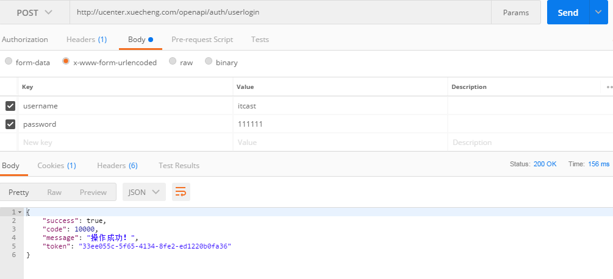

​	观察cookie是否已存入用户身份令牌

2. get请求jwt

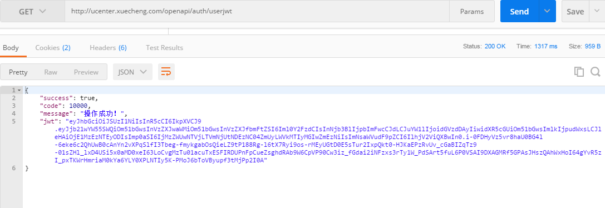

## 2.3  前端请求jwt

### 2.3.1 需求分析

前端需求如下：

用户登录成功，前端请求认证服务获取jwt令牌。

前端解析jwt令牌的内容，得到用户信息，并将用户信息存储到sessionStorage。

从 sessionStorage取出用户信息在页头显示用户名称。

### 2.3.2 API方法

在login.js中定义getjwt方法：

```javascript
/*获取jwt令牌*/
const getjwt = () => {
    return requestGet('/openapi/auth/userjwt');
}
```

### 2.3.3 页面

修改include/header.html

1. 页面视图

```html
<span v‐if="logined == true">欢迎{{this.user.username}}</span>
<a href="javascript:;" @click="logout" v‐if="logined == true">退出</a>
<a href="http://ucenter.xuecheng.com/" class="personal" target="_blank">我的学习</a>
<a href="javascript:;" @click="showlogin" v‐if="logined == false">登陆&nbsp;|&nbsp;注册</a>
<a href="http://teacher.xuecheng.com/" class="personal" target="_blank">教学提供方</a>
<a href="http://system.xuecheng.com/" class="personal" target="_blank">系统后台</a>
```

​	用户登录成功设置数据对象logined为true，设置数据对象user为当前用户信息。

​	数据对象定义如下：

```json
user:{
    userid:'',
    username: '',
    userpic: ''
},
logined:false
```

2. 解析jwt令牌

   在util.js中定义解析jwt令牌方法：

```javascript
//解析jwt令牌，获取用户信息
var getUserInfoFromJwt = function (jwt) {
    if(!jwt){
        return ;
    }
    var jwtDecodeVal = jwt_decode(jwt);
    if (!jwtDecodeVal) {
        return ;
    }
    let activeUser={}
    //console.log(jwtDecodeVal)
    activeUser.utype = jwtDecodeVal.utype || '';
    activeUser.username = jwtDecodeVal.name || '';
    activeUser.userpic = jwtDecodeVal.userpic || '';
    activeUser.userid = jwtDecodeVal.userid || '';
    activeUser.authorities = jwtDecodeVal.authorities || '';
    activeUser.uid = jwtDecodeVal.jti || '';
    activeUser.jwt = jwt;
    return activeUser;
}
```

3. refresh_user()

   在mounted钩子方法中获取当前用户信息，并将用户信息存储到sessionStorage

```javascript
mounted(){
    //刷新当前用户
    this.refresh_user()
}
```

​	refresh_user()方法如下：

```javascript
refresh_user:function(){ 
//从sessionStorage中取出当前用户
let activeUser= getActiveUser();
//取出cookie中的令牌
let uid = getCookie("uid")
    //console.log(activeUser)
    if(activeUser && uid && uid == activeUser.uid){
        this.logined = true
        this.user = activeUser;
    }else{
        if(!uid){
            return ;
        }
        //请求查询jwt
        getjwt().then((res) => {
            if(res.success){
                let jwt = res.jwt;
                let activeUser = getUserInfoFromJwt(jwt)
                if(activeUser){
                    this.logined = true
                    this.user = activeUser;
                    setUserSession("activeUser",JSON.stringify(activeUser))
                }
            }
        })
    }
}
```

### 2.3.4  配置代理转发

上边实现在首页显示当前用户信息，首页需要通过Nginx代理请求认证服务，所以需要在首页的虚拟主机上配置代理路径：

```nginx
#认证
location ^~ /openapi/auth/ {      
	proxy_pass http://auth_server_pool/auth/;          
} 
```

注意：其它前端系统要接入认证要请求认证服务也需要配置上边的代理路径。

# 3. 用户退出

## 3.1  需求分析

操作流程如下：

1. 用户点击退出，弹出退出确认窗口，点击确定

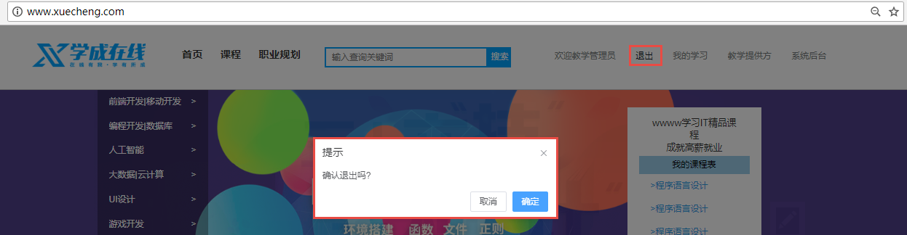

2. 退出成功

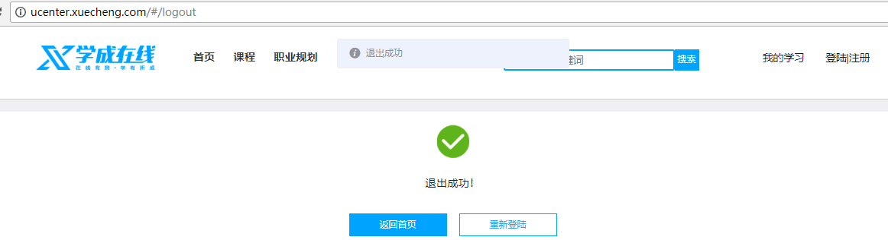

用户退出要以下动作：

1. 删除redis中的token
2. 删除cookie中的token

## 3.2 API

认证服务对外提供退出接口。

```java
@ApiOperation("退出")
public ResponseResult logout();
```

## 3.3 服务端

认证服务提供退出接口。

### 3.3.1 DAO

无。

### 3.3.2 Service

```java
//从redis中删除令牌
public boolean delToken(String access_token){
    String name = "user_token:" + access_token;
    stringRedisTemplate.delete(name);
    return true;
}
```

### 3.3.3 Controller

```java
//退出
@Override
@PostMapping("/userlogout")
public ResponseResult logout() {
    //取出身份令牌
    String uid = getTokenFormCookie();
    //删除redis中token
    authService.delToken(uid);
    //清除cookie
    clearCookie(uid);
    return new ResponseResult(CommonCode.SUCCESS);
}
//清除cookie
private void clearCookie(String token){
    CookieUtil.addCookie(response, cookieDomain, "/", "uid", token, 0, false);
}
```

### 3.3.4 退出URL放行

认证服务默认都要校验用户的身份信息，这里需要将退出url放行。

在WebSecurityConfig类中重写 configure(WebSecurity web)方法，如下：

```java
@Override    
public void configure(WebSecurity web) throws Exception {
     web.ignoring().antMatchers("/userlogin","/userlogout");
}
```

## 3.4 前端

### 3.4.1 需求分析

在用户中心前端工程（ xc-ui-pc-learning）开发退出页面。

### 3.4.2 Api方法

在用户中心工程增加退出的api方法

在base模块的login.js增加方法如下：

```javascript
/*退出*/
export const logout = params => {
  return http.requestPost('/openapi/auth/userlogout');
}
```

### 3.4.3 退出页面

1. 在用户中心工程创建退出页面

   参考：

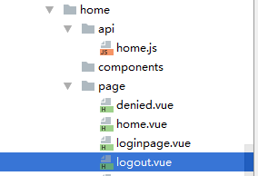

2. 路由配置

```javascript
import Logout from '@/module/home/page/logout.vue';
import order_pay from '@/module/order/page/order_pay.vue';
// import LoginMini from '@/module/home/page/login_mini.vue';
export default [{
    path: '/',
    component: Home,
    name: '个人中心',
    hidden: true
  },
  {
    path: '/login',
    component: Login,
    name: 'Login',
    hidden: true
  },
  {
    path: '/logout',
    component: Logout,
    name: 'Logout',
    hidden: true
  },
  ....
```

3. 退出方法

   退出成功清除页面的sessionStorage

   参考logout.vue

   在created钩子方法请求退出方法

```javascript
created(){ 
  loginApi.logout({}).then((res) => {
      if(res.success){
        sessionStorage.removeItem('activeUser');
        this.$message('退出成功');
        this.logoutsuccess = true
      }else{
        this.logoutsuccess = false
      }
    },
    (res) => {
      this.logoutsuccess = false
    });
},
```

### 3.4.4 连接到退出页面

修改include/header.html

```html
<a href="javascript:;" @click="logout" v‐if="logined == true"> 退出</a>
```

在include/header.html中添加element-ui库：

将此js加到head的最下边

```javascript
<script src="/css/el/index.js"></script> 
```

logout方法如下：

```javascript
logout: function () { 
   this.$confirm('确认退出吗?', '提示', {
   }).then(() => {
       //跳转到统一登陆
       window.location = "http://ucenter.xuecheng.com/#/logout"
   }).catch(() => {
   });
},
```

### 3.4.5 测试

1. 用户登录成功
2. 点击退出

# 4. Zuul 网关

## 4.1  需求分析

网关的作用相当于一个过虑器、拦截器，它可以拦截多个系统的请求。

本章节要使用网关校验用户的身份是否合法。

## 4.2 Zuul 介绍

**什么是Zuul？**

Spring Cloud Zuul是整合Netflix公司的Zuul开源项目实现的微服务网关，它实现了请求路由、负载均衡、校验过滤等 功能。

官方：https://github.com/Netflix/zuul

**什么是网关？**

服务网关是在微服务前边设置一道屏障，请求先到服务网关，网关会对请求进行过虑、校验、路由等处理。有了服务网关可以提高微服务的安全性，网关校验请求的合法性，请求不合法将被拦截，拒绝访问。

**Zuul与Nginx怎么配合使用？**

Zuul与Nginx在实际项目中需要配合使用，如下图，Nginx的作用是反向代理、负载均衡，Zuul的作用是保障微服务的安全访问，拦截微服务请求，校验合法性及负载均衡。

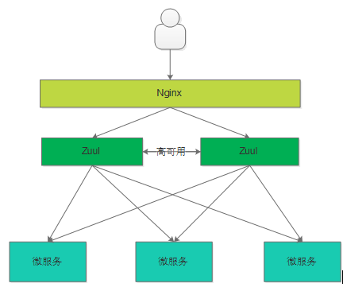

## 4.3 搭建网关工程

创建网关工程（xc-govern-gateway）：

1. 创建xc-govern-gateway工程

   导入“资料”--》xc-govern-gateway.zip

2. @EnableZuulProxy

   注意在启动类上使用@EnableZuulProxy注解标识此工程为Zuul网关，启动类代码如下：

```java
@SpringBootApplication 
@EnableZuulProxy
public class GatewayApplication {
    public static void main(String[] args) {
        SpringApplication.run(GatewayApplication.class, args);
    }
}
```

## 4.4 路由配置

### 4.4.1 需求分析

Zuul网关具有代理的功能，根据请求的url转发到微服务，如下图：

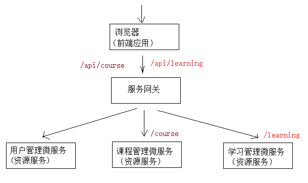

客户端请求网关/api/learning，通过路由转发到/learning

客户端请求网关/api/course，通过路由转发到/course

### 4.4.2 路由配置

在appcation.yml中配置：

```yaml
zuul:
  routes:
    manage‐course:  #路由名称，名称任意，保持所有路由名称唯一
      path: /course/** 
      serviceId: xc‐service‐manage‐course #指定服务id，从Eureka中找到服务的ip和端口
      #url: http://localhost:31200 #也可指定url
      strip‐prefix: false #true：代理转发时去掉前缀，false:代理转发时不去掉前缀
      sensitiveHeaders: #默认zuul会屏蔽cookie，cookie不会传到下游服务，这里设置为空则取消默认的黑名单，如果设置了具体的头信息则不会传到下游服务
#   ignoredHeaders: Authorization
```

serviceId：推荐使用serviceId，zuul会从Eureka中找到服务id对应的ip和端口。

strip-prefix: false #true：代理转发时去掉前缀，false:代理转发时不去掉前缀，例如，为true请求/course/coursebase/get/..，代理转发到/coursebase/get/，如果为false则代理转发到/course/coursebase/get

sensitiveHeaders ：敏感头设置，默认会过虑掉cookie，这里设置为空表示不过虑

ignoredHeaders：可以设置过虑的头信息，默认为空表示不过虑任何头

### 4.4.3 测试

请求http://localhost:50201/api/course/coursepic/list/4028e58161bd22e60161bd23672a0001查询课程图片信息

http://localhost:50201/api是网关地址，通过路由转发到 xc-service-manage-course服务。

由于课程管理已经添加了授课拦截，这里为了测试网关功能暂时将“/course/coursepic/list”url排除认证。

在课程管理服务的 ResourceServerConfig类中添加"/course/coursepic/list/*",代码如下：

```java
@Override
public void configure(HttpSecurity http) throws Exception {
    //所有请求必须认证通过
    http.authorizeRequests()
            //下边的路径放行
    .antMatchers("/v2/api‐docs", "/swagger‐resources/configuration/ui",
            "/swagger‐resources","/swagger‐resources/configuration/security",
            "/swagger‐ui.html","/course/coursepic/list/*")
            .permitAll()
    .anyRequest().authenticated();
}
```

### 4.4.4 完整的路由配置

```yaml
zuul:
  routes:
    xc‐service‐learning:  #路由名称，名称任意，保持所有路由名称唯一
      path: /learning/**
      serviceId: xc‐service‐learning #指定服务id，从Eureka中找到服务的ip和端口
      strip‐prefix: false
      sensitiveHeaders:
    manage‐course:
      path: /course/**
      serviceId: xc‐service‐manage‐course
      strip‐prefix: false
      sensitiveHeaders:
    manage‐cms:
      path: /cms/**
      serviceId: xc‐service‐manage‐cms
      strip‐prefix: false
      sensitiveHeaders:
    manage‐sys:
      path: /sys/**
      serviceId: xc‐service‐manage‐cms
      strip‐prefix: false
            sensitiveHeaders:
    service‐ucenter:
      path: /ucenter/**
      serviceId: xc‐service‐ucenter
      sensitiveHeaders:
      strip‐prefix: false
    xc‐service‐manage‐order:
       path: /order/**
       serviceId: xc‐service‐manage‐order
       sensitiveHeaders:
       strip‐prefix: false
```

## 4.5 过滤器

Zuul的核心就是过滤器，通过过虑器实现请求过虑，身份校验等。

### 4.5.1 ZuulFilter

自定义过滤器需要继承 ZuulFilter，ZuulFilter是一个抽象类，需要覆盖它的四个方法，如下：

1. shouldFilter：返回一个Boolean值，判断该过滤器是否需要执行。返回true表示要执行此过虑器，否则不执行。

2. run：过滤器的业务逻辑。

3. filterType：返回字符串代表过滤器的类型，如下 

   pre：请求在被路由之前执行

   routing：在路由请求时调用 

   post：在routing和errror过滤器之后调用 

   error：处理请求时发生错误调用

4. filterOrder：此方法返回整型数值，通过此数值来定义过滤器的执行顺序，数字越小优先级越高。

### 4.5.2 测试

过虑所有请求，判断头部信息是否有Authorization，如果没有则拒绝访问，否则转发到微服务。

定义过虑器，使用@Component标识为bean。

```java
@Component
public class LoginFilterTest extends ZuulFilter {
    private static final Logger LOG = LoggerFactory.getLogger(LoginFilterTest.class);
    @Override
    public String filterType() {
        return "pre";
    }
    @Override
    public int filterOrder() {
        return 2;//int值来定义过滤器的执行顺序，数值越小优先级越高
    }
    @Override
    public boolean shouldFilter() {// 该过滤器需要执行
        return true;
        }
    @Override
    public Object run() {
        RequestContext requestContext = RequestContext.getCurrentContext();
        HttpServletResponse response = requestContext.getResponse();
        HttpServletRequest request = requestContext.getRequest();
        //取出头部信息Authorization
        String authorization = request.getHeader("Authorization");
        if(StringUtils.isEmpty(authorization)){
            requestContext.setSendZuulResponse(false);// 拒绝访问
         requestContext.setResponseStatusCode(200);// 设置响应状态码    
         ResponseResult unauthenticated = new ResponseResult(CommonCode.UNAUTHENTICATED);    
         String jsonString = JSON.toJSONString(unauthenticated);    
         requestContext.setResponseBody(jsonString);    
         requestContext.getResponse().setContentType("application/json;charset=UTF‐8");    
            return null;
        }
        return null;
    }
}
```

测试：

请求：http://localhost:50201/api/course/coursebase/get/4028e581617f945f01617f9dabc40000查询课程信息

1. Header中不设置Authorization

   响应结果：

```javascript
{ 
    "code": 10001,
    "message": "此操作需要登陆系统！",
    "success": false
}
```

2. Header中设置Authorization

   成功响应课程信息。

# 5. 身份校验

## 5.1 需求分析

本小节实现网关连接Redis校验令牌：

1. 从cookie查询用户身份令牌是否存在，不存在则拒绝访问
2. 从http header查询jwt令牌是否存在，不存在则拒绝访问
3. 从Redis查询user_token令牌是否过期，过期则拒绝访问

## 5.2 编码代码

1. 配置application.yml

   配置 redis链接参数：

```yaml
spring:
  application:
    name: xc‐govern‐gateway
  redis:
    host: ${REDIS_HOST:127.0.0.1}
    port: ${REDIS_PORT:6379}
    timeout: 5000 #连接超时 毫秒
    jedis:
      pool:
        maxActive: 3
        maxIdle: 3
        minIdle: 1
        maxWait: ‐1 #连接池最大等行时间 ‐1没有限制
```

2. 使用StringRedisTemplate查询key的有效期

   在service包下定义AuthService类：

```java
@Service
public class AuthService {
    @Autowired
    StringRedisTemplate stringRedisTemplate;
    //查询身份令牌
    public String getTokenFromCookie(HttpServletRequest request){
        Map<String, String> cookieMap = CookieUtil.readCookie(request, "uid");
        String access_token = cookieMap.get("uid");
        if(StringUtils.isEmpty(access_token)){
            return null;
        }
        return access_token;
    }
    //从header中查询jwt令牌
    public String getJwtFromHeader(HttpServletRequest request){
        String authorization = request.getHeader("Authorization");
        if(StringUtils.isEmpty(authorization)){
            //拒绝访问
            return null;
        }
            if(!authorization.startsWith("Bearer ")){
            //拒绝访问
            return null;
        }
        return authorization;
    }
    //查询令牌的有效期
    public long getExpire(String access_token) {
        //token在redis中的key
        String key = "user_token:"+access_token;
        Long expire = stringRedisTemplate.getExpire(key);
        return expire;
    }
}
```

说明：由于令牌存储时采用 String序列化策略，所以这里用 StringRedisTemplate来查询，使用RedisTemplate无法完成查询。

3. 定义LoginFilter

```java
@Component
public class LoginFilter extends ZuulFilter {
    private static final Logger LOGG = LoggerFactory.getLogger(LoginFilter.class);
    @Autowired
    AuthService authService;
    @Override
    public String filterType() {
        //四种类型：pre、routing、post、error
        return "pre";
    }
    @Override
    public int filterOrder() {
        return 0;
    }
    @Override
    public boolean shouldFilter() {
        return true;
    }
    @Override
    public Object run() {
        //上下文对象
        RequestContext requestContext = RequestContext.getCurrentContext();
        //请求对象
        HttpServletRequest request = requestContext.getRequest();
        //查询身份令牌
        String access_token = authService.getTokenFromCookie(request);
        if(access_token == null){
                    //拒绝访问
            access_denied();
        }
        //从redis中校验身份令牌是否过期
        long expire = authService.getExpire(access_token);
        if(expire<=0){
            //拒绝访问
            access_denied();
        }
        //查询jwt令牌
        String jwt = authService.getJwtFromHeader(request);
        if(jwt == null){
            //拒绝访问
            access_denied();
        }
        return null;
    }
    //拒绝访问
    private void access_denied(){
        //上下文对象
        RequestContext requestContext = RequestContext.getCurrentContext();
        requestContext.setSendZuulResponse(false);//拒绝访问
        //设置响应内容
        ResponseResult responseResult =new ResponseResult(CommonCode.UNAUTHENTICATED);
        String responseResultString = JSON.toJSONString(responseResult);
        requestContext.setResponseBody(responseResultString);
        //设置状态码
        requestContext.setResponseStatusCode(200);
        HttpServletResponse response = requestContext.getResponse();
        response.setContentType("application/json;charset=utf‐8");
    }
}
```

## 5.3 测试

1. 配置代理

   通过nginx转发到gateway，在www.xuecheng.com虚拟主机来配置

```nginx
#微服务网关    
upstream api_server_pool{
    server 127.0.0.1:50201 weight=10;
}
#微服务网关
location /api {      
	proxy_pass http://api_server_pool;          
}
```

2. 使用postman测试：

​	Get请求：http://www.xuecheng.com/api/course/coursebase/get/4028e581617f945f01617f9dabc40000

​	注意：这里通过网关请求了 course/coursebase/get地址，课程管理url根据自己的开发情况去配置，

​	2.1 正常流程测试

​		a. 执行登录使之向cookie写入身份令牌uid

​		Post请求：http://ucenter.xuecheng.com/openapi/auth/userlogin

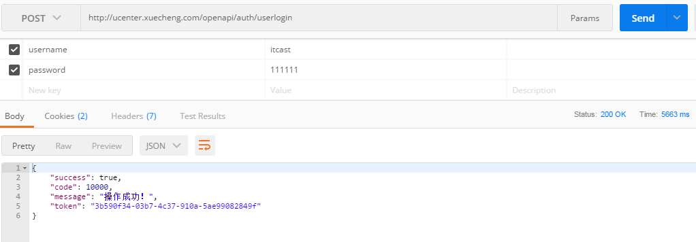

​	并从redis获取jwt令牌的内容

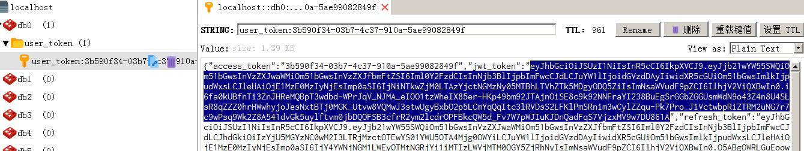

​	b. 手动在postman添加header

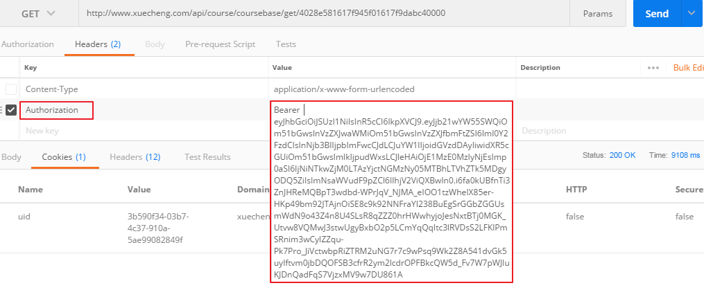

成功查询：	

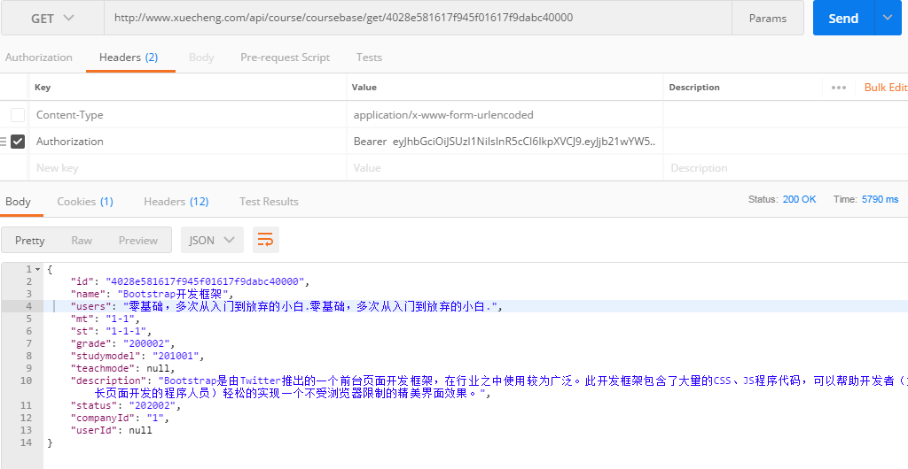

3. 异常流程测试

   手动删除header或清除cookie观察测试结果。