# 1. 用户授权业务流程

用户授权的业务流程如下：

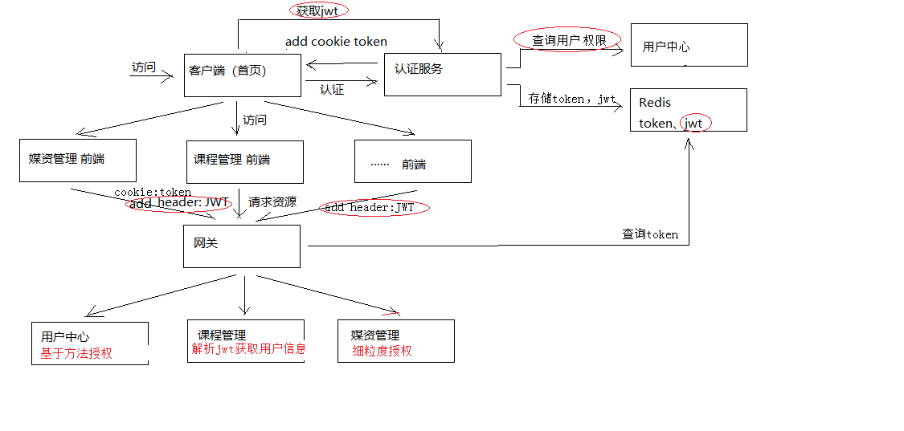

业务流程说明如下：

1. 用户认证通过，认证服务向浏览器cookie写入token（ 身份令牌）

2. 前端携带token请求用户中心服务获取jwt令牌

   前端获取到jwt令牌解析，并存储在sessionStorage

3. 前端携带cookie中的身份令牌及jwt令牌访问资源服务

   前端请求资源服务需要携带两个token，一个是cookie中的身份令牌，一个是http header中的jwt

   前端请求资源服务前在http header上添加jwt请求资源

4. 网关校验token的合法性

   用户请求必须携带身份令牌和jwt令牌

   网关校验redis中user_token的有效期，已过期则要求用户重新登录

5. 资源服务校验jwt的合法性并进行授权

   资源服务校验jwt令牌，完成授权，拥有权限的方法正常执行，没有权限的方法将拒绝访问。

# 2. 方法授权

## 2.1 需求分析

方法授权要完成的是资源服务根据jwt令牌完成对方法的授权，具体流程如下：

1. 生成Jwt令牌时在令牌中写入用户所拥有的权限

   我们给每个权限起个名字，例如某个用户拥有如下权限：

   course_find_list：课程查询	

   course_pic_list：课程图片查询

2. 在资源服务方法上添加注解PreAuthorize，并指定此方法所需要的权限

   例如下边是课程管理接口方法的授权配置，它就表示要执行这个方法需要拥有course_find_list权限。

```java
@PreAuthorize("hasAuthority('course_find_list')")
@Override
public QueryResult<CourseInfo> findCourseList(@PathVariable("page") int page,
                                              @PathVariable("size") int size,
                                              CourseListRequest courseListRequest)
```

3. 当请求有权限的方法时正常访问
4. 当请求没有权限的方法时则拒绝访问

## 2.2 jwt 令牌包含权限

修改认证服务的UserDetailServiceImpl类，下边的代码中 permissionList列表中存放了用户的权限，并且将权限标识按照中间使用逗号分隔的语法组成一个字符串，最终提供给Spring security。

```java
      ......
      //指定用户的权限，这里暂时硬编码
        List<String> permissionList = new ArrayList<>();
        permissionList.add("course_get_baseinfo");
        permissionList.add("course_find_pic");
        //将权限串中间以逗号分隔
        String permissionString = StringUtils.join(permissionList.toArray(), ",");
        //String user_permission_string = "";
        UserJwt userDetails = new UserJwt(username,
                password,
                AuthorityUtils.commaSeparatedStringToAuthorityList(permissionString));
        //用户名称
        userDetails.setName(userext.getName());
        //用户头像
        userDetails.setUserpic(userext.getUserpic());
        ......
```

重启认证服务工程，使用 postman完成登录，从redis中找到jwt令牌。

使用jwt的测试程序查看 此令牌的内容。

```json
{
    "companyId": null,
    "userpic": null,
    "user_name": "mrt",
    "scope": [
        "app"
    ],
    "name": "教学管理员",
    "utype": "101002",
    "id": "49",
    "exp": 1527202013,
    "authorities": [
        "course_find_pic",
        "course_get_baseinfo"
    ],
    "jti": "9360fa85‐c1b4‐428a‐80ec‐b2e705a02827",
    "client_id": "XcWebApp"
}
```

可以看到authorities属性中为用户的权限。

## 2.3  方法授权实现

### 2.3.1 资源服务添加授权控制

1. 要想在资源服务使用方法授权，首先在资源服务配置授权控制

   添加spring-cloud-starter-oauth2依赖。

   拷贝授权配置类ResourceServerConfig。

   拷贝公钥。

### 2.3.2 方法上添加注解

通常情况下，程序员编写在资源服务的controller方法时会使用注解指定此方法的权限标识。

1. 查询课程列表方法

   指定查询课程列表方法需要拥有course_find_list权限。

```java
@PreAuthorize("hasAuthority('course_find_list')")
@Override
public QueryResult<CourseInfo> findCourseList(@PathVariable("page") int page,
                                              @PathVariable("size") int size,
                                              CourseListRequest courseListRequest)
```

2. 查看课程基本信息方法

   指定查询课程基本信息方法需要拥有course_get_baseinfo权限。

```java
@PreAuthorize("hasAuthority('course_get_baseinfo')")
@Override
public CourseBase getCourseBaseById(@PathVariable("courseId") String courseId)
```

3. 在资源服务（这里是课程管理）的ResourceServerConfig类上添加注解，激活方法上添加授权注解

```java
//激活方法上的PreAuthorize注解
@EnableGlobalMethodSecurity(prePostEnabled = true, securedEnabled = true)
```

## 2.4  方法授权测试

重启课程管理服务，测试上边两个方法。

使用postman测试，测试前执行登录，并且将jwt令牌添加到header。

1. Get 请求 http://www.xuecheng.com/api/course/coursebase/get/4028e581617f945f01617f9dabc40000

   用户拥有 course_get_baseinfo权限，可以正常访问

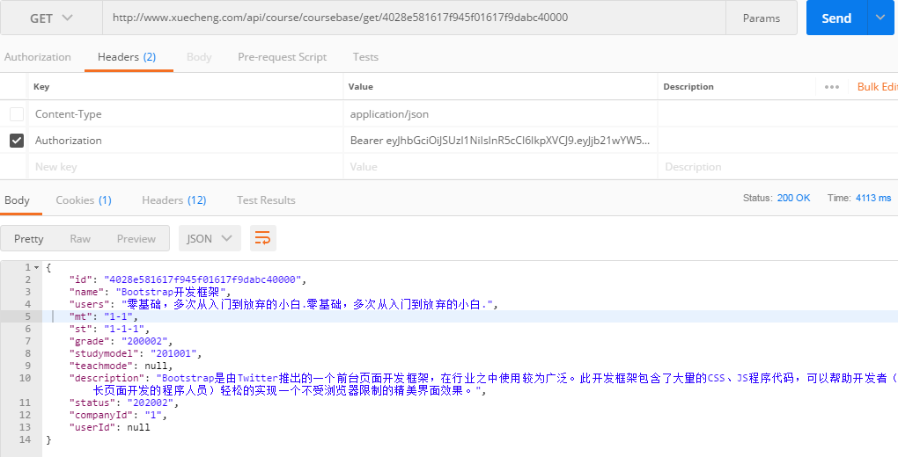

2. Get请求 http://www.xuecheng.com/api/course/coursebase/list/1/2

   由于用户没有查询课程列表方法的权限，所以无法正常访问，其它方法可以正常访问。


控制台报错：
org.springframework.security.access.AccessDeniedException: 不允许访问

说明：如果方法上没有添加授权注解spring security将不进行授权控制，只要jwt令牌合法则可以正常访问。

3. 异常处理

   上边当没有权限访问时资源服务应该返回下边的错误代码：

```java
UNAUTHORISE(false,10002,"权限不足，无权操作！")
```

​	进入资源服务（这里是课程管理），添加异常类AccessDeniedException.class与错误代码 10002 的 对应关系

```java
@ControllerAdvice
public class CustomExceptionCatch extends ExceptionCatch {
    static {
     //除了CustomException以外的异常类型及对应的错误代码在这里定义,，如果不定义则统一返回固定的错误信息
        builder.put(AccessDeniedException.class, CommonCode.UNAUTHORISE);
      
    }
}
```

再次测试，结果如下：

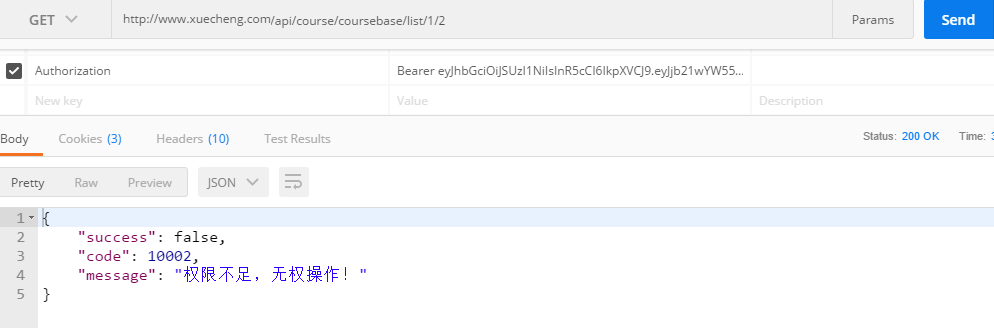

## 2.5  小结

方法授权步骤：

1. ResourceServerConfig类上添加注解，如下：

```java
//激活方法上的PreAuthorize注解
@EnableGlobalMethodSecurity(prePostEnabled = true, securedEnabled = true)
```

2. 在方法添加授权注解

```java
@PreAuthorize("hasAuthority('???')")
```

3. 如果方法上不添加授权注解表示此方法不需要权限即可访问。

# 3. 动态查询用户权限

## 3.1 需求分析

截至目前在测试授权时使用的权限数据是静态数据，正常情况的流程是：

1. 管理员给用户分配权限，权限数据写到数据库中。
2. 认证服务在进行用户认证时从数据库读取用户的权限数据（动态数据）

本节实现动态权限数据。

## 3.2 权限数据模型

### 3.2.1 数据模型结构

打开xc_user数据库，找到下边的表：

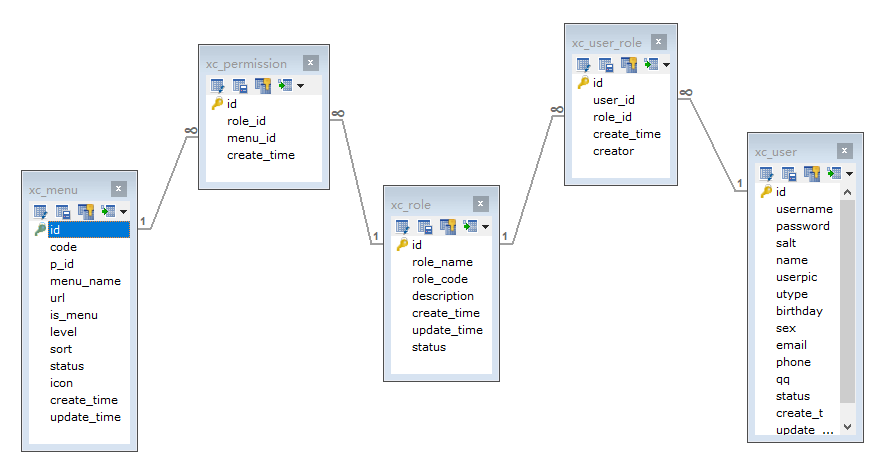

xc_user：用户表，存储了系统用户信息，用户类型包括：学生、老师、管理员等

xc_role：角色表，存储了系统的角色信息，学生、老师、教学管理员、系统管理员等。

xc_user_role：用户角色表，一个用户可拥有多个角色，一个角色可被多个用户所拥有

xc_menu:模块表，记录了菜单及菜单下的权限

xc_permission:角色权限表，一个角色可拥有多个权限，一个权限可被多个角色所拥有

### 3.2.2 数据模型的使用

本项目教学阶段不再实现权限定义及用户权限分配的功能，但是基于权限数据模型（5张数据表）及现有数据，要求学生在数据库中操作完成给用户分配权限、查询用户权限等需求。

1. 查询用户所拥有的权限

   步骤：

   ​	确定用户的id

   ​	查询用户所拥有的角色

   ​	查询用户所拥有的权限

   例子：

```sql
 SELECT * FROM xc_menu WHERE id IN(
	SELECT menu_id FROM xc_permission WHERE role_id IN(    
		SELECT role_id FROM xc_user_role WHERE user_id = '49'        
	)    
)
```

2. 给用户分配权限

   2.1 向已拥有角色分配权限

    	步骤：

   ​		确定用户的id

   ​		确定权限的id

   ​		确定用户的角色

   ​		向角色权限表添加记录

3. 添加角色给用户分配权限 

   ​	步骤：

   ​		确定用户的id

   ​		确定权限的id

   ​		添加角色

   ​		向角色权限表添加记录

   ​		向用户角色关系表添加记录

## 3.3 用户中心查询用户权限

### 3.3.1 需求分析

认证服务请求用户中心查询用户信息，用户需要将用户基本信息和用户权限一同返回给认证服务。

本小节实现用户查询查询用户权限，并将用户权限信息添加到的用户信息中返回给认证服务。

以上需求需要修改如下接口：

```java
@GetMapping("/getuserext")
public XcUserExt getUserext(@RequestParam("username") String username);
```

### 3.3.2 DAO

在用户中心服务中编写dao，实现根据用户id查询权限。

1. 定义XcMenuMapper.java

   在com.xuecheng.ucenter.dao包下定义：

```java
@Mapper
public interface XcMenuMapper {
    public List<XcMenu> selectPermissionByUserId(String userid);
}
```

2. XcMenuMapper.xml

   在com.xuecheng.ucenter.dao下定义XcMenuMapper.xml

```xml
<?xml version="1.0" encoding="UTF‐8" ?>
<!DOCTYPE mapper PUBLIC "‐//mybatis.org//DTD Mapper 3.0//EN" "http://mybatis.org/dtd/mybatis‐3‐mapper.dtd" >
<mapper namespace="com.xuecheng.ucenter.dao.XcMenuMapper" >
      <select id="selectPermissionByUserId"
resultType="com.xuecheng.framework.domain.ucenter.XcMenu" parameterType="java.lang.String" >
        SELECT
        id,
        CODE,
        p_id pId,
        menu_name menuName,
        url,
        is_menu isMenu,
        LEVEL,
        sort,
        STATUS,
        icon,
        create_time createTime,
        update_time updateTiem
        FROM
        xc_menu
        WHERE id IN(
          SELECT menu_id FROM xc_permission WHERE role_id IN(
            SELECT role_id FROM xc_user_role WHERE user_id = #{id}
          )
        )
    </select>
</mapper>
```

其它Dao采用spring data 编写如下：

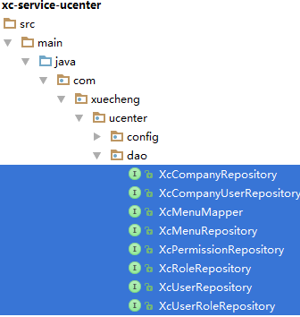

### 3.3.3 Service

修改UserService的getUserExt方法，查询用户权限。

```java
//根据账号查询用户的信息，返回用户扩展信息
public XcUserExt getUserExt(String username){
    XcUser xcUser = this.findXcUserByUsername(username);
    if(xcUser == null){
        return null;
    }
    //根据用户id查询用户权限
    String userId = xcUser.getId();
    List<XcMenu> xcMenus = xcMenuMapper.selectPermissionByUserId(userId);
    XcUserExt xcUserExt = new XcUserExt();
    BeanUtils.copyProperties(xcUser,xcUserExt);
    //用户的权限
    xcUserExt.setPermissions(xcMenus);
    return xcUserExt;
}
```

## 3.4  认证服务查询用户权限

修改认证服务的UserDetailServiceImpl，查询用户的权限，并拼接权限串，将原来硬编码权限代码删除，代码如下：

```java
 ......
 //请求ucenter查询用户
  XcUserExt userext = userClient.getUserext(username);
  if(userext == null){
      //返回NULL表示用户不存在，Spring Security会抛出异常
      return null;
  }
  //从数据库查询用户正确的密码，Spring Security会去比对输入密码的正确性
  String password = userext.getPassword();
  //指定用户的权限，这里暂时硬编码
  List<String> permissionList = new ArrayList<>();
//permissionList.add("course_get_baseinfo");
//permissionList.add("course_find_pic");
  //取出用户权限
  List<XcMenu> permissions = userext.getPermissions();
  for(XcMenu xcMenu:permissions){
      permissionList.add(xcMenu.getCode());
  }
  ......
```

## 3.5  测试

1. 执行登录，在redis中查看jwt令牌，使用jwt测试程序解析jwt令牌中是否包括用户的权限 。
2. 使用新的jwt令牌测试方法授权
3. 给用户分配新权限，重新生成jwt令牌，测试授权

# 4. 前端集成认证授权

## 4.1  需求分析

截至目前认证授权服务端的功能已基本完成，本章实现前端集成认证授权功能。

前端集成认证授权功能需要作如下工作：

1. 前端页面校验用户的身份，如果用户没有登录则跳转到登录页面
2. 前端请求资源服务需要在http header中添加jwt令牌，资源服务根据jwt令牌完成授权。

哪些功能需要前端请求时携带JWT？

用户登录成功请求资源服务都需要携带jwt令牌，因为资源服务已经实现了jwt认证，如果校验头部没有jwt则会认为身份不合法。

## 4.2 教学管理中心

本节实现教学管理中心实现身份校验，其它前端参考教学管理中心实现。

### 4.2.1  配置虚拟主机

教学管理前端访问微服务统一在访问地址前添加/api前缀并经过网关转发到微服务。

配置teacher.xuecheng.com虚拟主机。

```nginx
#前端教学管理
upstream teacher_server_pool{
	server 127.0.0.1:12000 weight=10;    
}
#文件服务
upstream filesystem_server_pool{
	server 127.0.0.1:22100 weight=10;    
}
#媒资服务
upstream media_server_pool{
	server 127.0.0.1:31400 weight=10;    
}
#学成网教学管理中心
server {
	listen       80;    
	server_name teacher.xuecheng.com;    
	#个人中心    
	location / {      
		proxy_pass http://teacher_server_pool;          
	}     
	location /api {      
    	proxy_pass http://api_server_pool;          
	}    
	location /filesystem {      
		proxy_pass http://filesystem_server_pool;          
	}    
	#媒资管理    
	location ^~ /api/media/ {      
		proxy_pass http://media_server_pool/media/;          
	}     
	#认证    
	location ^~ /openapi/auth/ {      
		proxy_pass http://auth_server_pool/auth/;          
	}     
}
```

### 4.2.2 身份校验

教学管理中心是单页面应用，我们在路由变化时校验用户的身份，校验失败将跳转到登录页面。

校验方法如下：

1. 如果成功从sessionStorage和cookie获取当前用户则继续访问
2. 如果sessionStorage中无当前用户，cookie中有当前用户则请求服务端获取jwt，如果成功则继续访问。
3. 以上两种情况都不满足则跳转到登录页面。

在main.js中添加路由监控代码，如下：

```javascript
router.beforeEach((to, from, next) => {
  if(openAuthenticate){
    // console.log(to)
    // console.log(from)
    //***********身份校验***************
    let activeUser
    let uid
    try{
      activeUser = utilApi.getActiveUser()
      uid = utilApi.getCookie("uid")
    }catch(e){
      //alert(e)
    }
    if(activeUser && uid && uid == activeUser.uid) {
      next();
    }else if(to.path =='/login' || to.path =='/logout'){
      next();
    }else if(uid){
      //请求获取jwt
      systemApi.getjwt().then((res)=>{
        if(res.success){
          let jwt = res.jwt;
          let activeUser = utilApi.getUserInfoFromJwt(jwt)
          if(activeUser){
            utilApi.setUserSession("activeUser",JSON.stringify(activeUser))
          }
          next();
        }else{
          //跳转到统一登陆
          window.location = "http://ucenter.xuecheng.com/#/login?returnUrl="+
Base64.encode(window.location)
        }
      })
    }else{
      //跳转到统一登陆
      window.location = "http://ucenter.xuecheng.com/#/login?returnUrl="+
Base64.encode(window.location)
    }
  }else{
    next();
  }
});
```

2. 在base/api/system.js中添加getjwt方法

```javascript
/*获取jwt令牌*/
export const getjwt= () => {
  return http.requestQuickGet('/openapi/auth/userjwt')
}
```

3. 在utils.js中添加 如下方法

```javascript
getActiveUser: function(){
    let uid = this.getCookie("uid")
    if(uid){
      let activeUserStr = this.getUserSession("activeUser");
      return JSON.parse(activeUserStr);
    }else{
      this.delUserSession("activeUser")
    }
  },
//获取jwt令牌
  getJwt : function(){
    let activeUser = this.getActiveUser()
    if(activeUser){
      return activeUser.jwt
    }
  },
  //解析jwt令牌，获取用户信息
  getUserInfoFromJwt : function (jwt) {
    if(!jwt){
      return ;
    }
    var jwtDecodeVal = jwtDecode(jwt);
    if (!jwtDecodeVal) {
      return ;
    }
    let activeUser={}
    //console.log(jwtDecodeVal)
    activeUser.utype = jwtDecodeVal.utype || '';
    activeUser.username = jwtDecodeVal.name || '';
    activeUser.userpic = jwtDecodeVal.userpic || '';
    activeUser.userid = jwtDecodeVal.userid || '';
    activeUser.authorities = jwtDecodeVal.authorities || '';
    activeUser.uid = jwtDecodeVal.jti || '';
    activeUser.jwt = jwt;
    return activeUser;
  },
```

4. 测试

   启动学习中心前端、教学管理前端、认证服务、用户中心服务、网关、Eureka

   a. 进入首页

   b. 点击“教学提供方”，此时由于没有登录自动跳转到登录页面

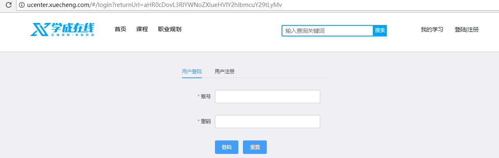

​	c. 输入账号和密码登录

​	登录成功，跳转到教学管理页面

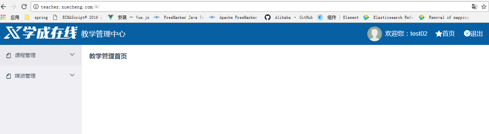

### 4.2.3 携带JWT授权

1. 前端携带JWT请求

   根据需求，在使用axios进行http请求前向header中加入jwt令牌

   在main.js中添加

```javascript
import axios from 'axios'
// 添加请求拦截器
axios.interceptors.request.use(function (config) {
  // 在发送请求向header添加jwt
  let jwt = utilApi.getJwt()
  if(jwt){
    config.headers['Authorization'] = 'Bearer '+jwt
  }
  return config;
}, function (error) {
  return Promise.reject(error);
});
```

2. 测试http请求是否携带jwt

   进入教学管理中心，点击我的课程，观察request header中是否有Authorization信息

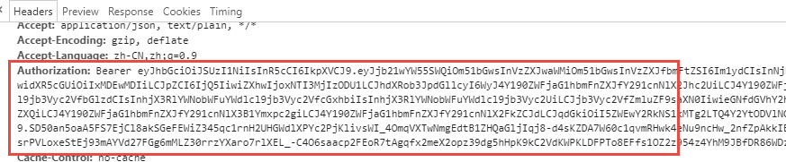

3. 测试授权效果

   当访问一个没有权限的方法时是否报错？

   测试方法：

   在课程计划查询方法上添加授权注解，表示当前用户需要拥有course_teachplan_list权限方可正常访问。

```java
@PreAuthorize("hasAuthority('course_teachplan_list')")
@Override
public TeachplanNode findTeachplanList(@PathVariable("courseId") String courseId) {
    return courseService.findTeachplanList(courseId);
}
```

​	进入我的课程，点击课程计划，观察响应结果为 10002错误。

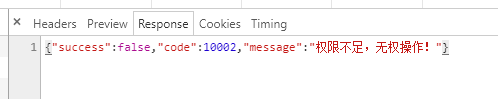

4. 提示权限不足

   当权限不足首页要给出提示，实现思路是使用axios的拦截，在执行后校验响应结果，如果是10002代码的错误则提示用户“权限不足”，如果是10001代码则强制登录。

   在main.js中添加

```javascript
// 响应拦截
axios.interceptors.response.use(data => {
  console.log("data=")
  console.log(data)
  if(data && data.data){
    if(data.data.code && data.data.code =='10001'){
      //需要登录
       window.location = "http://ucenter.xuecheng.com/#/login?returnUrl="+
Base64.encode(window.location)
    }else if(data.data.code && data.data.code =='10002'){
      Message.error('您没有此操作的权限，请与客服联系！');
    }
     }
  return data
})
```

测试：

执行一个没有权限的操作，提示如下：

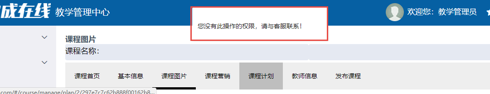

# 5. 细粒度授权

## 5.1 需求分析

什么是细粒度授权？

细粒度授权也叫数据范围授权，即不同的用户所拥有的操作权限相同，但是能够操作的数据范围是不一样的。

例子：用户A和用户B都是教学机构，他们都拥有“我的课程”权限，但是两个用户所查询到的数据是不一样的。

本项目有哪些细粒度授权？

比如：

​	我的课程，教学机构只允许查询本教学机构下的课程信息。

​	我的选课，学生只允许查询自己所选课。

如何实现细粒度授权？	

​	细粒度授权涉及到不同的业务逻辑，通常在service层实现，根据不同的用户进行校验，根据不同的参数查询不同的数据或操作不同的数据。

## 5.2 我的课程细粒度授权

### 5.2.1 需求分析

1. 我的课程查询，细粒度授权过程如下：

   获取当前登录的用户Id

   得到用户所属教育机构的Id

   查询该教学机构下的课程信息

   最终实现了用户只允许查询自己机构的课程信息。

2. 修改课程管理服务“我的课程”的功能，根据公司Id查询课程，思路如下：

   修改Dao，支持根据公司Id 查询课程。

   修改Service，将公司Id传入Dao。

   修改Controller，获取当前用户的公司Id，传给Service。

3. 数据模型分析如下：

   课程表

   在xc_course数据库的course_base 表中添加company_id字段，来表示此课程的归属

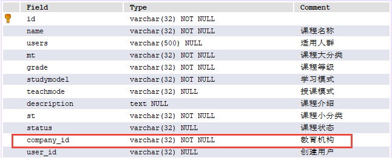

4. 用户企业表

   在xc_user数据库的xc_company_user表中记录了用户的归属公司信息

   

   通过xc_company_user表可得到用户的所属公司Id。

   如何查询某个用户的课程？

   1. 确定用户的Id
   2. 根据用户的Id查询用户归属的公司。
   3. 根据公司Id查询该公司下的课程信息

   一个例子：

   ```sql
   /*确定用户的id：49*/
   /*根据用户Id查找所属公司*/
   SELECT  company_id FROM xc_user.xc_company_user WHERE user_id = '49'
   /*根据公司查询所拥有的课程*/
   SELECT * FROM  xc_course.course_base WHERE company_id = '1'
   ```

### 5.2.2 Api

定义我的课程查询接口如下：

```java
public QueryResponseResult<CourseInfo> findCourseList(int page,
                      int size,
                      CourseListRequest courseListRequest);
```

### 5.2.3 Dao

修改 CourseMapper.xml的查询课程列表，添加companyId条件。

```xml
<select id="findCourseListPage" resultType="com.xuecheng.framework
                                            .domain.course.ext.CourseInfo"
        parameterType="com.xuecheng.framework.domain.course.request.CourseListRequest">
    SELECT
    course_base.*,
    (SELECT pic FROM course_pic WHERE courseid = course_base.id) pic
    FROM
    course_base
    where 1=1
    <if test="companyId!=null and companyId!=''">
      and course_base.company_id = #{companyId}
    </if>
</select>
```

### 5.2.4 Service

修改CourseService的findCourseList方法，添加companyId参数，并且传给dao.

```java
public QueryResult<CourseInfo> findCourseList(String companyId,int page,int
size,CourseListRequest courseListRequest) {
    if(courseListRequest == null){
        courseListRequest = new CourseListRequest();
    }
    //企业id
    courseListRequest.setCompanyId(companyId);
    //将companyId传给dao
    courseListRequest.setCompanyId(companyId);
    if(page<=0){
        page = 0;
    }
    if(size<=0){
        size = 20;
    }
    PageHelper.startPage(page, size);
    Page<CourseInfo> courseListPage = courseMapper.findCourseListPage(courseListRequest);
    List<CourseInfo> list = courseListPage.getResult();
    long total = courseListPage.getTotal();
    QueryResult<CourseInfo> courseIncfoQueryResult = new QueryResult<CourseInfo>();
    courseIncfoQueryResult.setList(list);
    courseIncfoQueryResult.setTotal(total);
    return courseIncfoQueryResult;
}    
```

### 5.2.5 Controller

修改CourseController的findCourseList，向service传入companyId

这里先使用静态数据测试使用。

```java
@Override
@GetMapping("/coursebase/list/{page}/{size}")
 public QueryResult<CourseInfo> findCourseList(@PathVariable("page") int page,
                                               @PathVariable("size") int size,
                                               CourseListRequest courseListRequest) {
     //先使用静态数据测试
     String companyId = "1";
     return courseService.findCourseList(companyId,page,size,courseListRequest);
 }
```

### 5.2.6 测试

1. 用户登录

   由于使用了静态数据companyId为1，所以要使用企业编号为1的下边的用户去登录。

2. 进入我的课程，查看数据是否正确。

   观察所查询到的课程是该企业下的课程。

## 5.3 获取当前用户信息

### 5.3.1 需求分析

要想实现只查询自己的课程信息则需要获取当前用户所属的企业id。

1. 认证服务在用户认证通过将用户所属公司id等信息存储到jwt令牌中。
2. 用户请求到达资源服务后，资源服务需要取出header中的jwt令牌，并解析出用户信息。

### 5.3.2 jwt令牌包括企业Id

资源服务在授权时需要用到用户所属企业ID，需要实现认证服务生成的JWT令牌中包括用户所属公司id信息。

查看认证服务UserDetailServiceImpl代码如下：

```java
......
//用户id
userDetails.setId(userext.getId());
//用户名称
userDetails.setName(userext.getName());
//用户头像
userDetails.setUserpic(userext.getUserpic());
//用户类型
userDetails.setUtype(userext.getUtype());
//用户所属企业id
userDetails.setCompanyId(userext.getCompanyId());
return userDetails;
......
```

通过上边代码的分析得知，认证服务调用XcUserExt userext = userClient.getUserext(username);获取用户信息，将userext 中的信息存储到jwt令牌中，在userext 对象中已经包括了companyId公司ID等信息。

### 5.3.3 获取当前用户

#### 5.3.3.1 JWT解析工具类

1. 在Oauth2Util工具类中，从header中取出JWT令牌，并解析JWT令牌的内容。

```java
public class Oauth2Util {
    public static Map<String,String> getJwtClaimsFromHeader(HttpServletRequest request) {
        if (request == null) {
            return null;
        }
        //取出头信息
        String authorization = request.getHeader("Authorization");
        if (StringUtils.isEmpty(authorization) || authorization.indexOf("Bearer") < 0) {
            return null;
        }
        //从Bearer 后边开始取出token
        String token = authorization.substring(7);
        Map<String,String> map = null;
        try {
            //解析jwt
            Jwt decode = JwtHelper.decode(token);
            //得到 jwt中的用户信息
            String claims = decode.getClaims();
            //将jwt转为Map
            map = JSON.parseObject(claims, Map.class);
        } catch (Exception e) {
            e.printStackTrace();
        }
        return map;
    }
}
```

2. 在XcOauth2Util工具类中，将解析的JWT内容封装成UserJwt对象返回。

```java
public class XcOauth2Util {
    public UserJwt getUserJwtFromHeader(HttpServletRequest request){
        Map<String, String> jwtClaims = Oauth2Util.getJwtClaimsFromHeader(request);
        if(jwtClaims == null || StringUtils.isEmpty(jwtClaims.get("id"))){
            return null;
        }
        UserJwt userJwt = new UserJwt();
        userJwt.setId(jwtClaims.get("id"));
        userJwt.setName(jwtClaims.get("name"));
        userJwt.setCompanyId(jwtClaims.get("companyId"));
        userJwt.setUtype(jwtClaims.get("utype"));
        userJwt.setUserpic(jwtClaims.get("userpic"));
        return userJwt;
    }
    @Data
    public class UserJwt{
        private String id;
        private String name;
        private String userpic;
        private String utype;
        private String companyId;
    }
}
```

#### 5.3.3.2 获取当前用户

修改课程管理的CourseController类，将companyId的静态数据改为动态获取：

```java
@Override
public QueryResult<CourseInfo> findCourseList(@PathVariable("page") int page,
                                              @PathVariable("size") int size,
                                              CourseListRequest courseListRequest) {
    //调用工具类取出用户信息
    XcOauth2Util xcOauth2Util = new XcOauth2Util();
    XcOauth2Util.UserJwt userJwt = xcOauth2Util.getUserJwtFromHeader(request);
    if(userJwt == null){
        ExceptionCast.cast(CommonCode.UNAUTHENTICATED);
    }
    String companyId = userJwt.getCompanyId();
    return courseService.findCourseList(companyId,page,size,courseListRequest);
}
```

### 5.3.4 测试

使用不同的用户登录系统，测试细粒度权限控制效果。

预期结果：每个用户只查询自己所拥有的课程。

# 6. 微服务之间认证

## 6.1  需求分析

前边章节已经实现了用户携带身份令牌和JWT令牌访问微服务，微服务获取jwt并完成授权。

并完成授权。

测试课程预览：

1. 将课程管理服务和CMS全部添加授权配置
2. 用户登录教学管理前端，进入课程发布界面，点击课程发布，观察课程管理服务端报错如下：

```java
feign.FeignException: status 401 reading CmsPageClient#save(CmsPage); content:
{"error":"unauthorized","error_description":"Full authentication is required to access this
resource"}
```

分析原因：

由于课程管理访问CMS时没有携带JWT令牌导致。

解决方案：

微服务之间进行调用时需携带JWT。

## 6.2 Feign  拦截器

###6.2.1 定义Feign拦截器

微服务之间使用feign进行远程调用，采用feign拦截器实现远程调用携带JWT。

在common工程添加依赖：

```xml
<dependency>
    <groupId>org.springframework.cloud</groupId>
    <artifactId>spring‐cloud‐starter‐openfeign</artifactId>
</dependency>
```

在Common工程定义拦截器如下：

```java
package com.xuecheng.framework.interceptor;
public class FeignClientInterceptor implements RequestInterceptor {
    @Override
    public void apply(RequestTemplate requestTemplate) {
        try {
            //使用RequestContextHolder工具获取request相关变量
            ServletRequestAttributes attributes = (ServletRequestAttributes)
RequestContextHolder.getRequestAttributes();
            if(attributes!=null){
                //取出request
                HttpServletRequest request = attributes.getRequest();
                Enumeration<String> headerNames = request.getHeaderNames();
                if (headerNames != null) {
                    while (headerNames.hasMoreElements()) {
                        String name = headerNames.nextElement();
                        String values = request.getHeader(name);
                        if(name.equals("authorization")){
                            //System.out.println("name="+name+"values="+values);
                            requestTemplate.header(name, values);
                        }
                    }
                }
            }
        }catch (Exception e) {
            e.printStackTrace();
        }
    }
}
```

### 6.2.2 使用Feign拦截器

本例子中课程管理调用cms需要携带jwt，所以需要在课程管理中定义Feign拦截器bean，在启动类中定义bean如下：

```java
@Bean 
public FeignClientInterceptor feignClientInterceptor(){
    return new FeignClientInterceptor();
}
```

### 6.2.3 测试

执行课程发布，提示发布成功。