# 1. 订单与选课需求分析

## 1.1 订单支付流程

学成在线的课程分为免费和收费两种。对于收费课程，用户需提交订单并完成支付方可在线学习。

提交订单及支付流程如下：

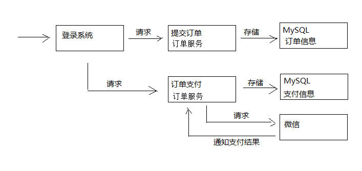

1. 用户提交订单需要先登录系统
2. 提交订单，订单信息保存到订单数据库
3. 订单支付，调用微信支付接口完成支付
4. 完成支付，微信支付系统通知学成在线支付结果
5. 学成在线接收到支付结果通知，更新支付结果

提交订单流程：

1. 用户进入课程详情页面
2. 点击“立即购买”，打开订单确认信息


3. 点击“确认无误，提交订单”

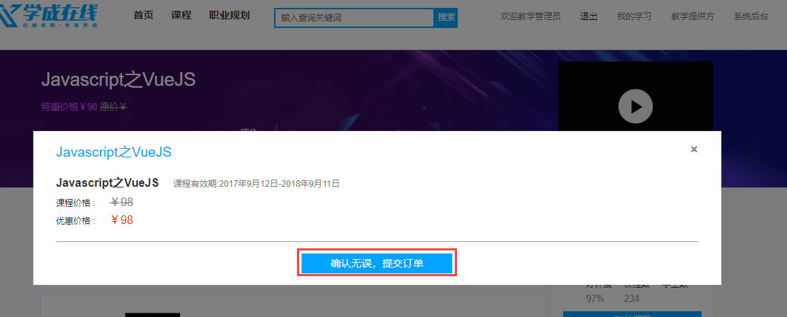

订单提交成功，向订单数据库的xc_orders订单表保存一条记录，向xc_orders_detail订单明细表保存一条或多条记录，向订单支付表插入一条记录。

4. 订单提交成功自动进入订单支付页面

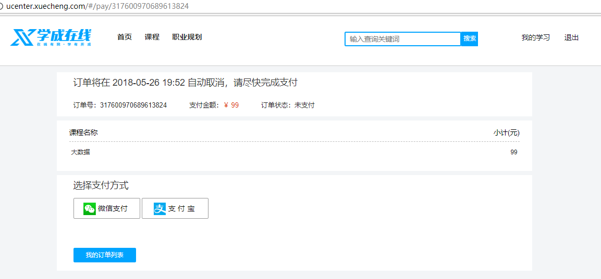

5. 点击“微信支付”打开二维码

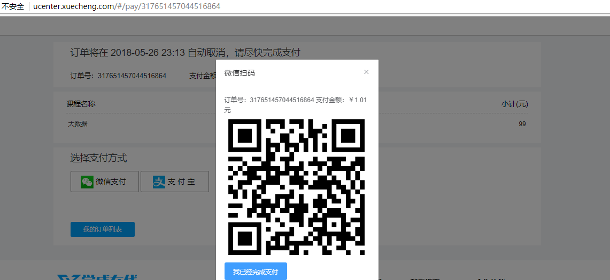

6. 用手机扫码支付，支付完成，点击“完成支付”

   支付完成，收到微信支付系统的支付完成通知或请求微信查询支付已完成，更新学成在线订单支付表中的支付状态字段。

## 1.2 自动选课需求

支付成功即完成订单，订单完成之后系统需自动添加选课。

下图是微信支付、学成在线订单服务、学成在线学习服务交互图：

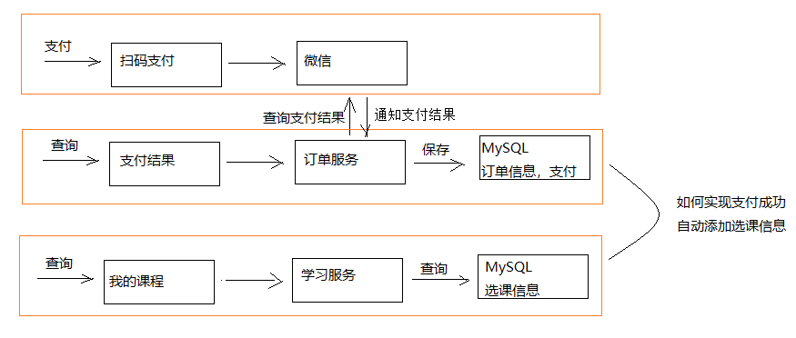

1. 用户支付完成，微信支付系统会主动通知学成在线支付结果，学成在线也可主动请求微信支付查询订单的支付结果。

   最终得到支付结果后将订单支付结果保存到订单数据库中。

2. 订单支付完成系统自动向选课表添加学生选课记录。
3. 选课记录添加完成学习即可在线开始学习。

# 2. 分布式事务

## 2.1 问题描述

根据上边的自动选课的需求，分析如下：

用户支付完成会将支付状态及订单状态保存在订单数据库中，由订单服务去维护订单数据库。而学生选课信息在学习中心数据库，由学习服务去维护学习中心数据库的信息。下图是系统结构图：

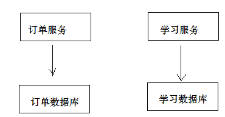

如何实现两个分布式服务（订单服务、学习服务）共同完成一件事即订单支付成功自动添加学生选课的需求，这里的关键是如何保证两个分布式服务的事务的一致性。

尝试解决上边的需求，在订单服务中远程调用选课接口，伪代码如下：

```java
订单支付结果通知方法｛
	更新支付表中支付状态为“成功”。
	远程调用选课接口添加选课记录。    
｝
```

上边的逻辑说明：

1. 更新支付表状态为本地数据库操作。
2. 远程调用选课接口为网络远程调用请求。
3. 为保存事务上边两步操作由spring控制事务，当遇到Exception异常则回滚本地数据库操作。

问题如下：

1. 如果更新支付表失败则抛出异常，不再执行远程调用，此设想没有问题。
2. 如果更新支付表成功，网络远程调用超时会拉长本地数据库事务时间，影响数据库性能。
3. 如果更新支付表成功，远程调用添加选课成功（选课数据库commit成功），最后更新支付表commit失败，此时出现操作不一致。

上边的问题涉及到分布式事务控制。

## 2.2 什么是分布式事务

1. 什么是分布式系统？

   部署在不同结点上的系统通过网络交互来完成协同工作的系统。

   比如：充值加积分的业务，用户在充值系统向自己的账户充钱，在积分系统中自己积分相应的增加。充值系统和积分系统是两个不同的系统，一次充值加积分的业务就需要这两个系统协同工作来完成。

2. 什么是事务？

   事务是指由一组操作组成的一个工作单元，这个工作单元具有原子性（atomicity）、一致性（consistency）、隔离性（isolation）和持久性（durability）。

   **原子性：**执行单元中的操作要么全部执行成功，要么全部失败。如果有一部分成功一部分失败那么成功的操作要全部回滚到执行前的状态。

   **一致性：**执行一次事务会使用数据从一个正确的状态转换到另一个正确的状态，执行前后数据都是完整的。

   **隔离性：**在该事务执行的过程中，任何数据的改变只存在于该事务之中，对外界没有影响，事务与事务之间是完全的隔离的。只有事务提交后其它事务才可以查询到最新的数据。

   **持久性：**事务完成后对数据的改变会永久性的存储起来，即使发生断电宕机数据依然在。

3. 什么是本地事务？

   本地事务就是用关系数据库来控制事务，关系数据库通常都具有ACID特性，传统的单体应用通常会将数据全部存储在一个数据库中，会借助关系数据库来完成事务控制。

4. 什么是分布式事务？

   在分布式系统中一次操作由多个系统协同完成，这种一次事务操作涉及多个系统通过网络协同完成的过程称为分布式事务。这里强调的是多个系统通过网络协同完成一个事务的过程，并不强调多个系统访问了不同的数据库，即使多个系统访问的是同一个数据库也是分布式事务，如下图：

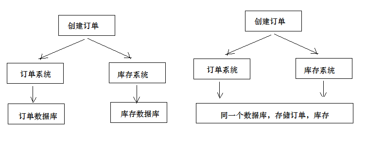

另外一种分布式事务的表现是，一个应用程序使用了多个数据源连接了不同的数据库，当一次事务需要操作多个数据源，此时也属于分布式事务，当系统作了数据库拆分后会出现此种情况。

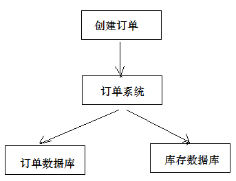

上面两种分布式事务表现形式以第一种据多。

5. 分布式事务有哪些场景？

   * 电商系统中的下单扣库存

     电商系统中，订单系统和库存系统是两个系统，一次下单的操作由两个系统协同完成

   * 金融系统中的银行卡充值

     在金融系统中通过银行卡向平台充值需要通过银行系统和金融系统协同完成。

   * 教育系统中下单选课业务

     在线教育系统中，用户购买课程，下单支付成功后学生选课成功，此事务由订单系统和选课系统协同完成。

   *  SNS系统的消息发送

     在社交系统中发送站内消息同时发送手机短信，一次消息发送由站内消息系统和手机通信系统协同完成。

## 2.3 CAP 理论

如何进行分布式事务控制？CAP理论是分布式事务处理的理论基础，了解了CAP理论有助于我们研究分布式事务的处理方案。

CAP理论是：分布式系统在设计时只能在一致性(Consistency)、可用性(Availability)、分区容忍性(PartitionTolerance)中满足两种，无法兼顾三种。

通过下图理解CAP理论：

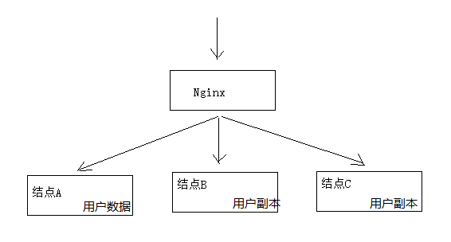

**一致性(Consistency)：**服务A、B、C三个结点都存储了用户数据， 三个结点的数据需要保持同一时刻数据一致性。

**可用性(Availability)：**服务A、B、C三个结点，其中一个结点宕机不影响整个集群对外提供服务，如果只有服务A结点，当服务A宕机整个系统将无法提供服务，增加服务B、C是为了保证系统的可用性。

**分区容忍性(Partition Tolerance)：**分区容忍性就是允许系统通过网络协同工作，分区容忍性要解决由于网络分区导致数据的不完整及无法访问等问题。

分布式系统不可避免的出现了多个系统通过网络协同工作的场景，结点之间难免会出现网络中断、网延延迟等现象，这种现象一旦出现就导致数据被分散在不同的结点上，这就是网络分区。

**分布式系统能否兼顾C、A、P？**

在保证分区容忍性的前提下一致性和可用性无法兼顾，如果要提高系统的可用性就要增加多个结点，如果要保证数据的一致性就要实现每个结点的数据一致，结点越多可用性越好，但是数据一致性越差。

所以，在进行分布式系统设计时，同时满足“一致性”、“可用性”和“分区容忍性”三者是几乎不可能的。

**CAP有哪些组合方式？**

1. CA：放弃分区容忍性，加强一致性和可用性，关系数据库按照CA进行设计。

2. AP：放弃一致性，加强可用性和分区容忍性，追求最终一致性，很多NoSQL数据库按照AP进行设计。

   说明：这里放弃一致性是指放弃强一致性，强一致性就是写入成功立刻要查询出最新数据。追求最终一致性是指允许暂时的数据不一致，只要最终在用户接受的时间内数据 一致即可。

3. CP：放弃可用性，加强一致性和分区容忍性，一些强一致性要求的系统按CP进行设计，比如跨行转账，一次转账请求要等待双方银行系统都完成整个事务才算完成。

   说明：由于网络问题的存在CP系统可能会出现待等待超时，如果没有处理超时问题则整理系统会出现阻塞。

总结：

在分布式系统设计中AP的应用较多，即保证分区容忍性和可用性，牺牲数据的强一致性（写操作后立刻读取到最新数据），保证数据最终一致性。比如：订单退款，今日退款成功，明日账户到账，只要在预定的用户可以接受的时间内退款事务走完即可。

## 2.4 解决方案

### 2.4.1 两阶段提交协议(2PC)

为解决分布式系统的数据一致性问题出现了两阶段提交协议（2 Phase Commitment Protocol），两阶段提交由协调者和参与者组成，共经过两个阶段和三个操作，部分关系数据库如Oracle、MySQL支持两阶段提交协议，本节讲解关系数据库两阶段提交协议。

参考：https://en.wikipedia.org/wiki/Two-phase_commit_protocol

2PC协议流程图：

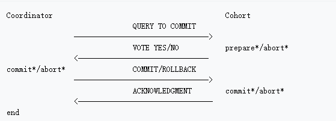

1. 第一阶段：准备阶段（prepare）

   协调者通知参与者准备提交订单，参与者开始投票。

   协调者完成准备工作向协调者回应Yes。

2. 第二阶段：提交(commit)/回滚(rollback)阶段

   协调者根据参与者的投票结果发起最终的提交指令。

   如果有参与者没有准备好则发起回滚指令。

一个下单减库存的例子：

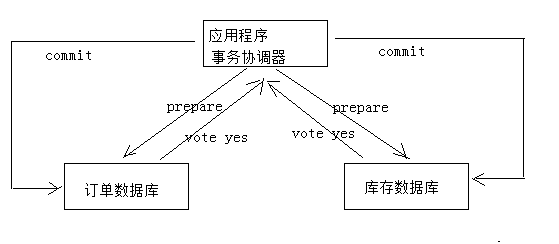

1. 应用程序连接两个数据源。
2. 应用程序通过事务协调器向两个库发起prepare，两个数据库收到消息分别执行本地事务（记录日志），但不提交，如果执行成功则回复yes，否则回复no。
3. 事务协调器收到回复，只要有一方回复no则分别向参与者发起回滚事务，参与者开始回滚事务。
4. 事务协调器收到回复，全部回复yes，此时向参与者发起提交事务。如果参与者有一方提交事务失败则由事务协调器发起回滚事务。

2PC的优点：实现强一致性，部分关系数据库支持（Oracle、MySQL等）。

2PC的缺点：整个事务的执行需要由协调者在多个节点之间去协调，增加了事务的执行时间，性能低下。

解决方案有：springboot+Atomikos or  Bitronix

3PC主要是解决协调者与参与者通信阻塞问题而产生的，它比2PC传递的消息还要多，性能不高。

详细参考3PC：https://en.wikipedia.org/wiki/Three-phase_commit_protocol

### 2.4.2 事务补偿（TCC）

TCC事务补偿是基于2PC实现的业务层事务控制方案，它是Try、Confirm和Cancel三个单词的首字母，含义如下：

1. Try 检查及预留业务资源

   完成提交事务前的检查，并预留好资源。

2. Confirm 确定执行业务操作
   对try阶段预留的资源正式执行。
3. Cancel 取消执行业务操作
   对try阶段预留的资源释放。

下边用一个下单减库存的业务为例来说明：

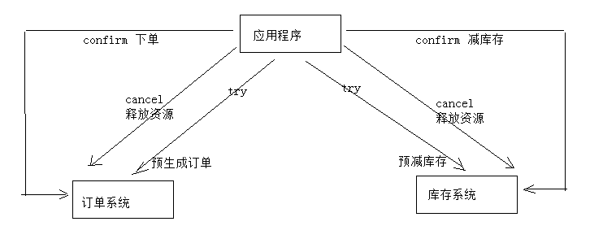

1. Try

   下单业务由订单服务和库存服务协同完成，在try阶段订单服务和库存服务完成检查和预留资源。

   订单服务检查当前是否满足提交订单的条件（比如：当前存在未完成订单的不允许提交新订单）。

   库存服务检查当前是否有充足的库存，并锁定资源。

2. Confirm

   订单服务和库存服务成功完成Try后开始正式执行资源操作。

   订单服务向订单写一条订单信息。

   库存服务减去库存。

3. Cancel

   如果订单服务和库存服务有一方出现失败则全部取消操作。

   订单服务需要删除新增的订单信息。

   库存服务将减去的库存再还原。

优点：最终保证数据的一致性，在业务层实现事务控制，灵活性好。

缺点：开发成本高，每个事务操作每个参与者都需要实现try/confirm/cancel三个接口。

注意：TCC的try/confirm/cancel接口都要实现幂等性，在为在try、confirm、cancel失败后要不断重试。

**什么是幂等性？**

幂等性是指同一个操作无论请求多少次，其结果都相同。

幂等操作实现方式有：

1. 操作之前在业务方法进行判断如果执行过了就不再执行。
2. 缓存所有请求和处理的结果，已经处理的请求则直接返回结果。
3. 在数据库表中加一个状态字段（未处理，已处理），数据操作时判断未处理时再处理。

### 2.4.3 消息队列实现最终一致

本方案是将分布式事务拆分成多个本地事务来完成，并且由消息队列异步协调完成，如下图：

下边以下单减少库存为例来说明：

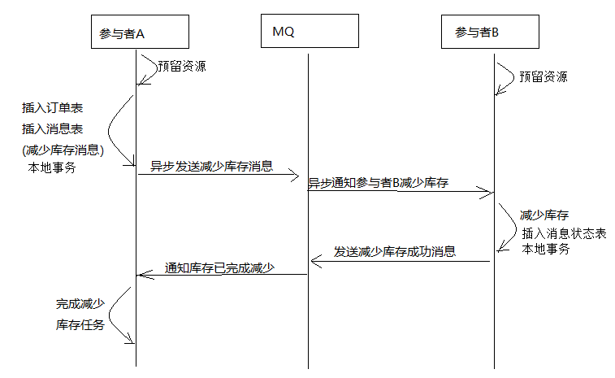

1. 订单服务和库存服务完成检查和预留资源。
2. 订单服务在本地事务中完成添加订单表记录和添加“减少库存任务消息”。
3. 由定时任务根据消息表的记录发送给MQ通知库存服务执行减库存操作。
4. 库存服务执行减少库存，并且记录执行消息状态（为避免重复执行消息，在执行减库存之前查询是否执行过此消息）。
5. 库存服务向MQ发送完成减少库存的消息。
6. 订单服务接收到完成库存减少的消息后删除原来添加的“减少库存任务消息”。

实现最终事务一致要求：预留资源成功理论上要求正式执行成功，如果执行失败会进行重试，要求业务执行方法实现幂等。

优点 ：

​	由MQ按异步的方式协调完成事务，性能较高。

​	不用实现try/confirm/cancel接口，开发成本比TCC低。

缺点：

​	此方式基于关系数据库本地事务来实现，会出现频繁读写数据库记录，浪费数据库资源，另外对于高并发操作不是最佳 

​	方案。

## 2.5 自动添加选课方案

### 2.5.1 搭建环境

根据自动选课需求，为了更好的分析解决方案，这里搭建订单工程及数据库。

#### 2.5.2.1 创建订单工程

导入资料下的xc-service-manage-order工程。

#### 2.5.2.2 创建订单数据库

1. 创建订单数据库xc_order（MySQL）

   导入xc_order.sql

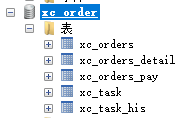

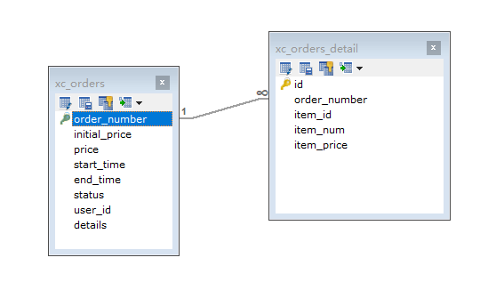

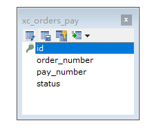

​	1.1 xc_orders：订单主表

​		记录订单的主要信息

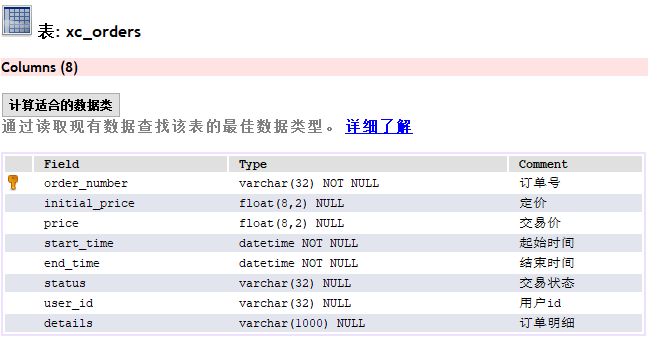

​	1.2 xc_orders_details：订单明细表

​		记录订单的明细信息

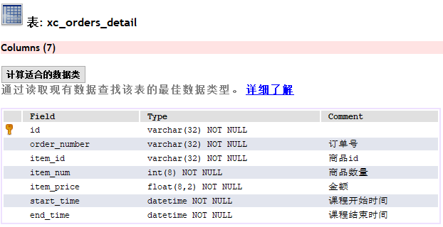

​	1.3 xc_orders_pay：订单支付表

​		记录订单的支付状态

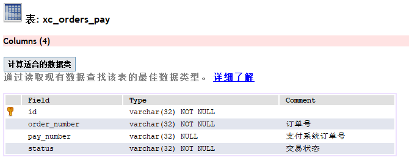

2. 向xc_order数据库导入xc_order_task.sql

   待处理任务表：

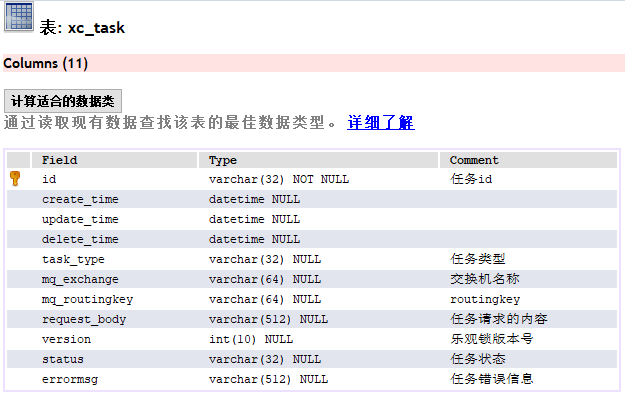

在任务表中包括了交换机的名称、路由key等信息为了是将任务的处理做成一个通用的功能。

考虑分布式系统并发读取任务处理任务的情况发生项目使用乐观锁的方式解决并发问题。

已完成任务表：

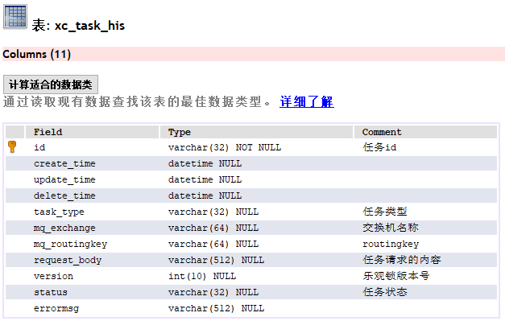

#### 2.5.2.3 创建选课数据库

创建xc_learning数据库，导入xc_learning.sql，xc_learning_course为学生选课表。

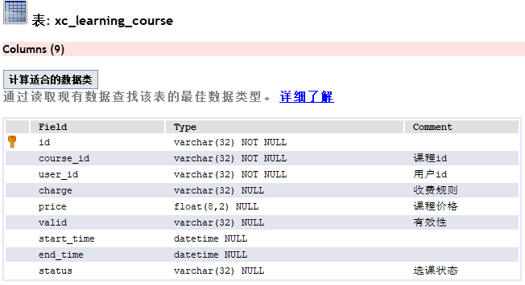

导入xc_task_his.sql，xc_task_his为历史任务表。

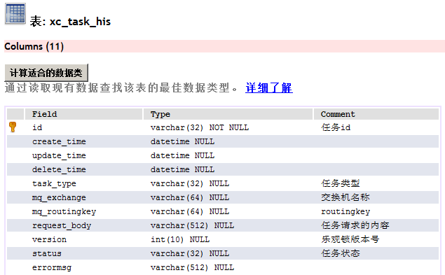

### 2.5.2 解决方案

本项目综合考虑选择基于消息的分布式事务解决方案，解决方案如下图：

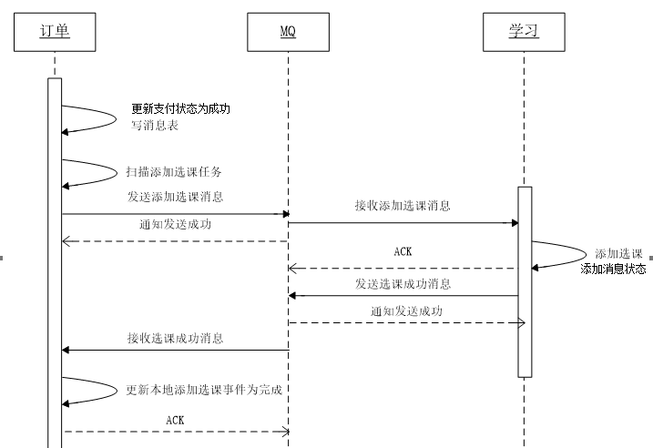

1. 支付成功后，订单服务向本地数据库更新订单状态并向消息表写入“添加选课消息”，通过本地数据库保证订单

   状态和添加选课消息的事务。

2. 定时任务扫描消息表，取出“添加选课任务“并发向MQ。

3. 学习服务接收到添加选课的消息，先查询本地数据库的历史消息表是否存在消息，存在则说明已经添加选课，否则向本地数据库添加选课，并向历史消息表添加选课消息。这里选课表和历史消息表在同一个数据库，通过本地事务保证。

4. 学习服务接收到添加选课的消息，通过查询消息表判断如果已经添加选课也向MQ发送“完成添加选课任务的消息”，否则则添加选课，完成后向MQ发送“完成添加选课任务的消息”

5. 订单服务接收到完成选课的消息后删除订单数据库中消息表的“添加选课消息”，为保证后期对账将消息表的消

   息先添加到历史消息表再删除消息，表示此消息已经完成。

# 3. Spring Task定时任务

## 3.1 需求分析

根据分布式事务的研究结果，订单服务需要定时扫描任务表向MQ发送任务。本节研究定时任务处理的方案，并实现定时任务扫描任务表并向MQ发送消息。

实现定时任务的方案如下：

1. 使用jdk的Timer和TimerTask实现

   可以实现简单的间隔执行任务，无法实现按日历去调度执行任务。

2. 使用Quartz实现

   Quartz 是一个异步任务调度框架，功能丰富，可以实现按日历调度。

3. 使用Spring Task实现

   Spring 3.0后提供Spring Task实现任务调度，支持按日历调度，相比Quartz功能稍简单，但是在开发基本够用，支持注解编程方式。

本项目使用Spring Task实现任务调度。

## 3.2 Spring Task 串行任务

在Spring boot启动类上添加注解：@EnableScheduling

新建任务测试类TestTask，编写测试方法如下：

```java
@Component
public class ChooseCourseTask {
    private static final Logger LOGGER = LoggerFactory.getLogger(ChooseCourseTask.class);
   
//    @Scheduled(fixedRate = 5000) //上次执行开始时间后5秒执行
//    @Scheduled(fixedDelay = 5000)  //上次执行完毕后5秒执行
//    @Scheduled(initialDelay=3000, fixedRate=5000) //第一次延迟3秒，以后每隔5秒执行一次
    @Scheduled(cron="0/3 * * * * *")//每隔3秒执行一次
    public void task1(){
        LOGGER.info("===============测试定时任务1开始===============");
        try {
            Thread.sleep(5000);
        } catch (InterruptedException e) {
            e.printStackTrace();
        }
        LOGGER.info("===============测试定时任务1结束===============");
    }
}
```

测试：

1. 测试fixedRate和fixedDelay的区别
2. 测试串行执行的特点

### 3.2.2 cron表达式

cron 表达式包括6部分：

​	秒（0~59）

​	分钟（0~59）

​	小时（0~23）

​	月中的天（1~31）

​	月（1~12） 

​	周中的天（填写MON，TUE，WED，THU，FRI，SAT,SUN，或数字1~7 1表示MON，依次类推）

特殊字符介绍：

​	“/”字符表示指定数值的增量

​	“*”字符表示所有可能的值

​	“-”字符表示区间范围

​	"," 字符表示列举

​	“？”字符仅被用于月中的天和周中的天两个子表达式，表示不指定值

例子：

​	0/3 * * * * * 每隔3秒执行

​	0 0/5 * * * * 每隔5分钟执行

​	0 0 0 * * * 表示每天0点执行

​	0 0 12 ? * WEN 每周三12点执行

​	0 15 10 ? * MON-FRI 每月的周一到周五10点 15分执行

​	0 15 10 ? * MON,FRI 每月的周一和周五10点 15分执行

### 3.2.3 串行任务测试

参考 task1方法的的定义方法，再定义task2方法，此时共用两个任务方法。

```java
@Scheduled(fixedRate = 3000) //上次执行开始时间后5秒执行
public void task2(){
    LOGGER.info("===============测试定时任务2开始===============");
    try {
        Thread.sleep(3000);
    } catch (InterruptedException e) {
        e.printStackTrace();
    }
    LOGGER.info("===============测试定时任务2结束===============");
}
```

通过测试发现，两个任务方法由一个线程串行执行，task1方法执行完成task2再执行。

## 3.3 Spring Task 并行任务

### 3.3.1  需求分析

在项目通常是需要多个不同的任务并行去执行。

本节实现Spring Task并行执行任务的方法。

### 3.3.2 配置异步任务

创建异步任务配置类，需要配置线程池实现多线程调度任务。

```java
@Configuration
@EnableScheduling
public class AsyncTaskConfig implements SchedulingConfigurer, AsyncConfigurer {
    //线程池线程数量
    private int corePoolSize = 5;
    @Bean
    public ThreadPoolTaskScheduler taskScheduler()
    {
        ThreadPoolTaskScheduler scheduler = new ThreadPoolTaskScheduler();
        scheduler.initialize();//初始化线程池
        scheduler.setPoolSize(corePoolSize);//线程池容量
        return scheduler;
    }
    @Override
    public Executor getAsyncExecutor() {
        Executor executor = taskScheduler();
        return executor;
    }
    @Override
    public AsyncUncaughtExceptionHandler getAsyncUncaughtExceptionHandler() {
        return null;
    }
    @Override
    public void configureTasks(ScheduledTaskRegistrar scheduledTaskRegistrar) {
        scheduledTaskRegistrar.setTaskScheduler(taskScheduler());
    }
}
```

将@EnableScheduling添加到此配置类上，SpringBoot启动类上不用再添加@EnableScheduling

### 3.3.3 测试

通过测试发现两个任务由不同的线程在并行执行，互不影响。

# 4. 订单服务定时发送消息

## 4.1  需求分析

定时任务发送消息流程如下：

1. 每隔1分钟扫描一次任务表。
2. 定时任务扫描task表，一次取出多个任务，取出超过1分钟未处理的任务
3. 考虑订单服务可能集群部署，为避免重复发送任务使用乐观锁的方式每次从任务列表取出要处理的任务
4. 任务发送完毕更新任务发送时间

关于任务表的添加：

​	正常的流程是订单支付成功向更新订单支付状态并向任务表写入“添加选课任务”。

​	目前订单支付功能没有开发，采用手动向任务表添加任务。

## 4.2 RabbitMQ 配置

向RabbitMQ声明两个队列：添加选课、完成选课，交换机使用路由模式，代码如下：

```java
  @Configuration
public class RabbitMQConfig {
    //添加选课任务交换机
    public static final String EX_LEARNING_ADDCHOOSECOURSE = "ex_learning_addchoosecourse";
    //添加选课消息队列
    public static final String XC_LEARNING_ADDCHOOSECOURSE = "xc_learning_addchoosecourse";
    //完成添加选课消息队列
    public static final String XC_LEARNING_FINISHADDCHOOSECOURSE =
"xc_learning_finishaddchoosecourse";
    //添加选课路由key
    public static final String XC_LEARNING_ADDCHOOSECOURSE_KEY = "addchoosecourse";
    //完成添加选课路由key
    public static final String XC_LEARNING_FINISHADDCHOOSECOURSE_KEY = "finishaddchoosecourse";
   
    /**
     * 交换机配置
     * @return the exchange
     */
    @Bean(EX_LEARNING_ADDCHOOSECOURSE)
    public Exchange EX_DECLARE() {
        return
ExchangeBuilder.directExchange(EX_LEARNING_ADDCHOOSECOURSE).durable(true).build();
    }
    //声明队列
    @Bean(XC_LEARNING_FINISHADDCHOOSECOURSE)
    public Queue QUEUE_XC_LEARNING_FINISHADDCHOOSECOURSE() {
        Queue queue = new Queue(XC_LEARNING_FINISHADDCHOOSECOURSE);
        return queue;
    }
    //声明队列
    @Bean(XC_LEARNING_ADDCHOOSECOURSE)
    public Queue QUEUE_XC_LEARNING_ADDCHOOSECOURSE() {
        Queue queue = new Queue(XC_LEARNING_ADDCHOOSECOURSE);
        return queue;
    }
    /**
     * 绑定队列到交换机 .
     * @param queue    the queue
     * @param exchange the exchange
     * @return the binding
     */
    @Bean
    public Binding BINDING_QUEUE_FINISHADDCHOOSECOURSE(
        @Qualifier(XC_LEARNING_FINISHADDCHOOSECOURSE) Queue queue,
		@Qualifier(EX_LEARNING_ADDCHOOSECOURSE) Exchange exchange) {
        return
BindingBuilder.bind(queue).to(exchange).with(XC_LEARNING_FINISHADDCHOOSECOURSE_KEY).noargs();
    }
    @Bean
    public Binding BINDING_QUEUE_ADDCHOOSECOURSE(
        @Qualifier(XC_LEARNING_ADDCHOOSECOURSE) Queue queue, 
        @Qualifier(EX_LEARNING_ADDCHOOSECOURSE) Exchange exchange) {
        return
BindingBuilder.bind(queue).to(exchange).with(XC_LEARNING_ADDCHOOSECOURSE_KEY).noargs();
    }
}
```

## 4.3  查询前N条任务

### 4.3.1 Dao

在XcTaskRepository中自定义方法如下：

```java
public interface XcTaskRepository extends JpaRepository<XcTask, String> {
    //取出指定时间之前的记录
    Page<XcTask> findByUpdateTimeBefore(Pageable pageable,Date updateTime);
}
```

### 4.3.2 Service

```java
@Service
public class TaskService {
    @Autowired
    XcTaskRepository xcTaskRepository;
    @Autowired
    RabbitTemplate rabbitTemplate;
    //取出前n条任务,取出指定时间之前处理的任务
    public List<XcTask> findTaskList(Date updateTime,int n){
        //设置分页参数，取出前n 条记录
        Pageable pageable = new PageRequest(0, n);
        Page<XcTask> xcTasks = xcTaskRepository.findByUpdateTimeBefore(pageable,updateTime);
        return xcTasks.getContent();
    }
 }
```

### 4.3.3  编写任务类

编写任务类，每分钟执行任务，启动订单工程，观察定时发送消息日志，观察rabbitMQ队列中是否有消息，代码如下：

```java
package com.xuecheng.order.mq;
@Component
public class ChooseCourseTask {
    private static final Logger LOGGER = LoggerFactory.getLogger(ChooseCourseTask.class);
    @Autowired
    TaskService taskService;
    //每隔1分钟扫描消息表，向mq发送消息
    @Scheduled(fixedDelay = 60000)
    public void sendChoosecourseTask(){
        //取出当前时间1分钟之前的时间
        Calendar calendar  =new GregorianCalendar();
        calendar.setTime(new Date());
        calendar.add(GregorianCalendar.MINUTE,‐1);
        Date time = calendar.getTime();
        List<XcTask> taskList = taskService.findTaskList(time, 1000);
    }
｝ 
```

启动工程，测试读取任务列表的功能。

## 4.4 定时发送任务

### 4.4.1 Dao

添加更新任务方法：

```java
//更新任务处理时间
@Modifying
@Query("update XcTask t set t.updateTime = :updateTime  where t.id = :id ")
public int updateTaskTime(@Param(value = "id") String id,
                          @Param(value = "updateTime") Date updateTime);
```

### 4.4.2 Service

添加发送消息方法：

```java
/**
 *  //发送消息
 * @param xcTask 任务对象
 * @param ex 交换机id
 * @param routingKey
 */
@Transactional
public void publish(XcTask xcTask,String ex,String routingKey){
   //查询任务
   Optional<XcTask> taskOptional = xcTaskRepository.findById(taskId);
     if(taskOptional.isPresent()){
        XcTask xcTask = taskOptional.get();
        //String exchange, String routingKey, Object object
        rabbitTemplate.convertAndSend(ex,routingKey,xcTask);
        //更新任务时间为当前时间
        xcTask.setUpdateTime(new Date());
        xcTaskRepository.save(xcTask);
    }
}
```

### 4.4.3 编写任务类

编写任务类，每分钟执行任务，启动订单工程，观察定时发送消息日志，观察rabbitMQ队列中是否有消息，代码如下：

```java
@Component
public class ChooseCourseTask {
   private static final Logger LOGGER = LoggerFactory.getLogger(ChooseCourseTask.class);
   @Autowired
   TaskService taskService;
   //每隔1分钟扫描消息表，向mq发送消息
   @Scheduled(fixedDelay = 60000)
   public void sendChoosecourseTask(){
       //取出当前时间1分钟之前的时间
       Calendar calendar  =new GregorianCalendar();
       calendar.setTime(new Date());
       calendar.add(GregorianCalendar.MINUTE,‐1);
       Date time = calendar.getTime();
       List<XcTask> taskList = taskService.findTaskList(time, 1000);
       //遍历任务列表
       for(XcTask xcTask:taskList){
               //发送选课消息
               taskService.publish(xcTask, xcTask.getMqExchange(),xcTask.getMqRoutingkey());
               LOGGER.info("send choose course task id:{}",taskId);
       }
   }
｝
```

## 4.5 乐观锁取任务

考虑订单服务将来会集群部署，为了避免任务在1分钟内重复执行，这里使用乐观锁，实现思路如下：

 	a. 每次取任务时判断当前版本及任务id是否匹配，如果匹配则执行任务，如果不匹配则取消执行。

​	b. 如果当前版本和任务Id可以匹配到任务则更新当前版本加1.

1. 在Dao中增加校验当前版本及任务id的匹配方法

```java
public interface XcTaskRepository extends JpaRepository<XcTask, String> {
//使用乐观锁方式校验任务id和版本号是否匹配，匹配则版本号加1    
    @Modifying
    @Query("update XcTask t set t.version = :version+1  where t.id = :id and t.version =
           :version")
    public int updateTaskVersion(@Param(value = "id") String id,@Param(value = "version") int
                                 version);
    ...
```

2. 在service中增加方法，使用乐观锁方法校验任务

```java
@Transactional
public int getTask(String taskId,int version){
    int i = xcTaskRepository.updateTaskVersion(taskId, version);
    return i;
}
```

3. 执行任务类中修改

```java
...
//任务id
String taskId = xcTask.getId();
//版本号
Integer version = xcTask.getVersion();
//调用乐观锁方法校验任务是否可以执行
if(taskService.getTask(taskId, version)>0){
//发送选课消息    
taskService.publish(xcTask, xcTask.getMqExchange(),xcTask.getMqRoutingkey());    
LOGGER.info("send choose course task id:{}",taskId);    
}
...
```

# 5. 自动添加选课

## 5.1  学习服务添加选课

### 5.1.1需求分析

学习服务接收MQ发送添加选课消息，执行添加 选 课操作。

添加选课成功向学生选课表插入记录、向历史任务表插入记录、并向MQ发送“完成选课”消息。

### 5.1.2 RabbitMQ配置

学习服务监听MQ的添加选课队列，并且声明完成选课队列，配置代码同订单服务中RabbitMQ配置

### 5.1.3 Dao

学生选课Dao：

```java
public interface XcLearningCourseRepository extends JpaRepository<XcLearningCourse, String> {
    //根据用户和课程查询选课记录，用于判断是否添加选课
    XcLearningCourse findXcLearningCourseByUserIdAndCourseId(String userId, String courseId);
}
```

历史任务Dao：

```java
public interface XcTaskHisRepository extends JpaRepository<XcTaskHis,String> {
}
```

### 5.1.4 Service

1. 添加选课方法

   向xc_learning_course添加记录，为保证不重复添加选课，先查询历史任务表，如果从历史任务表查询不到任务说明此任务还没有处理，此时则添加选课并添加历史任务。

   在学习服务中编码如下代码：

```java
//完成选课
@Transactional
public ResponseResult addcourse(String userId, String courseId,String valid,DatestartTime,
                                Date endTime,XcTask xcTask){
    if (StringUtils.isEmpty(courseId)) {
        ExceptionCast.cast(LearningCode.LEARNING_GETMEDIA_ERROR);
    }
    if (StringUtils.isEmpty(userId)) {
        ExceptionCast.cast(LearningCode.CHOOSECOURSE_USERISNULL);
    }
    if(xcTask == null || StringUtils.isEmpty(xcTask.getId())){
        ExceptionCast.cast(LearningCode.CHOOSECOURSE_TASKISNULL);
    }
     //查询历史任务
    Optional<XcTaskHis> optional = xcTaskHisRepository.findById(xcTask.getId());
    if(optional.isPresent()){
        return new ResponseResult(CommonCode.SUCCESS);
    }
    XcLearningCourse xcLearningCourse =xcLearningCourseRepository.
        findXcLearningCourseByUserIdAndCourseId(userId, courseId);
    if (xcLearningCourse == null) {//没有选课记录则添加
        xcLearningCourse = new XcLearningCourse();
        xcLearningCourse.setUserId(userId);
        xcLearningCourse.setCourseId(courseId);
        xcLearningCourse.setValid(valid);
        xcLearningCourse.setStartTime(startTime);
        xcLearningCourse.setEndTime(endTime);
        xcLearningCourse.setStatus("501001");
        xcLearningCourseRepository.save(xcLearningCourse);
    } else {//有选课记录则更新日期
        xcLearningCourse.setValid(valid);
        xcLearningCourse.setStartTime(startTime);
        xcLearningCourse.setEndTime(endTime);
        xcLearningCourse.setStatus("501001");
        xcLearningCourseRepository.save(xcLearningCourse);
    }
   //向历史任务表播入记录
    Optional<XcTaskHis> optional = xcTaskHisRepository.findById(xcTask.getId());
    if(!optional.isPresent()){
       //添加历史任务
        XcTaskHis xcTaskHis = new XcTaskHis();
        BeanUtils.copyProperties(xcTask,xcTaskHis);
        xcTaskHisRepository.save(xcTaskHis);
    }
    
    return new ResponseResult(CommonCode.SUCCESS);
}
```

### 4.1.5 接收添加选课消息

接收到添加选课的消息调用添加选课方法完成添加选课，并发送完成选课消息。

在com.xuecheng.learning.mq包下添加ChooseCourseTask类

```java
@Component
public class ChooseCourseTask {
    private static final Logger LOGGER = LoggerFactory.getLogger(ChooseCourseTask.class);
    @Autowired
    LearningService learningService;
    @Autowired
    RabbitTemplate rabbitTemplate;
    /**
     * 接收选课任务
     */
    @RabbitListener(queues = {RabbitMQConfig.XC_LEARNING_ADDCHOOSECOURSE})
    public void receiveChoosecourseTask(XcTask xcTask,Message message,Channel channel) throws
IOException {
        LOGGER.info("receive choose course task,taskId:{}",xcTask.getId());
        //接收到 的消息id
        String id = xcTask.getId();
        //添加选课
        try {
            String requestBody = xcTask.getRequestBody();
            Map map = JSON.parseObject(requestBody, Map.class);
            String userId = (String) map.get("userId");
            String courseId = (String) map.get("courseId");
            String valid = (String) map.get("valid");
            Date startTime = null;
            Date endTime = null;
            SimpleDateFormat dateFormat = new SimpleDateFormat("YYYY‐MM‐dd HH:mm:ss");
            if(map.get("startTime")!=null){
                startTime =dateFormat.parse((String) map.get("startTime"));
            }
            if(map.get("endTime")!=null){
                endTime =dateFormat.parse((String) map.get("endTime"));
            }
            //添加选课
            ResponseResult addcourse = learningService.addcourse(userId, courseId,
valid,startTime, endTime,xcTask);
            //选课成功发送响应消息
            if(addcourse.isSuccess()){
                //发送响应消息
                rabbitTemplate.convertAndSend(RabbitMQConfig.EX_LEARNING_ADDCHOOSECOURSE,
RabbitMQConfig.XC_LEARNING_FINISHADDCHOOSECOURSE_KEY, xcTask );
                LOGGER.info("send finish choose course taskId:{}",id);
            }
        } catch (Exception e) {
            e.printStackTrace();
            LOGGER.error("send finish choose course taskId:{}", id);
        }
    }
}
```

## 5.2  订单服务结束任务

### 5.2.1 需求分析

订单服务接收MQ完成选课的消息，将任务从当前任务表删除，将完成的任务添加到完成任务表。

### 5.2.2 Dao

1. 删除xc_task

2. 添加xc_task_his

   定义过程略

### 6.2.3 Service

在TaskService中定义删除任务方法

```java
//删除任务
@Transactional
public void finishTask(String taskId){
     Optional<XcTask> taskOptional = xcTaskRepository.findById(taskId);
     if(taskOptional.isPresent()){
        XcTask xcTask = taskOptional.get();
        xcTask.setDeleteTime(new Date());
        XcTaskHis xcTaskHis = new XcTaskHis();
        BeanUtils.copyProperties(xcTask, xcTaskHis);
        xcTaskHisRepository.save(xcTaskHis);
        xcTaskRepository.delete(xcTask);
    }
}
```

### 6.2.4 接收完成选课消息

在 com.xuecheng.manage_order.mq包下ChooseCourseTask类中添加receiveChoosecourseTask，接收完成选课任务消息并进行处理。

```java
/**
 * 接收选课响应结果
 */
@RabbitListener(queues = {RabbitMQConfig.xc_learning_finishaddchoosecourse})
public void receiveFinishChoosecourseTask(XcTask task,Message message, Channel channel) throws
IOException {
    LOGGER.info("receiveChoosecourseTask...{}",task.getId());
    //接收到 的消息id
    String id = task.getId();
    //删除任务，添加历史任务
    taskService.finishTask(id);
}
```

## 6.3  集成测试

测试流程如下：

1. 手动向任务表添加一条任务。
2. 启动rabbitMQ.
3. 启动订单服务、选课服务。
4. 观察日志是否添加选课成功

完成任务后将xc_task任务移动到xc_task_his表中

完成任务后在选课表中多了一条学生选课记录

测试消息重复消费：

1. 手动向任务表添加一条任务。
2. 启动rabbitMQ.
3. 先启动订单表，等待消息队列是否积累了多个消息。
4. 再启动选课服务，观察是否重复添加选课