# 1. DevOps 介绍

DevOps是Development和Operations两个词的缩写，引用维基百科的定义：

**DevOps**（**Dev**elopment和**Op**erations的组合词）是一种重视“软件开发人员（Dev）”和“IT运维技术人员（Ops）”之间沟通合作的文化、运动或惯例。透过自动化“软件交付”和“架构变更”的流程，来使得构建、测试、发布软件能够更加地快捷、频繁和可靠。

DevOps是一种方法或理念，它涵盖开发、测试、运维的整个过程。DevOps是提高软件开发、测试、运维、运营等各部门的沟通与协作质量的方法和过程，DevOps强调软件开发人员与软件测试、软件运维、质量保障（QA）部门之间有效的沟通与协作，强调通过自动化的方法去管理软件变更、软件集成，使软件从构建到测试、发布更加快捷、可靠，最终按时交付软件。

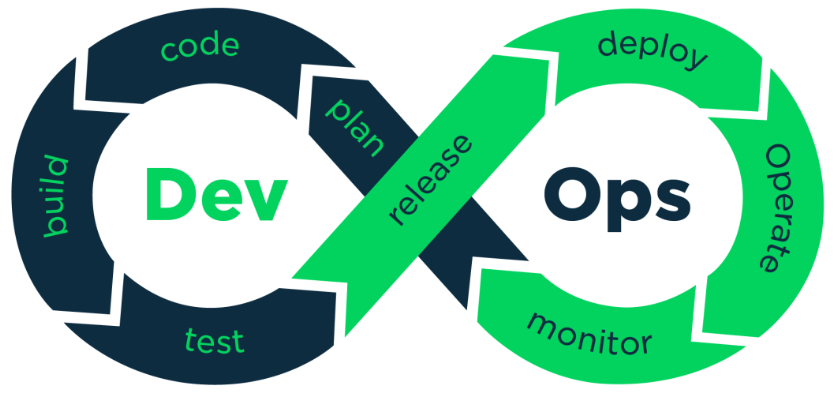

## 1.2 DevOps 工具链

DevOps兴起于2009年，近年来由于云计算、互联网的发展，促进了DevOps的基础设施及工具链的发展，涌现了一大批优秀的工具，这些工具包括开发、测试、运维的各各领域，例如：GitHub、Git/SVN、Docker、Jenkins、Hudson、Ant/Maven/Gradle、Selenium、QUnit、JMeter等。下图是DevOps相关的工具集：

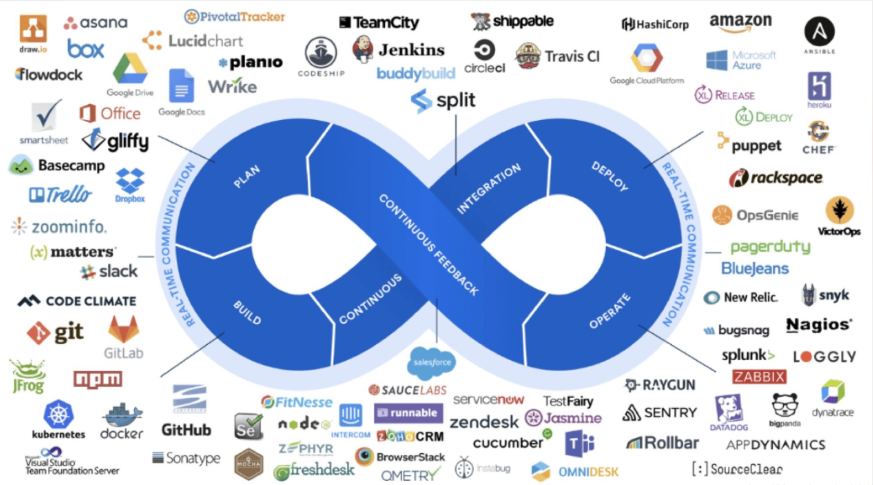

# 2. Git/GitLab

## 2.1 Git 与GitLab介绍

### Git

Git是一个开源的分布式版本控制系统，可以有效、高速地处理从很小到非常大的项目版本管理。 Git 是 Linus Torvalds 为了帮助管理 Linux 内核开发而开发的一个开放源码的版本控制软件。

**git**是用于Linux内核开发的版本控制工具。与[CVS](https://zh.wikipedia.org/wiki/%E5%8D%94%E4%BD%9C%E7%89%88%E6%9C%AC%E7%B3%BB%E7%B5%B1)、[Subversion](https://zh.wikipedia.org/wiki/Subversion)一类的集中式版本控制工具不同，它采用了分布式版本库的作法，不需要服务器端软件，就可以运作版本控制，使得源代码的发布和交流极其方便。git的速度很快，这对于诸如Linux内核这样的大项目来说自然很重要。git最为出色的是它的合并追踪（merge tracing）能力。

### GitLab

GitLab 是一个用于仓库管理系统的开源项目，使用[Git](https://baike.baidu.com/item/Git)作为代码管理工具，并在此基础上搭建起来的web服务。安装方法是参考GitLab在GitHub上的Wiki页面。

Git是一个版本控制系统，GitLab是一个远程的Git仓库，GitLab与GitHub及国内的码云类似，用户在GitLab上注册账号，上传项目到GitLab，通过GitLab对项目进行版本控制。通常企业使用GitLab在局域网搭建自己的Git代码管理仓库，不过随着云计算的发展，很多企业也开始使用提供Git仓库管理公共服务的平台，比如：码云、GitHub等。

下图是GitLab的界面图：

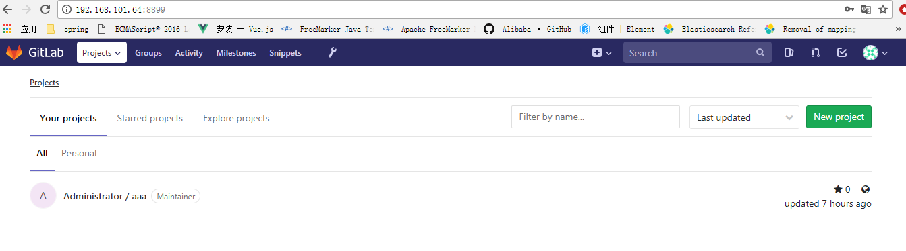

## 2.2 安装 Git及GitLab

个人电脑上安装Git，过程略。

注意：Git安装完成需配置user.name和user.email

```shell
# 查询user.name和uesr.email
git config user.name
git config user.email
# 设置：
git config ‐‐global user.name "itcast"
git config ‐‐global user.email "itcast@itcast.cn"
```

在Linux服务器上安装GitLab，安装方法见[GitLab安装文档](./GitLab安装文档.pdf) 。

注意：个人测试Git版本控制推荐建议直接使用GitHub或码云，两者提供免费创建项目的功能。

## 2.3 在GitLab创建项目

进入GitLab首页：http://192.168.101.64:8889，点击 “New Project”创建新项目

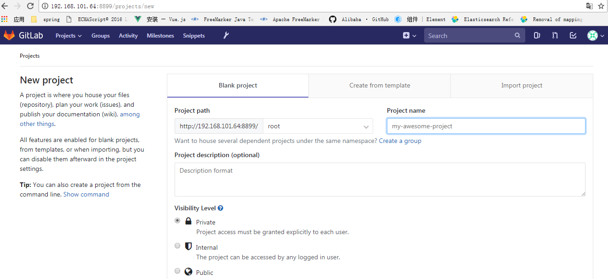

项目新建成功，进入项目主页，通过项目主页即可访问项目内容，并得到项目的Git项目仓库地址：

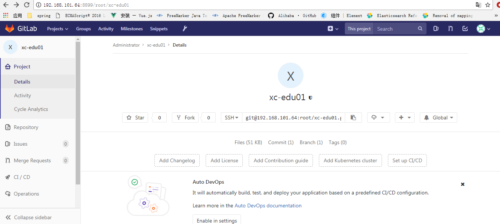

## 2.4  使用Git管理项目

在Idea中集成Git，并用Git管理学成在线项目。

### 2.4.1 设置Git

在开发电脑安装Git，并在Idea中设置Git

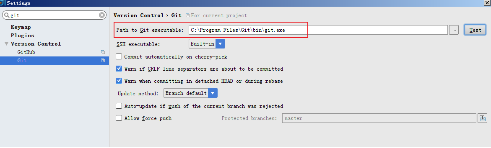

设置 修改代码后父级目录颜色变化：

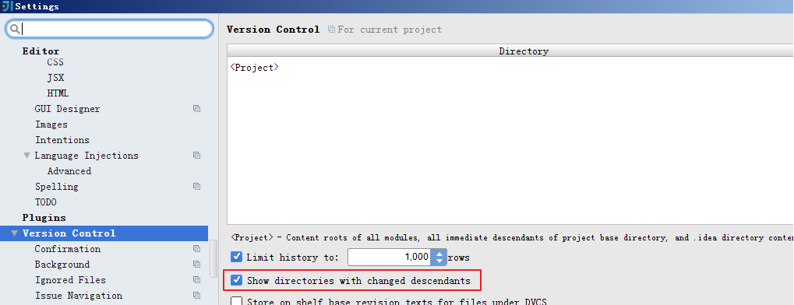

### 2.4.2 从GitLab检出项目

打开idea，按下图菜单指示从GitLab克隆项目：

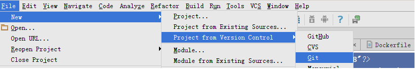

输入项目的Git仓库地址进行克隆：

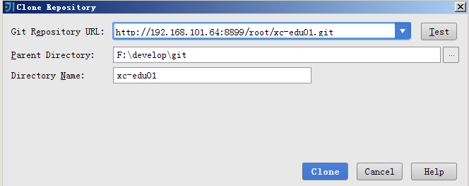

### 2.4.3 提交代码到GitLab

1. 在工程根目录创建 .gitignore

   此文件中记录了在提交代码时哪些文件或目录被忽略

2. 代码修改后文件的颜色会出现变化：

   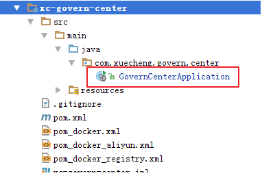

首先执行添加文件到暂存区：

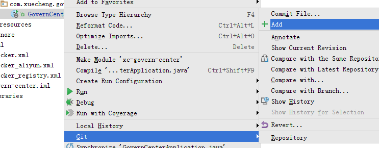

再执行commit 提交文件到本地仓库

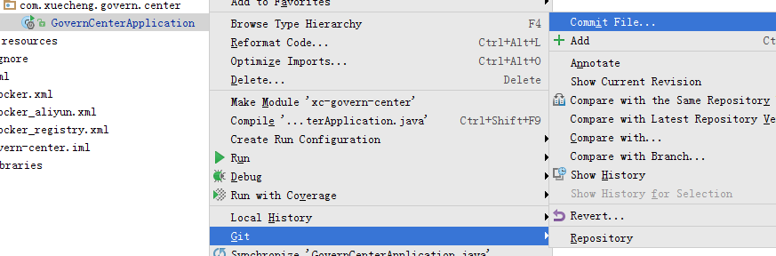

最终代码确认无误可以提交到远程仓库

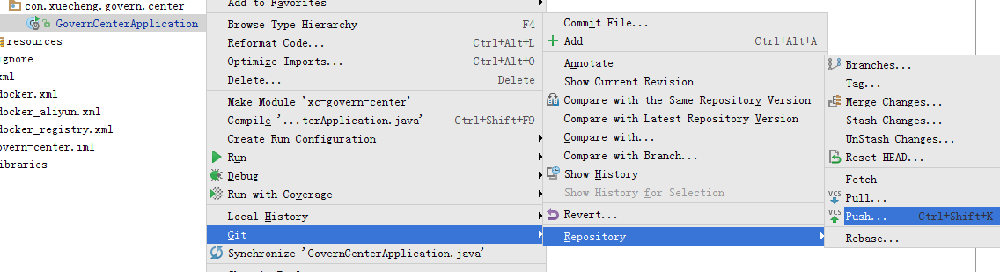

# 3. Docker

## 3.1 虚拟化技术

### 3.1.1 问题描述

互联网的发展使软件业发生了巨大的变化，其中一个显著的变化是软件的规模越来越大，基于微服务架构的软件在生产部署时遇到了这样的挑战：

1. 微服务的开发语言、操作系统、依赖库等环境配置不同，如何快速安装、迁移、配置软件？
2. 一个软件由若干微服务组成，如何快速批量部署微服务？
3. 如何有效的利于计算机资源？

针对前两个问题的思考：

传统的软件部署流程是：安装操作系统-->安装依赖软件/库-->安装软件（微服务）-->配置软件-->最终软件上线运行，面对大量的微服务及微服务集群，使用此方案不仅效率低下，而且还可能会出现环境兼容问题，显然此方案不适合用在微服务部署。

设想：如果有一项技术可以快速的将软件及所需要的各种环境配置打包、批量复制将会解决以上问题。

针对第三个问题的思考：

在一台计算机只安装一个微服务对计算机资源极大的浪费，如果安装多个微服务就可以有效的利于计算机资源，但是对于批量软件的安装部署还是会面临1、2问题。

设想：在一台计算机安装多个微服务，使用一种技术将微服务打包、复制部署，并且微服务之间隔离互不影响。

### 3.1.2 虚拟化技术

[引用百度百科](https://baike.baidu.com/item/%E8%99%9A%E6%8B%9F%E5%8C%96/547949)

虚拟化，是指通过虚拟化技术将一台计算机虚拟为多台逻辑计算机。在一台计算机上同时运行多个逻辑计算机，每个逻辑计算机可运行不同的操作系统，并且[应用程序](https://baike.baidu.com/item/%E5%BA%94%E7%94%A8%E7%A8%8B%E5%BA%8F/5985445)都可以在相互独立的空间内运行而互不影响，从而显著提高计算机的工作效率。

虚拟化使用软件的方法重新定义划分IT资源，可以实现IT资源的动态分配、灵活调度、跨域共享，提高IT资源利用率，使IT资源能够真正成为社会基础设施，服务于各行各业中灵活多变的应用需求。

总结：虚拟化技术是对软件基础设施、操作系统、软件等IT资源进行有效的管理，使用户不再受物理资源的限制，提高计算机资源的利用率。虚拟化技术是云计算的基础，例如阿里云的云主机、腾讯云等都应用了虚拟化技术。

虚拟化技术整体上包括两个方面：硬件虚拟化和软件虚拟化，具体分为：网络虚拟化、存储虚拟化、桌面虚拟化、服务器虚拟化等，我们平常说的最多的是服务器虚拟化。

服务器虚拟化就是在同一个物理服务器上运行多个虚拟机，让服务器的cpu、内存、磁盘、I/O等硬件设施为每个虚拟机服务，在每个虚拟机中运行不同的软件，虚拟机之间是隔离状态。

服务器虚拟化主要有两种技术：

1. Hypervisor也叫VMM（virtual machine monitor）即虚拟机监视器

   Hypervisor是一种将操作系统与硬件抽象分离的方法，实现在宿主机（host machine）上能同时运行多个客户机（guest machine），每个客户机就是一个虚拟机，这些虚拟机高效地分享宿主机的硬件资源。

   如下图：

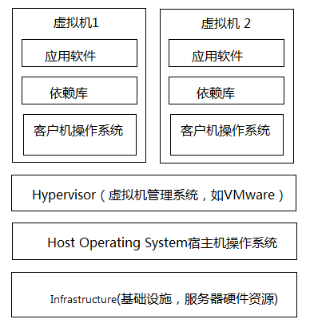

在服务器（宿主机）上安装操作系统，并安装hypervisor虚拟机管理软件，如VMware、VirtualBox等，由hypervisor管理多个虚拟机，每个虚拟机上需要安装客户操作系统、依赖库、应用软件。

2. Containers容器化技术

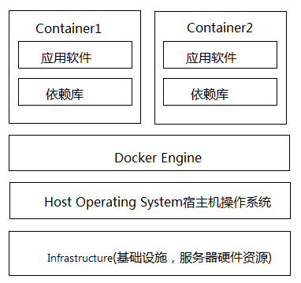

容器技术中 docker引擎取代了hypervisor，docker引擎是运行在住宿操作系统上的一个进程，该进程管理了多个docker容器，每个docker容器集成了应用软件、依赖库，容器之间相互隔离。

3. 技术对比

   **资源占用：**虚拟机由于是独立的操作系统，占用资源比docker多。

   **启动速度  :** 虚拟机包括操作系统，启动虚拟机相当于启动一个操作系统，容器则不一样，容器中只包括操作系统的内核，启动一个容器实例相当于启动一个进程，容器的启动速度比虚拟机快。

   **体积：** 容器包括操作系统内核、软件及依赖库，虚拟机不仅包括软件和依赖库还将完整的操作系统打包进去，虚拟机的体积比容器大的多。

### 3.1.3 Docker介绍

[引用百度百科](https://baike.baidu.com/item/Docker)

Docker 是一个[开源](https://baike.baidu.com/item/%E5%BC%80%E6%BA%90/246339)的应用容器引擎，让开发者可以打包他们的应用以及依赖包到一个可移植的容器中，然后发布到任何流行的 [Linux](https://baike.baidu.com/item/Linux) 机器上，也可以实现[虚拟化](https://baike.baidu.com/item/%E8%99%9A%E6%8B%9F%E5%8C%96/547949)。容器是完全使用[沙箱](https://baike.baidu.com/item/%E6%B2%99%E7%AE%B1/393318)机制，相互之间不会有任何接口。

Docker 源代码托管在 Github  上, 基于go语言并遵从 Apache2.0协议开源。

官网：https://www.docker.com/

Docker包括以下部分：

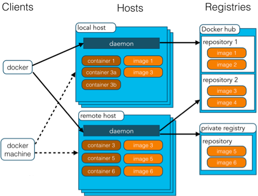

1. Docker daemon（Docker守护进程）： Docker守护进程是部署在操作系统上，负责支撑Docker Container的运行以及本地Image的管理。
2. Docker client： 用户不直接操作Docker daemon，用户通过Docker client访问Docker，Docker client提供pull、run等操作命令。
3. Docker Image： Docker 镜像就是一个只读的模板。 例如：一个镜像可以包含一个完整的 ubuntu 操作系统环境，里面仅安装了 Tomcat或用户需要的其它应用程序。 镜像可以用来创建 Docker 容器。 Docker 提供了一个很简单的机制来创建镜像或者更新现有的镜像，用户甚至可以直接从其他人那里下载一个已经做好的镜像来直接使用。
4. Docker Container： Docker 利用容器来运行应用。容器是从镜像创建的运行实例。它可以被启动、开始、停止、删除。每个容器都是相互隔离的、保证安全的平台。打个比方，镜像相当于类，容器相当于对象。
5. Docker Registry： Docker 仓库分为公开仓库（Public）和私有仓库（Private）两种形式 最大的公开仓库是Docker Hub，存放了数量庞大的镜像供用户下载。 用户也可以在本地网络内创建一个私有仓库。 当用户创建了自己的镜像之后就可以使用 push 命令将它上传到公有或者私有仓库，这样下次在另外一台机器上使用这个镜像时候，只需要从仓库上 pull 下来就可以了。

## 3.2 部署微服务到Docker

### 3.2.1 安装Docker

Docker可以运行MAC、Windows、Centos、DEBIAN、UBUNTU等操作系统上，提供社区版和企业版，本教程基于Centos安装Docker。Centos6对docker支持的不好，使用docker建议升级到centos7。

1. 在Centos7上安装Docker

```shell
# 安装docker
yum install -y docker
# 启动docker
service docker start
# 查看docker版本
docker version
```

2. 在Centos6上安装Docker

```sh
rpm -ivh http://dl.Fedoraproject.org/pub/epel/6/x86_64/epel-release-6-8.noarch.rpm
yum install -y docker-io
service docker start
```

### 3.2.2 部署流程

本项目微服务采用SpringBoot开发，将每个微服务工程打成Jar包，最终在Docker容器中运行jar，部署流程如下：

1. SpringBoot工程最终打成 Jar包
2. 创建Docker镜像
3. 创建容器
4. 启动容器

### 3.2.3 打包

1. 使用maven的打包插件：

```xml
<build>
    <plugins>
        <plugin>
            <groupId>org.springframework.boot</groupId>
            <artifactId>spring‐boot‐maven‐plugin</artifactId>
        </plugin>
    </plugins>
</build>
```

完整的Eureka工程pom.xml文件如下：

```xml-dtd
<?xml version="1.0" encoding="UTF‐8"?>
<project xmlns="http://maven.apache.org/POM/4.0.0"
         xmlns:xsi="http://www.w3.org/2001/XMLSchema‐instance"
         xsi:schemaLocation="http://maven.apache.org/POM/4.0.0
http://maven.apache.org/xsd/maven‐4.0.0.xsd">
    <parent>
        <artifactId>xc‐framework‐parent</artifactId>
        <groupId>com.xuecheng</groupId>
		<version>1.0‐SNAPSHOT</version>
        <relativePath>../xc‐framework‐parent/pom.xml</relativePath>
    </parent>
    <modelVersion>4.0.0</modelVersion>
    <artifactId>xc‐govern‐center</artifactId>
    <dependencies>
        <!‐‐ 导入Eureka服务的依赖 ‐‐>
        <dependency>
            <groupId>org.springframework.cloud</groupId>
            <artifactId>spring‐cloud‐starter‐netflix‐eureka‐server</artifactId>
        </dependency>
    </dependencies>
    <build>
        <finalName>${project.artifactId}‐${project.version}</finalName>
        <plugins>
            <plugin>
                <groupId>org.springframework.boot</groupId>
                <artifactId>spring‐boot‐maven‐plugin</artifactId>
            </plugin>
        </plugins>
    </build>
</project>
```

2. maven打包

   在工程目录运行：```mvn clear package```

   或通过IDEA执行clear package打包命令。

打包成功，如下图：

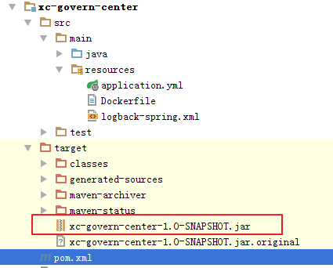

### 3.2.4 创建镜像

将上一步的 jar包拷贝到Linux服务器，准备创建镜像。

测试jar包是否可以运行，执行：java -jar xc-govern-center-1.0-SNAPSHOT.jar

在xc-govern-center-1.0-SNAPSHOT.jar 位置编写Dockerfile文件

```shell
FROM java:8
ENV ARTIFACTID xc‐govern‐center
ENV ARTIFACTVERSION 1.0‐SNAPSHOT
ENV HOME_PATH /home
WORKDIR $HOME_PATH
ADD /$ARTIFACTID‐$ARTIFACTVERSION.jar $HOME_PATH/$ARTIFACTID.jar
ENTRYPOINT ["java", "‐jar", "xc‐govern‐center.jar"]
```

在Dockerfile文件所在目录执行：docker build -t xc-govern-center:1.0-SNAPSHOT .

镜像创建成功，查询镜像：

```shell
[root@localhost xc‐govern‐center]# docker images
REPOSITORY                                                        TAG                 IMAGE ID  
         CREATED             SIZE
xc‐govern‐center                                                  1.0‐SNAPSHOT       
ad14dcce6666        35 seconds ago      684 MB
```

### 3.2.5 创建容器

基于xc-govern-center:1.0-SNAPSHOT镜像创建容器，容器名称为xc-govern-center-test

```shell
docker create ‐‐name xc‐govern‐center‐test ‐t ‐p 50101:50101 ‐e PORT=50101  ‐e
EUREKA_SERVER=http://192.168.101.64:50101/eureka/,http://192.168.101.64:50102/eureka/  xc‐
govern‐center:1.0‐SNAPSHOT
```

容器创建成功，可通过docker ps -a命令查看

### 3.2.6 启动容器

docker start xc-govern-center-test

容器启动完成可以通过docker ps 查询正在运行中的容器。

```shell
[root@localhost xc‐govern‐center]# docker ps
CONTAINER ID        IMAGE                           COMMAND                  CREATED            
STATUS                 PORTS                                                  NAMES
688cabeef187        xc‐govern‐center:1.0‐SNAPSHOT   "java ‐jar xc‐gove..."   2 minutes ago      
Up 2 minutes           0.0.0.0:50101‐>50101/tcp                               xc‐govern‐center‐
test
```

### 3.2.7 停止与删除

要删除的一个镜像重新创建，需要通过如下步骤：

1. 停止正在运行的容器

```shell
docker stop 容器名
# 例如：docker stop xc-govern-center-test
```

2. 删除容器

```shell
docker rm 容器名
# 例如：docker rm xc-govern-center-test
```

3. 删除镜像

```shell
docker rmi 镜像名或镜像Id
#例如：docker rmi xc-govern-center:1.0-SNAPSHOT
```

### 3.2.8 maven构建镜像

上边构建的过程是通过手工一步一步完成，maven提供docker-maven-plugin插件可完成从打包到构建镜像、构建容器等过程。

1. 编写pom_docker.xml

```xml-dtd
<?xml version="1.0" encoding="UTF‐8"?>
<project xmlns="http://maven.apache.org/POM/4.0.0"
         xmlns:xsi="http://www.w3.org/2001/XMLSchema‐instance"
         xsi:schemaLocation="http://maven.apache.org/POM/4.0.0
http://maven.apache.org/xsd/maven‐4.0.0.xsd">
    <parent>
        <artifactId>xc‐framework‐parent</artifactId>
        <groupId>com.xuecheng</groupId>
        <version>1.0‐SNAPSHOT</version>
        <relativePath>../xc‐framework‐parent/pom.xml</relativePath>
    </parent>
    <modelVersion>4.0.0</modelVersion>
    <artifactId>xc‐govern‐center</artifactId>
    <version>1.0‐SNAPSHOT</version>
    <dependencies>
        <!‐‐ 导入Eureka服务的依赖 ‐‐>
        <dependency>
            <groupId>org.springframework.cloud</groupId>
            <artifactId>spring‐cloud‐starter‐netflix‐eureka‐server</artifactId>
        </dependency>
    </dependencies>
    <build>
        <finalName>${project.artifactId}‐${project.version}</finalName>
        <plugins>
            <plugin>
                <groupId>org.springframework.boot</groupId>
                <artifactId>spring‐boot‐maven‐plugin</artifactId>
            </plugin>
            <plugin>
                <groupId>com.spotify</groupId>
                <artifactId>docker‐maven‐plugin</artifactId>
                <version>1.0.0</version>
                <!‐‐docker镜像相关的配置信息‐‐>
                <configuration>
                    <!‐‐镜像名，这里用工程名‐‐>
                    <imageName>${project.artifactId}‐${project.version}</imageName>
                    <!‐‐Dockerfile文件所在目录‐‐>
                    <dockerDirectory>${project.basedir}/src/main/resources</dockerDirectory>
                    <!‐‐TAG,这里用工程版本号‐‐>
                    <imageTags>
                        <imageTag>${project.version}</imageTag>
                    </imageTags>
                    <imageName>${project.artifactId}:${project.version}</imageName>
                    <!‐‐构建镜像的配置信息‐‐>
                    <resources>
                        <resource>
                            <targetPath>/</targetPath>
                            <directory>${project.build.directory}</directory>
                            <include>${project.artifactId}‐${project.version}.jar</include>
                        </resource>
                    </resources>
                </configuration>
            </plugin>
        </plugins>
    </build>
</project>
```

2. 将Dockerfile文件拷贝到src/main/resource下
3. 删除之前创建的xc-govern-center镜像
4. 进入工程根目录（pom_docker.xml所在目录）执行

```shell
mvn ‐f pom_docker.xml clean package ‐DskipTests docker:build
```

​	创建镜像成功，结果如下：

```shell
Successfully built 64682c9ba311
[INFO] Built xc‐govern‐center:1.0‐SNAPSHOT
[INFO] Tagging xc‐govern‐center:1.0‐SNAPSHOT with 1.0‐SNAPSHOT
[INFO] ‐‐‐‐‐‐‐‐‐‐‐‐‐‐‐‐‐‐‐‐‐‐‐‐‐‐‐‐‐‐‐‐‐‐‐‐‐‐‐‐‐‐‐‐‐‐‐‐‐‐‐‐‐‐‐‐‐‐‐‐‐‐‐‐‐‐‐‐‐‐‐‐
[INFO] BUILD SUCCESS
[INFO] ‐‐‐‐‐‐‐‐‐‐‐‐‐‐‐‐‐‐‐‐‐‐‐‐‐‐‐‐‐‐‐‐‐‐‐‐‐‐‐‐‐‐‐‐‐‐‐‐‐‐‐‐‐‐‐‐‐‐‐‐‐‐‐‐‐‐‐‐‐‐‐‐
[INFO] Total time: 7.409 s
[INFO] Finished at: 2018‐07‐19T14:21:16+08:00
[INFO] Final Memory: 52M/414M
[INFO] ‐‐‐‐‐‐‐‐‐‐‐‐‐‐‐‐‐‐‐‐‐‐‐‐‐‐‐‐‐‐‐‐‐‐‐‐‐‐‐‐‐‐‐‐‐‐‐‐‐‐‐‐‐‐‐‐‐‐‐‐‐‐‐‐‐‐‐‐‐‐‐‐
```

# 4. 持续集成

## 4.1  持续集成介绍

### 4.1.1问题描述

传统的软件开发流程如下：

1. 项目经理分配模块给开发人员
2. 每个模块的开发人员并行开发，并进行单元测试
3. 开发完毕，将代码集成部署到测试服务器，测试人员进行测试。
4. 测试人员发现bug，提交bug、开发人员修改bug
5. bug修改完毕再次集成、测试。

问题描述：

1. 模块之间依赖关系复杂，在集成时发现大量bug
2. 测试人员等待测试时间过长
3. 软件交付无法保障

解决上述问题的思考：

1. 能否把集成测试时间提前？
2. 能否使用自动化工具代替人工集成部署的过程？

### 4.1.2 什么是持续集成

持续集成是一种软件开发实践，即团队开发成员经常集成他们的工作，通常每个成员每天至少集成一次，也就意味着每天可能会发生多次集成。每次集成都通过自动化的构建（包括编译，发布，自动化测试）来验证，从而尽早地发现集成错误。

持续集成（Continuous integration）简称CI，持续集成的思想是每天要多次将代码合并到主干，并进行集成、测试，这样就可以提早发现错误，进行修正。持久集成也属于DevOps

持续集成的好处：

1. 自动化集成部署，提高了集成效率。
2. 更快的修复问题。
3. 更快的进行交付。
4. 提高了产品质量。

### 4.1.3  本项目持续集成流程

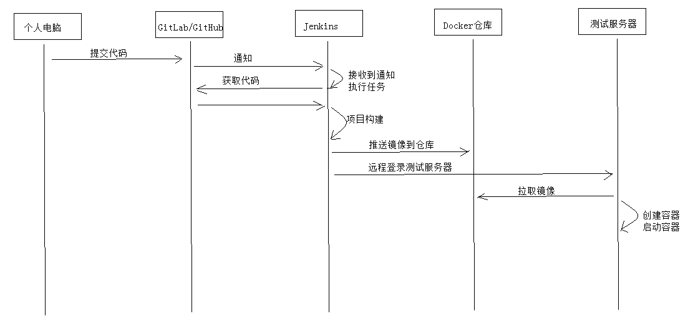

## 4.2  搭建环境

### 4.2.1 安装 Jenkins

Jenkins是一个领先的开源自动化服务器，可用于自动化构建，测试，部署软件等相关任务。

官网地址：https://jenkins.io

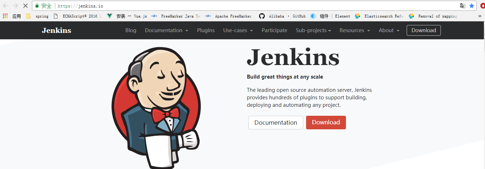

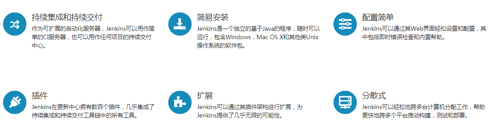

安装方法见[Jenkins安装文档](./Jenkins安装文档.pdf)。

### 4.2.2 安装GitLab

GitLab 是一个用于仓库管理系统的开源项目，使用Git作为代码管理工具，并在此基础上搭建起来的web服务。

GitLab与GitHub的功能相似，通常企业使用GitLab在局域网搭建自己的Git代码管理仓库。

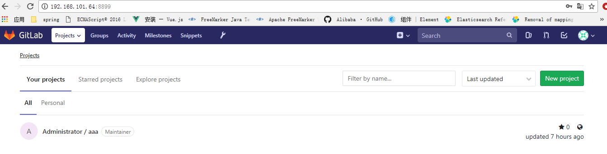

安装方法见[GitLab安装文档](./GitLab安装文档.pdf)

### 4.2.3 编写Pom.xml

本例子将xc-govern-center工程使用Jenkins进行构建。

在xc-govern-center工程根目录编写pom_docker_registry.xml

此文件相比工程原有pom.xml增加了docker-maven-plugin插件，其作用是构建docker镜像并将镜像推送到Docker私有仓库（192.168.101.64:5000）。

```xml-dtd
<?xml version="1.0" encoding="UTF‐8"?>
<project xmlns="http://maven.apache.org/POM/4.0.0"
         xmlns:xsi="http://www.w3.org/2001/XMLSchema‐instance"
         xsi:schemaLocation="http://maven.apache.org/POM/4.0.0
http://maven.apache.org/xsd/maven‐4.0.0.xsd">
    <parent>
        <artifactId>xc‐framework‐parent</artifactId>
        <groupId>com.xuecheng</groupId>
        <version>1.0‐SNAPSHOT</version>
        <relativePath>../xc‐framework‐parent/pom.xml</relativePath>
    </parent>
    <modelVersion>4.0.0</modelVersion>
    <artifactId>xc‐govern‐center</artifactId>
    <version>1.0‐SNAPSHOT</version>
    <dependencies>
        <!‐‐ 导入Eureka服务的依赖 ‐‐>
        <dependency>
            <groupId>org.springframework.cloud</groupId>
            <artifactId>spring‐cloud‐starter‐netflix‐eureka‐server</artifactId>
        </dependency>
    </dependencies>
    <build>
        <finalName>${project.artifactId}‐${project.version}</finalName>
        <plugins>
            <plugin>
                <groupId>org.springframework.boot</groupId>
                <artifactId>spring‐boot‐maven‐plugin</artifactId>
            </plugin>
            <plugin>
                <groupId>com.spotify</groupId>
                <artifactId>docker‐maven‐plugin</artifactId>
                <version>1.0.0</version>
                <!‐‐docker镜像相关的配置信息‐‐>
                <configuration>
                    <!‐‐镜像名，这里用工程名‐‐>
                    <imageName>${project.artifactId}‐${project.version}</imageName>
                    <!‐‐Dockerfile文件所在目录‐‐>
                    <dockerDirectory>${project.basedir}/src/main/resources</dockerDirectory>
                    <!‐‐TAG,这里用工程版本号‐‐>
                    <imageTags>
                        <imageTag>${project.version}</imageTag>
                    </imageTags>
                    <registryUrl>192.168.101.64:5000</registryUrl>
                    <pushImage>true</pushImage>
                    <imageName>192.168.101.64:5000/${project.artifactId}:${project.version}
					</imageName>
                    <!‐‐构建镜像的配置信息‐‐>
                    <resources>
                        <resource>
                            <targetPath>/</targetPath>
                            <directory>${project.build.directory}</directory>
                            <include>${project.artifactId}‐${project.version}.jar</include>
                        </resource>
                    </resources>
                </configuration>
            </plugin>
        </plugins>
    </build>
</project>
```

## 4.4 创建持续集成任务

### 4.4.1创建构建任务

创建学成在线的构建任务：

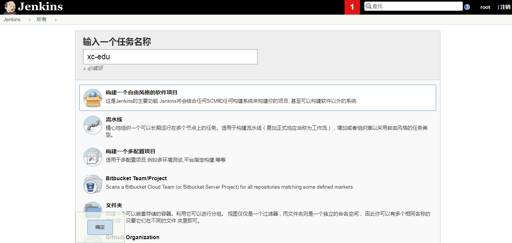

### 4.4.2 配置git仓库

1. 配置git凭证

   此凭证用于远程从git仓库克隆工程源代码

   输入git仓库的账号和密码，这里如果使用码云，下边需要配置码云的账号和密码。

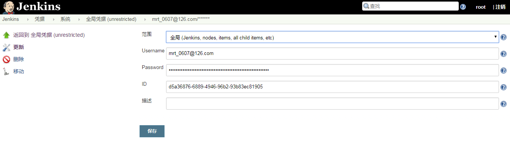

2. 配置git仓库地址，此地址即xc-edu项目的地址

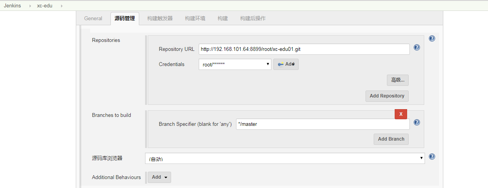

### 4.4.3 maven构建配置

目标：

​	使用jenkins重复构建不要产生重复镜像

​	使用jekins停止容器、删除容器、删除镜像之间进行判断

构建过程分为三步：

​	本例子以构建xc-govern-center工程为例，其它工程构建方式类似。

 1. 使用shell脚本停止容器、删除容器、删除镜像

    远程登录192.168.101.64(测试服务器)

    停止xc-govern-center容器

    删除xc-govern-center容器

    删除192.168.101.64:5000/xc-govern-center:1.0-SNAPSHOT镜像

    shell脚本如下：

```shell
 #!/bin/bash
result=$(docker ps | grep "192.168.101.64:5000/xc‐govern‐center")
if [[ "$result" != "" ]]
then
echo "stop xc‐govern‐center"
docker stop xc‐govern‐center
fi
result1=$(docker ps ‐a | grep "192.168.101.64:5000/xc‐govern‐center")
if [[ "$result1" != "" ]]
then
echo "rm xc‐govern‐center"
docker rm xc‐govern‐center
fi
result2=$(docker images | grep "192.168.101.64:5000/xc‐govern‐center")
if [[ "$result2" != "" ]]
then
echo "192.168.101.64:5000/xc‐govern‐center:1.0‐SNAPSHOT"
docker rmi 192.168.101.64:5000/xc‐govern‐center:1.0‐SNAPSHOT
fi
```


2. 执行maven构建：

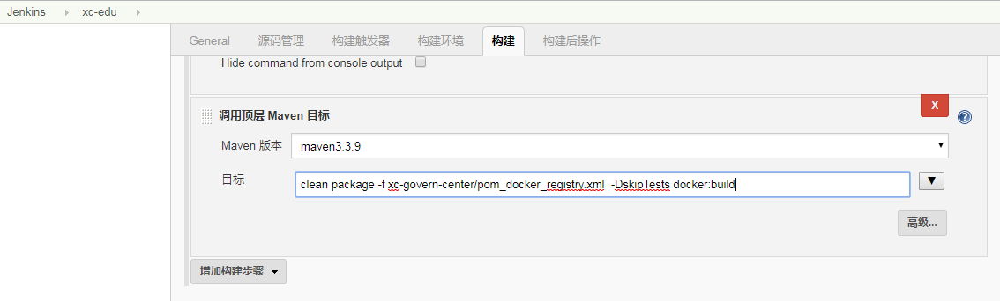

执行如下maven指令：

```shell
clean package ‐f xc‐govern‐center/pom_docker_registry.xml  ‐DskipTests docker:build
```

3. 拉取镜像，创建容器，启动容器

   从docker私有仓库拉取镜像并创建容器，启动容器

   显示容器运行日志

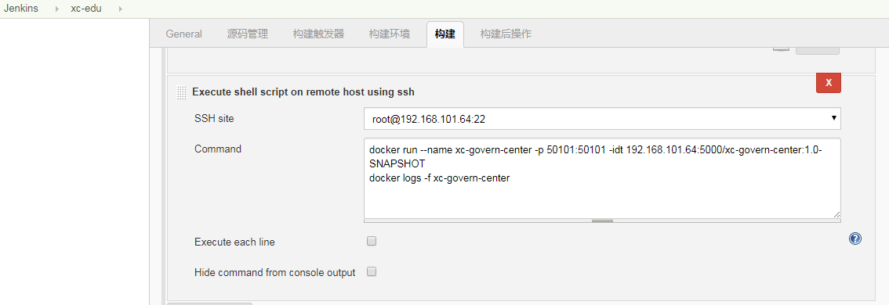

```shell
docker run ‐‐name xc‐govern‐center ‐p 50101:50101 ‐idt 192.168.101.64:5000/xc‐govern‐center:1.0‐SNAPSHOT
docker logs ‐f xc‐govern‐center
```

### 4.4.4 执行任务

1. 进入任务页面，点击“立即构建”

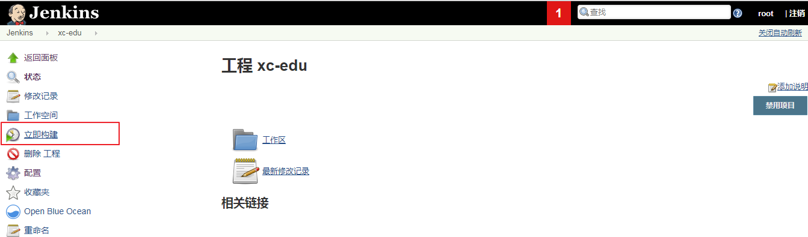

2. 开始构建，查看日志

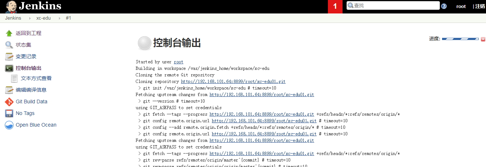

### 4.4.5 自动构建

使用 Gitlab提供的webhook功能可以实现开发人员将代码push到Git仓库自动进行构建。

1. 设置webhook

   参考“GitLab安装文档”配置webhook

2. 在Idea中修改项目代码，push到GitLab。
3. Jenkins任务收到GitLab通知自动执行构建。

